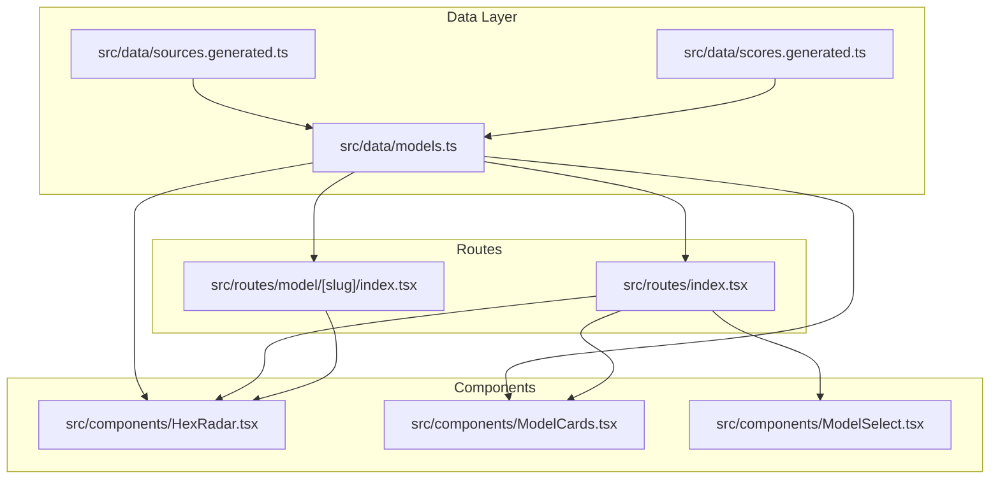
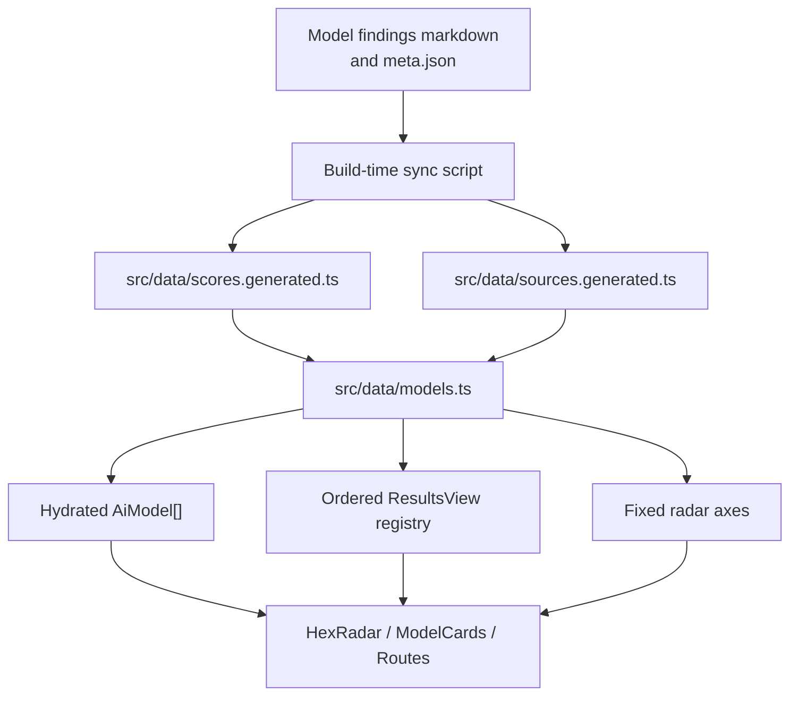
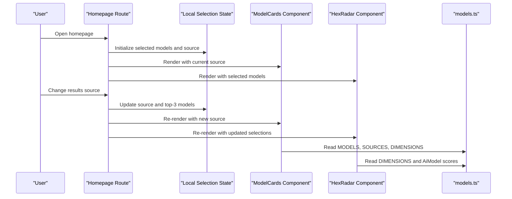
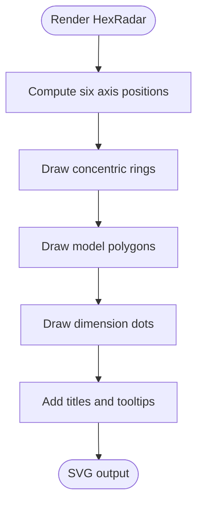
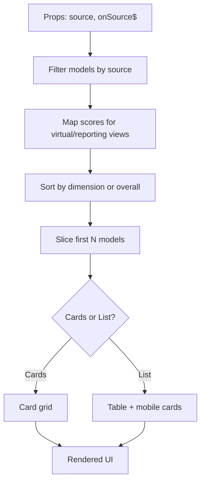
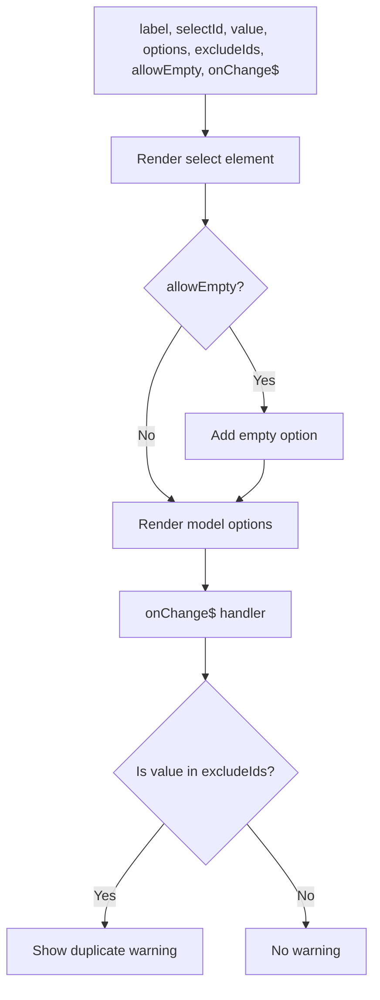
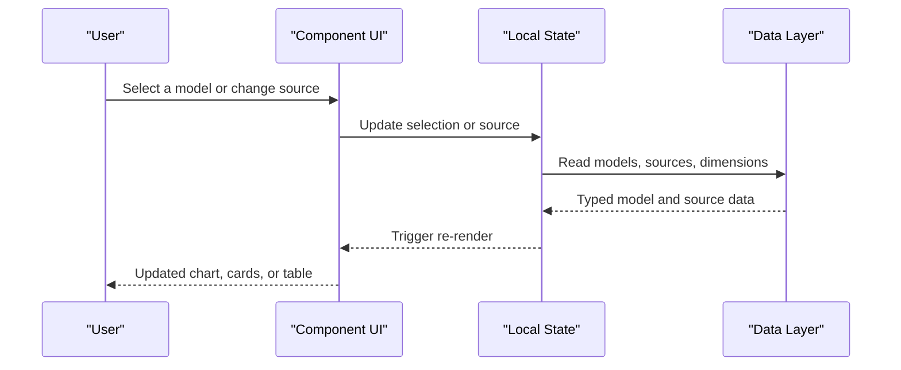
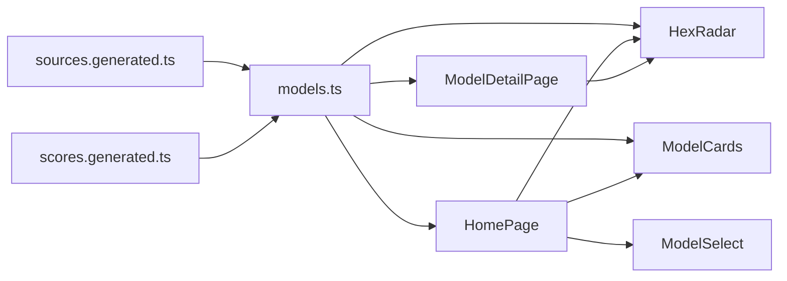
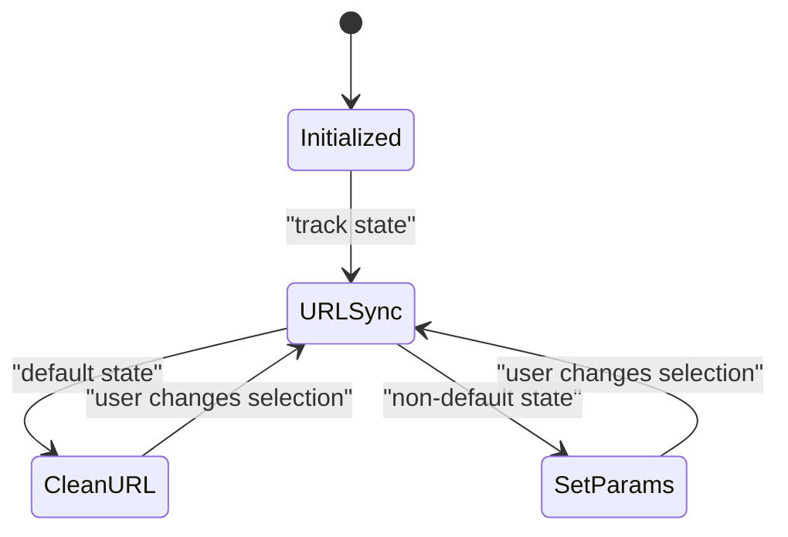

# API Reference

<cite>
**Referenced Files in This Document**
- [models.ts](file://src/data/models.ts)
- [sources.generated.ts](file://src/data/sources.generated.ts)
- [scores.generated.ts](file://src/data/scores.generated.ts)
- [HexRadar.tsx](file://src/components/HexRadar.tsx)
- [ModelCards.tsx](file://src/components/ModelCards.tsx)
- [ModelSelect.tsx](file://src/components/ModelSelect.tsx)
- [index.tsx (homepage)](file://src/routes/index.tsx)
- [index.tsx (model detail)](file://src/routes/model/[slug]/index.tsx)
</cite>

## Table of Contents
1. [Introduction](#introduction)
2. [Project Structure](#project-structure)
3. [Core Data Interfaces](#core-data-interfaces)
4. [Public Component APIs](#public-component-apis)
5. [Data Layer APIs](#data-layer-apis)
6. [Architecture Overview](#architecture-overview)
7. [Detailed Component Analysis](#detailed-component-analysis)
8. [Dependency Analysis](#dependency-analysis)
9. [Event Handling and State Management](#event-handling-and-state-management)
10. [Error Handling, Type Safety, and Validation](#error-handling-type-safety-and-validation)
11. [Performance Considerations](#performance-considerations)
12. [Troubleshooting Guide](#troubleshooting-guide)
13. [Conclusion](#conclusion)

## Introduction
This document describes the internal ModelComp interfaces and component APIs used to compare AI models. It covers:

- The core data model for models and scores.
- The result-source system that lets users view rankings by average, virtual dimensions, or reporting agents.
- Public component interfaces for radar visualization, model cards, and model selection.
- Data layer functions for accessing models, computing sort views, and managing result sources.
- Event handling patterns, state management, lifecycle behavior, error handling, type safety, and extension points.

The goal is to help developers understand how to read model data, render comparisons, extend the platform with new components, and integrate custom result sources safely.

## Project Structure
At a high level, ModelComp separates data from UI:

- `src/data/models.ts` defines the main domain types (`AiModel`, `ModelScores`) and exports computed model lists, source definitions, and sorting utilities.
- `src/data/sources.generated.ts` is generated by the build pipeline and contains the union of supported result sources plus their registry metadata.
- `src/data/scores.generated.ts` is generated by the build pipeline and contains pre-parsed numeric scores per model and source.
- `src/components/HexRadar.tsx` renders a hexagonal radar chart comparing selected models.
- `src/components/ModelCards.tsx` renders an all-models list and table with sorting controls.
- `src/components/ModelSelect.tsx` renders a reusable dropdown for selecting models.
- `src/routes/index.tsx` is the homepage controller that manages selected models, results source, and URL synchronization.
- `src/routes/model/[slug]/index.tsx` is the per-model page that shows one model’s scores and ratings by other agents.



**Diagram sources**
- [models.ts:18-30](file://src/data/models.ts#L18-L30)
- [sources.generated.ts:5-80](file://src/data/sources.generated.ts#L5-L80)
- [HexRadar.tsx:1-12](file://src/components/HexRadar.tsx#L1-L12)
- [ModelCards.tsx:1-9](file://src/components/ModelCards.tsx#L1-L9)
- [ModelSelect.tsx:1-18](file://src/components/ModelSelect.tsx#L1-L18)
- [index.tsx (homepage):1-8](file://src/routes/index.tsx#L1-L8)
- [index.tsx (model detail):1-6](file://src/routes/model/[slug]/index.tsx#L1-L6)

**Section sources**
- [models.ts:1-30](file://src/data/models.ts#L1-L30)
- [sources.generated.ts:1-80](file://src/data/sources.generated.ts#L1-L80)
- [HexRadar.tsx:1-12](file://src/components/HexRadar.tsx#L1-L12)
- [ModelCards.tsx:1-9](file://src/components/ModelCards.tsx#L1-L9)
- [ModelSelect.tsx:1-18](file://src/components/ModelSelect.tsx#L1-L18)
- [index.tsx (homepage):1-8](file://src/routes/index.tsx#L1-L8)
- [index.tsx (model detail):1-6](file://src/routes/model/[slug]/index.tsx#L1-L6)

## Core Data Interfaces
This section documents the internal data contracts that power both visualization and ranking logic.

### AiModel Interface
`AiModel` represents a tracked AI model. It includes stable identity fields, display text, filesystem slug, default scores, per-source scores, and curated metadata.

| Field | Type | Meaning |
|---|---|---|
| `id` | `string` | Stable model identifier used for selection and comparison. |
| `name` | `string` | Human-readable model name. |
| `short` | `string` | Short description shown in cards and tables. |
| `slug` | `string` | Filesystem-safe folder name under `model/`. Used for routing. |
| `scores` | `ModelScores` | Default “average” scores used when no specific source is selected. |
| `sources` | `Partial<Record<SourceKey, ModelScores>>` | Per-reporting-agent score sets; the results selector swaps `scores` for one of these. |
| `meta.contextWindow` | `string` | Context window information. |
| `meta.modalities` | `string` | Supported input/output modalities. |
| `meta.pricingNote` | `string` | Pricing note displayed in cards and tables. |
| `meta.freeTierNote` | `string \| undefined` | Optional free-tier explanation. |
| `meta.pricingTiers` | `string[] \| undefined` | Optional stacked pricing tiers. |
| `meta.noFreeId` | `boolean \| undefined` | Indicates paid fallback when no free tier ID exists. |

**Section sources**
- [models.ts:56-77](file://src/data/models.ts#L56-L77)

### ModelScores Interface
`ModelScores` is the normalized scoring shape used across charts, tables, and sorting.

| Field | Type | Meaning |
|---|---|---|
| `tool` | `number` | Tool-use performance score. |
| `reasoning` | `number` | Reasoning benchmark score. |
| `context` | `number` | Context-window score. |
| `multimodal` | `number` | Multimodal capability score. |
| `coding` | `number` | Coding and software-engineering score. |
| `cost` | `number` | Cost-efficiency score. |
| `overall` | `number` | Overall score used for primary ranking. |

**Section sources**
- [models.ts:46-54](file://src/data/models.ts#L46-L54)

### SourceKey Union Type
`SourceKey` is a string union representing every registered reporting agent plus the canonical `average` source. It is auto-generated and should not be edited manually.

| Category | Examples |
|---|---|
| Canonical average | `"average"` |
| Reporting agents | `"big-pickle"`, `"Gemini 3.5 Flash Lite"`, `"Claude Sonnet 4.6"`, `"GPT 5.6 Terra"`, etc. |

The full union is maintained in the generated file and grows as new agents are added through the sync pipeline.

**Section sources**
- [sources.generated.ts:5-66](file://src/data/sources.generated.ts#L5-L66)

### Supporting Result Types
These types define the selectable result surface:

| Type | Description |
|---|---|
| `ViewKey` | Virtual sort keys such as `"overall"`, `"tool"`, `"reason"`, `"context"`, `"cost"`, `"code"`, `"multi"`. |
| `ResultsView` | Any selectable result source: either a real `SourceKey` or a virtual `ViewKey`. |
| `DimensionKey` | One of the six fixed radar axes: `tool`, `reasoning`, `context`, `multimodal`, `coding`, `cost`. |
| `SourceDef` | Registry entry describing a source key, label, source file, and optional tracked model slug. |

**Section sources**
- [sources.generated.ts:68-80](file://src/data/sources.generated.ts#L68-L80)
- [models.ts:121-163](file://src/data/models.ts#L121-L163)

## Public Component APIs
ModelComp exposes three public-facing Qwik components. They are designed to be reused inside routes and custom pages.

### HexRadar Component
`HexRadar` renders a hexagonal radar chart comparing up to several models along the six fixed dimensions.

#### Props
| Prop | Type | Required | Default | Description |
|---|---|---:|---|---|
| `series` | `RadarDatum[]` | Yes | — | Array of model series to draw. Each series must include a model and a color. |

#### RadarDatum Shape
| Field | Type | Description |
|---|---|---|
| `model` | `AiModel` | The model whose scores are plotted. |
| `color` | `string` | Visual color for the polygon and dots. |

#### Behavior
- Uses the fixed `DIMENSIONS` order.
- Applies non-linear radial scaling so the top range receives visual emphasis.
- Renders concentric rings at 25, 50, 75, and 100.
- Shows axis labels and tooltips with contextual details such as context window, modalities, and pricing notes.
- Is accessible via SVG title and description elements.

#### Usage Example
```tsx
import { HexRadar } from "./components/HexRadar";
import { MODELS, MODEL_COLORS } from "./data/models";

const topModels = MODELS.slice(0, 3);

<HexRadar
  series={topModels.map((m, i) => ({
    model: m,
    color: MODEL_COLORS[i % MODEL_COLORS.length],
  }))}
/>
```

**Section sources**
- [HexRadar.tsx:5-12](file://src/components/HexRadar.tsx#L5-L12)
- [HexRadar.tsx:62-166](file://src/components/HexRadar.tsx#L62-L166)
- [models.ts:121-166](file://src/data/models.ts#L121-L166)

### ModelCards Component
`ModelCards` displays all tracked models in either card or list view, with sorting by dimension or overall score.

#### Props
| Prop | Type | Required | Default | Description |
|---|---|---:|---|---|
| `source` | `ResultsView` | Yes | — | Current result source: average, virtual dimension, or reporting agent. |
| `onSource$` | `QRL<(source: ResultsView) => void>` | Yes | — | Handler invoked when the user changes the active sort/source. |

#### Behavior
- Supports two display modes: cards and list.
- Filters out sources that do not apply to a model unless viewing average or virtual views.
- Sorts by the selected dimension for virtual views, otherwise by overall score.
- Provides header-driven sorting in list mode.
- Paginates visible rows and supports “Show more” and “Show all”.
- Displays free/paid indicators, context window, modalities, pricing notes, and exact scores.

#### Usage Example
```tsx
import { ModelCards } from "./components/ModelCards";
import { useState } from "@builder.io/qwik";

function Page() {
  const [source, setSource] = useState("average");

  return (
    <ModelCards
      source={source}
      onSource$={(newSource) => setSource(newSource)}
    />
  );
}
```

**Section sources**
- [ModelCards.tsx:6-9](file://src/components/ModelCards.tsx#L6-L9)
- [ModelCards.tsx:13-28](file://src/components/ModelCards.tsx#L13-L28)
- [ModelCards.tsx:30-367](file://src/components/ModelCards.tsx#L30-L367)

### ModelSelect Component
`ModelSelect` renders a labeled `<select>` dropdown for choosing a model by id.

#### Props
| Prop | Type | Required | Default | Description |
|---|---|---:|---|---|
| `label` | `string` | Yes | — | Accessible label for the dropdown. |
| `selectId` | `string` | Yes | — | DOM `id` for the select element. |
| `value` | `string` | Yes | — | Currently selected model id. |
| `options` | `ModelOption[]` | Yes | — | Available options. |
| `excludeIds` | `string[]` | Yes | — | Model ids already selected elsewhere; duplicates are highlighted. |
| `allowEmpty` | `boolean` | No | `true` | Whether to show an empty “— Choose —” option. |
| `onChange$` | `QRL<(id: string) => void>` | Yes | — | Handler invoked with the selected model id. |

#### ModelOption Shape
| Field | Type | Description |
|---|---|---|
| `id` | `string` | Model id matching `AiModel.id`. |
| `name` | `string` | Display name. |

#### Behavior
- Renders an optional empty option.
- Highlights duplicate selections against `excludeIds`.
- Emits the selected id through `onChange$`.

#### Usage Example
```tsx
import { ModelSelect } from "./components/ModelSelect";
import { MODELS } from "./data/models";

<ModelSelect
  label="Compare model A"
  selectId="model-a"
  value={selectedA}
  options={MODELS.map(m => ({ id: m.id, name: m.name }))}
  excludeIds={[selectedB, selectedC]}
  onChange$={(id) => setSelectedA(id)}
/>
```

**Section sources**
- [ModelSelect.tsx:4-18](file://src/components/ModelSelect.tsx#L4-L18)
- [ModelSelect.tsx:20-47](file://src/components/ModelSelect.tsx#L20-L47)

## Data Layer APIs
The data layer centralizes model hydration, source registration, and sorting logic. Consumers should prefer the exported constants and functions rather than reading raw markdown files.

### Exposed Types
| Export | Purpose |
|---|---|
| `SourceKey` | Registered reporting-agent source keys. |
| `SourceDef` | Registry metadata for each source. |
| `ViewKey` | Virtual sort-view keys. |
| `ResultsView` | Union of real sources and virtual views. |
| `DimensionKey` | Fixed radar-axis keys. |

These types are re-exported from `models.ts` but originate from `sources.generated.ts` and the fixed `DIMENSIONS` array.

**Section sources**
- [models.ts:18-30](file://src/data/models.ts#L18-L30)
- [sources.generated.ts:5-80](file://src/data/sources.generated.ts#L5-L80)
- [models.ts:121-163](file://src/data/models.ts#L121-L163)

### Constants
| Constant | Type | Description |
|---|---|---|
| `MODELS` | `AiModel[]` | Hydrated, sorted list of tracked models. Built from meta files and generated scores. |
| `DIMENSIONS` | readonly dimension descriptors | Fixed axis order and labels for the radar chart. |
| `MODEL_COLORS` | `string[]` | Series colors for model slots A, B, C. |
| `VIRTUAL_VIEWS` | `{ key, label, dim }[]` | Virtual sort views for the results-source dropdown. |
| `SOURCES` | `{ key, label, file, slug? }[]` | Ordered results-source entries including average, virtual views, and reporting agents. |

**Section sources**
- [models.ts:121-166](file://src/data/models.ts#L121-L166)
- [models.ts:227-241](file://src/data/models.ts#L227-L241)
- [models.ts:251-329](file://src/data/models.ts#L251-L329)

### Functions
| Function | Signature | Return Value | Description |
|---|---|---|---|
| `virtualDimFor` | `(source: ResultsView) => DimensionKey \| undefined` | Dimension key or undefined | Returns the virtual dimension if the source is a virtual view. |
| `sortSourceFor` | `(dim: DimensionKey \| "overall") => ResultsView` | `ResultsView` | Maps a dimension or `"overall"` to the corresponding results source. |
| `getModel` | `(id: string) => AiModel \| undefined` | Model or undefined | Finds a model by its stable id. |
| `checkOverallScores` | `() => void` | `void` | Development-only validation that warns when overall scores mismatch expected dimension means. |
| `slugForSource` | `(source: ResultsView) => string \| undefined` | Slug or undefined | Looks up the tracked model slug for a reporting-agent source. |

**Section sources**
- [models.ts:260-274](file://src/data/models.ts#L260-L274)
- [models.ts:301-304](file://src/data/models.ts#L301-L304)
- [models.ts:331-350](file://src/data/models.ts#L331-L350)

### Data Flow Summary


**Diagram sources**
- [models.ts:6-19](file://src/data/models.ts#L6-L19)
- [sources.generated.ts:1-3](file://src/data/sources.generated.ts#L1-L3)
- [scores.generated.ts:1-10](file://src/data/scores.generated.ts#L1-L10)

## Architecture Overview
The application follows a clear separation between generated data, hydrated domain models, and UI components.



**Diagram sources**
- [index.tsx (homepage):103-179](file://src/routes/index.tsx#L103-L179)
- [ModelCards.tsx:13-28](file://src/components/ModelCards.tsx#L13-L28)
- [HexRadar.tsx:62-166](file://src/components/HexRadar.tsx#L62-L166)
- [models.ts:227-329](file://src/data/models.ts#L227-L329)

## Detailed Component Analysis

### HexRadar Component
`HexRadar` is a presentation-only component. It does not manage global state; it consumes `AiModel` objects and colors provided by parent components.

#### Rendering Logic
- Computes polar coordinates for each dimension.
- Draws concentric rings and axis lines.
- Draws one polygon per model series.
- Draws a dot per dimension per model.
- Adds accessibility titles and descriptions.

#### Complexity
- Time complexity is linear in the number of series times the number of dimensions: `O(series × 6)`.
- Space complexity is proportional to the rendered SVG nodes.



**Diagram sources**
- [HexRadar.tsx:24-42](file://src/components/HexRadar.tsx#L24-L42)
- [HexRadar.tsx:62-166](file://src/components/HexRadar.tsx#L62-L166)

**Section sources**
- [HexRadar.tsx:1-166](file://src/components/HexRadar.tsx#L1-L166)

### ModelCards Component
`ModelCards` owns local display state: card/list view and pagination count. It delegates sorting and filtering to the data layer.

#### Sorting Rules
- For virtual views, sort by the mapped dimension, then by overall score as tiebreaker.
- For average or reporting-agent sources, sort by overall score.
- Header clicks in list mode emit a new `ResultsView` through `onSource$`.

#### Pagination
- Starts with nine visible models.
- “Show more” adds nine more.
- “Show all” expands to the full filtered list.



**Diagram sources**
- [ModelCards.tsx:13-28](file://src/components/ModelCards.tsx#L13-L28)
- [ModelCards.tsx:74-367](file://src/components/ModelCards.tsx#L74-L367)

**Section sources**
- [ModelCards.tsx:1-368](file://src/components/ModelCards.tsx#L1-L368)

### ModelSelect Component
`ModelSelect` is a controlled dropdown. It validates duplication locally using `excludeIds` and emits user choices through `onChange$`.



**Diagram sources**
- [ModelSelect.tsx:20-47](file://src/components/ModelSelect.tsx#L20-L47)

**Section sources**
- [ModelSelect.tsx:1-48](file://src/components/ModelSelect.tsx#L1-L48)

### Conceptual Overview
The following conceptual diagram shows how a user interaction flows through the application without tying it to a single file:



[No sources needed since this diagram shows conceptual workflow, not actual code structure]

## Dependency Analysis
The strongest dependencies are:

- Components depend on `AiModel`, `ModelScores`, `ResultsView`, `SourceKey`, `DimensionKey`, `DIMENSIONS`, `MODELS`, `MODEL_COLORS`, and `SOURCES`.
- The homepage route depends on `MODELS`, `SOURCES`, `virtualDimFor`, and `slugForSource` to compute defaults, validate inputs, and synchronize URL state.
- The model detail page depends on `MODELS`, `SOURCES`, `MODEL_COLORS`, `DIMENSIONS`, and `virtualDimFor` to render per-model ratings.



**Diagram sources**
- [sources.generated.ts:5-80](file://src/data/sources.generated.ts#L5-L80)
- [models.ts:18-30](file://src/data/models.ts#L18-L30)
- [HexRadar.tsx:1-12](file://src/components/HexRadar.tsx#L1-L12)
- [ModelCards.tsx:1-9](file://src/components/ModelCards.tsx#L1-L9)
- [ModelSelect.tsx:1-18](file://src/components/ModelSelect.tsx#L1-L18)
- [index.tsx (homepage):1-8](file://src/routes/index.tsx#L1-L8)
- [index.tsx (model detail):1-6](file://src/routes/model/[slug]/index.tsx#L1-L6)

**Section sources**
- [models.ts:18-30](file://src/data/models.ts#L18-L30)
- [index.tsx (homepage):1-8](file://src/routes/index.tsx#L1-L8)
- [index.tsx (model detail):1-6](file://src/routes/model/[slug]/index.tsx#L1-L6)

## Event Handling and State Management
ModelComp uses Qwik’s reactive primitives for lightweight client-side state.

### Homepage State
The homepage maintains:

- Selected model ids for slots A, B, and C.
- Active results source.
- URL query parameters synchronized with state.

Key behaviors:

- Defaults are computed from `MODELS` based on the selected source.
- Changing the source recalculates the top-3 models while preserving user overrides where possible.
- Validating helpers ensure only known model ids and known sources are accepted.
- Deep links like `/model/<slug>/` can redirect to the dedicated model page when no explicit slots are present.



**Diagram sources**
- [index.tsx (homepage):103-170](file://src/routes/index.tsx#L103-L170)

**Section sources**
- [index.tsx (homepage):10-101](file://src/routes/index.tsx#L10-L101)
- [index.tsx (homepage):103-179](file://src/routes/index.tsx#L103-L179)

### Component Lifecycle Notes
- `HexRadar` is a pure rendering component; it has no internal state beyond props.
- `ModelCards` uses `useSignal` for local view and pagination state.
- `ModelSelect` is stateless except for local duplicate detection.
- Route-level state is managed with Qwik store primitives and visible-task-based URL synchronization.

**Section sources**
- [HexRadar.tsx:62-166](file://src/components/HexRadar.tsx#L62-L166)
- [ModelCards.tsx:13-28](file://src/components/ModelCards.tsx#L13-L28)
- [ModelSelect.tsx:20-47](file://src/components/ModelSelect.tsx#L20-L47)
- [index.tsx (homepage):103-170](file://src/routes/index.tsx#L103-L170)

## Error Handling, Type Safety, and Validation
ModelComp emphasizes type safety and build-time validation over runtime surprises.

### Build-Time and Generated Data
- Scores are pre-parsed into `scores.generated.ts`.
- Reporting-agent registry is emitted into `sources.generated.ts`.
- Adding a new findings file requires running the sync command; the generated types and arrays keep the UI safe.

### Runtime Warnings
- Missing `average.md` for a model logs a process-wide deduplicated warning and skips hydration.
- Missing required meta fields log warnings and skip incomplete models.
- Duplicate model ids log warnings and keep the first occurrence.
- Findings without a corresponding `meta.json` log warnings.

### Development Validation
- In development, `checkOverallScores` warns when a source’s overall score deviates significantly from the mean of the five quality dimensions.

### Type Safety Patterns
- `SourceKey` is a closed union generated from the registry.
- `ResultsView` distinguishes virtual views from real sources.
- Components accept typed props rather than arbitrary strings.
- Route handlers validate ids and sources before updating state.

**Section sources**
- [models.ts:32-44](file://src/data/models.ts#L32-L44)
- [models.ts:79-119](file://src/data/models.ts#L79-L119)
- [models.ts:190-218](file://src/data/models.ts#L190-L218)
- [models.ts:227-241](file://src/data/models.ts#L227-L241)
- [models.ts:335-354](file://src/data/models.ts#L335-L354)
- [sources.generated.ts:1-3](file://src/data/sources.generated.ts#L1-L3)

## Performance Considerations
- Scores and sources are precomputed at build time, avoiding heavy parsing in the browser.
- The radar chart computes geometry once per render and scales linearly with the number of series.
- `ModelCards` paginates large model lists to reduce initial DOM size.
- Metadata modules are eagerly imported during build, keeping runtime bundle size focused on numbers and UI.
- URL synchronization updates history state instead of forcing full reloads.

[No sources needed since this section provides general guidance]

## Troubleshooting Guide

### New Model Does Not Appear
**Symptoms:** A newly added model folder does not show up in the UI.

**Likely causes:**
- The sync script was not run after adding findings or metadata.
- `meta.json` is missing required fields.
- The model has findings but no usable `average.md`.

**Resolution:**
1. Run the data sync command.
2. Ensure `meta.json` includes required fields.
3. Check console warnings for skipped models.
4. Verify generated scores exist for the model.

**Section sources**
- [models.ts:6-16](file://src/data/models.ts#L6-L16)
- [models.ts:79-119](file://src/data/models.ts#L79-L119)
- [models.ts:190-218](file://src/data/models.ts#L190-L218)
- [models.ts:227-241](file://src/data/models.ts#L227-L241)

### Wrong Ranking After Changing Source
**Symptoms:** The model list or radar chart seems ranked unexpectedly after selecting a virtual dimension or reporting agent.

**Likely causes:**
- Virtual views rank by the selected dimension, not overall.
- Reporting agents rank by their own overall score for each model.
- Some models may not have a rating from a particular agent.

**Resolution:**
- Use the “Overall” source to see the canonical ranking.
- Confirm whether the selected source is a virtual view or a reporting agent.
- Inspect `model.sources[source]` to see whether the agent rated the model.

**Section sources**
- [models.ts:243-329](file://src/data/models.ts#L243-L329)
- [ModelCards.tsx:16-27](file://src/components/ModelCards.tsx#L16-L27)

### Duplicate Model Selection Warning
**Symptoms:** `ModelSelect` shows a duplicate warning.

**Cause:** The selected model id appears in `excludeIds`, meaning another slot already chose the same model.

**Resolution:**
- Choose a different model for one of the slots.
- If intentional, treat the warning as informational; the chart still renders the model once.

**Section sources**
- [ModelSelect.tsx:20-47](file://src/components/ModelSelect.tsx#L20-L47)

### Deep Link Redirects Unexpectedly
**Symptoms:** Navigating to `/model/<agent-name>/` redirects to the model detail page instead of showing the homepage comparison.

**Cause:** The homepage detects a deep link to a tracked agent without explicit slots and redirects to the dedicated model page.

**Resolution:**
- Add explicit slots `a`, `b`, `c` to force comparison mode.
- Otherwise use the model detail page intentionally.

**Section sources**
- [index.tsx (homepage):131-142](file://src/routes/index.tsx#L131-L142)

## Conclusion
ModelComp’s API surface is intentionally small and strongly typed:

- `AiModel` and `ModelScores` describe the domain.
- `SourceKey`, `ViewKey`, and `ResultsView` define the result-source system.
- `HexRadar`, `ModelCards`, and `ModelSelect` provide reusable UI primitives.
- `models.ts` centralizes hydration, source ordering, and sorting utilities.
- Generated data keeps the runtime safe and fast.

To extend the platform:

- Add a new model folder and metadata, then run the sync pipeline.
- Register new reporting agents through the generated source registry.
- Compose existing components with typed props.
- Use `virtualDimFor`, `sortSourceFor`, `getModel`, and `slugForSource` for consistent ranking and navigation behavior.
- Prefer warnings and type errors over silent failures, and keep UI state close to the route or component that owns it.