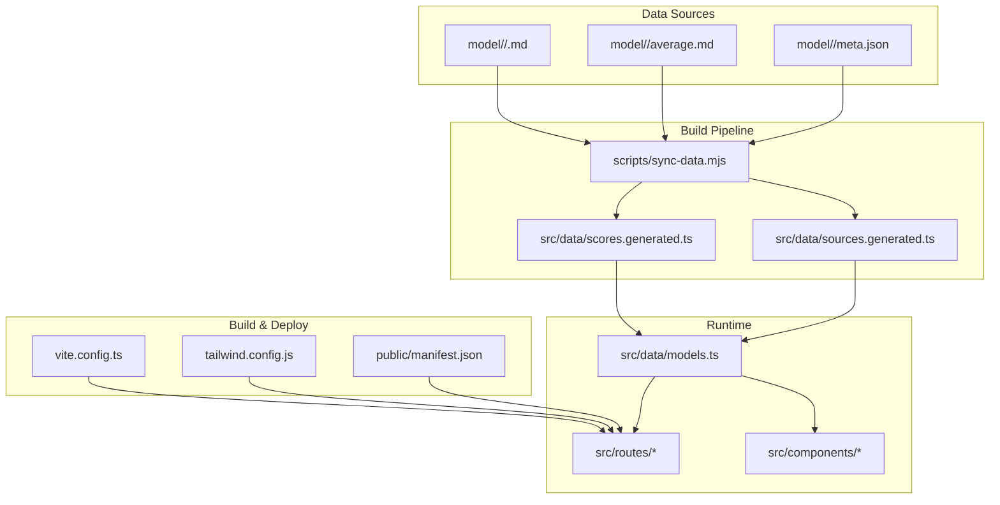
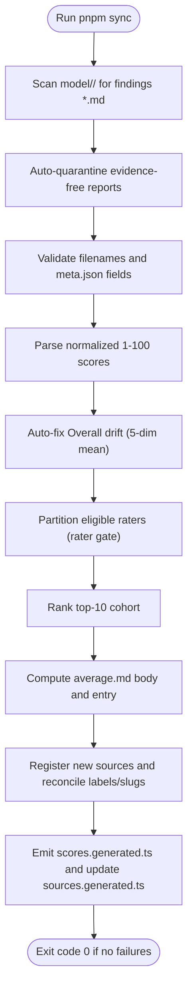
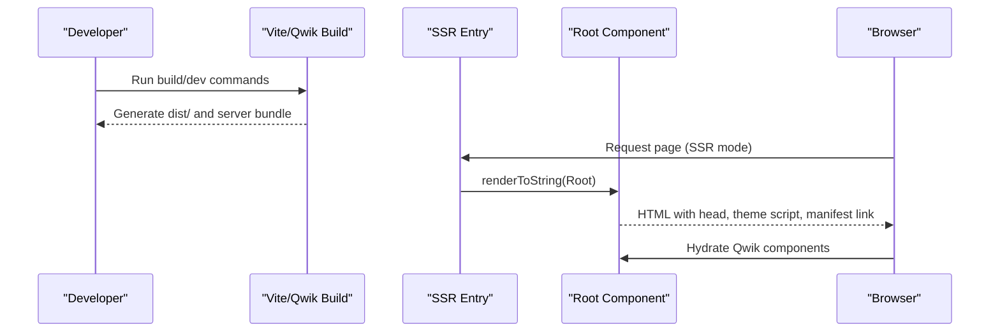
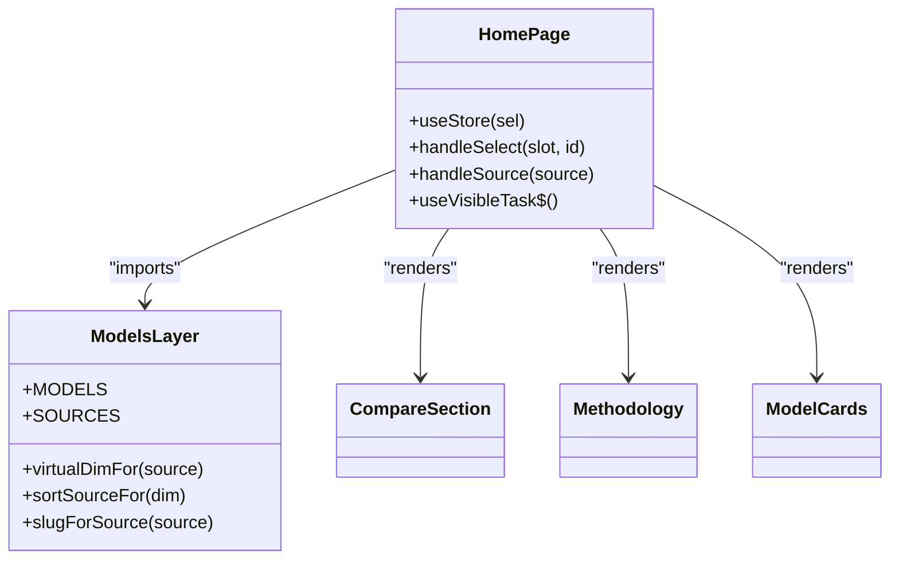
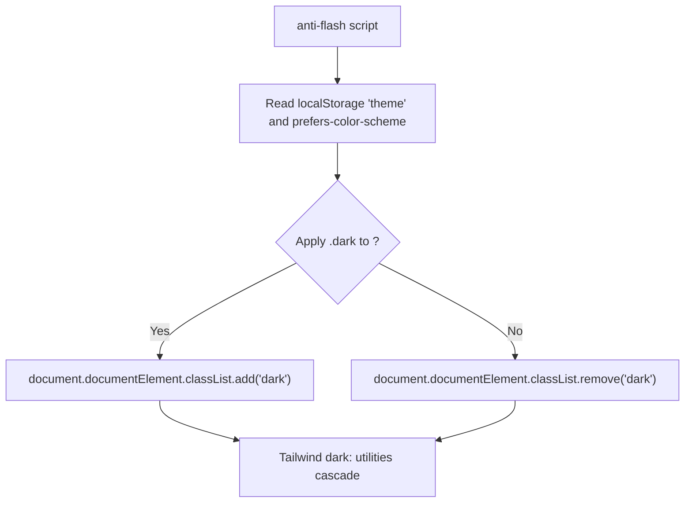
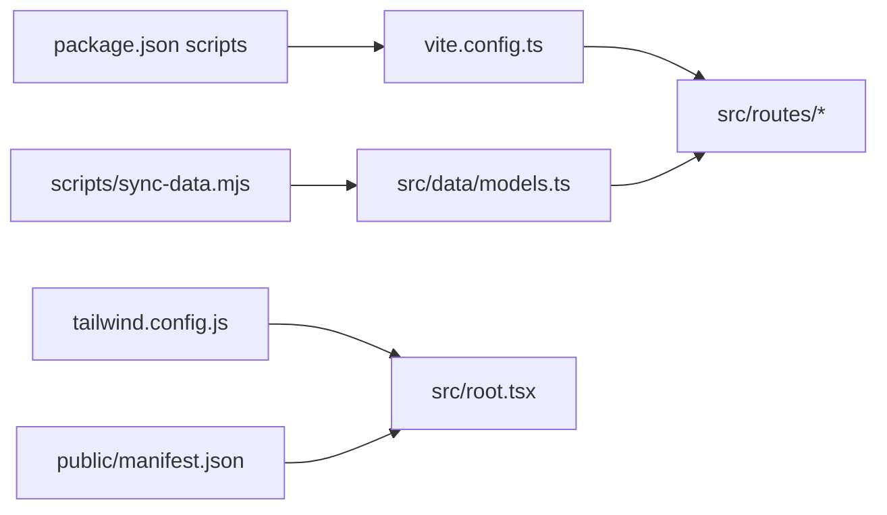

# Architecture Overview

<cite>
**Referenced Files in This Document**
- [README.md](file://README.md)
- [package.json](file://package.json)
- [vite.config.ts](file://vite.config.ts)
- [tailwind.config.js](file://tailwind.config.js)
- [public/manifest.json](file://public/manifest.json)
- [.agents/tech-stack.md](file://.agents/tech-stack.md)
- [src/root.tsx](file://src/root.tsx)
- [src/entry.ssr.tsx](file://src/entry.ssr.tsx)
- [src/routes/layout.tsx](file://src/routes/layout.tsx)
- [src/routes/index.tsx](file://src/routes/index.tsx)
- [src/data/models.ts](file://src/data/models.ts)
- [scripts/sync-data.mjs](file://scripts/sync-data.mjs)
</cite>

## Table of Contents
1. [Introduction](#introduction)
2. [Project Structure](#project-structure)
3. [Core Components](#core-components)
4. [Architecture Overview](#architecture-overview)
5. [Detailed Component Analysis](#detailed-component-analysis)
6. [Dependency Analysis](#dependency-analysis)
7. [Performance Considerations](#performance-considerations)
8. [Troubleshooting Guide](#troubleshooting-guide)
9. [Conclusion](#conclusion)

## Introduction
ModelComp is a static site that compares AI coding models across tool use, reasoning, context window, multimodal support, coding ability, and cost efficiency. Scores are normalized to 1–100 from public benchmarks and rendered at build time from research markdown files under `model/<slug>/`. The application uses Qwik with Qwik City for resumable components and file-based routing, Vite as the build system, and TypeScript for type safety. It supports SSR during development and preview, static site generation for production, and PWA capabilities through a web manifest.

The platform separates concerns into:
- Research data: per-model markdown findings and curated metadata.
- Build-time sync pipeline: deterministic parsing, validation, averaging, registry updates, and generated TypeScript.
- Runtime UI: Qwik components and routes rendering comparison views, model detail pages, methodology, and cards.

**Section sources**
- [README.md:1-17](file://README.md#L1-L17)
- [README.md:31-44](file://README.md#L31-L44)
- [README.md:93-97](file://README.md#L93-L97)

## Project Structure
At a high level:
- `model/<slug>/` contains research findings per reporting agent, an `average.md`, and a `meta.json`.
- `scripts/sync-data.mjs` parses, validates, averages, registers new sources, and emits generated TypeScript files consumed by the runtime.
- `src/data/models.ts` hydrates the model catalog from generated scores and meta, defines dimensions, virtual views, and source ordering.
- `src/routes/` provides Qwik City pages: homepage compare view and per-model detail pages.
- `src/components/` holds reusable UI components (compare section, hex radar, model cards, methodology, header/footer).
- `public/manifest.json` enables PWA installation hints.
- `vite.config.ts` wires Qwik City and Qwik optimizer plugins.
- `tailwind.config.js` configures Tailwind with class-based dark mode and CSS variables for theming.



**Diagram sources**
- [scripts/sync-data.mjs:1-29](file://scripts/sync-data.mjs#L1-L29)
- [scripts/sync-data.mjs:490-523](file://scripts/sync-data.mjs#L490-L523)
- [src/data/models.ts:6-19](file://src/data/models.ts#L6-L19)
- [src/routes/index.tsx:1-8](file://src/routes/index.tsx#L1-L8)
- [vite.config.ts:1-7](file://vite.config.ts#L1-L7)
- [tailwind.config.js:1-22](file://tailwind.config.js#L1-L22)
- [public/manifest.json:1-17](file://public/manifest.json#L1-L17)

**Section sources**
- [README.md:61-80](file://README.md#L61-L80)
- [README.md:93-97](file://README.md#L93-L97)

## Core Components
- Data layer (`src/data/models.ts`): Hydrates `MODELS` from pre-parsed scores and meta; defines dimension keys, colors, virtual sort views, source ordering, and helpers like `virtualDimFor`, `sortSourceFor`, and `slugForSource`.
- Sync pipeline (`scripts/sync-data.mjs`): Scans model folders, quarantines evidence-free reports, validates filenames and meta, computes top-10 cohort averages, auto-fixes Overall drift, registers new sources, reconciles labels/slugs, and emits compact score indexes.
- Routing and pages (`src/routes/index.tsx`, `src/routes/layout.tsx`): Homepage composes Hero, CompareSection, Methodology, and ModelCards; layout wraps Header, main content slot, and Footer.
- App shell (`src/root.tsx`): Provides QwikCityProvider, anti-flash theme script, PWA manifest link in production, and RouterHead.
- Build configuration (`vite.config.ts`, `tailwind.config.js`): Enables Qwik City + Qwik optimizer, sets preview headers, configures Tailwind dark mode via class and CSS variables.
- PWA manifest (`public/manifest.json`): Defines app name, start URL, display mode, theme color, and icons.

**Section sources**
- [src/data/models.ts:6-19](file://src/data/models.ts#L6-L19)
- [src/data/models.ts:121-163](file://src/data/models.ts#L121-L163)
- [src/data/models.ts:220-241](file://src/data/models.ts#L220-L241)
- [src/data/models.ts:243-329](file://src/data/models.ts#L243-L329)
- [scripts/sync-data.mjs:1-29](file://scripts/sync-data.mjs#L1-L29)
- [scripts/sync-data.mjs:259-436](file://scripts/sync-data.mjs#L259-L436)
- [scripts/sync-data.mjs:490-523](file://scripts/sync-data.mjs#L490-L523)
- [src/routes/index.tsx:1-8](file://src/routes/index.tsx#L1-L8)
- [src/routes/index.tsx:103-179](file://src/routes/index.tsx#L103-L179)
- [src/routes/layout.tsx:1-15](file://src/routes/layout.tsx#L1-L15)
- [src/root.tsx:1-65](file://src/root.tsx#L1-L65)
- [vite.config.ts:1-15](file://vite.config.ts#L1-L15)
- [tailwind.config.js:1-22](file://tailwind.config.js#L1-L22)
- [public/manifest.json:1-17](file://public/manifest.json#L1-L17)

## Architecture Overview
The system follows a clear separation between data, build, and runtime layers:

```mermaid
graph TB
U["User Browser"]
QW["Qwik City Router<br/>File-based routes"]
SSR["SSR Entry<br/>renderToString"]
ROOT["App Shell<br/>root.tsx"]
PAGE["Page Components<br/>routes/index.tsx"]
DATA["Models Layer<br/>src/data/models.ts"]
GEN["Generated Data<br/>scores.generated.ts / sources.generated.ts"]
SYNC["Sync Script<br/>scripts/sync-data.mjs"]
MD["Research Markdown<br/>model/<slug>/*.md"]
META["Meta JSON<br/>model/<slug>/meta.json"]
TAIL["Tailwind Theme<br/>tailwind.config.js"]
PWA["PWA Manifest<br/>public/manifest.json"]
U --> QW
QW --> SSR
SSR --> ROOT
ROOT --> PAGE
PAGE --> DATA
DATA --> GEN
GEN <-- SYNC
SYNC <-- MD
SYNC <-- META
ROOT --> TAIL
ROOT --> PWA
```

**Diagram sources**
- [src/entry.ssr.tsx:1-11](file://src/entry.ssr.tsx#L1-L11)
- [src/root.tsx:1-65](file://src/root.tsx#L1-L65)
- [src/routes/index.tsx:1-8](file://src/routes/index.tsx#L1-L8)
- [src/data/models.ts:6-19](file://src/data/models.ts#L6-L19)
- [scripts/sync-data.mjs:1-29](file://scripts/sync-data.mjs#L1-L29)
- [tailwind.config.js:1-22](file://tailwind.config.js#L1-L22)
- [public/manifest.json:1-17](file://public/manifest.json#L1-L17)

## Detailed Component Analysis

### Data Flow from Research Markdown to Generated TypeScript and Runtime
The sync pipeline transforms raw research into typed, compact data consumed by the UI:



Key behaviors:
- Evidence-free reports are renamed to `.excluded` so they never poison averages.
- Overall drift is corrected automatically when it deviates from the half-up mean of the five quality dimensions.
- Only raters whose own committed average Overall exceeds the rater gate count toward another model’s average; otherwise, all available reports are averaged as fallback.
- New reporting agents are appended to the SourceKey union and SOURCE_DEFS registry; dropdown order is derived at build time.
- Compact numeric indexes are emitted to avoid bundling full report prose.

**Diagram sources**
- [scripts/sync-data.mjs:259-436](file://scripts/sync-data.mjs#L259-L436)
- [scripts/sync-data.mjs:490-523](file://scripts/sync-data.mjs#L490-L523)

**Section sources**
- [scripts/sync-data.mjs:1-29](file://scripts/sync-data.mjs#L1-L29)
- [scripts/sync-data.mjs:259-436](file://scripts/sync-data.mjs#L259-L436)
- [scripts/sync-data.mjs:490-523](file://scripts/sync-data.mjs#L490-L523)

### Static Site Generation, SSR, and PWA Support
- SSR: The SSR entry renders the root component tree using Qwik’s server renderer and attaches the client manifest.
- SSG: The build produces static output via Qwik/Vite; preview headers disable HTML caching locally.
- PWA: In production builds, the root injects a manifest link; the manifest defines app identity, start URL, display mode, theme color, and icons.



**Diagram sources**
- [src/entry.ssr.tsx:1-11](file://src/entry.ssr.tsx#L1-L11)
- [src/root.tsx:1-65](file://src/root.tsx#L1-L65)
- [vite.config.ts:5-15](file://vite.config.ts#L5-L15)
- [public/manifest.json:1-17](file://public/manifest.json#L1-L17)

**Section sources**
- [src/entry.ssr.tsx:1-11](file://src/entry.ssr.tsx#L1-L11)
- [src/root.tsx:1-65](file://src/root.tsx#L1-L65)
- [vite.config.ts:5-15](file://vite.config.ts#L5-L15)
- [public/manifest.json:1-17](file://public/manifest.json#L1-L17)

### Qwik City Routing, Component Composition, and Data Hydration
- File-based routing: `src/routes/index.tsx` is the homepage; `src/routes/layout.tsx` provides shared layout.
- Component composition: Homepage composes Hero, CompareSection, Methodology, and ModelCards.
- Data hydration: Page imports MODELS, SOURCES, and helpers from `src/data/models.ts`; state is managed with Qwik stores and visible tasks synchronize selection state with URL query parameters.



**Diagram sources**
- [src/routes/index.tsx:1-8](file://src/routes/index.tsx#L1-L8)
- [src/routes/index.tsx:103-179](file://src/routes/index.tsx#L103-L179)
- [src/data/models.ts:220-329](file://src/data/models.ts#L220-L329)

**Section sources**
- [src/routes/index.tsx:1-8](file://src/routes/index.tsx#L1-L8)
- [src/routes/index.tsx:103-179](file://src/routes/index.tsx#L103-L179)
- [src/routes/layout.tsx:1-15](file://src/routes/layout.tsx#L1-L15)
- [src/data/models.ts:220-329](file://src/data/models.ts#L220-L329)

### Cross-Cutting Concerns

#### Theme Management
- Dark mode is class-based in Tailwind; an anti-flash script runs synchronously in `<head>` to add or remove `.dark` on `<html>` before first paint.
- Colors are driven by CSS variables defined globally; body inherits background via variables, avoiding specificity conflicts.



**Diagram sources**
- [src/root.tsx:12-33](file://src/root.tsx#L12-L33)
- [tailwind.config.js:1-22](file://tailwind.config.js#L1-L22)

**Section sources**
- [src/root.tsx:12-33](file://src/root.tsx#L12-L33)
- [tailwind.config.js:1-22](file://tailwind.config.js#L1-L22)

#### Responsive Design
- The README notes responsive layout with a mobile drawer menu; components such as Header and Footer provide consistent navigation and footer structure across devices.

**Section sources**
- [README.md:15-16](file://README.md#L15-L16)
- [src/routes/layout.tsx:1-15](file://src/routes/layout.tsx#L1-L15)

#### SEO Optimization
- The homepage exports a `DocumentHead` with title and description meta tags for search engines.
- SSR ensures initial HTML includes meaningful content for crawlers.

**Section sources**
- [src/routes/index.tsx:182-191](file://src/routes/index.tsx#L182-L191)
- [src/entry.ssr.tsx:1-11](file://src/entry.ssr.tsx#L1-L11)

## Dependency Analysis
High-level dependencies:
- Runtime depends on generated data (`scores.generated.ts`, `sources.generated.ts`) produced by the sync script.
- Build system integrates Qwik City and Qwik optimizer via Vite plugins.
- Styling relies on Tailwind with class-based dark mode and CSS variables.
- PWA support is declared in the manifest and linked conditionally in production.



**Diagram sources**
- [package.json:11-24](file://package.json#L11-L24)
- [vite.config.ts:1-7](file://vite.config.ts#L1-L7)
- [tailwind.config.js:1-22](file://tailwind.config.js#L1-L22)
- [public/manifest.json:1-17](file://public/manifest.json#L1-L17)
- [scripts/sync-data.mjs:490-523](file://scripts/sync-data.mjs#L490-L523)
- [src/data/models.ts:6-19](file://src/data/models.ts#L6-L19)
- [src/root.tsx:1-65](file://src/root.tsx#L1-L65)

**Section sources**
- [package.json:11-24](file://package.json#L11-L24)
- [vite.config.ts:1-7](file://vite.config.ts#L1-L7)
- [tailwind.config.js:1-22](file://tailwind.config.js#L1-L22)
- [public/manifest.json:1-17](file://public/manifest.json#L1-L17)
- [scripts/sync-data.mjs:490-523](file://scripts/sync-data.mjs#L490-L523)
- [src/data/models.ts:6-19](file://src/data/models.ts#L6-L19)
- [src/root.tsx:1-65](file://src/root.tsx#L1-L65)

## Performance Considerations
- Avoid bundling large markdown prose: sync emits compact numeric indexes to keep client bundles small.
- Use SSR for initial HTML to improve perceived performance and SEO.
- Disable HTML cache in local preview to ensure accurate testing of generated pages.
- Keep Tailwind v3 syntax and rely on CSS variables for theme switching to minimize runtime overhead.

[No sources needed since this section provides general guidance]

## Troubleshooting Guide
Common issues and resolutions:
- Missing or invalid meta.json: Sync scaffolds placeholders but warns; fill required fields to pass validation.
- Evidence-free reports: Automatically quarantined; review findings and either add verified scores or accept exclusion.
- Overall drift: Auto-corrected; if not fixable programmatically, hand-edit the Overall line.
- New sources not appearing: Ensure filename hygiene and run sync; check SourceKey union and SOURCE_DEFS registration.
- Build failures due to stale generated files: Re-run sync before building; verify exit code and logs.

**Section sources**
- [scripts/sync-data.mjs:297-326](file://scripts/sync-data.mjs#L297-L326)
- [scripts/sync-data.mjs:347-370](file://scripts/sync-data.mjs#L347-L370)
- [scripts/sync-data.mjs:438-480](file://scripts/sync-data.mjs#L438-L480)
- [scripts/sync-data.mjs:490-523](file://scripts/sync-data.mjs#L490-L523)

## Conclusion
ModelComp combines a robust data pipeline with a modern Qwik-based frontend to deliver fast, statically generated comparison pages. The sync script enforces data integrity and keeps the client bundle lean by emitting compact TypeScript indexes. Qwik City routing and component composition provide a clean user experience, while SSR and PWA features enhance performance and installability. Theme management, responsive design, and SEO are addressed through Tailwind, CSS variables, and document head configuration.

[No sources needed since this section summarizes without analyzing specific files]