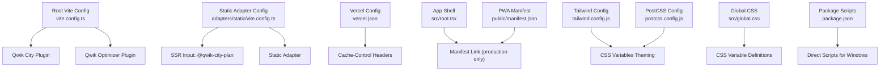
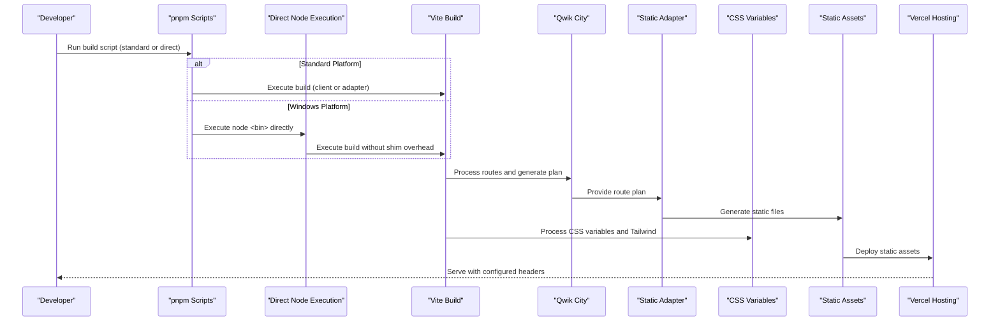
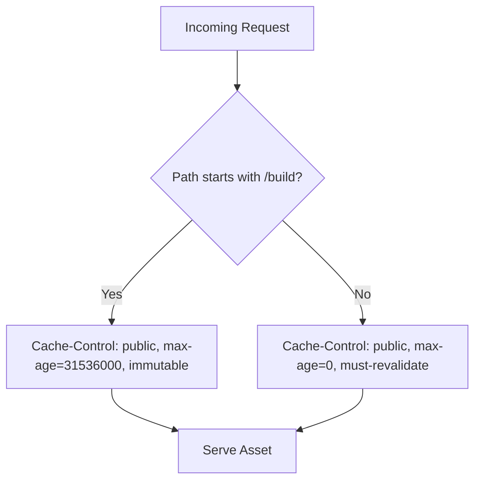
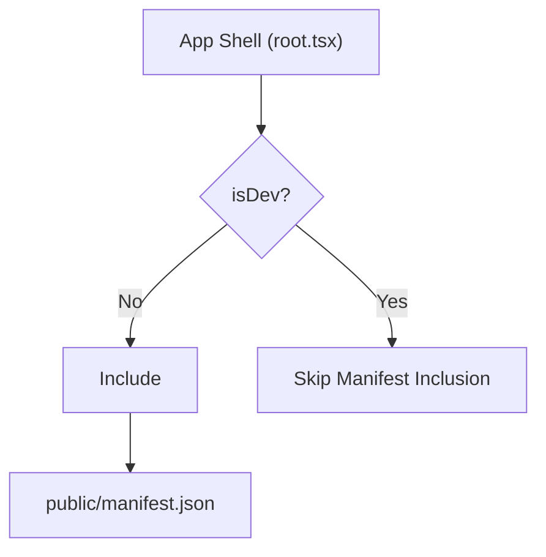
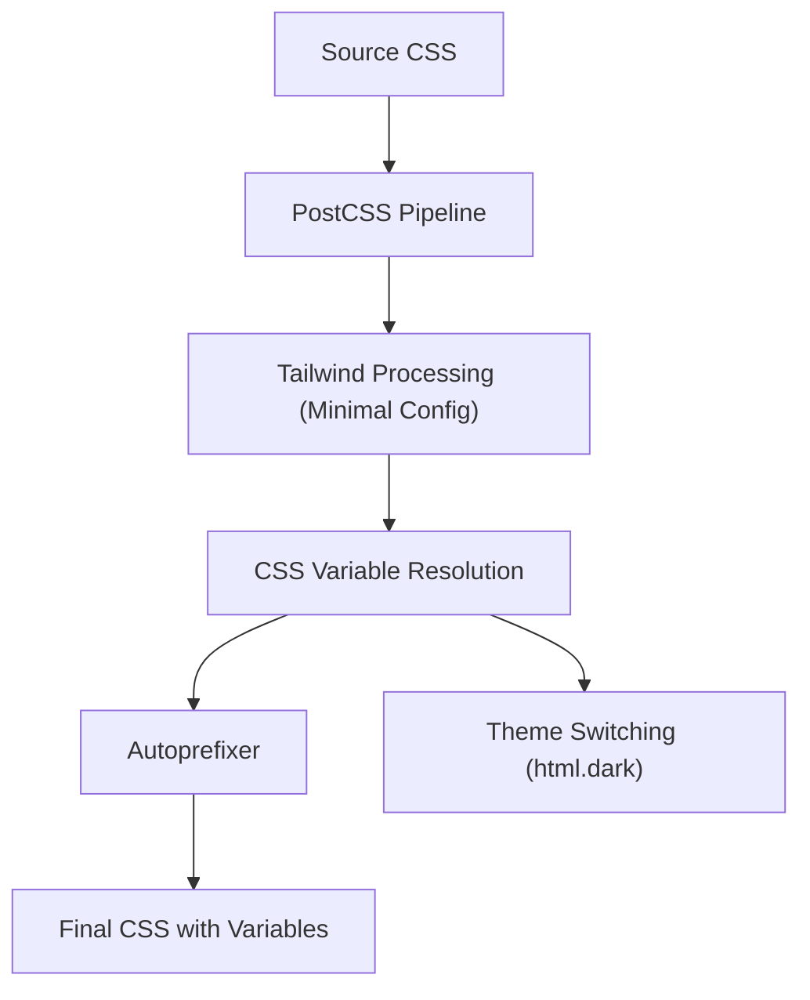
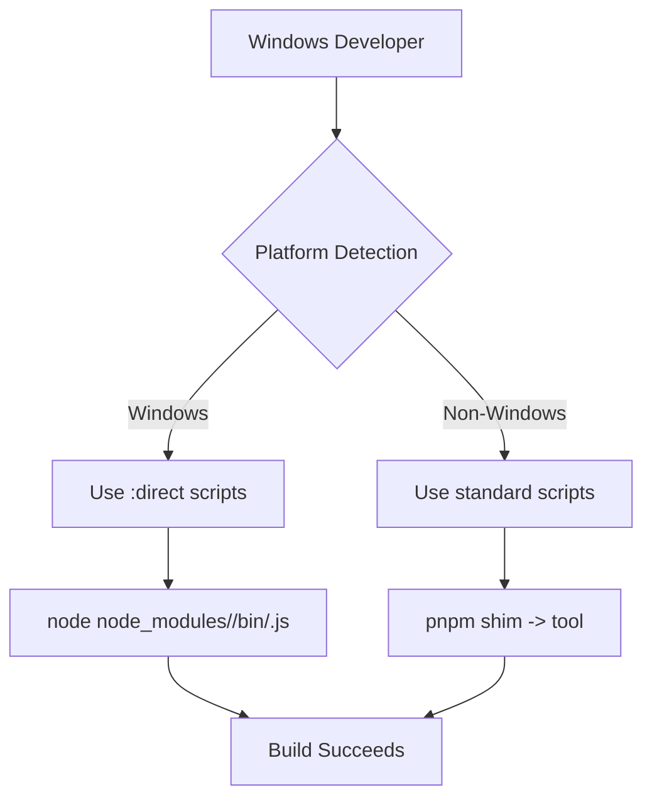
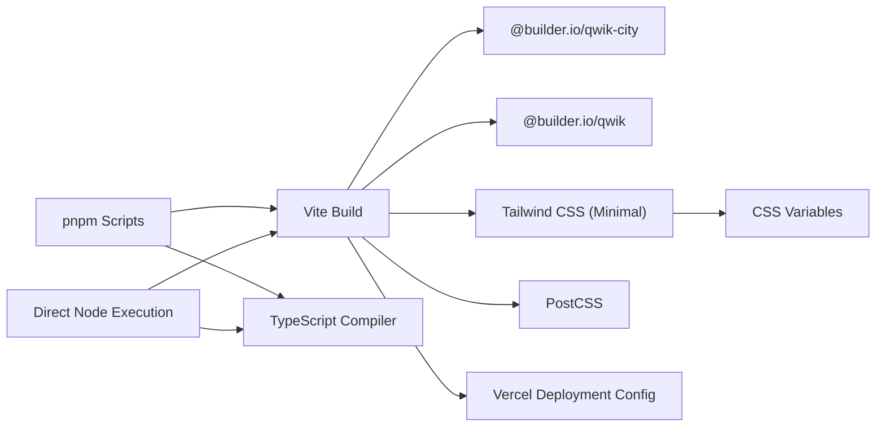

# Build System & Deployment Strategy

<cite>
**Referenced Files in This Document**
- [vite.config.ts](file://vite.config.ts)
- [adapters/static/vite.config.ts](file://adapters/static/vite.config.ts)
- [vercel.json](file://vercel.json)
- [public/manifest.json](file://public/manifest.json)
- [package.json](file://package.json)
- [README.md](file://README.md)
- [postcss.config.js](file://postcss.config.js)
- [tailwind.config.js](file://tailwind.config.js)
- [src/global.css](file://src/global.css)
- [src/root.tsx](file://src/root.tsx)
</cite>

## Update Summary
**Changes Made**
- Updated Tailwind configuration section to reflect simplified setup without custom color theme extensions
- Enhanced CSS processing pipeline documentation to emphasize CSS variable-based theming approach
- Added detailed explanation of the new CSS variable architecture replacing Tailwind theme extensions
- Updated troubleshooting guide with CSS variable-related guidance
- Revised dependency analysis to reflect streamlined Tailwind configuration

## Table of Contents
1. [Introduction](#introduction)
2. [Project Structure](#project-structure)
3. [Core Components](#core-components)
4. [Architecture Overview](#architecture-overview)
5. [Detailed Component Analysis](#detailed-component-analysis)
6. [Windows Compatibility](#windows-compatibility)
7. [Dependency Analysis](#dependency-analysis)
8. [Performance Considerations](#performance-considerations)
9. [Troubleshooting Guide](#troubleshooting-guide)
10. [Conclusion](#conclusion)
11. [Appendices](#appendices)

## Introduction
This document explains the build system and deployment strategy for a Qwik + Vite application targeting static hosting on Vercel. It covers:
- Development and production builds via Vite and Qwik
- Static adapter configuration for pre-rendered output
- Environment-specific behavior and asset caching
- PWA manifest setup (service worker is intentionally not included)
- **Streamlined Tailwind configuration relying on CSS variables for theming rather than theme extensions**
- Build-time optimizations, bundle analysis guidance, and performance monitoring
- CI/CD considerations, automated testing integration, and deployment verification
- **Windows compatibility improvements with direct build scripts to address cmd.exe limitations**

## Project Structure
The build and deployment surface area centers around:
- Root Vite configuration for Qwik and Qwik City
- Static adapter configuration for SSR input and static site generation
- Vercel deployment configuration for headers and caching
- PWA manifest and its conditional inclusion in the app shell
- **Simplified Tailwind configuration with CSS variable-based theming**
- Package scripts that orchestrate development, preview, and build targets with Windows compatibility



**Diagram sources**
- [vite.config.ts:1-16](file://vite.config.ts#L1-L16)
- [adapters/static/vite.config.ts:1-20](file://adapters/static/vite.config.ts#L1-L20)
- [vercel.json:1-23](file://vercel.json#L1-L23)
- [src/root.tsx:35-45](file://src/root.tsx#L35-L45)
- [public/manifest.json:1-18](file://public/manifest.json#L1-L18)
- [tailwind.config.js:1-7](file://tailwind.config.js#L1-L7)
- [src/global.css:1-54](file://src/global.css#L1-L54)
- [postcss.config.js:1-7](file://postcss.config.js#L1-L7)
- [package.json:11-27](file://package.json#L11-L27)

**Section sources**
- [vite.config.ts:1-16](file://vite.config.ts#L1-L16)
- [adapters/static/vite.config.ts:1-20](file://adapters/static/vite.config.ts#L1-L20)
- [vercel.json:1-23](file://vercel.json#L1-L23)
- [public/manifest.json:1-18](file://public/manifest.json#L1-L18)
- [package.json:11-27](file://package.json#L11-L27)
- [tailwind.config.js:1-7](file://tailwind.config.js#L1-L7)
- [src/global.css:1-54](file://src/global.css#L1-L54)
- [postcss.config.js:1-7](file://postcss.config.js#L1-L7)
- [src/root.tsx:35-45](file://src/root.tsx#L35-L45)

## Core Components
- Vite root configuration wires Qwik City and Qwik optimizer plugins and sets preview cache-control headers to avoid HTML caching during local previews.
- Static adapter configuration extends the base config, enables SSR mode for the adapter build, defines the Qwik City plan as the entry point, and configures the static adapter with an origin for prerendering.
- Vercel configuration sets global cache-control headers for HTML and long-lived immutable caching for assets under /build.
- The app shell conditionally includes the PWA manifest in non-development environments.
- **Tailwind configuration is now minimal, relying on CSS variables defined in global.css for all theming needs.**
- PostCSS processes styles through the standard pipeline.
- **Package scripts provide both standard and Windows-compatible direct execution paths.**

Key responsibilities:
- Build orchestration: package scripts define dev, preview, client/server builds, type checks, and Windows-compatible direct variants.
- Static site generation: adapter build produces static files suitable for CDN hosting.
- Runtime behavior: preview server disables HTML caching; production uses Vercel headers for caching.
- **Theming strategy: CSS variables provide consistent theming across Tailwind utilities and raw CSS.**

**Section sources**
- [vite.config.ts:5-14](file://vite.config.ts#L5-L14)
- [adapters/static/vite.config.ts:5-18](file://adapters/static/vite.config.ts#L5-L18)
- [vercel.json:1-23](file://vercel.json#L1-L23)
- [src/root.tsx:35-45](file://src/root.tsx#L35-L45)
- [tailwind.config.js:1-7](file://tailwind.config.js#L1-L7)
- [src/global.css:1-54](file://src/global.css#L1-L54)
- [package.json:11-27](file://package.json#L11-L27)

## Architecture Overview
The build and deployment architecture follows a static-site-first approach powered by Qwik City and Vite, with built-in Windows compatibility support and a streamlined CSS variable-based theming system.



**Diagram sources**
- [package.json:11-27](file://package.json#L11-L27)
- [vite.config.ts:5-14](file://vite.config.ts#L5-L14)
- [adapters/static/vite.config.ts:5-18](file://adapters/static/vite.config.ts#L5-L18)
- [vercel.json:1-23](file://vercel.json#L1-L23)
- [tailwind.config.js:1-7](file://tailwind.config.js#L1-L7)
- [src/global.css:1-54](file://src/global.css#L1-L54)

## Detailed Component Analysis

### Vite Configuration (Development and Preview)
- Plugins: Qwik City and Qwik optimizer are registered to enable routing, code splitting, and framework-specific optimizations.
- Preview server: Sets Cache-Control headers to prevent HTML caching during local preview, ensuring changes are reflected immediately.


**Diagram sources**
- [vite.config.ts:1-16](file://vite.config.ts#L1-L16)

**Section sources**
- [vite.config.ts:5-14](file://vite.config.ts#L5-L14)

### Static Adapter Configuration (Production Build)
- Extends the base Vite configuration.
- Enables SSR mode for the adapter build.
- Defines the Qwik City plan as the Rollup input to drive static generation.
- Configures the static adapter with an origin used during prerendering.


**Diagram sources**
- [adapters/static/vite.config.ts:1-20](file://adapters/static/vite.config.ts#L1-L20)

**Section sources**
- [adapters/static/vite.config.ts:5-18](file://adapters/static/vite.config.ts#L5-L18)

### Vercel Deployment Configuration
- Global header rule applies Cache-Control: public, max-age=0, must-revalidate to all paths, ensuring HTML is revalidated on each request.
- Asset path rule applies long-lived immutable caching to files under /build, leveraging content-hashed filenames for optimal browser caching.



**Diagram sources**
- [vercel.json:1-23](file://vercel.json#L1-L23)

**Section sources**
- [vercel.json:1-23](file://vercel.json#L1-L23)

### PWA Manifest and Service Worker Status
- The PWA manifest is defined and linked in the app shell only in non-development environments.
- There is no service worker implementation present; references to sw.js and service worker registration have been removed from the source tree.



**Diagram sources**
- [src/root.tsx:35-45](file://src/root.tsx#L35-L45)
- [public/manifest.json:1-18](file://public/manifest.json#L1-L18)

**Section sources**
- [src/root.tsx:35-45](file://src/root.tsx#L35-L45)
- [public/manifest.json:1-18](file://public/manifest.json#L1-L18)

### CSS Processing Pipeline and CSS Variable Theming
**Updated** The CSS processing pipeline has been significantly simplified. The project now uses a minimal Tailwind configuration that relies entirely on CSS variables for theming, eliminating the need for complex theme extensions.

- **Minimal Tailwind Configuration**: The tailwind.config.js file contains only essential settings: dark mode class toggling, content scanning for source files, and empty plugins array.
- **CSS Variable Architecture**: All theming is handled through CSS custom properties defined in src/global.css, providing a single source of truth for colors and themes.
- **Dual Theme Support**: Light and dark themes are managed through CSS variables on `:root` and `html.dark` selectors, enabling seamless theme switching.
- **PostCSS Integration**: PostCSS processes Tailwind directives and autoprefixer for cross-browser compatibility.



**Diagram sources**
- [tailwind.config.js:1-7](file://tailwind.config.js#L1-L7)
- [src/global.css:1-54](file://src/global.css#L1-L54)
- [postcss.config.js:1-7](file://postcss.config.js#L1-L7)

**Section sources**
- [tailwind.config.js:1-7](file://tailwind.config.js#L1-L7)
- [src/global.css:1-54](file://src/global.css#L1-L54)
- [postcss.config.js:1-7](file://postcss.config.js#L1-L7)

## Windows Compatibility

### The Problem: cmd.exe Line Length Limitations
On Windows systems, the standard pnpm shims for tools like `tsc` and `vite` embed a large `NODE_PATH` environment variable that can exceed cmd.exe's ~8KB line limit. This causes commands to fail with errors like "The input line is too long" (exit code 255), preventing the tools from running at all.

### Solution: Direct Build Scripts
The project provides Windows-compatible alternatives that bypass pnpm shims and execute tools directly via Node.js:

- `build.types:direct` - Runs TypeScript compiler directly via `node node_modules/typescript/bin/tsc`
- `build:direct` - Executes both client and server builds directly via `node node_modules/vite/bin/vite.js`
- `dev:direct` - Starts development server directly via `node node_modules/vite/bin/vite.js`

These direct variants produce identical output to their standard counterparts but avoid the environment variable length issues.

### Windows Workflow
For Windows users, the recommended workflow is:
```bash
pnpm sync && pnpm build.types:direct && pnpm build:direct
```

This ensures all build steps run successfully despite cmd.exe limitations.



**Diagram sources**
- [package.json:17-24](file://package.json#L17-L24)
- [README.md:32-38](file://README.md#L32-L38)

**Section sources**
- [package.json:17-24](file://package.json#L17-L24)
- [README.md:32-38](file://README.md#L32-L38)

## Dependency Analysis
The build toolchain and runtime dependencies are orchestrated through package scripts and configuration files, with dual execution paths for cross-platform compatibility and a streamlined CSS processing pipeline.



**Diagram sources**
- [package.json:11-27](file://package.json#L11-L27)
- [vite.config.ts:1-7](file://vite.config.ts#L1-L7)
- [tailwind.config.js:1-7](file://tailwind.config.js#L1-L7)
- [src/global.css:1-54](file://src/global.css#L1-L54)
- [postcss.config.js:1-7](file://postcss.config.js#L1-L7)
- [vercel.json:1-23](file://vercel.json#L1-L23)

**Section sources**
- [package.json:11-27](file://package.json#L11-L27)
- [vite.config.ts:1-7](file://vite.config.ts#L1-L7)
- [tailwind.config.js:1-7](file://tailwind.config.js#L1-L7)

## Performance Considerations
- Client-side optimization: Qwik's optimizer plugin is enabled to support fine-grained code splitting and lazy loading.
- Static site generation: Using the static adapter ensures pages are pre-rendered, reducing runtime work and improving initial load performance.
- Asset caching: Vercel headers apply immutable caching for hashed assets under /build, minimizing network requests after first load.
- HTML revalidation: Global HTML cache rules ensure fresh content while still allowing efficient caching strategies at the edge.
- **Streamlined CSS processing: Minimal Tailwind configuration reduces build time and bundle size; CSS variables eliminate theme extension overhead.**
- **CSS variable efficiency: Single source of truth for theming reduces CSS complexity and improves maintainability.**
- **Windows compatibility adds minimal overhead while ensuring reliable builds across platforms.**

Recommendations:
- Monitor bundle sizes using Vite's built-in analyzer or third-party tools to identify large dependencies.
- Prefer dynamic imports for heavy components or data-heavy features.
- Validate that generated assets under /build are correctly versioned and cached by the CDN.
- On Windows, always use the `:direct` script variants to avoid build failures.
- **Maintain CSS variable consistency when adding new theme colors to ensure uniform theming across the application.**

## Troubleshooting Guide
Common issues and resolutions:
- Local preview shows stale HTML: Ensure the preview server is running with default settings; it already sets Cache-Control: no-cache for HTML. If you override preview options, preserve these headers.
- Static build fails due to missing origin: Confirm the static adapter origin is set appropriately for your environment. For local development, localhost is acceptable; adjust for CI if needed.
- Manifest not appearing in production: Verify that the app shell includes the manifest link only in non-development builds and that BASE_URL resolves correctly.
- **Styles not applying dark mode:** Ensure Tailwind's darkMode is set to class and that the anti-flash script adds/removes the .dark class on the document element.
- **CSS variables not updating:** Verify that CSS variables are properly defined in both `:root` and `html.dark` selectors in global.css, and that the body element uses `var(--color-bg)` and `var(--color-text-main)`.
- **Custom Tailwind colors not working:** The project no longer uses Tailwind theme extensions. Add new colors as CSS variables in global.css and reference them using `var(--your-variable-name)` in your CSS.
- **Windows build failures with "input line is too long": Use the `:direct` script variants (`build.types:direct`, `build:direct`, `dev:direct`) instead of standard commands.
- **Node module path issues on Windows:** The direct scripts bypass pnpm shims that cause NODE_PATH environment variable overflow in cmd.exe.

**Section sources**
- [vite.config.ts:8-13](file://vite.config.ts#L8-L13)
- [adapters/static/vite.config.ts:14-16](file://adapters/static/vite.config.ts#L14-L16)
- [src/root.tsx:35-45](file://src/root.tsx#L35-L45)
- [tailwind.config.js:1-7](file://tailwind.config.js#L1-L7)
- [src/global.css:1-54](file://src/global.css#L1-L54)
- [package.json:17-24](file://package.json#L17-L24)
- [README.md:32-38](file://README.md#L32-L38)

## Conclusion
The project uses a clean, static-first build strategy with Qwik City and Vite, producing pre-rendered assets optimized for CDN distribution. Vercel headers enforce appropriate caching for HTML and assets. The PWA manifest is included in production without a service worker, enabling installability where supported. 

**Significant improvements include a streamlined Tailwind configuration that eliminates complex theme extensions in favor of a CSS variable-based theming system**, providing better maintainability and performance. The minimal Tailwind setup focuses on essential functionality while leveraging CSS custom properties for all visual theming needs.

**Significant Windows compatibility improvements** ensure reliable builds across all platforms through direct script execution that bypasses cmd.exe limitations. With the provided scripts and configurations, developers can run local previews, build static sites, and deploy to Vercel confidently on any platform.

## Appendices

### Build and Deployment Commands
- Development server: runs Vite in SSR mode for local development.
- Preview server: serves the built output locally with HTML cache disabled.
- Client build: builds the client bundle.
- Server build: builds the static adapter output for static hosting.
- Type checking: incremental TypeScript checks without emitting files.
- **Windows-compatible variants**: direct execution scripts that bypass pnpm shims to avoid cmd.exe line length limitations.

**Section sources**
- [package.json:11-27](file://package.json#L11-L27)
- [README.md:18-38](file://README.md#L18-L38)

### Command Reference Table
| Command | Description | Platform Notes |
|---------|-------------|----------------|
| `pnpm dev` | Dev server (SSR mode) | Standard Unix/Linux/macOS |
| `pnpm dev:direct` | Same dev server via direct Node execution | Windows alternative |
| `pnpm build.types` | Typecheck via tsc shim | Standard Unix/Linux/macOS |
| `pnpm build.types:direct` | Typecheck via direct Node execution | Windows alternative |
| `pnpm build` | Full build: types + client + server + static SSG | Standard Unix/Linux/macOS |
| `pnpm build:direct` | Full build via direct Node execution | Windows alternative |
| `pnpm preview` | Serve last production build locally | All platforms |

**Section sources**
- [package.json:11-27](file://package.json#L11-L27)
- [README.md:18-38](file://README.md#L18-L38)

### CSS Variable Theming Reference
**New** The project uses CSS variables for all theming needs, defined in src/global.css:

- `--color-bg`: Background color (white in light mode, dark blue-gray in dark mode)
- `--color-text-main`: Primary text color (dark slate in light mode, light gray in dark mode)
- Both variables are automatically switched via the `html.dark` selector
- Body elements inherit these variables for consistent theming across the application

**Section sources**
- [src/global.css:14-34](file://src/global.css#L14-L34)
- [src/global.css:49-53](file://src/global.css#L49-L53)