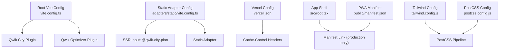
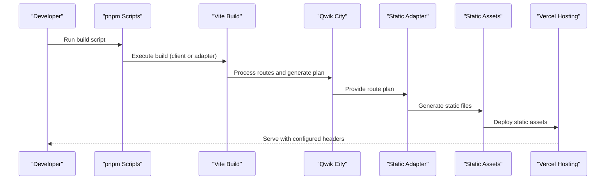
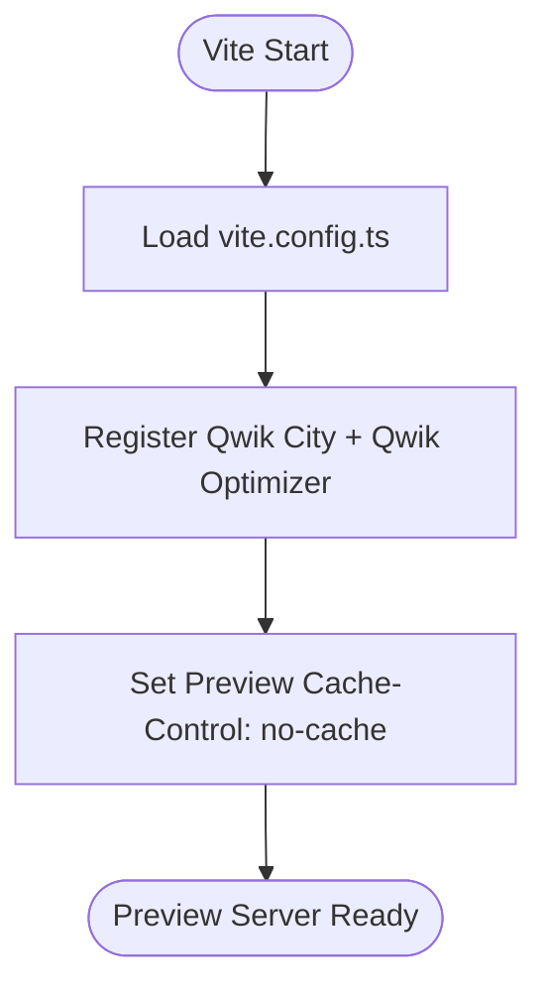
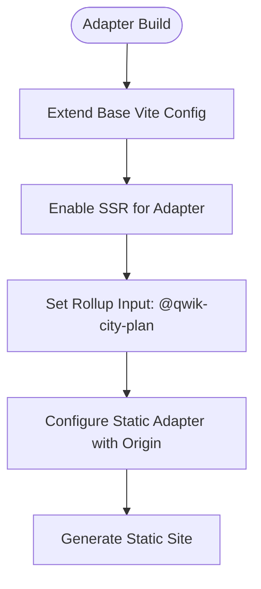
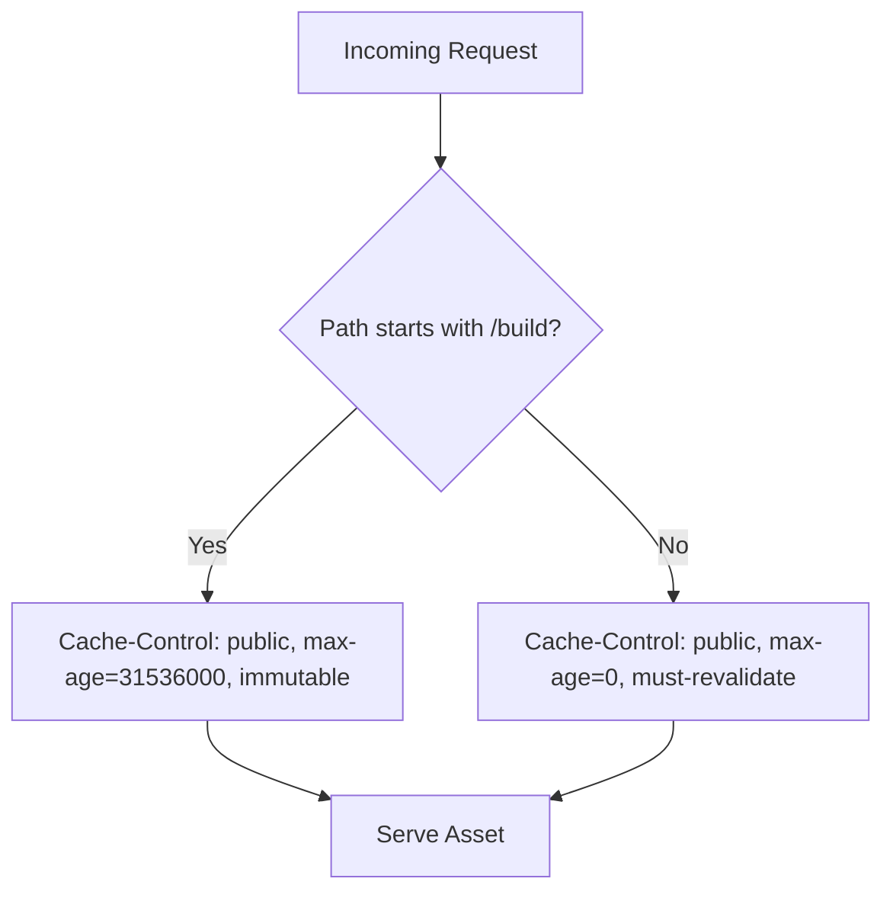
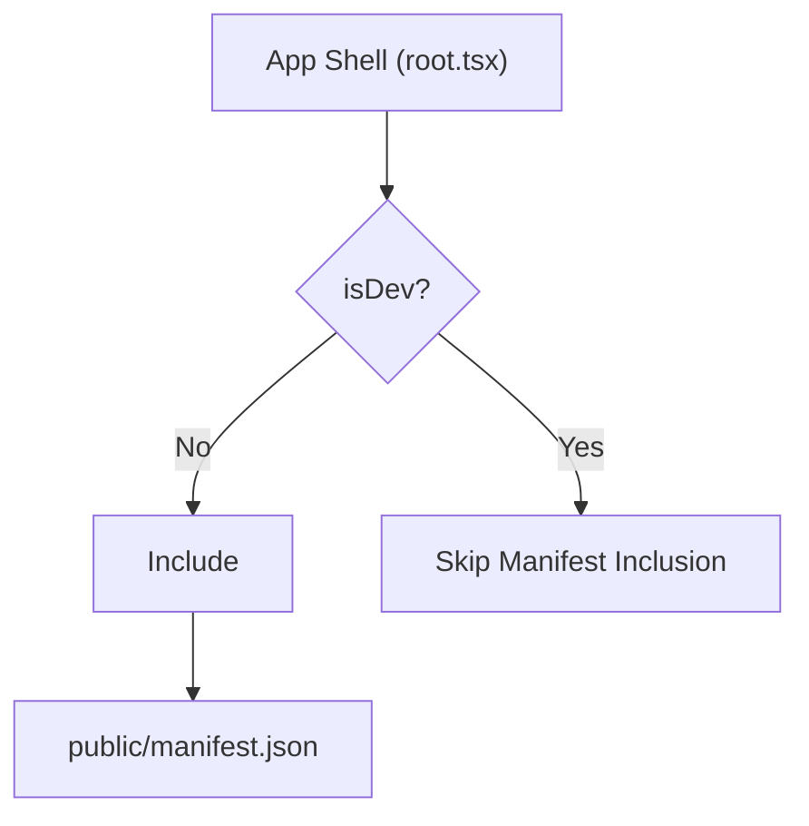
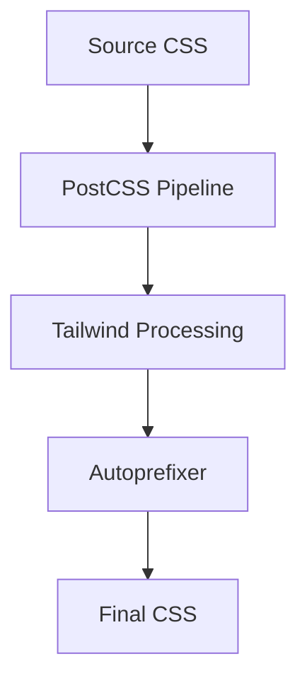
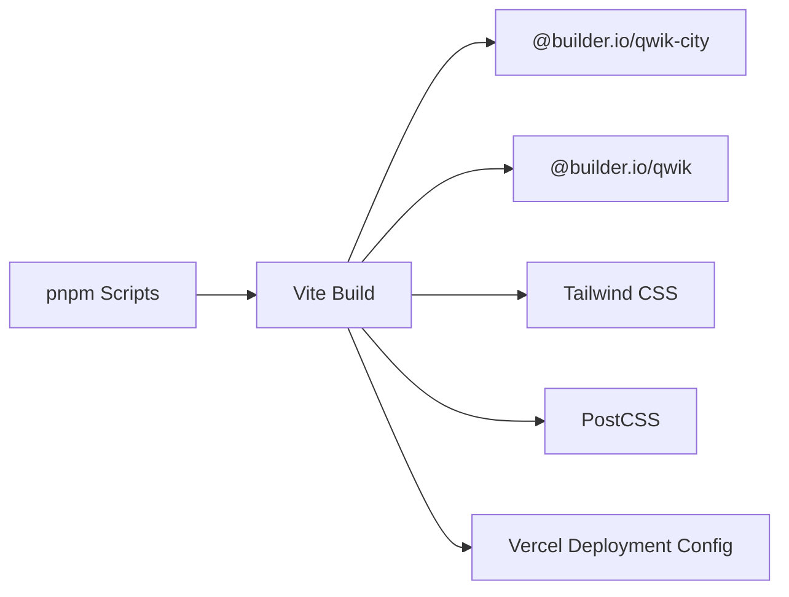

# Build System & Deployment Strategy

<cite>
**Referenced Files in This Document**
- [vite.config.ts](file://vite.config.ts)
- [adapters/static/vite.config.ts](file://adapters/static/vite.config.ts)
- [vercel.json](file://vercel.json)
- [public/manifest.json](file://public/manifest.json)
- [package.json](file://package.json)
- [postcss.config.js](file://postcss.config.js)
- [tailwind.config.js](file://tailwind.config.js)
- [src/root.tsx](file://src/root.tsx)
</cite>

## Table of Contents
1. [Introduction](#introduction)
2. [Project Structure](#project-structure)
3. [Core Components](#core-components)
4. [Architecture Overview](#architecture-overview)
5. [Detailed Component Analysis](#detailed-component-analysis)
6. [Dependency Analysis](#dependency-analysis)
7. [Performance Considerations](#performance-considerations)
8. [Troubleshooting Guide](#troubleshooting-guide)
9. [Conclusion](#conclusion)
10. [Appendices](#appendices)

## Introduction
This document explains the build system and deployment strategy for a Qwik + Vite application targeting static hosting on Vercel. It covers:
- Development and production builds via Vite and Qwik
- Static adapter configuration for pre-rendered output
- Environment-specific behavior and asset caching
- PWA manifest setup (service worker is intentionally not included)
- Build-time optimizations, bundle analysis guidance, and performance monitoring recommendations
- CI/CD considerations, automated testing integration, and deployment verification

## Project Structure
The build and deployment surface area centers around:
- Root Vite configuration for Qwik and Qwik City
- Static adapter configuration for SSR input and static site generation
- Vercel deployment configuration for headers and caching
- PWA manifest and its conditional inclusion in the app shell
- Tailwind and PostCSS configuration for CSS processing
- Package scripts that orchestrate development, preview, and build targets

**Diagram sources**
- [vite.config.ts:1-16](file://vite.config.ts#L1-L16)
- [adapters/static/vite.config.ts:1-20](file://adapters/static/vite.config.ts#L1-L20)
- [vercel.json:1-23](file://vercel.json#L1-L23)
- [src/root.tsx:35-45](file://src/root.tsx#L35-L45)
- [public/manifest.json:1-18](file://public/manifest.json#L1-L18)
- [tailwind.config.js:1-23](file://tailwind.config.js#L1-L23)
- [postcss.config.js:1-7](file://postcss.config.js#L1-L7)

**Section sources**
- [vite.config.ts:1-16](file://vite.config.ts#L1-L16)
- [adapters/static/vite.config.ts:1-20](file://adapters/static/vite.config.ts#L1-L20)
- [vercel.json:1-23](file://vercel.json#L1-L23)
- [public/manifest.json:1-18](file://public/manifest.json#L1-L18)
- [package.json:11-24](file://package.json#L11-L24)
- [tailwind.config.js:1-23](file://tailwind.config.js#L1-L23)
- [postcss.config.js:1-7](file://postcss.config.js#L1-L7)
- [src/root.tsx:35-45](file://src/root.tsx#L35-L45)

## Core Components
- Vite root configuration wires Qwik City and Qwik optimizer plugins and sets preview cache-control headers to avoid HTML caching during local previews.
- Static adapter configuration extends the base config, enables SSR mode for the adapter build, defines the Qwik City plan as the entry point, and configures the static adapter with an origin for prerendering.
- Vercel configuration sets global cache-control headers for HTML and long-lived immutable caching for assets under /build.
- The app shell conditionally includes the PWA manifest in non-development environments.
- Tailwind and PostCSS are configured to process styles through the standard pipeline.

Key responsibilities:
- Build orchestration: package scripts define dev, preview, client/server builds, and type checks.
- Static site generation: adapter build produces static files suitable for CDN hosting.
- Runtime behavior: preview server disables HTML caching; production uses Vercel headers for caching.

**Section sources**
- [vite.config.ts:5-14](file://vite.config.ts#L5-L14)
- [adapters/static/vite.config.ts:5-18](file://adapters/static/vite.config.ts#L5-L18)
- [vercel.json:1-23](file://vercel.json#L1-L23)
- [src/root.tsx:35-45](file://src/root.tsx#L35-L45)
- [package.json:11-24](file://package.json#L11-L24)

## Architecture Overview
The build and deployment architecture follows a static-site-first approach powered by Qwik City and Vite.

**Diagram sources**
- [package.json:11-16](file://package.json#L11-L16)
- [vite.config.ts:5-14](file://vite.config.ts#L5-L14)
- [adapters/static/vite.config.ts:5-18](file://adapters/static/vite.config.ts#L5-L18)
- [vercel.json:1-23](file://vercel.json#L1-L23)

## Detailed Component Analysis

### Vite Configuration (Development and Preview)
- Plugins: Qwik City and Qwik optimizer are registered to enable routing, code splitting, and framework-specific optimizations.
- Preview server: Sets Cache-Control headers to prevent HTML caching during local preview, ensuring changes are reflected immediately.

**Diagram sources**
- [vite.config.ts:1-16](file://vite.config.ts#L1-L16)

**Section sources**
- [vite.config.ts:5-14](file://vite.config.ts#L5-L14)

### Static Adapter Configuration (Production Build)
- Extends the base Vite configuration.
- Enables SSR mode for the adapter build.
- Defines the Qwik City plan as the Rollup input to drive static generation.
- Configures the static adapter with an origin used during prerendering.

**Diagram sources**
- [adapters/static/vite.config.ts:1-20](file://adapters/static/vite.config.ts#L1-L20)

**Section sources**
- [adapters/static/vite.config.ts:5-18](file://adapters/static/vite.config.ts#L5-L18)

### Vercel Deployment Configuration
- Global header rule applies Cache-Control: public, max-age=0, must-revalidate to all paths, ensuring HTML is revalidated on each request.
- Asset path rule applies long-lived immutable caching to files under /build, leveraging content-hashed filenames for optimal browser caching.

**Diagram sources**
- [vercel.json:1-23](file://vercel.json#L1-L23)

**Section sources**
- [vercel.json:1-23](file://vercel.json#L1-L23)

### PWA Manifest and Service Worker Status
- The PWA manifest is defined and linked in the app shell only in non-development environments.
- There is no service worker implementation present; references to sw.js and service worker registration have been removed from the source tree.

**Diagram sources**
- [src/root.tsx:35-45](file://src/root.tsx#L35-L45)
- [public/manifest.json:1-18](file://public/manifest.json#L1-L18)

**Section sources**
- [src/root.tsx:35-45](file://src/root.tsx#L35-L45)
- [public/manifest.json:1-18](file://public/manifest.json#L1-L18)

### CSS Processing Pipeline
- Tailwind is configured with dark mode set to class-based toggling.
- PostCSS processes Tailwind and autoprefixer.

**Diagram sources**
- [tailwind.config.js:1-23](file://tailwind.config.js#L1-L23)
- [postcss.config.js:1-7](file://postcss.config.js#L1-L7)

**Section sources**
- [tailwind.config.js:1-23](file://tailwind.config.js#L1-L23)
- [postcss.config.js:1-7](file://postcss.config.js#L1-L7)

## Dependency Analysis
The build toolchain and runtime dependencies are orchestrated through package scripts and configuration files.

**Diagram sources**
- [package.json:26-36](file://package.json#L26-L36)
- [vite.config.ts:1-7](file://vite.config.ts#L1-L7)
- [tailwind.config.js:1-23](file://tailwind.config.js#L1-L23)
- [postcss.config.js:1-7](file://postcss.config.js#L1-L7)
- [vercel.json:1-23](file://vercel.json#L1-L23)

**Section sources**
- [package.json:11-36](file://package.json#L11-L36)
- [vite.config.ts:1-7](file://vite.config.ts#L1-L7)

## Performance Considerations
- Client-side optimization: Qwik’s optimizer plugin is enabled to support fine-grained code splitting and lazy loading.
- Static site generation: Using the static adapter ensures pages are pre-rendered, reducing runtime work and improving initial load performance.
- Asset caching: Vercel headers apply immutable caching for hashed assets under /build, minimizing network requests after first load.
- HTML revalidation: Global HTML cache rules ensure fresh content while still allowing efficient caching strategies at the edge.
- CSS minification and purging: Tailwind’s content scanning reduces unused styles; PostCSS handles vendor prefixes.

Recommendations:
- Monitor bundle sizes using Vite’s built-in analyzer or third-party tools to identify large dependencies.
- Prefer dynamic imports for heavy components or data-heavy features.
- Validate that generated assets under /build are correctly versioned and cached by the CDN.

[No sources needed since this section provides general guidance]

## Troubleshooting Guide
Common issues and resolutions:
- Local preview shows stale HTML: Ensure the preview server is running with default settings; it already sets Cache-Control: no-cache for HTML. If you override preview options, preserve these headers.
- Static build fails due to missing origin: Confirm the static adapter origin is set appropriately for your environment. For local development, localhost is acceptable; adjust for CI if needed.
- Manifest not appearing in production: Verify that the app shell includes the manifest link only in non-development builds and that BASE_URL resolves correctly.
- Styles not applying dark mode: Ensure Tailwind’s darkMode is set to class and that the anti-flash script adds/removes the .dark class on the document element.

**Section sources**
- [vite.config.ts:8-13](file://vite.config.ts#L8-L13)
- [adapters/static/vite.config.ts:14-16](file://adapters/static/vite.config.ts#L14-L16)
- [src/root.tsx:35-45](file://src/root.tsx#L35-L45)
- [tailwind.config.js:1-5](file://tailwind.config.js#L1-L5)

## Conclusion
The project uses a clean, static-first build strategy with Qwik City and Vite, producing pre-rendered assets optimized for CDN distribution. Vercel headers enforce appropriate caching for HTML and assets. The PWA manifest is included in production without a service worker, enabling installability where supported. Tailwind and PostCSS provide a robust styling pipeline. With the provided scripts and configurations, developers can run local previews, build static sites, and deploy to Vercel confidently.

[No sources needed since this section summarizes without analyzing specific files]

## Appendices

### Build and Deployment Commands
- Development server: runs Vite in SSR mode for local development.
- Preview server: serves the built output locally with HTML cache disabled.
- Client build: builds the client bundle.
- Server build: builds the static adapter output for static hosting.
- Type checking: incremental TypeScript checks without emitting files.

**Section sources**
- [package.json:11-24](file://package.json#L11-L24)