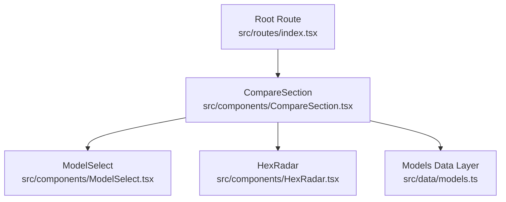
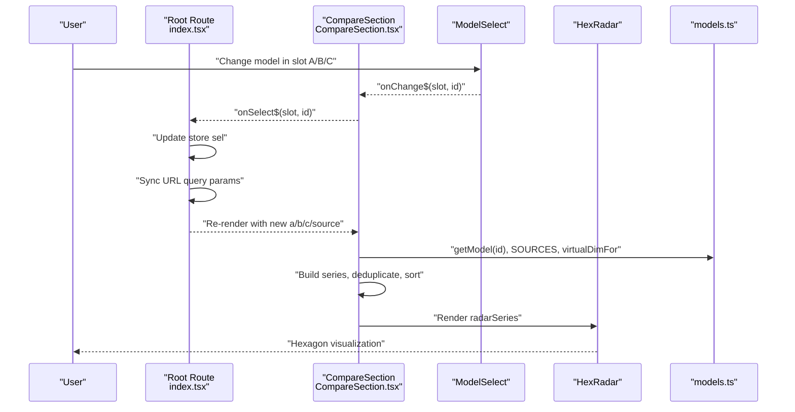
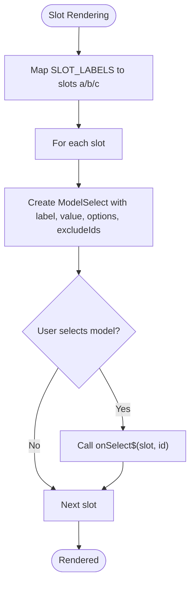
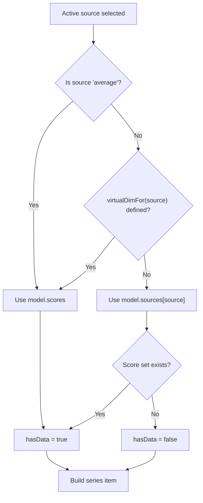
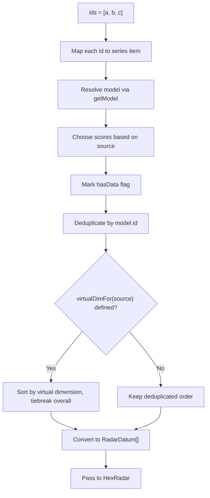
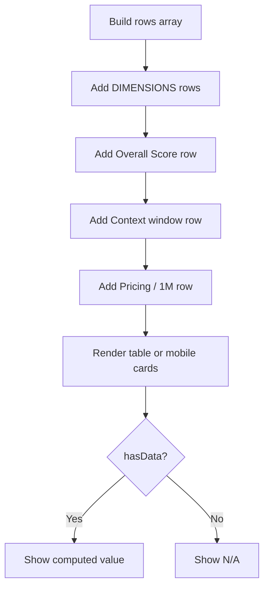
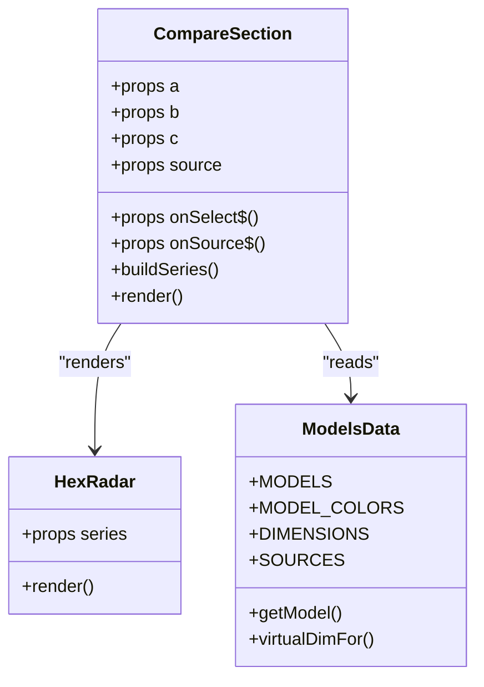
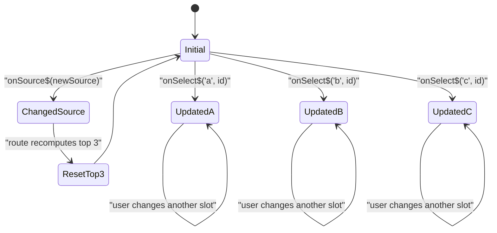
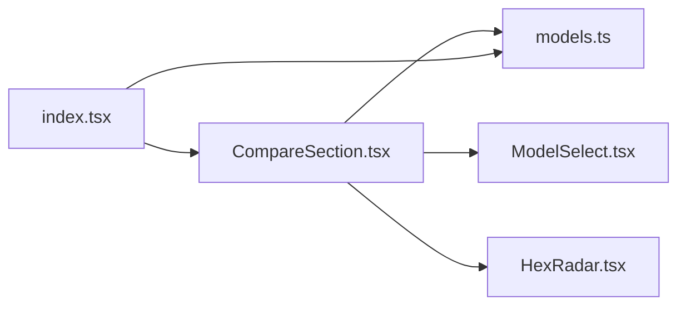

# CompareSection Component

<cite>
**Referenced Files in This Document**
- [CompareSection.tsx](file://src/components/CompareSection.tsx)
- [models.ts](file://src/data/models.ts)
- [index.tsx](file://src/routes/index.tsx)
- [ModelSelect.tsx](file://src/components/ModelSelect.tsx)
- [HexRadar.tsx](file://src/components/HexRadar.tsx)
</cite>

## Table of Contents
1. [Introduction](#introduction)
2. [Project Structure](#project-structure)
3. [Core Components](#core-components)
4. [Architecture Overview](#architecture-overview)
5. [Detailed Component Analysis](#detailed-component-analysis)
6. [Dependency Analysis](#dependency-analysis)
7. [Performance Considerations](#performance-considerations)
8. [Troubleshooting Guide](#troubleshooting-guide)
9. [Conclusion](#conclusion)

## Introduction
CompareSection is the main orchestrator for model comparisons on the application’s homepage. It manages up to three simultaneous model selections, coordinates user interactions through ModelSelect dropdowns, transforms selected models into radar chart series for HexRadar, and renders an exact-score table plus a legend. It also integrates with the results-source selector so users can switch between average scores, virtual sort views, and individual reporting-agent reports.

The component is stateless from its own perspective: it receives selected model IDs (`a`, `b`, `c`) and the active results source as props, computes derived data for rendering, and emits events back to the parent route through Qwik event handlers.

## Project Structure
CompareSection lives under `src/components` and is consumed by the root route at `src/routes/index.tsx`. It depends on shared data exports from `src/data/models.ts` and composes two UI components:
- `ModelSelect`: reusable dropdown for selecting models or results sources.
- `HexRadar`: SVG-based radar visualization that receives precomputed series data.

**Diagram sources**
- [index.tsx:103-179](file://src/routes/index.tsx#L103-L179)
- [CompareSection.tsx:1-319](file://src/components/CompareSection.tsx#L1-L319)
- [models.ts:1-355](file://src/data/models.ts#L1-L355)

**Section sources**
- [CompareSection.tsx:1-319](file://src/components/CompareSection.tsx#L1-L319)
- [index.tsx:103-179](file://src/routes/index.tsx#L103-L179)
- [models.ts:1-355](file://src/data/models.ts#L1-L355)

## Core Components
- **CompareSection**: Receives three model slots and a results source, builds series data, renders selectors, radar chart, legend, and score tables.
- **ModelSelect**: Dropdown component used both for model selection and for results-source selection.
- **HexRadar**: Visualization component that draws the hexagonal radar chart from series data.
- **Data layer (`models.ts`)**: Provides model metadata, scores, dimensions, colors, source registry, virtual view helpers, and lookup utilities.

Key responsibilities of CompareSection:
- Maintain slot labels and render three ModelSelect instances for slots `a`, `b`, and `c`.
- Resolve selected model IDs to model objects using `getModel`.
- Select the correct score set based on the active results source.
- Handle virtual sort views where ranking changes but displayed numbers remain the same as Overall.
- Deduplicate series when the same model is selected in multiple slots.
- Sort series according to virtual dimension when applicable.
- Render HexRadar with computed series.
- Render a legend showing model name, overall score, and free/paid status.
- Render an exact-score table for desktop and a card list for mobile.

**Section sources**
- [CompareSection.tsx:9-16](file://src/components/CompareSection.tsx#L9-L16)
- [CompareSection.tsx:20-70](file://src/components/CompareSection.tsx#L20-L70)
- [CompareSection.tsx:72-319](file://src/components/CompareSection.tsx#L72-L319)
- [models.ts:46-77](file://src/data/models.ts#L46-L77)
- [models.ts:121-166](file://src/data/models.ts#L121-L166)
- [models.ts:243-333](file://src/data/models.ts#L243-L333)

## Architecture Overview
At runtime, the root route owns the reactive selection state and URL synchronization. CompareSection is a presentational and coordination layer: it does not mutate global state directly but raises events through QRL callbacks.

**Diagram sources**
- [index.tsx:103-179](file://src/routes/index.tsx#L103-L179)
- [CompareSection.tsx:20-70](file://src/components/CompareSection.tsx#L20-L70)
- [CompareSection.tsx:88-121](file://src/components/CompareSection.tsx#L88-L121)
- [models.ts:243-333](file://src/data/models.ts#L243-L333)

## Detailed Component Analysis

### Props Interface
CompareSection exposes a focused prop interface:
- `a`: Selected model ID for slot A.
- `b`: Selected model ID for slot B.
- `c`: Selected model ID for slot C.
- `source`: Active results source, typed as `ResultsView`.
- `onSelect$`: QRL callback invoked when a ModelSelect changes; receives the slot key and the new model ID.
- `onSource$`: QRL callback invoked when the results-source selector changes; receives the new `ResultsView`.

This design keeps CompareSection declarative: all state ownership remains in the parent route, while CompareSection focuses on transformation and presentation.

**Section sources**
- [CompareSection.tsx:9-16](file://src/components/CompareSection.tsx#L9-L16)
- [index.tsx:103-179](file://src/routes/index.tsx#L103-L179)

### Slot Management and Model Selection
CompareSection renders three ModelSelect components labeled “Model A”, “Model B”, and “Model C”. Each dropdown:
- Uses a sorted list of available models.
- Excludes other selected model IDs to prevent duplicate selections across slots.
- Emits `onChange$` with the slot identifier and chosen model ID.

The component maps these slots to internal identifiers `a`, `b`, and `c`, which are then used to build the comparison series.

**Diagram sources**
- [CompareSection.tsx:18-26](file://src/components/CompareSection.tsx#L18-L26)
- [CompareSection.tsx:88-105](file://src/components/CompareSection.tsx#L88-L105)

**Section sources**
- [CompareSection.tsx:18-26](file://src/components/CompareSection.tsx#L18-L26)
- [CompareSection.tsx:88-105](file://src/components/CompareSection.tsx#L88-L105)

### Results Source Handling
The results-source selector allows switching between:
- Average Overall scores.
- Virtual sort views that use the same numbers as Overall but change ranking order.
- Individual reporting-agent reports.

CompareSection determines:
- The active label and file description for the current source.
- Whether the source is a virtual view using `virtualDimFor`.
- Which score set to use: model averages for average or virtual views, or per-source scores for real reporting agents.

**Diagram sources**
- [CompareSection.tsx:28-49](file://src/components/CompareSection.tsx#L28-L49)
- [models.ts:243-274](file://src/data/models.ts#L243-L274)

**Section sources**
- [CompareSection.tsx:28-49](file://src/components/CompareSection.tsx#L28-L49)
- [models.ts:243-274](file://src/data/models.ts#L243-L274)

### Data Processing Logic for Radar Series
CompareSection transforms selected model IDs into a series suitable for HexRadar:
1. Map each slot ID to a model object via `getModel`.
2. Determine whether the model has usable data for the active source.
3. Attach a color based on slot position.
4. Deduplicate series entries so the same model appears only once, preferring entries with data.
5. Sort series by the virtual dimension if the active source is a virtual view.
6. Convert the result into `RadarDatum[]` for HexRadar.

**Diagram sources**
- [CompareSection.tsx:32-70](file://src/components/CompareSection.tsx#L32-L70)
- [models.ts:331-333](file://src/data/models.ts#L331-L333)

**Section sources**
- [CompareSection.tsx:32-70](file://src/components/CompareSection.tsx#L32-L70)
- [models.ts:331-333](file://src/data/models.ts#L331-L333)

### Virtual Dimensions and Sorting Views
Virtual dimensions allow the results-source dropdown to re-rank models without changing the underlying numbers. When a virtual view is active:
- The displayed scores remain the same as Overall.
- The series and table columns follow the same ranking as the “All models” view.
- The component sorts series by the selected dimension and uses Overall as a tiebreaker.

This behavior ensures consistency between the radar legend, the comparison table, and the broader model cards.

**Section sources**
- [CompareSection.tsx:53-67](file://src/components/CompareSection.tsx#L53-L67)
- [models.ts:243-274](file://src/data/models.ts#L243-L274)

### Score Calculations and Display
CompareSection constructs rows for:
- All six scored dimensions.
- Overall Score.
- Context window.
- Pricing information.

It distinguishes between models with valid data and those without, displaying “N/A” where appropriate. The component also shows free versus paid status based on model metadata.

**Diagram sources**
- [CompareSection.tsx:72-76](file://src/components/CompareSection.tsx#L72-L76)
- [CompareSection.tsx:177-315](file://src/components/CompareSection.tsx#L177-L315)

**Section sources**
- [CompareSection.tsx:72-76](file://src/components/CompareSection.tsx#L72-L76)
- [CompareSection.tsx:177-315](file://src/components/CompareSection.tsx#L177-L315)

### Integration with HexRadar
HexRadar receives a `series` prop containing model objects and colors. CompareSection filters out series without data before passing them to HexRadar, ensuring the radar chart only renders meaningful comparisons.

**Diagram sources**
- [CompareSection.tsx:1-7](file://src/components/CompareSection.tsx#L1-L7)
- [CompareSection.tsx:68-70](file://src/components/CompareSection.tsx#L68-L70)
- [models.ts:121-166](file://src/data/models.ts#L121-L166)
- [models.ts:331-333](file://src/data/models.ts#L331-L333)

**Section sources**
- [CompareSection.tsx:68-70](file://src/components/CompareSection.tsx#L68-L70)
- [models.ts:121-166](file://src/data/models.ts#L121-L166)

### State Management Patterns
CompareSection itself does not hold reactive state. Instead:
- The root route stores `sel.a`, `sel.b`, `sel.c`, and `sel.source`.
- `handleSelect` updates a single slot.
- `handleSource` updates the source and resets the three slots to the top three models for that source.
- URL synchronization keeps the browser query string in sync with the store.

This pattern makes CompareSection predictable and testable: it is driven entirely by props and emits events upward.

**Diagram sources**
- [index.tsx:103-179](file://src/routes/index.tsx#L103-L179)
- [CompareSection.tsx:88-121](file://src/components/CompareSection.tsx#L88-L121)

**Section sources**
- [index.tsx:103-179](file://src/routes/index.tsx#L103-L179)
- [CompareSection.tsx:88-121](file://src/components/CompareSection.tsx#L88-L121)

### Examples of Component Usage
CompareSection is rendered by the root route with:
- Three model IDs passed as `a`, `b`, and `c`.
- The active results source passed as `source`.
- Event handlers `onSelect$` and `onSource$` wired to route-level logic.

Example usage patterns include:
- Defaulting to the top three models by Overall Score.
- Switching the default top three when the results source changes.
- Supporting deep links through URL query parameters.

**Section sources**
- [index.tsx:10-67](file://src/routes/index.tsx#L10-L67)
- [index.tsx:103-179](file://src/routes/index.tsx#L103-L179)
- [CompareSection.tsx:172-179](file://src/components/CompareSection.tsx#L172-L179)

## Dependency Analysis
CompareSection depends on:
- `models.ts` for model data, colors, dimensions, source definitions, and helper functions.
- `ModelSelect` for dropdown interaction.
- `HexRadar` for visualization.
- The root route for state ownership and URL synchronization.

**Diagram sources**
- [CompareSection.tsx:1-7](file://src/components/CompareSection.tsx#L1-L7)
- [index.tsx:1-8](file://src/routes/index.tsx#L1-L8)
- [models.ts:1-355](file://src/data/models.ts#L1-L355)

**Section sources**
- [CompareSection.tsx:1-7](file://src/components/CompareSection.tsx#L1-L7)
- [index.tsx:1-8](file://src/routes/index.tsx#L1-L8)
- [models.ts:1-355](file://src/data/models.ts#L1-L355)

## Performance Considerations
- CompareSection performs lightweight transformations over small arrays (three slots, a few dozen models).
- Series deduplication uses a `Map`, giving efficient lookups.
- Sorting occurs only when a virtual dimension is active.
- The heavy markdown content is intentionally kept out of the client bundle; scores and source metadata come from generated files.
- Avoid moving expensive computations into frequently triggered event handlers; keep them inside render-derived logic or memoized computations if needed.

[No sources needed since this section provides general guidance]

## Troubleshooting Guide
Common issues and how to diagnose them:
- **Missing model data**: If a selected model lacks scores for the active source, CompareSection marks it as having no data and displays “N/A” in the legend and table. Verify that the model has a usable average or the selected reporting agent report.
- **Unexpected sorting**: If the series order seems wrong, check whether the active source is a virtual view. Virtual views sort by the selected dimension rather than by Overall.
- **Duplicate models in legend**: CompareSection deduplicates series by model ID, preferring entries with data. If the same model appears in multiple slots, only one entry is shown.
- **URL not updating**: Ensure the root route’s `useVisibleTask$` is tracking the selection store and calling `history.replaceState`.
- **Source alias problems**: The route accepts “overall” as an alias for “average” and supports normalized slug-style keys for deep links.

**Section sources**
- [CompareSection.tsx:32-70](file://src/components/CompareSection.tsx#L32-L70)
- [CompareSection.tsx:137-173](file://src/components/CompareSection.tsx#L137-L173)
- [index.tsx:69-101](file://src/routes/index.tsx#L69-L101)
- [index.tsx:131-170](file://src/routes/index.tsx#L131-L170)

## Conclusion
CompareSection is a focused orchestration component that turns user-selected models and a results source into a consistent comparison experience. It delegates state ownership to the root route, transforms data into radar-ready series, handles virtual sorting views, and renders both visual and tabular comparisons. Its clear props interface, event-driven architecture, and reliance on generated data make it maintainable, predictable, and well integrated with the broader application.