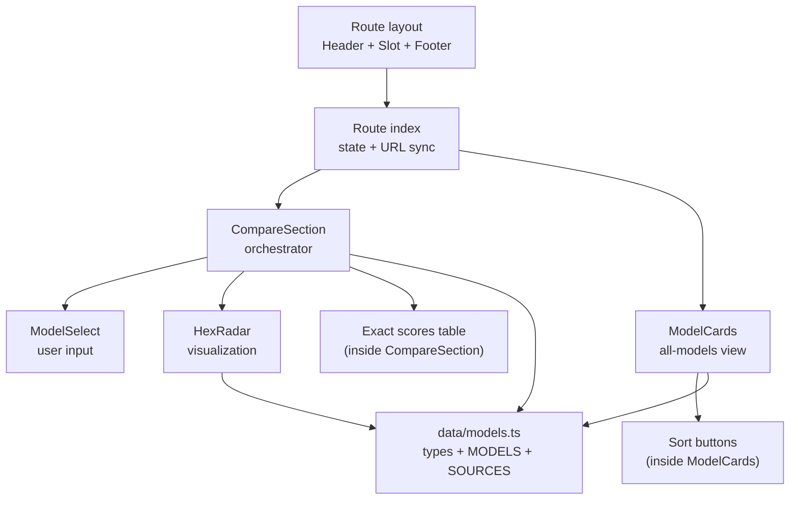
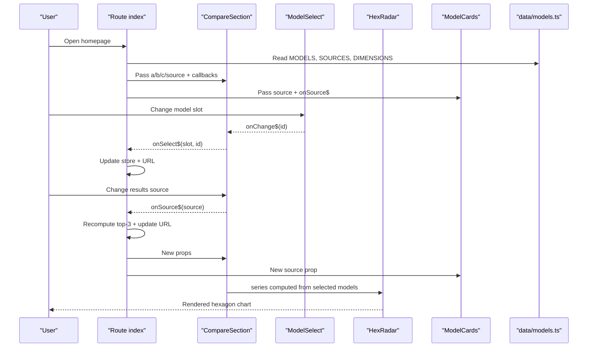
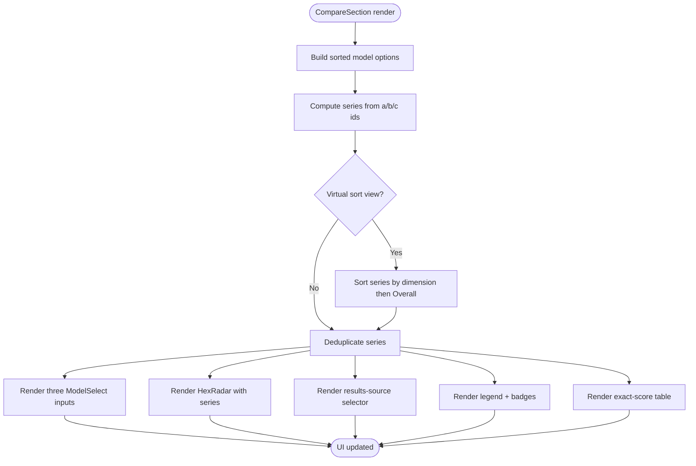
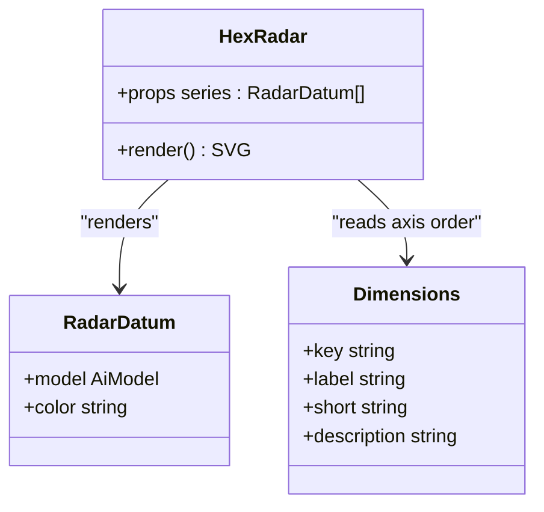
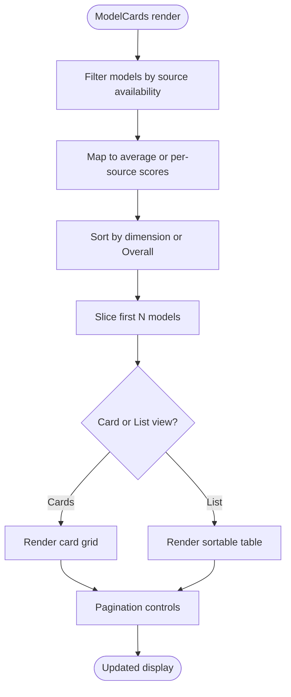
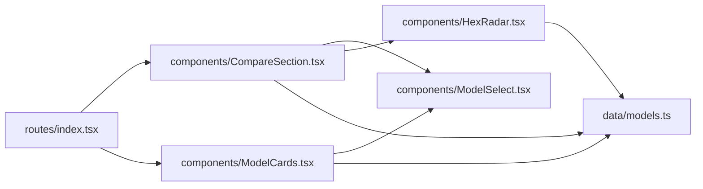
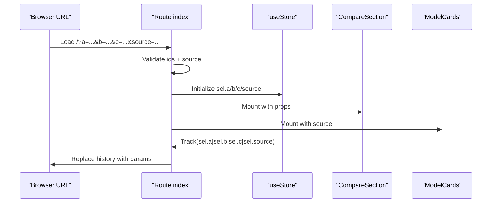

# Component Architecture & Composition

<cite>
**Referenced Files in This Document**
- [index.tsx](file://src/routes/index.tsx)
- [layout.tsx](file://src/routes/layout.tsx)
- [CompareSection.tsx](file://src/components/CompareSection.tsx)
- [HexRadar.tsx](file://src/components/HexRadar.tsx)
- [ModelCards.tsx](file://src/components/ModelCards.tsx)
- [ModelSelect.tsx](file://src/components/ModelSelect.tsx)
- [models.ts](file://src/data/models.ts)
- [tailwind.config.js](file://tailwind.config.js)
- [global.css](file://src/global.css)
</cite>

## Table of Contents
1. [Introduction](#introduction)
2. [Project Structure](#project-structure)
3. [Core Components](#core-components)
4. [Architecture Overview](#architecture-overview)
5. [Detailed Component Analysis](#detailed-component-analysis)
6. [Dependency Analysis](#dependency-analysis)
7. [Performance Considerations](#performance-considerations)
8. [Responsive Design and Mobile-First Patterns](#responsive-design-and-mobile-first-patterns)
9. [Styling System Integration](#styling-system-integration)
10. [Component Lifecycle and State Sharing](#component-lifecycle-and-state-sharing)
11. [Troubleshooting Guide](#troubleshooting-guide)
12. [Conclusion](#conclusion)

## Introduction
This document explains the component architecture and composition patterns used by the model comparison application. It focuses on how UI components are organized, how state flows from routes into reusable components, and how data is transformed into visualizations and tables. The main orchestrator is `CompareSection`, which composes `ModelSelect` for user input, `HexRadar` for visualization, and an exact-scores table; `ModelCards` provides a browsable list of all models with sorting and pagination.

The system uses Qwik components, Qwik City routing, Tailwind CSS for styling, and a generated data layer that hydrates models, dimensions, and results sources at build time.

## Project Structure
At a high level:
- Routes define page layout and shared state.
- Components implement presentation logic and small local interactions.
- The data layer defines types, dimensions, colors, model hydration, and source ordering.
- Styling is driven by Tailwind utilities and CSS variables for theme switching.

**Diagram sources**
- [index.tsx:103-179](file://src/routes/index.tsx#L103-L179)
- [CompareSection.tsx:20-110](file://src/components/CompareSection.tsx#L20-L110)
- [ModelCards.tsx:13-30](file://src/components/ModelCards.tsx#L13-L30)
- [HexRadar.tsx:62-67](file://src/components/HexRadar.tsx#L62-L67)
- [models.ts:121-166](file://src/data/models.ts#L121-L166)
- [layout.tsx:5-14](file://src/routes/layout.tsx#L5-L14)

**Section sources**
- [index.tsx:103-179](file://src/routes/index.tsx#L103-L179)
- [layout.tsx:5-14](file://src/routes/layout.tsx#L5-L14)

## Core Components
The core UI surface is composed around four primary components:

| Component | Responsibility | Key Props / Inputs | Outputs / Events |
|---|---|---|---|
| `CompareSection` | Orchestrates A/B/C model selection, results-source selection, radar chart, legend, and exact-score table. | `a`, `b`, `c`, `source`, `onSelect$`, `onSource$` | Emits slot changes and source changes via callbacks. |
| `HexRadar` | Renders an SVG hexagonal radar chart for selected model series. | `series` array of `{ model, color }` | None; pure presentational component. |
| `ModelCards` | Displays all models in cards or list view with sort-by-dimension controls and pagination. | `source`, `onSource$` | Emits sort/source changes. |
| `ModelSelect` | Reusable dropdown for selecting a model or result source. | `label`, `selectId`, `value`, `options`, `excludeIds`, `allowEmpty`, `onChange$` | Emits selected id. |

These components share typed data through `data/models.ts`, including `AiModel`, `ModelScores`, `DIMENSIONS`, `MODEL_COLORS`, `SOURCES`, and helper functions like `getModel`, `virtualDimFor`, and `sortSourceFor`.

**Section sources**
- [CompareSection.tsx:9-16](file://src/components/CompareSection.tsx#L9-L16)
- [HexRadar.tsx:5-12](file://src/components/HexRadar.tsx#L5-L12)
- [ModelCards.tsx:6-9](file://src/components/ModelCards.tsx#L6-L9)
- [ModelSelect.tsx:4-18](file://src/components/ModelSelect.tsx#L4-L18)
- [models.ts:46-77](file://src/data/models.ts#L46-L77)
- [models.ts:121-166](file://src/data/models.ts#L121-L166)

## Architecture Overview
The route owns global UI state and URL synchronization. It passes props down to `CompareSection` and `ModelCards`. Both components consume the same data layer but do not directly mutate it. Instead, they emit events upward through Qwik’s `QRL` callback pattern.

**Diagram sources**
- [index.tsx:103-179](file://src/routes/index.tsx#L103-L179)
- [CompareSection.tsx:20-121](file://src/components/CompareSection.tsx#L20-L121)
- [ModelSelect.tsx:20-46](file://src/components/ModelSelect.tsx#L20-L46)
- [HexRadar.tsx:62-167](file://src/components/HexRadar.tsx#L62-L167)
- [models.ts:318-333](file://src/data/models.ts#L318-L333)

## Detailed Component Analysis

### CompareSection — Main Orchestrator
`CompareSection` is the central UI controller for the comparison view. It:
- Builds sorted model options for the A/B/C selectors.
- Computes contributors and active source metadata.
- Transforms selected model ids into a deduplicated, optionally sorted series.
- Handles virtual sort views where the ranking dimension differs from the displayed values.
- Renders three subareas:
  - Three `ModelSelect` inputs for slots A, B, C.
  - `HexRadar` with computed series.
  - Results-source selector, legend, and exact-score table.

Key responsibilities:
- **Prop passing:** Receives `a`, `b`, `c`, `source`, and two event handlers.
- **Event handling:** Uses Qwik’s `QRL` callbacks to notify the route when a slot or source changes.
- **Data transformation:** Maps ids to models, applies per-source scores, filters missing data, and sorts by virtual dimension when needed.
- **Accessibility:** Uses semantic headings, labels, legends, and aria attributes.

**Diagram sources**
- [CompareSection.tsx:20-70](file://src/components/CompareSection.tsx#L20-L70)
- [CompareSection.tsx:88-175](file://src/components/CompareSection.tsx#L88-L175)
- [CompareSection.tsx:177-315](file://src/components/CompareSection.tsx#L177-L315)

**Section sources**
- [CompareSection.tsx:9-16](file://src/components/CompareSection.tsx#L9-L16)
- [CompareSection.tsx:20-70](file://src/components/CompareSection.tsx#L20-L70)
- [CompareSection.tsx:88-175](file://src/components/CompareSection.tsx#L88-L175)
- [CompareSection.tsx:177-315](file://src/components/CompareSection.tsx#L177-L315)

### HexRadar — Visualization Component
`HexRadar` is a pure presentational component that renders an SVG-based hexagonal radar chart. It:
- Accepts a `series` array of model-color pairs.
- Draws concentric rings at 25, 50, 75, 100.
- Draws six axes corresponding to `DIMENSIONS`.
- Draws one polygon per series using normalized scores.
- Draws labeled dots per dimension with tooltips.
- Uses non-linear radial scaling so higher scores visually emphasize the outer half of each axis.

Complexity:
- Rendering cost is proportional to `series.length × 6` points plus constant ring/axis overhead.
- No internal state; re-renders only when `series` changes.

**Diagram sources**
- [HexRadar.tsx:5-12](file://src/components/HexRadar.tsx#L5-L12)
- [HexRadar.tsx:62-167](file://src/components/HexRadar.tsx#L62-L167)
- [models.ts:121-161](file://src/data/models.ts#L121-L161)

**Section sources**
- [HexRadar.tsx:5-12](file://src/components/HexRadar.tsx#L5-L12)
- [HexRadar.tsx:62-167](file://src/components/HexRadar.tsx#L62-L167)

### ModelCards — Display and Sorting Component
`ModelCards` presents all tracked models and supports:
- Card view and list view toggle.
- Pagination with “Show more” and “Show all”.
- Sorting by any dimension or Overall score.
- Filtering to only models that have data for the selected results source.
- Mobile-friendly button group for sorting when the table is hidden.

State:
- Local signals control visible count and current view mode.
- Sorting is derived from the `source` prop and `virtualDimFor`.

**Diagram sources**
- [ModelCards.tsx:13-28](file://src/components/ModelCards.tsx#L13-L28)
- [ModelCards.tsx:74-125](file://src/components/ModelCards.tsx#L74-L125)
- [ModelCards.tsx:126-364](file://src/components/ModelCards.tsx#L126-L364)

**Section sources**
- [ModelCards.tsx:6-9](file://src/components/ModelCards.tsx#L6-L9)
- [ModelCards.tsx:13-28](file://src/components/ModelCards.tsx#L13-L28)
- [ModelCards.tsx:74-125](file://src/components/ModelCards.tsx#L74-L125)
- [ModelCards.tsx:126-364](file://src/components/ModelCards.tsx#L126-L364)

### ModelSelect — Reusable Input Component
`ModelSelect` is a controlled dropdown component used both for model slots and for the results-source selector. It:
- Renders a label and select element.
- Optionally shows an empty option.
- Excludes duplicate selections across slots.
- Emits the selected id through `onChange$`.

It is intentionally minimal and focused on accessibility and consistent styling.

**Section sources**
- [ModelSelect.tsx:4-18](file://src/components/ModelSelect.tsx#L4-L18)
- [ModelSelect.tsx:20-46](file://src/components/ModelSelect.tsx#L20-L46)

## Dependency Analysis
The dependency graph shows clear separation between route-level state, presentational components, and the data layer.

**Diagram sources**
- [index.tsx:1-8](file://src/routes/index.tsx#L1-L8)
- [CompareSection.tsx:1-7](file://src/components/CompareSection.tsx#L1-L7)
- [ModelCards.tsx:1-4](file://src/components/ModelCards.tsx#L1-L4)
- [HexRadar.tsx:1-3](file://src/components/HexRadar.tsx#L1-L3)
- [models.ts:18-30](file://src/data/models.ts#L18-L30)

Coupling characteristics:
- Components depend on `data/models.ts` for types and constants, but not on each other except through props and events.
- `CompareSection` depends on `ModelSelect` and `HexRadar`; `ModelCards` also uses `ModelSelect`.
- The route is the only place where global state (`useStore`) and URL synchronization live.

Potential circular dependencies:
- None observed among the analyzed files. Components import from the data layer, and the data layer does not import UI components.

External integration points:
- Qwik runtime for components and signals.
- Qwik City for routing and static generation.
- Tailwind CSS for utility classes and dark-mode class strategy.

**Section sources**
- [index.tsx:1-8](file://src/routes/index.tsx#L1-L8)
- [CompareSection.tsx:1-7](file://src/components/CompareSection.tsx#L1-L7)
- [ModelCards.tsx:1-4](file://src/components/ModelCards.tsx#L1-L4)
- [HexRadar.tsx:1-3](file://src/components/HexRadar.tsx#L1-L3)
- [models.ts:18-30](file://src/data/models.ts#L18-L30)

## Performance Considerations
- **Generated data avoids large markdown payloads:** Scores and source definitions are pre-parsed into TypeScript modules during build, preventing raw research prose from being bundled into the client.
- **Pure visualization component:** `HexRadar` has no internal state and computes SVG output based on props, minimizing unnecessary re-renders.
- **Local state in presentational components:** `ModelCards` uses local signals for view mode and pagination, avoiding global state churn.
- **Deduplication and filtering:** `CompareSection` deduplicates selected models and filters out entries without data for the chosen source, reducing redundant rendering.
- **Sorting is deterministic:** Sorting uses stable rules (dimension value, then Overall), ensuring predictable behavior and memoization-friendly updates.
- **URL-driven defaults:** The route recomputes default top-3 models based on the selected source, keeping initial UX fast while allowing user overrides.

[No sources needed since this section provides general guidance]

## Responsive Design and Mobile-First Patterns
The UI follows a mobile-first approach:
- Single-column layouts on small screens expand to multi-column grids on medium and large breakpoints.
- Tables are hidden on mobile; equivalent information is shown as stacked articles or lists.
- Sorting controls switch from clickable table headers on desktop to a row of filter-like buttons on mobile.
- The compare section uses a responsive grid to stack model selectors vertically on small screens and horizontally on larger screens.
- The radar chart scales via SVG `viewBox` and Tailwind width utilities.

Examples of responsive patterns:
- Grid columns change from `grid-cols-1` to `md:grid-cols-3`.
- Desktop-only wide tables use `hidden md:block`.
- Mobile-only interactive controls use `md:hidden`.

**Section sources**
- [CompareSection.tsx:88-110](file://src/components/CompareSection.tsx#L88-L110)
- [CompareSection.tsx:177-315](file://src/components/CompareSection.tsx#L177-L315)
- [ModelCards.tsx:74-125](file://src/components/ModelCards.tsx#L74-L125)
- [ModelCards.tsx:126-364](file://src/components/ModelCards.tsx#L126-L364)
- [HexRadar.tsx:67-67](file://src/components/HexRadar.tsx#L67-L67)

## Styling System Integration
Tailwind CSS is configured with:
- Class-based dark mode activation.
- Content scanning for Qwik and TSX files.
- Custom theme tokens mapped to CSS variables.

Global styles:
- CSS variables define light and dark theme colors.
- `html.dark` toggles the dark theme.
- Body background and text color transition smoothly.
- Smooth scrolling is enabled.

Integration notes:
- Components use Tailwind utility classes for spacing, typography, borders, shadows, focus states, and dark variants.
- Theme-aware colors are applied through both Tailwind utilities and CSS variables.
- Dark mode requires the `.dark` class on `html`, not `body`, to avoid race conditions with anti-flash scripts.

**Section sources**
- [tailwind.config.js:1-22](file://tailwind.config.js#L1-L22)
- [global.css:1-54](file://src/global.css#L1-L54)

## Component Lifecycle and State Sharing
State ownership:
- Global UI state lives in the route using `useStore`.
- The route reads query parameters, validates them against known models and sources, and initializes default selections.
- When a user selects a model or changes the results source, the route updates its store and synchronizes the URL.
- Child components receive props and emit events; they do not own the global selection state.

Lifecycle highlights:
- On mount, the route computes initial state from URL and data.
- `useVisibleTask$` tracks state changes and updates the browser history without reloading.
- If a deep link targets a reporting agent without explicit slots, the route redirects to the dedicated model page.
- Components like `ModelCards` manage their own local state for view mode and pagination.

**Diagram sources**
- [index.tsx:103-170](file://src/routes/index.tsx#L103-L170)

**Section sources**
- [index.tsx:10-18](file://src/routes/index.tsx#L10-L18)
- [index.tsx:69-101](file://src/routes/index.tsx#L69-L101)
- [index.tsx:103-170](file://src/routes/index.tsx#L103-L170)
- [ModelCards.tsx:13-18](file://src/components/ModelCards.tsx#L13-L18)

## Troubleshooting Guide
Common issues and resolutions:

| Symptom | Likely Cause | Resolution |
|---|---|---|
| Missing models or scores | Generated data not rebuilt after adding findings or meta files. | Run the data sync script and rebuild. |
| Warning about missing `average.md` | A model folder lacks usable average data. | Complete the model’s findings and run sync. |
| Duplicate model id warning | Two meta files declare the same id. | Fix meta.json ids to be unique. |
| Dark mode flicker or incorrect theme | `.dark` class applied to wrong element. | Ensure dark mode toggles `html.dark`, not `body.dark`. |
| Chart shows N/A for a selected model | Selected model lacks scores for the chosen results source. | Switch to Average or a source that includes the model. |
| URL does not reflect selections | Default state was not detected or task did not track changes. | Verify that selections differ from defaults and that tracking function runs. |

**Section sources**
- [models.ts:79-119](file://src/data/models.ts#L79-L119)
- [models.ts:190-218](file://src/data/models.ts#L190-L218)
- [models.ts:227-241](file://src/data/models.ts#L227-L241)
- [global.css:5-34](file://src/global.css#L5-L34)
- [CompareSection.tsx:32-51](file://src/components/CompareSection.tsx#L32-L51)
- [index.tsx:131-170](file://src/routes/index.tsx#L131-L170)

## Conclusion
The application’s component architecture centers on a clear separation of concerns:
- The route owns global state and URL synchronization.
- `CompareSection` orchestrates comparison inputs, visualization, and tabular data.
- `HexRadar` is a focused, stateless visualization component.
- `ModelCards` provides browsing, sorting, and pagination for all models.
- `ModelSelect` is a reusable input component.
- The data layer encapsulates types, dimensions, colors, model hydration, and source ordering.

This design promotes composability, testability, and maintainability while supporting responsive layouts, accessible interfaces, and performance-conscious rendering.