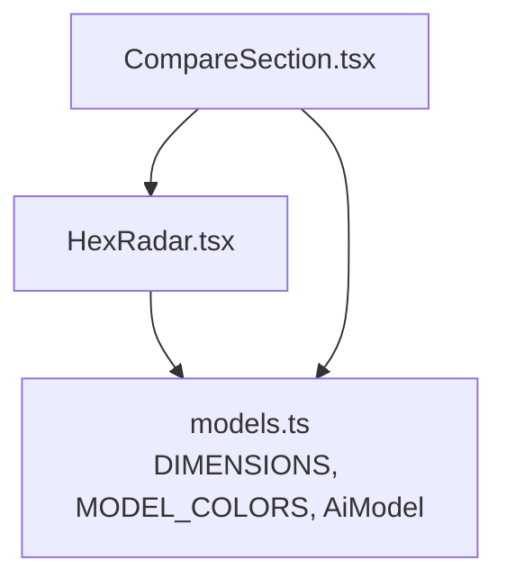
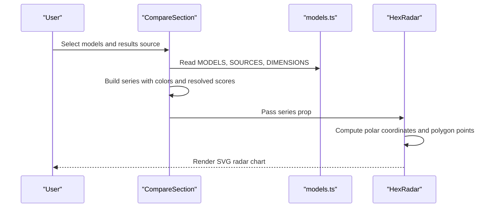
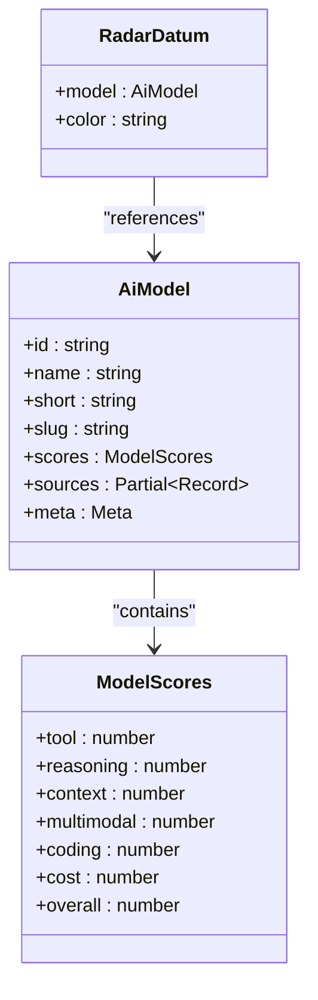
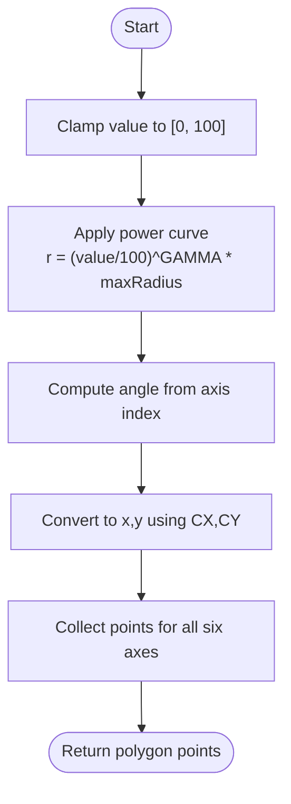
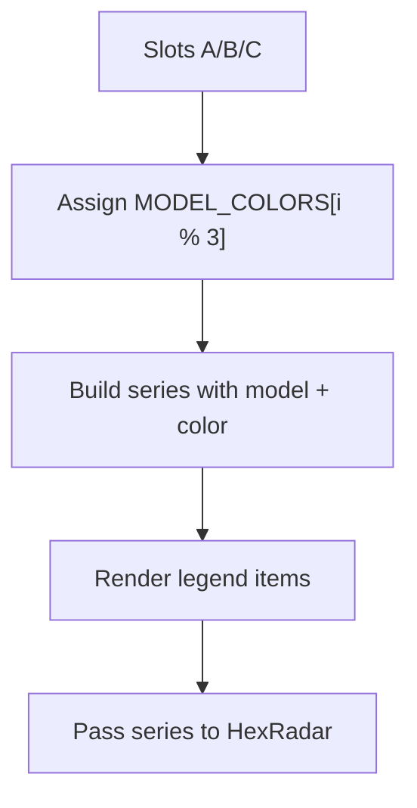
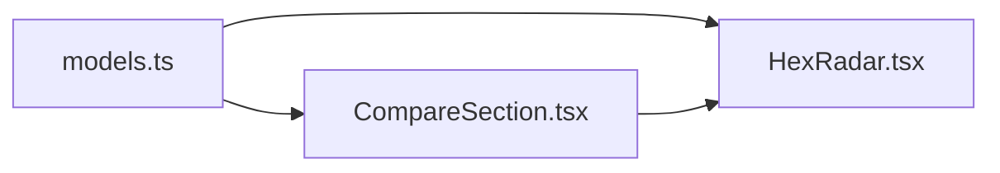

# HexRadar Visualization Component

<cite>
**Referenced Files in This Document**
- [HexRadar.tsx](file://src/components/HexRadar.tsx)
- [CompareSection.tsx](file://src/components/CompareSection.tsx)
- [models.ts](file://src/data/models.ts)
</cite>

## Table of Contents
1. [Introduction](#introduction)
2. [Project Structure](#project-structure)
3. [Core Components](#core-components)
4. [Architecture Overview](#architecture-overview)
5. [Detailed Component Analysis](#detailed-component-analysis)
6. [Dependency Analysis](#dependency-analysis)
7. [Performance Considerations](#performance-considerations)
8. [Troubleshooting Guide](#troubleshooting-guide)
9. [Conclusion](#conclusion)

## Introduction
The HexRadar component renders an interactive, SVG-based hexagonal radar chart for comparing AI models across six dimensions: tool use, reasoning, context window, multimodal support, coding, and cost efficiency. It is designed to be lightweight, responsive, and accessible, with a non-linear radial scale that visually emphasizes the top end of each axis. The component receives model series from its parent UI and maps them to polygons, data points, grid rings, axes, labels, and tooltips.

## Project Structure
HexRadar lives under the Qwik application’s component layer and consumes shared model metadata and dimension definitions from the data module. Its main consumer is the comparison section, which prepares selected models, assigns colors, and passes them as a series array.

**Diagram sources**
- [HexRadar.tsx:1-12](file://src/components/HexRadar.tsx#L1-L12)
- [CompareSection.tsx:1-10](file://src/components/CompareSection.tsx#L1-L10)
- [models.ts:121-166](file://src/data/models.ts#L121-L166)

**Section sources**
- [HexRadar.tsx:1-12](file://src/components/HexRadar.tsx#L1-L12)
- [CompareSection.tsx:1-10](file://src/components/CompareSection.tsx#L1-L10)
- [models.ts:121-166](file://src/data/models.ts#L121-L166)

## Core Components
- HexRadar: Renders the SVG radar chart, including grid rings, axes, per-model polygons, data-point circles, axis labels, and accessibility metadata.
- RadarDatum: The interface describing one visual series, pairing an `AiModel` with a color.
- CompareSection: Prepares the series by selecting models, resolving scores from the active results source, assigning colors, and passing the series to HexRadar.
- models.ts: Provides the fixed axis order (`DIMENSIONS`), model types (`AiModel`, `ModelScores`), and default series colors (`MODEL_COLORS`).

Key responsibilities:
- Coordinate calculation and polygon generation live inside HexRadar.
- Data preparation, selection, and color assignment live in CompareSection.
- Shared domain types and axis configuration live in models.ts.

**Section sources**
- [HexRadar.tsx:5-12](file://src/components/HexRadar.tsx#L5-L12)
- [CompareSection.tsx:32-70](file://src/components/CompareSection.tsx#L32-L70)
- [models.ts:46-77](file://src/data/models.ts#L46-L77)
- [models.ts:121-166](file://src/data/models.ts#L121-L166)

## Architecture Overview
HexRadar is a presentational component. It does not manage state; it receives a stable series array and renders deterministic SVG output. CompareSection owns the user-facing selection logic and computes the series before rendering HexRadar.

**Diagram sources**
- [CompareSection.tsx:32-70](file://src/components/CompareSection.tsx#L32-L70)
- [HexRadar.tsx:62-166](file://src/components/HexRadar.tsx#L62-L166)
- [models.ts:121-166](file://src/data/models.ts#L121-L166)

## Detailed Component Analysis

### RadarDatum Interface and Visual Mapping
`RadarDatum` pairs a model with a color. Each entry becomes:
- One filled polygon representing the model’s six-dimensional profile.
- Six data-point circles at the vertices.
- A tooltip providing detailed information for each point.

**Diagram sources**
- [HexRadar.tsx:5-8](file://src/components/HexRadar.tsx#L5-L8)
- [models.ts:46-77](file://src/data/models.ts#L46-L77)

**Section sources**
- [HexRadar.tsx:5-8](file://src/components/HexRadar.tsx#L5-L8)
- [models.ts:46-77](file://src/data/models.ts#L46-L77)

### SVG Coordinate System and Polygon Rendering
HexRadar uses a centered coordinate system with:
- Center `(CX, CY)` = `(200, 200)`.
- Maximum radius `MAX_R` = `130`.
- Label radius `LABEL_R` = `168`.
- Six axes spaced every 60 degrees, starting at the top (-90 degrees).

Coordinate computation steps:
1. Normalize the raw score into `[0, 100]`.
2. Apply a non-linear power curve so that the range `75–100` occupies the outer half of the axis while keeping the transition smooth.
3. Convert normalized radius and angle to Cartesian coordinates using trigonometry.
4. Join computed points into an SVG `points` attribute for `<polygon>` elements.

**Diagram sources**
- [HexRadar.tsx:14-33](file://src/components/HexRadar.tsx#L14-L33)
- [HexRadar.tsx:35-42](file://src/components/HexRadar.tsx#L35-L42)

Rendering pipeline:
- Grid rings are drawn for values `25, 50, 75, 100`.
- Axes are lines from center to the maximum radius.
- Each series draws one polygon and six circles.
- Axis labels are placed at the label radius.

**Section sources**
- [HexRadar.tsx:14-42](file://src/components/HexRadar.tsx#L14-L42)
- [HexRadar.tsx:62-166](file://src/components/HexRadar.tsx#L62-L166)

### Color Management and Legend Generation
Colors are assigned by CompareSection based on slot position:
- Slot A gets the first color.
- Slot B gets the second color.
- Slot C gets the third color.
- If more than three slots were used, colors would cycle through the available palette.

The legend is generated in CompareSection and shows:
- A colored dot.
- The model name.
- The overall score or “N/A” when data is missing.
- A free/paid indicator derived from model metadata.

**Diagram sources**
- [CompareSection.tsx:32-70](file://src/components/CompareSection.tsx#L32-L70)
- [models.ts:165-166](file://src/data/models.ts#L165-L166)

**Section sources**
- [CompareSection.tsx:32-70](file://src/components/CompareSection.tsx#L32-L70)
- [models.ts:165-166](file://src/data/models.ts#L165-L166)

### Responsive Scaling Behavior
HexRadar uses an SVG with a fixed `viewBox="0 0 400 400"` and applies CSS width constraints:
- The container centers the chart.
- The chart scales to full width up to a maximum width.
- Tailwind utility classes control responsive sizing and dark-mode styling.

This approach ensures the chart remains readable on small screens while preserving aspect ratio.

**Section sources**
- [HexRadar.tsx:67-67](file://src/components/HexRadar.tsx#L67-L67)

### Accessibility Features
HexRadar includes several accessibility features:
- `role="img"` marks the SVG as an image.
- `aria-labelledby` connects the SVG to a title and description.
- A human-readable `<title>` summarizes the compared models.
- A `<desc>` explains the chart type, axes, scaling behavior, and where exact values can be found.
- Each data point has a `<title>` with detailed tooltip text.
- Axis labels include descriptions via `<title>`.

Tooltip content adapts for special dimensions:
- Cost shows pricing notes.
- Context shows context window details.
- Multimodal shows supported modalities.
- Special promotional models include additional contextual notes.

**Section sources**
- [HexRadar.tsx:46-60](file://src/components/HexRadar.tsx#L46-L60)
- [HexRadar.tsx:67-73](file://src/components/HexRadar.tsx#L67-L73)
- [HexRadar.tsx:122-141](file://src/components/HexRadar.tsx#L122-L141)
- [HexRadar.tsx:145-161](file://src/components/HexRadar.tsx#L145-L161)

### Handling Different Data Sets
CompareSection supports multiple result views:
- Average view uses the model’s averaged scores.
- Virtual sort views reuse average scores but change ranking.
- Reporting-agent views swap to per-source scores when available.
- Missing data is handled gracefully by marking entries as having no data and showing “N/A” in legends and tables.

This allows HexRadar to render consistently even when some models lack scores for a particular source.

**Section sources**
- [CompareSection.tsx:32-70](file://src/components/CompareSection.tsx#L32-L70)

### Customizing Chart Appearance
HexRadar is intentionally minimal and relies on CSS classes for styling. To customize appearance:
- Override Tailwind classes applied to polygons, circles, grid rings, and labels.
- Adjust fill opacity, stroke width, and colors through CSS or theme configuration.
- Extend the series data to include additional metadata if needed, while keeping the required `model` and `color` fields.

Because HexRadar does not expose style props, customization should happen at the CSS level or by wrapping the component in a styled container.

**Section sources**
- [HexRadar.tsx:74-161](file://src/components/HexRadar.tsx#L74-L161)

### Integrating with External Styling Systems
Since HexRadar uses Tailwind utility classes and standard SVG attributes:
- Tailwind themes can modify colors, spacing, and dark-mode variants.
- Global CSS can override SVG styles such as `fill`, `stroke`, and `font-size`.
- External design systems can provide consistent tokens by targeting the rendered SVG elements.

No internal style configuration object exists in HexRadar, so integration is primarily CSS-driven.

**Section sources**
- [HexRadar.tsx:67-161](file://src/components/HexRadar.tsx#L67-L161)

## Dependency Analysis
HexRadar depends on:
- `DIMENSIONS` from `models.ts` for axis order and labels.
- `AiModel` type from `models.ts` for data structure.
- CompareSection for supplying the series.

CompareSection depends on:
- `MODELS`, `MODEL_COLORS`, `DIMENSIONS`, `SOURCES`, and helper functions from `models.ts`.
- HexRadar for visualization.

**Diagram sources**
- [HexRadar.tsx:1-3](file://src/components/HexRadar.tsx#L1-L3)
- [CompareSection.tsx:1-7](file://src/components/CompareSection.tsx#L1-L7)
- [models.ts:121-166](file://src/data/models.ts#L121-L166)

**Section sources**
- [HexRadar.tsx:1-3](file://src/components/HexRadar.tsx#L1-L3)
- [CompareSection.tsx:1-7](file://src/components/CompareSection.tsx#L1-L7)
- [models.ts:121-166](file://src/data/models.ts#L121-L166)

## Performance Considerations
- Fixed geometry: The chart always renders six axes, four grid rings, and up to six polygons plus six circles per series. Complexity grows linearly with the number of series.
- Lightweight math: Coordinate calculations are simple trigonometric operations performed during render.
- No animation or interaction handlers: HexRadar is static, reducing runtime overhead.
- Large datasets: Since only selected models are passed as series, performance remains stable even when the full model catalog is large.
- Memory usage: The component does not cache large intermediate structures; it computes points directly during rendering.

Optimization recommendations:
- Keep the series array small by limiting comparisons to three models.
- Avoid frequent re-renders of the same series by memoizing series construction in the parent component.
- Use CSS transforms sparingly; SVG scaling is already efficient.

[No sources needed since this section provides general guidance]

## Troubleshooting Guide
Common issues and resolutions:
- Empty or missing model data:
  - Symptom: Legend shows “Overall N/A” and table cells show “N/A”.
  - Cause: Selected model lacks scores for the active results source.
  - Resolution: Switch to the average view or select a reporting agent with available data.

- Colors not matching expectations:
  - Symptom: Series colors differ from expected mapping.
  - Cause: Colors are assigned by slot index modulo the color palette length.
  - Resolution: Ensure slot ordering matches intended model positions.

- Tooltip text not appearing:
  - Symptom: Hovering over data points shows no tooltip.
  - Cause: Browser may suppress native SVG tooltips in some environments.
  - Resolution: Verify that `<title>` elements are present and that the browser supports SVG titles.

- Chart looks too small or distorted:
  - Symptom: Chart appears cramped or stretched.
  - Cause: Container width constraints or CSS overrides.
  - Resolution: Check responsive width classes and ensure the SVG container respects the `viewBox`.

**Section sources**
- [CompareSection.tsx:137-173](file://src/components/CompareSection.tsx#L137-L173)
- [HexRadar.tsx:122-141](file://src/components/HexRadar.tsx#L122-L141)
- [HexRadar.tsx:67-67](file://src/components/HexRadar.tsx#L67-L67)

## Conclusion
HexRadar provides a clear, accessible, and performant way to compare AI models across six key dimensions. Its SVG-based implementation keeps dependencies minimal, while its non-linear radial scale improves visual discrimination at high scores. CompareSection handles data preparation, color assignment, and legend generation, leaving HexRadar focused on rendering. The component integrates cleanly with Tailwind-based styling and external design systems through CSS, making it adaptable without sacrificing simplicity.