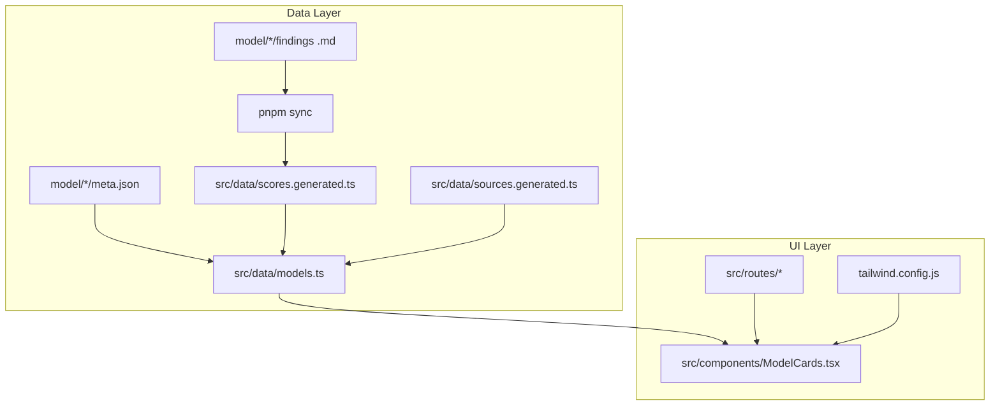
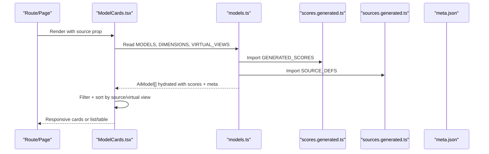
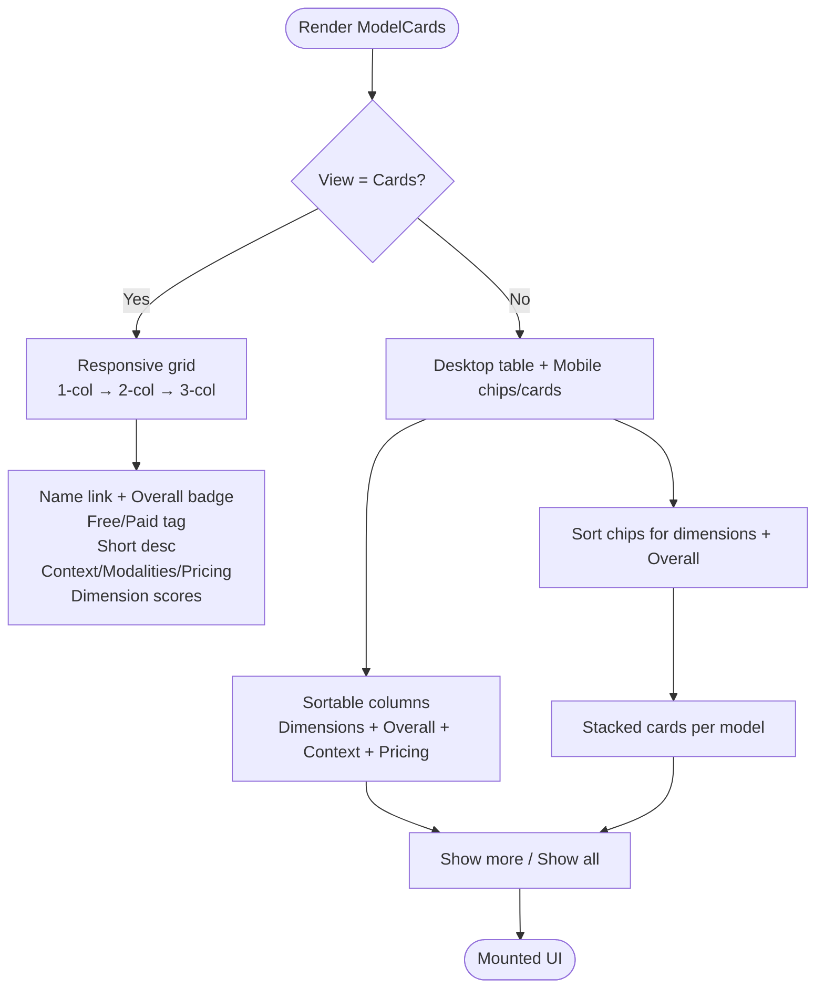
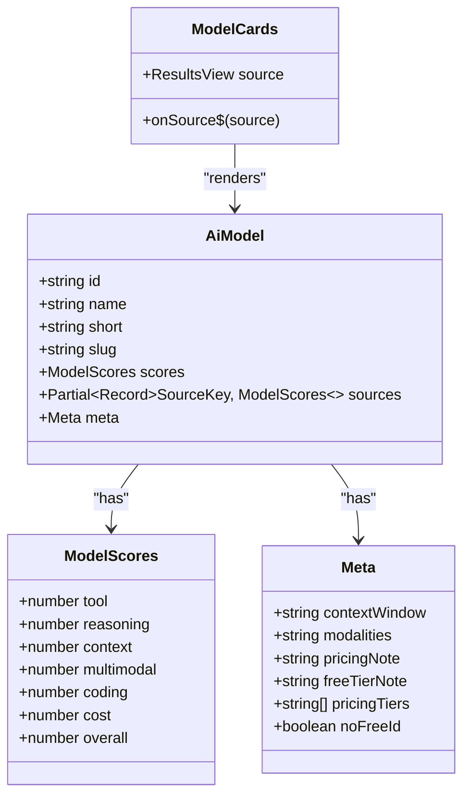
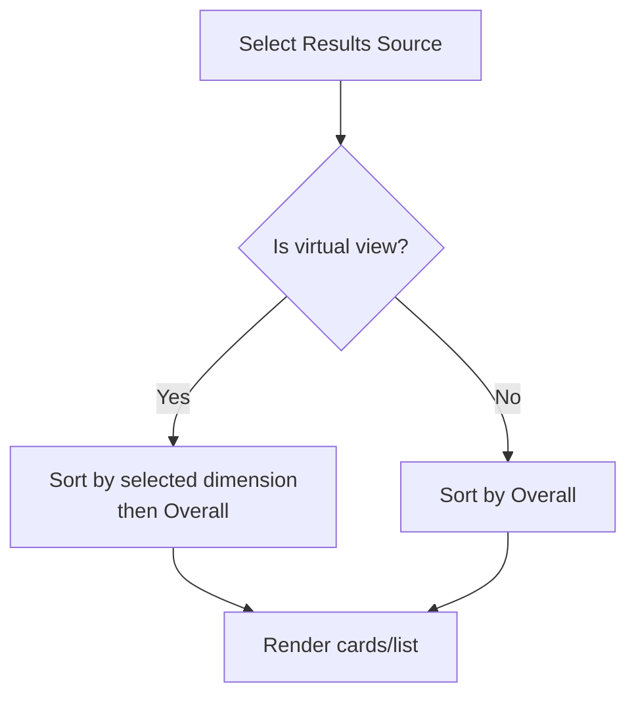
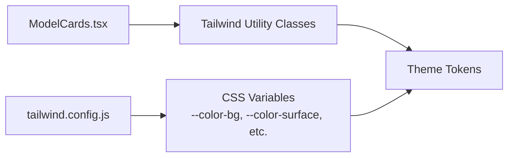
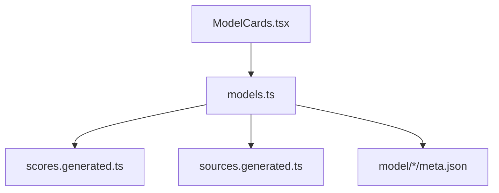

# ModelCards Display Component

<cite>
**Referenced Files in This Document**   
- [ModelCards.tsx](file://src/components/ModelCards.tsx)
- [models.ts](file://src/data/models.ts)
- [sources.generated.ts](file://src/data/sources.generated.ts)
- [scores.generated.ts](file://src/data/scores.generated.ts)
- [meta.json](file://model/Inkling/meta.json)
- [tailwind.config.js](file://tailwind.config.js)
- [README.md](file://README.md)
</cite>

## Table of Contents
1. [Introduction](#introduction)
2. [Project Structure](#project-structure)
3. [Core Components](#core-components)
4. [Architecture Overview](#architecture-overview)
5. [Detailed Component Analysis](#detailed-component-analysis)
6. [Dependency Analysis](#dependency-analysis)
7. [Performance Considerations](#performance-considerations)
8. [Troubleshooting Guide](#troubleshooting-guide)
9. [Conclusion](#conclusion)
10. [Appendices](#appendices)

## Introduction
The ModelCards component is the main display surface for showing individual model information and comparison results across all models. It supports two presentation modes: a responsive card grid and a sortable list/table view. The component reads curated metadata, pre-parsed scores, and reporting-agent sources from generated data modules, then renders model cards with overall scores, pricing indicators, context window, modalities, and per-dimension scores.

It also provides:
- A Cards/List toggle.
- Sorting by Overall or any dimension through virtual sort views.
- Pagination via a “Show more” button.
- Mobile-first responsive layouts that switch between table and stacked mobile cards.
- Dark mode support through Tailwind’s class-based dark mode.

This document explains how the component works, how it binds to data, how it integrates with Tailwind CSS, and how to extend or customize its behavior.

## Project Structure
ModelCards lives under `src/components` and consumes typed data from `src/data`. Scores are auto-generated from research files under `model/<slug>/`, while human-curated display metadata lives in `model/<slug>/meta.json`.

**Diagram sources**
- [README.md:31-44](file://README.md#L31-L44)
- [models.ts:6-16](file://src/data/models.ts#L6-L16)
- [ModelCards.tsx:1-5](file://src/components/ModelCards.tsx#L1-L5)
- [tailwind.config.js:1-23](file://tailwind.config.js#L1-L23)

**Section sources**
- [README.md:31-44](file://README.md#L31-L44)
- [README.md:61-82](file://README.md#L61-L82)

## Core Components
- **ModelCards component**: Renders the All models section, handles view state (cards vs list), sorting, pagination, and accessibility attributes.
- **Models data module**: Hydrates model objects from generated scores and meta files, defines dimensions, virtual views, source ordering, and helper functions used by UI components.
- **Generated score registry**: Compact numeric scores parsed at build time from findings files.
- **Generated source registry**: Reporting agent keys, labels, filenames, and optional slug mappings.
- **Meta files**: Human-curated display fields such as name, short description, context window, modalities, and pricing notes.

Key responsibilities:
- Data binding: maps `AiModel` properties to card fields.
- Sorting: uses virtual sort views to rank by dimension or Overall.
- Layout: responsive grid for cards; table for desktop list; stacked cards for mobile list.
- Theming: Tailwind classes with dark mode variables.

**Section sources**
- [ModelCards.tsx:1-28](file://src/components/ModelCards.tsx#L1-L28)
- [models.ts:46-77](file://src/data/models.ts#L46-L77)
- [models.ts:121-163](file://src/data/models.ts#L121-L163)
- [sources.generated.ts:5-81](file://src/data/sources.generated.ts#L5-L81)
- [scores.generated.ts:1-13](file://src/data/scores.generated.ts#L1-L13)
- [meta.json:1-8](file://model/Inkling/meta.json#L1-L8)

## Architecture Overview
At runtime, ModelCards receives a `source` value indicating which ResultsView to display (average, a virtual dimension view, or a reporting agent). It filters and sorts the global `MODELS` array accordingly, then renders either:
- A responsive card grid showing each model’s name, overall badge, free/paid indicator, short description, context/window, modalities, pricing note, and dimension scores.
- A desktop table with sortable columns plus a mobile-friendly set of filter buttons and stacked detail cards.

**Diagram sources**
- [ModelCards.tsx:1-28](file://src/components/ModelCards.tsx#L1-L28)
- [models.ts:18-20](file://src/data/models.ts#L18-L20)
- [models.ts:227-241](file://src/data/models.ts#L227-L241)
- [scores.generated.ts:1-13](file://src/data/scores.generated.ts#L1-L13)
- [sources.generated.ts:83-146](file://src/data/sources.generated.ts#L83-L146)

## Detailed Component Analysis

### Card Layout System and Responsive Grid
ModelCards implements a mobile-first layout:
- Cards grid: one column on small screens, two columns on medium screens, three columns on large screens.
- Each card contains:
  - Model name linking to its detail page.
  - Overall score badge.
  - Free/Paid indicator based on `meta.noFreeId`.
  - Short description.
  - Context window, modalities, and pricing note.
  - Dimension scores summary line.

For the list view:
- Desktop shows a full table with sortable dimension columns and an Overall column.
- Mobile hides the table and instead shows:
  - A horizontal group of filter chips to sort by dimension or Overall.
  - Stacked cards listing each dimension, Overall, context window, and pricing tiers.

Pagination:
- Starts with a limited number of visible models.
- “Show more” increases the count by a fixed increment.
- In list view, a “Show all” button expands to render all models.

Accessibility:
- Uses semantic headings, `aria-labelledby`, `role="group"`, `aria-pressed`, and `aria-sort` to improve screen reader experience.

**Diagram sources**
- [ModelCards.tsx:74-125](file://src/components/ModelCards.tsx#L74-L125)
- [ModelCards.tsx:126-339](file://src/components/ModelCards.tsx#L126-L339)
- [ModelCards.tsx:341-364](file://src/components/ModelCards.tsx#L341-L364)

**Section sources**
- [ModelCards.tsx:30-73](file://src/components/ModelCards.tsx#L30-L73)
- [ModelCards.tsx:74-125](file://src/components/ModelCards.tsx#L74-L125)
- [ModelCards.tsx:126-339](file://src/components/ModelCards.tsx#L126-L339)
- [ModelCards.tsx:341-364](file://src/components/ModelCards.tsx#L341-L364)

### Data Binding Mechanisms
ModelCards binds to several data sources:
- `MODELS`: Hydrated model objects containing identifiers, names, slugs, average scores, per-source scores, and curated metadata.
- `DIMENSIONS`: Ordered list of scoring dimensions used to render table headers and card summaries.
- `VIRTUAL_VIEWS` and helpers (`virtualDimFor`, `sortSourceFor`): Enable ranking by a specific dimension without changing underlying scores.
- `SOURCE_DEFS` and `ResultsView`: Define selectable results sources including average, virtual views, and reporting agents.
- `meta.json`: Provides display-oriented fields like `contextWindow`, `modalities`, `pricingNote`, `freeTierNote`, `noFreeId`, and optional `pricingTiers`.

Binding highlights:
- Name and slug drive links to `/model/{slug}/`.
- `m.scores.overall` drives the badge and table Overall column.
- `m.meta.noFreeId` toggles Free vs Paid fallback label.
- `m.meta.contextWindow`, `m.meta.modalities`, and `m.meta.pricingNote` populate card details.
- `m.meta.pricingTiers` (if present) renders multiple pricing lines; otherwise falls back to `pricingNote`.
- Dimension scores are rendered both as a compact summary line and as detailed rows in the list/mobile cards.

**Diagram sources**
- [models.ts:46-77](file://src/data/models.ts#L46-L77)
- [ModelCards.tsx:1-9](file://src/components/ModelCards.tsx#L1-L9)

**Section sources**
- [models.ts:46-77](file://src/data/models.ts#L46-L77)
- [models.ts:121-163](file://src/data/models.ts#L121-L163)
- [models.ts:227-241](file://src/data/models.ts#L227-L241)
- [sources.generated.ts:5-81](file://src/data/sources.generated.ts#L5-L81)
- [scores.generated.ts:1-13](file://src/data/scores.generated.ts#L1-L13)
- [meta.json:1-8](file://model/Inkling/meta.json#L1-L8)

### Sorting and Virtual Views
ModelCards supports sorting by:
- Overall (average view).
- Any dimension via virtual sort views.

Virtual views mirror average scores but change the ranking key. When a dimension is selected:
- `virtualDimFor(source)` returns the corresponding dimension key.
- Models are sorted by that dimension descending, with Overall as tiebreaker.
- The same logic applies to table header clicks and mobile chip filters.

**Diagram sources**
- [ModelCards.tsx:16-27](file://src/components/ModelCards.tsx#L16-L27)
- [models.ts:251-274](file://src/data/models.ts#L251-L274)

**Section sources**
- [ModelCards.tsx:16-27](file://src/components/ModelCards.tsx#L16-L27)
- [ModelCards.tsx:147-173](file://src/components/ModelCards.tsx#L147-L173)
- [ModelCards.tsx:245-279](file://src/components/ModelCards.tsx#L245-L279)
- [models.ts:251-274](file://src/data/models.ts#L251-L274)

### Styling System Integration with Tailwind CSS
ModelCards uses Tailwind utility classes extensively:
- Layout: responsive grids, flex containers, spacing, borders, shadows.
- Typography: font sizes, weights, colors, transitions.
- Interactive states: hover, focus rings, active pressed states.
- Dark mode: uses `dark:` variants throughout.

Tailwind configuration enables class-based dark mode and maps design tokens to CSS variables:
- Background, surface, primary, secondary, text, border colors are mapped to CSS custom properties.
- This allows theme customization via CSS variables rather than hard-coded Tailwind colors.

**Diagram sources**
- [tailwind.config.js:1-23](file://tailwind.config.js#L1-L23)
- [ModelCards.tsx:30-73](file://src/components/ModelCards.tsx#L30-L73)

**Section sources**
- [tailwind.config.js:1-23](file://tailwind.config.js#L1-L23)
- [ModelCards.tsx:30-73](file://src/components/ModelCards.tsx#L30-L73)
- [ModelCards.tsx:74-125](file://src/components/ModelCards.tsx#L74-L125)
- [ModelCards.tsx:126-339](file://src/components/ModelCards.tsx#L126-L339)

### Mobile-First Design Patterns
ModelCards follows mobile-first principles:
- Default styles target small screens.
- Breakpoints (`md:`, `lg:`) progressively enhance layout for larger screens.
- On mobile, the table is hidden and replaced by:
  - Horizontal filter chips for sorting.
  - Stacked cards with dimension rows and pricing lists.
- Touch-friendly controls use rounded buttons, adequate padding, and clear focus rings.

**Section sources**
- [ModelCards.tsx:126-339](file://src/components/ModelCards.tsx#L126-L339)

### Examples of Customization

#### Adding a New Data Field to Cards
To add a new field (for example, a new metadata attribute):
1. Extend the metadata schema in `models.ts` if needed.
2. Add the field to `meta.json` for the relevant model(s).
3. Update the card rendering in ModelCards to display the new field.
4. If the field should appear in the list/table, update the table row and mobile card sections.

Relevant paths:
- Metadata hydration and types: [models.ts:46-77](file://src/data/models.ts#L46-L77), [models.ts:169-180](file://src/data/models.ts#L169-L180)
- Card rendering: [ModelCards.tsx:74-125](file://src/components/ModelCards.tsx#L74-L125)
- List/table rendering: [ModelCards.tsx:204-240](file://src/components/ModelCards.tsx#L204-L240)
- Mobile card rendering: [ModelCards.tsx:280-337](file://src/components/ModelCards.tsx#L280-L337)

#### Extending the Display Format for Additional Model Attributes
If you want to show additional attributes (for example, latency, provider region, or license type):
- Add the attribute to `meta.json` where appropriate.
- Extend the `Meta` interface in `models.ts` if necessary.
- Render the attribute in:
  - Card summary area.
  - Table columns.
  - Mobile stacked cards.
- Optionally add a tooltip or help text using existing patterns.

Relevant paths:
- Metadata structure: [models.ts:46-77](file://src/data/models.ts#L46-L77)
- Card details: [ModelCards.tsx:104-122](file://src/components/ModelCards.tsx#L104-L122)
- Table pricing/details: [ModelCards.tsx:232-239](file://src/components/ModelCards.tsx#L232-L239)
- Mobile details: [ModelCards.tsx:321-334](file://src/components/ModelCards.tsx#L321-L334)

#### Changing Card Layout or Theme
To adjust card layout or theme:
- Modify Tailwind classes in ModelCards for spacing, borders, colors, and typography.
- Adjust Tailwind config to map new CSS variables or override token values.
- Use existing dark mode patterns (`dark:` variants) consistently.

Relevant paths:
- Card container and content: [ModelCards.tsx:74-125](file://src/components/ModelCards.tsx#L74-L125)
- Tailwind config: [tailwind.config.js:1-23](file://tailwind.config.js#L1-L23)

## Dependency Analysis
ModelCards depends on:
- Qwik primitives for signals and components.
- Data layer exports: `DIMENSIONS`, `MODELS`, `sortSourceFor`, `virtualDimFor`.
- Types: `AiModel`, `ResultsView`, `SourceKey`.

The data layer depends on:
- Generated scores from `scores.generated.ts`.
- Source registry from `sources.generated.ts`.
- Curated metadata from `model/*/meta.json`.

**Diagram sources**
- [ModelCards.tsx:1-5](file://src/components/ModelCards.tsx#L1-L5)
- [models.ts:18-20](file://src/data/models.ts#L18-L20)
- [models.ts:227-241](file://src/data/models.ts#L227-L241)

**Section sources**
- [ModelCards.tsx:1-5](file://src/components/ModelCards.tsx#L1-L5)
- [models.ts:18-20](file://src/data/models.ts#L18-L20)
- [models.ts:227-241](file://src/data/models.ts#L227-L241)

## Performance Considerations
- Pre-parsed scores avoid inlining raw markdown into the client bundle, reducing payload size.
- Sorting and filtering operate on in-memory arrays; pagination limits initial render to a subset of models.
- Virtual views reuse average scores and only change ranking, avoiding extra data fetching.
- Tailwind’s class-based dark mode avoids heavy JS-driven theme switching.

[No sources needed since this section provides general guidance]

## Troubleshooting Guide
Common issues and resolutions:
- Missing or incomplete metadata:
  - Symptom: Build warnings about missing required fields or skipped models.
  - Resolution: Ensure `meta.json` includes required fields (`id`, `name`, `short`, `contextWindow`, `modalities`, `pricingNote`).
- No usable average:
  - Symptom: Warning about missing `average.md`; model skipped.
  - Resolution: Run `pnpm sync` to regenerate averages.
- New model not appearing:
  - Symptom: Model folder exists but does not show up.
  - Resolution: Add `meta.json`, run `pnpm sync`, then rebuild.
- Dark mode not applying:
  - Symptom: Dark variants do not take effect.
  - Resolution: Ensure Tailwind config has `darkMode: "class"` and CSS variables are defined.

**Section sources**
- [models.ts:79-119](file://src/data/models.ts#L79-L119)
- [models.ts:182-218](file://src/data/models.ts#L182-L218)
- [README.md:84-91](file://README.md#L84-L91)
- [tailwind.config.js:1-23](file://tailwind.config.js#L1-L23)

## Conclusion
ModelCards provides a robust, accessible, and responsive display for AI model comparisons. It cleanly separates concerns between data hydration, sorting logic, and UI rendering. Its integration with Tailwind CSS and CSS variables makes theming straightforward, while the generated data pipeline ensures that adding new models and sources requires minimal code changes. For extensions, follow the established patterns for metadata, card rendering, and list/table updates.

[No sources needed since this section summarizes without analyzing specific files]

## Appendices

### Data Flow Summary
- Research findings and averages are processed by `pnpm sync`.
- Generated scores and source definitions are imported by the models module.
- Models are hydrated with metadata and scores.
- ModelCards renders the UI based on the selected results source.

**Section sources**
- [README.md:31-44](file://README.md#L31-L44)
- [README.md:61-82](file://README.md#L61-L82)