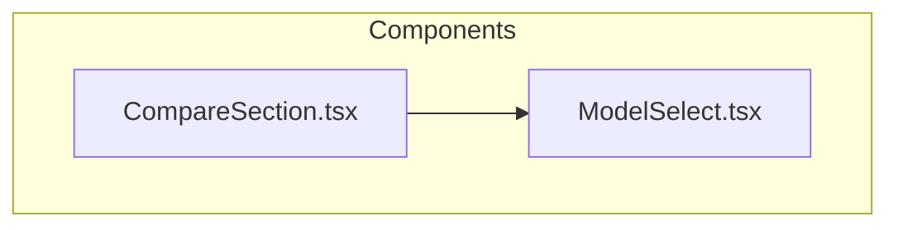
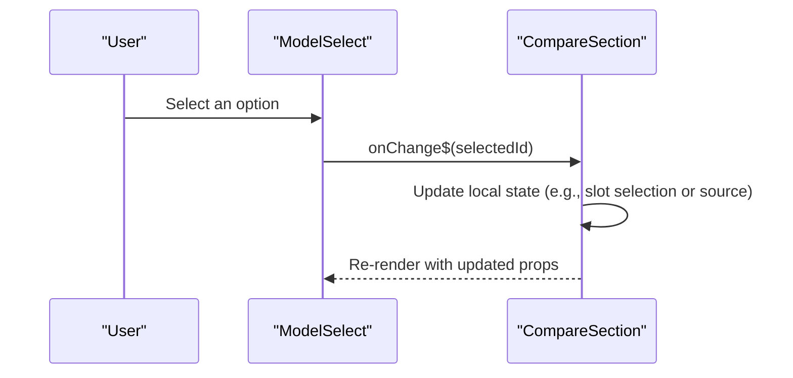
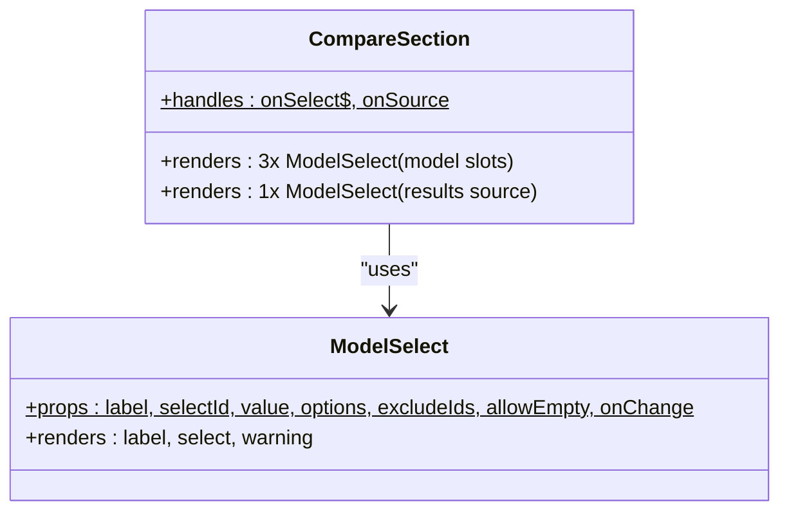
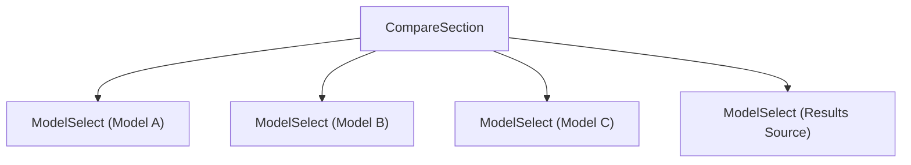
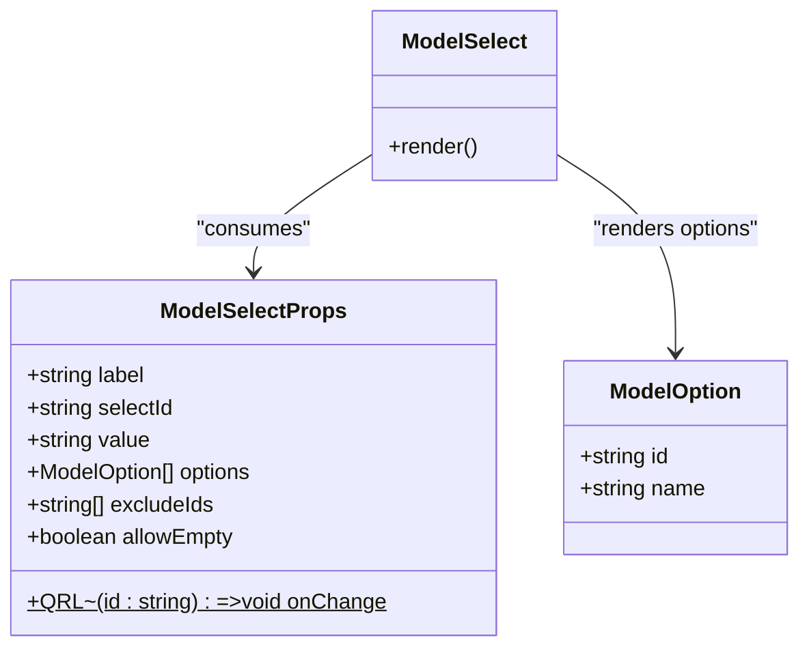
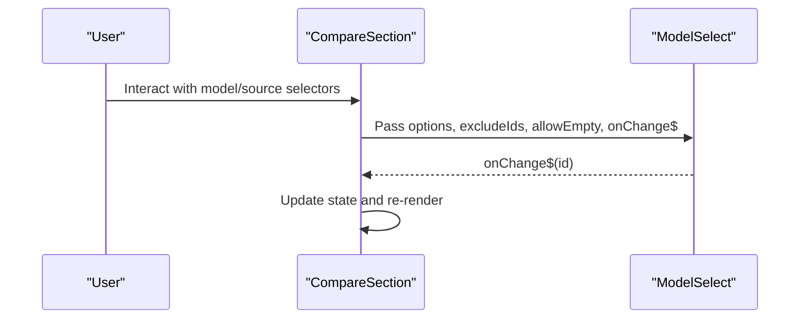
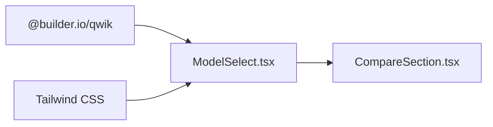

# ModelSelect Input Component

<cite>
**Referenced Files in This Document**
- [ModelSelect.tsx](file://src/components/ModelSelect.tsx)
- [CompareSection.tsx](file://src/components/CompareSection.tsx)
</cite>

## Table of Contents
1. [Introduction](#introduction)
2. [Project Structure](#project-structure)
3. [Core Components](#core-components)
4. [Architecture Overview](#architecture-overview)
5. [Detailed Component Analysis](#detailed-component-analysis)
6. [Dependency Analysis](#dependency-analysis)
7. [Performance Considerations](#performance-considerations)
8. [Troubleshooting Guide](#troubleshooting-guide)
9. [Conclusion](#conclusion)

## Introduction
The ModelSelect component is a Qwik-based dropdown selector used to choose models and result sources within the application. It provides:
- A labeled native select element for model or source selection
- Optional empty “Choose” option
- Duplicate selection warning when the same value is selected in multiple slots
- Styling via Tailwind CSS classes
- Event handling through Qwik’s `QRL` change callback

It is primarily used by CompareSection to render three model selectors and one results-source selector.

## Project Structure
ModelSelect lives under the components directory and is consumed by CompareSection, which prepares options and handles state changes.

**Diagram sources**
- [ModelSelect.tsx:20-47](file://src/components/ModelSelect.tsx#L20-L47)
- [CompareSection.tsx:94-103](file://src/components/CompareSection.tsx#L94-L103)
- [CompareSection.tsx:113-121](file://src/components/CompareSection.tsx#L113-L121)

**Section sources**
- [ModelSelect.tsx:1-48](file://src/components/ModelSelect.tsx#L1-L48)
- [CompareSection.tsx:1-319](file://src/components/CompareSection.tsx#L1-L319)

## Core Components
This section documents the ModelSelect component’s interface, behavior, accessibility, styling, and usage patterns.

### Props Interface
| Prop | Type | Required | Default | Description |
|---|---|---:|---:|---|
| `label` | `string` | Yes | — | Accessible label text for the select control |
| `selectId` | `string` | Yes | — | Unique DOM id for the select element; also bound to the label’s `for` attribute |
| `value` | `string` | Yes | — | Controlled value of the select (empty string allowed) |
| `options` | `ModelOption[]` | Yes | — | Array of selectable items with `id` and `name` |
| `excludeIds` | `string[]` | Yes | — | List of ids that are already selected elsewhere; used to show duplicate warnings |
| `allowEmpty` | `boolean` | No | `true` | Whether to render an initial empty “— Choose —” option |
| `onChange$` | `QRL<(id: string) => void>` | Yes | — | Qwik event handler invoked with the selected option id |

**Section sources**
- [ModelSelect.tsx:4-18](file://src/components/ModelSelect.tsx#L4-L18)

### Behavior and Logic
- Renders a native `<select>` with controlled `value`.
- Optionally renders an empty option when `allowEmpty` is true.
- Maps `options` to `<option>` elements keyed by `o.id`.
- Computes a duplicate warning when the current `value` exists in `excludeIds`.
- Emits the selected id through `onChange$`.

```mermaid
flowchart TD
Start(["Render ModelSelect"]) --> CheckEmpty["If allowEmpty is true<br/>render empty option"]
CheckEmpty --> MapOptions["Map options to <option> elements"]
MapOptions --> ComputeDuplicate["Compute duplicated = value !== '' AND value in excludeIds"]
ComputeDuplicate --> RenderSelect["Render <select> with label and onChange$"]
RenderSelect --> ShowWarning{"duplicated ?"}
ShowWarning --> |Yes| Warn["Show duplicate warning message"]
ShowWarning --> |No| End(["Done"])
Warn --> End
```

**Diagram sources**
- [ModelSelect.tsx:20-47](file://src/components/ModelSelect.tsx#L20-L47)

**Section sources**
- [ModelSelect.tsx:20-47](file://src/components/ModelSelect.tsx#L20-L47)

### Accessibility Features
- Label association: The label uses `for={selectId}` to associate with the select input.
- Unique IDs: Each instance receives a unique `selectId`, ensuring proper label-to-control binding.
- Native semantics: Uses a native `<select>`, inheriting browser keyboard navigation and screen reader support.
- Warning text: Duplicate selection warning is rendered as plain text below the control.

Notes on advanced accessibility:
- No explicit `aria-*` attributes are added beyond standard semantics.
- No custom focus management or role overrides are present.

**Section sources**
- [ModelSelect.tsx:24-43](file://src/components/ModelSelect.tsx#L24-L43)

### Keyboard Navigation and Screen Reader Compatibility
- Standard HTML select behavior applies:
  - Arrow keys navigate options
  - Enter/Space selects an option
  - Tab focuses the control
- Screen readers announce the label and current selection due to native semantics.
- Duplicate warning is announced as part of the page flow after the select.

[No sources needed since this section explains general behavior derived from the component’s use of native elements]

### Styling System Integration and Customization
- Styling is implemented with Tailwind CSS utility classes applied directly to the label, select, and warning paragraph.
- Visual states include:
  - Base border/background/text colors
  - Focus ring and border color changes
  - Dark mode variants
- To customize appearance:
  - Override Tailwind classes at the call site by wrapping the component in a styled container
  - Extend Tailwind theme variables if you need consistent brand tokens
- Context-specific styling:
  - Model selection vs. source selection can be differentiated by passing different `label` values and controlling layout around the component in the parent.

**Section sources**
- [ModelSelect.tsx:24-43](file://src/components/ModelSelect.tsx#L24-L43)

### Option Filtering
- Built-in filtering is not provided.
- Consumers should pre-filter `options` before passing them to ModelSelect.
- Example pattern:
  - Filter options based on user input in the parent component
  - Pass the filtered array to `options`

[No sources needed since this section provides general guidance]

### Change Event Handling
- The component emits the selected option id via `onChange$`.
- Parent components handle the event and update their own state accordingly.

**Diagram sources**
- [ModelSelect.tsx:31-31](file://src/components/ModelSelect.tsx#L31-L31)
- [CompareSection.tsx:94-103](file://src/components/CompareSection.tsx#L94-L103)
- [CompareSection.tsx:113-121](file://src/components/CompareSection.tsx#L113-L121)

**Section sources**
- [ModelSelect.tsx:28-32](file://src/components/ModelSelect.tsx#L28-L32)
- [CompareSection.tsx:94-103](file://src/components/CompareSection.tsx#L94-L103)
- [CompareSection.tsx:113-121](file://src/components/CompareSection.tsx#L113-L121)

### Usage Patterns in CompareSection
- Model selectors (A/B/C):
  - Provide sorted model options
  - Pass other slots’ ids as `excludeIds` to warn about duplicates
  - Use default `allowEmpty=true`
- Results source selector:
  - Provide curated source options
  - Set `allowEmpty=false` to enforce a valid selection
  - Pass empty `excludeIds`

**Diagram sources**
- [ModelSelect.tsx:20-47](file://src/components/ModelSelect.tsx#L20-L47)
- [CompareSection.tsx:94-103](file://src/components/CompareSection.tsx#L94-L103)
- [CompareSection.tsx:113-121](file://src/components/CompareSection.tsx#L113-L121)

**Section sources**
- [CompareSection.tsx:94-103](file://src/components/CompareSection.tsx#L94-L103)
- [CompareSection.tsx:113-121](file://src/components/CompareSection.tsx#L113-L121)

## Architecture Overview
At runtime, CompareSection composes multiple ModelSelect instances:
- Three model selectors share state via CompareSection’s props and emit slot-specific selections.
- One results-source selector controls the data view and does not participate in duplicate exclusion.

**Diagram sources**
- [CompareSection.tsx:94-103](file://src/components/CompareSection.tsx#L94-L103)
- [CompareSection.tsx:113-121](file://src/components/CompareSection.tsx#L113-L121)

## Detailed Component Analysis

### ModelSelect Component
- Purpose: Provides a controlled dropdown for selecting a single option from a list.
- Key responsibilities:
  - Bind label to select via `for` and `id`
  - Render optional empty option
  - Render options from `options` prop
  - Emit selected id via `onChange$`
  - Display duplicate warning when applicable

**Diagram sources**
- [ModelSelect.tsx:4-18](file://src/components/ModelSelect.tsx#L4-L18)
- [ModelSelect.tsx:20-47](file://src/components/ModelSelect.tsx#L20-L47)

**Section sources**
- [ModelSelect.tsx:4-47](file://src/components/ModelSelect.tsx#L4-L47)

### Integration with CompareSection
- Model slots:
  - Options are prepared by mapping model data and sorting by display name.
  - `excludeIds` contains the other two selected ids to prevent accidental duplication.
- Results source:
  - Options come from a curated list of sources.
  - `allowEmpty=false` ensures a valid source is always selected.

**Diagram sources**
- [CompareSection.tsx:24-26](file://src/components/CompareSection.tsx#L24-L26)
- [CompareSection.tsx:94-103](file://src/components/CompareSection.tsx#L94-L103)
- [CompareSection.tsx:113-121](file://src/components/CompareSection.tsx#L113-L121)

**Section sources**
- [CompareSection.tsx:24-26](file://src/components/CompareSection.tsx#L24-L26)
- [CompareSection.tsx:94-103](file://src/components/CompareSection.tsx#L94-L103)
- [CompareSection.tsx:113-121](file://src/components/CompareSection.tsx#L113-L121)

## Dependency Analysis
- ModelSelect depends on:
  - Qwik primitives (`component$`, `QRL`)
  - Tailwind CSS classes for styling
- CompareSection depends on:
  - ModelSelect for UI
  - Data modules for model and source lists

**Diagram sources**
- [ModelSelect.tsx:1-2](file://src/components/ModelSelect.tsx#L1-L2)
- [ModelSelect.tsx:20-47](file://src/components/ModelSelect.tsx#L20-L47)
- [CompareSection.tsx:5-5](file://src/components/CompareSection.tsx#L5-L5)

**Section sources**
- [ModelSelect.tsx:1-2](file://src/components/ModelSelect.tsx#L1-L2)
- [CompareSection.tsx:5-5](file://src/components/CompareSection.tsx#L5-L5)

## Performance Considerations
- Rendering:
  - Uses a native `<select>`, which is efficient for typical option counts.
  - Options are mapped directly; ensure `options` arrays are stable or memoized in the parent if they change frequently.
- Large option lists:
  - Consider virtualization or pagination in the parent if the option set grows significantly.
  - Pre-filter options to reduce DOM nodes.
- Duplicate detection:
  - Uses simple array lookup; acceptable for small lists. For very large `excludeIds`, consider using a Set for O(1) checks.

[No sources needed since this section provides general guidance]

## Troubleshooting Guide
Common issues and resolutions:
- Empty selection persists:
  - Ensure `allowEmpty` is set appropriately for your context.
  - Validate that the parent updates `value` correctly on change.
- Duplicate warning appears unexpectedly:
  - Verify `excludeIds` includes only the other slots’ selected ids.
  - Confirm that the same id is not being passed unintentionally.
- Label not associated with select:
  - Ensure `selectId` is unique per instance and matches the label’s `for` attribute.
- Styling conflicts:
  - Tailwind classes are inline; override styles at the parent level or extend Tailwind configuration.

**Section sources**
- [ModelSelect.tsx:20-47](file://src/components/ModelSelect.tsx#L20-L47)
- [CompareSection.tsx:94-103](file://src/components/CompareSection.tsx#L94-L103)
- [CompareSection.tsx:113-121](file://src/components/CompareSection.tsx#L113-L121)

## Conclusion
ModelSelect is a focused, accessible dropdown component that integrates cleanly into Qwik applications. It provides essential features like controlled selection, optional empty options, duplicate warnings, and Tailwind-based styling. In CompareSection, it powers both model and results-source selection with clear separation of concerns. For advanced needs such as filtering, custom rendering, or large datasets, extend the parent components to prepare options and manage state while keeping ModelSelect’s contract intact.