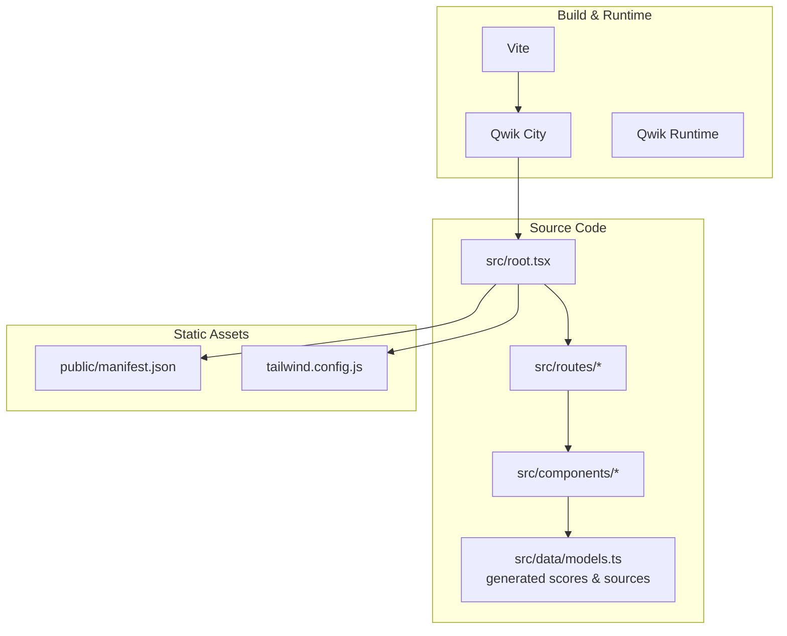
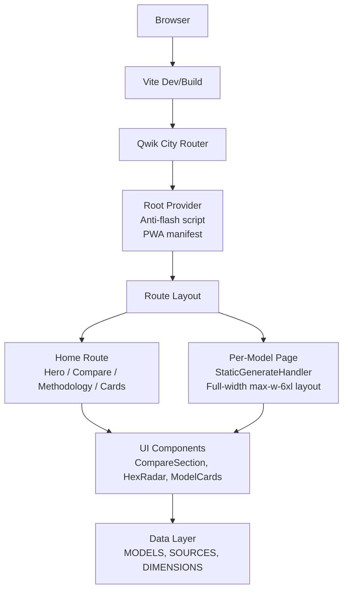
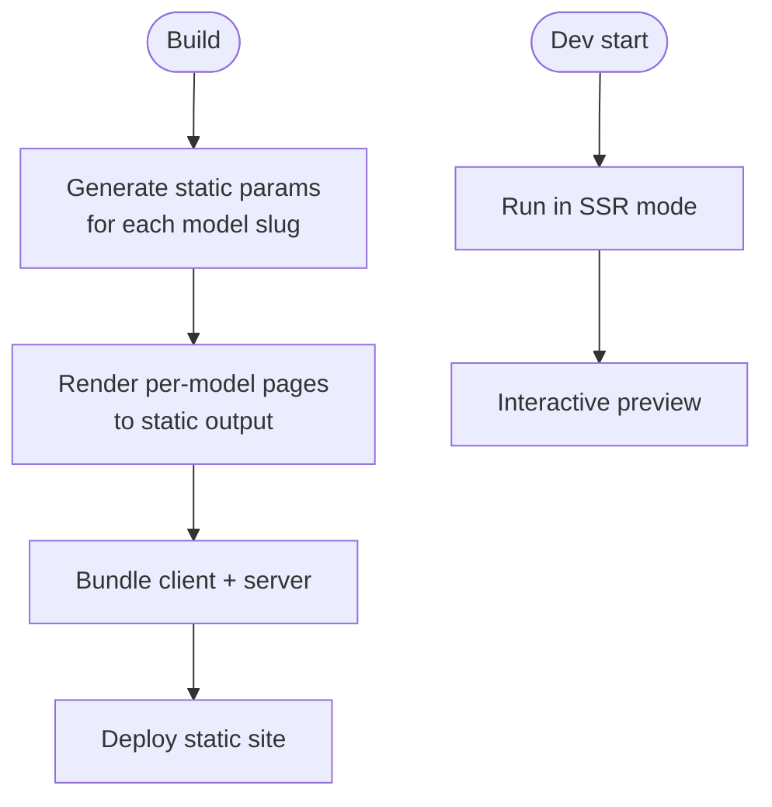
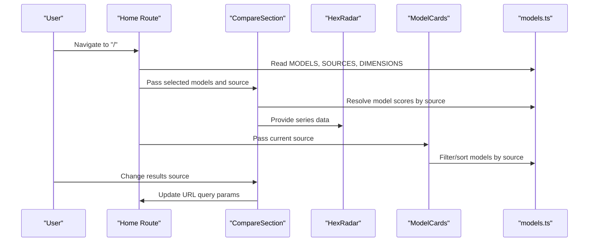
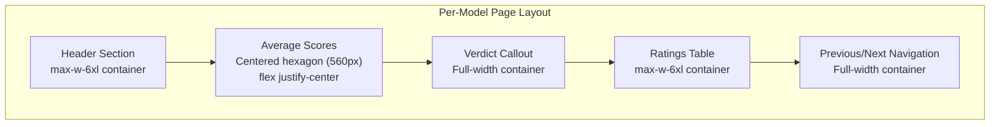
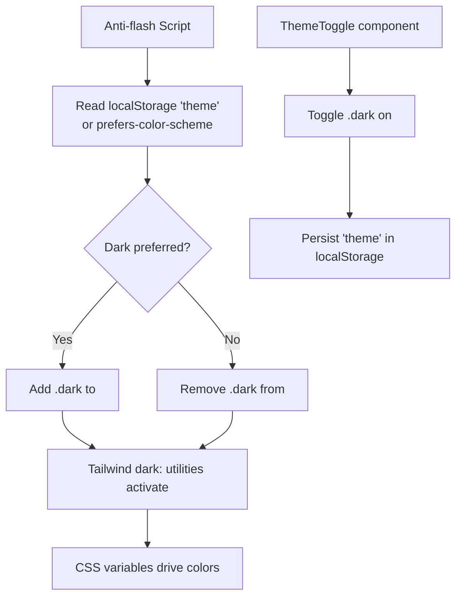
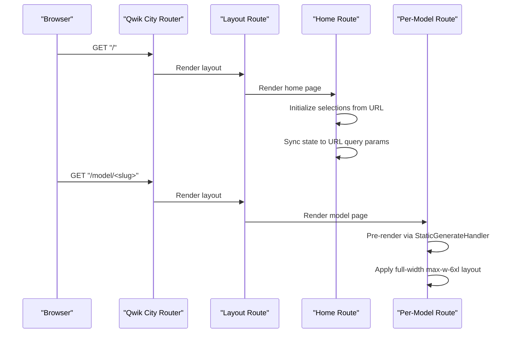
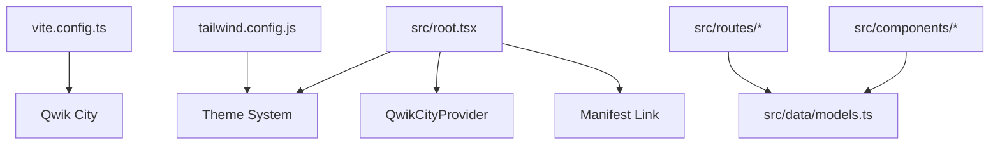

# Core Concepts & Architecture Patterns

<cite>
**Referenced Files in This Document**
- [README.md](file://README.md)
- [package.json](file://package.json)
- [vite.config.ts](file://vite.config.ts)
- [tailwind.config.js](file://tailwind.config.js)
- [src/root.tsx](file://src/root.tsx)
- [public/manifest.json](file://public/manifest.json)
- [src/routes/layout.tsx](file://src/routes/layout.tsx)
- [src/routes/index.tsx](file://src/routes/index.tsx)
- [src/routes/model/[slug]/index.tsx](file://src/routes/model/[slug]/index.tsx)
- [src/data/models.ts](file://src/data/models.ts)
- [src/components/CompareSection.tsx](file://src/components/CompareSection.tsx)
- [src/components/HexRadar.tsx](file://src/components/HexRadar.tsx)
- [src/components/ModelCards.tsx](file://src/components/ModelCards.tsx)
- [src/components/theme-toggle/theme-toggle.tsx](file://src/components/theme-toggle/theme-toggle.tsx)
</cite>

## Update Summary
**Changes Made**
- Updated Per-Model Detail Pages section to document enhanced container widths and centered hexagon layouts
- Added specific details about the `max-w-6xl` container pattern and hexagon centering implementation
- Enhanced architecture diagrams to reflect improved layout consistency across per-model pages

## Table of Contents
1. [Introduction](#introduction)
2. [Project Structure](#project-structure)
3. [Core Components](#core-components)
4. [Architecture Overview](#architecture-overview)
5. [Detailed Component Analysis](#detailed-component-analysis)
6. [Dependency Analysis](#dependency-analysis)
7. [Performance Considerations](#performance-considerations)
8. [Troubleshooting Guide](#troubleshooting-guide)
9. [Conclusion](#conclusion)

## Introduction
ModelComp is a Qwik + Qwik City application that compares AI coding models across standardized dimensions. It uses a data-first, static-site generation approach with SSR support, a component-based UI, and a theme system driven by CSS variables and Tailwind's class-based dark mode. The site also supports PWA installation through a web manifest.

This document explains:
- How Qwik's resumable paradigm differs from traditional React applications.
- When and why the project uses static site generation versus server-side rendering.
- The component composition model, state management, and data flow.
- The theme system using CSS variables and Tailwind dark mode.
- The PWA setup and mobile app installation capabilities.
- Diagrams connecting Qwik City routing, component lifecycle, and data hydration.

## Project Structure
The repository follows a feature-oriented layout:
- `src/routes` defines file-based routes for Qwik City.
- `src/components` contains reusable UI components.
- `src/data` hydrates typed model data from generated files and curated metadata.
- `public` holds the PWA manifest and brand assets.
- Build configuration lives at the root (`vite.config.ts`, `tailwind.config.js`, `package.json`).

**Diagram sources**
- [vite.config.ts:1-16](file://vite.config.ts#L1-L16)
- [src/root.tsx:1-66](file://src/root.tsx#L1-L66)
- [tailwind.config.js:1-23](file://tailwind.config.js#L1-L23)
- [public/manifest.json:1-18](file://public/manifest.json#L1-L18)

**Section sources**
- [README.md:61-80](file://README.md#L61-L80)
- [package.json:11-24](file://package.json#L11-L24)

## Core Components
Key architectural concepts implemented in ModelComp:

- Resumable architecture: Qwik components are lazy-loaded and only hydrated when needed, minimizing initial JavaScript.
- File-based routing: Qwik City maps URL paths to route components under `src/routes`.
- Static site generation (SSG): Per-model pages are pre-rendered via a static generator handler.
- Server-side rendering (SSR): Development runs in SSR mode; production can serve SSR or static output depending on adapter/build.
- Data hydration: Scores and source registry are generated at build time and hydrated into typed model objects.
- Theme system: A synchronous anti-flash script sets `.dark` on `<html>` before paint; Tailwind's `dark:` utilities and CSS variables provide consistent theming.
- PWA: A manifest is included in production builds to enable installability on supported browsers.

**Section sources**
- [README.md:93-97](file://README.md#L93-L97)
- [package.json:11-24](file://package.json#L11-L24)
- [src/routes/model/[slug]/index.tsx:8-11](file://src/routes/model/[slug]/index.tsx#L8-L11)
- [src/root.tsx:18-33](file://src/root.tsx#L18-L33)
- [tailwind.config.js:1-23](file://tailwind.config.js#L1-L23)
- [public/manifest.json:1-18](file://public/manifest.json#L1-L18)

## Architecture Overview
At a high level:
- Vite configures Qwik City and the Qwik optimizer.
- Qwik City provides file-based routing and SSR/SSG capabilities.
- The root component initializes the Qwik City provider, applies the anti-flash theme script, includes the PWA manifest in production, and renders the router outlet.
- Route components compose UI sections and interact with typed data from `src/data/models.ts`.
- Components render visualizations (hex radar), tables, cards, and navigation.

**Diagram sources**
- [vite.config.ts:1-16](file://vite.config.ts#L1-L16)
- [src/root.tsx:1-66](file://src/root.tsx#L1-L66)
- [src/routes/layout.tsx:1-16](file://src/routes/layout.tsx#L1-L16)
- [src/routes/index.tsx:103-179](file://src/routes/index.tsx#L103-L179)
- [src/routes/model/[slug]/index.tsx:8-11](file://src/routes/model/[slug]/index.tsx#L8-L11)
- [src/data/models.ts:227-241](file://src/data/models.ts#L227-L241)

## Detailed Component Analysis

### Qwik vs Traditional React: Resumable Paradigm
- Traditional React apps typically hydrate large bundles and run extensive initialization logic on first paint.
- Qwik components are represented as resumable functions that execute lazily. Only the code required for user interactions is downloaded and executed.
- In ModelComp, this means:
  - Initial HTML is fast and SEO-friendly.
  - Interactions like selecting models, sorting tables, and toggling themes are efficiently delegated to small, targeted handlers.
  - State changes update the UI without re-running unrelated component trees.

Practical implications in ModelComp:
- The homepage composes multiple sections but only hydrates what is needed.
- Sorting and selection use Qwik event handlers that are automatically optimized.
- The theme toggle updates the DOM class and persists preference without heavy re-renders.

**Section sources**
- [src/routes/index.tsx:103-179](file://src/routes/index.tsx#L103-L179)
- [src/components/theme-toggle/theme-toggle.tsx:1-78](file://src/components/theme-toggle/theme-toggle.tsx#L1-L78)

### Static Site Generation and SSR Strategy
- SSG: Per-model detail pages declare a static generator handler that produces one page per model slug. This ensures fast, cacheable pages for every tracked model.
- SSR: Development runs in SSR mode, enabling interactive previews and server-side execution during development.
- Production: The README documents a full build producing static output; adapters can be added for different hosting targets.

When each strategy is used:
- SSG for content-heavy, deterministic pages (per-model details).
- SSR for development interactivity and any dynamic server needs.
- Static output for performance and CDN caching.

**Diagram sources**
- [src/routes/model/[slug]/index.tsx:8-11](file://src/routes/model/[slug]/index.tsx#L8-L11)
- [package.json:11-24](file://package.json#L11-L24)
- [README.md:18-29](file://README.md#L18-L29)

**Section sources**
- [src/routes/model/[slug]/index.tsx:8-11](file://src/routes/model/[slug]/index.tsx#L8-L11)
- [README.md:18-29](file://README.md#L18-L29)
- [package.json:11-24](file://package.json#L11-L24)

### Component Composition, State Management, and Data Flow
ModelComp organizes UI into focused components:
- `CompareSection`: Manages three model slots, results-source selection, hex radar series, legend, and exact-score table.
- `HexRadar`: Renders an SVG radar chart with non-linear scaling and tooltips.
- `ModelCards`: Displays all models in cards or list view, supports sorting by dimension or overall score.
- `ThemeToggle`: Toggles dark/light mode by updating the `<html>` class and persisting preference.

State and data flow:
- Route-level state drives URL query parameters and component props.
- Data layer hydrates typed models from generated scores and curated metadata.
- Components consume `MODELS`, `SOURCES`, and `DIMENSIONS` to render consistent views.

**Diagram sources**
- [src/routes/index.tsx:103-179](file://src/routes/index.tsx#L103-L179)
- [src/components/CompareSection.tsx:20-175](file://src/components/CompareSection.tsx#L20-L175)
- [src/components/HexRadar.tsx:62-166](file://src/components/HexRadar.tsx#L62-L166)
- [src/components/ModelCards.tsx:13-34](file://src/components/ModelCards.tsx#L13-L34)
- [src/data/models.ts:227-241](file://src/data/models.ts#L227-L241)

**Section sources**
- [src/routes/index.tsx:103-179](file://src/routes/index.tsx#L103-L179)
- [src/components/CompareSection.tsx:20-319](file://src/components/CompareSection.tsx#L20-L319)
- [src/components/HexRadar.tsx:1-167](file://src/components/HexRadar.tsx#L1-L167)
- [src/components/ModelCards.tsx:1-368](file://src/components/ModelCards.tsx#L1-L368)
- [src/data/models.ts:46-77](file://src/data/models.ts#L46-L77)

### Enhanced Per-Model Detail Pages Layout
**Updated** Per-model detail pages now implement a consistent full-width layout pattern with enhanced visual hierarchy:

- **Full-width containers**: All sections use `max-w-6xl` container width for consistent spacing and readability across the entire page
- **Centered hexagon displays**: The hexagonal radar chart maintains its 560px size but is horizontally centered using `flex justify-center` within the full-width container
- **Consistent section spacing**: Each major section (header, average scores, verdict, ratings table) shares the same container width for visual harmony
- **Improved readability**: The wider layout allows for better text flow and more comfortable reading experience on larger screens

Implementation details:
- Header section: Uses `mx-auto max-w-6xl px-4 pb-4 pt-8` for consistent top padding and bottom margins
- Average scores section: Centers the hexagon with `flex justify-center` while maintaining the 560px maximum width
- Verdict callout: Spans full-width between the hexagon and ratings table for seamless visual flow
- Ratings table: Maintains the same `max-w-6xl` container width as other sections

**Diagram sources**
- [src/routes/model/[slug]/index.tsx:164-211](file://src/routes/model/[slug]/index.tsx#L164-L211)
- [src/routes/model/[slug]/index.tsx:213-220](file://src/routes/model/[slug]/index.tsx#L213-L220)
- [src/routes/model/[slug]/index.tsx:222-252](file://src/routes/model/[slug]/index.tsx#L222-L252)
- [src/routes/model/[slug]/index.tsx:254-432](file://src/routes/model/[slug]/index.tsx#L254-L432)

**Section sources**
- [src/routes/model/[slug]/index.tsx:164-211](file://src/routes/model/[slug]/index.tsx#L164-L211)
- [src/routes/model/[slug]/index.tsx:213-220](file://src/routes/model/[slug]/index.tsx#L213-L220)
- [src/routes/model/[slug]/index.tsx:222-252](file://src/routes/model/[slug]/index.tsx#L222-L252)
- [src/routes/model/[slug]/index.tsx:254-432](file://src/routes/model/[slug]/index.tsx#L254-L432)

### Theme System: CSS Variables and Tailwind Dark Mode
- Tailwind is configured with `darkMode: "class"`, so dark mode is controlled by adding/removing a class.
- An anti-flash script runs synchronously in `<head>` to set `.dark` on `<html>` before the first paint based on stored preference or system setting.
- CSS variables define semantic colors; Tailwind utility classes map to these variables.
- The theme toggle updates the class and persists the choice in local storage.

**Diagram sources**
- [src/root.tsx:18-33](file://src/root.tsx#L18-L33)
- [tailwind.config.js:1-23](file://tailwind.config.js#L1-L23)
- [src/components/theme-toggle/theme-toggle.tsx:1-78](file://src/components/theme-toggle/theme-toggle.tsx#L1-L78)

**Section sources**
- [src/root.tsx:18-33](file://src/root.tsx#L18-L33)
- [tailwind.config.js:1-23](file://tailwind.config.js#L1-L23)
- [src/components/theme-toggle/theme-toggle.tsx:1-78](file://src/components/theme-toggle/theme-toggle.tsx#L1-L78)

### PWA Setup and Mobile App Installation
- The manifest declares app name, short name, start URL, display mode, theme color, description, and icons.
- The root component conditionally includes the manifest link in production builds.
- Supported browsers can prompt users to install the site as an app.

**Diagram sources**
- [src/root.tsx:40-45](file://src/root.tsx#L40-L45)
- [public/manifest.json:1-18](file://public/manifest.json#L1-L18)

**Section sources**
- [src/root.tsx:40-45](file://src/root.tsx#L40-L45)
- [public/manifest.json:1-18](file://public/manifest.json#L1-L18)

### Routing, Lifecycle, and Hydration Flow
Qwik City maps URLs to route components. The home route manages selection state and URL synchronization. The per-model route pre-generates static pages and renders detailed comparisons with enhanced layout consistency.

**Diagram sources**
- [src/routes/layout.tsx:1-16](file://src/routes/layout.tsx#L1-L16)
- [src/routes/index.tsx:103-179](file://src/routes/index.tsx#L103-L179)
- [src/routes/model/[slug]/index.tsx:8-11](file://src/routes/model/[slug]/index.tsx#L8-L11)

**Section sources**
- [src/routes/layout.tsx:1-16](file://src/routes/layout.tsx#L1-L16)
- [src/routes/index.tsx:103-179](file://src/routes/index.tsx#L103-L179)
- [src/routes/model/[slug]/index.tsx:8-11](file://src/routes/model/[slug]/index.tsx#L8-L11)

## Dependency Analysis
High-level dependencies:
- `vite.config.ts` wires Qwik City and Qwik optimizer.
- `tailwind.config.js` enables class-based dark mode and maps Tailwind tokens to CSS variables.
- `src/root.tsx` initializes providers, anti-flash script, and PWA manifest inclusion.
- Route components depend on `src/data/models.ts` for typed data.
- UI components depend on route-provided props and shared data.

**Diagram sources**
- [vite.config.ts:1-16](file://vite.config.ts#L1-L16)
- [tailwind.config.js:1-23](file://tailwind.config.js#L1-L23)
- [src/root.tsx:1-66](file://src/root.tsx#L1-L66)
- [src/data/models.ts:227-241](file://src/data/models.ts#L227-L241)

**Section sources**
- [vite.config.ts:1-16](file://vite.config.ts#L1-L16)
- [tailwind.config.js:1-23](file://tailwind.config.js#L1-L23)
- [src/root.tsx:1-66](file://src/root.tsx#L1-L66)
- [src/data/models.ts:227-241](file://src/data/models.ts#L227-L241)

## Performance Considerations
- Use SSG for stable, content-rich pages to maximize cacheability and reduce runtime work.
- Keep client bundles lean by relying on Qwik's lazy hydration and avoiding unnecessary global state.
- Prefer generated data over raw markdown imports to avoid bloating the client bundle.
- Ensure the anti-flash script runs early to prevent theme flicker.
- Validate data at build time with the sync script to keep the UI predictable and performant.
- The enhanced per-model layout with full-width containers improves readability without impacting performance since it's purely CSS-based.

[No sources needed since this section provides general guidance]

## Troubleshooting Guide
Common issues and resolutions:
- Missing generated data: If average scores or source registry are missing, rebuild generated files using the sync script.
- Theme flicker: Ensure the anti-flash script is present and runs before paint; verify Tailwind's `darkMode: "class"` setting.
- PWA not installing: Confirm the manifest is included in production builds and served at the expected path.
- Route not found: Verify file-based routing structure and that per-model pages have a valid slug.
- Layout inconsistencies: Ensure per-model pages maintain consistent `max-w-6xl` container widths across all sections for proper visual alignment.

**Section sources**
- [README.md:31-44](file://README.md#L31-L44)
- [src/root.tsx:18-33](file://src/root.tsx#L18-L33)
- [tailwind.config.js:1-23](file://tailwind.config.js#L1-L23)
- [src/routes/model/[slug]/index.tsx:8-11](file://src/routes/model/[slug]/index.tsx#L8-L11)

## Conclusion
ModelComp demonstrates a modern, efficient web architecture:
- Qwik's resumable model minimizes runtime overhead while preserving rich interactivity.
- Qwik City's file-based routing simplifies navigation and integrates seamlessly with SSG and SSR.
- A typed data layer keeps the UI consistent and maintainable.
- A robust theme system and PWA setup deliver a polished, installable experience.
- Enhanced per-model detail pages provide improved readability with consistent full-width layouts and centered visual elements.
By following the documented patterns, teams can extend the site with new models, sources, and features while preserving performance and clarity.

[No sources needed since this section summarizes without analyzing specific files]