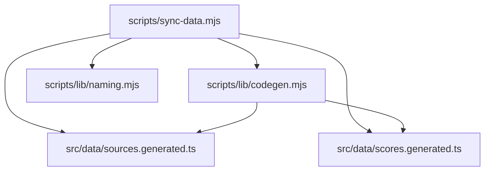
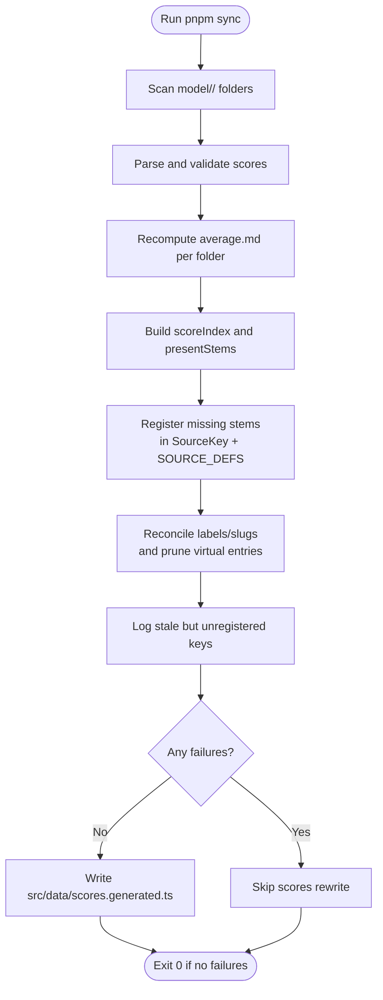
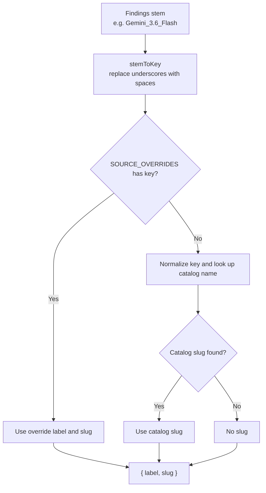
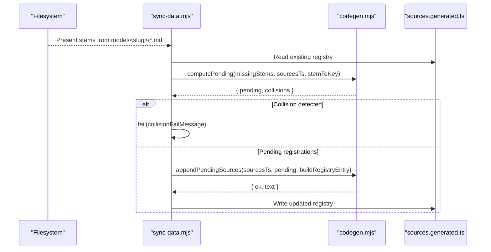
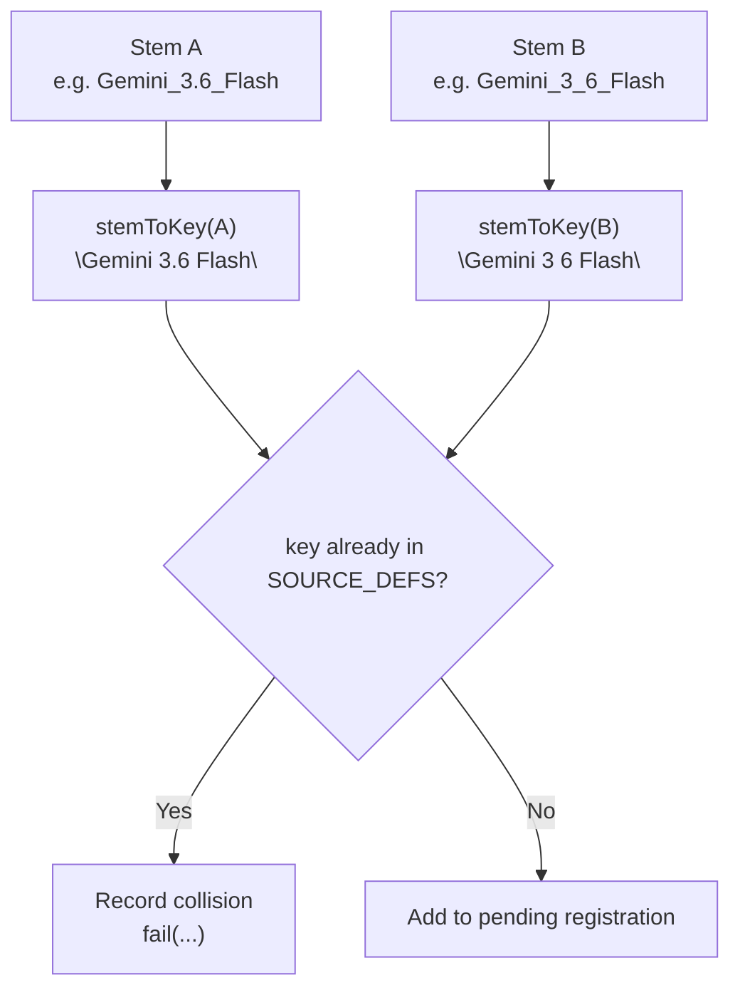
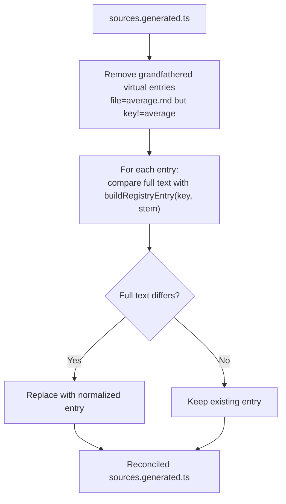
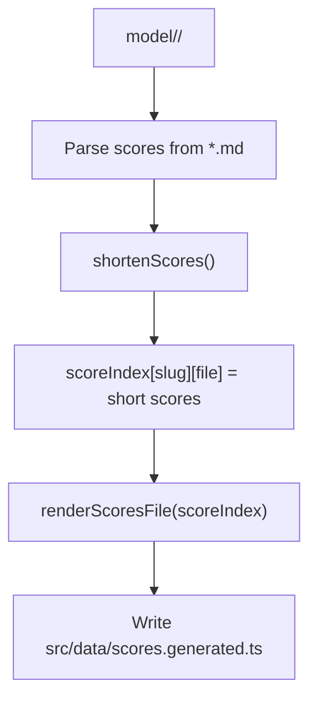
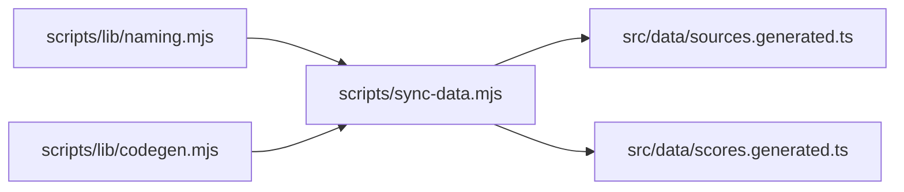

# Code Generation & Registry Management

<cite>
**Referenced Files in This Document**
- [codegen.mjs](file://scripts/lib/codegen.mjs)
- [sync-data.mjs](file://scripts/sync-data.mjs)
- [sources.generated.ts](file://src/data/sources.generated.ts)
- [scores.generated.ts](file://src/data/scores.generated.ts)
- [naming.mjs](file://scripts/lib/naming.mjs)
</cite>

## Table of Contents
1. [Introduction](#introduction)
2. [Project Structure](#project-structure)
3. [Core Components](#core-components)
4. [Architecture Overview](#architecture-overview)
5. [Detailed Component Analysis](#detailed-component-analysis)
6. [Dependency Analysis](#dependency-analysis)
7. [Performance Considerations](#performance-considerations)
8. [Troubleshooting Guide](#troubleshooting-guide)
9. [Conclusion](#conclusion)

## Introduction
This document explains the code generation and registry management system that keeps reporting agents, their display keys, and client-side score indexes consistent with the on-disk model findings files. The system is driven by a deterministic sync script that scans `model/<slug>/` folders, validates scores, recomputes averages, registers new reporting agents, reconciles stale or virtual entries, and emits compact TypeScript artifacts consumed by the frontend.

The central contract is:
- Every active findings file stem (for example `Gemini_3.6_Flash.md`) maps to a stable source key (`"Gemini 3.6 Flash"`).
- That key must appear both in the generated `SourceKey` union type and in the `SOURCE_DEFS` array inside `src/data/sources.generated.ts`.
- Labels and slugs are derived from filename stems, explicit overrides, and catalog metadata; virtual sort views are never registered as real agents.
- Client bundles receive only numeric scores through `src/data/scores.generated.ts`, keeping full markdown reports out of the browser bundle.

## Project Structure
The relevant implementation lives under three layers:

| Layer | Responsibility | Key Files |
|---|---|---|
| Sync orchestration | Scans filesystem, validates data, coordinates registration and codegen | `scripts/sync-data.mjs` |
| Pure codegen helpers | Deterministic text surgery for registry and score index | `scripts/lib/codegen.mjs` |
| Naming and slug conventions | Stem-to-key derivation, label resolution, virtual-key rules | `scripts/lib/naming.mjs` |
| Generated artifacts | Runtime types, registry, and compact score map | `src/data/sources.generated.ts`, `src/data/scores.generated.ts` |



**Diagram sources**
- [sync-data.mjs:30-75](file://scripts/sync-data.mjs#L30-L75)
- [sync-data.mjs:438-523](file://scripts/sync-data.mjs#L438-L523)
- [codegen.mjs:1-140](file://scripts/lib/codegen.mjs#L1-L140)
- [naming.mjs:1-73](file://scripts/lib/naming.mjs#L1-L73)
- [sources.generated.ts:1-147](file://src/data/sources.generated.ts#L1-L147)
- [scores.generated.ts:1-200](file://src/data/scores.generated.ts#L1-L200)

**Section sources**
- [sync-data.mjs:1-30](file://scripts/sync-data.mjs#L1-L30)
- [codegen.mjs:1-8](file://scripts/lib/codegen.mjs#L1-L8)
- [sources.generated.ts:1-83](file://src/data/sources.generated.ts#L1-L83)

## Core Components
The registry system has five core responsibilities:

1. **Stem-to-key derivation:** Convert filenames like `Gemini_3.6_Flash.md` into source keys like `"Gemini 3.6 Flash"`.
2. **Automatic registration:** Add missing stems to both the `SourceKey` union and the `SOURCE_DEFS` array during sync.
3. **Collision detection:** Fail when two different filenames derive the same key already registered under another file.
4. **Registry reconciliation:** Normalize labels and inline slugs, and prune grandfathered virtual-view entries.
5. **Compact score index generation:** Emit a numbers-only `GeneratedScores` map for the client bundle.

These responsibilities are split between:
- `scripts/lib/codegen.mjs`: pure, deterministic text builders and parsers.
- `scripts/sync-data.mjs`: filesystem scanning, validation, failure accounting, and artifact writes.
- `scripts/lib/naming.mjs`: naming conventions, slug lookup, and virtual-key definitions.
- `src/data/sources.generated.ts`: the generated registry and `SourceKey` union.
- `src/data/scores.generated.ts`: the generated compact score index.

**Section sources**
- [codegen.mjs:14-84](file://scripts/lib/codegen.mjs#L14-L84)
- [sync-data.mjs:438-488](file://scripts/sync-data.mjs#L438-L488)
- [naming.mjs:8-27](file://scripts/lib/naming.mjs#L8-L27)
- [sources.generated.ts:5-83](file://src/data/sources.generated.ts#L5-L83)

## Architecture Overview
At a high level, `pnpm sync` performs these phases:

1. Scan model folders and findings files.
2. Parse and validate scores.
3. Recompute averages.
4. Build the set of present stems and the compact score index.
5. Register new reporting agents in `sources.generated.ts`.
6. Reconcile registry labels, slugs, and virtual entries.
7. Emit `scores.generated.ts` only when there are no failures.



**Diagram sources**
- [sync-data.mjs:119-208](file://scripts/sync-data.mjs#L119-L208)
- [sync-data.mjs:259-436](file://scripts/sync-data.mjs#L259-L436)
- [sync-data.mjs:438-523](file://scripts/sync-data.mjs#L438-L523)

## Detailed Component Analysis

### Stem-to-Key Derivation and Label/Slug Resolution
The naming layer defines the fragile contract between filenames and runtime keys:

- `stemToKey` converts underscores to spaces, so `Gemini_3.6_Flash` becomes `"Gemini 3.6 Flash"`.
- `labelOf` derives an Agreement-notes-style label from a filename.
- `resolveSourceMeta` resolves the final display label and optional model-page slug using:
  - `SOURCE_OVERRIDES` for known exceptions.
  - A normalized catalog lookup from `meta.json` names across `model/`, `models_voice/`, and `models_finance/`.
- Virtual keys such as `tool`, `reason`, `context`, `cost`, `code`, and `multi` are explicitly excluded from being treated as real reporting agents.



**Diagram sources**
- [naming.mjs:8-27](file://scripts/lib/naming.mjs#L8-L27)
- [naming.mjs:46-47](file://scripts/lib/naming.mjs#L46-L47)
- [sync-data.mjs:90-100](file://scripts/sync-data.mjs#L90-L100)
- [sync-data.mjs:227-245](file://scripts/sync-data.mjs#L227-L245)

**Section sources**
- [naming.mjs:8-27](file://scripts/lib/naming.mjs#L8-L27)
- [naming.mjs:46-47](file://scripts/lib/naming.mjs#L46-L47)
- [sync-data.mjs:90-100](file://scripts/sync-data.mjs#L90-L100)
- [sync-data.mjs:227-245](file://scripts/sync-data.mjs#L227-L245)

### Automatic Registration of New Reporting Agents
When a new findings file appears under any model folder, the sync process ensures it is registered:

1. `presentStems` collects every active `.md` stem across all model folders.
2. Existing registered stems are parsed from `sources.generated.ts`.
3. Missing stems are filtered, excluding `average` because it is a computed view, not a reporting agent.
4. For each missing stem:
   - Derive the key via `stemToKey`.
   - Check whether the key already exists in `SOURCE_DEFS`.
   - If yes, treat it as a collision.
   - If no, mark it pending and determine whether its union member also needs to be added.
5. Pending entries are appended to both the `SourceKey` union and the `SOURCE_DEFS` array.



**Diagram sources**
- [sync-data.mjs:200-204](file://scripts/sync-data.mjs#L200-L204)
- [sync-data.mjs:438-468](file://scripts/sync-data.mjs#L438-L468)
- [codegen.mjs:37-84](file://scripts/lib/codegen.mjs#L37-L84)

**Section sources**
- [sync-data.mjs:200-204](file://scripts/sync-data.mjs#L200-L204)
- [sync-data.mjs:438-468](file://scripts/sync-data.mjs#L438-L468)
- [codegen.mjs:37-84](file://scripts/lib/codegen.mjs#L37-L84)

### Collision Detection and Duplicate Registration Prevention
A collision occurs when two different filenames derive the same source key, and that key is already registered under another file. This is intentionally treated as a human decision point rather than silently overwriting.

Rules:
- If a stem’s derived key is already present in `SOURCE_DEFS`, `computePending` records a collision instead of appending.
- `sync-data.mjs` calls `fail` with a locked message format so the error routes clearly to manual resolution.
- Collisions are not repaired automatically; they require renaming the file, consolidating duplicates, or updating overrides.



**Diagram sources**
- [codegen.mjs:37-63](file://scripts/lib/codegen.mjs#L37-L63)
- [sync-data.mjs:452-456](file://scripts/sync-data.mjs#L452-L456)

**Section sources**
- [codegen.mjs:37-63](file://scripts/lib/codegen.mjs#L37-L63)
- [sync-data.mjs:452-456](file://scripts/sync-data.mjs#L452-L456)

### Registry Reconciliation and Virtual View Pruning
After registration, the system runs reconciliation to keep the registry clean and idempotent:

- Virtual sort-view entries whose file is `average.md` but whose key is not `"average"` are removed.
- Corresponding virtual union members are pruned.
- Every remaining entry is compared against the expected form produced by `buildRegistryEntry`; mismatches are rewritten.
- The reconciliation pass is idempotent: running sync multiple times does not keep changing the file once normalized.



**Diagram sources**
- [codegen.mjs:86-105](file://scripts/lib/codegen.mjs#L86-L105)
- [sync-data.mjs:470-480](file://scripts/sync-data.mjs#L470-L480)

**Section sources**
- [codegen.mjs:86-105](file://scripts/lib/codegen.mjs#L86-L105)
- [sync-data.mjs:470-480](file://scripts/sync-data.mjs#L470-L480)

### Stale and Orphaned Entries
The system distinguishes between:
- **Missing stems:** Active files on disk without registry entries → auto-registered.
- **Stale keys:** Registry entries whose file stem no longer appears anywhere in model folders → logged as informational warnings.
- **Virtual entries:** Sort views that should live in application logic, not the registry → pruned during reconciliation.

Stale checks do not block the run; they inform maintainers that a `SourceKey` or `SOURCE_DEFS` entry may need manual cleanup after a file is retired.

**Section sources**
- [sync-data.mjs:482-488](file://scripts/sync-data.mjs#L482-L488)
- [codegen.mjs:86-105](file://scripts/lib/codegen.mjs#L86-L105)

### Compact Score Index Generation for Client Bundles
The sync script builds a compact score index mapping model slugs to finding-file stems and short-keyed numeric scores. It then emits `src/data/scores.generated.ts`, which exports:

- A `GeneratedScores` interface describing the seven numeric fields.
- A `GENERATED_SCORES` record keyed by slug and filename.

This design avoids bundling raw markdown prose and reduces the client payload.



**Diagram sources**
- [sync-data.mjs:200-204](file://scripts/sync-data.mjs#L200-L204)
- [sync-data.mjs:328-345](file://scripts/sync-data.mjs#L328-L345)
- [sync-data.mjs:490-523](file://scripts/sync-data.mjs#L490-L523)
- [codegen.mjs:107-140](file://scripts/lib/codegen.mjs#L107-L140)

**Section sources**
- [sync-data.mjs:200-204](file://scripts/sync-data.mjs#L200-L204)
- [sync-data.mjs:328-345](file://scripts/sync-data.mjs#L328-L345)
- [sync-data.mjs:490-523](file://scripts/sync-data.mjs#L490-L523)
- [codegen.mjs:107-140](file://scripts/lib/codegen.mjs#L107-L140)

### Build-Time Registration Process
The registration process is deterministic and text-based:

1. Read `src/data/sources.generated.ts`.
2. Parse existing `SourceKey` union members and `SOURCE_DEFS` entries.
3. Compute missing stems and classify them as pending or colliding.
4. Append union lines only for keys absent from the union.
5. Append `SOURCE_DEFS` entries last; UI dropdown order is derived at build time, so registry position does not affect presentation.
6. Write the updated file only when the anchors can be located.

If the expected `export type SourceKey` or `export const SOURCE_DEFS` structure cannot be found, sync fails with a manual-registration instruction.

**Section sources**
- [sync-data.mjs:438-468](file://scripts/sync-data.mjs#L438-L468)
- [codegen.mjs:65-84](file://scripts/lib/codegen.mjs#L65-L84)

### Virtual Key Handling
Virtual keys represent sort views, not real reporting agents:

- They are defined in the naming layer.
- They are excluded from registry registration.
- Grandfathered virtual entries in the registry are pruned.
- The generated registry comments clarify that virtual sort views live elsewhere, not in `SOURCE_DEFS`.

**Section sources**
- [naming.mjs:46-47](file://scripts/lib/naming.mjs#L46-L47)
- [codegen.mjs:86-105](file://scripts/lib/codegen.mjs#L86-L105)
- [sources.generated.ts:1-3](file://src/data/sources.generated.ts#L1-L3)

### Examples of Registry Updates
Below are conceptual examples showing how the system behaves. These describe behavior rather than quoting generated output.

#### Example 1: Adding a New Reporting Agent
- On-disk file: `model/gemini-3.6-flash/Gemini_3.6_Flash.md`
- Derived key: `"Gemini 3.6 Flash"`
- Expected actions:
  - Add `"Gemini 3.6 Flash"` to the `SourceKey` union if missing.
  - Append a `SOURCE_DEFS` entry with the exact stem `Gemini_3.6_Flash.md`.
  - Resolve label and slug via `SOURCE_OVERRIDES` and catalog lookup.

#### Example 2: Fixing a Partial Earlier Run
- Situation: A previous run added the union line but did not add the `SOURCE_DEFS` entry.
- Behavior: `computePending` detects the key is already in the union, marks the entry pending without requiring another union line, and appends the missing `SOURCE_DEFS` entry.

#### Example 3: Resolving a Collision
- Situation: Two filenames derive the same key, but one is already registered under a different file.
- Behavior: Sync fails with a collision message and requires manual resolution before proceeding.

#### Example 4: Cleaning Up a Retired Agent
- Situation: A `SourceKey` and `SOURCE_DEFS` entry remain after the corresponding files are removed.
- Behavior: Sync logs an informational warning that the source has no active findings files. Manual cleanup removes the stale union line and `SOURCE_DEFS` entry.

**Section sources**
- [sync-data.mjs:438-488](file://scripts/sync-data.mjs#L438-L488)
- [codegen.mjs:37-84](file://scripts/lib/codegen.mjs#L37-L84)

### Relationship Between Generated TypeScript and Runtime Model Hydration
The generated registry provides the contract used by the rest of the application:

- `SourceKey` is the union of allowed reporting-agent identifiers.
- `SourceDef` describes the shape of each registry entry.
- `SOURCE_DEFS` maps each key to its label, filename stem, and optional slug.
- `scores.generated.ts` provides the numeric hydration layer for the client, decoupled from report prose.

```mermaid
classDiagram
class SourceKey {
<<union>>
"average"
"Gemini 3.6 Flash"
"DeepSeek 4.1 Flash"
}
class SourceDef {
+string key
+string label
+string file
+string? slug
}
class GeneratedScores {
+number tool
+number reasoning
+number context
+number multimodal
+number coding
+number cost
+number overall
}
class GENERATED_SCORES {
+Record~string, Record~string, GeneratedScores~~
}
SourceDef --> SourceKey : "uses"
GENERATED_SCORES --> GeneratedScores : "maps slug/file to"
```

**Diagram sources**
- [sources.generated.ts:5-83](file://src/data/sources.generated.ts#L5-L83)
- [sources.generated.ts:83-147](file://src/data/sources.generated.ts#L83-L147)
- [scores.generated.ts:1-200](file://src/data/scores.generated.ts#L1-L200)

**Section sources**
- [sources.generated.ts:5-83](file://src/data/sources.generated.ts#L5-L83)
- [sources.generated.ts:83-147](file://src/data/sources.generated.ts#L83-L147)
- [scores.generated.ts:1-200](file://src/data/scores.generated.ts#L1-L200)

## Dependency Analysis
The dependency graph shows how the sync script composes pure helpers and writes generated artifacts.



**Diagram sources**
- [sync-data.mjs:30-75](file://scripts/sync-data.mjs#L30-L75)
- [sync-data.mjs:438-523](file://scripts/sync-data.mjs#L438-L523)
- [codegen.mjs:1-140](file://scripts/lib/codegen.mjs#L1-L140)
- [naming.mjs:1-73](file://scripts/lib/naming.mjs#L1-L73)

**Section sources**
- [sync-data.mjs:30-75](file://scripts/sync-data.mjs#L30-L75)
- [sync-data.mjs:438-523](file://scripts/sync-data.mjs#L438-L523)

## Performance Considerations
- The registry operations use regex-based parsing and string replacement on a single generated file, keeping memory usage low.
- The score index is built incrementally and emitted deterministically by sorting slugs and filenames.
- Client bundles avoid loading full markdown reports by consuming only numeric scores from `scores.generated.ts`.
- The sync script skips rewriting generated artifacts when failures are present, preventing partial or invalid state from being cemented.

[No sources needed since this section provides general guidance]

## Troubleshooting Guide

### Common Failure Modes

| Symptom | Likely Cause | Recommended Action |
|---|---|---|
| `FAIL stem X.md maps to label "Y" which is already registered for another file` | Two filenames derive the same key, but one is already registered under a different file. | Rename or consolidate the duplicate findings file; do not rely on automatic repair. |
| `could not locate SourceKey union / SOURCE_DEFS registry in src/data/sources.generated.ts — register manually` | The generated file structure was modified or corrupted so the expected anchors are missing. | Restore the expected `export type SourceKey` and `export const SOURCE_DEFS` structure, then rerun sync. |
| A new agent appears in the union but not in `SOURCE_DEFS` | A previous run partially completed. | Rerun sync; reconciliation will append the missing `SOURCE_DEFS` entry. |
| A registry entry remains after files are deleted | The file was removed but the registry was not cleaned. | Manually remove the stale union line and `SOURCE_DEFS` entry; sync will log an informational warning about the orphan. |
| Scores are not updated in the client bundle | Sync had failures and skipped writing `scores.generated.ts`. | Fix the underlying validation or score drift issues, then rerun sync. |

**Section sources**
- [codegen.mjs:60-63](file://scripts/lib/codegen.mjs#L60-L63)
- [sync-data.mjs:452-468](file://scripts/sync-data.mjs#L452-L468)
- [sync-data.mjs:482-488](file://scripts/sync-data.mjs#L482-L488)
- [sync-data.mjs:496-523](file://scripts/sync-data.mjs#L496-L523)

## Conclusion
The code generation and registry management system enforces consistency between on-disk reporting agents, generated TypeScript types, and client-side score hydration. Its design separates concerns cleanly:

- `sync-data.mjs` owns filesystem I/O, validation, and orchestration.
- `codegen.mjs` owns deterministic text transformation for the registry and score index.
- `naming.mjs` owns the naming contract and slug resolution.
- `sources.generated.ts` and `scores.generated.ts` are the stable, machine-readable outputs consumed by the application.

New reporting agents are automatically detected and registered, collisions are surfaced for human review, virtual views are kept out of the registry, and stale entries are logged for cleanup. This makes the system robust against drift while preserving clear boundaries between automated automation and manual curation.