# Data Flow & Processing Pipeline

<cite>
**Referenced Files in This Document**
- [README.md](file://README.md)
- [package.json](file://package.json)
- [sync-data.mjs](file://scripts/sync-data.mjs)
- [parse.mjs](file://scripts/lib/parse.mjs)
- [validate.mjs](file://scripts/lib/validate.mjs)
- [average.mjs](file://scripts/lib/average.mjs)
- [codegen.mjs](file://scripts/lib/codegen.mjs)
- [quarantine.mjs](file://scripts/lib/quarantine.mjs)
- [naming.mjs](file://scripts/lib/naming.mjs)
- [models.ts](file://src/data/models.ts)
- [sync-data.md](file://tasks/sync-data.md)
- [model README.md](file://model/README.md)
</cite>

## Table of Contents
1. [Introduction](#introduction)
2. [Project Structure](#project-structure)
3. [Core Components](#core-components)
4. [Architecture Overview](#architecture-overview)
5. [Detailed Component Analysis](#detailed-component-analysis)
6. [Dependency Analysis](#dependency-analysis)
7. [Performance Considerations](#performance-considerations)
8. [Troubleshooting Guide](#troubleshooting-guide)
9. [Conclusion](#conclusion)

## Introduction
This document explains the complete data flow and processing pipeline that turns research markdown files into deterministic TypeScript artifacts and runtime model objects. The system reads per-model research folders, parses normalized scores, validates quality rules, recomputes averages, registers new sources, and emits compact generated TypeScript for the client bundle. It also documents how to add new models and reporting agents, how different data sources are handled, and how error handling and validation keep output consistent across environments.

The high-level journey is:
- Research markdown under `model/<slug>/` contains one findings file per reporting agent plus a curated `meta.json`.
- `pnpm sync` parses, validates, quarantines evidence-free reports, computes averages, updates the source registry, and writes generated TypeScript.
- At build time, the application imports generated scores and source definitions to hydrate runtime model objects used by components and routes.

**Section sources**
- [README.md:31-44](file://README.md#L31-L44)
- [README.md:84-91](file://README.md#L84-L91)

## Project Structure
The repository organizes data as research inputs and code as deterministic processors and consumers:
- `model/<slug>/`: per-model research (findings files, `average.md`, `meta.json`).
- `scripts/sync-data.mjs`: orchestrates scanning, parsing, validation, averaging, registry management, and code generation.
- `scripts/lib/*`: pure helpers for parsing, validation, averaging, naming, quarantine, and code generation.
- `src/data/models.ts`: runtime hydration layer importing generated scores and source definitions.
- `src/data/sources.generated.ts` and `src/data/scores.generated.ts`: auto-generated TypeScript artifacts consumed at build time.

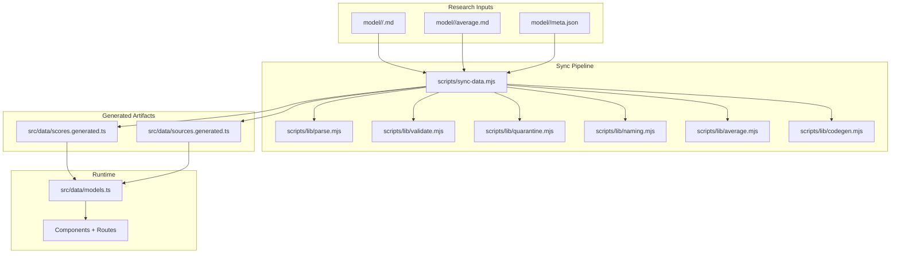

**Diagram sources**
- [README.md:31-44](file://README.md#L31-L44)
- [sync-data.mjs:1-30](file://scripts/sync-data.mjs#L1-L30)
- [models.ts:6-16](file://src/data/models.ts#L6-L16)

**Section sources**
- [README.md:61-82](file://README.md#L61-L82)
- [model README.md:1-30](file://model/README.md#L1-L30)

## Core Components
- Sync orchestrator (`scripts/sync-data.mjs`): scans model folders, enforces permanence tripwire, parses scores, quarantines invalid reports, computes averages, registers new sources, reconciles registry, and emits generated TypeScript.
- Parser (`scripts/lib/parse.mjs`): defines score labels, short keys, quality dimensions, rater gate, drift tolerance, and functions to parse scores, shorten them, compute drift, rank top-10, partition eligible raters, and sort labels.
- Validator (`scripts/lib/validate.mjs`): defines mirror roots, research path filters, regenerable paths, missing-tracked classification, deletion messages, filename hygiene, and meta.json validation.
- Averager (`scripts/lib/average.mjs`): builds mix notes, average entries, average lines, full average body, and merges recomputed bodies into existing `average.md`.
- Code generator (`scripts/lib/codegen.mjs`): parses and rebuilds registry text, computes pending registrations, appends sources, reconciles labels/slugs, prunes virtual views, and renders deterministic `scores.generated.ts`.
- Quarantine (`scripts/lib/quarantine.mjs`): detects evidence-free, zero-scored, or flat-invented reports and returns reasons for renaming to `.excluded`.
- Naming (`scripts/lib/naming.mjs`): normalizes names, maps stems to keys, resolves display label and slug via overrides and catalog lookup, checks hyphen-version violations, and formats slug guesses.
- Runtime model hydration (`src/data/models.ts`): imports generated scores and source definitions, hydrates `MODELS`, derives results-source order, and exposes utilities for virtual views and sorting.

**Section sources**
- [sync-data.mjs:1-30](file://scripts/sync-data.mjs#L1-L30)
- [parse.mjs:8-45](file://scripts/lib/parse.mjs#L8-L45)
- [validate.mjs:1-12](file://scripts/lib/validate.mjs#L1-L12)
- [average.mjs:1-10](file://scripts/lib/average.mjs#L1-L10)
- [codegen.mjs:1-8](file://scripts/lib/codegen.mjs#L1-L8)
- [quarantine.mjs:1-8](file://scripts/lib/quarantine.mjs#L1-L8)
- [naming.mjs:1-7](file://scripts/lib/naming.mjs#L1-L7)
- [models.ts:6-16](file://src/data/models.ts#L6-L16)

## Architecture Overview
The pipeline is deterministic and staged:
1. Scan and validate input structure.
2. Parse normalized scores from each findings file.
3. Auto-quarantine evidence-free or invalid reports.
4. Correct drifted Overall values when safe.
5. Partition eligible raters using the rater gate and rank top-10 cohort.
6. Recompute and write `average.md`.
7. Register new sources and reconcile registry.
8. Emit deterministic generated TypeScript for scores and sources.
9. Hydrate runtime models for UI consumption.

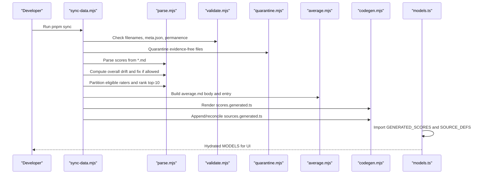

**Diagram sources**
- [sync-data.mjs:30-75](file://scripts/sync-data.mjs#L30-L75)
- [parse.mjs:47-123](file://scripts/lib/parse.mjs#L47-L123)
- [average.mjs:33-100](file://scripts/lib/average.mjs#L33-L100)
- [codegen.mjs:107-139](file://scripts/lib/codegen.mjs#L107-L139)
- [models.ts:18-28](file://src/data/models.ts#L18-L28)

## Detailed Component Analysis

### Markdown Parsing and Score Normalization
- Labels and short keys define the contract between markdown and generated TypeScript.
- `parseScoresPure` extracts seven normalized 1–100 scores; missing labels fail loudly.
- `shortenScores` maps long labels to compact keys for `scores.generated.ts`.
- Quality dimensions exclude cost efficiency from Overall calculation.

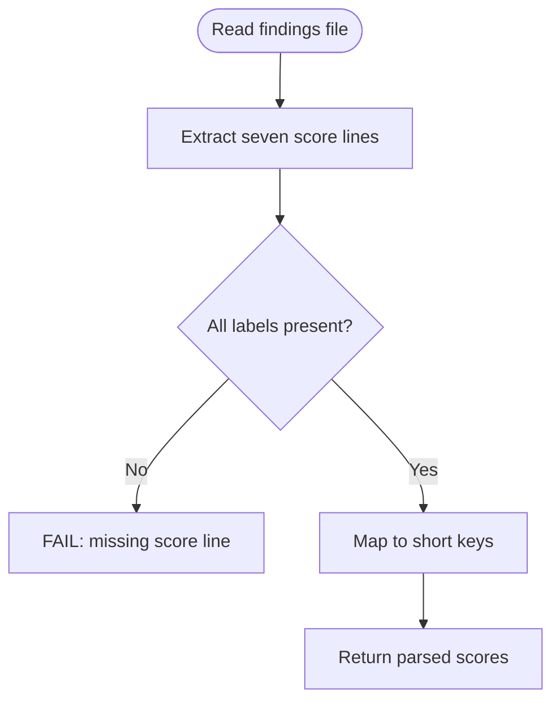

**Diagram sources**
- [parse.mjs:8-28](file://scripts/lib/parse.mjs#L8-L28)
- [parse.mjs:47-67](file://scripts/lib/parse.mjs#L47-L67)

**Section sources**
- [parse.mjs:8-28](file://scripts/lib/parse.mjs#L8-L28)
- [parse.mjs:47-67](file://scripts/lib/parse.mjs#L47-L67)

### Score Calculation and Drift Correction
- Overall is derived as the half-up mean of five quality dimensions; cost efficiency is scored but not counted toward Overall.
- `overallDrift` compares the stored Overall with the computed mean using a tolerance threshold.
- `applyOverallFix` rewrites only the Overall number when safe; otherwise it fails loudly.

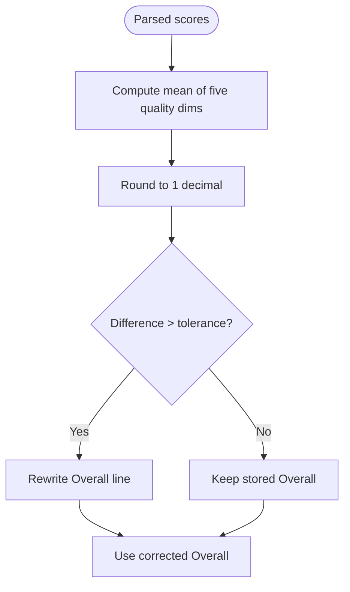

**Diagram sources**
- [parse.mjs:30-45](file://scripts/lib/parse.mjs#L30-L45)
- [parse.mjs:69-87](file://scripts/lib/parse.mjs#L69-L87)

**Section sources**
- [parse.mjs:30-45](file://scripts/lib/parse.mjs#L30-L45)
- [parse.mjs:69-87](file://scripts/lib/parse.mjs#L69-L87)

### Validation and Permanence Tripwire
- Filename hygiene ensures letters, digits, underscores, and dots only.
- Meta.json must include required fields and use spaces, not underscores, in the display name.
- Permanence tripwire checks git HEAD for missing tracked research files and classifies them as twin-retired, relocated, or deleted.

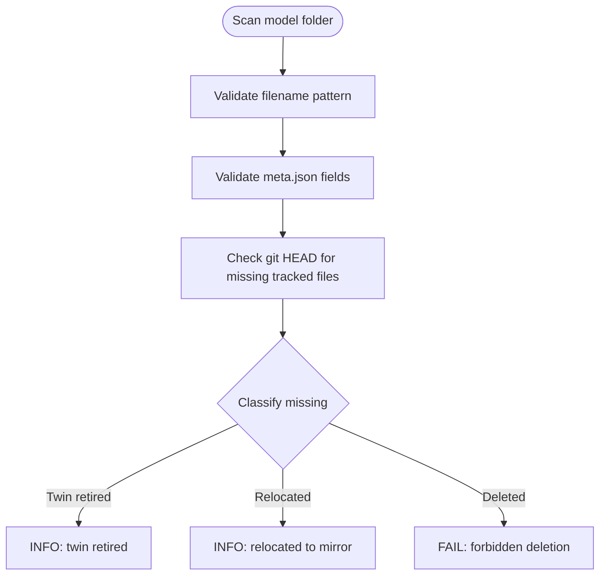

**Diagram sources**
- [validate.mjs:14-52](file://scripts/lib/validate.mjs#L14-L52)
- [validate.mjs:54-80](file://scripts/lib/validate.mjs#L54-L80)

**Section sources**
- [validate.mjs:14-52](file://scripts/lib/validate.mjs#L14-L52)
- [validate.mjs:54-80](file://scripts/lib/validate.mjs#L54-L80)

### Quarantine of Evidence-Free Reports
- Auto-quarantine renames findings files to `.excluded` when they are evidence-free, zero-scored, or flat-invented.
- Criteria count "no verified public score found" rows and measured numeric values in the Raw benchmarks section.

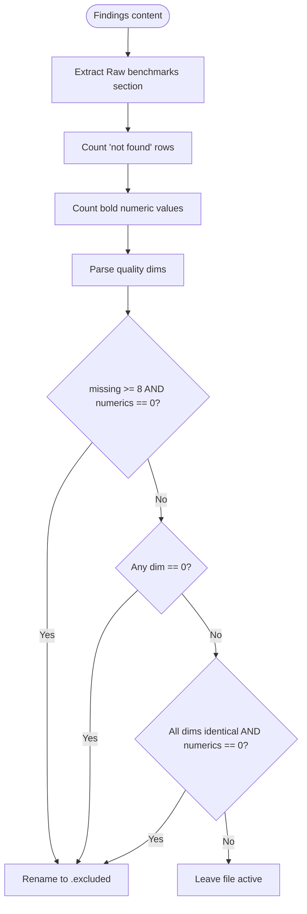

**Diagram sources**
- [quarantine.mjs:11-56](file://scripts/lib/quarantine.mjs#L11-L56)

**Section sources**
- [quarantine.mjs:11-56](file://scripts/lib/quarantine.mjs#L11-L56)

### Rater Gate and Top-10 Cohort Averaging
- Only reports written by models whose own committed average Overall exceeds the rater gate count toward another model's average.
- If no raters qualify, fallback averages all available reports while still applying the top-10 cap.
- Cohort ranking uses Overall Score descending; average.md lists included, excluded, and ignored labels.

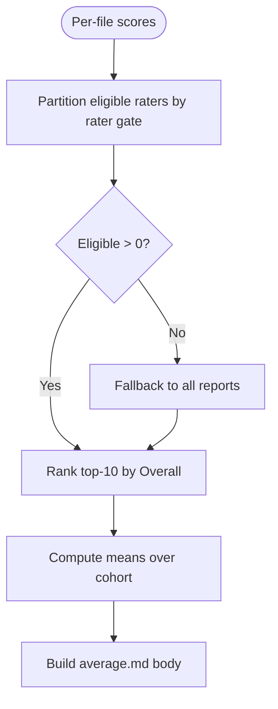

**Diagram sources**
- [parse.mjs:89-123](file://scripts/lib/parse.mjs#L89-L123)
- [average.mjs:17-81](file://scripts/lib/average.mjs#L17-L81)

**Section sources**
- [parse.mjs:89-123](file://scripts/lib/parse.mjs#L89-L123)
- [average.mjs:17-81](file://scripts/lib/average.mjs#L17-L81)

### Registry Management and Source Registration
- New reporting-agent filenames are appended to `sources.generated.ts` as `SourceKey` union members and `SOURCE_DEFS` entries.
- Labels and slugs are resolved via overrides and catalog lookup; virtual view entries are pruned.
- Collisions require human resolution; idempotent reconciliation keeps registry consistent.

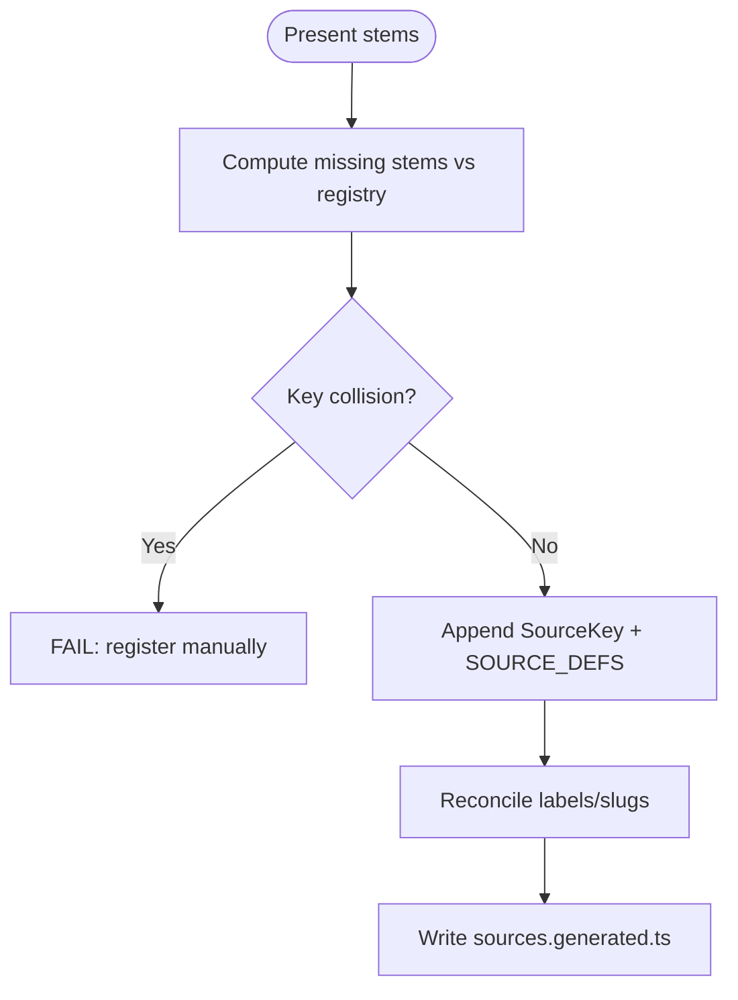

**Diagram sources**
- [codegen.mjs:14-35](file://scripts/lib/codegen.mjs#L14-L35)
- [codegen.mjs:37-84](file://scripts/lib/codegen.mjs#L37-L84)
- [codegen.mjs:86-105](file://scripts/lib/codegen.mjs#L86-L105)

**Section sources**
- [codegen.mjs:14-35](file://scripts/lib/codegen.mjs#L14-L35)
- [codegen.mjs:37-84](file://scripts/lib/codegen.mjs#L37-L84)
- [codegen.mjs:86-105](file://scripts/lib/codegen.mjs#L86-L105)

### Generated TypeScript Emission and Runtime Hydration
- `renderScoresFile` produces deterministic `scores.generated.ts` with sorted slugs and files.
- `models.ts` imports generated scores and source definitions, hydrates `MODELS`, and derives results-source ordering.
- Virtual views provide alternate ranking without being registered as real sources.

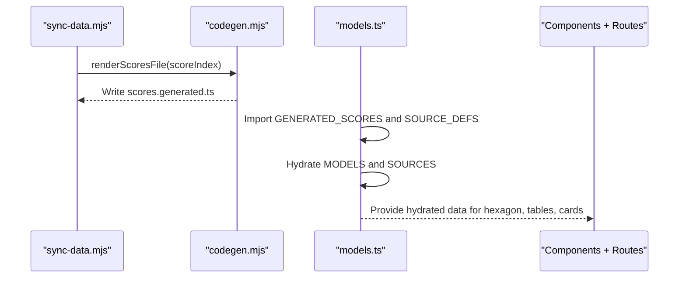

**Diagram sources**
- [codegen.mjs:107-139](file://scripts/lib/codegen.mjs#L107-L139)
- [models.ts:18-28](file://src/data/models.ts#L18-L28)
- [models.ts:227-241](file://src/data/models.ts#L227-L241)
- [models.ts:318-329](file://src/data/models.ts#L318-L329)

**Section sources**
- [codegen.mjs:107-139](file://scripts/lib/codegen.mjs#L107-L139)
- [models.ts:18-28](file://src/data/models.ts#L18-L28)
- [models.ts:227-241](file://src/data/models.ts#L227-L241)
- [models.ts:318-329](file://src/data/models.ts#L318-L329)

### Deterministic Build Process
- All outputs are sorted and computed deterministically: slugs and files are sorted before emission; registry entries are reconciled; averages are recomputed with standard half-up rounding.
- Exit codes reflect success or failure; non-zero indicates human action required.
- The workflow command sequence ensures type safety and production build integrity.

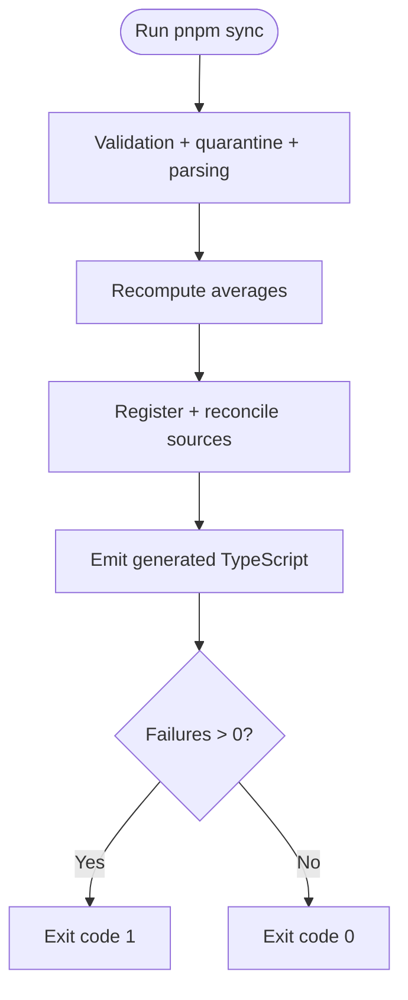

**Diagram sources**
- [sync-data.mjs:490-527](file://scripts/sync-data.mjs#L490-L527)
- [package.json:11-24](file://package.json#L11-L24)

**Section sources**
- [sync-data.mjs:490-527](file://scripts/sync-data.mjs#L490-L527)
- [package.json:11-24](file://package.json#L11-L24)

### Adding New Models and Reporting Agents
- New model: create `model/<slug>/` with findings files and `meta.json`; run `pnpm sync` to generate `average.md` and generated artifacts; then run `pnpm build.types && pnpm build`.
- New reporting agent: drop `<Source_Name>.md` into model folders; run `pnpm sync` to register the source and update averages; then run `pnpm build.types && pnpm build`.
- The pipeline handles different data sources through mirror roots and catalog lookups, ensuring consistent labeling and slug resolution.

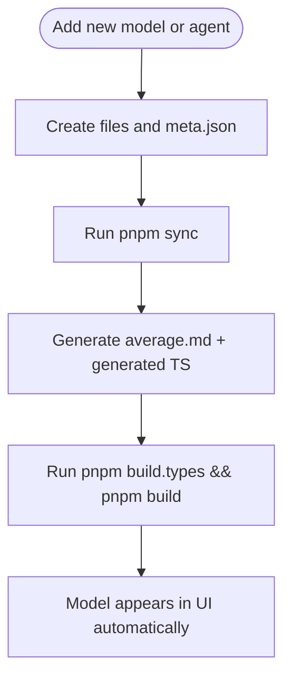

**Diagram sources**
- [model README.md:59-77](file://model/README.md#L59-L77)
- [README.md:84-91](file://README.md#L84-L91)

**Section sources**
- [model README.md:59-77](file://model/README.md#L59-L77)
- [README.md:84-91](file://README.md#L84-L91)

### Example Transformation: Raw Research to Structured Model Objects
- Input: `model/<slug>/<Source>.md` containing normalized scores and prose.
- Sync parses scores, shortens keys, corrects drift, partitions raters, ranks top-10, and builds average entries.
- Generated TypeScript exports `GENERATED_SCORES` keyed by slug and file.
- Runtime hydration maps these to `AiModel.sources` and `AiModel.scores`, exposing structured objects to components.

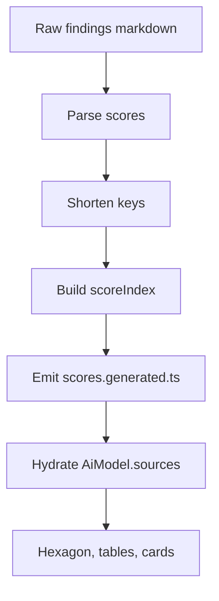

**Diagram sources**
- [parse.mjs:47-67](file://scripts/lib/parse.mjs#L47-L67)
- [codegen.mjs:107-139](file://scripts/lib/codegen.mjs#L107-L139)
- [models.ts:79-119](file://src/data/models.ts#L79-L119)

**Section sources**
- [parse.mjs:47-67](file://scripts/lib/parse.mjs#L47-L67)
- [codegen.mjs:107-139](file://scripts/lib/codegen.mjs#L107-L139)
- [models.ts:79-119](file://src/data/models.ts#L79-L119)

## Dependency Analysis
The sync pipeline composes pure helpers around filesystem and git operations:
- `sync-data.mjs` depends on `parse.mjs`, `validate.mjs`, `quarantine.mjs`, `naming.mjs`, `average.mjs`, and `codegen.mjs`.
- `models.ts` depends on generated artifacts `scores.generated.ts` and `sources.generated.ts`.
- External dependencies are minimal; the script uses Node built-ins and child process execution for git.

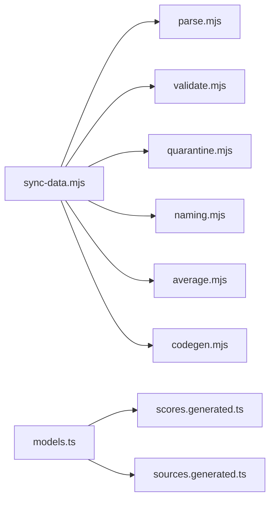

**Diagram sources**
- [sync-data.mjs:30-75](file://scripts/sync-data.mjs#L30-L75)
- [models.ts:18-28](file://src/data/models.ts#L18-L28)

**Section sources**
- [sync-data.mjs:30-75](file://scripts/sync-data.mjs#L30-L75)
- [models.ts:18-28](file://src/data/models.ts#L18-L28)

## Performance Considerations
- Pre-parsing scores into `scores.generated.ts` avoids shipping ~1.7 MB of markdown prose into the client bundle.
- Deterministic sorting and idempotent registry reconciliation minimize unnecessary writes and rebuild churn.
- Using `import.meta.glob` for meta discovery at build time keeps runtime overhead low while enabling dynamic model registration.

[No sources needed since this section provides general guidance]

## Troubleshooting Guide
Common issues and resolutions:
- Missing score lines: ensure findings files contain all seven normalized score lines exactly as defined.
- Overall drift: if drift exceeds tolerance, sync will attempt to rewrite the Overall number; if not auto-fixable, manual correction is required.
- Evidence-free reports: files with many "not found" rows and zero measured numbers are quarantined; review raw benchmarks and resubmit valid data.
- Hyphen-versioned slugs: rename folders to use dotted versions; sync fails loudly with suggestions.
- Missing meta.json: scaffold and fill required fields; sync auto-scaffolds placeholders but warns about guessed names.
- Registry collisions: resolve key conflicts manually; sync logs detailed messages.

**Section sources**
- [parse.mjs:47-87](file://scripts/lib/parse.mjs#L47-L87)
- [quarantine.mjs:42-56](file://scripts/lib/quarantine.mjs#L42-L56)
- [naming.mjs:29-44](file://scripts/lib/naming.mjs#L29-L44)
- [validate.mjs:54-80](file://scripts/lib/validate.mjs#L54-L80)
- [sync-data.mjs:180-197](file://scripts/sync-data.mjs#L180-L197)
- [sync-data.mjs:297-326](file://scripts/sync-data.mjs#L297-L326)
- [sync-data.mjs:452-467](file://scripts/sync-data.mjs#L452-L467)

## Conclusion
The data flow and processing pipeline transforms research markdown into reliable, deterministic TypeScript artifacts and runtime model objects. It enforces strict validation, quarantines invalid data, computes averages with clear governance, and generates compact client bundles. Adding new models and reporting agents is straightforward, and the deterministic build process ensures consistent output across environments. Error handling and quality assurance are embedded throughout, making the system robust and maintainable.

[No sources needed since this section summarizes without analyzing specific files]