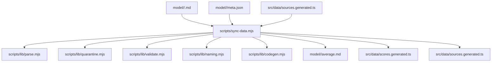
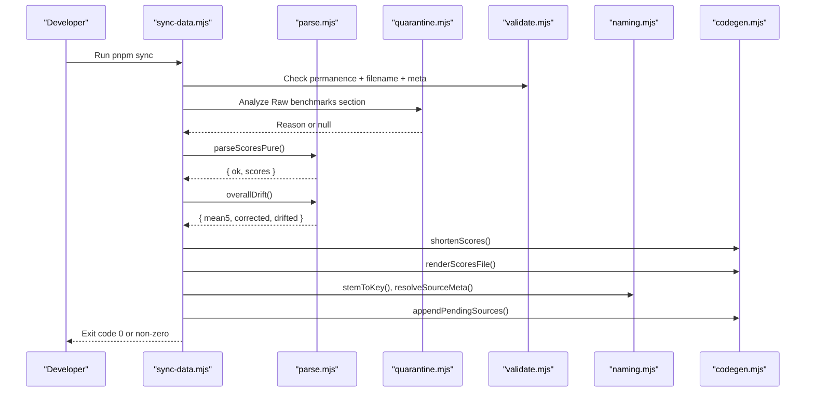
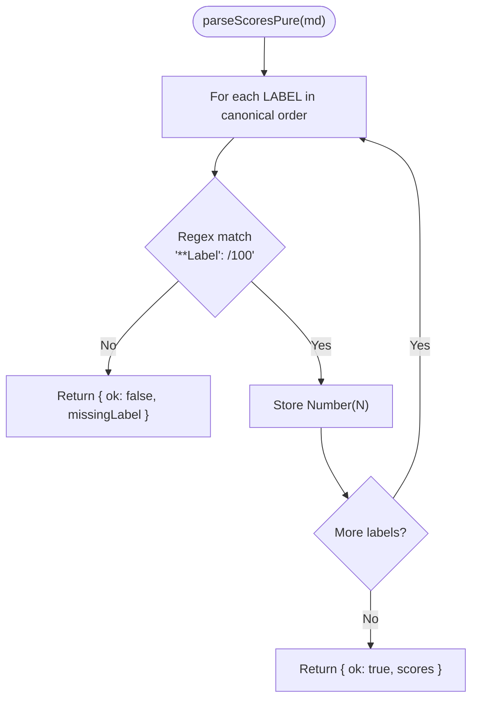
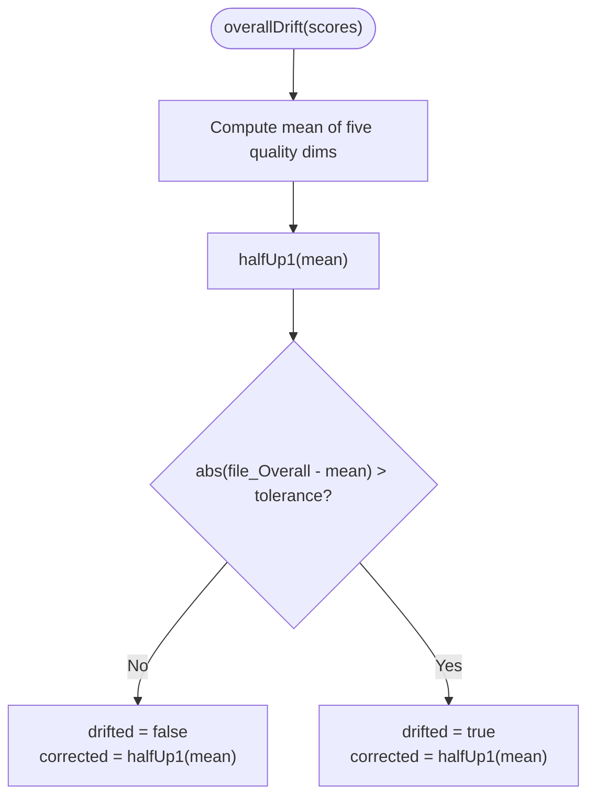
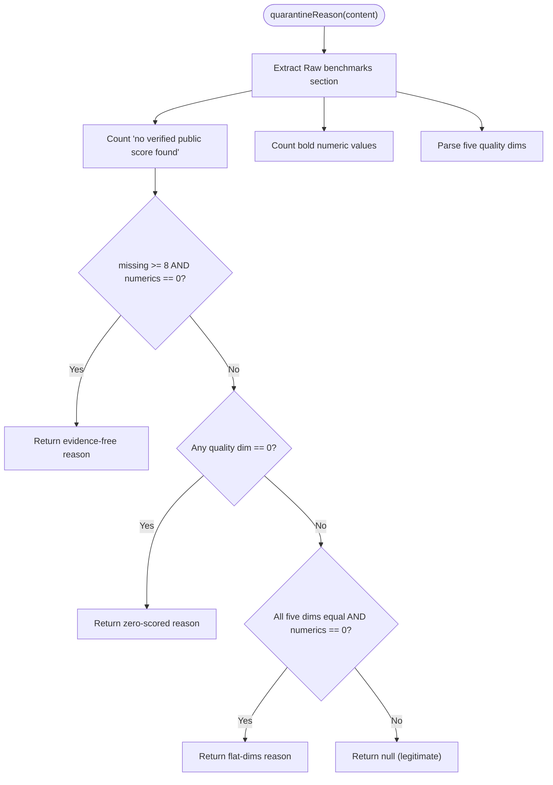
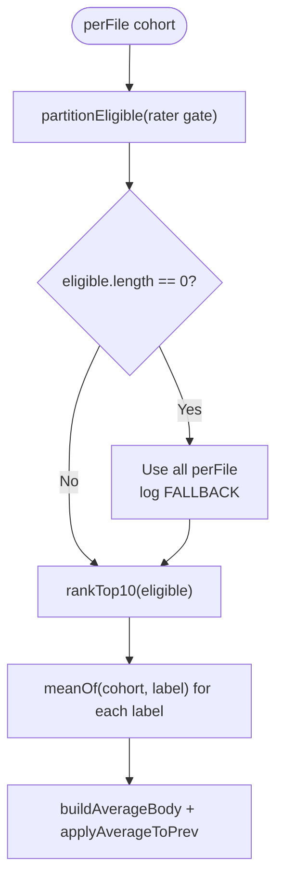
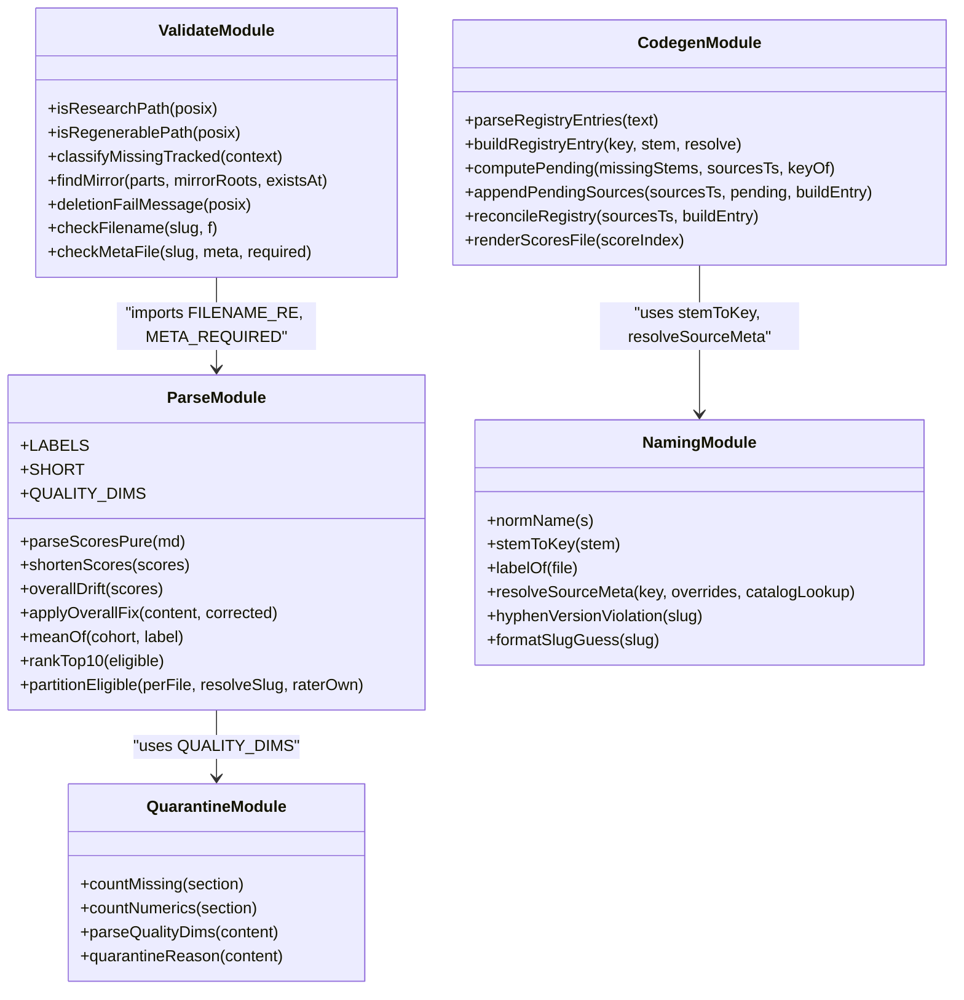
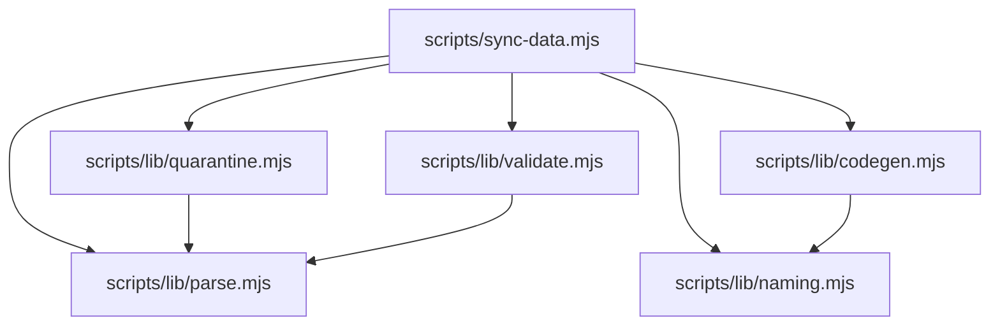

# Markdown Parsing & Validation

<cite>
**Referenced Files in This Document**
- [README.md](file://README.md)
- [model-report-TEMPLATE.md](file://model-report-TEMPLATE.md)
- [model/README.md](file://model/README.md)
- [tasks/sync-data.md](file://tasks/sync-data.md)
- [scripts/sync-data.mjs](file://scripts/sync-data.mjs)
- [scripts/lib/parse.mjs](file://scripts/lib/parse.mjs)
- [scripts/lib/quarantine.mjs](file://scripts/lib/quarantine.mjs)
- [scripts/lib/validate.mjs](file://scripts/lib/validate.mjs)
- [scripts/lib/naming.mjs](file://scripts/lib/naming.mjs)
- [scripts/lib/codegen.mjs](file://scripts/lib/codegen.mjs)
</cite>

## Table of Contents
1. [Introduction](#introduction)
2. [Project Structure](#project-structure)
3. [Core Components](#core-components)
4. [Architecture Overview](#architecture-overview)
5. [Detailed Component Analysis](#detailed-component-analysis)
6. [Dependency Analysis](#dependency-analysis)
7. [Performance Considerations](#performance-considerations)
8. [Troubleshooting Guide](#troubleshooting-guide)
9. [Conclusion](#conclusion)

## Introduction
This document explains the markdown parsing and validation system used by the project to turn research findings into normalized 1–100 scores, compute Overall scores, enforce data quality rules, quarantine evidence-free reports, validate filenames and metadata, and emit deterministic build artifacts consumed by the UI.

The system is centered around a deterministic sync script that scans `model/<slug>/` folders, parses each agent’s findings file, validates and auto-corrects Overall scores, recomputes `average.md`, registers new sources, and emits compact score and registry files for the frontend. The contract between human-authored markdown and machine-parsed data is intentionally strict: seven labeled score lines must be present, Overall is derived from five quality dimensions (Cost efficiency is scored but excluded from Overall), and evidence-free or malformed reports are quarantined or rejected rather than silently accepted.

**Section sources**
- [README.md:31-59](file://README.md#L31-L59)
- [tasks/sync-data.md:19-62](file://tasks/sync-data.md#L19-L62)

## Project Structure
At a high level, the data pipeline is:

**Diagram sources**
- [scripts/sync-data.mjs:1-76](file://scripts/sync-data.mjs#L1-L76)
- [scripts/lib/parse.mjs:1-45](file://scripts/lib/parse.mjs#L1-L45)
- [scripts/lib/quarantine.mjs:1-10](file://scripts/lib/quarantine.mjs#L1-L10)
- [scripts/lib/validate.mjs:1-10](file://scripts/lib/validate.mjs#L1-L10)
- [scripts/lib/naming.mjs:1-7](file://scripts/lib/naming.mjs#L1-L7)
- [scripts/lib/codegen.mjs:1-8](file://scripts/lib/codegen.mjs#L1-L8)

The repository organizes research data under `model/<slug>/`, one folder per model, with one findings file per reporting agent, plus `average.md` (recomputed by sync) and `meta.json` (curated display metadata). The website reads pre-parsed scores and source registry entries generated at sync time, so report prose does not ship into the client bundle.

**Section sources**
- [README.md:31-44](file://README.md#L31-L44)
- [model/README.md:1-30](file://model/README.md#L1-L30)

## Core Components
The parsing and validation system consists of six tightly coupled pieces:

| Component | Responsibility | Key Outputs / Behaviors |
|---|---|---|
| Findings template | Defines required structure, scoring formula, and self-exclusion rule | Seven normalized 1–100 scores, signature, checklist |
| Parser | Extracts exactly seven labeled scores from markdown | `{ ok, scores }`, short keys, drift detection, cohort helpers |
| Quarantine analyzer | Detects evidence-free or invalid reports | Rename `.md` → `.md.excluded` with reason |
| Filename and metadata validator | Enforces filename hygiene and `meta.json` schema | FAIL messages for missing fields, underscores in name, bad filenames |
| Naming helper | Maps stems to labels, slugs, and version conventions | Slug suggestions, virtual keys, catalog resolution |
| Codegen builder | Emits deterministic TypeScript artifacts | `sources.generated.ts` registry, `scores.generated.ts` numbers-only index |

**Section sources**
- [model-report-TEMPLATE.md:1-104](file://model-report-TEMPLATE.md#L1-L104)
- [scripts/lib/parse.mjs:8-45](file://scripts/lib/parse.mjs#L8-L45)
- [scripts/lib/quarantine.mjs:1-57](file://scripts/lib/quarantine.mjs#L1-L57)
- [scripts/lib/validate.mjs:54-81](file://scripts/lib/validate.mjs#L54-L81)
- [scripts/lib/naming.mjs:8-44](file://scripts/lib/naming.mjs#L8-L44)
- [scripts/lib/codegen.mjs:14-35](file://scripts/lib/codegen.mjs#L14-L35)

## Architecture Overview
The sync script is the orchestrator. It performs these phases in order:

1. **Permanence tripwire:** checks git-tracked research files; missing files fail unless they are regenerable, twin-retired, or relocated to a sanctioned mirror.
2. **Slug version convention enforcement:** rejects hyphen-versioned slug folders and suggests the dotted form.
3. **Rater gate precomputation:** reads committed `average.md` files to determine which models qualify as raters.
4. **Auto-quarantine:** renames evidence-free findings to `.md.excluded`.
5. **Filename hygiene check:** rejects filenames outside `[A-Za-z0-9_.]+\.md`.
6. **Metadata validation:** scaffolds missing `meta.json`, then validates required fields and display-name rules.
7. **Score parsing and Overall drift correction:** parses seven scores, auto-corrects drifted Overall values within tolerance.
8. **Average recomputation:** selects eligible raters, applies top-10 cap, computes means, writes `average.md`.
9. **Registry reconciliation:** appends missing sources, resolves labels/slugs, prunes virtual views.
10. **Scores codegen:** emits `src/data/scores.generated.ts` only when there are zero failures.

**Diagram sources**
- [scripts/sync-data.mjs:119-126](file://scripts/sync-data.mjs#L119-L126)
- [scripts/sync-data.mjs:259-276](file://scripts/sync-data.mjs#L259-L276)
- [scripts/sync-data.mjs:330-370](file://scripts/sync-data.mjs#L330-L370)
- [scripts/sync-data.mjs:438-523](file://scripts/sync-data.mjs#L438-L523)
- [scripts/lib/parse.mjs:52-78](file://scripts/lib/parse.mjs#L52-L78)
- [scripts/lib/quarantine.mjs:42-56](file://scripts/lib/quarantine.mjs#L42-L56)
- [scripts/lib/validate.mjs:54-81](file://scripts/lib/validate.mjs#L54-L81)
- [scripts/lib/naming.mjs:11-27](file://scripts/lib/naming.mjs#L11-L27)
- [scripts/lib/codegen.mjs:44-84](file://scripts/lib/codegen.mjs#L44-L84)

## Detailed Component Analysis

### Scoring Extraction Contract
Each findings file must contain exactly seven normalized score lines in canonical order:

- Tool use
- Reasoning
- Context window
- Multimodal
- Coding
- Cost efficiency
- Overall Score

The parser matches each label against the markdown using a fixed label list and extracts the numeric value before `/100`. If any label is missing, parsing fails immediately with the missing label; it never invents numbers. Floats with up to one decimal place are accepted.

**Diagram sources**
- [scripts/lib/parse.mjs:8-17](file://scripts/lib/parse.mjs#L8-L17)
- [scripts/lib/parse.mjs:52-60](file://scripts/lib/parse.mjs#L52-L60)

**Section sources**
- [scripts/lib/parse.mjs:8-17](file://scripts/lib/parse.mjs#L8-L17)
- [scripts/lib/parse.mjs:52-60](file://scripts/lib/parse.mjs#L52-L60)
- [model-report-TEMPLATE.md:71-87](file://model-report-TEMPLATE.md#L71-L87)

### Overall Score Derivation and Drift Detection
Overall is defined as the half-up rounded mean of the five quality dimensions: Tool use, Reasoning, Context window, Multimodal, and Coding. Cost efficiency is scored independently and never contributes to Overall.

The drift detector computes the expected mean, rounds it to one decimal, and compares it to the file’s reported Overall. A difference greater than the tolerance threshold indicates drift. When drift is detected, the sync script attempts to rewrite only the Overall number; if the line cannot be auto-fixed, the run fails loudly.

**Diagram sources**
- [scripts/lib/parse.mjs:30-31](file://scripts/lib/parse.mjs#L30-L31)
- [scripts/lib/parse.mjs:41-45](file://scripts/lib/parse.mjs#L41-L45)
- [scripts/lib/parse.mjs:74-78](file://scripts/lib/parse.mjs#L74-L78)

**Section sources**
- [scripts/lib/parse.mjs:30-31](file://scripts/lib/parse.mjs#L30-L31)
- [scripts/lib/parse.mjs:41-45](file://scripts/lib/parse.mjs#L41-L45)
- [scripts/lib/parse.mjs:74-78](file://scripts/lib/parse.mjs#L74-L78)
- [scripts/sync-data.mjs:347-370](file://scripts/sync-data.mjs#L347-L370)
- [tasks/sync-data.md:31-37](file://tasks/sync-data.md#L31-L37)

### Quarantine Mechanism
Evidence-free reports are automatically quarantined. Before normal parsing, sync scans every active `.md` findings file and analyzes its Raw benchmarks section. A file is quarantined when any of these conditions hold:

- Evidence-free: eight or more “no verified public score found” rows and zero measured bold numeric values.
- Zero-scored: any quality dimension equals 0.
- Flat invented uniformity: all five quality dimensions are identical and zero measured numbers are cited.

Quarantined files are renamed to `<Source_Name>.md.excluded`; their content is preserved, but they are skipped during parsing, averaging, and registration.

**Diagram sources**
- [scripts/lib/quarantine.mjs:11-31](file://scripts/lib/quarantine.mjs#L11-L31)
- [scripts/lib/quarantine.mjs:42-56](file://scripts/lib/quarantine.mjs#L42-L56)

**Section sources**
- [scripts/lib/quarantine.mjs:1-57](file://scripts/lib/quarantine.mjs#L1-L57)
- [scripts/sync-data.mjs:259-276](file://scripts/sync-data.mjs#L259-L276)
- [model-report-TEMPLATE.md:26-39](file://model-report-TEMPLATE.md#L26-L39)
- [tasks/sync-data.md:21-29](file://tasks/sync-data.md#L21-L29)

### Filename Hygiene Checks
Findings filenames must match the allowed pattern: letters, digits, underscores, and dots, ending in `.md`. Filenames containing other characters fail loudly. Self-excluded files (`*.md.excluded`) are explicitly skipped and logged as `SKIP`, while auto-quarantined files are renamed on disk.

The filename regex is shared between the parser module and the validator module, ensuring consistency across parsing and validation.

**Section sources**
- [scripts/lib/parse.mjs:35-36](file://scripts/lib/parse.mjs#L35-L36)
- [scripts/lib/validate.mjs:54-60](file://scripts/lib/validate.mjs#L54-L60)
- [scripts/sync-data.mjs:284-295](file://scripts/sync-data.mjs#L284-L295)
- [model/README.md:17-22](file://model/README.md#L17-L22)

### Version Convention Enforcement
Model folder slugs must use dots for version numbers, not hyphens. For example, `gpt-5.5` is valid, while `gpt-5-5` is treated as a duplicate of the dotted variant and fails loudly with a suggested replacement. Exceptions exist for cases where digit-hyphen-digit patterns represent parameter sizes or codenames, such as `gemma-4-31b`, `qwen-3.8-27b`, and `qwen-3.5-9b`.

The sync script iterates over all model folders and applies this check before processing findings.

**Section sources**
- [scripts/lib/naming.mjs:29-44](file://scripts/lib/naming.mjs#L29-L44)
- [scripts/sync-data.mjs:180-197](file://scripts/sync-data.mjs#L180-L197)
- [model/README.md:7-16](file://model/README.md#L7-L16)
- [tasks/sync-data.md:107-108](file://tasks/sync-data.md#L107-L108)

### Metadata Validation
Every model folder must have a `meta.json` with required fields: `id`, `name`, `short`, `contextWindow`, `modalities`, and `pricingNote`. If `meta.json` is missing, sync scaffolds a placeholder entry based on the slug, logs a warning, and requires a human to replace it with verified vendor facts.

The validator also enforces that `name` uses spaces rather than underscores, because underscores are slug artifacts and not valid in official vendor display names.

**Section sources**
- [scripts/lib/validate.mjs:62-81](file://scripts/lib/validate.mjs#L62-L81)
- [scripts/sync-data.mjs:297-327](file://scripts/sync-data.mjs#L297-L327)
- [model/README.md:32-43](file://model/README.md#L32-L43)

### Rater Gate and Average Recomputation
Only reports written by models whose own committed average Overall exceeds the rater gate count toward another model’s average. The default gate is strictly greater than 84.9. If no rater clears the gate, sync falls back to averaging all available reports, still applying the top-10 cap.

The average is computed as arithmetic means with standard half-up rounding to one decimal. Overall in `average.md` is the mean of the cohort’s Overall scores, not re-derived from averaged dimensions.

**Diagram sources**
- [scripts/lib/parse.mjs:38-39](file://scripts/lib/parse.mjs#L38-L39)
- [scripts/lib/parse.mjs:89-97](file://scripts/lib/parse.mjs#L89-L97)
- [scripts/lib/parse.mjs:99-117](file://scripts/lib/parse.mjs#L99-L117)
- [scripts/sync-data.mjs:372-435](file://scripts/sync-data.mjs#L372-L435)

**Section sources**
- [scripts/lib/parse.mjs:38-39](file://scripts/lib/parse.mjs#L38-L39)
- [scripts/lib/parse.mjs:89-117](file://scripts/lib/parse.mjs#L89-L117)
- [scripts/sync-data.mjs:211-226](file://scripts/sync-data.mjs#L211-L226)
- [scripts/sync-data.mjs:372-435](file://scripts/sync-data.mjs#L372-L435)
- [tasks/sync-data.md:38-47](file://tasks/sync-data.md#L38-L47)

### Registry and Downstream Artifacts
New reporting-agent filenames are registered in `src/data/sources.generated.ts` by appending `SourceKey` union members and `SOURCE_DEFS` entries. Labels and slugs are resolved through overrides and catalog lookup. Virtual sort-view keys are pruned from the registry.

Additionally, sync emits `src/data/scores.generated.ts`, a compact numbers-only index mapping slug → filename → short-keyed scores. This keeps report prose out of the client bundle and provides deterministic, sorted output.

**Diagram sources**
- [scripts/lib/parse.mjs:8-117](file://scripts/lib/parse.mjs#L8-L117)
- [scripts/lib/quarantine.mjs:11-56](file://scripts/lib/quarantine.mjs#L11-L56)
- [scripts/lib/validate.mjs:9-81](file://scripts/lib/validate.mjs#L9-L81)
- [scripts/lib/naming.mjs:8-67](file://scripts/lib/naming.mjs#L8-L67)
- [scripts/lib/codegen.mjs:14-139](file://scripts/lib/codegen.mjs#L14-L139)

**Section sources**
- [scripts/lib/codegen.mjs:14-35](file://scripts/lib/codegen.mjs#L14-L35)
- [scripts/lib/codegen.mjs:44-84](file://scripts/lib/codegen.mjs#L44-L84)
- [scripts/lib/codegen.mjs:92-105](file://scripts/lib/codegen.mjs#L92-L105)
- [scripts/lib/codegen.mjs:107-139](file://scripts/lib/codegen.mjs#L107-L139)
- [scripts/sync-data.mjs:438-523](file://scripts/sync-data.mjs#L438-L523)

## Dependency Analysis
The sync script depends on pure helper modules to keep behavior deterministic and testable. The main dependency relationships are:

- `sync-data.mjs` imports parsing, quarantine, validation, naming, and codegen helpers.
- `parse.mjs` defines the canonical label contract and scoring math.
- `quarantine.mjs` depends on `QUALITY_DIMS` from `parse.mjs`.
- `validate.mjs` imports `FILENAME_RE` and `META_REQUIRED` from `parse.mjs`.
- `codegen.mjs` relies on naming helpers for registry construction and score serialization.

**Diagram sources**
- [scripts/sync-data.mjs:36-76](file://scripts/sync-data.mjs#L36-L76)
- [scripts/lib/quarantine.mjs:9](file://scripts/lib/quarantine.mjs#L9)
- [scripts/lib/validate.mjs:9](file://scripts/lib/validate.mjs#L9)
- [scripts/lib/codegen.mjs:1-8](file://scripts/lib/codegen.mjs#L1-L8)

**Section sources**
- [scripts/sync-data.mjs:36-76](file://scripts/sync-data.mjs#L36-L76)
- [scripts/lib/quarantine.mjs:9](file://scripts/lib/quarantine.mjs#L9)
- [scripts/lib/validate.mjs:9](file://scripts/lib/validate.mjs#L9)

## Performance Considerations
The system is designed for deterministic, offline-first data processing:

- Parsing and validation functions are side-effect free, enabling regression tests without filesystem access.
- Scores are pre-parsed into `src/data/scores.generated.ts`, avoiding expensive eager markdown imports at runtime.
- Output is deterministic: slugs and filenames are sorted, and generated files are byte-identical across runs when inputs do not change.
- The sync script avoids mutating generated artifacts when failures are present, preventing invalid data from being cemented.

These characteristics reduce client bundle size, stabilize builds, and make the pipeline safe for repeated execution.

[No sources needed since this section provides general guidance]

## Troubleshooting Guide

### Common Error Patterns

| Symptom | Likely Cause | Resolution |
|---|---|---|
| `FAIL ... missing "- **X: <N>/100" score line` | One of the seven required score labels is missing or malformed | Add the exact label line in canonical order |
| `AUTO ... Overall X -> Y` | Overall drifted beyond tolerance | Accept the auto-corrected value; verify the five quality dims |
| `FAIL ... Overall drifted but score line not auto-fixable` | Overall changed but the regex could not rewrite it | Manually fix the Overall line to match the expected format |
| `QUAR ... evidence-free / zero-scored / flat dims` | Report has no verified benchmarks, zeros in quality dims, or uniform invented scores | Provide real benchmark evidence or save as `.md.excluded` |
| `FAIL ... filename must match ...` | Findings filename contains disallowed characters | Rename to letters, digits, underscores, and dots only |
| `FAIL ... version numbers use "." not "-"` | Model folder slug uses hyphen instead of dot for version | Rename folder to the dotted suggestion |
| `FAIL ... missing required field "..."` | `meta.json` lacks a required field | Add the missing field with verified vendor data |
| `FAIL ... "name" must use spaces, never underscores` | `meta.json.name` contains underscores | Replace underscores with the official vendor display name |
| `SKIP ... self-excluded` | File ends in `.md.excluded` | Treat as intentional exclusion; do not parse or average |
| `GATE ... ignored below-gate rater(s)` | Rater’s own average Overall did not exceed the gate | Review rater quality or accept fallback averaging |
| `FALLBACK ... no qualifying raters` | No rater cleared the gate | Expect all reports to be averaged with top-10 cap |

**Section sources**
- [scripts/sync-data.mjs:119-126](file://scripts/sync-data.mjs#L119-L126)
- [scripts/sync-data.mjs:347-370](file://scripts/sync-data.mjs#L347-L370)
- [scripts/sync-data.mjs:259-295](file://scripts/sync-data.mjs#L259-L295)
- [scripts/sync-data.mjs:372-435](file://scripts/sync-data.mjs#L372-L435)
- [tasks/sync-data.md:31-47](file://tasks/sync-data.md#L31-L47)

### Valid vs Invalid Markdown Formats

Valid findings files should include:

- A clear header identifying the model and agent.
- A model card with provider, IDs, context window, modalities, pricing, and architecture.
- A Raw benchmarks section listing measured numbers with traceability.
- A Normalized scores section with exactly seven labeled 1–100 scores.
- An Overall Score derived from the five quality dimensions.
- A signature block and submission checklist.

Invalid formats include:

- Missing any of the seven score labels.
- Including Cost efficiency in Overall calculation.
- Using fabricated placeholder scores.
- Having zero verified benchmarks but saving a scored `.md` instead of `.md.excluded`.
- Using underscores or incorrect casing in `meta.json.name`.
- Using hyphen-separated versions in model folder slugs.

**Section sources**
- [model-report-TEMPLATE.md:1-104](file://model-report-TEMPLATE.md#L1-L104)
- [scripts/lib/parse.mjs:8-17](file://scripts/lib/parse.mjs#L8-L17)
- [scripts/lib/parse.mjs:52-60](file://scripts/lib/parse.mjs#L52-L60)
- [scripts/lib/quarantine.mjs:42-56](file://scripts/lib/quarantine.mjs#L42-L56)
- [scripts/lib/validate.mjs:67-81](file://scripts/lib/validate.mjs#L67-L81)
- [scripts/lib/naming.mjs:40-44](file://scripts/lib/naming.mjs#L40-L44)

### Relationship Between Parsing Results and Downstream Processing
Parsing results flow through several downstream stages:

1. **Shortened scores** are emitted into `scores.generated.ts` for the client.
2. **Overall drift correction** updates the source file and the in-memory score index.
3. **Eligible cohorts** feed average computation and agreement notes.
4. **Source keys** are registered in `sources.generated.ts` for dropdown wiring.
5. **Catalog metadata** supports label-to-slug resolution for cross-links.

If any stage fails, generated artifacts are not rewritten, preserving previous valid state until the issue is resolved.

**Section sources**
- [scripts/sync-data.mjs:343-370](file://scripts/sync-data.mjs#L343-L370)
- [scripts/sync-data.mjs:400-435](file://scripts/sync-data.mjs#L400-L435)
- [scripts/sync-data.mjs:438-523](file://scripts/sync-data.mjs#L438-L523)
- [scripts/lib/codegen.mjs:107-139](file://scripts/lib/codegen.mjs#L107-L139)

## Conclusion
The markdown parsing and validation system enforces a strict, testable contract between human-authored research findings and machine-generated site data. It extracts seven normalized scores, derives and validates Overall, quarantines evidence-free reports, enforces filename and metadata hygiene, applies version conventions, and emits deterministic artifacts consumed by the UI. The design prioritizes data integrity, reproducibility, and clarity: invalid input is rejected or quarantined rather than silently accepted, and generated outputs are stable, sorted, and separated from report prose.

When working with this system, treat `pnpm sync` as the authoritative data pipeline: add findings files, run sync, inspect FAIL/GATE/AUTO/QUAR/INFO lines, fix issues, rebuild, and verify that generated artifacts reflect the intended state.

[No sources needed since this section summarizes without analyzing specific files]