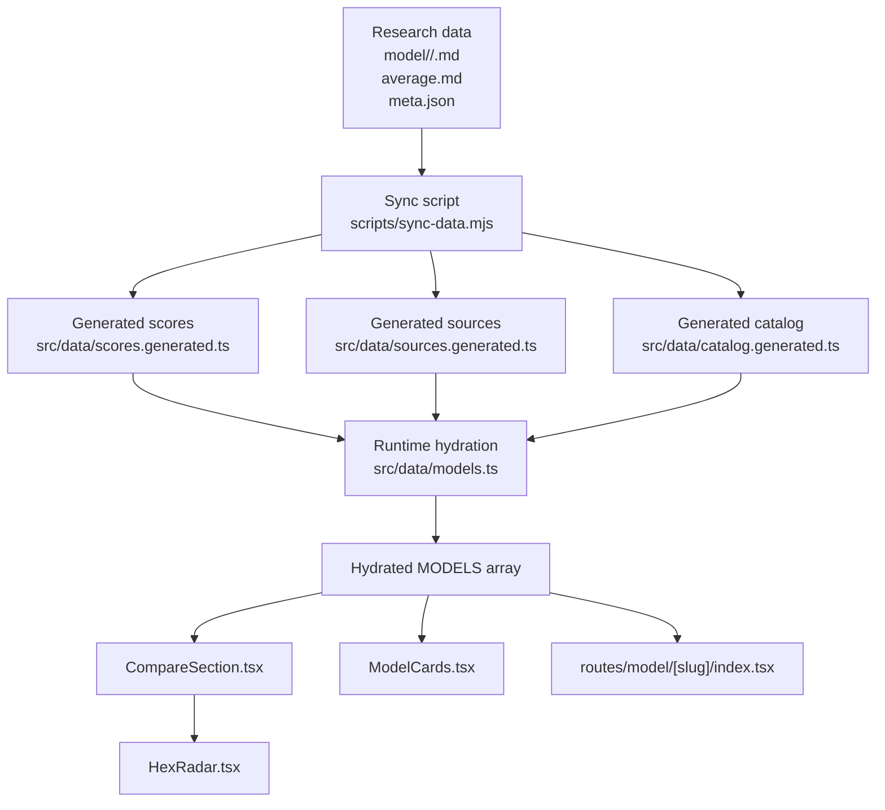
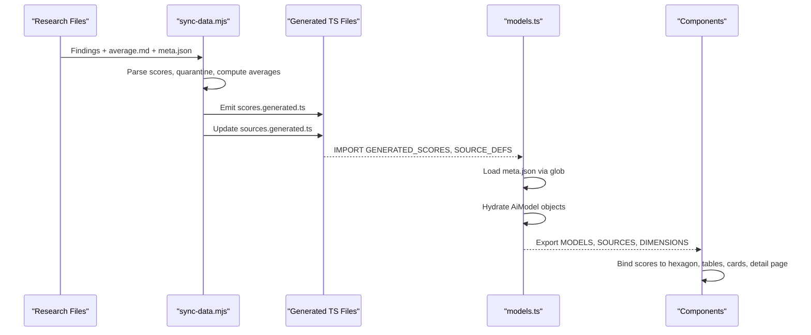
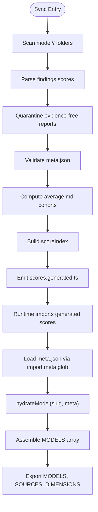
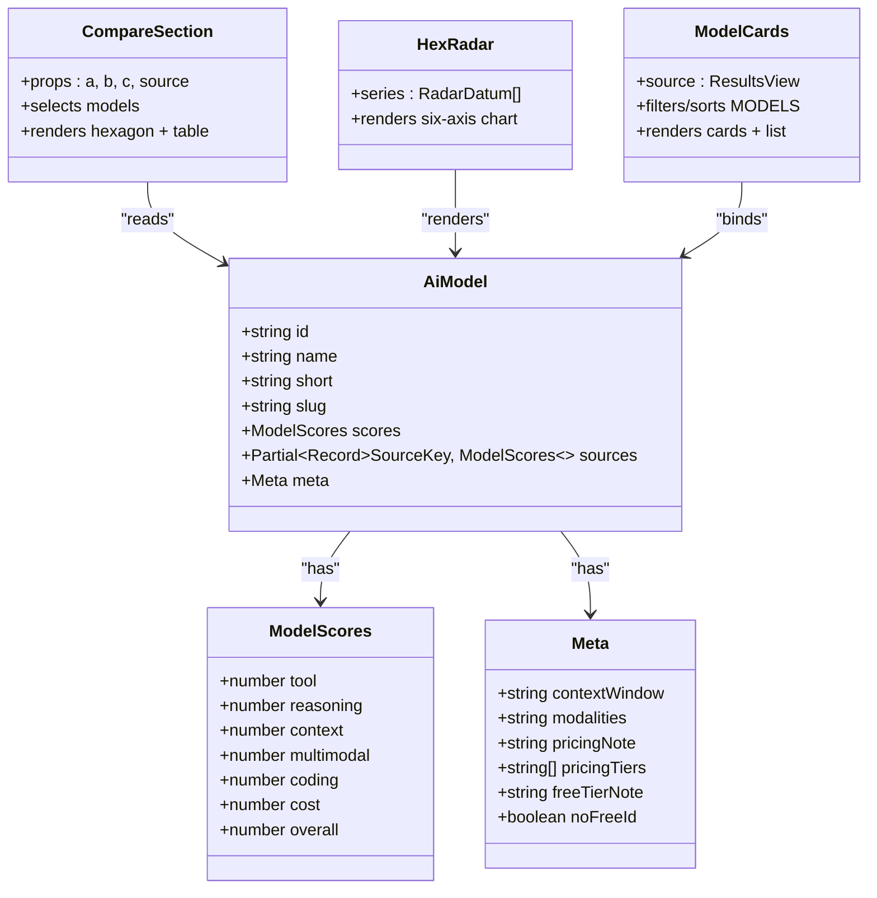
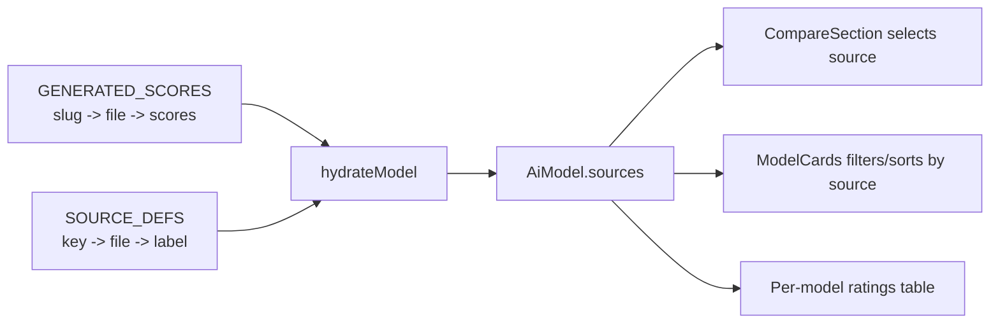
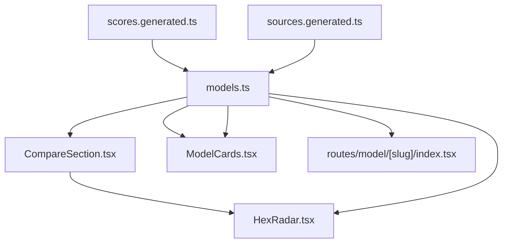

# Runtime Data Hydration

<cite>
**Referenced Files in This Document**
- [README.md](file://README.md)
- [model/README.md](file://model/README.md)
- [scripts/sync-data.mjs](file://scripts/sync-data.mjs)
- [src/data/models.ts](file://src/data/models.ts)
- [src/data/scores.generated.ts](file://src/data/scores.generated.ts)
- [src/data/sources.generated.ts](file://src/data/sources.generated.ts)
- [src/data/catalog.generated.ts](file://src/data/catalog.generated.ts)
- [src/components/CompareSection.tsx](file://src/components/CompareSection.tsx)
- [src/components/HexRadar.tsx](file://src/components/HexRadar.tsx)
- [src/components/ModelCards.tsx](file://src/components/ModelCards.tsx)
- [src/routes/model/[slug]/index.tsx](file://src/routes/model/[slug]/index.tsx)
</cite>

## Table of Contents
1. [Introduction](#introduction)
2. [Project Structure](#project-structure)
3. [Core Components](#core-components)
4. [Architecture Overview](#architecture-overview)
5. [Detailed Component Analysis](#detailed-component-analysis)
6. [Dependency Analysis](#dependency-analysis)
7. [Performance Considerations](#performance-considerations)
8. [Troubleshooting Guide](#troubleshooting-guide)
9. [Conclusion](#conclusion)

## Introduction
This document explains the runtime data hydration layer that turns research markdown and curated metadata into usable model objects for the UI. The system separates heavy markdown content from lightweight numeric data: a build-time sync step parses findings files into compact score indexes, while the application imports generated TypeScript files at startup to hydrate models, derive results-source ordering, and bind scores to components such as the hexagon radar, comparison table, and per-model pages.

The key idea is that developers and researchers add or update markdown files under `model/<slug>/`, run `pnpm sync`, and then rebuild. The sync script validates, computes averages, registers new sources, and emits generated files. At runtime, `src/data/models.ts` imports those generated files and produces the `MODELS` array consumed by all components.

## Project Structure
The hydration pipeline spans three layers:

| Layer | Responsibility | Key Files |
|---|---|---|
| Research data | Markdown findings, average scores, and curated metadata | `model/<slug>/<Source>.md`, `model/<slug>/average.md`, `model/<slug>/meta.json` |
| Sync and code generation | Parse, validate, compute averages, register sources, emit generated TS | `scripts/sync-data.mjs`, `src/data/scores.generated.ts`, `src/data/sources.generated.ts`, `src/data/catalog.generated.ts` |
| Runtime hydration | Import generated data, hydrate model objects, expose constants and helpers | `src/data/models.ts` |
| UI binding | Read hydrated models and render charts, tables, cards, and detail pages | `src/components/CompareSection.tsx`, `src/components/HexRadar.tsx`, `src/components/ModelCards.tsx`, `src/routes/model/[slug]/index.tsx` |

**Diagram sources**
- [scripts/sync-data.mjs:1-29](file://scripts/sync-data.mjs#L1-L29)
- [scripts/sync-data.mjs:490-523](file://scripts/sync-data.mjs#L490-L523)
- [src/data/models.ts:6-18](file://src/data/models.ts#L6-L18)
- [src/data/models.ts:227-241](file://src/data/models.ts#L227-L241)
- [src/components/CompareSection.tsx:1-10](file://src/components/CompareSection.tsx#L1-L10)
- [src/components/ModelCards.tsx:1-10](file://src/components/ModelCards.tsx#L1-L10)
- [src/routes/model/[slug]/index.tsx:1-11](file://src/routes/model/[slug]/index.tsx#L1-L11)

**Section sources**
- [README.md:31-44](file://README.md#L31-L44)
- [model/README.md:1-30](file://model/README.md#L1-L30)

## Core Components
The runtime hydration layer centers on one main module and several generated artifacts:

| Component | Purpose | Important Details |
|---|---|---|
| `src/data/models.ts` | Imports generated scores and source registry, hydrates `AiModel` objects, defines dimensions, virtual views, and results-source ordering | Exposes `MODELS`, `DIMENSIONS`, `SOURCES`, `VIRTUAL_VIEWS`, `getModel`, and dev-only overall-score validation |
| `src/data/scores.generated.ts` | Compact pre-parsed numeric scores keyed by slug and source filename | Emits only numbers; avoids shipping full markdown prose |
| `src/data/sources.generated.ts` | Reporting-agent registry with `SourceKey`, `SourceDef`, `ViewKey`, and `ResultsView` types plus `SOURCE_DEFS` | New agents are auto-appended by sync; dropdown order is derived at build time |
| `src/data/catalog.generated.ts` | Pre-baked summary metadata catalog placeholder | Intended for lightweight catalog fields instead of eager globbing of raw meta files |
| `scripts/sync-data.mjs` | Deterministic sync: parse scores, quarantine evidence-free reports, compute averages, register sources, emit generated files | Strict gate for data quality; never hand-edited generated files |

**Section sources**
- [src/data/models.ts:46-77](file://src/data/models.ts#L46-L77)
- [src/data/models.ts:121-163](file://src/data/models.ts#L121-L163)
- [src/data/models.ts:169-188](file://src/data/models.ts#L169-L188)
- [src/data/models.ts:227-329](file://src/data/models.ts#L227-L329)
- [src/data/scores.generated.ts:1-10](file://src/data/scores.generated.ts#L1-L10)
- [src/data/sources.generated.ts:1-81](file://src/data/sources.generated.ts#L1-L81)
- [src/data/sources.generated.ts:83-146](file://src/data/sources.generated.ts#L83-L146)
- [src/data/catalog.generated.ts:1-16](file://src/data/catalog.generated.ts#L1-L16)
- [scripts/sync-data.mjs:1-29](file://scripts/sync-data.mjs#L1-L29)

## Architecture Overview
The hydration architecture has two distinct phases:

1. **Build-time sync phase:**
   - Scans `model/<slug>/` folders.
   - Parses normalized 1–100 scores from each findings file.
   - Quarantines evidence-free reports.
   - Recomputes `average.md` using a top-10 cohort and rater gate.
   - Registers new reporting agents.
   - Validates `meta.json`.
   - Emits `scores.generated.ts`, updates `sources.generated.ts`, and removes legacy slugs files.

2. **Runtime hydration phase:**
   - Imports `GENERATED_SCORES` and `SOURCE_DEFS`.
   - Glob-imports `meta.json` files.
   - Validates required metadata fields.
   - Hydrates each model into an `AiModel` object with averaged scores and per-source scores.
   - Derives virtual sort views and results-source ordering.
   - Exposes `MODELS` for components.

**Diagram sources**
- [scripts/sync-data.mjs:119-126](file://scripts/sync-data.mjs#L119-L126)
- [scripts/sync-data.mjs:259-345](file://scripts/sync-data.mjs#L259-L345)
- [scripts/sync-data.mjs:438-523](file://scripts/sync-data.mjs#L438-L523)
- [src/data/models.ts:18-19](file://src/data/models.ts#L18-L19)
- [src/data/models.ts:184-188](file://src/data/models.ts#L184-L188)
- [src/data/models.ts:227-241](file://src/data/models.ts#L227-L241)

## Detailed Component Analysis

### Model Hydration Pipeline
The pipeline transforms raw research data into typed model objects:

1. **Score parsing:** Each findings file must contain normalized score lines. The sync script parses them and shortens the keys for the generated index.
2. **Average computation:** The default view uses `average.md`, recomputed from eligible raters and a top-10 cohort.
3. **Metadata loading:** `models.ts` eagerly globs `meta.json` files and validates required fields.
4. **Hydration function:** `hydrateModel` maps generated scores to `ModelScores`, attaches per-source scores, and wraps metadata into `AiModel.meta`.
5. **Model collection:** `MODELS` is built once at module evaluation time, sorted by id for determinism.

**Diagram sources**
- [scripts/sync-data.mjs:259-345](file://scripts/sync-data.mjs#L259-L345)
- [scripts/sync-data.mjs:490-523](file://scripts/sync-data.mjs#L490-L523)
- [src/data/models.ts:79-119](file://src/data/models.ts#L79-L119)
- [src/data/models.ts:184-241](file://src/data/models.ts#L184-L241)

**Section sources**
- [scripts/sync-data.mjs:119-126](file://scripts/sync-data.mjs#L119-L126)
- [scripts/sync-data.mjs:259-345](file://scripts/sync-data.mjs#L259-L345)
- [scripts/sync-data.mjs:490-523](file://scripts/sync-data.mjs#L490-L523)
- [src/data/models.ts:79-119](file://src/data/models.ts#L79-L119)
- [src/data/models.ts:184-241](file://src/data/models.ts#L184-L241)

### Model Catalog Structure
The model catalog combines two data sources:

| Field Group | Source | Meaning |
|---|---|---|
| Identity and display | `meta.json` | `id`, `name`, `short`, slug resolution |
| Context window | `meta.json` | Human-readable context capacity |
| Modalities | `meta.json` | Text, image, audio, video support description |
| Pricing note and tiers | `meta.json` | Free tier explanation, stacked pricing rows |
| Numeric scores | `scores.generated.ts` | Tool use, reasoning, context, multimodal, coding, cost, overall |
| Source registry | `sources.generated.ts` | Reporting agent labels, filenames, optional tracked slugs |

The catalog is intentionally split so that lightweight numeric data can be imported without pulling heavy markdown prose into the client bundle.

**Section sources**
- [model/README.md:32-57](file://model/README.md#L32-L57)
- [src/data/models.ts:46-77](file://src/data/models.ts#L46-L77)
- [src/data/models.ts:169-180](file://src/data/models.ts#L169-L180)
- [src/data/scores.generated.ts:1-10](file://src/data/scores.generated.ts#L1-L10)
- [src/data/sources.generated.ts:75-81](file://src/data/sources.generated.ts#L75-L81)

### Score Data Binding to UI Components
Components consume hydrated model data rather than raw markdown:

| Component | Binding Pattern | What It Renders |
|---|---|---|
| `CompareSection` | Reads `MODELS`, `MODEL_COLORS`, `SOURCES`, `virtualDimFor` | Model selectors, hexagon series, legend, comparison table |
| `HexRadar` | Receives `RadarDatum[]` with model and color | Six-axis radar chart with tooltips |
| `ModelCards` | Filters, sorts, and slices `MODELS` | Cards and list view with dimension scores, context window, pricing |
| Per-model route | Finds model by slug in `MODELS` | Detail page, average hexagon, per-agent ratings table |

**Diagram sources**
- [src/data/models.ts:46-77](file://src/data/models.ts#L46-L77)
- [src/components/CompareSection.tsx:1-15](file://src/components/CompareSection.tsx#L1-L15)
- [src/components/HexRadar.tsx:1-12](file://src/components/HexRadar.tsx#L1-L12)
- [src/components/ModelCards.tsx:1-10](file://src/components/ModelCards.tsx#L1-L10)

**Section sources**
- [src/components/CompareSection.tsx:20-76](file://src/components/CompareSection.tsx#L20-L76)
- [src/components/HexRadar.tsx:62-166](file://src/components/HexRadar.tsx#L62-L166)
- [src/components/ModelCards.tsx:13-28](file://src/components/ModelCards.tsx#L13-L28)
- [src/routes/model/[slug]/index.tsx:13-48](file://src/routes/model/[slug]/index.tsx#L13-L48)

### Generated Score Indexes and Component Rendering
The relationship between generated score indexes and rendering is explicit:

- `SCORES_GENERATED` provides a map from slug to filename to short score keys.
- `SOURCE_DEFS` provides the canonical mapping from source key to filename and label.
- `hydrateModel` iterates over `SOURCE_DEFS` and builds `AiModel.sources`.
- Components select either the average scores or a specific source’s scores based on `ResultsView`.
- Virtual views reuse average scores but change ranking behavior through `virtualDimFor`.

**Diagram sources**
- [src/data/models.ts:18-19](file://src/data/models.ts#L18-L19)
- [src/data/models.ts:79-119](file://src/data/models.ts#L79-L119)
- [src/data/models.ts:251-274](file://src/data/models.ts#L251-L274)
- [src/components/CompareSection.tsx:32-51](file://src/components/CompareSection.tsx#L32-L51)
- [src/components/ModelCards.tsx:19-27](file://src/components/ModelCards.tsx#L19-L27)
- [src/routes/model/[slug]/index.tsx:38-48](file://src/routes/model/[slug]/index.tsx#L38-L48)

**Section sources**
- [src/data/models.ts:79-119](file://src/data/models.ts#L79-L119)
- [src/data/models.ts:251-329](file://src/data/models.ts#L251-L329)
- [src/components/CompareSection.tsx:32-51](file://src/components/CompareSection.tsx#L32-L51)
- [src/components/ModelCards.tsx:19-27](file://src/components/ModelCards.tsx#L19-L27)
- [src/routes/model/[slug]/index.tsx:38-48](file://src/routes/model/[slug]/index.tsx#L38-L48)

### Separation Between Heavy Markdown and Lightweight Numeric Data
The design explicitly avoids bundling full report prose:

- The old approach would have eagerly imported raw markdown, inflating the client bundle.
- The sync script parses markdown into compact numeric structures.
- `scores.generated.ts` contains only numbers.
- `sources.generated.ts` contains registry metadata and types.
- `models.ts` imports generated files and keeps heavy markdown out of the runtime bundle.
- Metadata remains curated in `meta.json`, but the runtime still glob-imports it; the catalog generator exists as a planned optimization path.

**Section sources**
- [src/data/models.ts:6-18](file://src/data/models.ts#L6-L18)
- [scripts/sync-data.mjs:20-24](file://scripts/sync-data.mjs#L20-L24)
- [scripts/sync-data.mjs:490-498](file://scripts/sync-data.mjs#L490-L498)
- [src/data/catalog.generated.ts:1-16](file://src/data/catalog.generated.ts#L1-L16)

### Example Model Object Structure
An `AiModel` object represents one tracked model:

| Property | Type | Description |
|---|---|---|
| `id` | string | Provider identifier, not displayed |
| `name` | string | Official vendor display name |
| `short` | string | One-line description shown on cards and detail pages |
| `slug` | string | Filesystem-safe folder name under `model/` |
| `scores` | `ModelScores` | Default average scores used by the Overall view |
| `sources` | `Partial<Record<SourceKey, ModelScores>>` | Per-reporting-agent scores |
| `meta.contextWindow` | string | Context window description |
| `meta.modalities` | string | Supported input/output modalities |
| `meta.pricingNote` | string | Primary pricing note |
| `meta.pricingTiers` | string[] | Stacked pricing rows |
| `meta.freeTierNote` | string | Tooltip text for free-tier explanation |
| `meta.noFreeId` | boolean | Paid fallback when no free provider ID exists |

**Section sources**
- [src/data/models.ts:46-77](file://src/data/models.ts#L46-L77)
- [src/data/models.ts:169-180](file://src/data/models.ts#L169-L180)
- [model/README.md:32-57](file://model/README.md#L32-L57)

## Dependency Analysis
The runtime dependency graph shows how generated data flows into components:

**Diagram sources**
- [src/data/models.ts:18-19](file://src/data/models.ts#L18-L19)
- [src/components/CompareSection.tsx:1-7](file://src/components/CompareSection.tsx#L1-L7)
- [src/components/HexRadar.tsx:1-3](file://src/components/HexRadar.tsx#L1-L3)
- [src/components/ModelCards.tsx:1-4](file://src/components/ModelCards.tsx#L1-L4)
- [src/routes/model/[slug]/index.tsx:1-6](file://src/routes/model/[slug]/index.tsx#L1-L6)

Coupling and cohesion observations:

- `models.ts` is the central hydration hub: it couples generated data to UI-facing types.
- Components depend only on exported values from `models.ts`, not on raw markdown.
- `sources.generated.ts` decouples source registration from UI ordering; ordering is derived at runtime/build time.
- `HexRadar` is loosely coupled: it receives already-selected model series and does not know about the results-source selector.
- Potential circular risk is minimal because generated files are static data and components read exports from `models.ts`.

**Section sources**
- [src/data/models.ts:18-19](file://src/data/models.ts#L18-L19)
- [src/data/models.ts:227-329](file://src/data/models.ts#L227-L329)
- [src/components/CompareSection.tsx:1-15](file://src/components/CompareSection.tsx#L1-L15)
- [src/components/HexRadar.tsx:1-12](file://src/components/HexRadar.tsx#L1-L12)
- [src/components/ModelCards.tsx:1-10](file://src/components/ModelCards.tsx#L1-L10)
- [src/routes/model/[slug]/index.tsx:1-11](file://src/routes/model/[slug]/index.tsx#L1-L11)

## Performance Considerations
The current design already optimizes for large datasets by separating concerns:

| Concern | Current Behavior | Impact |
|---|---|---|
| Bundle size | Generated scores replace raw markdown imports | Avoids bundling ~1.7 MB of report prose |
| Model discovery | Eager glob of `meta.json` files | Keeps metadata available at build/runtime but bundles all model descriptions |
| Sorting | Components clone and sort `MODELS` on selection changes | Adds $O(n \log n)$ work per interaction |
| Top-3 computation | Homepage helper recomputes top models on selection | Redundant sorting for frequently repeated queries |
| Catalog loading | `catalog.generated.ts` exists as a lightweight catalog placeholder | Planned improvement to avoid eager globbing of full metadata |

Recommended optimizations aligned with existing documentation:

1. **Pre-bake lightweight catalog:** Use `catalog.generated.ts` to ship only summary fields needed for selectors, hexagons, and cards. Load deep-dive details on demand for `/model/[slug]` pages.
2. **Precompute top rankings:** Generate a lookup table of top models per source at build time so the UI performs constant-time lookups instead of sorting arrays repeatedly.
3. **Lazy-load heavy metadata:** If metadata grows significantly, consider splitting it into a small initial payload and a per-model fetch for detail pages.
4. **Memoize expensive computations:** Cache computed rankings and filtered model lists where state changes are infrequent.

**Section sources**
- [src/data/models.ts:6-18](file://src/data/models.ts#L6-L18)
- [src/data/models.ts:184-188](file://src/data/models.ts#L184-L188)
- [src/components/ModelCards.tsx:19-28](file://src/components/ModelCards.tsx#L19-L28)
- [src/data/catalog.generated.ts:1-16](file://src/data/catalog.generated.ts#L1-L16)
- [IMPROVEMENTS.md:7-23](file://IMPROVEMENTS.md#L7-L23)

## Troubleshooting Guide
Common issues and their signals:

| Symptom | Likely Cause | Resolution |
|---|---|---|
| Missing scores in UI | `pnpm sync` was not run after adding findings files | Run `pnpm sync`, then rebuild |
| Model skipped with warning | `meta.json` missing required fields | Add required fields or complete the research entry |
| Duplicate model id warning | Multiple `meta.json` entries share the same id | Fix duplicate ids in model metadata |
| No usable average | Folder lacks valid `average.md` | Run `pnpm sync` to recompute averages |
| Overall mismatch warning | Dev check detects drift between overall and quality dimensions | Fix findings file or resync; sync auto-corrects fixable drift |
| New source not visible | Source not registered or sync failed | Check sync output, ensure filename hygiene, rerun sync |
| Generated scores not updated | Sync had failures and skipped rewriting generated files | Fix reported failures and rerun sync |

Important invariants:

- Components should read `MODELS`, not raw markdown.
- Adding a new findings file requires `pnpm sync` and a rebuild.
- Adding a new model requires a folder, findings, `meta.json`, sync, and build.
- The strictest validation happens in sync; runtime warnings are defensive.

**Section sources**
- [src/data/models.ts:39-44](file://src/data/models.ts#L39-L44)
- [src/data/models.ts:98-119](file://src/data/models.ts#L98-L119)
- [src/data/models.ts:190-218](file://src/data/models.ts#L190-L218)
- [src/data/models.ts:227-241](file://src/data/models.ts#L227-L241)
- [src/data/models.ts:335-354](file://src/data/models.ts#L335-L354)
- [model/README.md:59-77](file://model/README.md#L59-L77)
- [tasks/sync-data.md:78-108](file://tasks/sync-data.md#L78-L108)

## Conclusion
The runtime data hydration layer is a clean separation between research data and UI consumption. The sync script owns parsing, validation, averaging, and code generation. The runtime owns hydration, type safety, and exposure of stable APIs like `MODELS`, `SOURCES`, and `DIMENSIONS`. Components bind to lightweight numeric data and curated metadata, keeping heavy markdown out of the client bundle. For large datasets, the most valuable next steps are pre-baking a lightweight catalog and precomputing rankings to reduce client-side sorting and eager metadata loading.