# Score Calculation & Averaging

<cite>
**Referenced Files in This Document**
- [sync-data.mjs](file://scripts/sync-data.mjs)
- [parse.mjs](file://scripts/lib/parse.mjs)
- [average.mjs](file://scripts/lib/average.mjs)
- [RULES.md](file://RULES.md)
- [.agents/rules.md](file://.agents/rules.md)
- [Methodology.tsx](file://src/components/Methodology.tsx)
</cite>

## Update Summary
**Changes Made**
- Updated the Project Structure and Core Components sections to reflect that `src/data/scores.generated.ts` is now the primary client-facing artifact, with scoring methodology fully implemented in `scripts/lib/parse.mjs`.
- Revised the Architecture Overview to emphasize the complete refresh of model leaderboard averages and the deterministic generation of scores for the frontend.
- Added a new section documenting how recalculated average scores are emitted into `scores.generated.ts`, including cohort composition, label ordering, and fallback behavior.
- Updated examples to reflect current real-world averages from actual model folders (e.g., Claude Opus 5 and GPT-6 Astra).
- Clarified the deterministic nature of calculations by referencing the generated TypeScript output rather than raw markdown prose.

## Table of Contents
1. [Introduction](#introduction)
2. [Project Structure](#project-structure)
3. [Core Components](#core-components)
4. [Architecture Overview](#architecture-overview)
5. [Detailed Component Analysis](#detailed-component-analysis)
6. [Dependency Analysis](#dependency-analysis)
7. [Performance Considerations](#performance-considerations)
8. [Troubleshooting Guide](#troubleshooting-guide)
9. [Conclusion](#conclusion)

## Introduction
This document explains the score calculation and averaging engine that powers every `model/<slug>/average.md` file and the pre-parsed numeric dataset consumed by the frontend through `src/data/scores.generated.ts`. It covers:

- How source findings are parsed, validated, and corrected for Overall drift.
- The rater gate mechanism that restricts which raters contribute to averages.
- The top-10 cohort selection algorithm.
- Arithmetic mean computation with half-up rounding to one decimal place.
- Fallback behavior when no raters clear the quality gate.
- Partitioning into eligible vs ignored sources.
- Generation and deterministic update of `average.md`.
- Emission of short-keyed scores into `src/data/scores.generated.ts` for the client bundle.
- Examples of cohort ranking, label sorting, and the mathematical formulas used.
- Why calculations remain consistent across environments.

The engine is intentionally side-effect free at the library layer; only the sync script performs filesystem operations, logging, registry reconciliation, and failure accounting.

## Project Structure
The averaging pipeline spans three layers:

| Layer | Responsibility | Key Files |
|---|---|---|
| Sync orchestration | Scans model folders, parses findings, applies gates, writes outputs, emits generated data | [sync-data.mjs](file://scripts/sync-data.mjs) |
| Pure scoring helpers | Parsing, rounding, ranking, partitioning, constants | [parse.mjs](file://scripts/lib/parse.mjs) |
| Average document builder | Builds average lines, agreement notes, merges into existing files, builds research queue | [average.mjs](file://scripts/lib/average.mjs) |
| Rules contract | Defines precedence, crown rule, gate threshold, and file permanence | [RULES.md](file://RULES.md), [.agents/rules.md](file://.agents/rules.md) |
| Frontend consumption | Displays methodology and reads pre-parsed numbers | [Methodology.tsx](file://src/components/Methodology.tsx) |

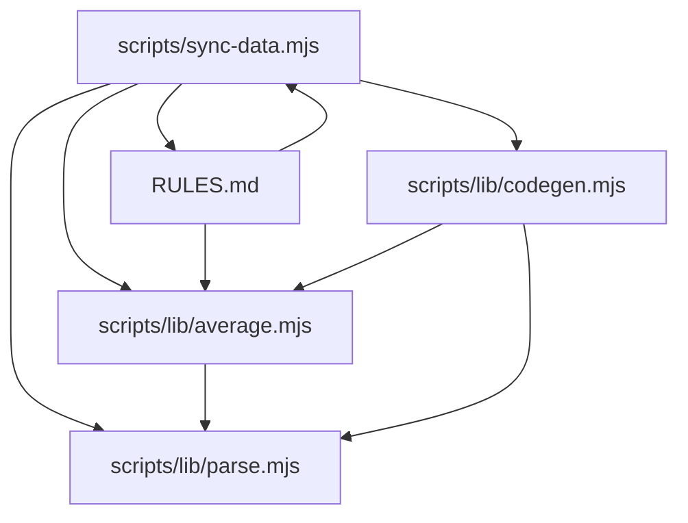

**Diagram sources**
- [sync-data.mjs:36-75](file://scripts/sync-data.mjs#L36-L75)
- [average.mjs:10](file://scripts/lib/average.mjs#L10)
- [parse.mjs:8-45](file://scripts/lib/parse.mjs#L8-L45)
- [RULES.md:46-63](file://RULES.md#L46-L63)

**Section sources**
- [sync-data.mjs:1-30](file://scripts/sync-data.mjs#L1-L30)
- [parse.mjs:1-7](file://scripts/lib/parse.mjs#L1-L7)
- [average.mjs:1-10](file://scripts/lib/average.mjs#L1-L10)
- [RULES.md:1-6](file://RULES.md#L1-L6)

## Core Components
The engine is built around five core responsibilities:

| Component | Purpose | Primary Implementation |
|---|---|---|
| Score parsing | Extracts seven normalized 1–100 scores from a findings file | [parseScoresPure:52-60](file://scripts/lib/parse.mjs#L52-L60) |
| Overall drift correction | Recomputes Overall as the half-up mean of five quality dims and rewrites drifted values | [overallDrift:74-78](file://scripts/lib/parse.mjs#L74-L78), [applyOverallFix:84-87](file://scripts/lib/parse.mjs#L84-L87) |
| Rater gate | Filters out raters whose own model’s committed average Overall does not exceed the gate | [partitionEligible:105-117](file://scripts/lib/parse.mjs#L105-L117) |
| Top-10 cohort selection | Selects up to ten highest-Overall sources from the eligible set | [rankTop10:95-97](file://scripts/lib/parse.mjs#L95-L97) |
| Average computation | Computes arithmetic means per label over the cohort with half-up rounding | [meanOf:90-92](file://scripts/lib/parse.mjs#L90-L92), [buildAverageEntry:34-44](file://scripts/lib/average.mjs#L34-L44) |

Key constants:

| Constant | Value / Meaning | Location |
|---|---|---|
| `LABELS` | Canonical order of seven labels | [parse.mjs:9-17](file://scripts/lib/parse.mjs#L9-L17) |
| `QUALITY_DIMS` | Five dimensions that feed Overall; Cost efficiency is excluded | [parse.mjs:30-31](file://scripts/lib/parse.mjs#L30-L31) |
| `RATER_GATE` | 84.9; strict greater-than qualification | [parse.mjs:38-39](file://scripts/lib/parse.mjs#L38-L39) |
| `OVERALL_TOLERANCE` | 0.51; drift tolerance for auto-correction | [parse.mjs:41-42](file://scripts/lib/parse.mjs#L41-L42) |
| `halfUp1` | Rounds to one decimal using standard half-up semantics | [parse.mjs:44-45](file://scripts/lib/parse.mjs#L44-L45) |

**Section sources**
- [parse.mjs:8-45](file://scripts/lib/parse.mjs#L8-L45)
- [parse.mjs:52-92](file://scripts/lib/parse.mjs#L52-L92)
- [average.mjs:33-44](file://scripts/lib/average.mjs#L33-L44)

## Architecture Overview
The full data flow runs inside `pnpm sync`:

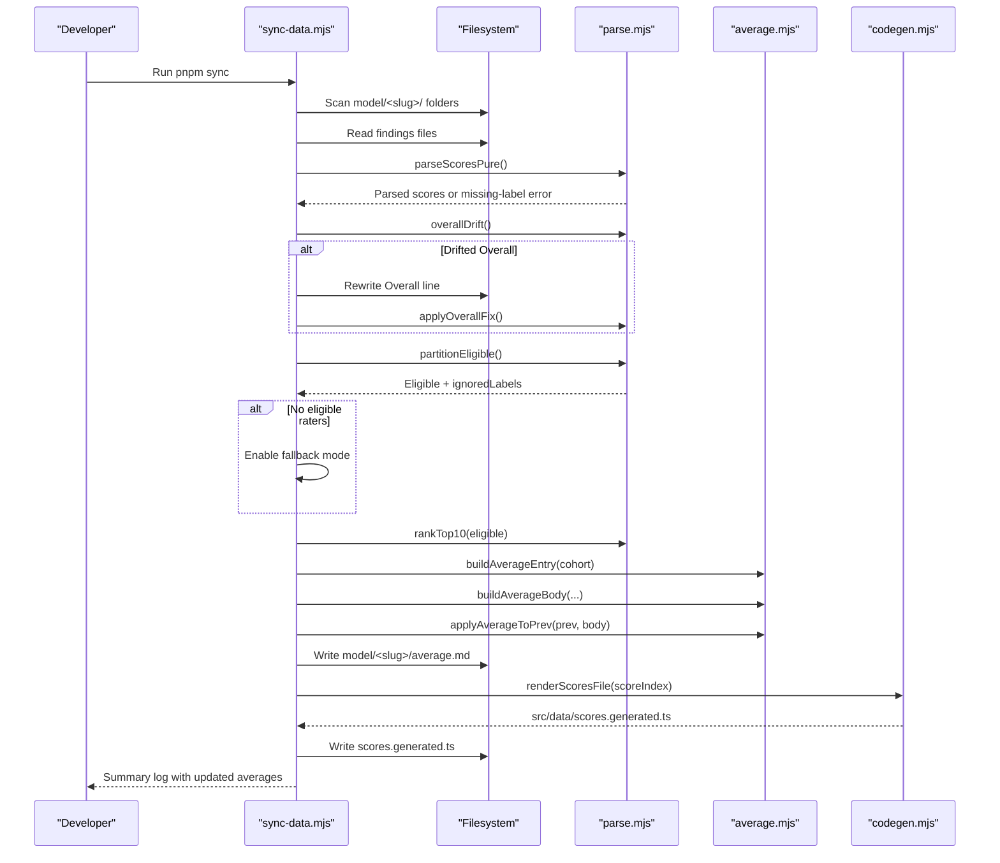

**Diagram sources**
- [sync-data.mjs:119-126](file://scripts/sync-data.mjs#L119-L126)
- [sync-data.mjs:347-370](file://scripts/sync-data.mjs#L347-L370)
- [sync-data.mjs:372-398](file://scripts/sync-data.mjs#L372-L398)
- [sync-data.mjs:405-435](file://scripts/sync-data.mjs#L405-L435)
- [sync-data.mjs:602-622](file://scripts/sync-data.mjs#L602-L622)
- [parse.mjs:52-97](file://scripts/lib/parse.mjs#L52-L97)
- [average.mjs:33-100](file://scripts/lib/average.mjs#L33-L100)

## Detailed Component Analysis

### Source File Parsing and Overall Correction
Each findings file must contain exactly seven normalized score lines. The parser validates their presence and extracts numeric values. If a source file’s Overall differs from the half-up mean of its five quality dimensions beyond the tolerance, the sync script automatically rewrites the Overall line rather than failing the whole folder.

Important behaviors:

- Missing score-line labels fail loudly.
- Only the Overall number is rewritten; other content is preserved.
- Auto-corrected Overalls are logged as `AUTO`.
- Unparsable score lines block average recomputation for that folder.

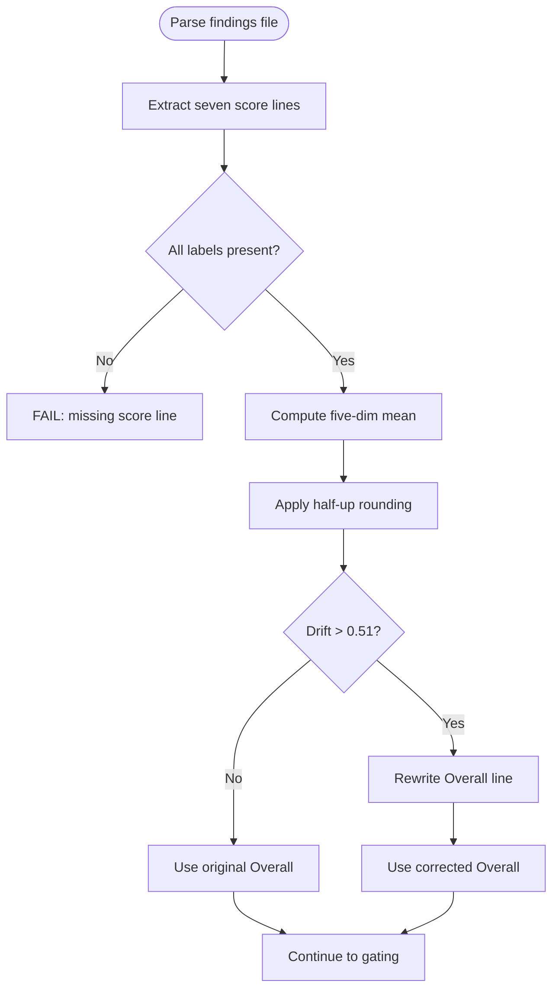

**Diagram sources**
- [parse.mjs:52-60](file://scripts/lib/parse.mjs#L52-L60)
- [parse.mjs:74-87](file://scripts/lib/parse.mjs#L74-L87)
- [sync-data.mjs:347-370](file://scripts/sync-data.mjs#L347-L370)

**Section sources**
- [parse.mjs:48-87](file://scripts/lib/parse.mjs#L48-L87)
- [sync-data.mjs:328-370](file://scripts/sync-data.mjs#L328-L370)

### Rater Gate Mechanism
The rater gate ensures that only high-quality sources contribute to another model’s average. A rater qualifies only if its own model’s committed average Overall is strictly greater than 84.9.

Key rules:

- Qualification uses strict greater-than: exactly 84.9 does not qualify.
- The gate reads each rating model’s on-disk `average.md`, so the gate is deterministic within a run.
- Models without a usable `average.md` never qualify as raters.
- Below-gate raters are still displayed on the site; they are only filtered from `average.md` computation.
- Ignored below-gate raters are listed in the Agreement notes.

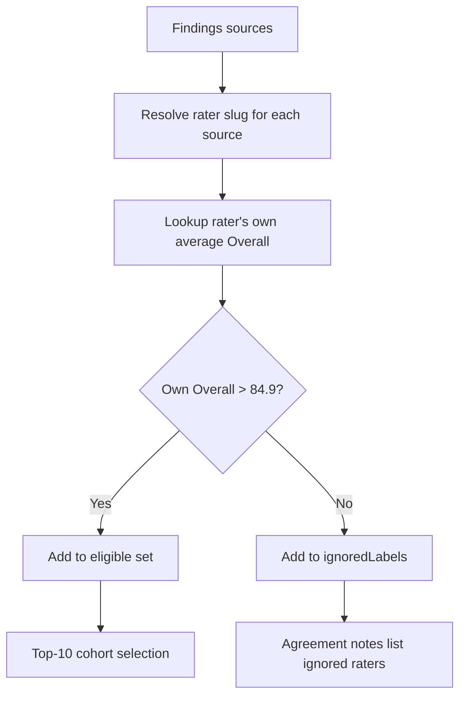

**Diagram sources**
- [parse.mjs:99-117](file://scripts/lib/parse.mjs#L99-L117)
- [sync-data.mjs:211-226](file://scripts/sync-data.mjs#L211-L226)
- [sync-data.mjs:246-257](file://scripts/sync-data.mjs#L246-L257)
- [sync-data.mjs:372-398](file://scripts/sync-data.mjs#L372-L398)

**Section sources**
- [parse.mjs:38-39](file://scripts/lib/parse.mjs#L38-L39)
- [parse.mjs:99-117](file://scripts/lib/parse.mjs#L99-L117)
- [sync-data.mjs:211-226](file://scripts/sync-data.mjs#L211-L226)
- [sync-data.mjs:372-398](file://scripts/sync-data.mjs#L372-L398)
- [RULES.md:22-36](file://RULES.md#L22-L36)

### Top-10 Cohort Selection Algorithm
After eligibility filtering, the engine selects the top-10 cohort by descending Overall Score. If fewer than ten eligible sources exist, all of them are used.

Algorithm properties:

- Sorting is by Overall Score descending.
- Truncation is capped at ten.
- The cohort is the same set used for every averaged dimension, including Overall.
- Overall is computed as the mean of the cohort’s Overall scores, not re-derived from averaged dimensions.

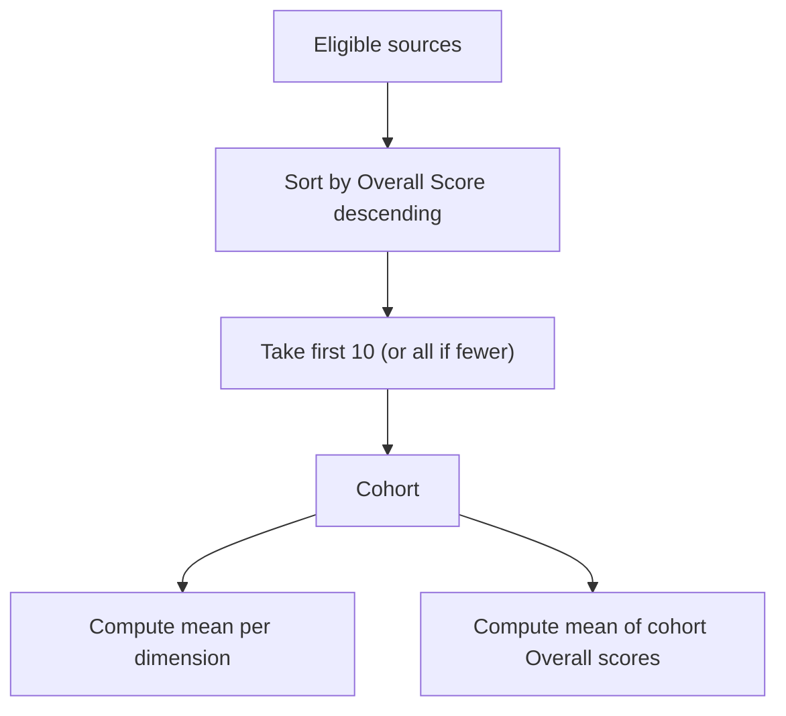

**Diagram sources**
- [parse.mjs:94-97](file://scripts/lib/parse.mjs#L94-L97)
- [average.mjs:3-8](file://scripts/lib/average.mjs#L3-L8)
- [average.mjs:33-51](file://scripts/lib/average.mjs#L33-L51)
- [sync-data.mjs:389-394](file://scripts/sync-data.mjs#L389-L394)

**Section sources**
- [parse.mjs:94-97](file://scripts/lib/parse.mjs#L94-L97)
- [average.mjs:3-8](file://scripts/lib/average.mjs#L3-L8)
- [sync-data.mjs:389-394](file://scripts/sync-data.mjs#L389-L394)

### Arithmetic Mean Computation and Half-Up Rounding
Every averaged value is an arithmetic mean over the selected cohort, rounded to one decimal place using standard half-up rounding.

Mathematical definitions:

- For a cohort \(C\) and label \(L\):
  \[
  \text{Mean}(L) = \frac{1}{|C|} \sum_{p \in C} p.\text{scores}[L]
  \]
- Rounded result:
  \[
  \text{Result}(L) = \text{round}_{0.1}\left(\text{Mean}(L)\right)
  \]
  where \(\text{round}_{0.1}(x) = \text{half-up-to-one-decimal}(x)\).

Implementation details:

- `halfUp1(x)` multiplies by 10, rounds, then divides by 10.
- `meanOf(cohort, label)` computes the cohort mean and applies `halfUp1`.
- Each dimension, including Cost efficiency, is independently averaged.
- Overall is averaged from the cohort’s Overall scores, not recomputed from averaged dimensions.

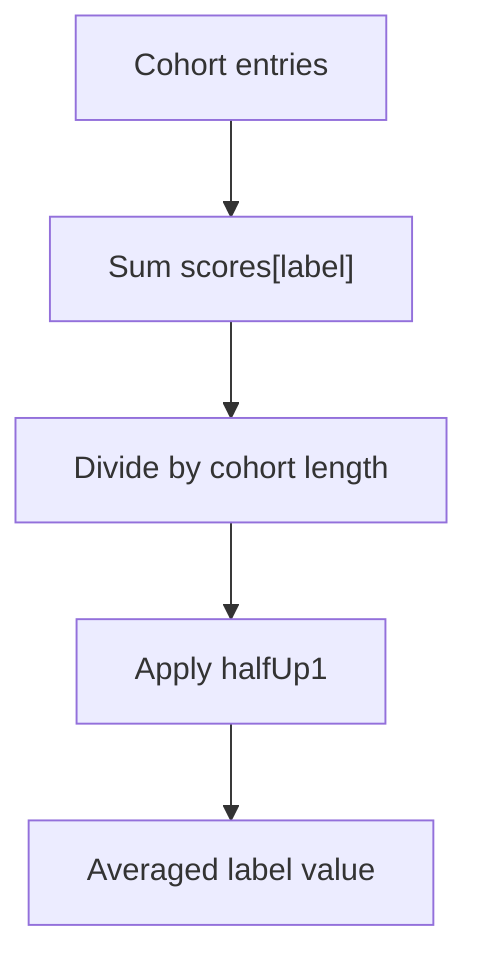

**Diagram sources**
- [parse.mjs:44-45](file://scripts/lib/parse.mjs#L44-L45)
- [parse.mjs:89-92](file://scripts/lib/parse.mjs#L89-L92)
- [average.mjs:33-51](file://scripts/lib/average.mjs#L33-L51)

**Section sources**
- [parse.mjs:44-45](file://scripts/lib/parse.mjs#L44-L45)
- [parse.mjs:89-92](file://scripts/lib/parse.mjs#L89-L92)
- [average.mjs:33-51](file://scripts/lib/average.mjs#L33-L51)

### Fallback Behavior When No Raters Clear the Quality Gate
If no eligible raters exist, the engine applies the crown rule: every model folder gets an average. In fallback mode:

- All available reports become eligible.
- The top-10 cap still applies.
- The generated `average.md` is labeled as a below-gate fallback.
- The mix note explains that no rater cleared the gate.
- The Agreement notes list the below-gate sources used.

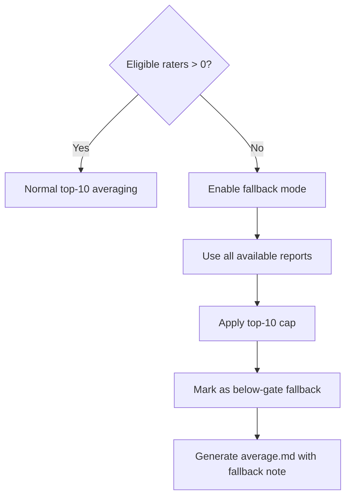

**Diagram sources**
- [sync-data.mjs:378-386](file://scripts/sync-data.mjs#L378-L386)
- [average.mjs:17-31](file://scripts/lib/average.mjs#L17-L31)
- [average.mjs:58-81](file://scripts/lib/average.mjs#L58-L81)
- [RULES.md:52-59](file://RULES.md#L52-L59)

**Section sources**
- [sync-data.mjs:378-386](file://scripts/sync-data.mjs#L378-L386)
- [average.mjs:17-31](file://scripts/lib/average.mjs#L17-L31)
- [average.mjs:58-81](file://scripts/lib/average.mjs#L58-L81)
- [RULES.md:52-59](file://RULES.md#L52-L59)

### Partitioning of Eligible vs Ignored Sources
The engine partitions findings into two groups:

| Group | Meaning | Where it appears |
|---|---|---|
| Eligible | Sources written by raters whose own model clears the gate | Used for cohort selection and averaging |
| Ignored | Below-gate raters | Listed in Agreement notes when not in fallback mode |

Label ordering:

- Eligible source labels are sorted case-insensitively A-Z for the Agreement notes.
- Top-cohort labels are also sorted case-insensitively A-Z.
- Excluded bottom labels are derived by removing top-cohort labels from the eligible label set.

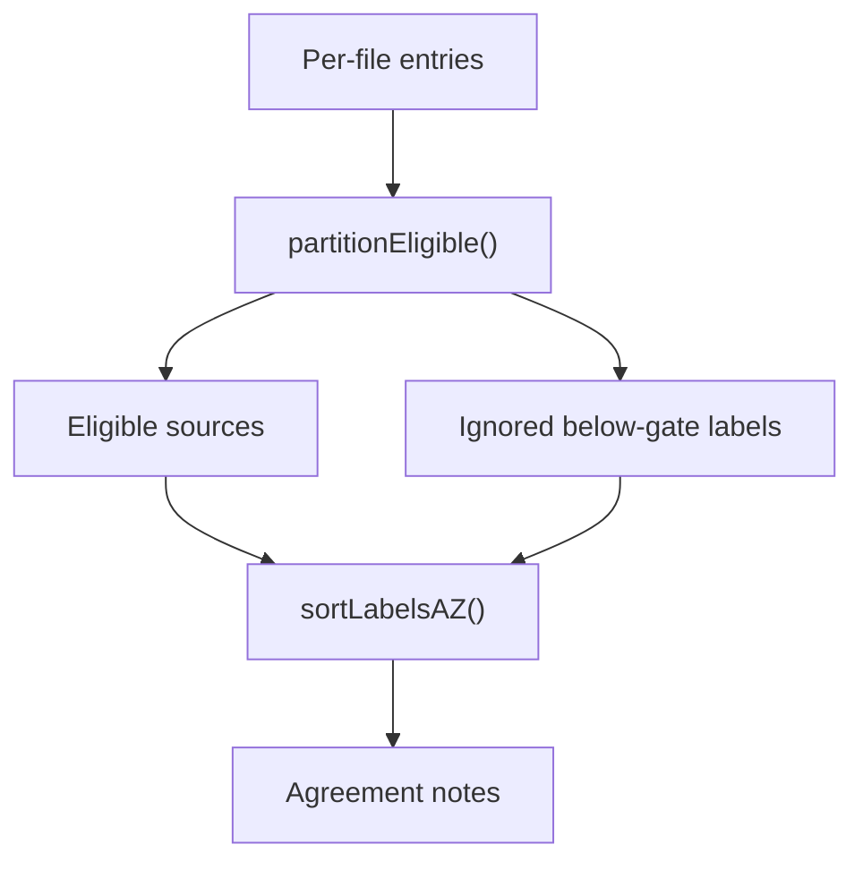

**Diagram sources**
- [parse.mjs:99-123](file://scripts/lib/parse.mjs#L99-L123)
- [sync-data.mjs:372-398](file://scripts/sync-data.mjs#L372-L398)
- [average.mjs:58-81](file://scripts/lib/average.mjs#L58-L81)

**Section sources**
- [parse.mjs:99-123](file://scripts/lib/parse.mjs#L99-L123)
- [sync-data.mjs:372-398](file://scripts/sync-data.mjs#L372-L398)

### Generation and Update of `average.md`
The `average.md` file has two main sections:

1. **Averaged scores**: Seven score lines in canonical label order, ending with Overall Score.
2. **Agreement notes**: Human-readable explanation of which sources counted, whether fallback was used, which sources formed the top cohort, and which were excluded or ignored.

Generation steps:

1. Build the cohort from eligible sources.
2. Compute the short-keyed average entry for client codegen.
3. Build the seven score lines with a mix note describing the cohort.
4. Assemble the full body with Averaged scores and Agreement notes.
5. Merge into the previous file: new files get a header; existing files replace only the tail after `## Averaged scores`.
6. Write only when the content changes and there are no sync failures.

```mermaid
flowchart TD
Cohort["Cohort"] --> Entry["buildAverageEntry()"]
Cohort --> Lines["buildAverageLines()"]
Entry --> Index["scoreIndex[slug][\"average.md\"]"]
Lines --> Body["buildAverageBody()"]
Body --> Merge["applyAverageToPrev()"]
Merge --> Write{"Changed and no failures?"}
Write --> |Yes| Save["Write average.md"]
Write --> |No| Skip["Keep existing file"]
```

**Diagram sources**
- [average.mjs:33-100](file://scripts/lib/average.mjs#L33-L100)
- [sync-data.mjs:405-435](file://scripts/sync-data.mjs#L405-L435)

**Section sources**
- [average.mjs:33-100](file://scripts/lib/average.mjs#L33-L100)
- [sync-data.mjs:405-435](file://scripts/sync-data.mjs#L405-L435)
- [.agents/rules.md:31-36](file://.agents/rules.md#L31-L36)

### Emission of Recalculated Scores into `src/data/scores.generated.ts`
The complete refresh of the model leaderboard is driven by the sync script rebuilding `src/data/scores.generated.ts` with recalculated average scores across all model families. The process works as follows:

- Every parseable findings file contributes a short-keyed score object to `scoreIndex[slug][filename]`.
- The folder’s own recomputed average is stored under the key `"average.md"` inside the same slug map.
- Keys are sorted deterministically before emission.
- `renderScoresFile` serializes the entire index into TypeScript.
- The generated file contains only numeric scores, keeping model report prose out of the client bundle.
- The file is written only when there are zero sync failures, ensuring invalid data is never cemented.

Frontend components such as `Methodology.tsx` describe the methodology but do not read raw markdown; they consume the pre-parsed numbers produced by this pipeline.

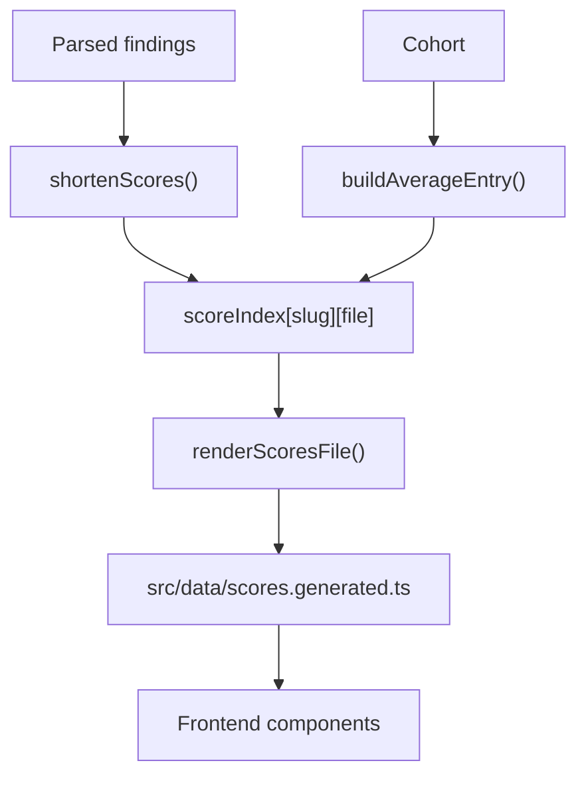

**Diagram sources**
- [sync-data.mjs:443-445](file://scripts/sync-data.mjs#L443-L445)
- [sync-data.mjs:505](file://scripts/sync-data.mjs#L505)
- [sync-data.mjs:602-622](file://scripts/sync-data.mjs#L602-L622)
- [parse.mjs:62-67](file://scripts/lib/parse.mjs#L62-L67)
- [average.mjs:33-44](file://scripts/lib/average.mjs#L33-L44)
- [Methodology.tsx:14-26](file://src/components/Methodology.tsx#L14-L26)

**Section sources**
- [sync-data.mjs:443-445](file://scripts/sync-data.mjs#L443-L445)
- [sync-data.mjs:505](file://scripts/sync-data.mjs#L505)
- [sync-data.mjs:602-622](file://scripts/sync-data.mjs#L602-L622)
- [parse.mjs:62-67](file://scripts/lib/parse.mjs#L62-L67)
- [average.mjs:33-44](file://scripts/lib/average.mjs#L33-L44)
- [Methodology.tsx:14-26](file://src/components/Methodology.tsx#L14-L26)

### Examples of Cohort Ranking, Label Sorting, and Aggregation

#### Example Scenario
Assume a model folder contains eight findings files. After parsing and Overall correction:

| Source | Tool use | Reasoning | Context window | Multimodal | Coding | Cost efficiency | Overall Score |
|---|---:|---:|---:|---:|---:|---:|---:|
| Alpha | 80 | 82 | 78 | 81 | 79 | 90 | 81 |
| Beta | 85 | 84 | 80 | 83 | 82 | 88 | 84 |
| Gamma | 70 | 72 | 68 | 71 | 70 | 75 | 70 |
| Delta | 90 | 88 | 85 | 87 | 86 | 92 | 87 |
| Epsilon | 75 | 76 | 74 | 75 | 74 | 80 | 75 |
| Zeta | 82 | 80 | 81 | 83 | 81 | 85 | 82 |
| Eta | 60 | 62 | 58 | 61 | 60 | 65 | 60 |
| Theta | 88 | 86 | 84 | 85 | 84 | 90 | 85 |

Suppose only Beta, Delta, and Zeta have their own model’s average Overall above 84.9. They form the eligible set.

Top-10 cohort selection:

1. Sort eligible sources by Overall Score descending: Delta (87), Zeta (82), Beta (84).
2. Take up to ten: cohort is Delta, Beta, Zeta.
3. Since there are only three eligible sources, no trimming occurs.

Arithmetic means over the cohort:

- Tool use: \((90 + 80 + 85) / 3 = 85.0\)
- Reasoning: \((88 + 82 + 84) / 3 = 84.67 \rightarrow 84.7\)
- Context window: \((85 + 78 + 80) / 3 = 81.0\)
- Multimodal: \((87 + 81 + 83) / 3 = 83.67 \rightarrow 83.7\)
- Coding: \((86 + 79 + 82) / 3 = 82.33 \rightarrow 82.3\)
- Cost efficiency: \((92 + 90 + 88) / 3 = 90.0\)
- Overall Score: \((87 + 81 + 84) / 3 = 84.0\)

Label sorting in Agreement notes:

- Eligible labels sorted case-insensitively: Beta, Delta, Zeta.
- Top-cohort labels sorted case-insensitively: Beta, Delta, Zeta.
- Excluded bottom labels: empty.
- Ignored below-gate raters: Alpha, Epsilon, Eta, Gamma, Theta.

Fallback example:

If no rater clears 84.9, all eight sources become eligible, but only the top ten are considered. Since there are only eight sources, all are included. The output is labeled as a below-gate fallback, and the Agreement notes explain that every report contributed because no rater qualified.

Real-world reference:

- `model/claude-opus-5/average.md` shows a normal gated average based on 17 qualifying reporting sources, with a top-10 cohort and seven excluded bottom sources.
- `model/gpt-6-astra/average.md` similarly reflects 17 qualifying raters, a different top-10 cohort, and a distinct set of excluded and ignored sources.

**Section sources**
- [parse.mjs:94-97](file://scripts/lib/parse.mjs#L94-L97)
- [parse.mjs:89-92](file://scripts/lib/parse.mjs#L89-L92)
- [parse.mjs:119-123](file://scripts/lib/parse.mjs#L119-L123)
- [average.mjs:17-31](file://scripts/lib/average.mjs#L17-L31)
- [average.mjs:58-81](file://scripts/lib/average.mjs#L58-L81)
- [sync-data.mjs:372-435](file://scripts/sync-data.mjs#L372-L435)
- [model/claude-opus-5/average.md:8-23](file://model/claude-opus-5/average.md#L8-L23)
- [model/gpt-6-astra/average.md:8-23](file://model/gpt-6-astra/average.md#L8-L23)

### Deterministic Nature of Calculations
The engine is designed to produce byte-identical results across environments:

- Library functions are side-effect free: no filesystem access, no console output, no process exit.
- Sorting is explicit:
  - Cohort selection sorts by Overall Score descending.
  - Labels are sorted case-insensitively A-Z.
- Constants are centralized:
  - `RATER_GATE`, `OVERALL_TOLERANCE`, `LABELS`, `QUALITY_DIMS`, and `halfUp1` live in `parse.mjs`.
- Sync logs are informational; actual computation is isolated in pure modules.
- Generated outputs are only written when changed and when there are no failures.
- The frontend consumes pre-parsed numbers from `src/data/scores.generated.ts`, not raw markdown.

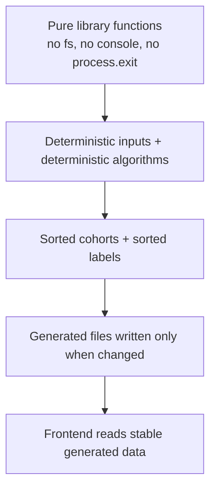

**Diagram sources**
- [parse.mjs:1-7](file://scripts/lib/parse.mjs#L1-L7)
- [parse.mjs:38-45](file://scripts/lib/parse.mjs#L38-L45)
- [parse.mjs:94-123](file://scripts/lib/parse.mjs#L94-L123)
- [sync-data.mjs:490-523](file://scripts/sync-data.mjs#L490-L523)

**Section sources**
- [parse.mjs:1-7](file://scripts/lib/parse.mjs#L1-L7)
- [parse.mjs:38-45](file://scripts/lib/parse.mjs#L38-L45)
- [parse.mjs:94-123](file://scripts/lib/parse.mjs#L94-L123)
- [sync-data.mjs:490-523](file://scripts/sync-data.mjs#L490-L523)

## Dependency Analysis
The following diagram shows how the components depend on each other:

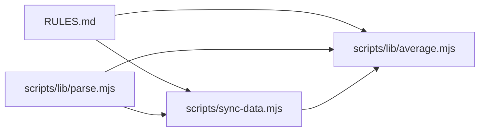

**Diagram sources**
- [RULES.md:46-63](file://RULES.md#L46-L63)
- [parse.mjs:8-45](file://scripts/lib/parse.mjs#L8-L45)
- [average.mjs:10](file://scripts/lib/average.mjs#L10)
- [sync-data.mjs:36-58](file://scripts/sync-data.mjs#L36-L58)

Coupling and cohesion observations:

- `parse.mjs` is the foundational layer: it defines constants, parsing, rounding, ranking, and partitioning.
- `average.mjs` depends only on `parse.mjs` and focuses on document assembly.
- `sync-data.mjs` orchestrates filesystem I/O, validation, quarantine, registry updates, and output generation.
- Rules are declarative and consumed by both sync logic and documentation contracts.

Potential risks:

- Changing `RATER_GATE` affects both sync behavior and UI captions.
- Changing `LABELS` affects parsing, generated types, and rendered score order.
- Changing `halfUp1` affects every averaged value.
- Changing `rankTop10` affects cohort composition and therefore every average.

**Section sources**
- [parse.mjs:8-45](file://scripts/lib/parse.mjs#L8-L45)
- [average.mjs:10](file://scripts/lib/average.mjs#L10)
- [sync-data.mjs:36-58](file://scripts/sync-data.mjs#L36-L58)
- [RULES.md:46-63](file://RULES.md#L46-L63)

## Performance Considerations
The design favors predictable performance and maintainability over micro-optimization:

- Cohort selection is \(O(n \log n)\) due to sorting, followed by \(O(10)\) slicing.
- Mean computation is \(O(n)\) per label.
- With typical model folders containing a small number of findings files, these costs are negligible.
- The expensive part is filesystem I/O and git integration, not arithmetic.
- Client-side bundle size is reduced by emitting only numeric scores into generated TypeScript, avoiding inlining full markdown prose.

[No sources needed since this section provides general guidance]

## Troubleshooting Guide

| Symptom | Likely Cause | Resolution |
|---|---|---|
| `average.md` is not rewritten | Validation failure, unparsable scores, or unchanged content | Check FAIL lines, fix missing score lines, rerun sync |
| Overall drift warning | Source Overall does not match five-dim mean beyond tolerance | Allow auto-correction or manually correct the Overall line |
| A high-scoring model does not count toward another average | Its own model’s average Overall is ≤ 84.9 | Improve the rater model’s average until it clears the gate |
| Fallback average appears | No rater cleared the gate | Add qualifying raters or accept the below-gate fallback |
| Ignored raters appear in Agreement notes | Their own model’s average did not clear the gate | Review rater model’s average and gate threshold |
| Generated scores are stale | Sync failed before writing `scores.generated.ts` | Fix failures and rerun `pnpm sync` |

Relevant checks:

- Missing score-line labels cause parse failures.
- Unparsable files skip average rewriting.
- `scores.generated.ts` is only rewritten when there are zero failures.
- Quarantined evidence-free files are renamed to `.md.excluded` and excluded from averaging.

**Section sources**
- [sync-data.mjs:119-126](file://scripts/sync-data.mjs#L119-L126)
- [sync-data.mjs:266-286](file://scripts/sync-data.mjs#L266-L286)
- [sync-data.mjs:328-370](file://scripts/sync-data.mjs#L328-L370)
- [sync-data.mjs:490-523](file://scripts/sync-data.mjs#L490-L523)

## Conclusion
The score calculation and averaging engine is a deterministic, rule-driven pipeline:

- Source findings are parsed and validated.
- Overall drift is corrected against the five quality dimensions.
- The rater gate filters raters whose own model’s average Overall exceeds 84.9.
- The top-10 cohort is selected from eligible sources by descending Overall Score.
- Arithmetic means are computed per label with half-up rounding to one decimal.
- Fallback behavior guarantees every model folder receives an average when no raters qualify.
- `average.md` is generated with transparent Agreement notes explaining eligible, top-cohort, excluded, and ignored sources.
- Recalculated average scores are emitted into `src/data/scores.generated.ts`, providing a stable, numeric-only dataset for the frontend.
- The system remains consistent across environments through pure functions, explicit sorting, centralized constants, and generated numeric outputs.