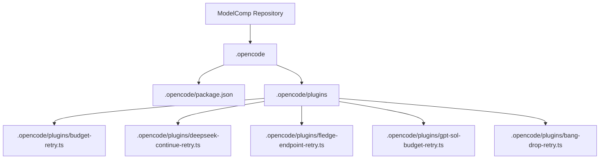
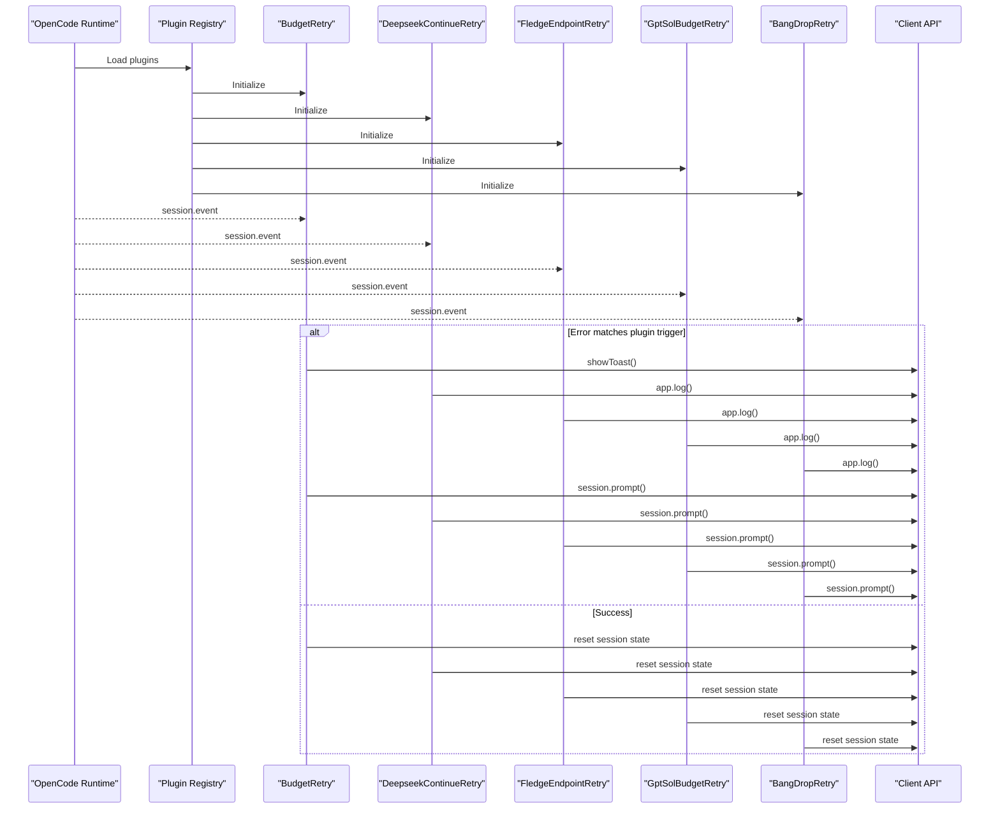
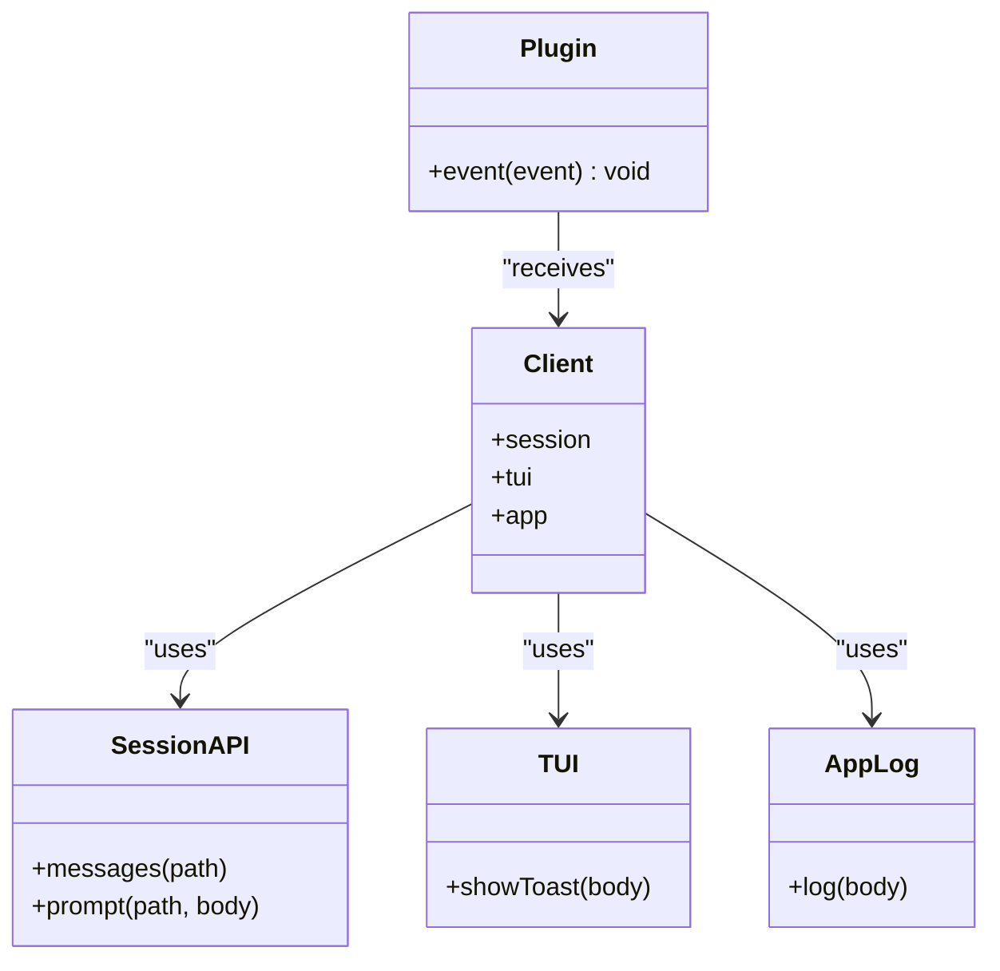
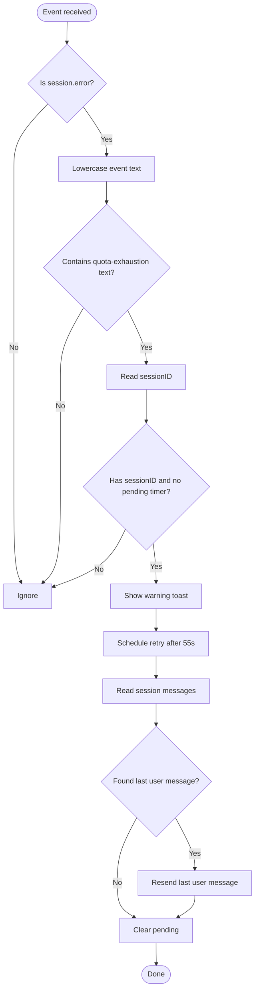
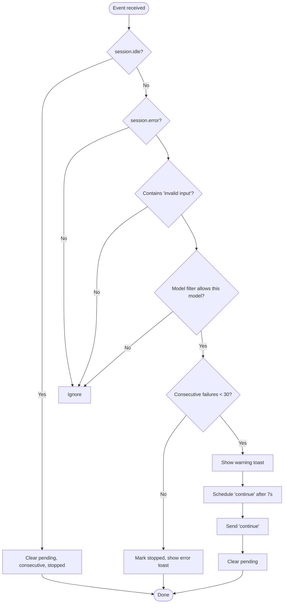
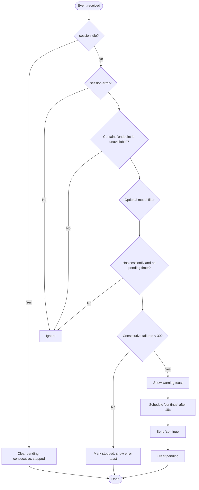
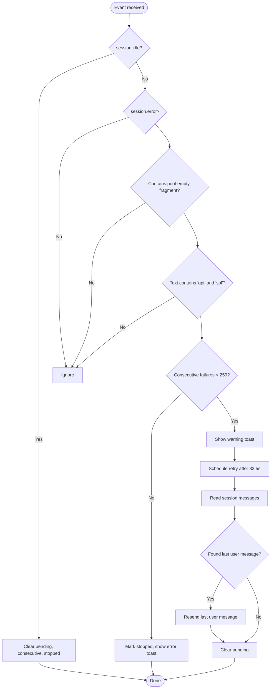
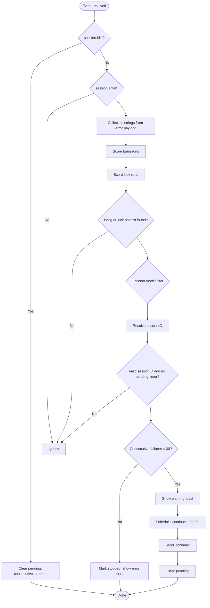
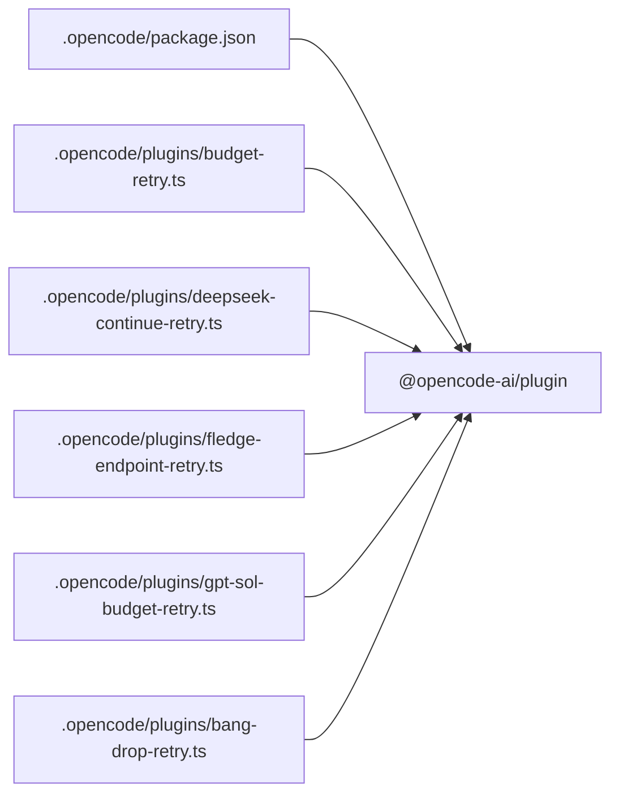

# OpenCode Plugin Ecosystem

<cite>
**Referenced Files in This Document**
- [README.md](file://README.md)
- [.opencode/package.json](file://.opencode/package.json)
- [.opencode/plugins/budget-retry.ts](file://.opencode/plugins/budget-retry.ts)
- [.opencode/plugins/deepseek-continue-retry.ts](file://.opencode/plugins/deepseek-continue-retry.ts)
- [.opencode/plugins/fledge-endpoint-retry.ts](file://.opencode/plugins/fledge-endpoint-retry.ts)
- [.opencode/plugins/gpt-sol-budget-retry.ts](file://.opencode/plugins/gpt-sol-budget-retry.ts)
- [.opencode/plugins/bang-drop-retry.ts](file://.opencode/plugins/bang-drop-retry.ts)
</cite>

## Table of Contents
1. [Introduction](#introduction)
2. [Project Structure](#project-structure)
3. [Core Components](#core-components)
4. [Architecture Overview](#architecture-overview)
5. [Detailed Component Analysis](#detailed-component-analysis)
6. [Dependency Analysis](#dependency-analysis)
7. [Performance Considerations](#performance-considerations)
8. [Troubleshooting Guide](#troubleshooting-guide)
9. [Conclusion](#conclusion)

## Introduction
This document describes the OpenCode plugin ecosystem installed under `.opencode/` in the ModelComp repository. The project is a static Qwik site that compares AI coding models, but it also ships a small runtime extension layer for OpenCode Desktop: five TypeScript plugins that intercept session events and automatically recover from provider-specific failures such as quota exhaustion, invalid payloads, endpoint outages, pool unavailability, and malformed connection drops.

The plugins are not part of the build output; they are loaded at runtime by OpenCode using `@opencode-ai/plugin`. Each plugin exports a single function that returns an event hook. When OpenCode emits session events, the plugins inspect errors, show user-facing toasts, log diagnostics, and optionally resend prompts or send a short “continue” message to resume broken tasks without changing the active model.

## Project Structure
The OpenCode-related code lives under `.opencode/`:

- `.opencode/package.json` declares the OpenCode plugin dependency.
- `.opencode/plugins/` contains one plugin per failure mode.
- The rest of the repository is unrelated to the OpenCode runtime: it is the ModelComp website, its model research data, Qwik routes, components, and sync scripts.

**Diagram sources**
- [.opencode/package.json:1-6](file://.opencode/package.json#L1-L6)
- [.opencode/plugins/budget-retry.ts:1-86](file://.opencode/plugins/budget-retry.ts#L1-L86)
- [.opencode/plugins/deepseek-continue-retry.ts:1-183](file://.opencode/plugins/deepseek-continue-retry.ts#L1-L183)
- [.opencode/plugins/fledge-endpoint-retry.ts:1-171](file://.opencode/plugins/fledge-endpoint-retry.ts#L1-L171)
- [.opencode/plugins/gpt-sol-budget-retry.ts:1-170](file://.opencode/plugins/gpt-sol-budget-retry.ts#L1-L170)
- [.opencode/plugins/bang-drop-retry.ts:1-324](file://.opencode/plugins/bang-drop-retry.ts#L1-L324)

**Section sources**
- [.opencode/package.json:1-6](file://.opencode/package.json#L1-L6)
- [README.md:1-126](file://README.md#L1-L126)

## Core Components
Each plugin follows the same high-level pattern:

1. Export a function typed as `Plugin`.
2. Receive an OpenCode `client` object.
3. Return an object with an `event` handler.
4. Listen for `session.idle` (success) and `session.error` (failure).
5. Match error text against a stable substring.
6. Optionally filter by model name.
7. Track per-session state to avoid duplicate retries.
8. Show a toast through `client.tui.showToast`.
9. Log diagnostic breadcrumbs through `client.app.log`.
10. Resend either the last user message or a short “continue” prompt after a delay.

| Plugin | Failure Pattern | Recovery Strategy | Delay | Retry Payload | Consecutive Limit |
|---|---|---|---:|---|---:|
| `budget-retry.ts` | Quota or budget pool exhausted | Resend last user message | 55 seconds | Last user message parts | No explicit consecutive counter |
| `deepseek-continue-retry.ts` | Provider rejects payload (“Invalid input”) | Send “continue” | 7 seconds | Short “continue” text | 30 |
| `fledge-endpoint-retry.ts` | Endpoint unavailable | Send “continue” | 10 seconds | Short “continue” text | 30 |
| `gpt-sol-budget-retry.ts` | GPT Sol channel/pool empty | Resend last user message | 83.5 seconds | Last user message parts | 259 |
| `bang-drop-retry.ts` | Bang-only or lock-only storm messages | Send “continue” | 8 seconds | Short “continue” text | 30 |

**Section sources**
- [.opencode/plugins/budget-retry.ts:1-86](file://.opencode/plugins/budget-retry.ts#L1-L86)
- [.opencode/plugins/deepseek-continue-retry.ts:1-183](file://.opencode/plugins/deepseek-continue-retry.ts#L1-L183)
- [.opencode/plugins/fledge-endpoint-retry.ts:1-171](file://.opencode/plugins/fledge-endpoint-retry.ts#L1-L171)
- [.opencode/plugins/gpt-sol-budget-retry.ts:1-170](file://.opencode/plugins/gpt-sol-budget-retry.ts#L1-L170)
- [.opencode/plugins/bang-drop-retry.ts:1-324](file://.opencode/plugins/bang-drop-retry.ts#L1-L324)

## Architecture Overview
At runtime, OpenCode loads each plugin once and invokes its exported function. The returned `event` callback receives every session event. The plugins do not modify the UI directly beyond toasts and logs; their main effect is resuming stalled sessions.

**Diagram sources**
- [.opencode/plugins/budget-retry.ts:18-86](file://.opencode/plugins/budget-retry.ts#L18-L86)
- [.opencode/plugins/deepseek-continue-retry.ts:49-183](file://.opencode/plugins/deepseek-continue-retry.ts#L49-L183)
- [.opencode/plugins/fledge-endpoint-retry.ts:51-171](file://.opencode/plugins/fledge-endpoint-retry.ts#L51-L171)
- [.opencode/plugins/gpt-sol-budget-retry.ts:46-170](file://.opencode/plugins/gpt-sol-budget-retry.ts#L46-L170)
- [.opencode/plugins/bang-drop-retry.ts:156-324](file://.opencode/plugins/bang-drop-retry.ts#L156-L324)

## Detailed Component Analysis

### Shared Plugin Contract
Every plugin imports the `Plugin` type from `@opencode-ai/plugin` and exports a named async function. The function receives an object containing `client`, which provides access to:

- `client.session.messages`: read session history.
- `client.session.prompt`: send a new prompt into a session.
- `client.tui.showToast`: show a desktop notification.
- `client.app.log`: write structured logs.

All plugins use a module-scoped `pending` set to prevent multiple timers for the same session. Several plugins also track:

- `consecutive`: a map from session ID to failure count.
- `stopped`: a set of sessions where the emergency brake has tripped.

**Diagram sources**
- [.opencode/plugins/budget-retry.ts:1-86](file://.opencode/plugins/budget-retry.ts#L1-L86)
- [.opencode/plugins/deepseek-continue-retry.ts:1-183](file://.opencode/plugins/deepseek-continue-retry.ts#L1-L183)
- [.opencode/plugins/fledge-endpoint-retry.ts:1-171](file://.opencode/plugins/fledge-endpoint-retry.ts#L1-L171)
- [.opencode/plugins/gpt-sol-budget-retry.ts:1-170](file://.opencode/plugins/gpt-sol-budget-retry.ts#L1-L170)
- [.opencode/plugins/bang-drop-retry.ts:1-324](file://.opencode/plugins/bang-drop-retry.ts#L1-L324)

**Section sources**
- [.opencode/package.json:1-6](file://.opencode/package.json#L1-L6)
- [.opencode/plugins/budget-retry.ts:1-86](file://.opencode/plugins/budget-retry.ts#L1-L86)
- [.opencode/plugins/deepseek-continue-retry.ts:1-183](file://.opencode/plugins/deepseek-continue-retry.ts#L1-L183)
- [.opencode/plugins/fledge-endpoint-retry.ts:1-171](file://.opencode/plugins/fledge-endpoint-retry.ts#L1-L171)
- [.opencode/plugins/gpt-sol-budget-retry.ts:1-170](file://.opencode/plugins/gpt-sol-budget-retry.ts#L1-L170)
- [.opencode/plugins/bang-drop-retry.ts:1-324](file://.opencode/plugins/bang-drop-retry.ts#L1-L324)

### Budget Pool Exhaustion Handler
`budget-retry.ts` targets the exact error fragment indicating that a budget pool or quota has been exhausted. Its behavior is intentionally simple:

- Ignore non-error events.
- Ignore successful `session.idle` events except to clear pending state.
- Match lowercase error text against the quota-exhaustion string.
- Prevent duplicate retries per session.
- Show a warning toast.
- Wait 55 seconds.
- Read the session’s last user message.
- Resend that message on the same session.
- Clear the pending flag regardless of success or failure.

**Diagram sources**
- [.opencode/plugins/budget-retry.ts:18-86](file://.opencode/plugins/budget-retry.ts#L18-L86)

**Section sources**
- [.opencode/plugins/budget-retry.ts:1-86](file://.opencode/plugins/budget-retry.ts#L1-L86)

### DeepSeek Invalid-Payload Handler
`deepseek-continue-retry.ts` handles provider rejections described as “Invalid input.” It is tuned for cases where resending the exact same payload would fail again, so it sends a fresh “continue” instead.

Key behaviors:

- Matches “invalid input” in lowercase error text.
- Optionally filters by model name when `MODEL_FILTER` is set; defaults to matching DeepSeek-like names.
- Uses a consecutive-failure counter and an emergency brake after 30 failures.
- Logs a breadcrumb when triggered.
- Sends “continue” after 7 seconds.
- Resets all per-session state on `session.idle`.

**Diagram sources**
- [.opencode/plugins/deepseek-continue-retry.ts:49-183](file://.opencode/plugins/deepseek-continue-retry.ts#L49-L183)

**Section sources**
- [.opencode/plugins/deepseek-continue-retry.ts:1-183](file://.opencode/plugins/deepseek-continue-retry.ts#L1-L183)

### Fledge Endpoint-Unavailable Handler
`fledge-endpoint-retry.ts` handles provider errors indicating that an upstream endpoint is unavailable. Unlike quota exhaustion, this plugin assumes the provider needs time to recover before resuming, so it sends “continue” rather than repeating the original payload.

Key behaviors:

- Matches “endpoint is unavailable” in lowercase error text.
- By default applies to any model because the same error can come from different providers.
- Uses a consecutive-failure counter and an emergency brake after 30 failures.
- Shows a warning toast and logs a breadcrumb.
- Waits 10 seconds before sending “continue”.
- Clears state on `session.idle`.

**Diagram sources**
- [.opencode/plugins/fledge-endpoint-retry.ts:51-171](file://.opencode/plugins/fledge-endpoint-retry.ts#L51-L171)

**Section sources**
- [.opencode/plugins/fledge-endpoint-retry.ts:1-171](file://.opencode/plugins/fledge-endpoint-retry.ts#L1-L171)

### GPT Sol Channel/Pool Handler
`gpt-sol-budget-retry.ts` targets a Chinese-language pool-unavailable error specific to GPT Sol. It explicitly checks both “gpt” and “sol” inside the full error text to avoid stealing unrelated quota errors.

Key behaviors:

- Matches the stable Chinese fragment meaning no available channel.
- Requires both “gpt” and “sol” to appear in the error text.
- Uses a much higher consecutive limit because the built-in retry storm lasts roughly 80 seconds and the plugin waits 83.5 seconds between attempts.
- Resends the last user message because pool errors are treated as transient.
- Shows a warning toast and logs a breadcrumb.
- Clears state on `session.idle`.

**Diagram sources**
- [.opencode/plugins/gpt-sol-budget-retry.ts:46-170](file://.opencode/plugins/gpt-sol-budget-retry.ts#L46-L170)

**Section sources**
- [.opencode/plugins/gpt-sol-budget-retry.ts:1-170](file://.opencode/plugins/gpt-sol-budget-retry.ts#L1-L170)

### Bang and Lock Storm Handler
`bang-drop-retry.ts` is the most complex plugin. It detects two degenerate response shapes:

1. **Bang storms:** strings made mostly or entirely of “!” characters.
2. **Lock storms:** repeated “lock” tokens, either glued together or separated by whitespace.

It recursively collects strings from nested error objects, scores bang runs and lock runs, and then decides whether to treat the event as a drop/storm.

Key behaviors:

- Scans for bang-only lines, whole-bang strings, and long embedded bang runs.
- Scans for lock-only strings and long embedded lock runs.
- Supports optional model filtering.
- Handles missing or unusual session IDs by trying several common locations.
- Logs event types once per restart for debugging.
- Uses a robust toast helper that falls back to logging if the TUI is unavailable.
- Sends “continue” after 8 seconds.
- Applies an emergency brake after 30 consecutive failures.

**Diagram sources**
- [.opencode/plugins/bang-drop-retry.ts:70-324](file://.opencode/plugins/bang-drop-retry.ts#L70-L324)

**Section sources**
- [.opencode/plugins/bang-drop-retry.ts:1-324](file://.opencode/plugins/bang-drop-retry.ts#L1-L324)

## Dependency Analysis
The plugin ecosystem has very few dependencies:

- The only declared dependency is `@opencode-ai/plugin` version `1.18.34`.
- Plugins import only the `Plugin` type from that package.
- At runtime, plugins depend on OpenCode providing the `client` object with `session`, `tui`, and `app`.
- There is no shared utility library between plugins; each file is self-contained.
- There are no cross-plugin calls; plugins operate independently on the same event stream.

**Diagram sources**
- [.opencode/package.json:1-6](file://.opencode/package.json#L1-L6)
- [.opencode/plugins/budget-retry.ts:1-4](file://.opencode/plugins/budget-retry.ts#L1-L4)
- [.opencode/plugins/deepseek-continue-retry.ts:1-4](file://.opencode/plugins/deepseek-continue-retry.ts#L1-L4)
- [.opencode/plugins/fledge-endpoint-retry.ts:1-4](file://.opencode/plugins/fledge-endpoint-retry.ts#L1-L4)
- [.opencode/plugins/gpt-sol-budget-retry.ts:1-4](file://.opencode/plugins/gpt-sol-budget-retry.ts#L1-L4)
- [.opencode/plugins/bang-drop-retry.ts:1-4](file://.opencode/plugins/bang-drop-retry.ts#L1-L4)

**Section sources**
- [.opencode/package.json:1-6](file://.opencode/package.json#L1-L6)

## Performance Considerations
The plugins are lightweight but rely on asynchronous timers and external API calls. Important performance characteristics include:

- **Timer-based retries:** Each plugin uses `setTimeout` to schedule recovery. Delays range from 7 seconds to 83.5 seconds.
- **Per-session deduplication:** All plugins use a `pending` set to avoid scheduling multiple retries for the same session.
- **Consecutive failure tracking:** Most plugins use a `consecutive` map to implement an emergency brake.
- **State cleanup:** Successful `session.idle` events remove pending timers, reset counters, and lift brakes.
- **Costly operations:** Reading session messages happens only for plugins that resend the last user message (`budget-retry.ts` and `gpt-sol-budget-retry.ts`).
- **Logging safety:** Logging and toast calls are wrapped in try/catch blocks so plugin failures cannot break the retry loop.
- **Scalability:** Because plugins run per OpenCode session and only hold in-memory sets/maps keyed by session ID, memory usage grows with active sessions, not with the number of models or files in the repository.

[No sources needed since this section provides general guidance]

## Troubleshooting Guide

### Common Symptoms and Likely Causes

| Symptom | Likely Plugin | What to Check |
|---|---|---|
| A session stops after a quota or budget error | `budget-retry.ts` | Look for the budget-pool-quota error text and verify the 55-second retry. |
| DeepSeek repeatedly rejects the request payload | `deepseek-continue-retry.ts` | Look for “Invalid input,” check the consecutive counter, and consider compacting or starting a new session after the brake trips. |
| An endpoint reports it is unavailable | `fledge-endpoint-retry.ts` | Look for “Endpoint is unavailable,” wait for recovery, and avoid spamming the session while the brake is active. |
| GPT Sol shows a pool/channel-empty error | `gpt-sol-budget-retry.ts` | Look for the Chinese pool-empty fragment and the longer 83.5-second retry cycle. |
| The model responds with “!!!” or “locklocklock…” | `bang-drop-retry.ts` | Look for bang-only or lock-only patterns and confirm the 8-second “continue” retry. |

### Diagnostic Steps

1. **Enable OpenCode logs.** Several plugins call `client.app.log` with service names like `budget-retry`, `deepseek-continue-retry`, `fledge-endpoint-retry`, `gpt-sol-budget-retry`, and `bang-drop-retry`.
2. **Watch toasts.** Plugins use `client.tui.showToast` to warn users about retries and emergency brakes.
3. **Inspect the event type.** `bang-drop-retry.ts` logs the first occurrence of each event type seen during an OpenCode restart. If a drop arrives as something other than `session.error`, this helps widen the trigger.
4. **Check session state.** Pending retries are tracked per session ID. A successful `session.idle` should clear pending timers, consecutive counters, and stopped flags.
5. **Avoid overlapping retries.** Do not manually resend the same prompt while a plugin timer is already scheduled; the `pending` set prevents duplicate timers, but manual activity can still interfere with expected recovery behavior.

**Section sources**
- [.opencode/plugins/budget-retry.ts:49-83](file://.opencode/plugins/budget-retry.ts#L49-L83)
- [.opencode/plugins/deepseek-continue-retry.ts:77-183](file://.opencode/plugins/deepseek-continue-retry.ts#L77-L183)
- [.opencode/plugins/fledge-endpoint-retry.ts:122-171](file://.opencode/plugins/fledge-endpoint-retry.ts#L122-L171)
- [.opencode/plugins/gpt-sol-budget-retry.ts:109-170](file://.opencode/plugins/gpt-sol-budget-retry.ts#L109-L170)
- [.opencode/plugins/bang-drop-retry.ts:156-324](file://.opencode/plugins/bang-drop-retry.ts#L156-L324)

## Conclusion
The OpenCode plugin ecosystem in this repository is a focused, runtime-only extension layer. It does not affect the ModelComp website build or its model comparison data. Instead, it improves the reliability of OpenCode Desktop sessions by automatically recovering from predictable provider failures.

The design is intentionally modular: each plugin owns one failure pattern, one delay strategy, and one recovery action. They share a common event-driven contract, defensive error handling, and user feedback through toasts and logs. For future maintenance, the safest approach is to keep plugins narrow, testable in terms of their match strings and delays, and conservative in how they resume sessions.

[No sources needed since this section summarizes without analyzing specific files]