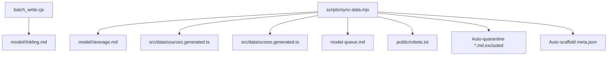
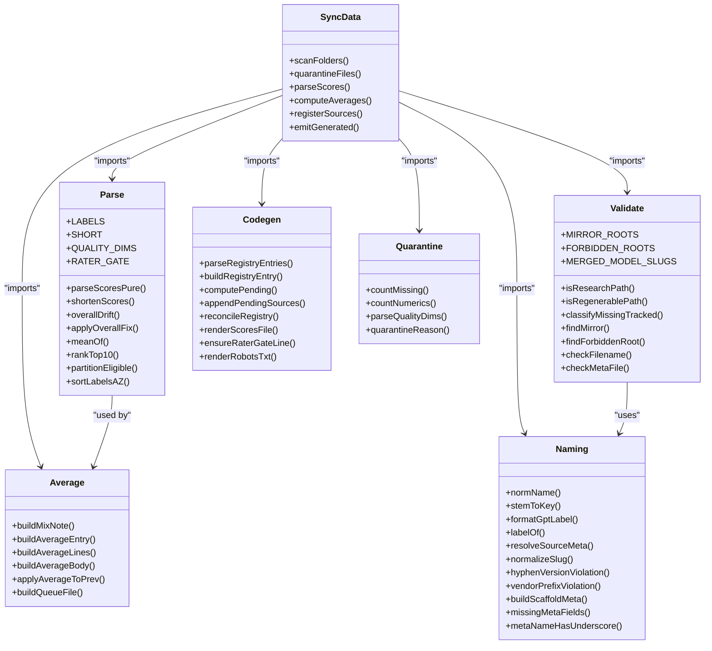
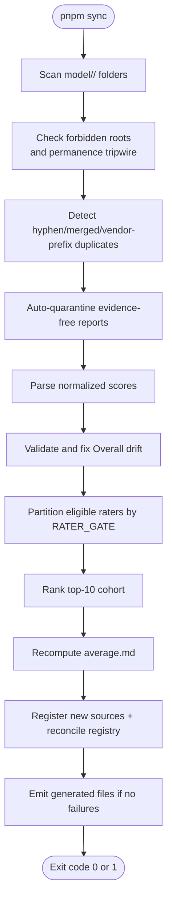
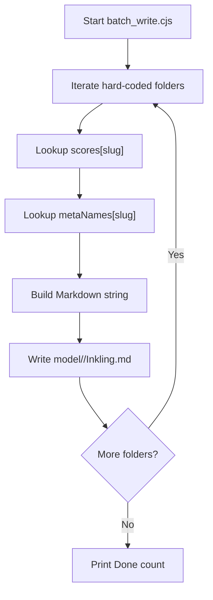
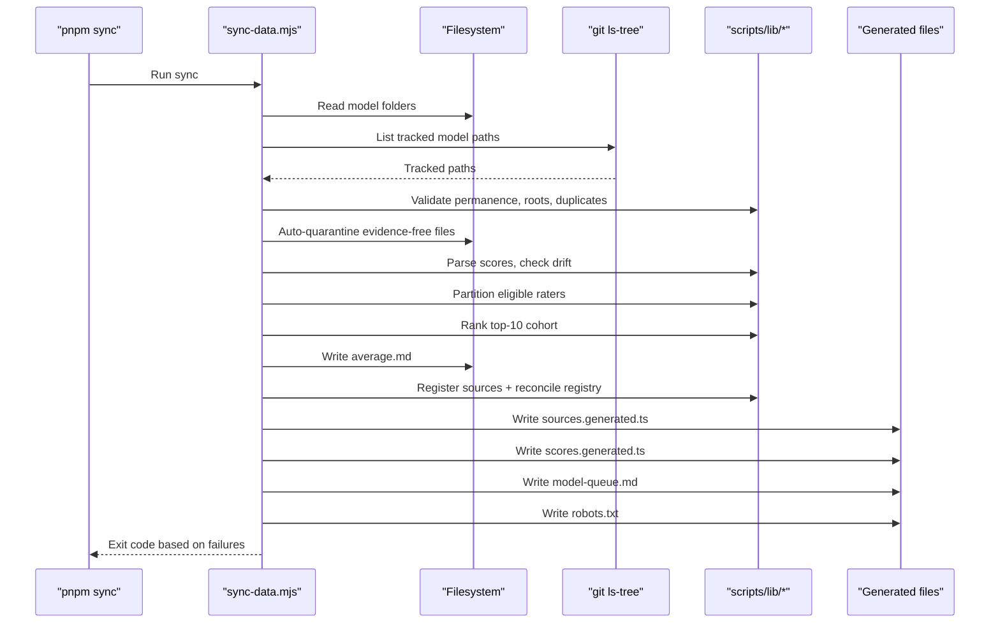
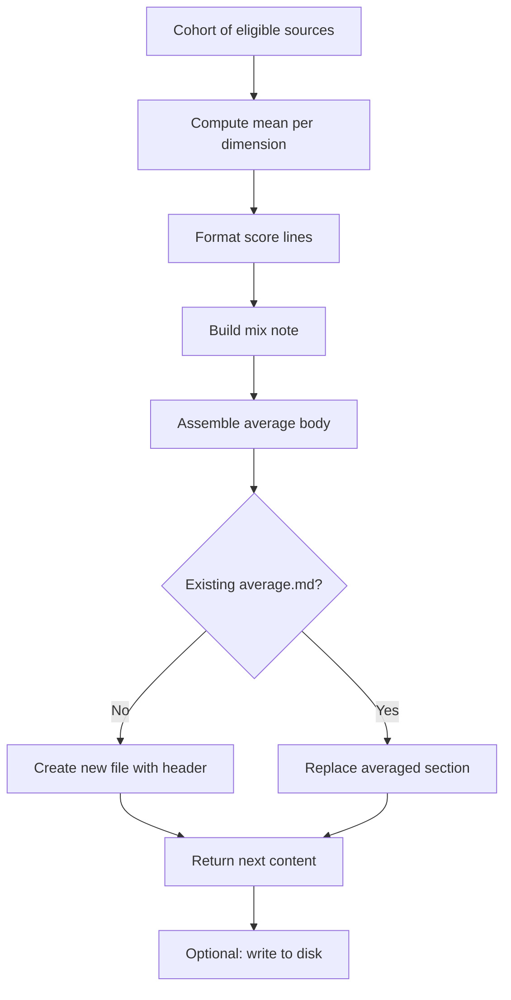
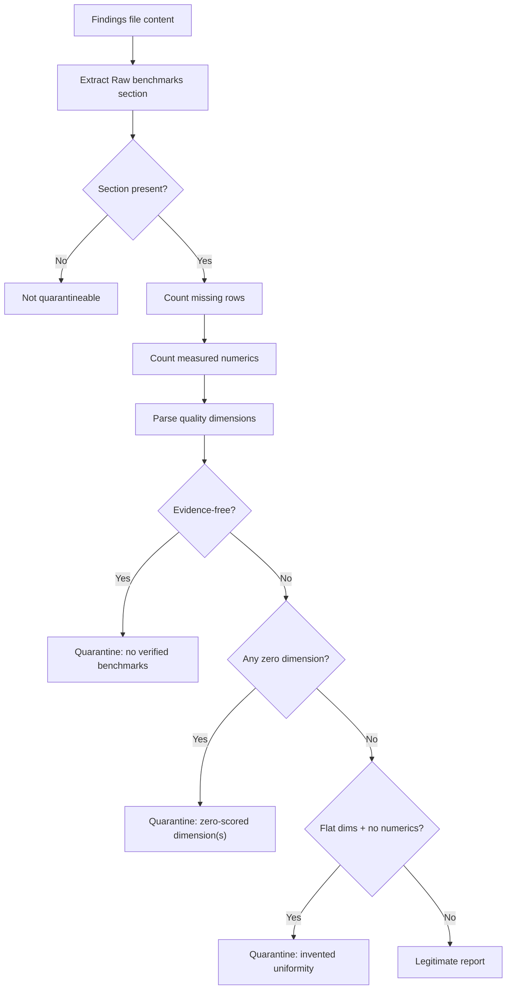
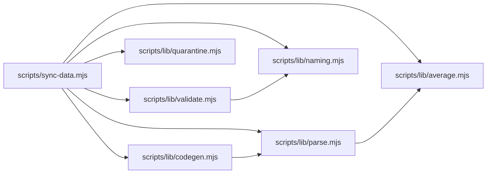

# Batch Processing Utilities

<cite>
**Referenced Files in This Document**   
- [batch_write.cjs](file://batch_write.cjs)
- [sync-data.mjs](file://scripts/sync-data.mjs)
- [parse.mjs](file://scripts/lib/parse.mjs)
- [average.mjs](file://scripts/lib/average.mjs)
- [validate.mjs](file://scripts/lib/validate.mjs)
- [naming.mjs](file://scripts/lib/naming.mjs)
- [codegen.mjs](file://scripts/lib/codegen.mjs)
- [quarantine.mjs](file://scripts/lib/quarantine.mjs)
- [README.md](file://README.md)
</cite>

## Table of Contents
1. [Introduction](#introduction)
2. [Project Structure](#project-structure)
3. [Core Components](#core-components)
4. [Architecture Overview](#architecture-overview)
5. [Detailed Component Analysis](#detailed-component-analysis)
6. [Dependency Analysis](#dependency-analysis)
7. [Performance Considerations](#performance-considerations)
8. [Troubleshooting Guide](#troubleshooting-guide)
9. [Conclusion](#conclusion)

## Introduction
This document explains the batch-processing utilities that power the model comparison project’s data pipeline. The system turns research markdown files into a deterministic, build-time dataset for a static site comparing AI coding models across six normalized dimensions: tool use, reasoning, context window, multimodal support, coding ability, and cost efficiency.

Two complementary batch tools exist:

- `batch_write.cjs`: a standalone Node script that generates per-model Inkling findings cards from an embedded score table. It is self-contained and does not depend on the sync pipeline.
- `scripts/sync-data.mjs` plus its pure helper modules under `scripts/lib/`: the main deterministic sync engine that scans model folders, parses scores, quarantines evidence-free reports, recomputes averages, registers new sources, and emits generated TypeScript and metadata files consumed by the UI.

The README describes the end-to-end data flow: per-agent findings files are parsed at build time, averaged, registered, and turned into compact client-side data structures without embedding full report prose in the bundle.

**Section sources**
- [README.md:1-10](file://README.md#L1-L10)
- [README.md:48-61](file://README.md#L48-L61)

## Project Structure
At the heart of the batch layer are two entry points with different responsibilities:

| Entry point | Purpose | Output / side effects |
|---|---|---|
| `batch_write.cjs` | Generate Inkling model cards for a fixed list of model slugs using hardcoded scores and display names. | Writes one Markdown card per slug under `model/<slug>/Inkling.md`. |
| `scripts/sync-data.mjs` | Deterministic data synchronization behind `pnpm sync`. | Rewrites `average.md`, `src/data/sources.generated.ts`, `src/data/scores.generated.ts`, `model-queue.md`, and `public/robots.txt`; quarantines or scaffolds files; validates metadata. |

**Diagram sources**
- [batch_write.cjs:30-63](file://batch_write.cjs#L30-L63)
- [sync-data.mjs:350-365](file://scripts/sync-data.mjs#L350-L365)
- [sync-data.mjs:518-535](file://scripts/sync-data.mjs#L518-L535)
- [sync-data.mjs:542-592](file://scripts/sync-data.mjs#L542-L592)
- [sync-data.mjs:602-654](file://scripts/sync-data.mjs#L602-L654)

**Section sources**
- [batch_write.cjs:1-65](file://batch_write.cjs#L1-L65)
- [sync-data.mjs:1-31](file://scripts/sync-data.mjs#L1-L31)
- [README.md:48-61](file://README.md#L48-L61)

## Core Components
The batch utilities split concerns between orchestration and pure logic:

- **Orchestrator**: `scripts/sync-data.mjs` performs filesystem operations, logging, failure accounting, environment handling, and coordination between pure helpers.
- **Pure helpers** (zero dependencies, no filesystem access):
  - `parse.mjs`: canonical labels, short keys, quality dimensions, rater gate, parsing, rounding, cohort ranking, eligibility partitioning, and sorting.
  - `average.mjs`: average body construction, mix notes, top-10 cohort scoring, queue file generation, and merging into existing `average.md`.
  - `validate.mjs`: permanence tripwires, mirror roots, forbidden roots, merged slugs, filename hygiene, and `meta.json` validation.
  - `naming.mjs`: slug normalization, vendor-prefix checks, GPT label formatting, source key resolution, scaffold stub detection, and missing-field checks.
  - `codegen.mjs`: registry text surgery, SourceKey union maintenance, scores serializer, robots.txt renderer, and RATER_GATE line management.
  - `quarantine.mjs`: auto-quarantine decision for evidence-free, zero-scored, or flat benchmark reports.

**Diagram sources**
- [sync-data.mjs:37-86](file://scripts/sync-data.mjs#L37-L86)
- [parse.mjs:8-123](file://scripts/lib/parse.mjs#L8-L123)
- [average.mjs:17-121](file://scripts/lib/average.mjs#L17-L121)
- [validate.mjs:9-130](file://scripts/lib/validate.mjs#L9-L130)
- [naming.mjs:8-156](file://scripts/lib/naming.mjs#L8-L156)
- [codegen.mjs:9-171](file://scripts/lib/codegen.mjs#L9-L171)
- [quarantine.mjs:9-56](file://scripts/lib/quarantine.mjs#L9-L56)

**Section sources**
- [sync-data.mjs:31-86](file://scripts/sync-data.mjs#L31-L86)
- [parse.mjs:8-123](file://scripts/lib/parse.mjs#L8-L123)
- [average.mjs:1-122](file://scripts/lib/average.mjs#L1-L122)
- [validate.mjs:1-131](file://scripts/lib/validate.mjs#L1-L131)
- [naming.mjs:1-157](file://scripts/lib/naming.mjs#L1-L157)
- [codegen.mjs:1-172](file://scripts/lib/codegen.mjs#L1-L172)
- [quarantine.mjs:1-57](file://scripts/lib/quarantine.mjs#L1-L57)

## Architecture Overview
The sync pipeline follows a strict, deterministic sequence:

1. Scan `model/<slug>/` directories.
2. Check for forbidden duplicate roots and enforce the permanence tripwire against deleted tracked research files.
3. Detect hyphen-version duplicates, merged duplicates, and vendor-prefixed duplicates.
4. Auto-quarantine evidence-free findings.
5. Parse normalized scores and validate Overall drift.
6. Partition eligible raters by the rater gate and compute top-10 cohorts.
7. Recompute and write `average.md`.
8. Register new reporting sources and reconcile the registry.
9. Emit generated TypeScript, research queue, and robots.txt only when there are no failures.

**Diagram sources**
- [sync-data.mjs:163-175](file://scripts/sync-data.mjs#L163-L175)
- [sync-data.mjs:177-222](file://scripts/sync-data.mjs#L177-L222)
- [sync-data.mjs:241-275](file://scripts/sync-data.mjs#L241-L275)
- [sync-data.mjs:350-365](file://scripts/sync-data.mjs#L350-L365)
- [sync-data.mjs:428-470](file://scripts/sync-data.mjs#L428-L470)
- [sync-data.mjs:472-535](file://scripts/sync-data.mjs#L472-L535)
- [sync-data.mjs:538-592](file://scripts/sync-data.mjs#L538-L592)
- [sync-data.mjs:602-654](file://scripts/sync-data.mjs#L602-L654)

**Section sources**
- [sync-data.mjs:1-31](file://scripts/sync-data.mjs#L1-L31)
- [sync-data.mjs:163-664](file://scripts/sync-data.mjs#L163-L664)

## Detailed Component Analysis

### Batch Card Writer: `batch_write.cjs`
`batch_write.cjs` is a simple Node CommonJS script that writes Inkling model cards for a hard-coded list of model slugs. For each slug it:

- Looks up a seven-element score array.
- Maps the slug to a human-readable display name.
- Builds Markdown content containing model-card fields, raw-benchmark disclaimers, normalized scores, and a signature.
- Writes the result to `model/<slug>/Inkling.md`.

Important characteristics:

- Scores and display names are embedded directly in the script.
- There is no dependency on `scripts/lib/`, git, or the sync pipeline.
- It is useful for generating a baseline set of model cards but should not be confused with the authoritative sync-driven data pipeline.

**Diagram sources**
- [batch_write.cjs:2-7](file://batch_write.cjs#L2-L7)
- [batch_write.cjs:8-19](file://batch_write.cjs#L8-L19)
- [batch_write.cjs:20-29](file://batch_write.cjs#L20-L29)
- [batch_write.cjs:30-63](file://batch_write.cjs#L30-L63)

**Section sources**
- [batch_write.cjs:1-65](file://batch_write.cjs#L1-L65)

### Sync Orchestrator: `scripts/sync-data.mjs`
`scripts/sync-data.mjs` is the central orchestrator. It combines filesystem access, child-process calls, logging, and pure helper functions to keep decisions separate from I/O. Its major phases are:

#### Phase 1: Environment and Catalog Setup
- Determines the repository root from the script location.
- Loads constants and pure helpers from `scripts/lib/`.
- Reads `sources.generated.ts` to resolve stem-to-key mappings used by the rater gate.
- Builds a catalog of normalized display names to folder slugs across `model/`, `models_voice/`, and `models_finance/`.

#### Phase 2: Safety Checks
- Checks for forbidden duplicate roots such as retired directory names.
- Enforces the permanence tripwire by comparing git-tracked paths with disk state.
- Detects hyphen-version duplicates, merged duplicates, and vendor-prefixed duplicates.

#### Phase 3: Per-Folder Processing
- Auto-quarantines evidence-free reports.
- Skips self-excluded `.md.excluded` files.
- Validates filenames and `meta.json`.
- Parses normalized scores and shortens them for the generated index.
- Fixes Overall drift where possible.
- Partitions eligible raters and computes the top-10 cohort.
- Recomputes and writes `average.md`.

#### Phase 4: Registry and Generated Outputs
- Registers new reporting sources.
- Reconciles registry entries and prunes virtual-view entries.
- Ensures the managed `RATER_GATE` line stays in sync.
- Emits `scores.generated.ts`, `model-queue.md`, and `robots.txt` only when there are no failures.

**Diagram sources**
- [sync-data.mjs:31-86](file://scripts/sync-data.mjs#L31-L86)
- [sync-data.mjs:163-222](file://scripts/sync-data.mjs#L163-L222)
- [sync-data.mjs:350-535](file://scripts/sync-data.mjs#L350-L535)
- [sync-data.mjs:538-654](file://scripts/sync-data.mjs#L538-L654)

**Section sources**
- [sync-data.mjs:1-31](file://scripts/sync-data.mjs#L1-L31)
- [sync-data.mjs:88-166](file://scripts/sync-data.mjs#L88-L166)
- [sync-data.mjs:168-275](file://scripts/sync-data.mjs#L168-L275)
- [sync-data.mjs:277-536](file://scripts/sync-data.mjs#L277-L536)
- [sync-data.mjs:538-664](file://scripts/sync-data.mjs#L538-L664)

### Parsing and Scoring: `scripts/lib/parse.mjs`
`parse.mjs` defines the canonical contract for how scores are represented and computed:

- Canonical label order includes six scored dimensions plus Overall Score.
- Short keys map long labels to compact field names used in generated TypeScript.
- Quality dimensions exclude Cost efficiency from Overall computation.
- Rater gate is `84.9`; only reports written by models whose own committed average Overall exceeds this value count toward another model’s average.
- Overall drift tolerance is `0.51`; when the source file’s Overall differs from the half-up mean of the five quality dimensions, the script attempts to rewrite just the Overall number.
- Cohort ranking selects the ten highest-Overall sources, falling back to all sources when fewer than ten exist.
- Eligibility partitioning separates qualifying raters from ignored below-gate raters.

Complexity considerations:

- Parsing is linear in the number of labels per file.
- Mean computation is linear in cohort size.
- Ranking is dominated by sorting, typically O(n log n) over eligible sources per model folder.
- Eligibility partitioning is linear in the number of parseable findings files.

**Section sources**
- [parse.mjs:8-17](file://scripts/lib/parse.mjs#L8-L17)
- [parse.mjs:19-31](file://scripts/lib/parse.mjs#L19-L31)
- [parse.mjs:33-45](file://scripts/lib/parse.mjs#L33-L45)
- [parse.mjs:47-92](file://scripts/lib/parse.mjs#L47-L92)
- [parse.mjs:94-123](file://scripts/lib/parse.mjs#L94-L123)

### Averaging and Queue Generation: `scripts/lib/average.mjs`
`average.mjs` builds the textual and programmatic representation of averaged scores:

- `buildMixNote` produces a human-readable explanation of whether the average uses fallback, trimmed top-N-of-M, or all qualifying sources.
- `buildAverageEntry` creates the compact object stored in `scoreIndex` for the default “average” view.
- `buildAverageLines` formats the seven normalized score lines.
- `buildAverageBody` composes the “Averaged scores” and “Agreement notes” sections.
- `applyAverageToPrev` preserves existing headers while replacing the averaged section.
- `buildQueueFile` generates `model-queue.md`, listing models by descending Overall and alphabetical slug for ties.

**Diagram sources**
- [average.mjs:17-31](file://scripts/lib/average.mjs#L17-L31)
- [average.mjs:33-52](file://scripts/lib/average.mjs#L33-L52)
- [average.mjs:54-81](file://scripts/lib/average.mjs#L54-L81)
- [average.mjs:83-100](file://scripts/lib/average.mjs#L83-L100)
- [average.mjs:102-121](file://scripts/lib/average.mjs#L102-L121)

**Section sources**
- [average.mjs:1-122](file://scripts/lib/average.mjs#L1-L122)

### Validation and Permanence Guards: `scripts/lib/validate.mjs`
`validate.mjs` enforces data integrity rules:

- Sanctioned mirror roots allow relocated research files under `models_voice/` and `models_finance/`.
- Forbidden roots prevent recreation of deprecated directory names.
- Merged model slugs must never be resurrected.
- Missing tracked research files are classified as twin-retired, relocated, or deleted.
- Regenerable paths like `average.md` and `README.md` do not trigger deletion failures.
- Filename hygiene restricts findings filenames to letters, digits, underscores, and dots.
- `meta.json` validation checks required fields, rejects underscores in display names, and enforces OpenAI-style hyphenated GPT naming.

**Section sources**
- [validate.mjs:1-13](file://scripts/lib/validate.mjs#L1-L13)
- [validate.mjs:15-49](file://scripts/lib/validate.mjs#L15-L49)
- [validate.mjs:51-75](file://scripts/lib/validate.mjs#L51-L75)
- [validate.mjs:77-99](file://scripts/lib/validate.mjs#L77-L99)
- [validate.mjs:101-130](file://scripts/lib/validate.mjs#L101-L130)

### Naming and Slug Conventions: `scripts/lib/naming.mjs`
`naming.mjs` centralizes slug, label, and metadata conventions:

- Normalized names strip non-alphanumeric characters for deep-link matching.
- Findings stems become source keys by replacing underscores with spaces.
- GPT labels are hyphenated according to official vendor style.
- Source metadata resolution supports overrides and catalog lookup.
- Slug normalization converts digit-hyphen-digit sequences into dotted versions, with explicit exceptions for param-size identifiers.
- Vendor-prefix violations detect `<vendor>-<rest>` slugs when `<rest>` already exists.
- Scaffold stubs mark uncurated `meta.json` files until a human sets the official vendor name.

**Section sources**
- [naming.mjs:1-7](file://scripts/lib/naming.mjs#L1-L7)
- [naming.mjs:8-28](file://scripts/lib/naming.mjs#L8-L28)
- [naming.mjs:30-40](file://scripts/lib/naming.mjs#L30-L40)
- [naming.mjs:42-70](file://scripts/lib/naming.mjs#L42-L70)
- [naming.mjs:72-101](file://scripts/lib/naming.mjs#L72-L101)
- [naming.mjs:103-156](file://scripts/lib/naming.mjs#L103-L156)

### Code Generation and Registry Surgery: `scripts/lib/codegen.mjs`
`codegen.mjs` manages generated TypeScript and public metadata:

- Parses existing SOURCE_DEFS entries and SourceKey union members.
- Builds registry entries with exact on-disk stems.
- Computes pending registrations and detects key collisions.
- Appends new sources to both the union and the registry array.
- Reconciles labels and inline slugs, pruning grandfathered virtual-view entries.
- Renders `scores.generated.ts` deterministically with sorted slugs and files.
- Maintains the managed `RATER_GATE` constant in the registry.
- Renders `robots.txt` with an absolute Sitemap URL derived from `SITE_ORIGIN`.

**Section sources**
- [codegen.mjs:1-8](file://scripts/lib/codegen.mjs#L1-L8)
- [codegen.mjs:9-35](file://scripts/lib/codegen.mjs#L9-L35)
- [codegen.mjs:37-84](file://scripts/lib/codegen.mjs#L37-L84)
- [codegen.mjs:86-105](file://scripts/lib/codegen.mjs#L86-L105)
- [codegen.mjs:107-139](file://scripts/lib/codegen.mjs#L107-L139)
- [codegen.mjs:141-171](file://scripts/lib/codegen.mjs#L141-L171)

### Auto-Quarantine Logic: `scripts/lib/quarantine.mjs`
`quarantine.mjs` decides whether a findings file should be renamed to `.md.excluded`:

- Counts “no verified public score found” rows in the Raw benchmarks section.
- Counts measured numeric values using a regex that respects bold spans on a single line.
- Parses the five quality dimensions from the Normalized scores section.
- Quarantines when:
  - Evidence-free: eight or more “not found” rows and zero measured numbers.
  - Zero-scored: any quality dimension is exactly zero.
  - Flat: all five quality dimensions are identical and zero measured numbers.

**Diagram sources**
- [quarantine.mjs:11-14](file://scripts/lib/quarantine.mjs#L11-L14)
- [quarantine.mjs:16-25](file://scripts/lib/quarantine.mjs#L16-L25)
- [quarantine.mjs:27-31](file://scripts/lib/quarantine.mjs#L27-L31)
- [quarantine.mjs:33-56](file://scripts/lib/quarantine.mjs#L33-L56)

**Section sources**
- [quarantine.mjs:1-57](file://scripts/lib/quarantine.mjs#L1-L57)

## Dependency Analysis
The dependency graph shows clear separation between orchestration and pure logic:

**Diagram sources**
- [sync-data.mjs:37-86](file://scripts/sync-data.mjs#L37-L86)
- [validate.mjs:9-10](file://scripts/lib/validate.mjs#L9-L10)
- [average.mjs:10-10](file://scripts/lib/average.mjs#L10-L10)
- [codegen.mjs:141-144](file://scripts/lib/codegen.mjs#L141-L144)

Coupling observations:

- `sync-data.mjs` has high cohesion around orchestration but depends on many pure modules.
- Pure modules have minimal coupling: `validate.mjs` depends on `naming.mjs`; `average.mjs` depends on `parse.mjs`; `codegen.mjs` references `parse.mjs` indirectly through the maintained `RATER_GATE` value.
- No circular imports are visible among the pure helpers.
- External integration points include Node’s `fs`, `child_process`, and `path` modules, plus the `git` command for the permanence tripwire.

**Section sources**
- [sync-data.mjs:31-34](file://scripts/sync-data.mjs#L31-L34)
- [sync-data.mjs:37-86](file://scripts/sync-data.mjs#L37-L86)
- [validate.mjs:9-10](file://scripts/lib/validate.mjs#L9-L10)
- [average.mjs:10-10](file://scripts/lib/average.mjs#L10-L10)
- [codegen.mjs:141-144](file://scripts/lib/codegen.mjs#L141-L144)

## Performance Considerations
- **Parsing overhead**: Each findings file is read once per sync run. The parser matches seven labeled score lines, so parsing cost is small relative to filesystem I/O.
- **Cohort computation**: Top-10 ranking sorts eligible sources per model folder. With typical model folders holding a modest number of agent reports, this is inexpensive.
- **Generated output**: `scores.generated.ts` avoids bundling full Markdown reports into the client bundle, keeping runtime payloads compact.
- **Determinism**: Sorted slugs, sorted files, and stable registry surgery ensure reproducible outputs across runs.
- **Failure gating**: Generated files are only rewritten when there are no failures, preventing partial or invalid data from being cemented.

[No sources needed since this section provides general guidance]

## Troubleshooting Guide
Common issues and their likely causes:

| Symptom | Likely cause | Resolution |
|---|---|---|
| `pnpm sync` exits with failure after adding a new findings file | New source key collision or missing registry anchor | Resolve the duplicate key manually or update the registry as instructed by the FAIL message. |
| `average.md` is not rewritten | One or more findings files failed parsing or had unfixable Overall drift | Fix the malformed score lines or manually correct the Overall line before re-running sync. |
| A findings file disappears from the average | Auto-quarantine flagged it as evidence-free, zero-scored, or flat | Add verified benchmark citations or remove the report; quarantined files become `.md.excluded`. |
| `meta.json` warnings about a slug guess | Sync auto-scaffolded a missing `meta.json` | Replace the guessed name and placeholder facts with verified vendor information. |
| Hyphen-version duplicate error | Folder name uses `-` between digits instead of `.` | Rename the folder to the dotted version suggested by the error. |
| Permanence tripwire fails | A tracked research file was deleted locally | Restore it with the suggested git command or relocate it to a sanctioned mirror tree. |
| Generated files are not updated | Sync encountered failures earlier in the run | Fix reported failures and rerun `pnpm sync`. |

**Section sources**
- [sync-data.mjs:149-161](file://scripts/sync-data.mjs#L149-L161)
- [sync-data.mjs:177-222](file://scripts/sync-data.mjs#L177-L222)
- [sync-data.mjs:241-275](file://scripts/sync-data.mjs#L241-L275)
- [sync-data.mjs:350-365](file://scripts/sync-data.mjs#L350-L365)
- [sync-data.mjs:386-426](file://scripts/sync-data.mjs#L386-L426)
- [sync-data.mjs:443-470](file://scripts/sync-data.mjs#L443-L470)
- [sync-data.mjs:602-657](file://scripts/sync-data.mjs#L602-L657)

## Conclusion
The batch processing utilities in this repository combine a lightweight standalone card generator with a robust, deterministic sync pipeline. `batch_write.cjs` is convenient for quickly producing Inkling model cards from embedded data, while `scripts/sync-data.mjs` and its pure helper modules form the authoritative data engine: it validates inputs, quarantines weak reports, computes averages, maintains a typed registry, and emits generated artifacts consumed by the frontend.

For most workflows, the recommended path is to add or edit findings files under `model/<slug>/` and run `pnpm sync`, letting the pipeline handle averaging, registration, and code generation. Use `batch_write.cjs` only when you need a quick batch of Inkling-style cards without engaging the full sync process.

[No sources needed since this section summarizes without analyzing specific files]