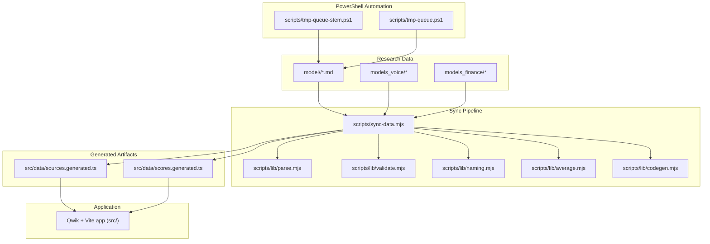
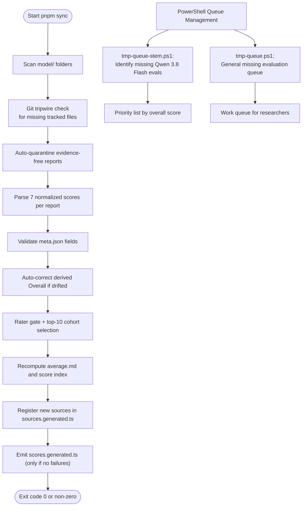
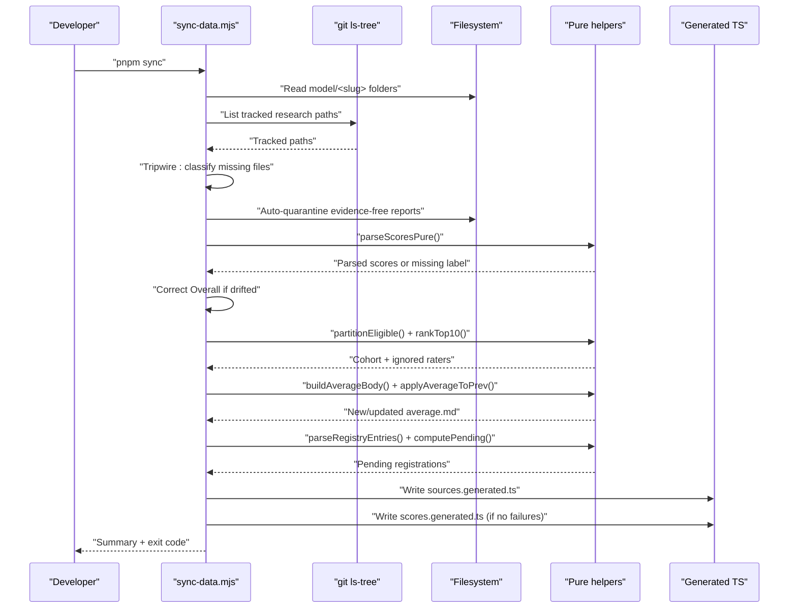
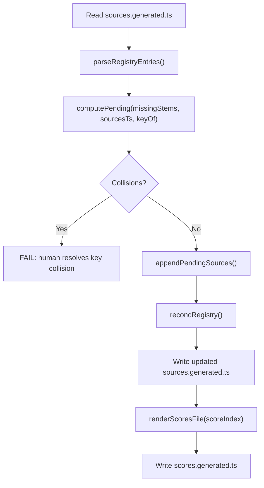
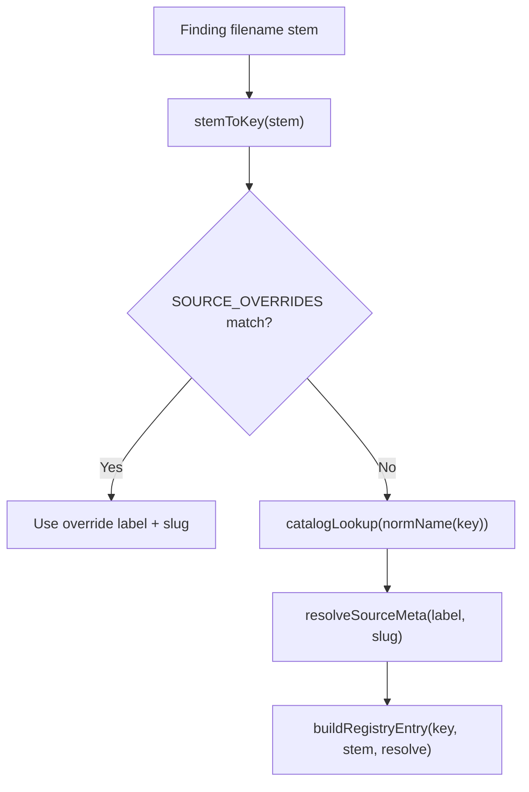
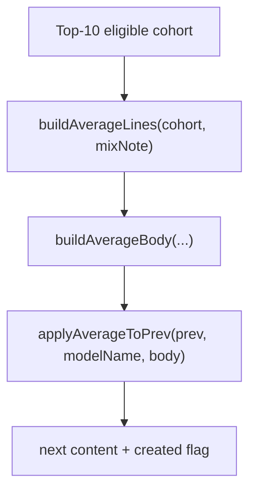
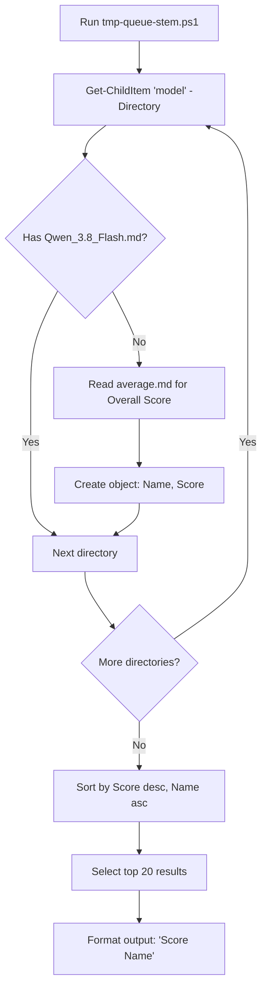
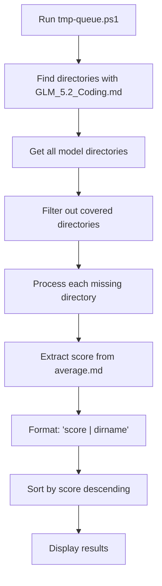
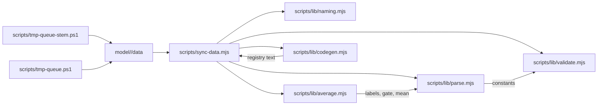

# Build & Development Pipeline

<cite>
**Referenced Files in This Document**
- [package.json](file://package.json)
- [sync-data.mjs](file://scripts/sync-data.mjs)
- [parse.mjs](file://scripts/lib/parse.mjs)
- [codegen.mjs](file://scripts/lib/codegen.mjs)
- [validate.mjs](file://scripts/lib/validate.mjs)
- [naming.mjs](file://scripts/lib/naming.mjs)
- [average.mjs](file://scripts/lib/average.mjs)
- [tmp-queue-stem.ps1](file://scripts/tmp-queue-stem.ps1)
- [tmp-queue.ps1](file://scripts/tmp-queue.ps1)
- [sync-data.md](file://tasks/sync-data.md)
</cite>

## Update Summary
**Changes Made**
- Added documentation for PowerShell automation scripts that enhance the development workflow
- Updated the architecture overview to include PowerShell-based queue management
- Added new section covering PowerShell automation tools for systematic model evaluation tracking
- Enhanced troubleshooting guide with PowerShell-specific guidance

## Table of Contents
1. [Introduction](#introduction)
2. [Project Structure](#project-structure)
3. [Core Components](#core-components)
4. [Architecture Overview](#architecture-overview)
5. [Detailed Component Analysis](#detailed-component-analysis)
6. [PowerShell Automation Scripts](#powershell-automation-scripts)
7. [Dependency Analysis](#dependency-analysis)
8. [Performance Considerations](#performance-considerations)
9. [Troubleshooting Guide](#troubleshooting-guide)
10. [Conclusion](#conclusion)
11. [Appendices](#appendices)

## Introduction
This document explains the ModelComp build and development pipeline that turns research markdown files into deterministic TypeScript data structures consumed by the static site. The central process is a Node.js synchronization script that scans model folders, parses scoring reports, validates metadata, recomputes averages, registers new sources, and emits compact generated TypeScript files. The pipeline is designed to be reproducible: it fails loudly on invalid input, auto-corrects derived values where safe, and only writes generated artifacts when no failures are present.

The high-level workflow is:
- Add or edit markdown findings under `model/<slug>/`.
- Run the sync script to parse, validate, compute averages, register sources, and generate TypeScript.
- Use PowerShell automation scripts to systematically identify models not yet evaluated by specific agents (like Qwen 3.8 Flash).
- Run type checking and the Vite build to verify the final static site.
- Deploy according to the project's deployment configuration.

## Project Structure
At a high level, the repository contains:
- Markdown research data under `model/`, plus mirrored research trees under `models_voice/` and `models_finance/`.
- A Node-based sync pipeline under `scripts/`, with pure helper modules under `scripts/lib/`.
- PowerShell automation scripts under `scripts/` for specialized queue management tasks.
- Generated TypeScript data under `src/data/`.
- A Qwik/Vite application under `src/` and root configuration files such as `package.json`, `tsconfig.json`, and `vite.config.ts`.



**Diagram sources**
- [sync-data.mjs:1-527](file://scripts/sync-data.mjs#L1-L527)
- [parse.mjs:1-124](file://scripts/lib/parse.mjs#L1-L124)
- [validate.mjs:1-81](file://scripts/lib/validate.mjs#L1-L81)
- [naming.mjs:1-73](file://scripts/lib/naming.mjs#L1-L73)
- [average.mjs:1-101](file://scripts/lib/average.mjs#L1-L101)
- [codegen.mjs:1-140](file://scripts/lib/codegen.mjs#L1-L140)
- [tmp-queue-stem.ps1:1-14](file://scripts/tmp-queue-stem.ps1#L1-L14)
- [tmp-queue.ps1:1-10](file://scripts/tmp-queue.ps1#L1-L10)

**Section sources**
- [package.json:1-38](file://package.json#L1-L38)
- [sync-data.md:1-114](file://tasks/sync-data.md#L1-L114)

## Core Components
The pipeline has one orchestrator, several pure helpers, and PowerShell automation utilities:

- Orchestrator: `scripts/sync-data.mjs`
  - Scans model directories.
  - Enforces permanence via git tripwire checks.
  - Auto-quarantines evidence-free reports.
  - Parses seven normalized scores per report.
  - Auto-corrects derived Overall scores within tolerance.
  - Applies rater gating and top-10 cohort averaging.
  - Recomputes and rewrites `average.md` where needed.
  - Registers new reporting-agent filenames in the source registry.
  - Emits compact TypeScript score data for the client bundle.

- Pure helpers:
  - `scripts/lib/parse.mjs`: score labels, short keys, parsing, drift detection, cohort ranking, rater gating, and label sorting.
  - `scripts/lib/validate.mjs`: research path classification, mirror relocation detection, filename hygiene, and meta.json validation.
  - `scripts/lib/naming.mjs`: slug conventions, key derivation, display label resolution, virtual view keys, and slug-name guess formatting.
  - `scripts/lib/average.mjs`: average.md body generation, entry serialization, and merge logic.
  - `scripts/lib/codegen.mjs`: registry text surgery, union member handling, pending registration computation, and deterministic scores file rendering.

- PowerShell automation utilities:
  - `scripts/tmp-queue-stem.ps1`: Systematically identifies models not yet evaluated by Qwen 3.8 Flash, sorted by overall score.
  - `scripts/tmp-queue.ps1`: General-purpose queue identification for missing model evaluations.

**Section sources**
- [sync-data.mjs:1-527](file://scripts/sync-data.mjs#L1-L527)
- [parse.mjs:1-124](file://scripts/lib/parse.mjs#L1-L124)
- [validate.mjs:1-81](file://scripts/lib/validate.mjs#L1-L81)
- [naming.mjs:1-73](file://scripts/lib/naming.mjs#L1-L73)
- [average.mjs:1-101](file://scripts/lib/average.mjs#L1-L101)
- [codegen.mjs:1-140](file://scripts/lib/codegen.mjs#L1-L140)
- [tmp-queue-stem.ps1:1-14](file://scripts/tmp-queue-stem.ps1#L1-L14)
- [tmp-queue.ps1:1-10](file://scripts/tmp-queue.ps1#L1-L10)

## Architecture Overview
The sync pipeline follows a strict sequence: scan, quarantine, parse, validate, gate, average, register, and emit. It separates side-effectful orchestration from pure logic so behavior is testable and deterministic. PowerShell automation scripts complement this workflow by providing targeted analysis capabilities for identifying evaluation gaps.



**Diagram sources**
- [sync-data.mjs:133-527](file://scripts/sync-data.mjs#L133-L527)
- [parse.mjs:38-124](file://scripts/lib/parse.mjs#L38-L124)
- [validate.mjs:11-81](file://scripts/lib/validate.mjs#L11-L81)
- [average.mjs:10-101](file://scripts/lib/average.mjs#L10-L101)
- [codegen.mjs:9-140](file://scripts/lib/codegen.mjs#L9-L140)
- [tmp-queue-stem.ps1:1-14](file://scripts/tmp-queue-stem.ps1#L1-L14)
- [tmp-queue.ps1:1-10](file://scripts/tmp-queue.ps1#L1-L10)

## Detailed Component Analysis

### Sync Orchestrator: scripts/sync-data.mjs
The orchestrator coordinates all phases and owns filesystem operations, logging, failure accounting, and exit codes. Key responsibilities include:
- Deterministic scanning and sorting of model folders.
- Permanence enforcement using git HEAD to detect forbidden deletions.
- Auto-quarantine of reports with insufficient evidence.
- Parsing and validating each report's seven scores.
- Auto-correcting Overall scores when they drift beyond tolerance.
- Applying the rater gate and selecting the top-10 cohort.
- Rebuilding `average.md` while preserving headers.
- Updating the source registry and reconciling labels/slugs.
- Generating a compact, deterministic TypeScript score map.



**Diagram sources**
- [sync-data.mjs:133-527](file://scripts/sync-data.mjs#L133-L527)
- [parse.mjs:94-124](file://scripts/lib/parse.mjs#L94-L124)
- [average.mjs:83-101](file://scripts/lib/average.mjs#L83-L101)
- [codegen.mjs:14-84](file://scripts/lib/codegen.mjs#L14-L84)

**Section sources**
- [sync-data.mjs:1-527](file://scripts/sync-data.mjs#L1-L527)

### Data Extraction and Validation: scripts/lib/parse.mjs and scripts/lib/validate.mjs
Parsing and validation are intentionally pure:
- `parse.mjs` defines the canonical score labels, short keys, quality dimensions, rater gate threshold, drift tolerance, and functions for mean calculation, cohort ranking, and eligibility partitioning.
- `validate.mjs` classifies research paths, detects sanctioned mirror relocations, enforces filename hygiene, and validates required meta.json fields.

Important invariants:
- Score lines must match the exact label set and format.
- Overall is derived from five quality dimensions; cost is scored but excluded from Overall.
- Rater gate uses a strict threshold; exactly at the threshold does not qualify.
- Filename hygiene rejects characters outside letters, digits, underscore, and dots.

```mermaid
classDiagram
class Parse {
+LABELS
+SHORT
+QUALITY_DIMS
+META_REQUIRED
+FILENAME_RE
+RATER_GATE
+OVERALL_TOLERANCE
+halfUp1(x)
+parseScoresPure(md)
+shortenScores(scores)
+overallDrift(scores, tolerance)
+applyOverallFix(content, corrected)
+meanOf(cohort, label)
+rankTop10(eligible)
+partitionEligible(perFile, resolveSlug, raterOwn, gate)
+sortLabelsAZ(labels)
}
class Validate {
+MIRROR_ROOTS
+isResearchPath(posix)
+isRegenerablePath(posix)
+classifyMissingTracked({ twinRetired, mirror })
+findMirror(parts, mirrorRoots, existsAt)
+deletionFailMessage(posix)
+checkFilename(slug, f)
+checkMetaFile(slug, meta, required)
}
Parse <.. Validate : "shared constants"
```

**Diagram sources**
- [parse.mjs:8-124](file://scripts/lib/parse.mjs#L8-L124)
- [validate.mjs:9-81](file://scripts/lib/validate.mjs#L9-L81)

**Section sources**
- [parse.mjs:1-124](file://scripts/lib/parse.mjs#L1-L124)
- [validate.mjs:1-81](file://scripts/lib/validate.mjs#L1-L81)

### Code Generation and Source Registration: scripts/lib/codegen.mjs
Codegen handles two outputs:
- Registry surgery in `src/data/sources.generated.ts`:
  - Parses existing SOURCE_DEFS entries and SourceKey union members.
  - Computes pending registrations for new stems.
  - Detects collisions where a stem maps to an already registered key.
  - Appends new entries and updates the union if needed.
  - Reconciles labels and inline slugs idempotently.
  - Prunes grandfathered virtual-view entries.
- Scores file emission:
  - Renders a deterministic TypeScript interface and record mapping slugs to short-keyed scores.



**Diagram sources**
- [codegen.mjs:9-140](file://scripts/lib/codegen.mjs#L9-L140)

**Section sources**
- [codegen.mjs:1-140](file://scripts/lib/codegen.mjs#L1-L140)

### Naming and Slug Conventions: scripts/lib/naming.mjs
Naming utilities enforce consistent slug-to-key-to-slug resolution:
- Normalize names for catalog lookups.
- Derive source keys from filenames.
- Resolve display labels and model-page slugs using overrides and catalog lookup.
- Detect hyphen-version violations and provide dotted suggestions.
- Define virtual sort-view keys that never appear in the registry.
- Generate slug guesses for auto-scaffolded meta.json entries.



**Diagram sources**
- [naming.mjs:8-62](file://scripts/lib/naming.mjs#L8-L62)
- [codegen.mjs:25-35](file://scripts/lib/codegen.mjs#L25-L35)

**Section sources**
- [naming.mjs:1-73](file://scripts/lib/naming.mjs#L1-L73)

### Average Computation: scripts/lib/average.mjs
Average computation ensures every folder has a deterministic average:
- Builds mix notes explaining fallback, trimming, and rater gating.
- Serializes short-keyed average entries for the score index.
- Generates the averaged score lines and agreement notes.
- Merges computed bodies into existing average.md while preserving headers.



**Diagram sources**
- [average.mjs:10-101](file://scripts/lib/average.mjs#L10-L101)

**Section sources**
- [average.mjs:1-101](file://scripts/lib/average.mjs#L1-L101)

## PowerShell Automation Scripts

### Purpose and Integration
PowerShell automation scripts provide specialized functionality for identifying evaluation gaps in the model comparison pipeline. These scripts complement the main Node.js sync process by offering targeted analysis capabilities that are more efficient for Windows-based development workflows.

### Qwen 3.8 Flash Evaluation Queue: scripts/tmp-queue-stem.ps1
This script systematically identifies models that have not yet been evaluated by Qwen 3.8 Flash, prioritizing them by overall score to help researchers focus on the most impactful evaluations first.

**Key Features:**
- Scans all model directories under `model/`
- Checks for existence of `Qwen_3.8_Flash.md` in each directory
- Extracts overall scores from `average.md` files
- Sorts results by score (descending) then by name (ascending)
- Returns top 20 priority items for focused research



**Diagram sources**
- [tmp-queue-stem.ps1:1-14](file://scripts/tmp-queue-stem.ps1#L1-L14)

**Section sources**
- [tmp-queue-stem.ps1:1-14](file://scripts/tmp-queue-stem.ps1#L1-L14)

### General Queue Management: scripts/tmp-queue.ps1
This utility provides general-purpose queue identification for models missing specific evaluations, useful for various research workflows beyond just Qwen 3.8 Flash.

**Key Features:**
- Identifies directories missing specific model evaluations
- Extracts numerical scores from average.md files
- Provides flexible filtering for different evaluation targets
- Outputs formatted results suitable for processing pipelines



**Diagram sources**
- [tmp-queue.ps1:1-10](file://scripts/tmp-queue.ps1#L1-L10)

**Section sources**
- [tmp-queue.ps1:1-10](file://scripts/tmp-queue.ps1#L1-L10)

### Workflow Integration
The PowerShell scripts integrate seamlessly with the existing build pipeline:

1. **Pre-research Planning**: Use PowerShell scripts to identify evaluation gaps before starting research sessions
2. **Priority-Based Research**: Focus on highest-scoring models first for maximum impact
3. **Progress Tracking**: Monitor which models still need evaluation by specific agents
4. **Windows-Friendly Development**: Provide native PowerShell support for Windows developers

**Section sources**
- [tmp-queue-stem.ps1:1-14](file://scripts/tmp-queue-stem.ps1#L1-L14)
- [tmp-queue.ps1:1-10](file://scripts/tmp-queue.ps1#L1-L10)

## Dependency Analysis
The sync pipeline composes pure modules to keep orchestration focused on I/O and policy decisions. PowerShell scripts operate independently but complement the core pipeline.



**Diagram sources**
- [sync-data.mjs:30-75](file://scripts/sync-data.mjs#L30-L75)
- [parse.mjs:8-45](file://scripts/lib/parse.mjs#L8-L45)
- [validate.mjs:9-12](file://scripts/lib/validate.mjs#L9-L12)
- [average.mjs:10-11](file://scripts/lib/average.mjs#L10-L11)
- [codegen.mjs:1-7](file://scripts/lib/codegen.mjs#L1-L7)
- [tmp-queue-stem.ps1:1-14](file://scripts/tmp-queue-stem.ps1#L1-L14)
- [tmp-queue.ps1:1-10](file://scripts/tmp-queue.ps1#L1-L10)

**Section sources**
- [sync-data.mjs:30-75](file://scripts/sync-data.mjs#L30-L75)
- [parse.mjs:8-45](file://scripts/lib/parse.mjs#L8-L45)
- [validate.mjs:9-12](file://scripts/lib/validate.mjs#L9-L12)
- [average.mjs:10-11](file://scripts/lib/average.mjs#L10-L11)
- [codegen.mjs:1-7](file://scripts/lib/codegen.mjs#L1-L7)

## Performance Considerations
- Avoid shipping markdown prose to the client: the pipeline emits `src/data/scores.generated.ts` with numbers only, keeping large report text out of the Vite bundle.
- Deterministic output: sorted slugs and files ensure stable generated artifacts, improving cacheability and reducing unnecessary diffs.
- Quiet mode: use `pnpm sync:quiet` for large repositories to reduce console noise while preserving identical checks and writes.
- Incremental type checking: `pnpm build.types` uses TypeScript incremental mode to speed up repeated checks.
- Avoid eager raw imports of markdown: the generated scores approach replaces expensive glob imports that previously inlined large chunks of markdown.
- PowerShell efficiency: PowerShell scripts provide fast, targeted analysis without the overhead of full Node.js pipeline execution for simple queue identification tasks.

[No sources needed since this section provides general guidance]

## Troubleshooting Guide
Common issues and resolutions:

- Missing tracked research file detected:
  - Cause: A git-tracked `.md` or `.md.excluded` file is absent from disk.
  - Resolution: Restore the file from HEAD unless it was relocated to a sanctioned mirror tree or replaced by its twin.
  - Reference: tripwire classification and deletion message.

- Hyphenated version slug:
  - Cause: Folder slug uses a hyphen between digits instead of a dot.
  - Resolution: Rename to the dotted suggestion provided by the sync script.

- Evidence-free report quarantined:
  - Cause: Report has many "no verified public score found" rows and zero measured values.
  - Resolution: Investigate benchmarks and either add verified data or accept the `.excluded` rename.

- Overall score drift:
  - Cause: Overall does not equal the half-up mean of the five quality dimensions beyond tolerance.
  - Resolution: Allow sync to auto-correct or manually fix the Overall line if auto-fix fails.

- Meta.json validation failure:
  - Cause: Required fields missing or name contains underscores.
  - Resolution: Fill in required fields and replace underscores with spaces in the vendor display name.

- New source not registered:
  - Cause: Finding filename not present in the source registry.
  - Resolution: Re-run sync to append missing entries; resolve collisions manually if reported.

- Generated scores not emitted:
  - Cause: Sync had failures during the run.
  - Resolution: Fix all FAIL lines and re-run sync; generated files are only written when there are zero failures.

- PowerShell script path issues:
  - Cause: Hardcoded absolute paths in PowerShell scripts don't work across different systems.
  - Resolution: Update paths in `tmp-queue-stem.ps1` to use relative paths or environment variables.

- PowerShell execution policy errors:
  - Cause: PowerShell execution policy prevents script execution.
  - Resolution: Run `Set-ExecutionPolicy RemoteSigned -Scope CurrentUser` or use `pwsh -ExecutionPolicy Bypass -File scripts/tmp-queue-stem.ps1`.

**Section sources**
- [sync-data.mjs:133-527](file://scripts/sync-data.mjs#L133-L527)
- [validate.mjs:46-81](file://scripts/lib/validate.mjs#L46-L81)
- [parse.mjs:38-87](file://scripts/lib/parse.mjs#L38-L87)
- [sync-data.md:19-64](file://tasks/sync-data.md#L19-L64)
- [tmp-queue-stem.ps1:1-14](file://scripts/tmp-queue-stem.ps1#L1-L14)

## Conclusion
ModelComp's build and development pipeline centers on a deterministic sync process that transforms research markdown into typed, compact data structures. By separating orchestration from pure logic, enforcing strong invariants, and generating only what the application needs, the pipeline keeps the static site fast, reliable, and easy to maintain. The addition of PowerShell automation scripts enhances the workflow by providing targeted analysis capabilities for identifying evaluation gaps, particularly for systematic coverage of models by specific agents like Qwen 3.8 Flash. Developers should follow the checklist in the task documentation, rely on the sync script's feedback, utilize PowerShell tools for planning research priorities, and verify builds before deployment.

[No sources needed since this section summarizes without analyzing specific files]

## Appendices

### Development Workflow
Recommended steps after adding or editing model data:
1. Add or update markdown findings under `model/<slug>/`.
2. Ensure each model folder has a valid `meta.json`.
3. Use PowerShell scripts to identify evaluation gaps:
   - Run `.\scripts\tmp-queue-stem.ps1` to find models missing Qwen 3.8 Flash evaluations
   - Run `.\scripts\tmp-queue.ps1` for general queue management
4. Run `pnpm sync` (or `pnpm sync:quiet` for large repos).
5. Review any FAIL, QUAR, GATE, AUTO, WRITE, REG, or INFO lines.
6. Run `pnpm build.types` to verify TypeScript.
7. Run `pnpm build` to produce the static site.
8. Update `REPORT.md` as required by the team workflow.

**Section sources**
- [sync-data.md:8-18](file://tasks/sync-data.md#L8-L18)
- [sync-data.md:66-114](file://tasks/sync-data.md#L66-L114)
- [tmp-queue-stem.ps1:1-14](file://scripts/tmp-queue-stem.ps1#L1-L14)
- [tmp-queue.ps1:1-10](file://scripts/tmp-queue.ps1#L1-L10)

### Build Scripts Summary
- `pnpm sync`: Runs the deterministic sync pipeline.
- `pnpm sync:quiet`: Same checks and writes with reduced console output.
- `pnpm build.types`: Type-checks TypeScript incrementally.
- `pnpm build`: Builds the Qwik application.
- `pnpm build.client`: Builds the client bundle.
- `pnpm build.server`: Builds the server adapter for static hosting.
- `pnpm dev`: Starts the development server.
- `pnpm preview`: Previews the built site locally.
- `.\scripts\tmp-queue-stem.ps1`: Identifies models missing Qwen 3.8 Flash evaluations.
- `.\scripts\tmp-queue.ps1`: General-purpose queue identification for missing evaluations.

**Section sources**
- [package.json:11-24](file://package.json#L11-L24)
- [tmp-queue-stem.ps1:1-14](file://scripts/tmp-queue-stem.ps1#L1-L14)
- [tmp-queue.ps1:1-10](file://scripts/tmp-queue.ps1#L1-L10)

### PowerShell Script Usage Examples

#### Identifying Qwen 3.8 Flash Evaluation Gaps
```powershell
# Navigate to project root
cd 

# Run the Qwen 3.8 Flash evaluation gap scanner
.\scripts\tmp-queue-stem.ps1

# Output format: "Score ModelName"
# Example: "85.5 gpt-5.6-terra"
```

#### General Queue Management
```powershell
# Identify directories missing specific model evaluations
.\scripts\tmp-queue.ps1

# Output format: "score | dirname"
# Example: "85.5 | gpt-5.6-terra"
```

**Section sources**
- [tmp-queue-stem.ps1:1-14](file://scripts/tmp-queue-stem.ps1#L1-L14)
- [tmp-queue.ps1:1-10](file://scripts/tmp-queue.ps1#L1-L10)