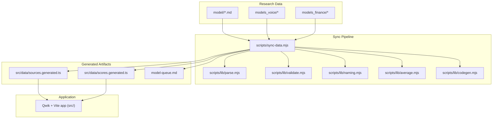
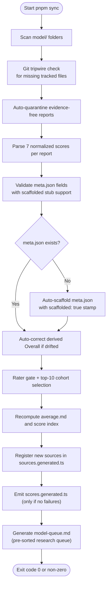
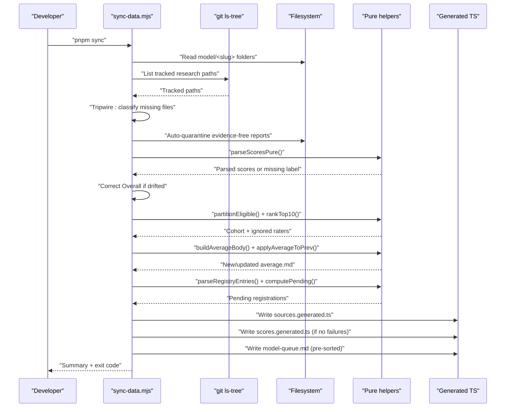
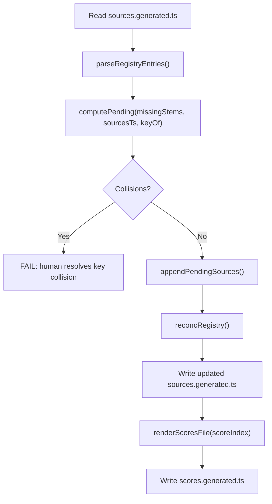
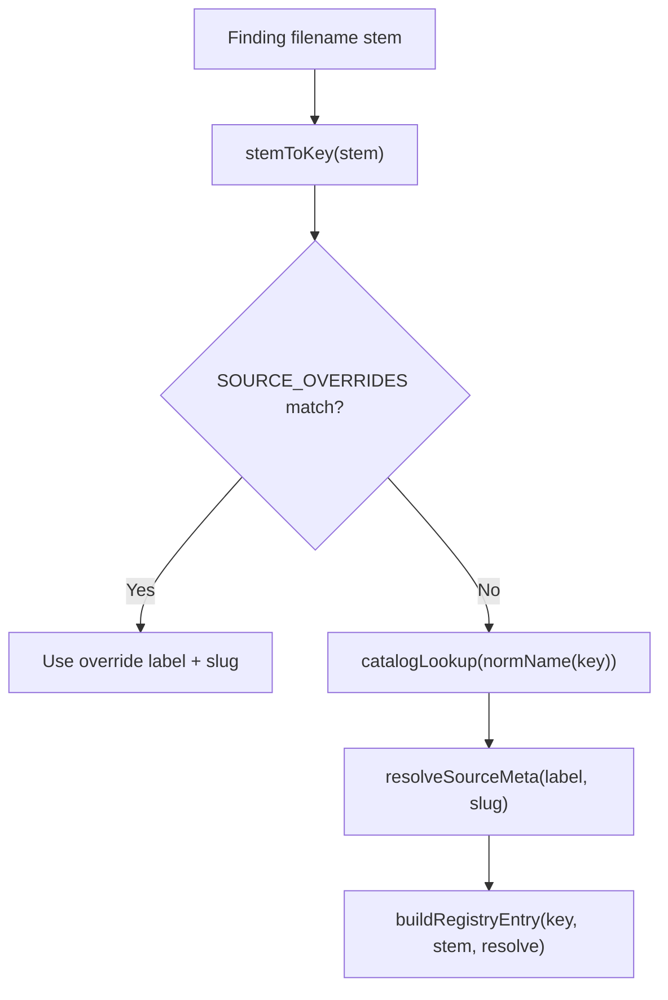
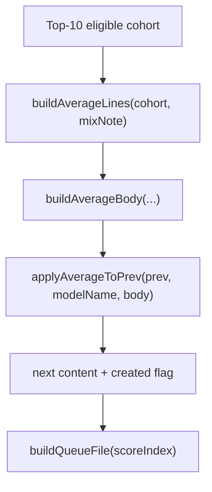
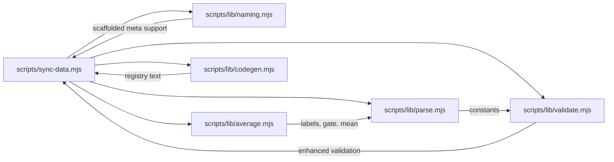

# Build & Development Pipeline

<cite>
**Referenced Files in This Document**
- [package.json](file://package.json)
- [sync-data.mjs](file://scripts/sync-data.mjs)
- [parse.mjs](file://scripts/lib/parse.mjs)
- [validate.mjs](file://scripts/lib/validate.mjs)
- [naming.mjs](file://scripts/lib/naming.mjs)
- [average.mjs](file://scripts/lib/average.mjs)
- [codegen.mjs](file://scripts/lib/codegen.mjs)
- [sync-data.md](file://tasks/sync-data.md)
- [research.md](file://tasks/research.md)
- [research-assign.md](file://tasks/research-assign.md)
- [REPORT.md](file://REPORT.md)
</cite>

## Update Summary
**Changes Made**
- Updated scaffolded meta.json support documentation to reflect the enhanced auto-scaffolding system with `scaffolded: true` stamp tracking
- Enhanced validation rules section to document improved meta.json field validation and underscore detection
- Added PowerShell shell tips documentation for Windows-based research workflows
- Updated development workflow to include pre-sorted research queue generation via model-queue.md
- Revised troubleshooting guide with scaffolded stub management and PowerShell-specific guidance

## Table of Contents
1. [Introduction](#introduction)
2. [Project Structure](#project-structure)
3. [Core Components](#core-components)
4. [Architecture Overview](#architecture-overview)
5. [Detailed Component Analysis](#detailed-component-analysis)
6. [Enhanced Meta.json Scaffolding System](#enhanced-meta-json-scaffolding-system)
7. [Improved Validation Rules](#improved-validation-rules)
8. [PowerShell Shell Tips and Windows Support](#powershell-shell-tips-and-windows-support)
9. [Pre-sorted Research Queue Generation](#pre-sorted-research-queue-generation)
10. [Dependency Analysis](#dependency-analysis)
11. [Performance Considerations](#performance-considerations)
12. [Troubleshooting Guide](#troubleshooting-guide)
13. [Conclusion](#conclusion)
14. [Appendices](#appendices)

## Introduction
This document explains the ModelComp build and development pipeline that turns research markdown files into deterministic TypeScript data structures consumed by the static site. The central process is a Node.js synchronization script that scans model folders, parses scoring reports, validates metadata with enhanced scaffolding support, recomputes averages, registers new sources, and emits compact generated TypeScript files. The pipeline is designed to be reproducible: it fails loudly on invalid input, auto-corrects derived values where safe, and only writes generated artifacts when no failures are present.

The high-level workflow is:
- Add or edit markdown findings under `model/<slug>/`.
- Run the sync script to parse, validate with scaffolded meta.json support, compute averages, register sources, and generate TypeScript.
- Utilize the pre-sorted research queue (`model-queue.md`) for efficient agent task assignment.
- Use PowerShell shell tips for Windows-based development workflows.
- Run type checking and the Vite build to verify the final static site.
- Deploy according to the project's deployment configuration.

## Project Structure
At a high level, the repository contains:
- Markdown research data under `model/`, plus mirrored research trees under `models_voice/` and `models_finance/`.
- A Node-based sync pipeline under `scripts/`, with pure helper modules under `scripts/lib/`.
- Generated TypeScript data under `src/data/`.
- Pre-sorted research queue file `model-queue.md` for efficient task assignment.
- A Qwik/Vite application under `src/` and root configuration files such as `package.json`, `tsconfig.json`, and `vite.config.ts`.



**Diagram sources**
- [sync-data.mjs:1-579](file://scripts/sync-data.mjs#L1-L579)
- [parse.mjs:1-124](file://scripts/lib/parse.mjs#L1-L124)
- [validate.mjs:1-98](file://scripts/lib/validate.mjs#L1-L98)
- [naming.mjs:1-102](file://scripts/lib/naming.mjs#L1-L102)
- [average.mjs:1-101](file://scripts/lib/average.mjs#L1-L101)
- [codegen.mjs:1-140](file://scripts/lib/codegen.mjs#L1-L140)

**Section sources**
- [package.json:1-41](file://package.json#L1-L41)
- [sync-data.md:1-130](file://tasks/sync-data.md#L1-L130)

## Core Components
The pipeline has one orchestrator, several pure helpers, and enhanced scaffolding capabilities:

- Orchestrator: `scripts/sync-data.mjs`
  - Scans model directories with enhanced meta.json scaffolding support.
  - Enforces permanence via git tripwire checks.
  - Auto-quarantines evidence-free reports.
  - Parses seven normalized scores per report.
  - Auto-corrects derived Overall scores within tolerance.
  - Applies rater gating and top-10 cohort averaging.
  - Recomputes and rewrites `average.md` where needed.
  - Registers new reporting-agent filenames in the source registry.
  - Emits compact TypeScript score data for the client bundle.
  - Generates pre-sorted research queue for efficient task assignment.

- Pure helpers:
  - `scripts/lib/parse.mjs`: score labels, short keys, parsing, drift detection, cohort ranking, rater gating, and label sorting.
  - `scripts/lib/validate.mjs`: research path classification, mirror relocation detection, filename hygiene, and enhanced meta.json validation.
  - `scripts/lib/naming.mjs`: slug conventions, key derivation, display label resolution, virtual view keys, slug-name guess formatting, and scaffolded meta.json support.
  - `scripts/lib/average.mjs`: average.md body generation, entry serialization, merge logic, and research queue file generation.
  - `scripts/lib/codegen.mjs`: registry text surgery, union member handling, pending registration computation, and deterministic scores file rendering.

**Section sources**
- [sync-data.mjs:1-579](file://scripts/sync-data.mjs#L1-L579)
- [parse.mjs:1-124](file://scripts/lib/parse.mjs#L1-L124)
- [validate.mjs:1-98](file://scripts/lib/validate.mjs#L1-L98)
- [naming.mjs:1-102](file://scripts/lib/naming.mjs#L1-L102)
- [average.mjs:1-101](file://scripts/lib/average.mjs#L1-L101)
- [codegen.mjs:1-140](file://scripts/lib/codegen.mjs#L1-L140)

## Architecture Overview
The sync pipeline follows a strict sequence: scan, quarantine, parse, validate with scaffolded meta.json support, gate, average, register, and emit. It separates side-effectful orchestration from pure logic so behavior is testable and deterministic. The enhanced system now includes automatic scaffolding for missing meta.json files and pre-sorted research queue generation.



**Diagram sources**
- [sync-data.mjs:133-579](file://scripts/sync-data.mjs#L133-L579)
- [parse.mjs:38-124](file://scripts/lib/parse.mjs#L38-L124)
- [validate.mjs:11-98](file://scripts/lib/validate.mjs#L11-L98)
- [average.mjs:10-101](file://scripts/lib/average.mjs#L10-L101)
- [codegen.mjs:9-140](file://scripts/lib/codegen.mjs#L9-L140)

## Detailed Component Analysis

### Sync Orchestrator: scripts/sync-data.mjs
The orchestrator coordinates all phases and owns filesystem operations, logging, failure accounting, and exit codes. Key responsibilities include:
- Deterministic scanning and sorting of model folders.
- Permanence enforcement using git HEAD to detect forbidden deletions.
- Auto-quarantine of reports with insufficient evidence.
- Parsing and validating each report's seven scores.
- Auto-correcting Overall scores when they drift beyond tolerance.
- Applying the rater gate and selecting the top-10 cohort.
- Rebuilding `average.md` while preserving headers.
- Updating the source registry and reconciling labels/slugs.
- Generating a compact, deterministic TypeScript score map.
- Managing scaffolded meta.json stubs with lifecycle tracking.
- Generating pre-sorted research queue for efficient task assignment.



**Diagram sources**
- [sync-data.mjs:133-579](file://scripts/sync-data.mjs#L133-L579)
- [parse.mjs:94-124](file://scripts/lib/parse.mjs#L94-L124)
- [average.mjs:83-101](file://scripts/lib/average.mjs#L83-L101)
- [codegen.mjs:14-84](file://scripts/lib/codegen.mjs#L14-L84)

**Section sources**
- [sync-data.mjs:1-579](file://scripts/sync-data.mjs#L1-L579)

### Data Extraction and Validation: scripts/lib/parse.mjs and scripts/lib/validate.mjs
Parsing and validation are intentionally pure:
- `parse.mjs` defines the canonical score labels, short keys, quality dimensions, rater gate threshold, drift tolerance, and functions for mean calculation, cohort ranking, and eligibility partitioning.
- `validate.mjs` classifies research paths, detects sanctioned mirror relocations, enforces filename hygiene, and validates required meta.json fields with enhanced error reporting.

Important invariants:
- Score lines must match the exact label set and format.
- Overall is derived from five quality dimensions; cost is scored but excluded from Overall.
- Rater gate uses a strict threshold; exactly at the threshold does not qualify.
- Filename hygiene rejects characters outside letters, digits, underscore, and dots.

```mermaid
classDiagram
class Parse {
+LABELS
+SHORT
+QUALITY_DIMS
+META_REQUIRED
+FILENAME_RE
+RATER_GATE
+OVERALL_TOLERANCE
+halfUp1(x)
+parseScoresPure(md)
+shortenScores(scores)
+overallDrift(scores, tolerance)
+applyOverallFix(content, corrected)
+meanOf(cohort, label)
+rankTop10(eligible)
+partitionEligible(perFile, resolveSlug, raterOwn, gate)
+sortLabelsAZ(labels)
}
class Validate {
+MIRROR_ROOTS
+FORBIDDEN_ROOTS
+isResearchPath(posix)
+isRegenerablePath(posix)
+classifyMissingTracked({ twinRetired, mirror })
+findMirror(parts, mirrorRoots, existsAt)
+deletionFailMessage(posix)
+checkFilename(slug, f)
+checkMetaFile(slug, meta, required)
}
Parse <.. Validate : "shared constants"
```

**Diagram sources**
- [parse.mjs:8-124](file://scripts/lib/parse.mjs#L8-L124)
- [validate.mjs:9-98](file://scripts/lib/validate.mjs#L9-L98)

**Section sources**
- [parse.mjs:1-124](file://scripts/lib/parse.mjs#L1-L124)
- [validate.mjs:1-98](file://scripts/lib/validate.mjs#L1-L98)

### Code Generation and Source Registration: scripts/lib/codegen.mjs
Codegen handles two outputs:
- Registry surgery in `src/data/sources.generated.ts`:
  - Parses existing SOURCE_DEFS entries and SourceKey union members.
  - Computes pending registrations for new stems.
  - Detects collisions where a stem maps to an already registered key.
  - Appends new entries and updates the union if needed.
  - Reconciles labels and inline slugs idempotently.
  - Prunes grandfathered virtual-view entries.
- Scores file emission:
  - Renders a deterministic TypeScript interface and record mapping slugs to short-keyed scores.



**Diagram sources**
- [codegen.mjs:9-140](file://scripts/lib/codegen.mjs#L9-L140)

**Section sources**
- [codegen.mjs:1-140](file://scripts/lib/codegen.mjs#L1-L140)

### Naming and Slug Conventions: scripts/lib/naming.mjs
Naming utilities enforce consistent slug-to-key-to-slug resolution:
- Normalize names for catalog lookups.
- Derive source keys from filenames.
- Resolve display labels and model-page slugs using overrides and catalog lookup.
- Detect hyphen-version violations and provide dotted suggestions.
- Define virtual sort-view keys that never appear in the registry.
- Generate slug guesses for auto-scaffolded meta.json entries.
- Manage scaffolded meta.json lifecycle with stamp tracking.



**Diagram sources**
- [naming.mjs:8-102](file://scripts/lib/naming.mjs#L8-L102)
- [codegen.mjs:25-35](file://scripts/lib/codegen.mjs#L25-L35)

**Section sources**
- [naming.mjs:1-102](file://scripts/lib/naming.mjs#L1-L102)

### Average Computation: scripts/lib/average.mjs
Average computation ensures every folder has a deterministic average:
- Builds mix notes explaining fallback, trimming, and rater gating.
- Serializes short-keyed average entries for the score index.
- Generates the averaged score lines and agreement notes.
- Merges computed bodies into existing average.md while preserving headers.
- Generates pre-sorted research queue file for efficient task assignment.



**Diagram sources**
- [average.mjs:10-101](file://scripts/lib/average.mjs#L10-L101)

**Section sources**
- [average.mjs:1-101](file://scripts/lib/average.mjs#L1-L101)

## Enhanced Meta.json Scaffolding System

### Purpose and Functionality
The enhanced meta.json scaffolding system automatically creates missing meta.json files with appropriate placeholder data and tracks their lifecycle through a `scaffolded: true` stamp mechanism. This prevents build failures while ensuring developers are reminded to curate the generated entries.

### Auto-Scaffolding Process
When a meta.json file is missing, the system:
1. Creates a scaffolded meta.json with slug-guessed name (title-cased version of folder name).
2. Stamps the file with `scaffolded: true` to mark it as uncurated.
3. Logs an AUTO message indicating the file was auto-scaffolded.
4. Warns that the name is a slug guess requiring official vendor name replacement.

### Scaffolded Stub Lifecycle Management
The system tracks scaffolded stubs across runs:
- **SCAF**: Re-logs scaffolded stubs that still have the slug-guess name.
- **CURATED**: When a human sets the official vendor name, the `scaffolded` stamp is removed.
- **Summary**: Reports count of scaffolded stubs pending curation.

### Validation Integration
Scaffolded meta.json files pass validation because:
- All required fields are populated with placeholder values.
- The `scaffolded` field is ignored during validation (extra fields allowed).
- Underscore detection works correctly with slug-guessed names.

**Section sources**
- [sync-data.mjs:318-358](file://scripts/sync-data.mjs#L318-L358)
- [naming.mjs:49-91](file://scripts/lib/naming.mjs#L49-L91)
- [validate.mjs:84-97](file://scripts/lib/validate.mjs#L84-L97)

## Improved Validation Rules

### Enhanced Meta.json Validation
The validation system now provides more comprehensive meta.json validation:

#### Required Field Checking
- Validates presence and non-empty status of all required fields: `id`, `name`, `short`, `contextWindow`, `modalities`, `pricingNote`.
- Provides specific error messages for missing or empty fields.

#### Display Name Validation
- Rejects display names containing underscores (slug artifacts).
- Ensures proper spacing in vendor display names.
- Provides clear error messages guiding users to use spaces instead of underscores.

#### Scaffolded Field Handling
- Ignores the `scaffolded` field during validation (allows extra fields).
- Maintains backward compatibility with scaffolded stubs.

### Filename Hygiene Improvements
- Strict regex validation for finding filenames: `/^[A-Za-z0-9_.]+\.md$/`.
- Clear error messages for filename violations.
- Consistent validation across all research files.

**Section sources**
- [validate.mjs:71-97](file://scripts/lib/validate.mjs#L71-L97)
- [parse.mjs:33-36](file://scripts/lib/parse.mjs#L33-L36)

## PowerShell Shell Tips and Windows Support

### Windows-Specific Build Commands
The project provides Windows-compatible build commands to avoid cmd.exe line length limitations:

#### Direct Build Commands
- `pnpm build.types:direct`: Uses direct Node.js invocation for TypeScript compilation.
- `pnpm build:direct`: Uses direct Node.js invocation for Vite builds.
- These bypass the ~8k line limit in cmd.exe that affects standard shims.

### PowerShell Shell Tips for Research Tasks
The research workflow includes PowerShell-specific guidance for Windows developers:

#### Directory Listing and Filtering
- Use `Select-Object -First N` instead of Unix `head` command.
- Avoid Unix pipes (`grep`, `awk`) that don't work in PowerShell.
- Use Read tool for directory listings when possible.

#### Command Examples
```powershell
# List first 10 directories
Get-ChildItem 'model' -Directory | Select-Object -First 10

# Filter directories matching pattern
Get-ChildItem 'model' -Directory | Where-Object { $_.Name -like '*flash*' } | Select-Object -First 5
```

### Agent Hardening for PowerShell
The research task instructions include PowerShell-specific guidance to prevent common failures:
- Explicit mention of PowerShell environment in Step 1.
- Alternative command syntax for Windows environments.
- Tool recommendations that work reliably in PowerShell.

**Section sources**
- [sync-data.md:14-21](file://tasks/sync-data.md#L14-L21)
- [research.md:75](file://tasks/research.md#L75)
- [gemini-rate-limits.md:44-50](file://.agents/gemini-rate-limits.md#L44-L50)

## Pre-sorted Research Queue Generation

### Purpose and Benefits
The pre-sorted research queue (`model-queue.md`) eliminates token waste from agents repeatedly scanning all model folders to determine evaluation priorities. Instead of computing queue order dynamically, agents read one pre-sorted file.

### Queue Generation Process
During sync execution:
1. After generating `scores.generated.ts`, the system creates `model-queue.md`.
2. Each line contains `<Overall> <slug>` format.
3. Models are sorted by Overall score (descending), then alphabetically (ascending) for ties.
4. Only models with successful parsing contribute to the queue.
5. The queue is only written when sync has zero failures.

### Usage in Research Workflow
Research agents use the queue as follows:
1. Read `model-queue.md` once at task start.
2. Process folders in the provided order (highest Overall first).
3. Skip folders already containing their assigned file.
4. Fall back to manual scanning only if queue file is missing/stale.

### Fallback Mechanism
If `model-queue.md` is missing or stale:
- Agents fall back to parsing `- **Overall Score:**` lines from each `average.md`.
- Sort manually by Overall score descending.
- This maintains functionality while encouraging queue usage.

**Section sources**
- [sync-data.mjs:543-559](file://scripts/sync-data.mjs#L543-L559)
- [research.md:52-57](file://tasks/research.md#L52-L57)
- [research-assign.md:29](file://tasks/research-assign.md#L29)

## Dependency Analysis
The sync pipeline composes pure modules to keep orchestration focused on I/O and policy decisions. The enhanced system adds scaffolded meta.json support and research queue generation.



**Diagram sources**
- [sync-data.mjs:30-80](file://scripts/sync-data.mjs#L30-L80)
- [parse.mjs:8-45](file://scripts/lib/parse.mjs#L8-L45)
- [validate.mjs:9-12](file://scripts/lib/validate.mjs#L9-L12)
- [average.mjs:10-11](file://scripts/lib/average.mjs#L10-L11)
- [codegen.mjs:1-7](file://scripts/lib/codegen.mjs#L1-L7)
- [naming.mjs:49-91](file://scripts/lib/naming.mjs#L49-L91)

**Section sources**
- [sync-data.mjs:30-80](file://scripts/sync-data.mjs#L30-L80)
- [parse.mjs:8-45](file://scripts/lib/parse.mjs#L8-L45)
- [validate.mjs:9-12](file://scripts/lib/validate.mjs#L9-L12)
- [average.mjs:10-11](file://scripts/lib/average.mjs#L10-L11)
- [codegen.mjs:1-7](file://scripts/lib/codegen.mjs#L1-L7)

## Performance Considerations
- Avoid shipping markdown prose to the client: the pipeline emits `src/data/scores.generated.ts` with numbers only, keeping large report text out of the Vite bundle.
- Deterministic output: sorted slugs and files ensure stable generated artifacts, improving cacheability and reducing unnecessary diffs.
- Quiet mode: use `pnpm sync:quiet` for large repositories to reduce console noise while preserving identical checks and writes.
- Incremental type checking: `pnpm build.types` uses TypeScript incremental mode to speed up repeated checks.
- Avoid eager raw imports of markdown: the generated scores approach replaces expensive glob imports that previously inlined large chunks of markdown.
- Pre-sorted research queue: eliminates token waste from dynamic queue computation by providing pre-sorted model-queue.md.
- Scaffolded meta.json efficiency: auto-scaffolding prevents build failures while maintaining validation integrity.

## Troubleshooting Guide
Common issues and resolutions:

- Missing tracked research file detected:
  - Cause: A git-tracked `.md` or `.md.excluded` file is absent from disk.
  - Resolution: Restore the file from HEAD unless it was relocated to a sanctioned mirror tree or replaced by its twin.
  - Reference: tripwire classification and deletion message.

- Hyphenated version slug:
  - Cause: Folder slug uses a hyphen between digits instead of a dot.
  - Resolution: Rename to the dotted suggestion provided by the sync script.

- Evidence-free report quarantined:
  - Cause: Report has many "no verified public score found" rows and zero measured values.
  - Resolution: Investigate benchmarks and either add verified data or accept the `.excluded` rename.

- Overall score drift:
  - Cause: Overall does not equal the half-up mean of the five quality dimensions beyond tolerance.
  - Resolution: Allow sync to auto-correct or manually fix the Overall line if auto-fix fails.

- Scaffolded meta.json issues:
  - Cause: Missing meta.json files are auto-scaffolded with placeholder data.
  - Resolution: Replace slug-guessed names with official vendor names and update placeholder facts. Look for SCAF messages in sync output.
  - Note: The `scaffolded: true` stamp is automatically removed when you set the official name.

- Meta.json validation failure:
  - Cause: Required fields missing or name contains underscores.
  - Resolution: Fill in required fields and replace underscores with spaces in the vendor display name.

- New source not registered:
  - Cause: Finding filename not present in the source registry.
  - Resolution: Re-run sync to append missing entries; resolve collisions manually if reported.

- Generated scores not emitted:
  - Cause: Sync had failures during the run.
  - Resolution: Fix all FAIL lines and re-run sync; generated files are only written when there are zero failures.

- PowerShell command failures:
  - Cause: Using Unix commands like `head`, `grep`, or pipes in PowerShell environment.
  - Resolution: Use PowerShell equivalents like `Select-Object -First N` and avoid Unix pipes.

- Research queue not available:
  - Cause: model-queue.md not generated due to sync failures or previous run issues.
  - Resolution: Run `pnpm sync` successfully to regenerate the queue file.

**Section sources**
- [sync-data.mjs:133-579](file://scripts/sync-data.mjs#L133-L579)
- [validate.mjs:46-97](file://scripts/lib/validate.mjs#L46-L97)
- [parse.mjs:38-87](file://scripts/lib/parse.mjs#L38-L87)
- [sync-data.md:19-64](file://tasks/sync-data.md#L19-L64)

## Conclusion
ModelComp's build and development pipeline centers on a deterministic sync process that transforms research markdown into typed, compact data structures. By separating orchestration from pure logic, enforcing strong invariants, and generating only what the application needs, the pipeline keeps the static site fast, reliable, and easy to maintain. The enhanced system now includes sophisticated scaffolded meta.json support with lifecycle tracking, improved validation rules, PowerShell shell tips for Windows compatibility, and pre-sorted research queue generation for efficient agent task assignment. Developers should follow the checklist in the task documentation, rely on the sync script's feedback, utilize the pre-sorted queue for research tasks, and verify builds before deployment.

## Appendices

### Development Workflow
Recommended steps after adding or editing model data:
1. Add or update markdown findings under `model/<slug>/`.
2. Ensure each model folder has a valid `meta.json` (auto-scaffolded if missing).
3. Run `pnpm sync` (or `pnpm sync:quiet` for large repos).
4. Review any FAIL, QUAR, GATE, AUTO, WRITE, REG, INFO, or SCAF lines.
5. Handle scaffolded meta.json stubs by setting official vendor names.
6. Run `pnpm build.types` to verify TypeScript.
7. Run `pnpm build` to produce the static site.
8. Update `REPORT.md` as required by the team workflow.

**Section sources**
- [sync-data.md:8-18](file://tasks/sync-data.md#L8-L18)
- [sync-data.md:66-114](file://tasks/sync-data.md#L66-L114)

### Build Scripts Summary
- `pnpm sync`: Runs the deterministic sync pipeline with enhanced scaffolding.
- `pnpm sync:quiet`: Same checks and writes with reduced console output.
- `pnpm build.types`: Type-checks TypeScript incrementally.
- `pnpm build.types:direct`: Direct Node.js TypeScript compilation for Windows.
- `pnpm build`: Builds the Qwik application.
- `pnpm build.client`: Builds the client bundle.
- `pnpm build.server`: Builds the server adapter for static hosting.
- `pnpm build:direct`: Direct Node.js Vite build for Windows.
- `pnpm dev`: Starts the development server.
- `pnpm preview`: Previews the built site locally.

**Section sources**
- [package.json:11-27](file://package.json#L11-L27)

### PowerShell Command Reference

#### Windows Build Commands
```powershell
# Standard build (may fail on Windows due to line length limits)
pnpm sync && pnpm build.types && pnpm build

# Windows-compatible build (recommended)
pnpm sync && pnpm build.types:direct && pnpm build:direct
```

#### PowerShell Research Tips
```powershell
# List directories (Windows PowerShell compatible)
Get-ChildItem 'model' -Directory | Select-Object -First 10

# Filter and process directories
Get-ChildItem 'model' -Directory | Where-Object { $_.Name -like '*flash*' } | ForEach-Object { 
    Write-Host $_.Name 
}

# Check file existence
Test-Path 'model/<slug>/<STEM>.md'
```

**Section sources**
- [sync-data.md:14-21](file://tasks/sync-data.md#L14-L21)
- [research.md:75](file://tasks/research.md#L75)