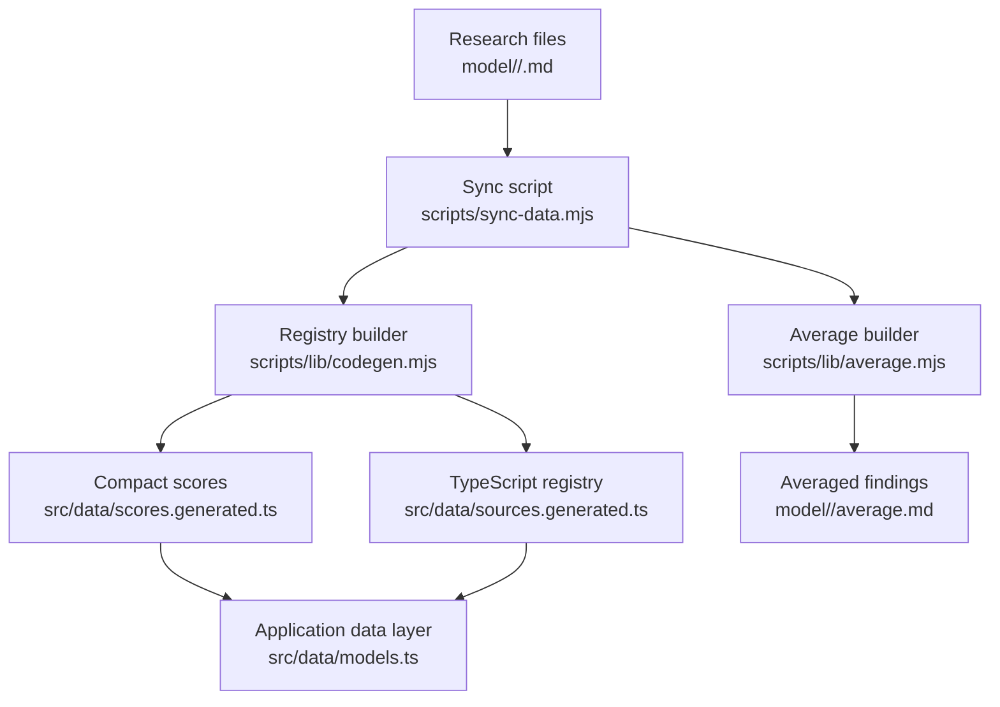
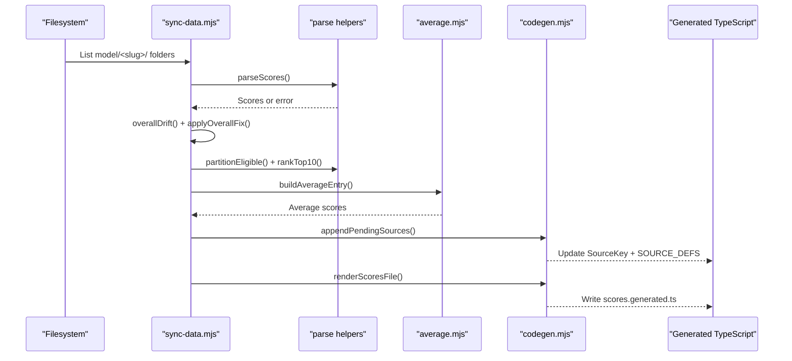
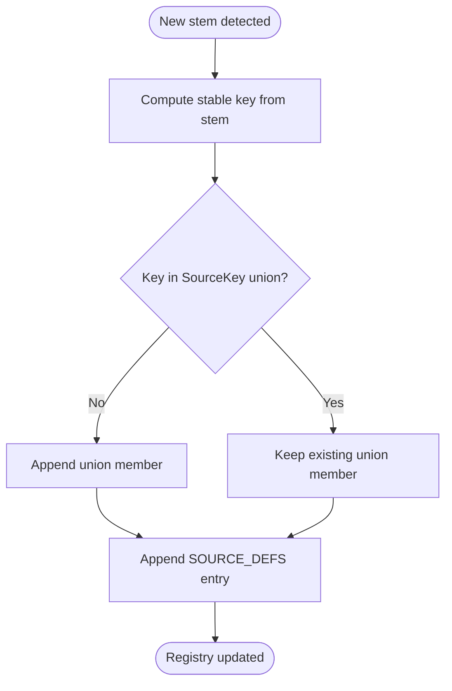
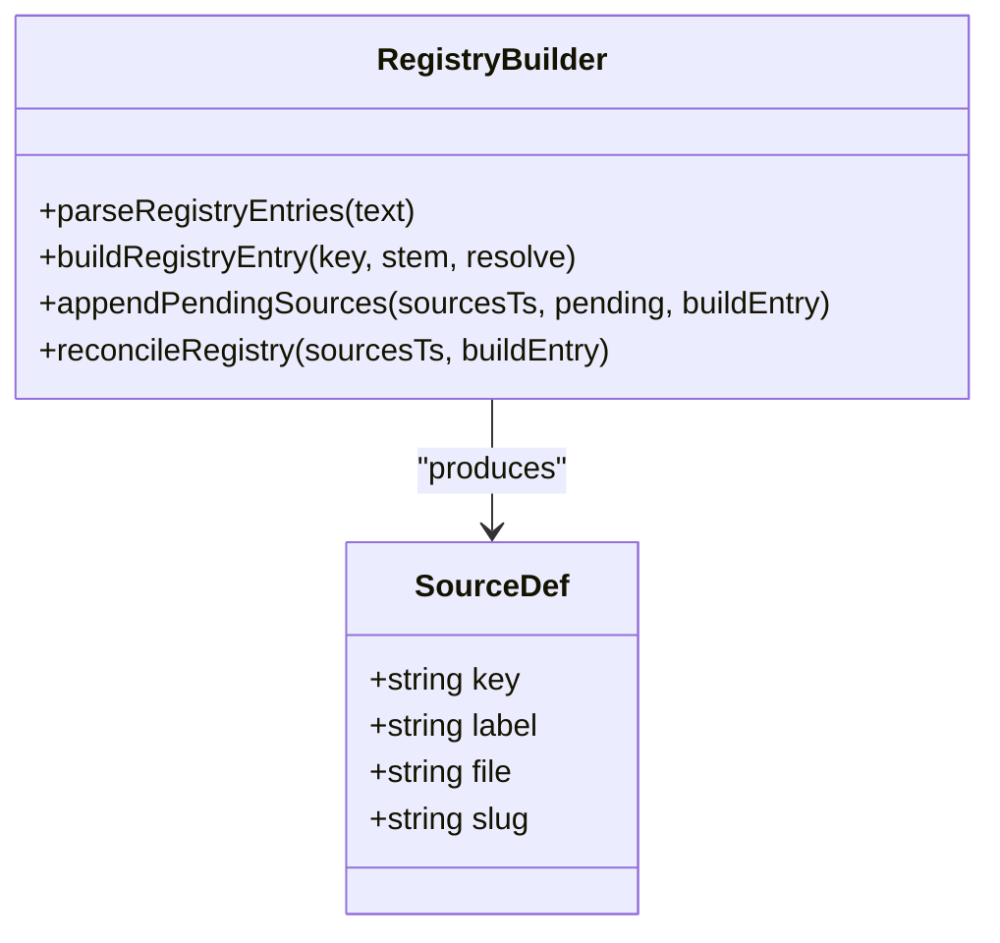
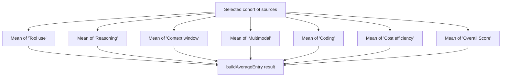
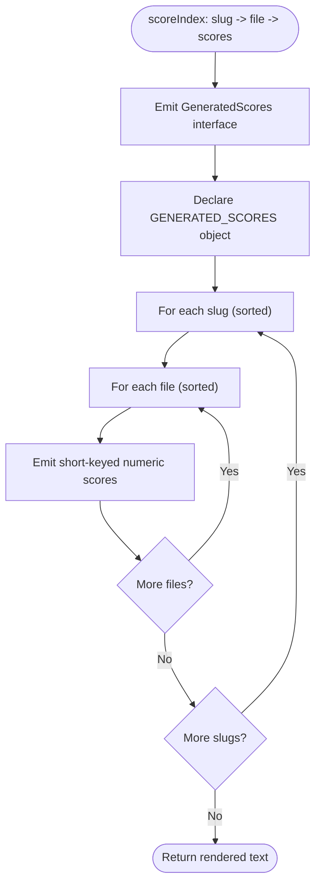
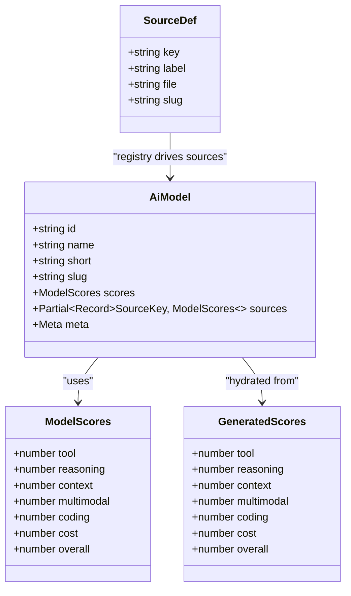
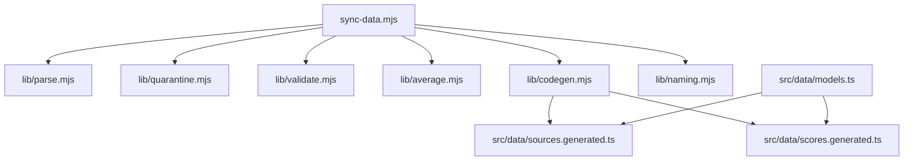

# Code Generation System

<cite>
**Referenced Files in This Document**
- [README.md](file://README.md)
- [sync-data.mjs](file://scripts/sync-data.mjs)
- [codegen.mjs](file://scripts/lib/codegen.mjs)
- [average.mjs](file://scripts/lib/average.mjs)
- [sources.generated.ts](file://src/data/sources.generated.ts)
- [scores.generated.ts](file://src/data/scores.generated.ts)
- [catalog.generated.ts](file://src/data/catalog.generated.ts)
- [models.ts](file://src/data/models.ts)
</cite>

## Table of Contents
1. [Introduction](#introduction)
2. [Project Structure](#project-structure)
3. [Core Components](#core-components)
4. [Architecture Overview](#architecture-overview)
5. [Detailed Component Analysis](#detailed-component-analysis)
6. [Dependency Analysis](#dependency-analysis)
7. [Performance Considerations](#performance-considerations)
8. [Troubleshooting Guide](#troubleshooting-guide)
9. [Conclusion](#conclusion)

## Introduction
This document explains the code generation system that transforms parsed model data into TypeScript interfaces and runtime structures used by the application. The system is driven by a deterministic sync script that scans research files, validates scores, recomputes averages, registers new reporting agents, and emits compact TypeScript artifacts consumed at build time.

The key goals are:
- Generate a `SourceKey` union type representing every registered reporting agent.
- Maintain a `SOURCE_DEFS` registry mapping each source key to its display label, filename, and optional tracked model slug.
- Emit a compact `scores.generated.ts` containing only numeric scores per model and per source file.
- Build average model representations from eligible top-ranked sources.
- Keep the client bundle small by avoiding raw markdown prose.
- Preserve type safety while processing dynamic model data through generated TypeScript types and strict validation.

## Project Structure
At a high level, the system lives under `scripts/`, with generated TypeScript artifacts under `src/data/`. The README describes the end-to-end flow: research files under `model/<slug>/` are pre-parsed by the sync process into generated score and source registry files, which are then imported by the application’s data layer.

**Diagram sources**
- [README.md:31-44](file://README.md#L31-L44)
- [sync-data.mjs:30-67](file://scripts/sync-data.mjs#L30-L67)
- [codegen.mjs:107-139](file://scripts/lib/codegen.mjs#L107-L139)
- [average.mjs:33-44](file://scripts/lib/average.mjs#L33-L44)

**Section sources**
- [README.md:31-44](file://README.md#L31-L44)

## Core Components
The code generation system has three primary responsibilities:

1. **Registry generation**: Create or update the `SourceKey` union and `SOURCE_DEFS` array in `src/data/sources.generated.ts`.
2. **Score serialization**: Produce `src/data/scores.generated.ts`, a compact map of model slugs to short-keyed numeric scores.
3. **Average computation**: Recompute `model/<slug>/average.md` and emit an average entry for the generated score index.

These responsibilities are implemented by:
- `scripts/sync-data.mjs`: Orchestrates scanning, validation, quarantine, rater gating, registry reconciliation, and artifact emission.
- `scripts/lib/codegen.mjs`: Pure functions for parsing and building registry text and rendering the scores file.
- `scripts/lib/average.mjs`: Pure functions for computing average entries and assembling average documentation.
- `src/data/sources.generated.ts`: Generated TypeScript types and registry consumed by the app.
- `src/data/scores.generated.ts`: Generated numeric-only score map consumed by the app.
- `src/data/models.ts`: Hydrates runtime models from generated scores and metadata.

**Section sources**
- [sync-data.mjs:1-75](file://scripts/sync-data.mjs#L1-L75)
- [codegen.mjs:1-8](file://scripts/lib/codegen.mjs#L1-L8)
- [average.mjs:1-9](file://scripts/lib/average.mjs#L1-L9)
- [sources.generated.ts:1-80](file://src/data/sources.generated.ts#L1-L80)
- [scores.generated.ts:1-16](file://src/data/scores.generated.ts#L1-L16)
- [models.ts:6-19](file://src/data/models.ts#L6-L19)

## Architecture Overview
The sync pipeline is deterministic and staged:

1. Scan model folders and validate filenames and metadata.
2. Parse normalized scores from each findings file.
3. Auto-correct drifted Overall values when possible.
4. Apply rater gating and top-10 cohort selection.
5. Recompute and rewrite `average.md` where needed.
6. Register new sources in the TypeScript registry.
7. Reconcile labels and inline slugs.
8. Render compact scores for the client bundle.

**Diagram sources**
- [sync-data.mjs:119-126](file://scripts/sync-data.mjs#L119-L126)
- [sync-data.mjs:343-370](file://scripts/sync-data.mjs#L343-L370)
- [sync-data.mjs:372-435](file://scripts/sync-data.mjs#L372-L435)
- [sync-data.mjs:438-480](file://scripts/sync-data.mjs#L438-L480)
- [sync-data.mjs:490-523](file://scripts/sync-data.mjs#L490-L523)
- [codegen.mjs:71-84](file://scripts/lib/codegen.mjs#L71-L84)
- [codegen.mjs:111-139](file://scripts/lib/codegen.mjs#L111-L139)
- [average.mjs:33-44](file://scripts/lib/average.mjs#L33-L44)

## Detailed Component Analysis

### SourceKey Union Type Generation
The `SourceKey` union type enumerates every registered reporting agent. It is maintained alongside the `SOURCE_DEFS` array so that TypeScript can enforce valid source keys across the application.

How it works:
- The sync script parses existing `SourceKey` union members.
- For each on-disk stem not already registered, it computes a stable key using naming helpers.
- If the key is missing from both `SOURCE_DEFS` and the union, it is appended to both.
- Collisions (same key mapped to different filenames) fail loudly and require manual resolution.

**Diagram sources**
- [codegen.mjs:19-23](file://scripts/lib/codegen.mjs#L19-L23)
- [codegen.mjs:44-57](file://scripts/lib/codegen.mjs#L44-L57)
- [codegen.mjs:71-84](file://scripts/lib/codegen.mjs#L71-L84)
- [sync-data.mjs:438-468](file://scripts/sync-data.mjs#L438-L468)

**Section sources**
- [sources.generated.ts:5-66](file://src/data/sources.generated.ts#L5-L66)
- [codegen.mjs:19-23](file://scripts/lib/codegen.mjs#L19-L23)
- [codegen.mjs:44-57](file://scripts/lib/codegen.mjs#L44-L57)
- [codegen.mjs:71-84](file://scripts/lib/codegen.mjs#L71-L84)
- [sync-data.mjs:438-468](file://scripts/sync-data.mjs#L438-L468)

### SOURCE_DEFS Registry Creation
`SOURCE_DEFS` is the canonical registry of reporting agents. Each entry includes:
- `key`: Stable identifier matching a `SourceKey`.
- `label`: Display name shown in UI dropdowns and tables.
- `file`: Original findings filename.
- `slug?`: Optional tracked model-page slug for the reporting agent.

The registry is idempotently reconciled:
- Labels and inline slugs are refreshed based on catalog lookups and overrides.
- Virtual sort views are pruned from the registry; they live in the application data layer instead.
- New entries are appended last; UI ordering is derived at build time.

**Diagram sources**
- [sources.generated.ts:74-80](file://src/data/sources.generated.ts#L74-L80)
- [sources.generated.ts:82-144](file://src/data/sources.generated.ts#L82-L144)
- [codegen.mjs:14-17](file://scripts/lib/codegen.mjs#L14-L17)
- [codegen.mjs:25-35](file://scripts/lib/codegen.mjs#L25-L35)
- [codegen.mjs:71-84](file://scripts/lib/codegen.mjs#L71-L84)
- [codegen.mjs:86-105](file://scripts/lib/codegen.mjs#L86-L105)

**Section sources**
- [sources.generated.ts:74-144](file://src/data/sources.generated.ts#L74-L144)
- [codegen.mjs:14-17](file://scripts/lib/codegen.mjs#L14-L17)
- [codegen.mjs:25-35](file://scripts/lib/codegen.mjs#L25-L35)
- [codegen.mjs:71-84](file://scripts/lib/codegen.mjs#L71-L84)
- [codegen.mjs:86-105](file://scripts/lib/codegen.mjs#L86-L105)
- [sync-data.mjs:438-480](file://scripts/sync-data.mjs#L438-L480)

### scores.generated.ts Output Format
The generated scores file contains:
- A `GeneratedScores` interface describing the seven numeric fields.
- A `GENERATED_SCORES` object keyed by model slug, then by source filename, with short-keyed numeric scores.

This format keeps full report prose out of the client bundle and provides a strongly typed contract for the application.

Example structure (described, not pasted):
- Top-level export: `GENERATED_SCORES: Record<string, Record<string, GeneratedScores>>`
- Per-slug block: `"model-slug": { "Source_File.md": { tool, reasoning, context, multimodal, coding, cost, overall }, ... }`
- Deterministic ordering: slugs and filenames are sorted alphabetically.

**Section sources**
- [codegen.mjs:107-139](file://scripts/lib/codegen.mjs#L107-L139)
- [sync-data.mjs:490-523](file://scripts/sync-data.mjs#L490-L523)
- [scores.generated.ts:1-16](file://src/data/scores.generated.ts#L1-L16)

### buildAverageEntry Function
`buildAverageEntry` creates the average model representation used by the generated score index. It computes arithmetic means over the selected cohort:
- Six quality/pricing dimensions: Tool use, Reasoning, Context window, Multimodal, Coding, Cost efficiency.
- Overall Score: mean of the cohort’s Overall scores (not re-derived from averaged dimensions).

The function returns a `GeneratedScores`-compatible object, ensuring type safety between the sync pipeline and the generated output.

**Diagram sources**
- [average.mjs:33-44](file://scripts/lib/average.mjs#L33-L44)
- [sync-data.mjs:400-416](file://scripts/sync-data.mjs#L400-L416)

**Section sources**
- [average.mjs:33-44](file://scripts/lib/average.mjs#L33-L44)
- [sync-data.mjs:400-416](file://scripts/sync-data.mjs#L400-L416)

### renderScoresFile Function
`renderScoresFile` serializes the accumulated score index into the final `scores.generated.ts` content. It:
- Emits the `GeneratedScores` interface.
- Emits the `GENERATED_SCORES` object.
- Iterates over slugs and filenames in sorted order for determinism.
- Produces compact numeric-only entries.

**Diagram sources**
- [codegen.mjs:111-139](file://scripts/lib/codegen.mjs#L111-L139)
- [sync-data.mjs:490-523](file://scripts/sync-data.mjs#L490-L523)

**Section sources**
- [codegen.mjs:111-139](file://scripts/lib/codegen.mjs#L111-L139)
- [sync-data.mjs:490-523](file://scripts/sync-data.mjs#L490-L523)

### Type Safety with Dynamic Model Data
The system maintains type safety through generated TypeScript artifacts:
- `SourceKey` ensures only registered agents are referenced.
- `GeneratedScores` enforces the seven-field numeric shape.
- `GENERATED_SCORES` maps slugs and filenames to typed score objects.
- `SOURCE_DEFS` provides a runtime registry with consistent labels and slugs.
- `models.ts` hydrates `AiModel` instances from generated data, preserving type constraints.

**Diagram sources**
- [codegen.mjs:111-139](file://scripts/lib/codegen.mjs#L111-L139)
- [sources.generated.ts:74-80](file://src/data/sources.generated.ts#L74-L80)
- [models.ts:46-77](file://src/data/models.ts#L46-L77)

**Section sources**
- [sources.generated.ts:5-80](file://src/data/sources.generated.ts#L5-L80)
- [scores.generated.ts:1-16](file://src/data/scores.generated.ts#L1-L16)
- [models.ts:46-77](file://src/data/models.ts#L46-L77)

### Customization Options and Extension Points
Customization and extension points include:
- Adding new findings files: Drop `<Source_Name>.md` into model folders and run `pnpm sync`. The sync script auto-registers new sources and updates generated artifacts.
- Adding new models: Create `model/<slug>/` with findings and `meta.json`; sync creates `average.md` and generates scores.
- Overriding source labels and slugs: Use `SOURCE_OVERRIDES` in the sync script to adjust display names and tracked model-page slugs for specific sources.
- Extending data formats: Extend the pure helpers in `scripts/lib/` (parsing, averaging, codegen) and keep sync orchestration minimal.
- Virtual views: Extend `VIRTUAL_VIEWS` in `models.ts` to add new dimension-based ranking views without touching the registry.

**Section sources**
- [README.md:84-91](file://README.md#L84-L91)
- [sync-data.mjs:90-100](file://scripts/sync-data.mjs#L90-L100)
- [models.ts:251-258](file://src/data/models.ts#L251-L258)

## Dependency Analysis
The sync script composes several modules:
- Parsing and scoring helpers (`scripts/lib/parse.mjs`).
- Quarantine logic (`scripts/lib/quarantine.mjs`).
- Validation utilities (`scripts/lib/validate.mjs`).
- Averaging builders (`scripts/lib/average.mjs`).
- Code generation builders (`scripts/lib/codegen.mjs`).
- Naming utilities (`scripts/lib/naming.mjs`).

**Diagram sources**
- [sync-data.mjs:30-75](file://scripts/sync-data.mjs#L30-L75)
- [codegen.mjs:1-8](file://scripts/lib/codegen.mjs#L1-L8)
- [models.ts:18-19](file://src/data/models.ts#L18-L19)

**Section sources**
- [sync-data.mjs:30-75](file://scripts/sync-data.mjs#L30-L75)
- [models.ts:18-19](file://src/data/models.ts#L18-L19)

## Performance Considerations
- Client bundle size: Generating numeric-only scores avoids inlining ~1.7 MB of markdown prose into the client bundle.
- Deterministic output: Sorting slugs and filenames ensures stable diffs and reproducible builds.
- Avoiding eager imports: The app imports generated artifacts rather than globbing raw markdown, reducing runtime overhead.
- Rater gating and top-10 cohort selection limit the number of sources considered for averages, keeping computations bounded.

[No sources needed since this section provides general guidance]

## Troubleshooting Guide
Common issues and resolutions:
- Missing required metadata fields: Ensure `meta.json` has all required fields; sync scaffolds placeholders but warns about guessed names.
- Drifted Overall values: Sync auto-corrects Overall when possible; if not auto-fixable, manually correct the score line.
- Key collisions: When two stems map to the same label/key, sync fails with a collision message requiring manual resolution.
- Stale registry entries: Sync logs info messages for registered sources with no active findings files; remove or update them as needed.
- Skipping generated artifacts: If failures occur during sync, `scores.generated.ts` is not rewritten; fix errors and rerun.

**Section sources**
- [sync-data.mjs:297-326](file://scripts/sync-data.mjs#L297-L326)
- [sync-data.mjs:343-370](file://scripts/sync-data.mjs#L343-L370)
- [sync-data.mjs:452-468](file://scripts/sync-data.mjs#L452-L468)
- [sync-data.mjs:482-488](file://scripts/sync-data.mjs#L482-L488)
- [sync-data.mjs:496-523](file://scripts/sync-data.mjs#L496-L523)

## Conclusion
The code generation system provides a robust, deterministic pipeline that transforms dynamic model research data into strongly typed TypeScript artifacts. It maintains type safety through generated unions and interfaces, minimizes client bundle size by emitting compact numeric scores, and offers clear extension points for adding new sources, models, and data formats. The registry and score generation ensure that the application remains synchronized with the evolving research corpus while preserving developer ergonomics and build-time correctness.

[No sources needed since this section summarizes without analyzing specific files]