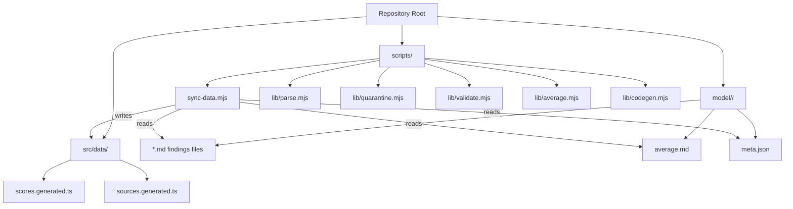
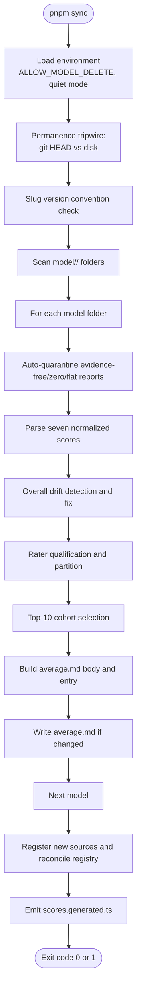
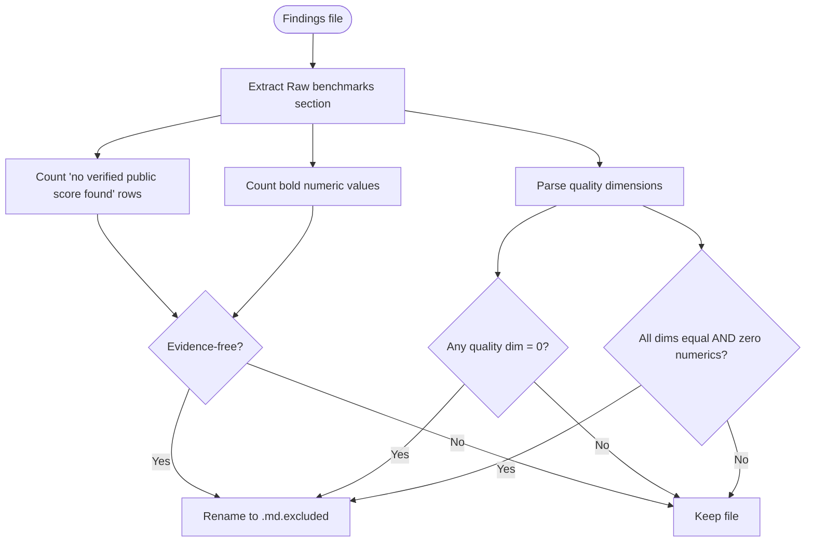
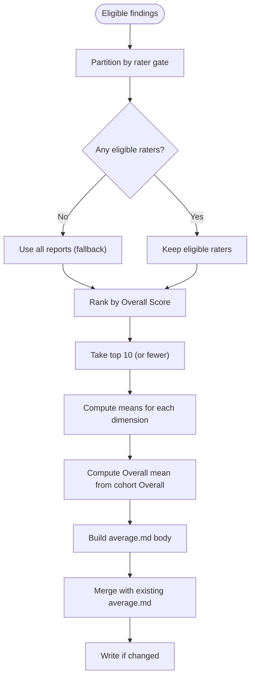
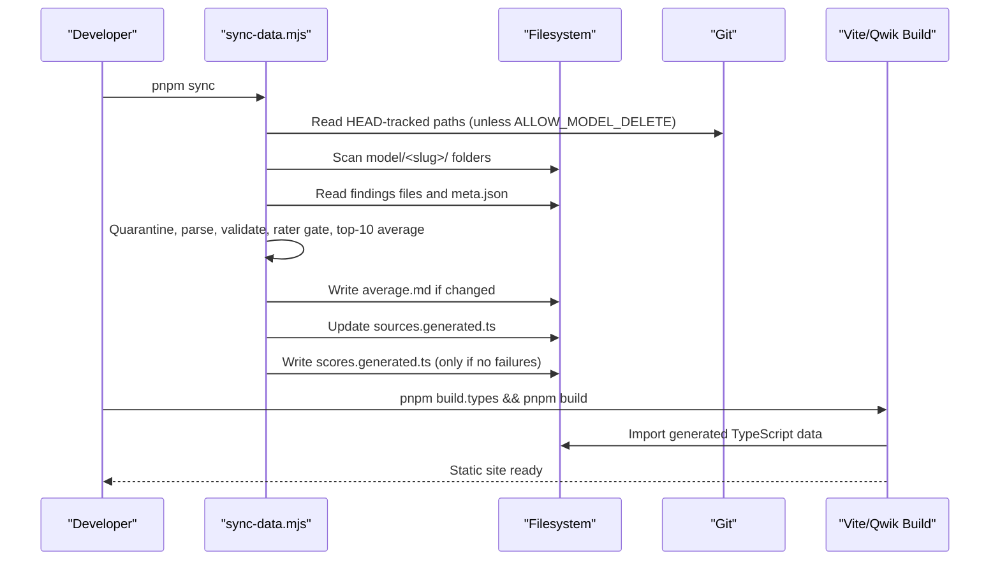
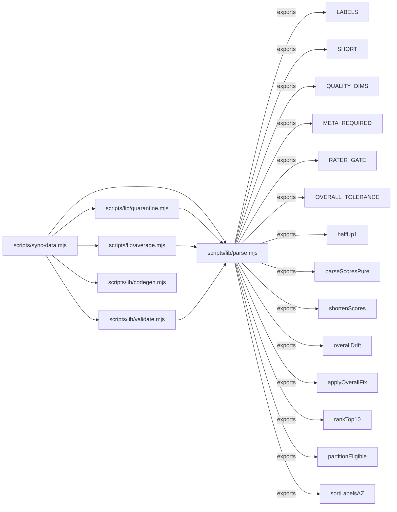

# Data Synchronization Pipeline

<cite>
**Referenced Files in This Document**
- [README.md](file://README.md)
- [sync-data.mjs](file://scripts/sync-data.mjs)
- [parse.mjs](file://scripts/lib/parse.mjs)
- [quarantine.mjs](file://scripts/lib/quarantine.mjs)
- [validate.mjs](file://scripts/lib/validate.mjs)
- [average.mjs](file://scripts/lib/average.mjs)
- [codegen.mjs](file://scripts/lib/codegen.mjs)
- [sync-data.md](file://tasks/sync-data.md)
</cite>

## Table of Contents
1. [Introduction](#introduction)
2. [Project Structure](#project-structure)
3. [Core Components](#core-components)
4. [Architecture Overview](#architecture-overview)
5. [Detailed Component Analysis](#detailed-component-analysis)
6. [Dependency Analysis](#dependency-analysis)
7. [Performance Considerations](#performance-considerations)
8. [Troubleshooting Guide](#troubleshooting-guide)
9. [Conclusion](#conclusion)
10. [Appendices](#appendices)

## Introduction
This document explains the deterministic data synchronization pipeline that converts research markdown files into TypeScript data structures for the model comparison site. The pipeline scans per-model folders, parses findings reports, validates scores and metadata, quarantines low-quality evidence, computes averages over a qualified top-10 cohort, registers new reporting agents, and emits compact TypeScript files consumed by the static site build.

The process is designed to be reproducible: it never invents numbers, never hardcodes UI values, and only rewrites generated or explicitly allowed files. A green run means the repository is in sync; a non-zero exit code requires human action based on the logged `FAIL` lines.

**Section sources**
- [README.md:8-29](file://README.md#L8-L29)
- [sync-data.mjs:1-29](file://scripts/sync-data.mjs#L1-L29)

## Project Structure
At a high level, the pipeline lives under `scripts/`, while the research data lives under `model/`. Generated TypeScript artifacts are written back into `src/data/` so the Qwik/Vite build can consume them without importing raw markdown at runtime.

**Diagram sources**
- [sync-data.mjs:30-75](file://scripts/sync-data.mjs#L30-L75)
- [README.md:61-75](file://README.md#L61-L75)

**Section sources**
- [README.md:31-44](file://README.md#L31-L44)
- [README.md:61-75](file://README.md#L61-L75)

## Core Components
The sync pipeline is composed of one orchestrator script and several pure helper modules:

- **Orchestrator:** `scripts/sync-data.mjs` performs folder scanning, validation, quarantine, score parsing, average recomputation, registry reconciliation, and code generation.
- **Parsing layer:** `scripts/lib/parse.mjs` defines score labels, short keys, quality dimensions, rater gate, drift tolerance, and functions for parsing, shortening, drifting, ranking, partitioning, and sorting.
- **Quarantine layer:** `scripts/lib/quarantine.mjs` detects evidence-free, zero-scored, or flat-invented reports and returns a reason for auto-quarantine.
- **Validation layer:** `scripts/lib/validate.mjs` enforces permanence tripwires, filename hygiene, meta.json schema, mirror relocation logic, and deletion messaging.
- **Average builder:** `scripts/lib/average.mjs` builds mix notes, average entries, average lines, full average bodies, and merges recomputed content with existing files.
- **Code generator:** `scripts/lib/codegen.mjs` parses and edits the source registry, appends missing sources, reconciles labels/slugs, prunes virtual views, and renders the compact scores file.

Key responsibilities:
- Folder scanning and exclusion rules.
- Score parsing and Overall drift correction.
- Rater qualification and top-10 cohort selection.
- Quarantine of untrustworthy findings.
- Metadata validation and scaffolding.
- Source registration and label/slug reconciliation.
- Generation of `scores.generated.ts` and updates to `sources.generated.ts`.

**Section sources**
- [sync-data.mjs:30-75](file://scripts/sync-data.mjs#L30-L75)
- [parse.mjs:8-45](file://scripts/lib/parse.mjs#L8-L45)
- [quarantine.mjs:1-40](file://scripts/lib/quarantine.mjs#L1-L40)
- [validate.mjs:1-25](file://scripts/lib/validate.mjs#L1-L25)
- [average.mjs:1-31](file://scripts/lib/average.mjs#L1-L31)
- [codegen.mjs:1-35](file://scripts/lib/codegen.mjs#L1-L35)

## Architecture Overview
The sync pipeline follows a strict sequence: environment checks, permanence verification, slug convention checks, per-model processing (quarantine, parse, validate, rater gate, top-10 averaging), registry reconciliation, and final code generation.

**Diagram sources**
- [sync-data.mjs:106-178](file://scripts/sync-data.mjs#L106-L178)
- [sync-data.mjs:190-436](file://scripts/sync-data.mjs#L190-L436)
- [sync-data.mjs:438-523](file://scripts/sync-data.mjs#L438-L523)

**Section sources**
- [sync-data.mjs:106-178](file://scripts/sync-data.mjs#L106-L178)
- [sync-data.mjs:190-436](file://scripts/sync-data.mjs#L190-L436)
- [sync-data.mjs:438-523](file://scripts/sync-data.mjs#L438-L523)

## Detailed Component Analysis

### Folder Scanning and Exclusions
The orchestrator enumerates every directory under `model/`, filters out non-directories, and sorts slugs deterministically. For each folder, it collects `.md` findings files while excluding `average.md`, `README.md`, and any filename containing `.excluded`. Filenames must match the allowed pattern; otherwise, the run fails loudly.

Behavior highlights:
- `.excluded` files are skipped and logged as self-excluded no-data reports.
- Unknown or hygiene-violating filenames produce `FAIL` messages.
- Missing `meta.json` is scaffolded with placeholder values and a warning, but required-field validation still runs.

**Section sources**
- [sync-data.mjs:128-131](file://scripts/sync-data.mjs#L128-L131)
- [sync-data.mjs:266-295](file://scripts/sync-data.mjs#L266-L295)
- [sync-data.mjs:297-327](file://scripts/sync-data.mjs#L297-L327)
- [validate.mjs:54-60](file://scripts/lib/validate.mjs#L54-L60)

### Findings File Parsing and Score Validation
Each findings file must contain seven normalized 1–100 score lines with exact labels. The parser returns structured scores when all labels are present; otherwise, it reports which label is missing. Cost efficiency is scored but excluded from Overall.

Drift handling:
- Overall is derived as the half-up mean of the five quality dimensions.
- If the stored Overall differs from the computed mean beyond the tolerance, the orchestrator rewrites only the Overall line and continues with the corrected value.
- If the line cannot be auto-fixed, the run fails and skips average rewriting for that folder.

Complexity considerations:
- Parsing is linear in the number of score lines per file.
- Drift detection is constant-time per file after parsing.

**Section sources**
- [parse.mjs:8-45](file://scripts/lib/parse.mjs#L8-L45)
- [parse.mjs:52-87](file://scripts/lib/parse.mjs#L52-L87)
- [sync-data.mjs:119-126](file://scripts/sync-data.mjs#L119-L126)
- [sync-data.mjs:347-370](file://scripts/sync-data.mjs#L347-L370)

### Rater Qualification and Quarantine Rules
Two independent quality gates protect the average:

1. **Rater qualification:** Only findings authored by models whose own committed average Overall exceeds the rater gate count toward another model’s average. The gate threshold is defined centrally and used both by the partition function and the UI caption. If no raters qualify, the pipeline falls back to averaging all available reports (still capped at top-10).

2. **Auto-quarantine:** Before scoring, the pipeline inspects each findings file’s Raw benchmarks section. It quarantines files that are:
   - Evidence-free: many “no verified public score found” rows and zero measured numbers.
   - Zero-scored: any quality dimension filed as 0.
   - Flat-invented: identical quality dimensions with zero cited numbers.

Quarantined files are renamed to `.md.excluded` and never counted in averages.

**Diagram sources**
- [quarantine.mjs:11-56](file://scripts/lib/quarantine.mjs#L11-L56)
- [sync-data.mjs:266-276](file://scripts/sync-data.mjs#L266-L276)

**Section sources**
- [parse.mjs:38-42](file://scripts/lib/parse.mjs#L38-L42)
- [parse.mjs:99-117](file://scripts/lib/parse.mjs#L99-L117)
- [quarantine.mjs:1-56](file://scripts/lib/quarantine.mjs#L1-L56)
- [sync-data.mjs:211-226](file://scripts/sync-data.mjs#L211-L226)
- [sync-data.mjs:372-386](file://scripts/sync-data.mjs#L372-L386)

### Average Computation and Top-10 Cohort
Averages are arithmetic means over the top-10 cohort selected from eligible raters. Eligible raters are those whose own committed average Overall clears the rater gate. If none qualify, the pipeline uses all reports as a fallback.

Cohort construction:
- Partition eligible files by rater qualification.
- Sort eligible labels case-insensitively.
- Rank by Overall Score descending and take up to ten.
- Compute each dimension’s mean using half-up rounding to one decimal.
- Compute Overall as the mean of the cohort’s Overall scores (not re-derived from averaged dimensions).

Output:
- `average.md` is created or rewritten with a header, averaged scores, and agreement notes explaining the cohort, exclusions, and ignored below-gate raters.
- The same cohort’s short-keyed scores are added to the client index so the UI can render the “average” view without reading markdown.

**Diagram sources**
- [average.mjs:17-81](file://scripts/lib/average.mjs#L17-L81)
- [average.mjs:83-100](file://scripts/lib/average.mjs#L83-L100)
- [parse.mjs:89-97](file://scripts/lib/parse.mjs#L89-L97)
- [sync-data.mjs:372-436](file://scripts/sync-data.mjs#L372-L436)

**Section sources**
- [average.mjs:1-31](file://scripts/lib/average.mjs#L1-L31)
- [average.mjs:33-81](file://scripts/lib/average.mjs#L33-L81)
- [average.mjs:83-100](file://scripts/lib/average.mjs#L83-L100)
- [parse.mjs:89-97](file://scripts/lib/parse.mjs#L89-L97)
- [sync-data.mjs:372-436](file://scripts/sync-data.mjs#L372-L436)

### Source Registration and Registry Reconciliation
Every on-disk findings stem must have a corresponding `SourceKey` union member and a `SOURCE_DEFS` entry. The orchestrator:
- Parses existing registry text.
- Computes missing stems not already registered.
- Detects key collisions where the same label maps to multiple filenames.
- Appends pending sources to both the union and the array.
- Reconciles labels and inline slugs idempotently.
- Prunes grandfathered virtual-view entries that belong in application code rather than the registry.

Registration outcomes:
- New sources are appended last; dropdown order is derived at build time, so registry position does not affect UI ordering.
- Collisions fail loudly and require manual resolution.
- Stale registered keys without active files are reported as informational logs.

**Section sources**
- [codegen.mjs:14-35](file://scripts/lib/codegen.mjs#L14-L35)
- [codegen.mjs:44-84](file://scripts/lib/codegen.mjs#L44-L84)
- [codegen.mjs:86-105](file://scripts/lib/codegen.mjs#L86-L105)
- [sync-data.mjs:438-488](file://scripts/sync-data.mjs#L438-L488)

### Environment Variables and Their Impact
- **`ALLOW_MODEL_DELETE`:** When set to `"1"` or `"true"`, the permanence tripwire that compares git-tracked research files against disk is skipped. Without this variable, missing tracked findings files cause `FAIL` unless they are twin-retired or relocated to a sanctioned mirror tree.
- **Quiet mode (`--quiet` / `-q`):** Not an environment variable, but a CLI flag that suppresses per-folder noise while preserving the same checks, writes, and exit code contract.

Impact summary:
- With `ALLOW_MODEL_DELETE` unset, the sync reads git HEAD and enforces research-file permanence.
- With `ALLOW_MODEL_DELETE` set, the tripwire is bypassed, allowing deletions that would otherwise block the run.
- Quiet mode reduces console output but does not relax validation.

**Section sources**
- [sync-data.mjs:106-112](file://scripts/sync-data.mjs#L106-L112)
- [sync-data.mjs:145-178](file://scripts/sync-data.mjs#L145-L178)
- [sync-data.md:14-17](file://tasks/sync-data.md#L14-L17)

### Step-by-Step Workflow: From New Model Data to Static Site
End-to-end workflow:

1. Add a new model folder under `model/<slug>/` with:
   - One or more findings files named according to the allowed pattern.
   - A `meta.json` with required fields.
2. Optionally add new findings files into existing model folders.
3. Run `pnpm sync` to:
   - Scan folders and enforce filename hygiene.
   - Auto-quarantine low-quality evidence.
   - Parse scores and correct Overall drift.
   - Apply rater gate and compute top-10 averages.
   - Register new sources and reconcile the registry.
   - Emit `scores.generated.ts` and update `sources.generated.ts`.
4. Run type checking to ensure generated TypeScript types remain valid.
5. Run the full build to generate the static site.

**Diagram sources**
- [sync-data.mjs:145-178](file://scripts/sync-data.mjs#L145-L178)
- [sync-data.mjs:266-436](file://scripts/sync-data.mjs#L266-L436)
- [sync-data.mjs:438-523](file://scripts/sync-data.mjs#L438-L523)
- [README.md:18-29](file://README.md#L18-L29)

**Section sources**
- [README.md:84-91](file://README.md#L84-L91)
- [sync-data.md:8-17](file://tasks/sync-data.md#L8-L17)
- [sync-data.md:19-63](file://tasks/sync-data.md#L19-L63)

## Dependency Analysis
The orchestrator imports pure helpers to keep side effects isolated and testable. The dependency graph shows clear separation between orchestration, parsing, validation, averaging, and code generation.

**Diagram sources**
- [sync-data.mjs:36-75](file://scripts/sync-data.mjs#L36-L75)
- [parse.mjs:8-45](file://scripts/lib/parse.mjs#L8-L45)
- [quarantine.mjs:9-31](file://scripts/lib/quarantine.mjs#L9-L31)
- [average.mjs:10-10](file://scripts/lib/average.mjs#L10-L10)
- [validate.mjs:9-9](file://scripts/lib/validate.mjs#L9-L9)

**Section sources**
- [sync-data.mjs:36-75](file://scripts/sync-data.mjs#L36-L75)
- [parse.mjs:8-45](file://scripts/lib/parse.mjs#L8-L45)

## Performance Considerations
- **Avoid shipping markdown to the client:** The pipeline pre-parses findings into `scores.generated.ts`, keeping report prose out of the Vite bundle. This prevents large raw markdown imports from inflating the client bundle size.
- **Deterministic iteration:** Slugs, filenames, and generated keys are sorted to ensure stable outputs across runs.
- **Quiet mode for large repos:** Use `pnpm sync:quiet` to reduce console noise while preserving the same validation and write behavior.
- **I/O-bound operations:** The script reads and writes many small files. On very large datasets, consider running sync once after batching changes rather than repeatedly syncing after every minor edit.
- **Generated-only writes:** Invalid runs do not rewrite `scores.generated.ts`, preventing bad data from being cemented into the build input.

[No sources needed since this section provides general guidance]

## Troubleshooting Guide
Common failure categories and resolutions:

- **Missing tracked research file:**
  - Cause: A git-tracked findings file is absent from disk.
  - Resolution: Restore the file from HEAD or commit its relocation to a sanctioned mirror. Bypass only with `ALLOW_MODEL_DELETE=1` and explicit sign-off.
  - Reference: Permanence tripwire and deletion message.

- **Hygiene-violating filename:**
  - Cause: Findings filename contains characters outside letters, digits, underscore, and dots.
  - Resolution: Rename the file to match the allowed pattern.

- **Missing score line:**
  - Cause: A findings file lacks one of the seven required score lines.
  - Resolution: Add the missing score line with the exact label and format.

- **Overall drift not auto-fixable:**
  - Cause: The Overall line exists but cannot be patched by regex.
  - Resolution: Manually correct the Overall line to match the half-up mean of the five quality dimensions, then rerun sync.

- **Rater gate fallback:**
  - Cause: No qualifying raters cleared the rater gate.
  - Behavior: The pipeline averages all reports instead of leaving the folder without an average.
  - Resolution: Improve the rating model’s own average or review the rater gate threshold alignment.

- **Key collision during registration:**
  - Cause: Two different filenames map to the same source key.
  - Resolution: Disambiguate filenames or adjust overrides so each stem maps uniquely.

- **Missing `meta.json` or invalid fields:**
  - Cause: New model folder lacks required metadata or uses underscores in the display name.
  - Resolution: Provide a complete `meta.json` with official vendor display names and verified facts.

- **Build failures after sync:**
  - Cause: Generated TypeScript types or imports are stale.
  - Resolution: Rerun `pnpm build.types` and `pnpm build`; verify that `scores.generated.ts` was emitted only on a clean sync.

**Section sources**
- [validate.mjs:46-52](file://scripts/lib/validate.mjs#L46-L52)
- [validate.mjs:54-80](file://scripts/lib/validate.mjs#L54-L80)
- [parse.mjs:52-87](file://scripts/lib/parse.mjs#L52-L87)
- [sync-data.mjs:145-178](file://scripts/sync-data.mjs#L145-L178)
- [sync-data.mjs:347-370](file://scripts/sync-data.mjs#L347-L370)
- [sync-data.mjs:452-467](file://scripts/sync-data.mjs#L452-L467)
- [sync-data.mjs:496-523](file://scripts/sync-data.mjs#L496-L523)

## Conclusion
The deterministic data synchronization pipeline ensures that research markdown remains the single source of truth while producing reliable, typed, and compact data for the static site. It protects data integrity through filename hygiene, score validation, rater qualification, quarantine rules, and permanence tripwires. It also automates maintenance tasks like average recomputation, source registration, and code generation. Following the documented workflow and troubleshooting steps keeps the repository consistent and the build green.

[No sources needed since this section summarizes without analyzing specific files]

## Appendices

### Quick Command Reference
- `pnpm dev`: Start development server.
- `pnpm sync`: Deterministic data sync.
- `pnpm sync:quiet`: Same sync with reduced console output.
- `pnpm build.types`: Typecheck.
- `pnpm build`: Full static build.
- `pnpm preview`: Serve last production build locally.

**Section sources**
- [README.md:18-29](file://README.md#L18-L29)
- [sync-data.md:8-17](file://tasks/sync-data.md#L8-L17)