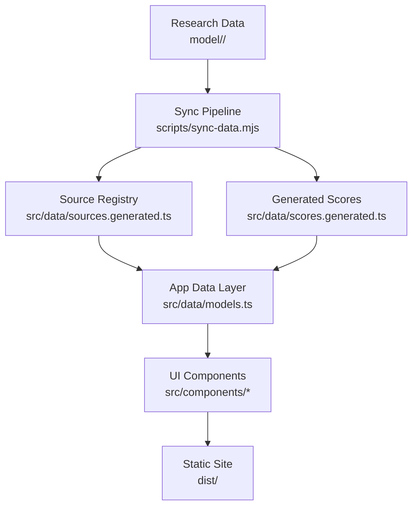
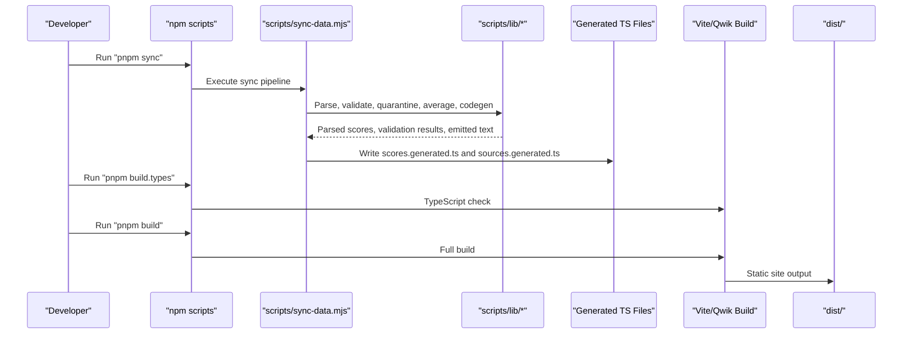
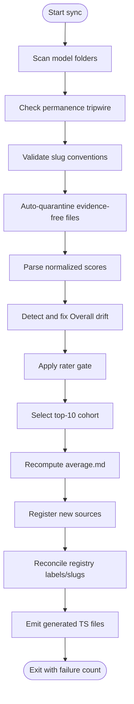
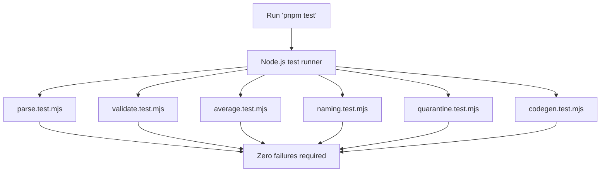
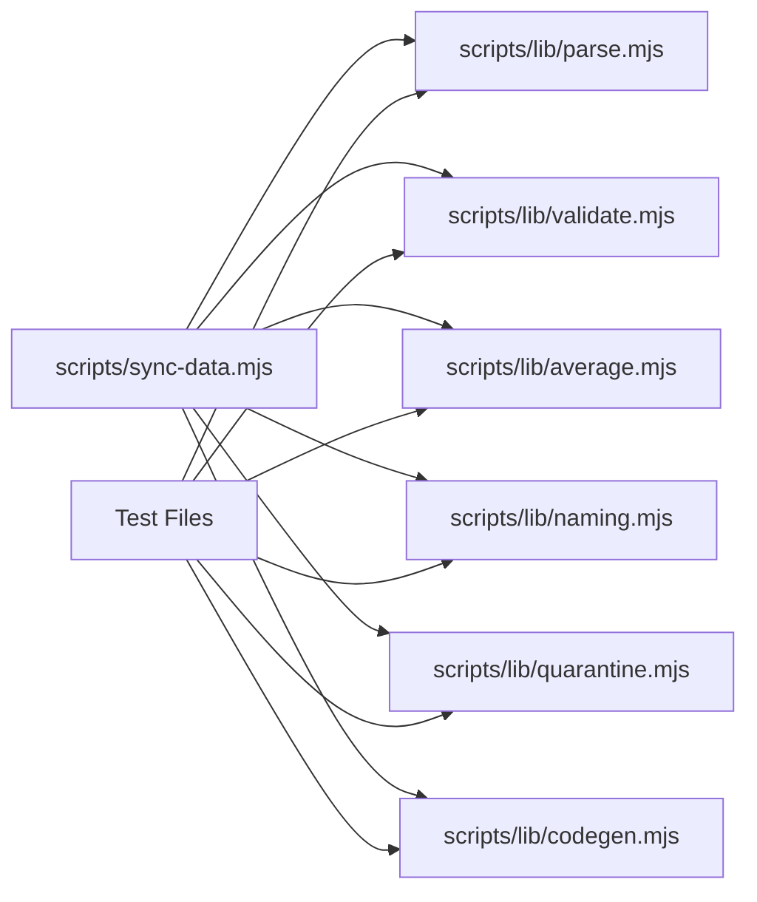

# Development Workflow & Testing

<cite>
**Referenced Files in This Document**
- [package.json](file://package.json)
- [README.md](file://README.md)
- [tsconfig.json](file://tsconfig.json)
- [sync-data.mjs](file://scripts/sync-data.mjs)
- [sync-data.md](file://tasks/sync-data.md)
- [model README.md](file://model/README.md)
- [parse.test.mjs](file://scripts/lib/parse.test.mjs)
- [validate.test.mjs](file://scripts/lib/validate.test.mjs)
- [average.test.mjs](file://scripts/lib/average.test.mjs)
- [naming.test.mjs](file://scripts/lib/naming.test.mjs)
- [quarantine.test.mjs](file://scripts/lib/quarantine.test.mjs)
- [codegen.test.mjs](file://scripts/lib/codegen.test.mjs)
</cite>

## Table of Contents
1. [Introduction](#introduction)
2. [Project Structure](#project-structure)
3. [Core Components](#core-components)
4. [Architecture Overview](#architecture-overview)
5. [Detailed Component Analysis](#detailed-component-analysis)
6. [Dependency Analysis](#dependency-analysis)
7. [Performance Considerations](#performance-considerations)
8. [Troubleshooting Guide](#troubleshooting-guide)
9. [Conclusion](#conclusion)
10. [Appendices](#appendices)

## Introduction
ModelComp is a static Qwik + Vite site that compares AI coding models using normalized 1–100 scores parsed at build time from research files under `model/<slug>/`. The repository emphasizes deterministic data synchronization, strict TypeScript type checking, and minimal runtime code: most model data is pre-parsed into generated TypeScript files so the client bundle does not include raw markdown prose.

The development workflow centers on three commands:
- Synchronize and validate research data.
- Type-check the project with TypeScript.
- Build the full static site.

This document explains how to set up the environment, run tests, add new models or findings, update research data, verify changes, debug common issues, and iterate efficiently.

## Project Structure
At a high level:
- `model/<slug>/` contains per-model research data: one findings file per reporting agent, an auto-generated `average.md`, and hand-edited `meta.json`.
- `src/data/` holds generated data (`scores.generated.ts`, `sources.generated.ts`) plus the application’s data layer.
- `scripts/` contains the deterministic sync pipeline and pure helper modules with regression tests.
- `tasks/` documents human workflows around syncing and research.
- `package.json` defines npm scripts for development, building, syncing, and testing.

**Diagram sources**
- [sync-data.mjs:1-527](file://scripts/sync-data.mjs#L1-L527)
- [README.md:31-44](file://README.md#L31-L44)

**Section sources**
- [README.md:1-30](file://README.md#L1-L30)
- [README.md:61-82](file://README.md#L61-L82)
- [model README.md:1-31](file://model/README.md#L1-L31)

## Core Components
The core development surface consists of npm scripts, the sync pipeline, TypeScript configuration, and regression tests.

### npm Scripts
Key scripts are defined in `package.json`:
- `pnpm dev`: Starts the Vite development server in SSR mode.
- `pnpm preview`: Serves the last production build locally.
- `pnpm start`: Starts the dev server and opens it in the browser.
- `pnpm build`: Runs the Qwik build.
- `pnpm build.client`: Builds the client with Vite.
- `pnpm build.preview`: Builds the preview SSR entry.
- `pnpm build.server`: Builds the static adapter server.
- `pnpm build.types`: Runs TypeScript type checking without emitting output.
- `pnpm sync`: Runs the deterministic data sync script.
- `pnpm sync:quiet`: Runs sync in quiet mode, printing only failures and summary.
- `pnpm test`: Runs Node.js test runner over the sync helper tests.
- `pnpm qwik`: Invokes the Qwik CLI.

The standard post-change workflow is documented as:
`pnpm sync && pnpm build.types && pnpm build`.

**Section sources**
- [package.json:11-24](file://package.json#L11-L24)
- [README.md:18-29](file://README.md#L18-L29)

### TypeScript Configuration
TypeScript is configured with strict mode enabled, JSX support for Qwik, ES2021 target, bundler module resolution, and no emission. Important settings include:
- Strict type checking.
- No unused locals or parameters.
- DOM and ES2021 libraries.
- Include paths limited to `src` and `vite.config.ts`.
- Exclude paths exclude `node_modules` and `dist`.

This means type errors block clean builds and should be fixed before committing.

**Section sources**
- [tsconfig.json:1-26](file://tsconfig.json#L1-L26)

### Sync Pipeline
The sync pipeline is implemented by `scripts/sync-data.mjs`. It performs:
1. Scanning model folders for findings files.
2. Parsing normalized scores.
3. Validating and recomputing averages.
4. Registering new reporting agents.
5. Validating `meta.json`.
6. Emitting generated score and source registry files.

It uses pure helper modules under `scripts/lib/` and fails loudly when data hygiene rules are violated.

**Section sources**
- [sync-data.mjs:1-76](file://scripts/sync-data.mjs#L1-L76)
- [sync-data.mjs:128-197](file://scripts/sync-data.mjs#L128-L197)
- [sync-data.mjs:259-436](file://scripts/sync-data.mjs#L259-L436)
- [sync-data.mjs:438-527](file://scripts/sync-data.mjs#L438-L527)

### Research Data Model
Each tracked model has a folder under `model/<slug>/`. The folder must contain:
- One findings file per reporting agent.
- An auto-generated `average.md`.
- A hand-edited `meta.json` with required fields.

The slug version convention requires dots for versions (for example `gpt-5.5`, not `gpt-5-5`). Findings filenames use letters, digits, underscores, and optional version dots.

**Section sources**
- [model README.md:1-31](file://model/README.md#L1-L31)
- [model README.md:32-57](file://model/README.md#L32-L57)
- [model README.md:59-86](file://model/README.md#L59-L86)

## Architecture Overview
The end-to-end development and build flow connects research data, sync logic, generated artifacts, and the static site.

**Diagram sources**
- [package.json:11-24](file://package.json#L11-L24)
- [sync-data.mjs:1-76](file://scripts/sync-data.mjs#L1-L76)
- [sync-data.mjs:490-527](file://scripts/sync-data.mjs#L490-L527)
- [README.md:31-44](file://README.md#L31-L44)

## Detailed Component Analysis

### Sync Data Pipeline
The sync script orchestrates multiple responsibilities:
- Permanence tripwire: checks git-tracked research files for forbidden deletions unless they survive in sanctioned mirrors or have twin retirements.
- Slug hygiene: rejects hyphen-versioned slugs where dotted versions are expected.
- Auto-quarantine: renames evidence-free findings files to `.md.excluded`.
- Score parsing: validates seven normalized scores per findings file.
- Overall drift correction: rewrites only the Overall number when it drifts beyond tolerance.
- Rater gate: filters raters whose own average Overall exceeds the gate threshold.
- Top-10 cohort: computes averages over the top ten eligible sources.
- Registry management: registers new sources and reconciles labels/slugs.
- Code generation: emits compact score data for the client bundle.

**Diagram sources**
- [sync-data.mjs:133-197](file://scripts/sync-data.mjs#L133-L197)
- [sync-data.mjs:259-436](file://scripts/sync-data.mjs#L259-L436)
- [sync-data.mjs:438-527](file://scripts/sync-data.mjs#L438-L527)

**Section sources**
- [sync-data.mjs:1-76](file://scripts/sync-data.mjs#L1-L76)
- [sync-data.mjs:128-197](file://scripts/sync-data.mjs#L128-L197)
- [sync-data.mjs:259-436](file://scripts/sync-data.mjs#L259-L436)
- [sync-data.mjs:438-527](file://scripts/sync-data.mjs#L438-L527)

### Test Strategy
Testing uses Node.js built-in test runner with zero external dependencies. Tests cover:
- Score parsing and format contract.
- Average recomputation and agreement notes.
- Filename, slug, and naming conventions.
- Permanence tripwire and meta validation.
- Quarantine criteria.
- Registry surgery and generated file rendering.

Run all tests with:
`pnpm test`

The test command invokes Node.js test runner over six test files under `scripts/lib/`.

**Diagram sources**
- [package.json:20-20](file://package.json#L20-L20)
- [parse.test.mjs:1-218](file://scripts/lib/parse.test.mjs#L1-L218)
- [validate.test.mjs:1-95](file://scripts/lib/validate.test.mjs#L1-L95)
- [average.test.mjs:1-122](file://scripts/lib/average.test.mjs#L1-L122)
- [naming.test.mjs:1-139](file://scripts/lib/naming.test.mjs#L1-L139)
- [quarantine.test.mjs:1-103](file://scripts/lib/quarantine.test.mjs#L1-L103)
- [codegen.test.mjs:1-146](file://scripts/lib/codegen.test.mjs#L1-L146)

**Section sources**
- [package.json:20-20](file://package.json#L20-L20)
- [parse.test.mjs:1-218](file://scripts/lib/parse.test.mjs#L1-L218)
- [validate.test.mjs:1-95](file://scripts/lib/validate.test.mjs#L1-L95)
- [average.test.mjs:1-122](file://scripts/lib/average.test.mjs#L1-L122)
- [naming.test.mjs:1-139](file://scripts/lib/naming.test.mjs#L1-L139)
- [quarantine.test.mjs:1-103](file://scripts/lib/quarantine.test.mjs#L1-L103)
- [codegen.test.mjs:1-146](file://scripts/lib/codegen.test.mjs#L1-L146)

### Adding New Models
To add a new model:
1. Create `model/<slug>/` with findings files and `meta.json`.
2. Run `pnpm sync` to create `average.md`, validate metadata, register sources, and emit generated files.
3. Run `pnpm build.types && pnpm build` to verify types and produce the static site.

The model folder must follow slug conventions, include required `meta.json` fields, and avoid underscore display names.

**Section sources**
- [model README.md:59-70](file://model/README.md#L59-L70)
- [model README.md:32-57](file://model/README.md#L32-L57)
- [sync-data.mjs:297-326](file://scripts/sync-data.mjs#L297-L326)

### Updating Research Data
To add or update a reporting agent’s findings:
1. Drop `<Source_Name>.md` into every relevant `model/<slug>/` folder.
2. Run `pnpm sync` to recompute averages and register the source if needed.
3. Run `pnpm build.types && pnpm build`.

If the filename is new, sync appends it to the SourceKey union and SOURCE_DEFS registry automatically. If the filename violates hygiene rules, sync fails loudly.

**Section sources**
- [model README.md:72-77](file://model/README.md#L72-L77)
- [sync-data.mjs:438-488](file://scripts/sync-data.mjs#L438-L488)
- [sync-data.mjs:490-527](file://scripts/sync-data.mjs#L490-L527)

### Verifying Changes
After any data change, verify:
- Sync completes with zero failures.
- TypeScript type checking passes.
- Full build succeeds.
- Generated files reflect expected changes.
- UI behavior matches expectations through spot-checking the preview or built site.

The recommended sequence is:
`pnpm sync && pnpm build.types && pnpm build`.

**Section sources**
- [README.md:29-29](file://README.md#L29-L29)
- [sync-data.md:8-17](file://tasks/sync-data.md#L8-L17)
- [sync-data.md:66-77](file://tasks/sync-data.md#L66-L77)

## Dependency Analysis
The sync pipeline depends on pure helper modules for parsing, validation, averaging, naming, quarantine, and code generation. Tests assert the contracts between these modules and the sync script.

**Diagram sources**
- [sync-data.mjs:30-76](file://scripts/sync-data.mjs#L30-L76)
- [parse.test.mjs:1-218](file://scripts/lib/parse.test.mjs#L1-L218)
- [validate.test.mjs:1-95](file://scripts/lib/validate.test.mjs#L1-L95)
- [average.test.mjs:1-122](file://scripts/lib/average.test.mjs#L1-L122)
- [naming.test.mjs:1-139](file://scripts/lib/naming.test.mjs#L1-L139)
- [quarantine.test.mjs:1-103](file://scripts/lib/quarantine.test.mjs#L1-L103)
- [codegen.test.mjs:1-146](file://scripts/lib/codegen.test.mjs#L1-L146)

**Section sources**
- [sync-data.mjs:30-76](file://scripts/sync-data.mjs#L30-L76)
- [package.json:26-36](file://package.json#L26-L36)

## Performance Considerations
For faster development iterations:
- Use `pnpm sync:quiet` during large-repo sync runs to reduce console noise while keeping the same checks and exit code behavior.
- Run `pnpm build.types` separately when iterating on TypeScript changes; it is fast because it does not emit output.
- Avoid editing generated files manually; let sync regenerate them so the build remains deterministic.
- Keep findings files focused and well-formed to minimize parse/validation overhead.
- Prefer small, targeted changes to research data rather than bulk edits across many model folders.

[No sources needed since this section provides general guidance]

## Troubleshooting Guide

### Common Sync Failures
- **Missing score lines:** Sync fails loudly when a findings file lacks one of the seven required score lines. Fix the missing line instead of inventing numbers.
- **Overall drift:** If the Overall score drifts beyond tolerance, sync attempts to rewrite only the Overall number. If it cannot auto-fix, you must edit the file manually.
- **Hyphen-versioned slugs:** Sync rejects slugs like `gpt-5-5` and suggests the dotted form `gpt-5.5`. Merge into the existing dotted folder.
- **Forbidden deletion tripwire:** If a git-tracked research file is missing, sync fails unless it is a sanctioned relocation or twin retirement. Restore the file or move it to a sanctioned mirror.
- **Invalid filenames:** Findings filenames must match the allowed pattern. Remove hyphens and spaces.
- **Missing or invalid `meta.json`:** Ensure required fields exist and the display name uses spaces, not underscores.

**Section sources**
- [sync-data.mjs:119-126](file://scripts/sync-data.mjs#L119-L126)
- [sync-data.mjs:347-370](file://scripts/sync-data.mjs#L347-L370)
- [sync-data.mjs:180-197](file://scripts/sync-data.mjs#L180-L197)
- [sync-data.mjs:133-178](file://scripts/sync-data.mjs#L133-L178)
- [sync-data.mjs:284-295](file://scripts/sync-data.mjs#L284-L295)
- [sync-data.mjs:297-326](file://scripts/sync-data.mjs#L297-L326)

### Build and Type Issues
- **TypeScript errors:** Run `pnpm build.types` to identify strict type errors. Fix them before running the full build.
- **Generated file mismatches:** Do not edit generated files directly. Re-run sync to regenerate them deterministically.
- **Registry collisions:** If a new stem maps to an already registered key, sync reports a collision and requires manual resolution.
- **Legacy slugs file removed:** Sync deletes the legacy `agent-slugs.generated.ts` when present; imports must use the inline slug approach in `sources.generated.ts`.

**Section sources**
- [tsconfig.json:1-26](file://tsconfig.json#L1-L26)
- [sync-data.mjs:452-467](file://scripts/sync-data.mjs#L452-L467)
- [sync-data.mjs:514-523](file://scripts/sync-data.mjs#L514-L523)

### Debugging Techniques
- Use `pnpm sync:quiet` to focus on FAIL lines during large sync runs.
- Inspect the final sync summary line for counts of rewritten averages, new sources, and failures.
- Check generated files under `src/data/` after sync to confirm expected changes.
- Run individual test files with Node.js test runner if isolating a specific helper module.
- Review quarantine reasons when a findings file is renamed to `.md.excluded`.

**Section sources**
- [sync-data.mjs:106-118](file://scripts/sync-data.mjs#L106-L118)
- [sync-data.mjs:525-527](file://scripts/sync-data.mjs#L525-L527)
- [quarantine.test.mjs:55-95](file://scripts/lib/quarantine.test.mjs#L55-L95)

## Conclusion
ModelComp’s development workflow is designed around deterministic data synchronization, strict type safety, and minimal runtime complexity. Contributors should:
- Add or update research data under `model/<slug>/`.
- Run `pnpm sync` to validate, quarantine, compute averages, register sources, and generate build inputs.
- Run `pnpm build.types` to ensure TypeScript correctness.
- Run `pnpm build` to produce the static site.
- Use the Node.js test suite to validate sync helpers.
- Follow slug conventions, findings file hygiene, and `meta.json` requirements.
- Treat generated files as outputs of sync, not manual edits.

This process keeps the site’s scores derived from research data, prevents silent data loss, and ensures consistent builds.

[No sources needed since this section summarizes without analyzing specific files]

## Appendices

### Quick Command Reference
| Command | Purpose |
|---|---|
| `pnpm dev` | Start development server in SSR mode |
| `pnpm sync` | Deterministic data sync |
| `pnpm sync:quiet` | Quiet sync with same checks |
| `pnpm build.types` | TypeScript type check |
| `pnpm build` | Full static build |
| `pnpm preview` | Serve last production build locally |
| `pnpm test` | Run sync helper tests |

**Section sources**
- [README.md:18-29](file://README.md#L18-L29)
- [package.json:11-24](file://package.json#L11-L24)