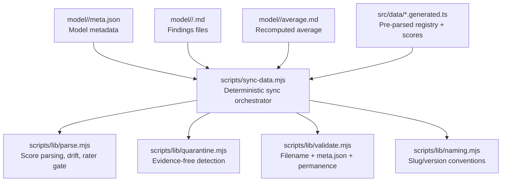
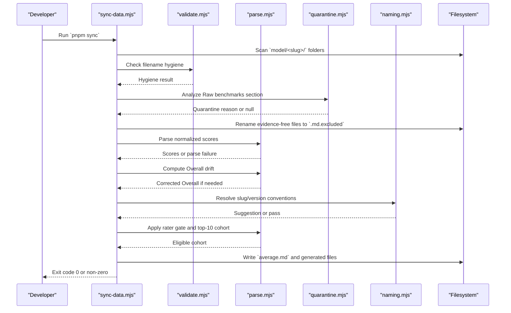
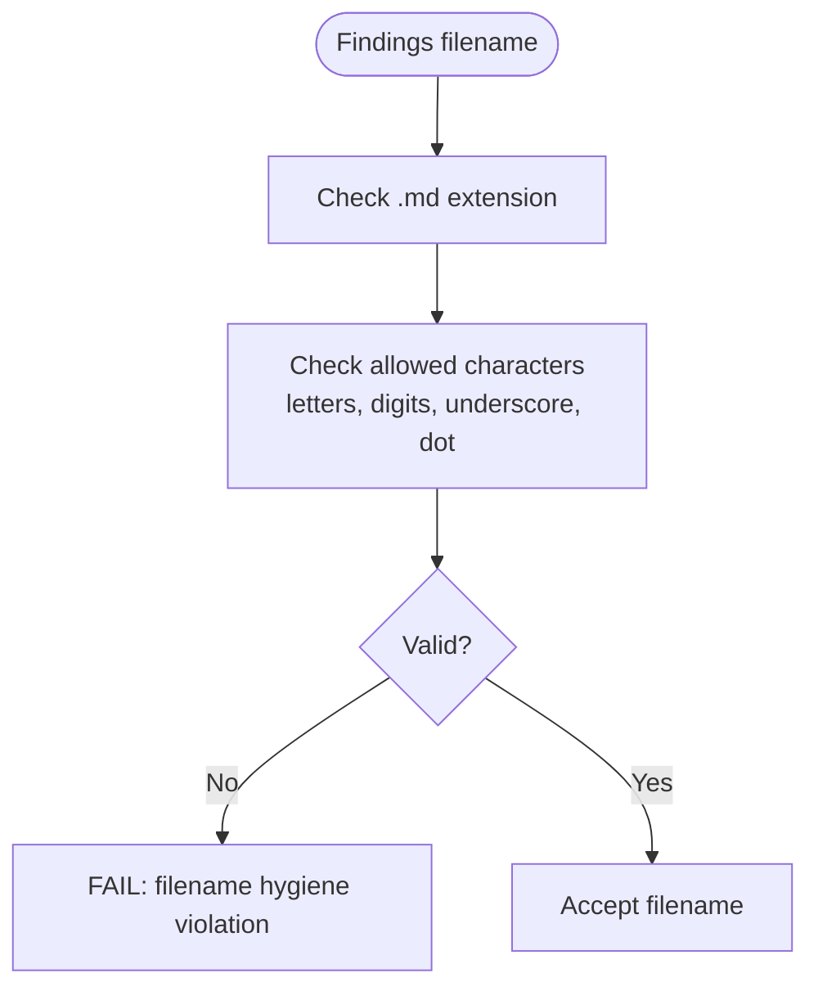
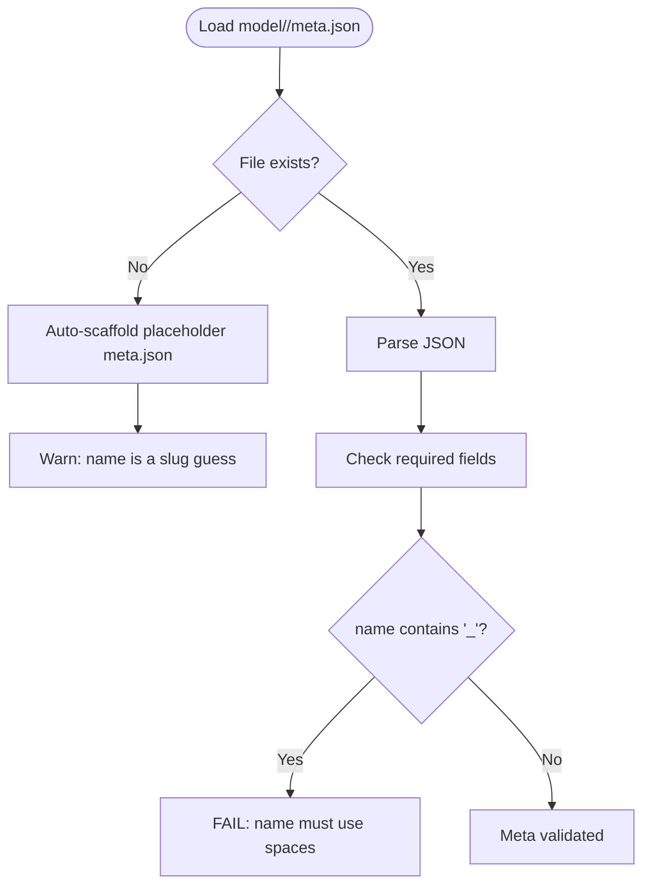
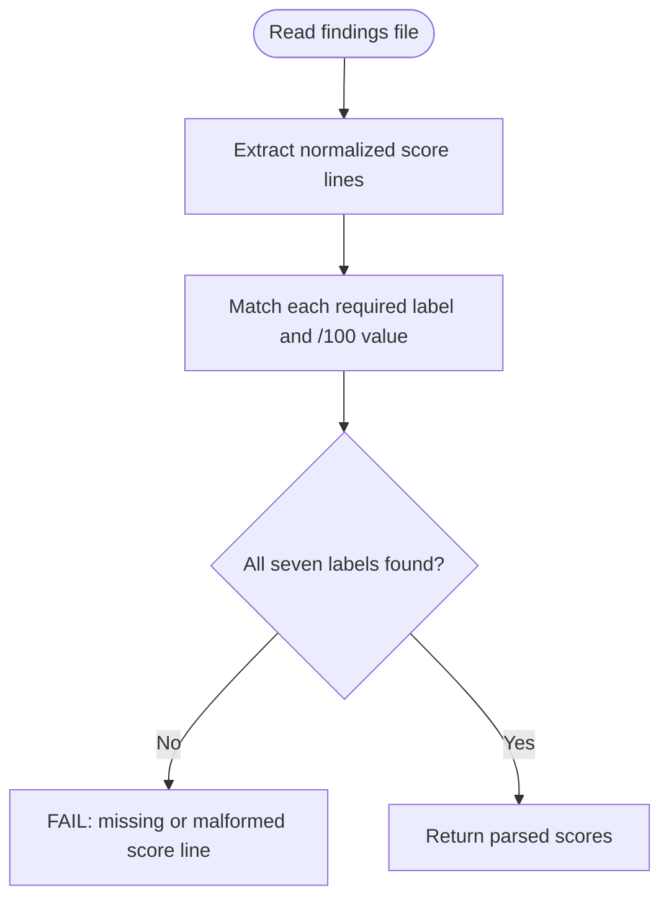
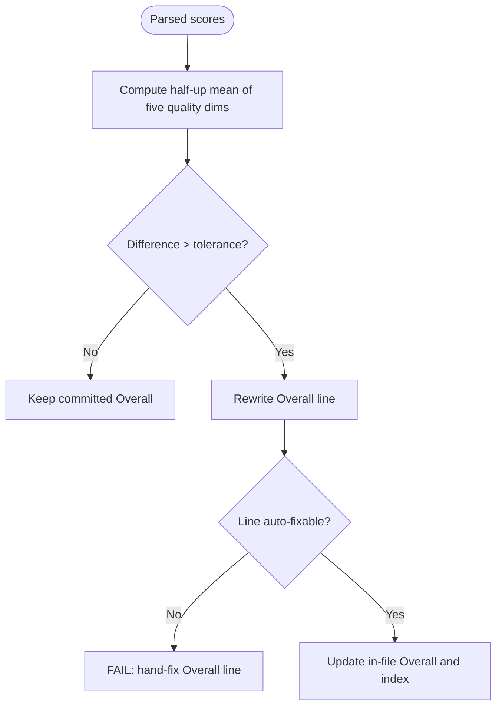
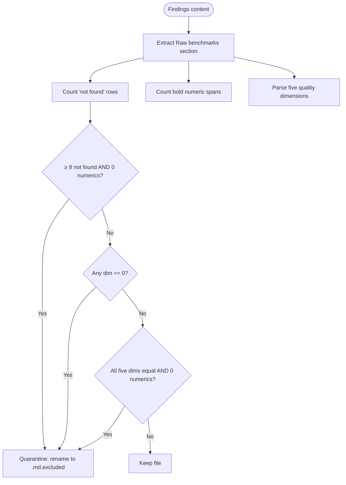
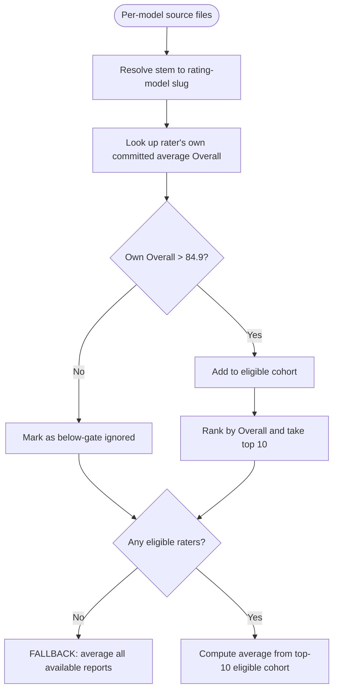
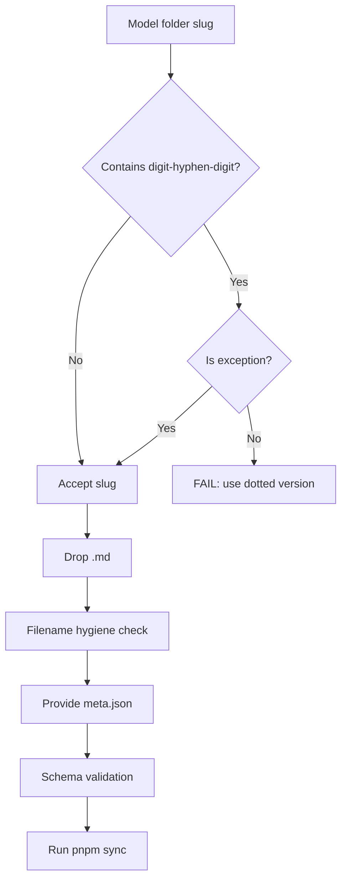
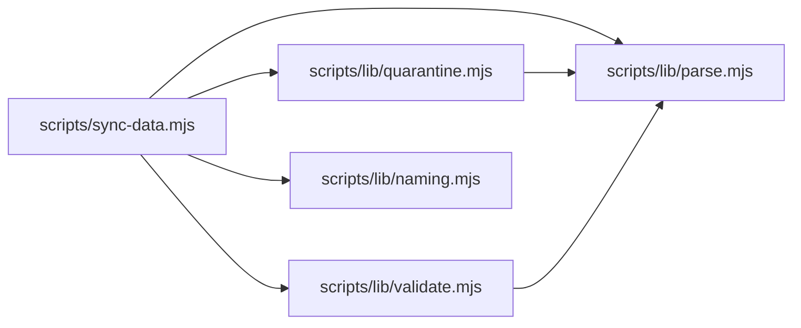

# Validation & Quality Assurance

<cite>
**Referenced Files in This Document**
- [README.md](file://README.md)
- [RULES.md](file://RULES.md)
- [model/README.md](file://model/README.md)
- [scripts/sync-data.mjs](file://scripts/sync-data.mjs)
- [scripts/lib/parse.mjs](file://scripts/lib/parse.mjs)
- [scripts/lib/quarantine.mjs](file://scripts/lib/quarantine.mjs)
- [scripts/lib/quarantine.test.mjs](file://scripts/lib/quarantine.test.mjs)
- [scripts/lib/validate.mjs](file://scripts/lib/validate.mjs)
- [scripts/lib/naming.mjs](file://scripts/lib/naming.mjs)
</cite>

## Table of Contents
1. [Introduction](#introduction)
2. [Project Structure](#project-structure)
3. [Core Components](#core-components)
4. [Architecture Overview](#architecture-overview)
5. [Detailed Component Analysis](#detailed-component-analysis)
6. [Dependency Analysis](#dependency-analysis)
7. [Performance Considerations](#performance-considerations)
8. [Troubleshooting Guide](#troubleshooting-guide)
9. [Conclusion](#conclusion)

## Introduction
This document explains the multi-layered validation and quality-assurance system that keeps model comparison data trustworthy. It covers:

- Filename hygiene checks for findings files.
- `meta.json` schema and display-name validation.
- Score parsing, Overall drift detection, and automatic correction.
- The quarantine system that excludes evidence-free reports.
- The rater gate mechanism that ensures only qualified models contribute to averages.
- Model naming conventions, version numbering rules, and file structure requirements.
- Examples of validation failures and step-by-step resolution.

The system is deterministic: `pnpm sync` scans research files, validates them, quarantines bad evidence, recomputes averages, registers new sources, and generates compact score indexes consumed by the site build.

## Project Structure
Validation lives primarily under `scripts/`, with human-facing rules documented at the repository root and under `model/`.

**Diagram sources**
- [scripts/sync-data.mjs:1-76](file://scripts/sync-data.mjs#L1-L76)
- [scripts/lib/parse.mjs:8-45](file://scripts/lib/parse.mjs#L8-L45)
- [scripts/lib/quarantine.mjs:1-31](file://scripts/lib/quarantine.mjs#L1-L31)
- [scripts/lib/validate.mjs:1-12](file://scripts/lib/validate.mjs#L1-L12)
- [scripts/lib/naming.mjs:1-15](file://scripts/lib/naming.mjs#L1-L15)

**Section sources**
- [README.md:31-44](file://README.md#L31-L44)
- [model/README.md:1-30](file://model/README.md#L1-L30)

## Core Components
The validation pipeline has five core responsibilities:

| Layer | Responsibility | Key File(s) | Behavior |
|---|---|---|---|
| Filename hygiene | Rejects unsafe or non-conforming findings filenames | `scripts/lib/validate.mjs`, `scripts/lib/parse.mjs` | Only letters, digits, underscores, and dots are allowed; `.md` extension required |
| Meta validation | Ensures every model folder has valid display metadata | `scripts/lib/validate.mjs`, `scripts/lib/naming.mjs` | Required fields must be present and non-empty; `name` cannot contain underscores |
| Score parsing | Extracts seven normalized 1–100 scores from findings files | `scripts/lib/parse.mjs` | Missing or malformed score lines fail loudly |
| Drift detection | Detects and auto-corrects drifted Overall values | `scripts/lib/parse.mjs`, `scripts/sync-data.mjs` | If Overall differs from the half-up mean of the five quality dimensions beyond tolerance, it is rewritten |
| Quarantine | Excludes evidence-free or invalid reports automatically | `scripts/lib/quarantine.mjs`, `scripts/sync-data.mjs` | Renames offending files to `.md.excluded`; excluded files are skipped during averaging |
| Rater gate | Limits which reports count toward an average | `scripts/lib/parse.mjs`, `scripts/sync-data.mjs` | Only raters whose own committed average Overall exceeds the gate threshold qualify |

**Section sources**
- [scripts/sync-data.mjs:1-29](file://scripts/sync-data.mjs#L1-L29)
- [scripts/lib/parse.mjs:8-45](file://scripts/lib/parse.mjs#L8-L45)
- [scripts/lib/quarantine.mjs:1-8](file://scripts/lib/quarantine.mjs#L1-L8)
- [scripts/lib/validate.mjs:54-80](file://scripts/lib/validate.mjs#L54-L80)

## Architecture Overview
At a high level, `sync-data.mjs` is the orchestrator. It reads model folders, enforces rules, quarantines bad evidence, parses scores, computes averages, and writes generated artifacts consumed by the frontend.

**Diagram sources**
- [scripts/sync-data.mjs:119-126](file://scripts/sync-data.mjs#L119-L126)
- [scripts/sync-data.mjs:259-286](file://scripts/sync-data.mjs#L259-L286)
- [scripts/sync-data.mjs:347-370](file://scripts/sync-data.mjs#L347-L370)
- [scripts/sync-data.mjs:372-435](file://scripts/sync-data.mjs#L372-L435)
- [scripts/lib/parse.mjs:52-60](file://scripts/lib/parse.mjs#L52-L60)
- [scripts/lib/parse.mjs:74-78](file://scripts/lib/parse.mjs#L74-L78)
- [scripts/lib/parse.mjs:105-117](file://scripts/lib/parse.mjs#L105-L117)
- [scripts/lib/quarantine.mjs:42-56](file://scripts/lib/quarantine.mjs#L42-L56)
- [scripts/lib/validate.mjs:54-60](file://scripts/lib/validate.mjs#L54-L60)

## Detailed Component Analysis

### Filename Hygiene Checks
Findings filenames must follow strict hygiene rules so they can be safely parsed into source keys and displayed consistently.

- Allowed characters: letters, digits, underscores, and dots.
- Extension must be `.md`.
- Version dots inside stems are allowed (for example, `DeepSeek_4.1_Flash.md`).
- Filenames violating this pattern cause a FAIL and block safe regeneration of generated artifacts.

**Diagram sources**
- [scripts/lib/parse.mjs:35-36](file://scripts/lib/parse.mjs#L35-L36)
- [scripts/lib/validate.mjs:54-60](file://scripts/lib/validate.mjs#L54-L60)

**Section sources**
- [model/README.md:17-22](file://model/README.md#L17-L22)
- [scripts/lib/parse.mjs:35-36](file://scripts/lib/parse.mjs#L35-L36)
- [scripts/lib/validate.mjs:54-60](file://scripts/lib/validate.mjs#L54-L60)

### Meta.json Validation
Every model folder must include a `meta.json` file. During sync, missing files are scaffolded with placeholder values, but those placeholders are explicitly marked as untrustworthy until a human edits them.

Required fields:
- `id`
- `name`
- `short`
- `contextWindow`
- `modalities`
- `pricingNote`

Display-name rule:
- `name` must use spaces, not underscores.
- Underscores indicate slug artifacts and are rejected.

**Diagram sources**
- [scripts/sync-data.mjs:297-326](file://scripts/sync-data.mjs#L297-L326)
- [scripts/lib/validate.mjs:67-80](file://scripts/lib/validate.mjs#L67-L80)
- [scripts/lib/naming.mjs:49-62](file://scripts/lib/naming.mjs#L49-L62)

**Section sources**
- [model/README.md:32-43](file://model/README.md#L32-L43)
- [scripts/sync-data.mjs:297-326](file://scripts/sync-data.mjs#L297-L326)
- [scripts/lib/validate.mjs:67-80](file://scripts/lib/validate.mjs#L67-L80)
- [scripts/lib/naming.mjs:49-62](file://scripts/lib/naming.mjs#L49-L62)

### Score Parsing Validation
Each findings file must contain seven normalized score lines. The parser expects labels and a `/100` format. If any expected label is missing or malformed, the file is treated as unparsable and does not contribute to the average.

Key behaviors:
- Seven labels are enforced: Tool use, Reasoning, Context window, Multimodal, Coding, Cost efficiency, Overall Score.
- Short keys are used in generated client data.
- Unparsable files fail loudly and prevent rewriting the folder’s average.

**Diagram sources**
- [scripts/lib/parse.mjs:8-31](file://scripts/lib/parse.mjs#L8-L31)
- [scripts/lib/parse.mjs:52-60](file://scripts/lib/parse.mjs#L52-L60)
- [scripts/sync-data.mjs:119-126](file://scripts/sync-data.mjs#L119-L126)

**Section sources**
- [scripts/lib/parse.mjs:8-31](file://scripts/lib/parse.mjs#L8-L31)
- [scripts/lib/parse.mjs:52-60](file://scripts/lib/parse.mjs#L52-L60)
- [scripts/sync-data.mjs:119-126](file://scripts/sync-data.mjs#L119-L126)

### Overall Score Drift Detection and Correction
Overall is derived from the five quality dimensions, excluding Cost efficiency. If the committed Overall differs from the half-up mean of those five dimensions beyond the configured tolerance, sync rewrites just the Overall line.

Rules:
- Tolerance is defined centrally.
- Auto-correction rewrites only the Overall number.
- If the Overall line is not auto-fixable, sync fails loudly and skips rewriting the average.

**Diagram sources**
- [scripts/lib/parse.mjs:30-31](file://scripts/lib/parse.mjs#L30-L31)
- [scripts/lib/parse.mjs:41-45](file://scripts/lib/parse.mjs#L41-L45)
- [scripts/lib/parse.mjs:74-87](file://scripts/lib/parse.mjs#L74-L87)
- [scripts/sync-data.mjs:347-370](file://scripts/sync-data.mjs#L347-L370)

**Section sources**
- [RULES.md:46-51](file://RULES.md#L46-L51)
- [scripts/lib/parse.mjs:74-87](file://scripts/lib/parse.mjs#L74-L87)
- [scripts/sync-data.mjs:347-370](file://scripts/sync-data.mjs#L347-L370)

### Quarantine System
The quarantine system protects averages from evidence-free or structurally invalid reports. It runs before scoring and averaging.

Quarantine triggers:
- Evidence-free: eight or more “no verified public score found” rows and zero measured numeric values.
- Zero-scored: any quality dimension is exactly zero.
- Flat: all five quality dimensions are identical and there are zero cited numbers.

Behavior:
- Matching files are renamed to `<Source_Name>.md.excluded`.
- Excluded files are skipped during parsing and averaging.
- The decision logic is pure and tested independently.

**Diagram sources**
- [scripts/lib/quarantine.mjs:11-31](file://scripts/lib/quarantine.mjs#L11-L31)
- [scripts/lib/quarantine.mjs:42-56](file://scripts/lib/quarantine.mjs#L42-L56)
- [scripts/sync-data.mjs:259-286](file://scripts/sync-data.mjs#L259-L286)
- [scripts/lib/quarantine.test.mjs:55-94](file://scripts/lib/quarantine.test.mjs#L55-L94)

**Section sources**
- [scripts/lib/quarantine.mjs:1-57](file://scripts/lib/quarantine.mjs#L1-L57)
- [scripts/sync-data.mjs:259-286](file://scripts/sync-data.mjs#L259-L286)
- [scripts/lib/quarantine.test.mjs:1-103](file://scripts/lib/quarantine.test.mjs#L1-L103)

### Rater Gate Mechanism
The rater gate ensures that only qualified models contribute to another model’s average.

Rules:
- A rater qualifies only when its own committed `average.md` Overall is strictly greater than the gate threshold.
- The default gate threshold is 84.9.
- If no rater clears the gate, the crown rule applies: the folder still receives an average computed from all available reports, labeled as a below-gate fallback.
- Within eligible reports, only the top ten highest Overalls participate in the average.

**Diagram sources**
- [scripts/lib/parse.mjs:38-42](file://scripts/lib/parse.mjs#L38-L42)
- [scripts/lib/parse.mjs:94-97](file://scripts/lib/parse.mjs#L94-L97)
- [scripts/lib/parse.mjs:105-117](file://scripts/lib/parse.mjs#L105-L117)
- [scripts/sync-data.mjs:211-226](file://scripts/sync-data.mjs#L211-L226)
- [scripts/sync-data.mjs:372-398](file://scripts/sync-data.mjs#L372-L398)

**Section sources**
- [RULES.md:46-59](file://RULES.md#L46-L59)
- [scripts/lib/parse.mjs:38-42](file://scripts/lib/parse.mjs#L38-L42)
- [scripts/lib/parse.mjs:105-117](file://scripts/lib/parse.mjs#L105-L117)
- [scripts/sync-data.mjs:211-226](file://scripts/sync-data.mjs#L211-L226)
- [scripts/sync-data.mjs:372-398](file://scripts/sync-data.mjs#L372-L398)

### Model Naming Conventions, Version Numbering, and File Structure Requirements
The repository enforces consistent model organization and naming.

Folder-level rules:
- One folder per tracked model.
- Folder names are filesystem-safe slugs.
- Voice or speech-first models belong under `models_voice/`, not `model/`.
- Model folders are permanent and should not be deleted or moved outside sanctioned mirrors.

Version-numbering rules:
- Version numbers use dots, not hyphens.
- A slug like `gpt-5-5` is treated as a duplicate of `gpt-5.5`.
- Exceptions exist for parameter-size suffixes such as `gemma-4-31b` and `qwen-3.8-27b`.

File-level rules:
- Findings files use `<Source_Name>.md`.
- Underscores become spaces in display labels.
- `meta.json` provides curated display metadata.
- `average.md` is recomputed by sync and must never be edited by hand.

**Diagram sources**
- [model/README.md:7-16](file://model/README.md#L7-L16)
- [model/README.md:17-30](file://model/README.md#L17-L30)
- [scripts/lib/naming.mjs:29-44](file://scripts/lib/naming.mjs#L29-L44)
- [scripts/sync-data.mjs:180-197](file://scripts/sync-data.mjs#L180-L197)

**Section sources**
- [model/README.md:7-30](file://model/README.md#L7-L30)
- [RULES.md:8-44](file://RULES.md#L8-L44)
- [scripts/lib/naming.mjs:29-44](file://scripts/lib/naming.mjs#L29-L44)
- [scripts/sync-data.mjs:180-197](file://scripts/sync-data.mjs#L180-L197)

## Dependency Analysis
The validation layers are intentionally separated into pure helpers and an orchestrator.

**Diagram sources**
- [scripts/sync-data.mjs:36-75](file://scripts/sync-data.mjs#L36-L75)
- [scripts/lib/quarantine.mjs:9-9](file://scripts/lib/quarantine.mjs#L9-L9)
- [scripts/lib/validate.mjs:9-9](file://scripts/lib/validate.mjs#L9-L9)

Coupling and cohesion observations:
- `parse.mjs` centralizes score contracts, constants, and arithmetic helpers.
- `quarantine.mjs` depends only on `parse.mjs` for quality-dimension definitions.
- `validate.mjs` depends on `parse.mjs` for filename regex and required meta fields.
- `sync-data.mjs` coordinates filesystem operations, logging, and artifact generation while delegating decisions to pure modules.

Potential circular dependencies:
- None observed; imports flow from orchestrator to pure helpers.

External integration points:
- Git is consulted for the permanence tripwire.
- Generated TypeScript files under `src/data/` are written deterministically when there are no failures.

**Section sources**
- [scripts/sync-data.mjs:30-75](file://scripts/sync-data.mjs#L30-L75)
- [scripts/lib/quarantine.mjs:9-9](file://scripts/lib/quarantine.mjs#L9-L9)
- [scripts/lib/validate.mjs:9-9](file://scripts/lib/validate.mjs#L9-L9)

## Performance Considerations
- Findings prose is kept out of the client bundle. Sync pre-parses scores into compact generated files.
- Validation is deterministic and side-effect free in helper modules, enabling regression tests to lock behavior without filesystem noise.
- Quota-like thresholds (evidence-free detection, rater gate, top-10 cohort) keep averages stable and computationally bounded.
- Generated artifacts are only rewritten when there are no failures, preventing partial or inconsistent state from being cemented.

[No sources needed since this section provides general guidance]

## Troubleshooting Guide

### Common Validation Failures and Resolutions

| Failure | Cause | Resolution |
|---|---|---|
| Filename hygiene violation | Findings filename contains disallowed characters or wrong extension | Rename to match allowed pattern: letters, digits, underscores, dots, ending in `.md` |
| Missing required `meta.json` field | Required field absent or empty | Add the required field with a non-empty string value |
| `meta.json` name uses underscores | Display name contains slug artifacts | Replace underscores with spaces and use official vendor casing |
| Unparsable score line | Missing or malformed normalized score line | Add the exact required label with a `/100` value |
| Overall drift detected | Committed Overall differs from the five-dimension mean beyond tolerance | Let sync rewrite it automatically; if the line is not auto-fixable, edit the Overall line manually |
| Evidence-free report quarantined | Eight or more “not found” rows and zero measured numbers | Provide verified benchmark evidence or leave the file quarantined |
| Zero-scored dimension | A quality dimension is exactly zero | Replace zero with a real score or remove the report if it truly has no data |
| Flat identical dimensions with no citations | All five quality dimensions are equal and no cited numbers | Provide varied, cited evidence or accept quarantine |
| Below-gate rater ignored | Rater’s own average Overall is not above the gate | Improve the rater model’s average or rely on the crown-rule fallback |
| Hyphen-versioned slug | Folder uses a hyphen between two digits where a dot is expected | Rename to the dotted version and merge into the existing folder |

**Section sources**
- [scripts/lib/validate.mjs:54-80](file://scripts/lib/validate.mjs#L54-L80)
- [scripts/lib/parse.mjs:52-60](file://scripts/lib/parse.mjs#L52-L60)
- [scripts/lib/parse.mjs:74-87](file://scripts/lib/parse.mjs#L74-L87)
- [scripts/lib/quarantine.mjs:42-56](file://scripts/lib/quarantine.mjs#L42-L56)
- [scripts/lib/naming.mjs:29-44](file://scripts/lib/naming.mjs#L29-L44)
- [scripts/sync-data.mjs:180-197](file://scripts/sync-data.mjs#L180-L197)
- [scripts/sync-data.mjs:347-370](file://scripts/sync-data.mjs#L347-L370)
- [scripts/sync-data.mjs:372-398](file://scripts/sync-data.mjs#L372-L398)

## Conclusion
The validation and quality-assurance system combines strict input hygiene, schema validation, deterministic parsing, drift correction, automatic quarantine, and a qualified-rater gating mechanism. Together, these layers ensure that:

- Only well-formed findings files enter the pipeline.
- Metadata is complete and display-ready.
- Scores are parsed consistently and Overall values remain mathematically correct.
- Evidence-free or invalid reports cannot poison averages.
- Averages reflect contributions from qualified raters, with a guaranteed fallback when no raters qualify.
- Model folders, filenames, and versions follow consistent, auditable conventions.

The recommended workflow remains simple: add or update research files, run `pnpm sync`, then run type checking and the full build. Any validation failure indicates a concrete action required before the data can be safely published.

[No sources needed since this section summarizes without analyzing specific files]