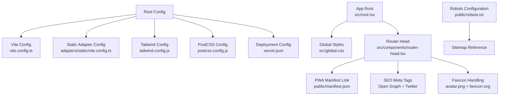
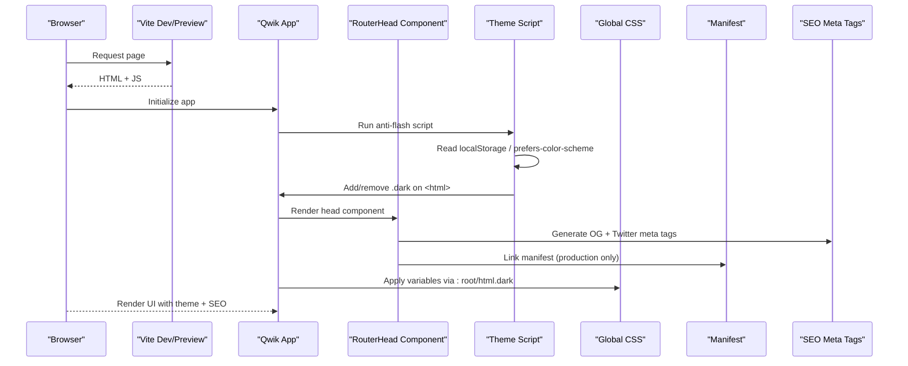
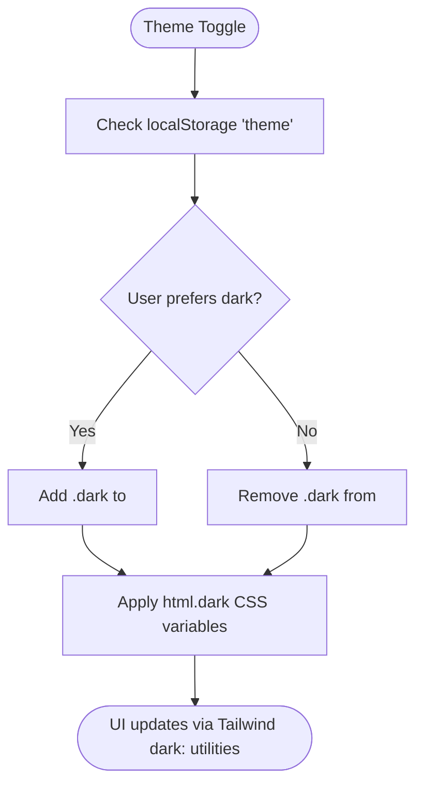
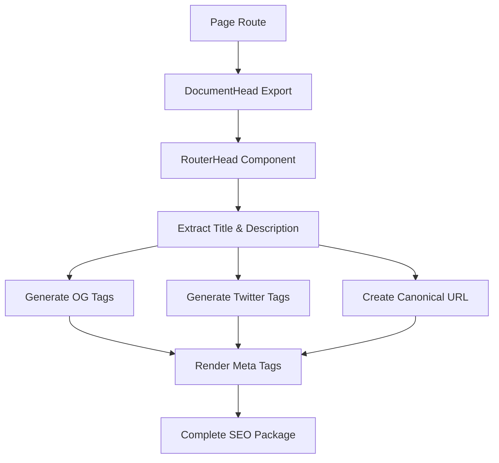
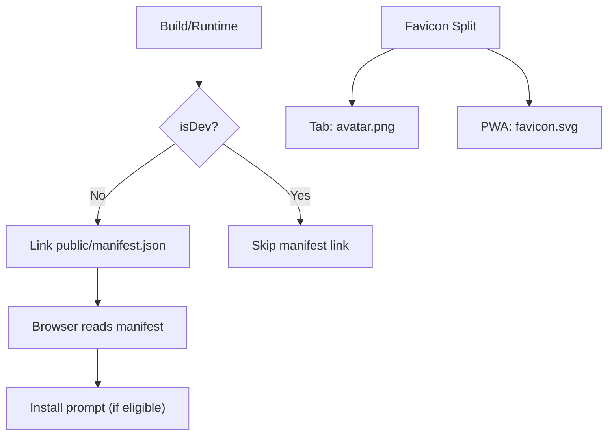
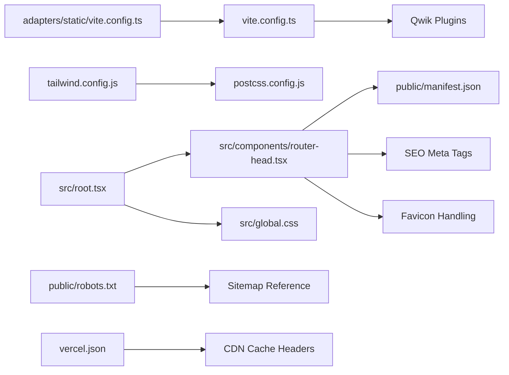

# Configuration & Customization

<cite>
**Referenced Files in This Document**
- [README.md](file://README.md)
- [package.json](file://package.json)
- [vite.config.ts](file://vite.config.ts)
- [adapters/static/vite.config.ts](file://adapters/static/vite.config.ts)
- [tailwind.config.js](file://tailwind.config.js)
- [postcss.config.js](file://postcss.config.js)
- [src/root.tsx](file://src/root.tsx)
- [src/global.css](file://src/global.css)
- [src/components/router-head.tsx](file://src/components/router-head.tsx)
- [public/manifest.json](file://public/manifest.json)
- [public/robots.txt](file://public/robots.txt)
- [vercel.json](file://vercel.json)
</cite>

## Update Summary
**Changes Made**
- Updated SEO optimization section with new RouterHead component implementation
- Added robots.txt configuration and sitemap reference
- Enhanced favicon and PWA icon handling documentation
- Updated dynamic metadata generation workflow
- Added Open Graph and Twitter Card meta tag configuration details

## Table of Contents
1. [Introduction](#introduction)
2. [Project Structure](#project-structure)
3. [Core Components](#core-components)
4. [Architecture Overview](#architecture-overview)
5. [Detailed Component Analysis](#detailed-component-analysis)
6. [Dependency Analysis](#dependency-analysis)
7. [Performance Considerations](#performance-considerations)
8. [Troubleshooting Guide](#troubleshooting-guide)
9. [Conclusion](#conclusion)
10. [Appendices](#appendices)

## Introduction
This document explains how to configure and customize the ModelComp platform, focusing on:
- Theme system built on Tailwind CSS v3.4 (color schemes, typography, responsive breakpoints)
- PWA configuration for mobile installation and offline behavior
- CSS architecture, global styles, and component styling approach
- Environment variables, build configurations, and deployment settings
- Branding customization (hex art, favicon, manifest)
- **Enhanced SEO optimization** with dynamic metadata generation, Open Graph tags, and Twitter Cards
- Performance tuning, bundle optimization, and caching strategies
- Extension points for new features, components, and data sources

ModelComp is a Qwik + Vite static site that compares AI coding models using pre-parsed scores generated at build time from research files. The UI includes dark/light mode, responsive layout with a mobile drawer menu, PWA manifest, brand assets, and comprehensive SEO support.

**Section sources**
- [README.md:1-16](file://README.md#L1-L16)
- [README.md:93-97](file://README.md#L93-L97)

## Project Structure
The project uses a feature-oriented structure under `src/` with routes, components, and data modules. Build and runtime configuration lives in root-level config files and adapters.

**Diagram sources**
- [vite.config.ts:1-16](file://vite.config.ts#L1-L16)
- [adapters/static/vite.config.ts:1-20](file://adapters/static/vite.config.ts#L1-L20)
- [tailwind.config.js:1-23](file://tailwind.config.js#L1-L23)
- [postcss.config.js:1-7](file://postcss.config.js#L1-L7)
- [vercel.json:1-23](file://vercel.json#L1-L23)
- [src/root.tsx:1-62](file://src/root.tsx#L1-L62)
- [src/global.css:1-54](file://src/global.css#L1-L54)
- [src/components/router-head.tsx:1-43](file://src/components/router-head.tsx#L1-L43)
- [public/manifest.json:1-18](file://public/manifest.json#L1-L18)
- [public/robots.txt:1-5](file://public/robots.txt#L1-L5)

**Section sources**
- [README.md:61-82](file://README.md#L61-L82)
- [package.json:11-24](file://package.json#L11-L24)

## Core Components
- Theme system: Tailwind CSS v3.4 with class-based dark mode and CSS variables for colors.
- **Enhanced SEO**: Dynamic metadata generation through RouterHead component with Open Graph and Twitter Card support.
- PWA: Web App Manifest linked conditionally in production; dual favicon handling for browser tabs vs. PWA icons.
- CSS architecture: Global base/components/utilities via PostCSS/Tailwind; theme variables applied on `:root` and `html.dark`.
- Build pipeline: Vite + Qwik plugins; static adapter for SSG; preview headers for no-cache during local testing.
- Deployment: Vercel headers for cache control on HTML vs. build assets.

Key responsibilities:
- `tailwind.config.js`: Defines color tokens mapped to CSS variables and enables class-based dark mode.
- `src/global.css`: Sets light/dark color variables, smooth scrolling, and body baseline styles.
- `src/root.tsx`: Anti-flash script to set `.dark` on `<html>` before first paint; renders app shell with RouterHead integration.
- **`src/components/router-head.tsx`**: Centralized SEO management with dynamic Open Graph, Twitter Cards, canonical URLs, and favicon handling.
- `public/manifest.json`: PWA metadata including name, display mode, theme color, and icon source.
- `public/robots.txt`: Search engine crawler configuration with sitemap reference.
- `vite.config.ts`: Registers Qwik plugins and sets preview headers.
- `adapters/static/vite.config.ts`: Static adapter configuration for SSG builds.
- `vercel.json`: CDN/cache headers for pages and build artifacts.

**Section sources**
- [tailwind.config.js:1-23](file://tailwind.config.js#L1-L23)
- [src/global.css:1-54](file://src/global.css#L1-L54)
- [src/root.tsx:1-62](file://src/root.tsx#L1-L62)
- [src/components/router-head.tsx:1-43](file://src/components/router-head.tsx#L1-L43)
- [public/manifest.json:1-18](file://public/manifest.json#L1-L18)
- [public/robots.txt:1-5](file://public/robots.txt#L1-L5)
- [vite.config.ts:1-16](file://vite.config.ts#L1-L16)
- [adapters/static/vite.config.ts:1-20](file://adapters/static/vite.config.ts#L1-L20)
- [vercel.json:1-23](file://vercel.json#L1-L23)

## Architecture Overview
The application bootstraps through Qwik City and Vite, applies Tailwind CSS, and renders an SSR-capable static site. The theme system relies on a small inline anti-flash script that toggles `.dark` on `<html>` based on user preference or system setting. **Enhanced SEO is managed through the RouterHead component**, which dynamically generates Open Graph and Twitter Card metadata based on page-specific content. PWA support is enabled by linking the manifest only in production.

**Diagram sources**
- [src/root.tsx:12-40](file://src/root.tsx#L12-L40)
- [src/components/router-head.tsx:4-42](file://src/components/router-head.tsx#L4-L42)
- [src/global.css:13-34](file://src/global.css#L13-L34)
- [public/manifest.json:1-18](file://public/manifest.json#L1-L18)

## Detailed Component Analysis

### Theme System (Tailwind CSS v3.4)
- Dark mode strategy: Class-based (`class`) so the anti-flash script can toggle `.dark` on `<html>` before the first paint.
- Color tokens: Tailwind utilities reference CSS variables defined in global styles. This allows both Tailwind utilities and raw CSS to respond to theme changes.
- Typography: Uses default Tailwind typography unless extended elsewhere; text colors are driven by CSS variables.
- Responsive breakpoints: Use Tailwind's default breakpoints (sm/md/lg/xl/2xl). Extend in `tailwind.config.js` if needed.

Customization steps:
- Change theme colors by editing CSS variables in global styles.
- Add new design tokens in Tailwind config mapped to CSS variables.
- Extend breakpoints or spacing scales in Tailwind config.

**Diagram sources**
- [src/root.tsx:18-33](file://src/root.tsx#L18-L33)
- [src/global.css:13-34](file://src/global.css#L13-L34)
- [tailwind.config.js:1-23](file://tailwind.config.js#L1-L23)

**Section sources**
- [tailwind.config.js:1-23](file://tailwind.config.js#L1-L23)
- [src/global.css:1-54](file://src/global.css#L1-L54)
- [src/root.tsx:18-33](file://src/root.tsx#L18-L33)

### Enhanced SEO Optimization (Dynamic Metadata Generation)
**Updated** - Significant SEO enhancements implemented through the RouterHead component with comprehensive social media support.

- **RouterHead Component**: Centralizes all SEO-related meta tags and structured data generation.
- **Open Graph Protocol**: Implements complete OG tags including site_name, title, description, type, and URL.
- **Twitter Cards**: Full Twitter Card support with summary card type, title, and description.
- **Canonical URLs**: Automatic canonical link generation based on current route.
- **Dynamic Content**: Meta descriptions are extracted from page-specific head objects and conditionally rendered.
- **Favicon Management**: Dual favicon support - PNG for browser tabs, SVG for PWA and Apple touch icons.

Implementation details:
- Uses `useDocumentHead()` hook to access page-specific metadata
- Leverages `useLocation()` for dynamic URL generation
- Conditionally renders description meta tags when available
- Integrates with Qwik City's routing system for automatic URL handling

**Diagram sources**
- [src/components/router-head.tsx:4-42](file://src/components/router-head.tsx#L4-L42)
- [src/routes/model/[slug]/index.tsx:437-450](file://src/routes/model/[slug]/index.tsx#L437-L450)

**Section sources**
- [src/components/router-head.tsx:1-43](file://src/components/router-head.tsx#L1-L43)
- [src/routes/model/[slug]/index.tsx:437-450](file://src/routes/model/[slug]/index.tsx#L437-L450)

### Robots.txt and Sitemap Configuration
**New** - Search engine crawler configuration with sitemap reference.

- **Robots Configuration**: Basic allow-all directive with sitemap location reference.
- **Sitemap Reference**: Points to localhost development server (configured during sync/build process).
- **Development Ready**: Provides immediate functionality while allowing dynamic sitemap generation.

Customization steps:
- Update sitemap URL to match your production domain.
- Configure additional crawl directives as needed.
- Integrate with build process for dynamic sitemap generation.

**Section sources**
- [public/robots.txt:1-5](file://public/robots.txt#L1-L5)

### PWA Configuration
- Manifest file: Declares app name, short name, start URL, display mode, theme/background colors, description, and icons.
- **Dual Icon Strategy**: 
  - `/avatar.png` (256x256 PNG) for browser tab favicon
  - `/favicon.svg` (SVG) for PWA install icon and Apple touch icon
- Conditional linking: The manifest link is included only when not in development.

Customization steps:
- Update manifest fields (name, description, colors).
- Replace icon sources and provide additional icon sizes if needed.
- Ensure both `/avatar.png` and `/favicon.svg` exist with appropriate branding.

**Diagram sources**
- [src/root.tsx:35-40](file://src/root.tsx#L35-L40)
- [src/components/router-head.tsx:22-24](file://src/components/router-head.tsx#L22-L24)
- [public/manifest.json:1-18](file://public/manifest.json#L1-L18)

**Section sources**
- [src/root.tsx:35-40](file://src/root.tsx#L35-L40)
- [src/components/router-head.tsx:22-24](file://src/components/router-head.tsx#L22-L24)
- [public/manifest.json:1-18](file://public/manifest.json#L1-L18)

### CSS Architecture and Global Styles
- Base layers: Tailwind base, components, and utilities are imported via PostCSS.
- Variables: Light defaults on `:root`; dark overrides on `html.dark`. Body background and text use these variables for consistent theming.
- Smooth scrolling and transitions: Applied globally for UX polish.

Customization steps:
- Adjust color variables for light/dark themes.
- Modify transition timings or add additional global rules.
- Extend Tailwind theme values to introduce custom spacing, fonts, or colors.

**Section sources**
- [src/global.css:1-54](file://src/global.css#L1-L54)
- [postcss.config.js:1-7](file://postcss.config.js#L1-L7)

### Build Configuration and Deployment Settings
- Vite config: Registers Qwik plugins and sets preview headers to avoid caching HTML during local preview.
- Static adapter: Enables SSR and static generation with a configured origin for preview.
- Deployment (Vercel): Sets cache-control headers for all paths and long-lived immutable caching for `/build/*`.

Customization steps:
- Adjust preview headers or enable/disable SSR depending on target.
- Update static adapter origin for your environment.
- Modify Vercel headers to match your CDN caching policy.

**Section sources**
- [vite.config.ts:1-16](file://vite.config.ts#L1-L16)
- [adapters/static/vite.config.ts:1-20](file://adapters/static/vite.config.ts#L1-L20)
- [vercel.json:1-23](file://vercel.json#L1-L23)

### Environment Variables
- Development flag: `import.meta.env.DEV` controls conditional rendering (e.g., PWA manifest link).
- Base URL: `import.meta.env.BASE_URL` resolves asset paths relative to the deployment base.
- Node engine: Enforced via package manager engines field.

Usage examples:
- Conditionally include PWA manifest only in production.
- Resolve asset URLs dynamically for different environments.

**Section sources**
- [src/root.tsx:40-44](file://src/root.tsx#L40-L44)
- [package.json:8-10](file://package.json#L8-L10)

### Branding Customization (Hex Art, Favicon, Manifest)
**Updated** - Enhanced favicon and PWA icon handling with dual strategy.

- **Dual Favicon Strategy**:
  - Browser tab favicon: `/avatar.png` (256x256 PNG) for optimal browser compatibility
  - PWA/Apple touch icon: `/favicon.svg` (SVG) for scalable PWA installation
- Manifest icon: Points to `/favicon.svg` for PWA installation.
- Hex art: Refer to repository documentation for where hex art assets live and how they are used in the hero section.
- Manifest metadata: Update name, short_name, description, theme_color, and background_color to reflect your brand.

Steps:
- Replace `/avatar.png` with your branded PNG for browser tabs.
- Replace `/favicon.svg` with your branded SVG for PWA installation.
- Edit `public/manifest.json` to align with your branding.
- Verify the hero section references the correct asset path if you change filenames.

**Section sources**
- [src/components/router-head.tsx:22-24](file://src/components/router-head.tsx#L22-L24)
- [public/manifest.json:1-18](file://public/manifest.json#L1-L18)
- [README.md:78-80](file://README.md#L78-L80)

### Performance Tuning, Bundle Optimization, and Caching
- Preview caching: Local preview disables HTML caching to aid debugging.
- Production caching: Vercel headers enforce revalidation for HTML and immutable caching for build assets.
- Build output: Static SSG produces optimized bundles; review adapter config for SSR and input entrypoints.

Optimization tips:
- Keep Tailwind content paths accurate to minimize unused CSS.
- Avoid heavy client-side logic; leverage Qwik's resumability and SSG.
- Tune CDN caching policies to balance freshness and performance.
- **SEO benefits**: Proper meta tags improve search rankings and social sharing appearance.

**Section sources**
- [vite.config.ts:8-13](file://vite.config.ts#L8-L13)
- [vercel.json:1-23](file://vercel.json#L1-L23)
- [adapters/static/vite.config.ts:5-18](file://adapters/static/vite.config.ts#L5-L18)

### Extension Points (New Features, Components, Data Sources)
- New features/components: Add components under `src/components/` and import them into routes or existing sections.
- New data sources: Follow the documented workflow to add findings files and run the sync script to regenerate data modules.
- Routing: Use Qwik City's file-based routing under `src/routes/`.
- **SEO Extension**: Add per-page metadata by exporting `head` objects in route files.

Guidelines:
- Keep data-driven content out of the UI; rely on generated data modules.
- Use the sync script to validate and register new sources automatically.
- Maintain strict TypeScript checks via the provided build command.
- **SEO Best Practice**: Always provide descriptive titles and meta descriptions for better search visibility.

**Section sources**
- [README.md:84-91](file://README.md#L84-L91)
- [README.md:31-44](file://README.md#L31-L44)

## Dependency Analysis
High-level dependencies among configuration and runtime files:

**Diagram sources**
- [vite.config.ts:1-16](file://vite.config.ts#L1-L16)
- [adapters/static/vite.config.ts:1-20](file://adapters/static/vite.config.ts#L1-L20)
- [tailwind.config.js:1-23](file://tailwind.config.js#L1-L23)
- [postcss.config.js:1-7](file://postcss.config.js#L1-L7)
- [src/root.tsx:1-62](file://src/root.tsx#L1-L62)
- [src/components/router-head.tsx:1-43](file://src/components/router-head.tsx#L1-L43)
- [src/global.css:1-54](file://src/global.css#L1-L54)
- [public/manifest.json:1-18](file://public/manifest.json#L1-L18)
- [public/robots.txt:1-5](file://public/robots.txt#L1-L5)
- [vercel.json:1-23](file://vercel.json#L1-L23)

**Section sources**
- [package.json:26-36](file://package.json#L26-L36)

## Performance Considerations
- Use Tailwind's purge/content configuration to limit CSS size.
- Prefer static generation for pages that do not require runtime data.
- Leverage immutable caching for build artifacts to improve repeat visits.
- Keep the anti-flash script minimal and synchronous to prevent flash-of-wrong-theme.
- **SEO Performance**: Well-structured meta tags improve search engine indexing and social sharing performance.

[No sources needed since this section provides general guidance]

## Troubleshooting Guide
Common issues and resolutions:
- Dark theme not applying: Ensure the anti-flash script runs and adds `.dark` to `<html>`, not `<body>`. Verify Tailwind's darkMode is set to `class`.
- **SEO Issues**: Check RouterHead component renders correctly and meta tags appear in page source.
- **Social Sharing**: Verify Open Graph and Twitter Card meta tags are present and properly formatted.
- **Favicon Problems**: Ensure both `/avatar.png` and `/favicon.svg` exist and are accessible.
- **PWA not installing**: Confirm the manifest is linked in production and the icon path exists.
- Preview shows cached HTML: Adjust preview headers or clear browser cache.
- Build warnings: Run the sync script to validate data and regenerate modules before building.

**Section sources**
- [src/root.tsx:18-33](file://src/root.tsx#L18-L33)
- [src/components/router-head.tsx:1-43](file://src/components/router-head.tsx#L1-L43)
- [tailwind.config.js:1-4](file://tailwind.config.js#L1-L4)
- [src/root.tsx:35-40](file://src/root.tsx#L35-L40)
- [vite.config.ts:8-13](file://vite.config.ts#L8-L13)

## Conclusion
ModelComp's configuration centers around a robust theme system powered by Tailwind CSS v3.4 and CSS variables, **enhanced SEO capabilities through dynamic metadata generation**, a lightweight PWA setup, and a clean build/deployment pipeline. The new RouterHead component provides comprehensive social media support with Open Graph and Twitter Cards, while maintaining flexible favicon handling for both browser tabs and PWA installation. Customize colors, breakpoints, and branding through the specified configuration files. For SEO, extend the router head component with meta tags and structured data. Optimize performance by leveraging static generation, proper caching headers, and Tailwind's content filtering. Use the documented extension points to add features, components, and data sources while maintaining deterministic builds.

[No sources needed since this section summarizes without analyzing specific files]

## Appendices
- Quick commands and workflows are documented in the repository README.
- Data flow and methodology details explain how model scores are parsed and rendered.

**Section sources**
- [README.md:18-30](file://README.md#L18-L30)
- [README.md:31-60](file://README.md#L31-L60)