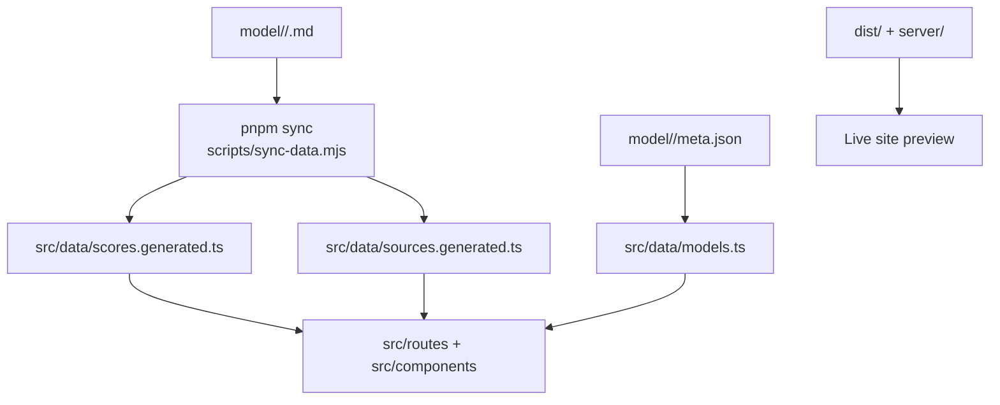

# Contributing Guide

<cite>
**Referenced Files in This Document**
- [README.md](file://README.md)
- [RULES.md](file://RULES.md)
- [AGENTS.md](file://AGENTS.md)
- [.agents/rules.md](file://.agents/rules.md)
- [.agents/tech-stack.md](file://.agents/tech-stack.md)
- [.agents/gemini-rate-limits.md](file://.agents/gemini-rate-limits.md)
- [model/README.md](file://model/README.md)
- [model-report-TEMPLATE.md](file://model-report-TEMPLATE.md)
- [model-findings.md](file://model-findings.md)
- [tasks/sync-data.md](file://tasks/sync-data.md)
- [tasks/research.md](file://tasks/research.md)
- [tasks/research-assign.md](file://tasks/research-assign.md)
</cite>

## Table of Contents
1. [Introduction](#introduction)
2. [Project Structure](#project-structure)
3. [Development Setup](#development-setup)
4. [Code Style and Standards](#code-style-and-standards)
5. [Repository Organization](#repository-organization)
6. [Pull Request Workflow and Code Review](#pull-request-workflow-and-code-review)
7. [Testing Requirements](#testing-requirements)
8. [Research Contribution Process](#research-contribution-process)
9. [Adding New Models](#adding-new-models)
10. [Registering New Reporting Agents](#registering-new-reporting-agents)
11. [Extending the Platform with Custom Features](#extending-the-platform-with-custom-features)
12. [AI Agent Rules, Automated Workflows, and Quality Gates](#ai-agent-rules-automated-workflows-and-quality-gates)
13. [Communication Protocols, Issue Reporting, and Community Guidelines](#communication-protocols-issue-reporting-and-community-guidelines)
14. [Templates, Checklists, and Examples](#templates-checklists-and-examples)
15. [Release Process, Version Management, and Backward Compatibility](#release-process-version-management-and-backward-compatibility)
16. [Troubleshooting Guide](#troubleshooting-guide)
17. [Conclusion](#conclusion)

## Introduction
ModelComp is a static site that compares AI coding models across tool use, reasoning, context window, multimodal support, coding ability, and cost efficiency. Scores are parsed at build time from research files under `model/<slug>/`, so there are no hardcoded numbers in the UI. Contributors can add new models, new reporting agents, or extend the frontend without editing generated data files.

This guide explains how to set up the project, follow code style standards, organize contributions, run the pull request workflow, perform research contributions, add models and agents, extend features, and understand the automated workflows and quality gates that keep scores and the site consistent.

**Section sources**
- [README.md:1-30](file://README.md#L1-L30)

## Project Structure
At a high level:
- `model/<slug>/` contains per-model research: one findings file per reporting agent, an auto-generated `average.md`, and curated `meta.json`.
- `src/routes/` holds Qwik City pages (compare view and per-model detail).
- `src/components/` holds UI components for comparison, hexagon radar, model cards, methodology, header, theme toggle, and footer.
- `src/data/models.ts` hydrates the model registry and results-source ordering.
- `scripts/sync-data.mjs` powers `pnpm sync`, which pre-parses findings into generated TypeScript files and registers new sources.
- `.agents/` documents tech stack, repo rules, and AI agent operating constraints.
- `tasks/` defines research delegation and synchronization procedures.

**Diagram sources**
- [README.md:31-44](file://README.md#L31-L44)
- [.agents/rules.md:25-29](file://.agents/rules.md#L25-L29)

**Section sources**
- [README.md:61-82](file://README.md#L61-L82)
- [.agents/rules.md:9-23](file://.agents/rules.md#L9-L23)

## Development Setup
Use pnpm only. The locked stack requires Node.js ≥ 18.17 and pnpm 9.15.4.

Quick commands:
- `pnpm dev`: Start the development server (SSR mode).
- `pnpm sync`: Deterministic data sync — recompute averages, register new sources, validate findings and `meta.json`.
- `pnpm build.types`: Typecheck (`tsc --noEmit`). Zero errors required.
- `pnpm build`: Full build — types, client, server, and static SSG into `dist/`.
- `pnpm preview`: Serve the last production build locally.

Standard workflow after any data change:
`pnpm sync && pnpm build.types && pnpm build`

For quiet sync output, use `pnpm sync:quiet`.

**Section sources**
- [README.md:18-30](file://README.md#L18-L30)
- [.agents/tech-stack.md:6-29](file://.agents/tech-stack.md#L6-L29)
- [tasks/sync-data.md:8-17](file://tasks/sync-data.md#L8-L17)

## Code Style and Standards
- Framework: Qwik 1.20 + Qwik City with Vite 7.
- Language: TypeScript 5.6 with strict mode.
- Styling: Tailwind CSS v3.4 only; do not use v4 syntax.
- Package manager: pnpm 9.15.4 only; npm/yarn are not supported.
- Build outputs: `dist/` and `server/` are generated; never hand-edit them.
- Data layer: Findings markdown is pre-parsed into generated TypeScript files; components read `MODELS` only.
- Frontend conventions: Radar axis order is fixed; per-model pages are pre-rendered; tooltips show raw values or scores as appropriate.

When contributing code:
- Keep imports and component usage aligned with the existing data layer.
- Do not hardcode model IDs or default selections on the homepage.
- Use Tailwind utilities available in v3.4.
- Run typecheck and full build before submitting changes.

**Section sources**
- [.agents/tech-stack.md:11-34](file://.agents/tech-stack.md#L11-L34)
- [.agents/rules.md:52-65](file://.agents/rules.md#L52-L65)
- [README.md:93-98](file://README.md#L93-L98)

## Repository Organization
- Per-model folders live under `model/<slug>/`. Each folder has:
  - One findings file per reporting agent.
  - An auto-generated `average.md`.
  - A curated `meta.json`.
- Voice and speech models belong under `models_voice/<slug>/`; finance models may be placed under `models_finance/<slug>/`. Sync currently scans `model/` only until wiring is complete.
- Generated data files live under `src/data/` and must not be edited by hand.
- Research templates and logs live at the repository root: `model-report-TEMPLATE.md` and `model-findings.md`.

Slug conventions:
- Use dots for version numbers (e.g., `gpt-5.5`), not hyphens.
- Hyphenated segments remain when they are not versions (e.g., codenames or parameter sizes).
- Filenames for findings use letters, digits, underscores, and optional dots inside stems.

**Section sources**
- [model/README.md:1-30](file://model/README.md#L1-L30)
- [RULES.md:37-44](file://RULES.md#L37-L44)
- [.agents/rules.md:9-17](file://.agents/rules.md#L9-L17)

## Pull Request Workflow and Code Review
Recommended flow:
1. Create a feature branch from the main branch.
2. Make minimal, focused changes:
   - For data-only changes, edit findings files or `meta.json` and run `pnpm sync && pnpm build.types && pnpm build`.
   - For code changes, update routes, components, or data wiring while following the data-layer contract.
3. Verify locally:
   - Run typecheck and full build.
   - Spot-check the generated output and relevant pages.
4. Open a pull request with:
   - A clear description of what changed and why.
   - Evidence that `pnpm sync` passed and the build is green.
   - Screenshots or links if UI behavior changed.
5. Address review feedback promptly.
6. After approval, ensure the branch is up to date with the target branch and merge according to repository policy.

Review checklist:
- Does the change preserve score permanence and data integrity?
- Are generated files untouched unless regenerated by `pnpm sync`?
- Are relative links and filenames valid?
- Is the build green and does the site render correctly?

**Section sources**
- [README.md:84-91](file://README.md#L84-L91)
- [.agents/rules.md:61-65](file://.agents/rules.md#L61-L65)

## Testing Requirements
There is no test framework configured. Verification relies on:
- `pnpm build.types`: TypeScript strict check with zero errors.
- `pnpm build`: Full build producing `dist/` and `server/`.
- Manual spot-check of `dist/index.html` and relevant per-model pages.

Quality gates:
- All findings must parse successfully.
- Score lines must match the parser contract.
- `average.md` must be recomputed by `pnpm sync`, not edited manually.
- Any drift beyond tolerance triggers automatic correction or failure depending on the rule.

**Section sources**
- [README.md:25-29](file://README.md#L25-L29)
- [tasks/sync-data.md:66-113](file://tasks/sync-data.md#L66-L113)

## Research Contribution Process
Research contributions create independent findings files for each reporting agent. Follow these steps:

1. Resolve your identity and STEM using `tasks/research-assign.md`.
2. Copy `model-report-TEMPLATE.md` into `model/<slug>/<Source_Name>.md`.
3. Conduct fresh public research for the model:
   - Record raw benchmarks with sources.
   - Derive normalized 1–100 scores using the methodology.
   - Compute Overall as the half-up mean of the five quality dimensions; Cost efficiency is scored independently and never counts toward Overall.
4. If you find zero verified public benchmark numbers, save `<Source_Name>.md.excluded` instead of a scored file.
5. Fill the signature block with your display name, vendor/model ID, and date.
6. Remove template notices and submission checklists before saving.
7. Do not run builds yourself during research tasks; the orchestrator runs `pnpm sync && pnpm build.types && pnpm build` after completion.

Permanence rules:
- Never delete, overwrite, rename, or move existing findings files or model folders.
- Self-excluded files stay quarantined until genuinely replaced with evidence-backed reports.
- Below-gate or out-of-top-10 reports remain on disk and on the site; they only affect average computation.

**Section sources**
- [tasks/research.md:19-34](file://tasks/research.md#L19-L34)
- [model-report-TEMPLATE.md:1-104](file://model-report-TEMPLATE.md#L1-L104)
- [RULES.md:8-36](file://RULES.md#L8-L36)
- [tasks/research-assign.md:1-29](file://tasks/research-assign.md#L1-L29)

## Adding New Models
To add a new model:
1. Create `model/<slug>/` using the filesystem-safe slug convention.
2. Add one or more findings files and a `meta.json`.
3. Run `pnpm sync` to compute `average.md`, validate metadata, and generate data files.
4. Run `pnpm build.types && pnpm build`.
5. Verify the model appears in selectors, cards, and its per-model page.

`meta.json` requirements:
- Required fields: `id`, `name`, `short`, `contextWindow`, `modalities`, `pricingNote`.
- Optional fields: `pricingTiers`, `freeTierNote`, `noFreeId`.
- Display names must use official casing and spaces, not underscores.

Voice and finance routing:
- Voice/speech models go under `models_voice/<slug>/`.
- Finance models may go under `models_finance/<slug>/`.
- Until wiring is complete, sync scans `model/` only.

**Section sources**
- [model/README.md:59-70](file://model/README.md#L59-L70)
- [model/README.md:32-43](file://model/README.md#L32-L43)
- [RULES.md:37-44](file://RULES.md#L37-L44)

## Registering New Reporting Agents
A new reporting agent is registered automatically when you drop its findings files into model folders:
1. Drop `<Source_Name>.md` into every model it evaluated.
2. Run `pnpm sync`.
3. The source is added to `src/data/sources.generated.ts`, and the Results-source dropdown updates automatically.
4. Run `pnpm build.types && pnpm build`.

Important:
- Do not reorder existing entries in the Results-source dropdown.
- New sources append last and sort by their own average Overall.
- Components read `MODELS` only; generated files hold numbers and registry definitions.

**Section sources**
- [model/README.md:72-77](file://model/README.md#L72-L77)
- [tasks/sync-data.md:48-52](file://tasks/sync-data.md#L48-L52)
- [.agents/rules.md:25-29](file://.agents/rules.md#L25-L29)

## Extending the Platform with Custom Features
When extending the platform:
- Add routes under `src/routes/` following Qwik City conventions.
- Add components under `src/components/` and reuse existing patterns for hexagons, tables, and cards.
- Read model data through `MODELS` in `src/data/models.ts`; do not import findings markdown directly.
- Avoid hardcoding defaults for model selection; let dynamic discovery drive the compare view.
- Keep Tailwind utilities within v3.4.
- Regenerate data with `pnpm sync` whenever findings or metadata change.

Frontend notes:
- Per-model pages are pre-rendered and linked from cards and legends.
- Tooltips should show raw values where appropriate and scores where documented.
- The Results-source selector swaps the active score view consistently across hexagon, table, legend, and cards.

**Section sources**
- [.agents/rules.md:25-29](file://.agents/rules.md#L25-L29)
- [.agents/rules.md:52-59](file://.agents/rules.md#L52-L59)
- [README.md:61-72](file://README.md#L61-L72)

## AI Agent Rules, Automated Workflows, and Quality Gates
AI agents must follow strict operating rules:
- Every turn must include a tool call; text-only turns crash the API.
- Do not run build or sync commands during task execution; delegate them to the user at completion.
- Execute multi-step tasks continuously until the queue is empty or revoked.
- Preserve research permanence: never delete or overwrite files except under sanctioned conditions.
- Respect rate limits: one call every ~12 seconds on average, with TPM budgeting.

Automated workflows:
- `pnpm sync` validates filenames, parses scores, quarantines evidence-free files, recomputes averages, registers new sources, and emits deterministic generated files.
- The pre-commit hook rejects commits that delete tracked research files.
- The rater gate filters which reports count toward averages but never removes models from the site.

Quality gates:
- Score-line format must match the parser contract.
- Overall drift beyond tolerance is auto-corrected or fails parsing.
- `average.md` is always recomputed by sync; manual edits break invariants.

**Section sources**
- [.agents/gemini-rate-limits.md:12-59](file://.agents/gemini-rate-limits.md#L12-L59)
- [AGENTS.md:6-11](file://AGENTS.md#L6-L11)
- [tasks/sync-data.md:19-64](file://tasks/sync-data.md#L19-L64)
- [RULES.md:8-36](file://RULES.md#L8-L36)

## Communication Protocols, Issue Reporting, and Community Guidelines
- Use the canonical delegator file `tasks/research-assign.md` for research assignments.
- Follow precedence: `RULES.md` wins over other docs.
- Keep research independent: do not read peer findings before writing your report.
- Preserve auditability: sign every findings file and maintain the cross-model log.
- Prefer incremental saves and proposal-based enrichment for existing files older than seven days.
- Do not commit, push, or open PRs unless explicitly asked; prefer editing files over creating new ones when instructed.

Community expectations:
- Be precise about vendor names, IDs, pricing, and modalities.
- Never invent benchmark numbers; mark missing evidence clearly.
- Keep documentation references accurate and relative paths resolvable.

**Section sources**
- [tasks/research-assign.md:1-29](file://tasks/research-assign.md#L1-L29)
- [AGENTS.md:13-22](file://AGENTS.md#L13-L22)
- [.agents/rules.md:38-50](file://.agents/rules.md#L38-L50)
- [.agents/rules.md:61-65](file://.agents/rules.md#L61-L65)

## Templates, Checklists, and Examples
Use these resources for common contribution scenarios:

- New findings file:
  - Copy `model-report-TEMPLATE.md`.
  - Replace placeholders, add raw benchmarks, derive normalized scores, and fill the signature.
  - Save under `model/<slug>/<Source_Name>.md`.

- Self-exclusion:
  - If no verified public benchmarks exist, save `<Source_Name>.md.excluded` with negative findings notes.
  - Do not invent placeholder scores.

- Enrichment proposal:
  - If your own findings file is older than seven days and fresh evidence would change scores, emit an enrichment proposal rather than overwriting in-pass.

- Adding a model:
  - Scaffold `model/<slug>/`, add findings and `meta.json`, then run sync and build.

- Adding a reporting agent:
  - Drop findings files into model folders, run sync, and verify the Results-source dropdown.

Examples of signed findings and cross-model attribution are maintained in `model-findings.md`.

**Section sources**
- [model-report-TEMPLATE.md:1-104](file://model-report-TEMPLATE.md#L1-L104)
- [model-findings.md:1-202](file://model-findings.md#L1-L202)
- [tasks/research.md:96-143](file://tasks/research.md#L96-L143)

## Release Process, Version Management, and Backward Compatibility
Release process:
- Ensure all data changes pass `pnpm sync`.
- Run `pnpm build.types && pnpm build`.
- Spot-check generated output and key pages.
- Update `REPORT.md` with a summary of changes.

Version management:
- Model slugs use dots for versions (e.g., `gpt-5.5`) and hyphens for non-version segments.
- Sync fails loudly on hyphen-versioned folders to prevent duplicates.
- Generated files are committed as build inputs; do not hand-edit them.

Backward compatibility:
- Research files and model folders are permanent; avoid deletions and renames.
- The rater gate affects average computation, not display.
- Methodology v4 excludes Cost efficiency from Overall; sync auto-corrects drifted Overall values.
- Existing below-gate and out-of-top-10 reports remain visible even if they do not count toward averages.

**Section sources**
- [model/README.md:7-16](file://model/README.md#L7-L16)
- [tasks/sync-data.md:107-113](file://tasks/sync-data.md#L107-L113)
- [RULES.md:46-64](file://RULES.md#L46-L64)
- [README.md:46-59](file://README.md#L46-L59)

## Troubleshooting Guide
Common issues and resolutions:
- Build fails due to invalid score lines:
  - Ensure score labels exactly match the parser contract.
  - Verify Overall equals the half-up mean of the five quality dimensions.
- Sync quarantines a findings file:
  - Check for “no verified public score found” rows, zero quality dims, or flat identical dims without cited numbers.
  - Add verified evidence or leave the file excluded.
- New source does not appear in Results-source:
  - Run `pnpm sync` to register the source.
  - Confirm filename matches allowed characters and stem conventions.
- Meta validation fails:
  - Add required fields to `meta.json` and ensure display names use correct casing and spacing.
- Homepage defaults look wrong:
  - Do not hardcode model IDs; rely on dynamic top-three selection.

Operational tips:
- Use `pnpm sync:quiet` to focus on FAIL lines.
- Keep relative links resolvable from `model/<slug>/`.
- Do not run builds mid-task; delegate to the orchestrator.

**Section sources**
- [tasks/sync-data.md:19-64](file://tasks/sync-data.md#L19-L64)
- [tasks/sync-data.md:66-113](file://tasks/sync-data.md#L66-L113)
- [.agents/gemini-rate-limits.md:39-59](file://.agents/gemini-rate-limits.md#L39-L59)

## Conclusion
Contributions to ModelComp center on preserving research permanence, maintaining score integrity, and keeping the site dynamically driven by validated data. Follow the setup commands, adhere to the code and data contracts, use the templates and checklists, and rely on `pnpm sync` and the build pipeline to enforce consistency. When adding models, agents, or features, prioritize clarity, traceability, and backward compatibility so the platform remains reliable for both developers and researchers.