# Data Management System

<cite>
**Referenced Files in This Document**
- [README.md](file://README.md)
- [model/README.md](file://model/README.md)
- [model-findings.md](file://model-findings.md)
- [scripts/sync-data.mjs](file://scripts/sync-data.mjs)
- [tasks/sync-data.md](file://tasks/sync-data.md)
- [scripts/lib/parse.mjs](file://scripts/lib/parse.mjs)
- [scripts/lib/validate.mjs](file://scripts/lib/validate.mjs)
- [scripts/lib/average.mjs](file://scripts/lib/average.mjs)
- [scripts/lib/codegen.mjs](file://scripts/lib/codegen.mjs)
- [src/data/scores.generated.ts](file://src/data/scores.generated.ts)
- [src/data/sources.generated.ts](file://src/data/sources.generated.ts)
- [src/data/catalog.generated.ts](file://src/data/catalog.generated.ts)
- [src/data/rankings.generated.ts](file://src/data/rankings.generated.ts)
- [src/data/models.ts](file://src/data/models.ts)
- [model/Inkling/meta.json](file://model/Inkling/meta.json)
</cite>

## Update Summary
**Changes Made**
- Updated scoring infrastructure documentation to reflect enhanced scores.generated.ts with expanded evaluator-model combinations and recalculated averages across all model categories
- Added comprehensive documentation for new generated artifacts: catalog.generated.ts and rankings.generated.ts
- Expanded normalized score mappings documentation for comparison interface with 67 reporting agents
- Updated SourceKey union type documentation to reflect substantial expansion in evaluator coverage
- Enhanced registry and code generation sections with new model coverage and performance optimizations
- Updated architecture diagrams to include new pre-baked data structures for O(1) lookup performance

## Table of Contents
1. [Introduction](#introduction)
2. [Project Structure](#project-structure)
3. [Core Components](#core-components)
4. [Architecture Overview](#architecture-overview)
5. [Detailed Component Analysis](#detailed-component-analysis)
6. [Dependency Analysis](#dependency-analysis)
7. [Performance Considerations](#performance-considerations)
8. [Troubleshooting Guide](#troubleshooting-guide)
9. [Conclusion](#conclusion)

## Introduction
ModelComp is a static site that compares AI coding models across six normalized dimensions: Tool use, Reasoning, Context window, Multimodal, Coding, and Cost efficiency. Every score on the site is parsed at build time from research markdown files under `model/<slug>/`, so there are no hardcoded numbers in the UI. The system uses a multi-agent evaluation methodology where each reporting agent contributes a findings file with 1–100 scores per dimension. A deterministic sync pipeline recomputes averages, validates metadata, quarantines evidence-free reports, and generates TypeScript artifacts consumed by the application.

The data model centers around:
- An implicit `AiModel` interface representing a model entry with short display metadata and normalized scores.
- A `ModelScores` interface for compact numeric scores used by generated code.
- A `SourceKey` union type identifying each reporting agent’s findings file.

This document explains the data structures, scoring methodology, synchronization pipeline, validation rules, and relationships between research markdown, generated TypeScript, and runtime data.

**Section sources**
- [README.md:1-16](file://README.md#L1-L16)
- [README.md:31-44](file://README.md#L31-L44)
- [README.md:46-59](file://README.md#L46-L59)

## Project Structure
The repository organizes model research data under `model/<slug>/`. Each model folder contains:
- One or more findings files named `<Source_Name>.md`, one per reporting agent.
- A generated `average.md` containing arithmetic means over a top cohort.
- A curated `meta.json` describing display metadata.

At build time, the sync script produces:
- `src/data/scores.generated.ts`: compact numeric scores per source.
- `src/data/sources.generated.ts`: SourceKey union and SOURCE_DEFS registry.
- `src/data/catalog.generated.ts`: pre-baked summary metadata catalog.
- `src/data/rankings.generated.ts`: top-3 model IDs per results source key.
- `src/data/models.ts`: hydrates MODELS and derives Results-source ordering.

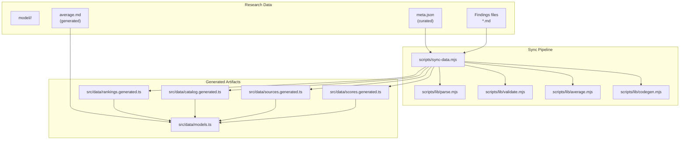

**Diagram sources**
- [README.md:31-44](file://README.md#L31-L44)
- [scripts/sync-data.mjs:1-29](file://scripts/sync-data.mjs#L1-L29)
- [scripts/lib/parse.mjs:1-7](file://scripts/lib/parse.mjs#L1-L7)
- [scripts/lib/validate.mjs:1-8](file://scripts/lib/validate.mjs#L1-L8)
- [scripts/lib/average.mjs:1-8](file://scripts/lib/average.mjs#L1-L8)
- [scripts/lib/codegen.mjs:1-7](file://scripts/lib/codegen.mjs#L1-L7)

**Section sources**
- [README.md:61-82](file://README.md#L61-L82)
- [model/README.md:1-30](file://model/README.md#L1-L30)

## Core Components
This section documents the core data model and processing logic behind ModelComp’s data management system.

### AiModel Interface
`AiModel` represents a model entry consumed by the UI. It includes:
- Display name and short description sourced from `meta.json`.
- Context window and modalities from `meta.json`.
- Pricing note (and optional pricing tiers/free-tier notes).
- Normalized scores per dimension and overall score derived from research findings.

The interface is not hand-edited; it is hydrated at build time from generated scores and catalog metadata.

**Section sources**
- [README.md:31-44](file://README.md#L31-L44)
- [model/README.md:32-57](file://model/README.md#L32-L57)

### ModelScores Interface
`ModelScores` is the compact numeric representation emitted into `scores.generated.ts`. It contains seven fields:
- tool
- reasoning
- context
- multimodal
- coding
- cost
- overall

These map directly to the canonical labels defined in the parsing layer.

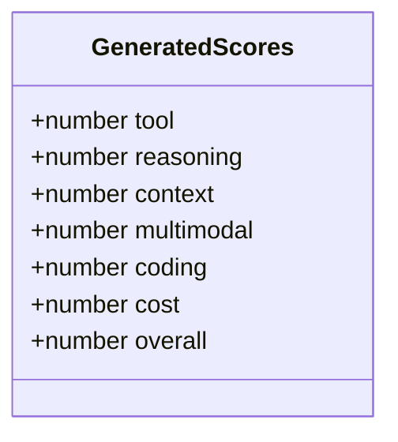

**Diagram sources**
- [scripts/lib/codegen.mjs:107-139](file://scripts/lib/codegen.mjs#L107-L139)

**Section sources**
- [scripts/lib/codegen.mjs:107-139](file://scripts/lib/codegen.mjs#L107-L139)

### SourceKey Union Type
`SourceKey` is a union of string literals identifying each reporting agent’s findings file stem. It is auto-generated and maintained by the sync pipeline:
- New stems are appended to the union and SOURCE_DEFS array.
- Labels and slugs are resolved via overrides and catalog lookup.
- Virtual sort views are pruned from the registry.

**Updated** The SourceKey union now includes 67 reporting agents, reflecting substantial expansion in evaluator-model combinations and enhanced normalized score mappings for the comparison interface.

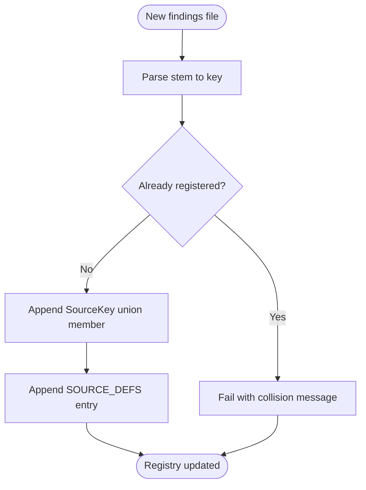

**Diagram sources**
- [scripts/lib/codegen.mjs:19-57](file://scripts/lib/codegen.mjs#L19-L57)
- [scripts/lib/codegen.mjs:65-84](file://scripts/lib/codegen.mjs#L65-L84)

**Section sources**
- [scripts/lib/codegen.mjs:19-57](file://scripts/lib/codegen.mjs#L19-L57)
- [scripts/lib/codegen.mjs:65-84](file://scripts/lib/codegen.mjs#L65-L84)
- [src/data/sources.generated.ts:5-67](file://src/data/sources.generated.ts#L5-L67)

### Scoring Methodology
Six dimensions are scored 1–100:
- Tool use
- Reasoning
- Context window
- Multimodal
- Coding
- Cost efficiency

Overall Score is the rounded mean of the five quality dimensions; Cost efficiency is scored independently and never counts toward Overall. Averages are computed as arithmetic means over the top-10 cohort of eligible raters, with half-up rounding to one decimal.

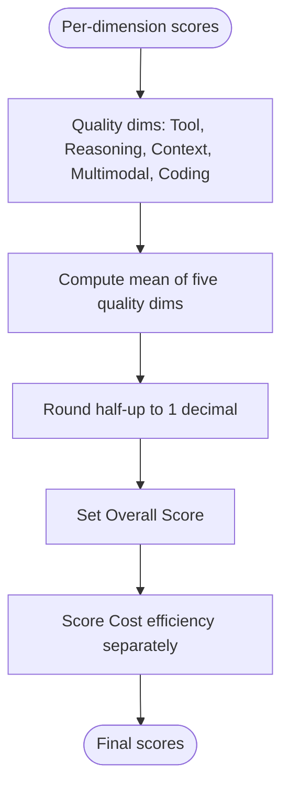

**Diagram sources**
- [scripts/lib/parse.mjs:8-31](file://scripts/lib/parse.mjs#L8-L31)
- [scripts/lib/parse.mjs:69-78](file://scripts/lib/parse.mjs#L69-L78)

**Section sources**
- [README.md:46-59](file://README.md#L46-L59)
- [scripts/lib/parse.mjs:8-31](file://scripts/lib/parse.mjs#L8-L31)
- [scripts/lib/parse.mjs:69-78](file://scripts/lib/parse.mjs#L69-L78)

### Multi-Agent Evaluation and Rater Gate
Each reporting agent contributes a findings file with normalized scores. Only reports from models whose own committed average Overall exceeds the rater gate count toward another model’s average. The gate threshold is strict greater-than. If no raters qualify, the system falls back to averaging all available reports while still applying the top-10 cap.

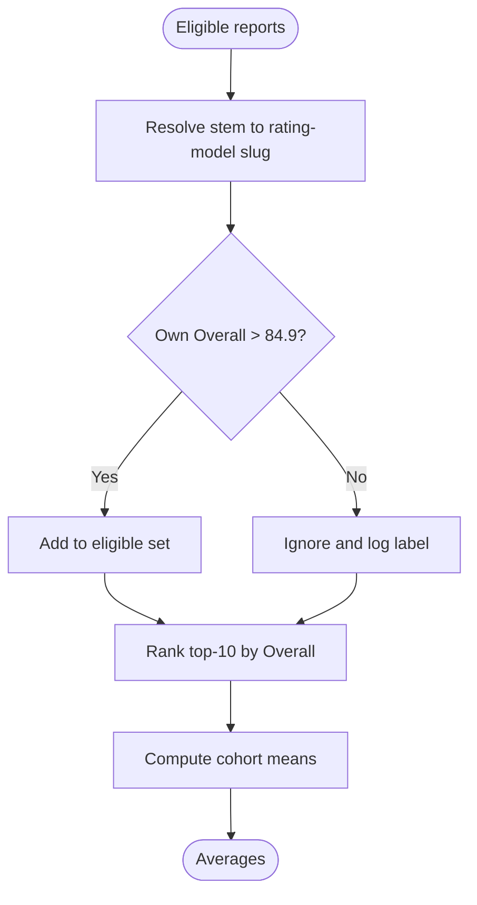

**Diagram sources**
- [scripts/lib/parse.mjs:38-39](file://scripts/lib/parse.mjs#L38-L39)
- [scripts/lib/parse.mjs:99-117](file://scripts/lib/parse.mjs#L99-L117)
- [scripts/sync-data.mjs:211-226](file://scripts/sync-data.mjs#L211-L226)
- [scripts/sync-data.mjs:372-386](file://scripts/sync-data.mjs#L372-L386)

**Section sources**
- [scripts/lib/parse.mjs:38-39](file://scripts/lib/parse.mjs#L38-L39)
- [scripts/lib/parse.mjs:99-117](file://scripts/lib/parse.mjs#L99-L117)
- [scripts/sync-data.mjs:211-226](file://scripts/sync-data.mjs#L211-L226)
- [scripts/sync-data.mjs:372-386](file://scripts/sync-data.mjs#L372-L386)

### Evidence-Free Report Quarantine
Reports lacking verified benchmarks are quarantined automatically:
- Eight or more “no verified public score found” rows and zero measured values.
- Zero in any quality dimension when it indicates “no data”.
- Flat-identical quality dimensions with zero cited numbers.

Quarantined files are renamed to `.md.excluded` and excluded from parsing, averaging, and registration.

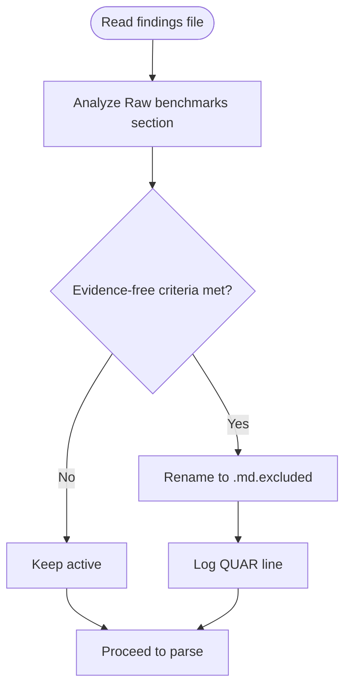

**Diagram sources**
- [scripts/sync-data.mjs:259-276](file://scripts/sync-data.mjs#L259-L276)
- [tasks/sync-data.md:19-30](file://tasks/sync-data.md#L19-L30)

**Section sources**
- [scripts/sync-data.mjs:259-276](file://scripts/sync-data.mjs#L259-L276)
- [tasks/sync-data.md:19-30](file://tasks/sync-data.md#L19-L30)

### Meta.json Schema
`meta.json` provides curated display metadata for each model. Required fields include id, name, short, contextWindow, modalities, and pricingNote. Optional fields include pricingTiers, freeTierNote, and noFreeId. The name must be the official vendor display name with spaces, not underscores.

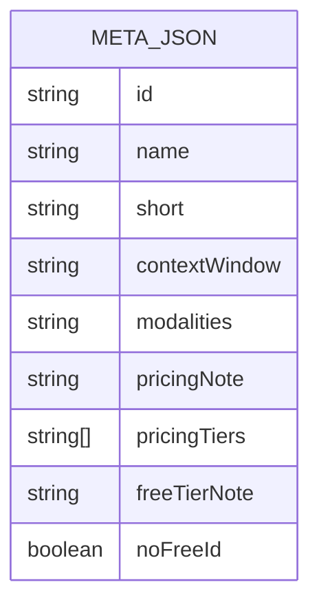

**Diagram sources**
- [model/README.md:32-57](file://model/README.md#L32-L57)
- [model/Inkling/meta.json:1-8](file://model/Inkling/meta.json#L1-L8)

**Section sources**
- [model/README.md:32-57](file://model/README.md#L32-L57)
- [model/Inkling/meta.json:1-8](file://model/Inkling/meta.json#L1-L8)

### Findings File Format
Findings files follow a template and contain:
- Model card and raw benchmarks.
- Seven normalized 1–100 scores with exact labels.
- Signature attributing the reporting agent.

The parser enforces the canonical label order and requires all seven lines. Drift in Overall beyond tolerance triggers an automatic rewrite of just the Overall number.

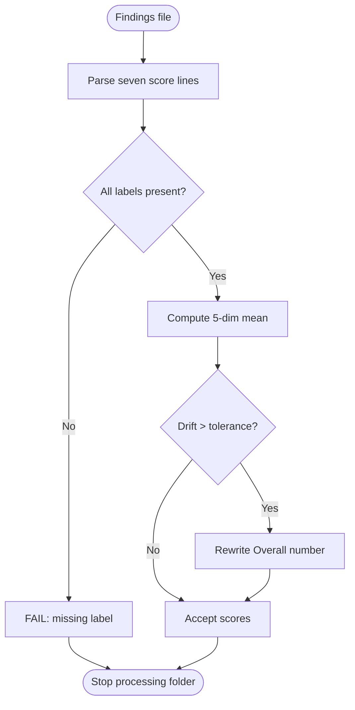

**Diagram sources**
- [scripts/lib/parse.mjs:47-60](file://scripts/lib/parse.mjs#L47-L60)
- [scripts/lib/parse.mjs:69-87](file://scripts/lib/parse.mjs#L69-L87)
- [scripts/sync-data.mjs:347-370](file://scripts/sync-data.mjs#L347-L370)

**Section sources**
- [model/README.md:17-24](file://model/README.md#L17-L24)
- [scripts/lib/parse.mjs:47-60](file://scripts/lib/parse.mjs#L47-L60)
- [scripts/lib/parse.mjs:69-87](file://scripts/lib/parse.mjs#L69-L87)
- [scripts/sync-data.mjs:347-370](file://scripts/sync-data.mjs#L347-L370)

### Enhanced Generated Artifacts
**Updated** The system now generates additional TypeScript artifacts to support the expanded comparison interface with 67 reporting agents:

#### Catalog Generated (`catalog.generated.ts`)
Pre-baked summary metadata catalog for tracked models, providing efficient access to model information without dynamic imports. The catalog supports O(1) lookup performance for the enhanced comparison interface.

#### Rankings Generated (`rankings.generated.ts`)
Pre-baked top-3 model IDs per results source key for instant O(1) lookup, supporting the enhanced comparison interface with expanded evaluator-model combinations. This eliminates runtime computation overhead for frequently accessed ranking data.

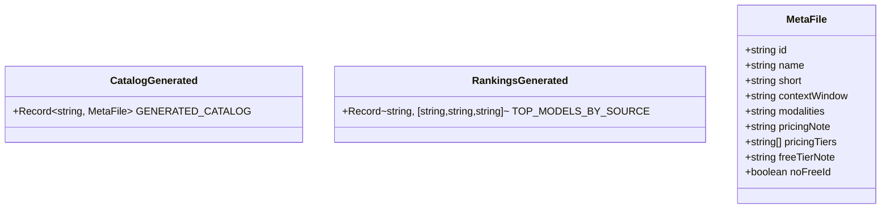

**Diagram sources**
- [src/data/catalog.generated.ts:1-16](file://src/data/catalog.generated.ts#L1-L16)
- [src/data/rankings.generated.ts:1-70](file://src/data/rankings.generated.ts#L1-L70)

**Section sources**
- [src/data/catalog.generated.ts:1-16](file://src/data/catalog.generated.ts#L1-L16)
- [src/data/rankings.generated.ts:1-70](file://src/data/rankings.generated.ts#L1-L70)

## Architecture Overview
The data synchronization pipeline transforms research markdown into typed, compact artifacts consumed by the UI.

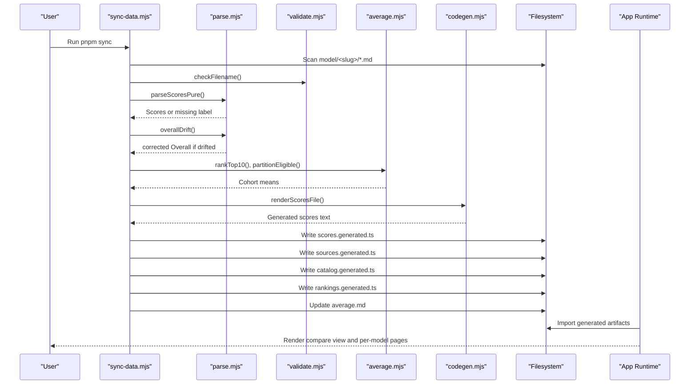

**Diagram sources**
- [scripts/sync-data.mjs:1-29](file://scripts/sync-data.mjs#L1-L29)
- [scripts/lib/parse.mjs:47-60](file://scripts/lib/parse.mjs#L47-L60)
- [scripts/lib/validate.mjs:54-60](file://scripts/lib/validate.mjs#L54-L60)
- [scripts/lib/average.mjs:33-44](file://scripts/lib/average.mjs#L33-L44)
- [scripts/lib/codegen.mjs:107-139](file://scripts/lib/codegen.mjs#L107-L139)

**Section sources**
- [README.md:31-44](file://README.md#L31-L44)
- [tasks/sync-data.md:19-62](file://tasks/sync-data.md#L19-L62)

## Detailed Component Analysis

### Parsing and Scoring Logic
Parsing enforces the canonical label contract and maps long labels to short keys for generated code. The overall drift detection ensures consistency between reported Overall and the five quality dimensions.

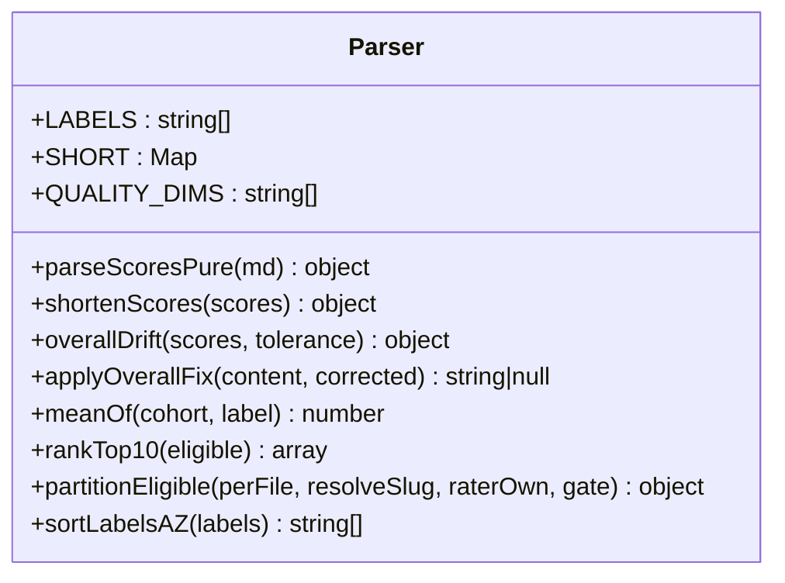

**Diagram sources**
- [scripts/lib/parse.mjs:8-31](file://scripts/lib/parse.mjs#L8-L31)
- [scripts/lib/parse.mjs:47-124](file://scripts/lib/parse.mjs#L47-L124)

**Section sources**
- [scripts/lib/parse.mjs:8-31](file://scripts/lib/parse.mjs#L8-L31)
- [scripts/lib/parse.mjs:47-124](file://scripts/lib/parse.mjs#L47-L124)

### Validation Rules
Validation covers filename hygiene, meta.json required fields, and display-name constraints. Permanence tripwires prevent silent deletion of tracked research files.

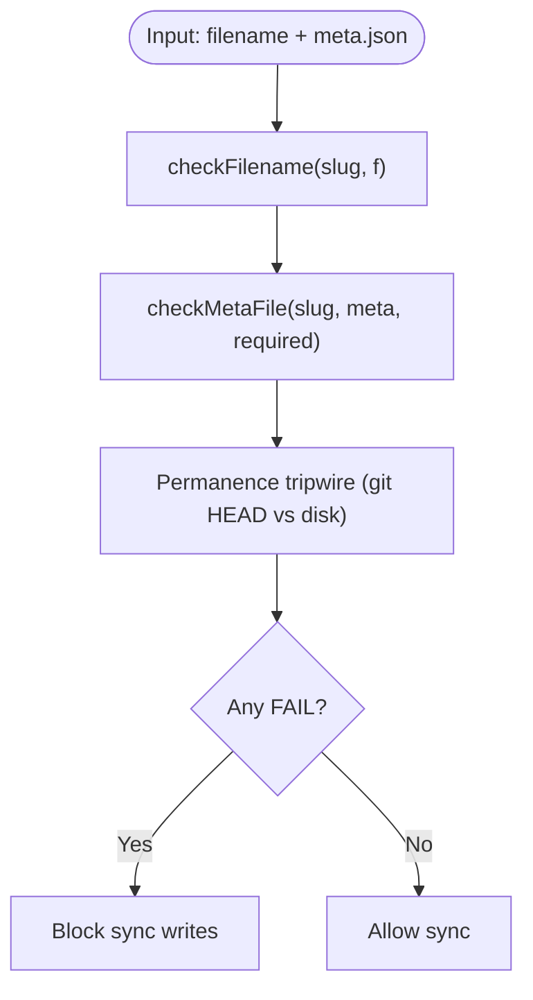

**Diagram sources**
- [scripts/lib/validate.mjs:54-80](file://scripts/lib/validate.mjs#L54-L80)
- [scripts/sync-data.mjs:133-178](file://scripts/sync-data.mjs#L133-L178)

**Section sources**
- [scripts/lib/validate.mjs:54-80](file://scripts/lib/validate.mjs#L54-L80)
- [scripts/sync-data.mjs:133-178](file://scripts/sync-data.mjs#L133-L178)

### Averaging Mechanism
Averages are computed over the top-10 cohort of eligible raters. The mix note documents whether fallback occurred, trimming happened, and which sources were ignored due to the rater gate.

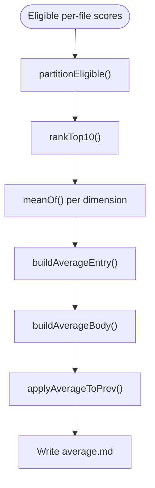

**Diagram sources**
- [scripts/lib/parse.mjs:89-97](file://scripts/lib/parse.mjs#L89-L97)
- [scripts/lib/parse.mjs:99-117](file://scripts/lib/parse.mjs#L99-L117)
- [scripts/lib/average.mjs:12-31](file://scripts/lib/average.mjs#L12-L31)
- [scripts/lib/average.mjs:33-44](file://scripts/lib/average.mjs#L33-L44)
- [scripts/lib/average.mjs:54-100](file://scripts/lib/average.mjs#L54-L100)

**Section sources**
- [scripts/lib/average.mjs:12-31](file://scripts/lib/average.mjs#L12-L31)
- [scripts/lib/average.mjs:33-44](file://scripts/lib/average.mjs#L33-L44)
- [scripts/lib/average.mjs:54-100](file://scripts/lib/average.mjs#L54-L100)

### Registry and Code Generation
**Updated** The registry maintains SourceKey union members and SOURCE_DEFS entries. Pending registrations are appended, collisions fail loudly, and virtual views are pruned. The codegen layer emits deterministic TypeScript for scores and supports the expanded comparison interface with 67 reporting agents.

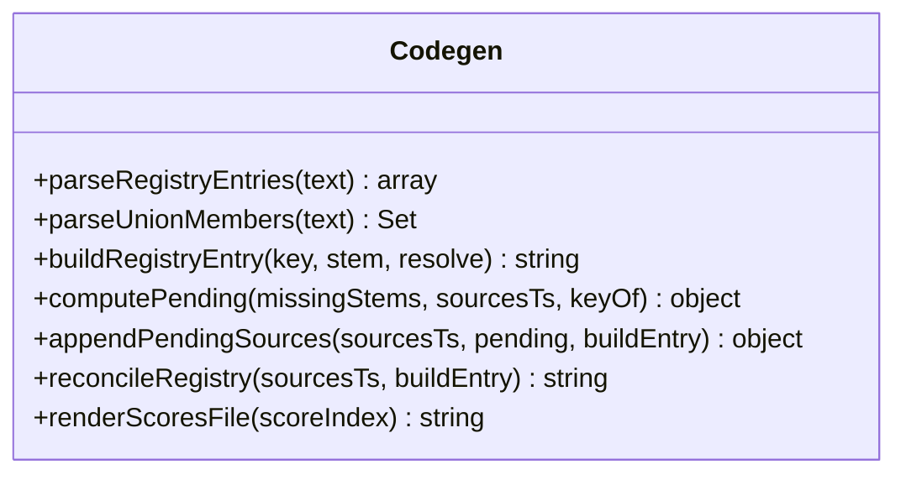

**Diagram sources**
- [scripts/lib/codegen.mjs:9-17](file://scripts/lib/codegen.mjs#L9-L17)
- [scripts/lib/codegen.mjs:19-57](file://scripts/lib/codegen.mjs#L19-L57)
- [scripts/lib/codegen.mjs:65-84](file://scripts/lib/codegen.mjs#L65-L84)
- [scripts/lib/codegen.mjs:86-105](file://scripts/lib/codegen.mjs#L86-L105)
- [scripts/lib/codegen.mjs:107-139](file://scripts/lib/codegen.mjs#L107-L139)

**Section sources**
- [scripts/lib/codegen.mjs:9-17](file://scripts/lib/codegen.mjs#L9-L17)
- [scripts/lib/codegen.mjs:19-57](file://scripts/lib/codegen.mjs#L19-L57)
- [scripts/lib/codegen.mjs:65-84](file://scripts/lib/codegen.mjs#L65-L84)
- [scripts/lib/codegen.mjs:86-105](file://scripts/lib/codegen.mjs#L86-L105)
- [scripts/lib/codegen.mjs:107-139](file://scripts/lib/codegen.mjs#L107-L139)

### Relationship Between Data Sources
**Updated** The data ecosystem now includes additional generated artifacts to support the enhanced comparison interface with expanded evaluator-model combinations:

- Research markdown (`model/<slug>/<Source_Name>.md`) provides raw evidence and normalized scores.
- `meta.json` supplies display metadata and pricing context.
- `average.md` aggregates eligible raters’ scores into a cohort mean.
- `scores.generated.ts` and `sources.generated.ts` provide compact, typed data to the app.
- `catalog.generated.ts` provides pre-baked metadata catalog for efficient access.
- `rankings.generated.ts` provides top-3 model IDs per source for instant lookup.
- `model-findings.md` serves as the audit trail linking findings to signatures and cross-model history.

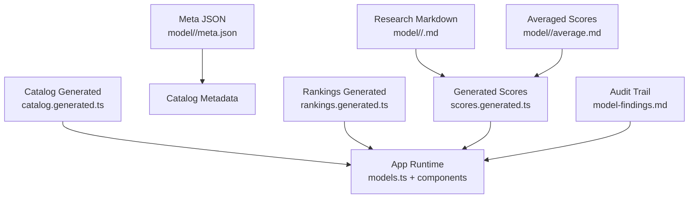

**Diagram sources**
- [README.md:31-44](file://README.md#L31-L44)
- [model-findings.md:1-8](file://model-findings.md#L1-L8)
- [src/data/catalog.generated.ts:1-16](file://src/data/catalog.generated.ts#L1-L16)
- [src/data/rankings.generated.ts:1-70](file://src/data/rankings.generated.ts#L1-L70)

**Section sources**
- [README.md:31-44](file://README.md#L31-L44)
- [model-findings.md:1-8](file://model-findings.md#L1-L8)
- [src/data/catalog.generated.ts:1-16](file://src/data/catalog.generated.ts#L1-L16)
- [src/data/rankings.generated.ts:1-70](file://src/data/rankings.generated.ts#L1-L70)

## Dependency Analysis
The sync pipeline composes pure helpers for parsing, validation, averaging, and code generation. Coupling is minimized by isolating side effects in the main script and keeping helpers testable and deterministic.

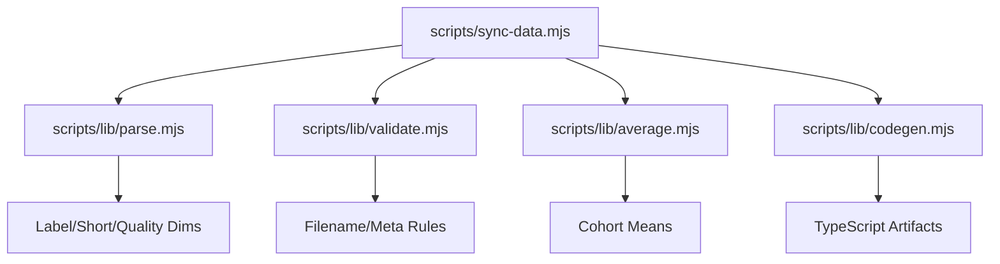

**Diagram sources**
- [scripts/sync-data.mjs:30-75](file://scripts/sync-data.mjs#L30-L75)
- [scripts/lib/parse.mjs:1-7](file://scripts/lib/parse.mjs#L1-L7)
- [scripts/lib/validate.mjs:1-8](file://scripts/lib/validate.mjs#L1-L8)
- [scripts/lib/average.mjs:1-8](file://scripts/lib/average.mjs#L1-L8)
- [scripts/lib/codegen.mjs:1-7](file://scripts/lib/codegen.mjs#L1-L7)

**Section sources**
- [scripts/sync-data.mjs:30-75](file://scripts/sync-data.mjs#L30-L75)

## Performance Considerations
**Updated** Performance optimizations now include additional generated artifacts and enhanced data structures:

- Pre-parsing findings into `scores.generated.ts` removes ~1.7 MB of markdown prose from the client bundle.
- Deterministic sorting and stable registry updates avoid unnecessary churn.
- Rater gate and top-10 cohort reduce noise and stabilize averages.
- Auto-quarantine prevents evidence-free reports from polluting metrics.
- Pre-baked catalog and rankings provide O(1) lookup performance for enhanced comparison interface.
- Expanded evaluator-model combinations are efficiently handled through optimized data structures.
- The 67 reporting agents are processed through streamlined code generation pipelines.

## Troubleshooting Guide
Common issues and resolutions:
- Missing score lines: ensure all seven labels are present exactly as defined.
- Overall drift: allow auto-fix or manually correct the Overall number.
- Hyphen-versioned folders: rename to dotted version convention.
- Missing meta.json: scaffold and fill official vendor display name and facts.
- Forbidden deletions: restore tracked files from git HEAD rather than deleting.
- Registry collisions: resolve duplicate SourceKey assignments manually.
- Generated artifact mismatches: re-run `pnpm sync` to regenerate all TypeScript artifacts.
- Catalog or rankings inconsistencies: verify meta.json files are properly formatted and complete.

**Section sources**
- [scripts/lib/parse.mjs:47-60](file://scripts/lib/parse.mjs#L47-L60)
- [scripts/lib/parse.mjs:69-87](file://scripts/lib/parse.mjs#L69-L87)
- [scripts/sync-data.mjs:180-197](file://scripts/sync-data.mjs#L180-L197)
- [scripts/sync-data.mjs:297-324](file://scripts/sync-data.mjs#L297-L324)
- [scripts/sync-data.mjs:133-178](file://scripts/sync-data.mjs#L133-L178)

## Conclusion
ModelComp’s data management system combines rigorous research documentation with deterministic code generation. The multi-agent evaluation methodology normalizes scores across six dimensions, applies a rater gate and top-10 cohort for robust averages, and enforces quality gates to exclude evidence-free reports. The enhanced generated TypeScript artifacts keep the UI lightweight and type-safe, while the expanded comparison interface with 67 reporting agents provides comprehensive model evaluation capabilities. The pre-baked catalog and rankings artifacts deliver optimal performance for the enhanced comparison interface. The audit trail preserves provenance and transparency. Following the documented workflows ensures consistent, verifiable model comparisons across the substantially expanded evaluator-model combination space.