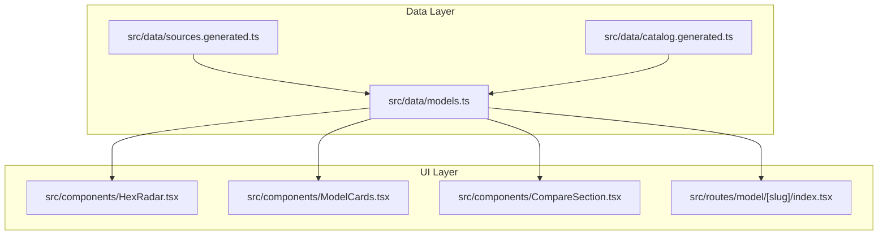
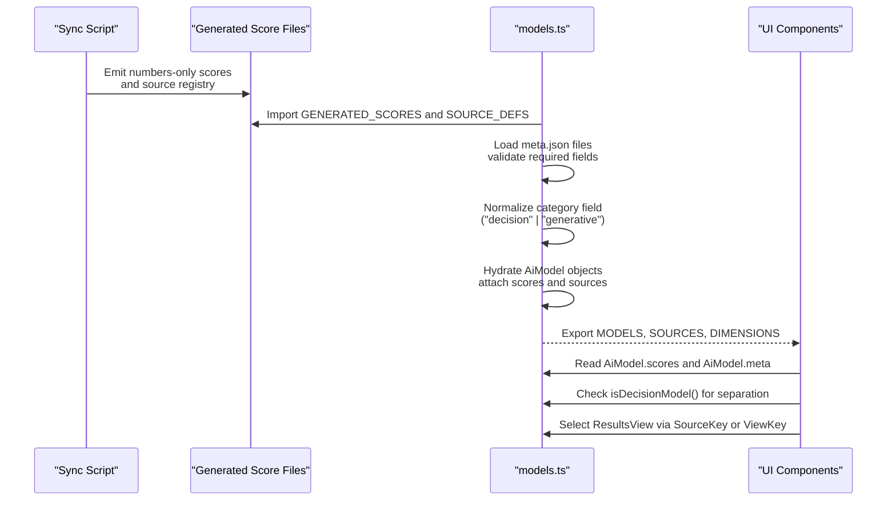
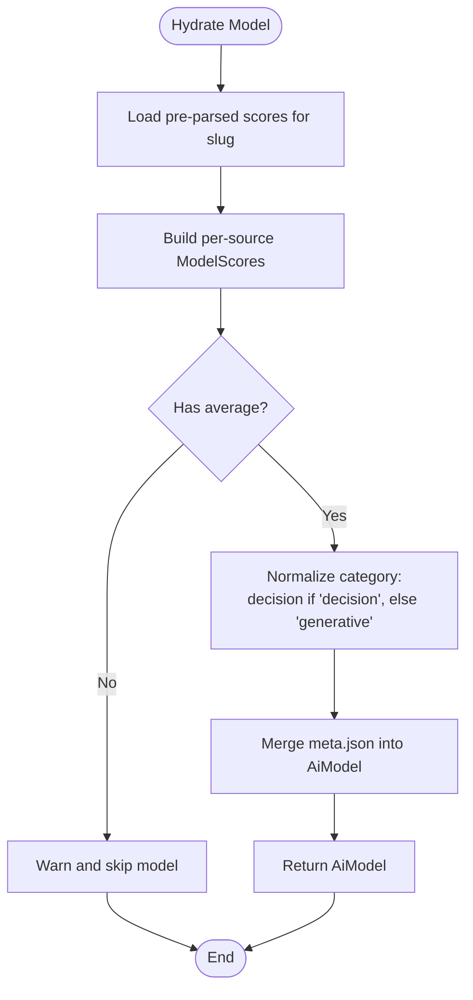
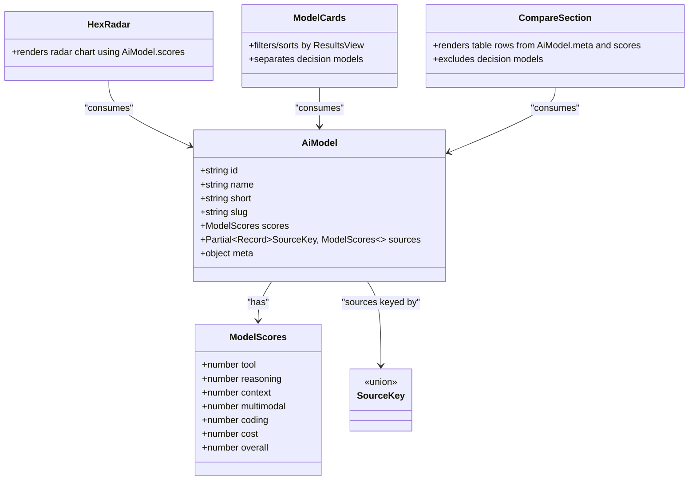
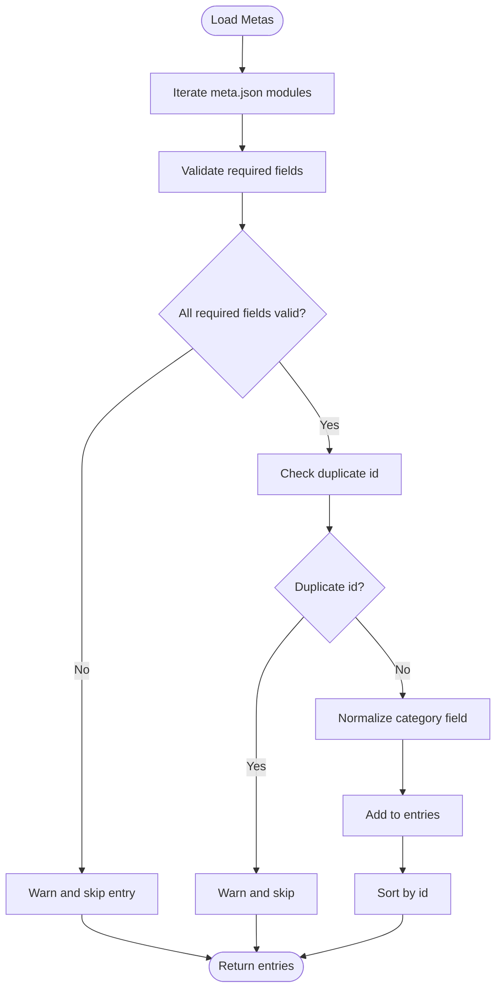
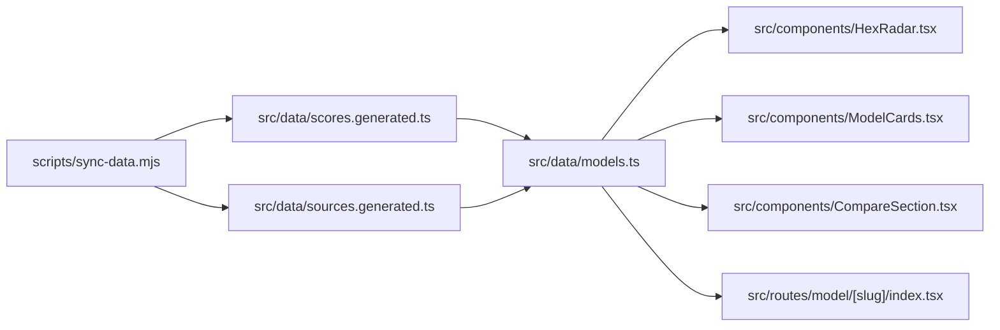

# Data Schemas & Interfaces

<cite>
**Referenced Files in This Document**
- [models.ts](file://src/data/models.ts)
- [sources.generated.ts](file://src/data/sources.generated.ts)
- [catalog.generated.ts](file://src/data/catalog.generated.ts)
- [HexRadar.tsx](file://src/components/HexRadar.tsx)
- [ModelCards.tsx](file://src/components/ModelCards.tsx)
- [CompareSection.tsx](file://src/components/CompareSection.tsx)
- [model/[slug]/index.tsx](file://src/routes/model/[slug]/index.tsx)
</cite>

## Update Summary
**Changes Made**
- Updated AiModel interface documentation to include the new `category` field
- Added ModelCategory type documentation explaining generative vs decision model classification
- Updated MetaFile interface documentation to reflect optional category field
- Enhanced validation rules section with category normalization logic
- Added examples of how category affects UI rendering and model separation

## Table of Contents
1. [Introduction](#introduction)
2. [Project Structure](#project-structure)
3. [Core Components](#core-components)
4. [Architecture Overview](#architecture-overview)
5. [Detailed Component Analysis](#detailed-component-analysis)
6. [Dependency Analysis](#dependency-analysis)
7. [Performance Considerations](#performance-considerations)
8. [Troubleshooting Guide](#troubleshooting-guide)
9. [Conclusion](#conclusion)

## Introduction
This document describes the data model used by ModelComp to represent AI models, their scores, reporting agents, and curated metadata. It focuses on the `AiModel` interface (extended with model classification), the `ModelScores` interface, the `SourceKey` union type, and the `MetaFile` structure. It also explains how these types are hydrated from generated score files and per-model metadata, how they are consumed by UI components, and what validation rules keep the dataset consistent.

## Project Structure
The schema definitions live under `src/data`, while generated registry and score data are imported at build time. UI components import the typed models and use them for rendering comparisons, rankings, tooltips, tables, and separating decision models from generative ones.



**Diagram sources**
- [models.ts:18-30](file://src/data/models.ts#L18-L30)
- [sources.generated.ts:5-80](file://src/data/sources.generated.ts#L5-L80)
- [catalog.generated.ts:3-15](file://src/data/catalog.generated.ts#L3-L15)
- [HexRadar.tsx:3-6](file://src/components/HexRadar.tsx#L3-L6)
- [ModelCards.tsx:3-5](file://src/components/ModelCards.tsx#L3-L5)
- [CompareSection.tsx:4](file://src/components/CompareSection.tsx#L4)
- [model/[slug]/index.tsx:4](file://src/routes/model/[slug]/index.tsx#L4)

**Section sources**
- [models.ts:18-30](file://src/data/models.ts#L18-L30)
- [sources.generated.ts:5-80](file://src/data/sources.generated.ts#L5-L80)
- [catalog.generated.ts:3-15](file://src/data/catalog.generated.ts#L3-L15)

## Core Components
This section documents the primary interfaces that define the application's data contract.

### AiModel Interface
`AiModel` is the central runtime representation of a tracked AI model. It combines:
- Identity and display fields: `id`, `name`, `short`, `slug`.
- Scores: `scores` (the default "average" view) and `sources` (per-reporting-agent score sets).
- Metadata: `meta`, including context window, modalities, pricing note, **model category** (generative or decision), optional free-tier note, optional pricing tiers, and an optional flag indicating no free tier ID.

**Updated** The interface now includes a `category` field within the `meta` object that classifies models as either "generative" (text-generating) or "decision" (typed-decision System-One models like Jev 1.13).

Key responsibilities:
- Provides a single object for UI components to render hexagons, cards, tables, and detail pages.
- Keeps the default view (`scores`) separate from per-source views (`sources[key]`).
- Carries human-readable metadata needed for tooltips, legends, and pricing displays.
- **New**: Classifies models into paradigms that affect UI rendering and comparison behavior.

Validation and hydration:
- Hydrated from per-model `meta.json` and pre-parsed scores emitted by the sync script.
- Category values are normalized: only `"decision"` is recognized; any other value (including missing) defaults to `"generative"`.
- A model without a usable average is skipped with a warning rather than failing the build.

**Section sources**
- [models.ts:42-73](file://src/data/models.ts#L42-L73)
- [models.ts:75-116](file://src/data/models.ts#L75-L116)

### ModelCategory Type
`ModelCategory` is a string union type that defines the two supported model paradigms:
- `"generative"`: Text-generating models that produce prose, code, or other content (default for most models).
- `"decision"`: Typed-decision (System-One) models that return structured judgments like choices, scores, or yes/no probabilities.

Usage patterns:
- Used as the type for `AiModel.meta.category`.
- Controls UI separation: decision models render on a separate shelf and are excluded from standard comparisons.
- Normalized during hydration to ensure only valid values exist at runtime.

**Section sources**
- [models.ts:42-43](file://src/data/models.ts#L42-L43)
- [models.ts:110](file://src/data/models.ts#L110)

### ModelScores Interface
`ModelScores` represents one normalized scoring snapshot across six dimensions plus an overall composite:
- `tool`: tool-use performance.
- `reasoning`: reasoning benchmark performance.
- `context`: context-window capability.
- `multimodal`: multimodal support.
- `coding`: coding ability.
- `cost`: cost efficiency.
- `overall`: rounded mean of the five quality dimensions; cost is scored separately and does not count toward overall.

Usage patterns:
- `AiModel.scores` holds the average snapshot.
- `AiModel.sources[key]` holds a reporting agent's snapshot.
- UI components read dimension keys directly from `ModelScores` to render charts and tables.

**Section sources**
- [models.ts:32-40](file://src/data/models.ts#L32-L40)
- [models.ts:84-92](file://src/data/models.ts#L84-L92)

### SourceKey Union Type
`SourceKey` is a string union enumerating every registered reporting agent plus the special `average` key. It is auto-generated from the source registry and kept in sync by the build pipeline.

Relationship to reporting agents:
- Each `SourceKey` corresponds to a row in `SOURCE_DEFS`, which maps the key to a label, file name, and optional tracked model slug.
- The `AGENT_MODEL_SLUG` map derives a mapping from `SourceKey` to the model page slug when a reporting agent has its own tracked model.
- `AiModel.sources` is keyed by `SourceKey`; only keys present in `SOURCE_DEFS` can appear there.

Virtual views:
- `ViewKey` and `ResultsView` extend `SourceKey` with virtual sort views like `tool`, `reason`, `context`, `cost`, `code`, and `multi`.
- Virtual views are not real reporting agents and do not appear in `AiModel.sources`; they are computed at runtime to re-rank using a specific dimension.

**Section sources**
- [sources.generated.ts:5-66](file://src/data/sources.generated.ts#L5-L66)
- [sources.generated.ts:68-80](file://src/data/sources.generated.ts#L68-L80)
- [sources.generated.ts:82-144](file://src/data/sources.generated.ts#L82-L144)
- [models.ts:21-30](file://src/data/models.ts#L21-L30)

### MetaFile Interface
`MetaFile` defines the required shape of each model's `meta.json` file. Required fields include:
- `id`: stable identifier for the model.
- `name`: full model name.
- `short`: short display name.
- `contextWindow`: context window description.
- `modalities`: supported input/output modalities.
- `pricingNote`: pricing summary shown in tooltips and tables.

Optional fields include:
- `pricingTiers`: stacked pricing lines for comparison tables.
- `freeTierNote`: explanation of how a free tier is obtained.
- `noFreeId`: indicates whether cost is scored on paid pricing because no free tier ID exists.
- **Updated**: `category`: optional paradigm tag ("generative" default, "decision" for typed-decision models).

Validation rules:
- Missing or empty required fields cause the model to be skipped with a warning during hydration.
- Duplicate `id` values are detected; the first occurrence is kept and subsequent duplicates are warned about.
- Category values are normalized during hydration: only `"decision"` is recognized; all other values (including undefined) become `"generative"`.
- The strict gate for missing data is the sync script; at runtime, incomplete entries are skipped to avoid breaking builds.

**Section sources**
- [models.ts:171-185](file://src/data/models.ts#L171-L185)
- [models.ts:195-230](file://src/data/models.ts#L195-L230)
- [catalog.generated.ts:3-13](file://src/data/catalog.generated.ts#L3-L13)

## Architecture Overview
The data flow connects raw research findings to typed runtime objects consumed by the UI, with model classification affecting rendering behavior.



**Diagram sources**
- [models.ts:6-16](file://src/data/models.ts#L6-L16)
- [models.ts:18-30](file://src/data/models.ts#L18-L30)
- [models.ts:75-116](file://src/data/models.ts#L75-L116)
- [models.ts:118-121](file://src/data/models.ts#L118-L121)
- [models.ts:227-241](file://src/data/models.ts#L227-L241)

## Detailed Component Analysis

### AiModel Hydration and Validation Flow
Hydration merges curated metadata with pre-parsed scores. Category normalization ensures only valid paradigm values exist at runtime. If a model lacks a usable average, it is skipped with a warning.



**Diagram sources**
- [models.ts:75-116](file://src/data/models.ts#L75-L116)

**Section sources**
- [models.ts:75-116](file://src/data/models.ts#L75-L116)

### Model Classification and UI Separation
The category field drives significant UI behavior through the `isDecisionModel()` helper function:

**Updated** Decision models (System-One models like Jev 1.13) are separated from generative models throughout the application:
- **ModelCards**: Renders decision models on a separate shelf below generative models with distinct styling and native specs (state budget, I/O shape, input-only pricing).
- **CompareSection**: Excludes decision models from the A/B/C comparison slots since their scores aren't comparable to generative Overall.
- **Filtering**: Components filter models using `isDecisionModel()` to separate the two paradigms.

```mermaid
classDiagram
class AiModel {
+string id
+string name
+string short
+string slug
+ModelScores scores
+Partial~Record~SourceKey, ModelScores~~ sources
+object meta {
+ModelCategory category
+}
}
class ModelCategory {
<<union>>
"generative"
"decision"
}
class ModelCards {
+filters generative vs decision
+separate shelves for each paradigm
}
class CompareSection {
+excludes decision models
+from A/B/C comparison
}
AiModel --> ModelCategory : "has"
ModelCards --> AiModel : "consumes"
CompareSection --> AiModel : "consumes"
```

**Diagram sources**
- [models.ts:42-73](file://src/data/models.ts#L42-L73)
- [ModelCards.tsx:31-41](file://src/components/ModelCards.tsx#L31-L41)
- [CompareSection.tsx:24-28](file://src/components/CompareSection.tsx#L24-L28)

**Section sources**
- [models.ts:118-121](file://src/data/models.ts#L118-L121)
- [ModelCards.tsx:31-41](file://src/components/ModelCards.tsx#L31-L41)
- [CompareSection.tsx:24-28](file://src/components/CompareSection.tsx#L24-L28)

### SourceKey Usage Across the Application
Components consume `SourceKey` and `ResultsView` to select which scores to display:
- `ModelCards` filters and sorts models based on the selected results source, separating decision models.
- `CompareSection` uses `SOURCES` to populate the dropdown and renders exact scores per dimension, excluding decision models.
- The model detail route reads `ModelScores` to compute column statistics and highlight high/low values.



**Diagram sources**
- [models.ts:46-73](file://src/data/models.ts#L46-L73)
- [sources.generated.ts:5-80](file://src/data/sources.generated.ts#L5-L80)
- [HexRadar.tsx:3-6](file://src/components/HexRadar.tsx#L3-L6)
- [ModelCards.tsx:3-5](file://src/components/ModelCards.tsx#L3-L5)
- [CompareSection.tsx:4](file://src/components/CompareSection.tsx#L4)

**Section sources**
- [HexRadar.tsx:47-55](file://src/components/HexRadar.tsx#L47-L55)
- [ModelCards.tsx:13-28](file://src/components/ModelCards.tsx#L13-L28)
- [CompareSection.tsx:72-75](file://src/components/CompareSection.tsx#L72-L75)
- [model/[slug]/index.tsx:56](file://src/routes/model/[slug]/index.tsx#L56)

### MetaFile Validation Rules
The loader enforces:
- Presence and non-empty strings for required fields.
- Uniqueness of `id`.
- Deterministic ordering by `id`.
- Skipping incomplete entries with warnings instead of failing the build.
- **Updated**: Category normalization to ensure only valid paradigm values exist at runtime.



**Diagram sources**
- [models.ts:195-230](file://src/data/models.ts#L195-L230)

**Section sources**
- [models.ts:195-230](file://src/data/models.ts#L195-L230)

## Dependency Analysis
The data layer depends on generated files produced by the sync script. UI components depend on the typed exports from `models.ts`, including the new `isDecisionModel()` helper for model classification.



**Diagram sources**
- [models.ts:6-16](file://src/data/models.ts#L6-L16)
- [models.ts:18-30](file://src/data/models.ts#L18-L30)
- [HexRadar.tsx:3-6](file://src/components/HexRadar.tsx#L3-L6)
- [ModelCards.tsx:3-5](file://src/components/ModelCards.tsx#L3-L5)
- [CompareSection.tsx:4](file://src/components/CompareSection.tsx#L4)
- [model/[slug]/index.tsx:4](file://src/routes/model/[slug]/index.tsx#L4)

**Section sources**
- [models.ts:6-16](file://src/data/models.ts#L6-L16)
- [sources.generated.ts:1-4](file://src/data/sources.generated.ts#L1-L4)

## Performance Considerations
- Pre-parsed scores and source registry reduce client bundle size by avoiding inlining markdown prose.
- Hydration runs once at module evaluation time, producing deterministic arrays for UI consumption.
- Virtual views avoid duplicating score data by computing rankings from existing snapshots.
- **Updated**: Model classification is performed once during hydration, enabling efficient filtering throughout the application without repeated checks.

[No sources needed since this section provides general guidance]

## Troubleshooting Guide
Common issues and their signals:
- Missing required metadata fields: the loader warns and skips the model; run the sync script to enforce completeness.
- No usable average for a model: hydration warns and skips the model; ensure the average file is present and parsed.
- Duplicate model IDs: the loader warns and keeps the first occurrence; resolve conflicts in metadata.
- Overall score mismatch: in development, a check warns if a source's overall deviates significantly from the mean of the five quality dimensions.
- **Updated**: Invalid category values: only `"decision"` is recognized; all other values (including missing) normalize to `"generative"`.

Operational recommendations:
- Always run the sync script after adding or modifying model folders.
- Keep `meta.json` files complete and unique by `id`.
- Use the generated types to prevent invalid keys when selecting results sources.
- **Updated**: For decision models, set `category: "decision"` in `meta.json`; omit or use `"generative"` for text-generating models.

**Section sources**
- [models.ts:95-97](file://src/data/models.ts#L95-L97)
- [models.ts:204-211](file://src/data/models.ts#L204-L211)
- [models.ts:353-364](file://src/data/models.ts#L353-L364)
- [models.ts:110](file://src/data/models.ts#L110)

## Conclusion
The ModelComp data model centers on `AiModel`, `ModelScores`, `SourceKey`, and `MetaFile`. These types provide a clear contract between generated data, curated metadata, and UI components. **Updated** The addition of the `ModelCategory` type and `category` field enables sophisticated model classification, allowing the application to separate decision models from generative models both in data processing and user interface rendering. Validation ensures data integrity at both build time and runtime, while virtual views and source registries enable flexible ranking and presentation without duplicating data. Following the documented schemas and validation rules keeps the application consistent, performant, and maintainable.