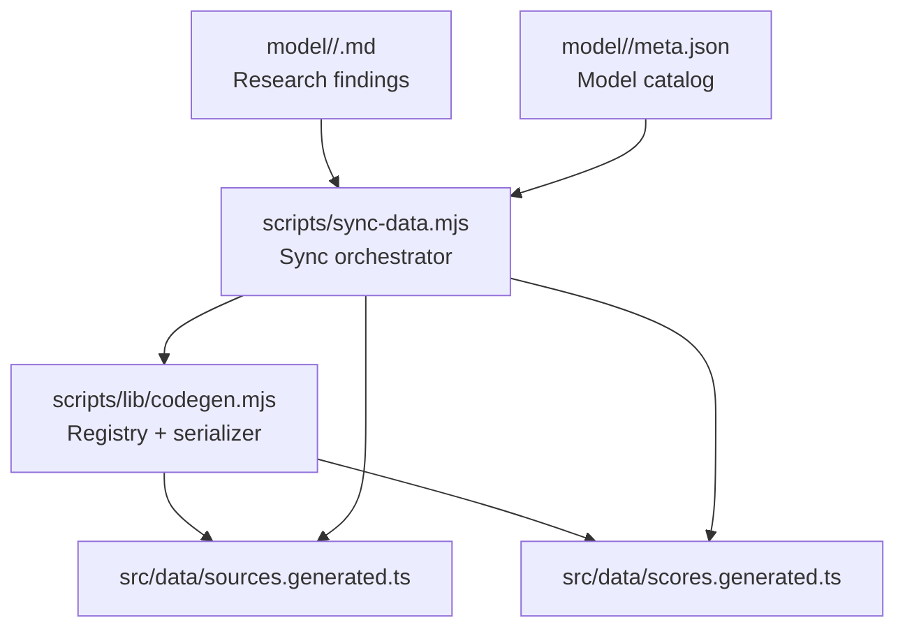
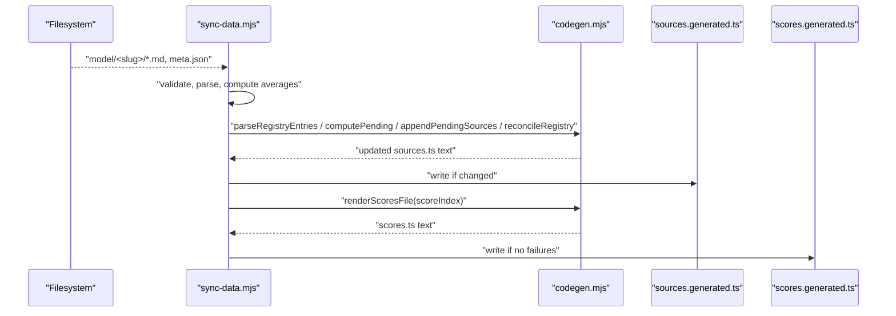
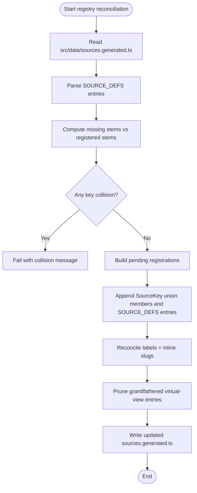
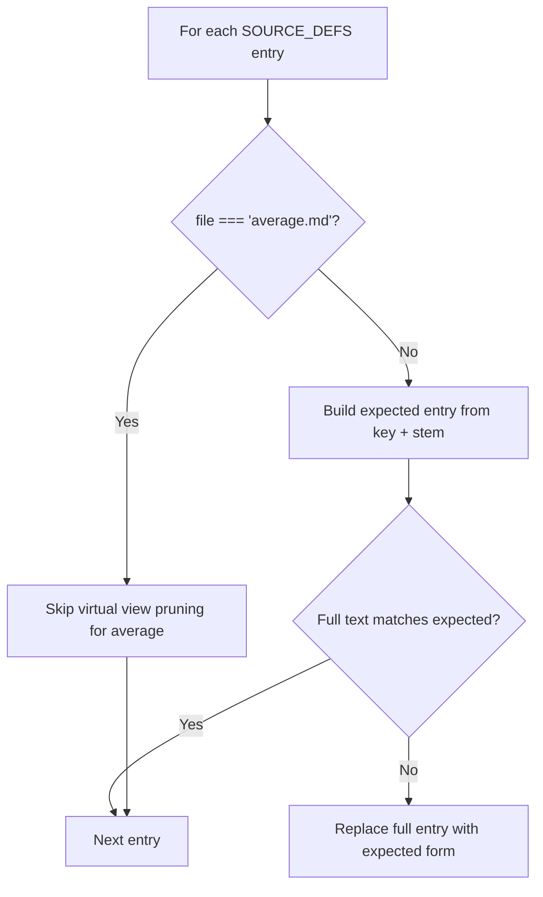
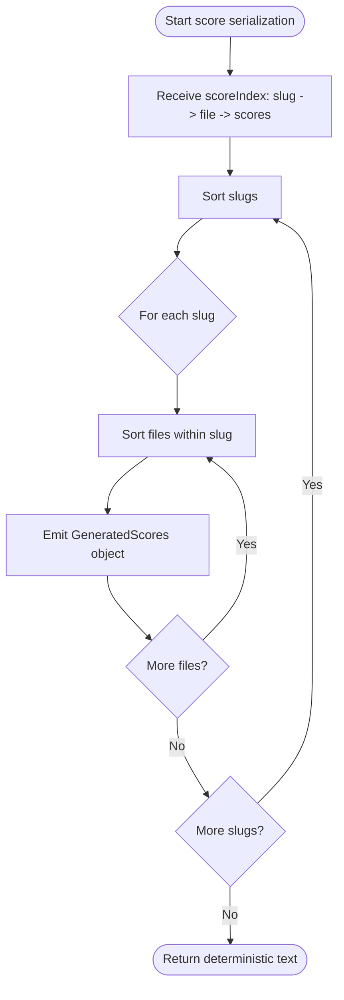
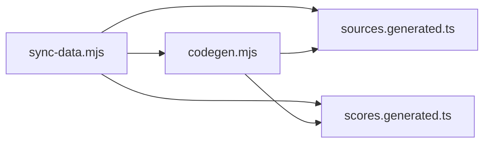

# Code Generation System

<cite>
**Referenced Files in This Document**
- [codegen.mjs](file://scripts/lib/codegen.mjs)
- [sync-data.mjs](file://scripts/sync-data.mjs)
- [sources.generated.ts](file://src/data/sources.generated.ts)
- [scores.generated.ts](file://src/data/scores.generated.ts)
- [project-map.md](file://.antigravity/history/project-map.md)
- [README.md](file://README.md)
- [REPORT.md](file://REPORT.md)
</cite>

## Table of Contents
1. [Introduction](#introduction)
2. [Project Structure](#project-structure)
3. [Core Components](#core-components)
4. [Architecture Overview](#architecture-overview)
5. [Detailed Component Analysis](#detailed-component-analysis)
6. [Dependency Analysis](#dependency-analysis)
7. [Performance Considerations](#performance-considerations)
8. [Troubleshooting Guide](#troubleshooting-guide)
9. [Conclusion](#conclusion)

## Introduction
This document explains the build-time code generation system that turns processed research data into TypeScript artifacts consumed by the client application. The system produces two key generated files:

- `src/data/scores.generated.ts`: a compact, numbers-only registry of model scores for fast client-side consumption.
- `src/data/sources.generated.ts`: a source registry containing the `SourceKey` union type and the `SOURCE_DEFS` array used to identify reporting agents and their metadata.

The generator is deterministic, avoids including raw markdown prose in the client bundle, reconciles labels and slugs automatically, detects duplicate registrations, and appends new sources without rewriting existing handwritten content unnecessarily. It also documents the migration from the legacy `agent-slugs.generated.ts` file to inline slug fields inside `sources.generated.ts`.

## Project Structure
At a high level, the repository organizes research findings under `model/<slug>/`, where each folder represents a model and contains per-source Markdown findings plus an `average.md` summary and a `meta.json` catalog entry. The sync script scans these folders, validates and parses scores, recomputes averages, registers new sources, and emits the two generated TypeScript files.

**Diagram sources**
- [sync-data.mjs:1-30](file://scripts/sync-data.mjs#L1-L30)
- [sync-data.mjs:490-523](file://scripts/sync-data.mjs#L490-L523)
- [codegen.mjs:1-7](file://scripts/lib/codegen.mjs#L1-L7)

**Section sources**
- [project-map.md:5-22](file://.antigravity/history/project-map.md#L5-L22)
- [README.md:38-40](file://README.md#L38-L40)
- [README.md:70-71](file://README.md#L70-L71)

## Core Components
The code generation system has two primary responsibilities:

1. **Registry management**: Maintain `SourceKey` and `SOURCE_DEFS` in `sources.generated.ts`, reconcile labels and slugs, prune virtual views, detect collisions, and append new sources deterministically.
2. **Score serialization**: Build `scores.generated.ts` with compact numerical score objects keyed by model slug and source filename.

The core logic lives in `scripts/lib/codegen.mjs`, while `scripts/sync-data.mjs` orchestrates filesystem operations, validation, parsing, and writes.

**Section sources**
- [codegen.mjs:1-7](file://scripts/lib/codegen.mjs#L1-L7)
- [sync-data.mjs:36-67](file://scripts/sync-data.mjs#L36-L67)

## Architecture Overview
The end-to-end flow starts with the sync script scanning model directories, validating filenames and metadata, parsing scores, computing averages, and then delegating text generation to the pure codegen module.

**Diagram sources**
- [sync-data.mjs:438-480](file://scripts/sync-data.mjs#L438-L480)
- [sync-data.mjs:490-523](file://scripts/sync-data.mjs#L490-L523)
- [codegen.mjs:14-23](file://scripts/lib/codegen.mjs#L14-L23)
- [codegen.mjs:44-84](file://scripts/lib/codegen.mjs#L44-L84)
- [codegen.mjs:92-105](file://scripts/lib/codegen.mjs#L92-L105)
- [codegen.mjs:111-139](file://scripts/lib/codegen.mjs#L111-L139)

## Detailed Component Analysis

### Registry Management in `sources.generated.ts`
`sources.generated.ts` exposes:

- `SourceKey`: a union of string literals representing registered reporting agents.
- `ViewKey` and `ResultsView`: types for virtual sort views and selectable results sources.
- `SourceDef`: an interface describing each source’s key, label, file stem, and optional slug.
- `SOURCE_DEFS`: an array of `SourceDef` entries.

The sync process reads this file, parses its registry entries, computes which stems are missing, detects collisions, appends new entries, and reconciles labels and slugs.

**Diagram sources**
- [sync-data.mjs:438-480](file://scripts/sync-data.mjs#L438-L480)
- [codegen.mjs:44-84](file://scripts/lib/codegen.mjs#L44-L84)
- [codegen.mjs:92-105](file://scripts/lib/codegen.mjs#L92-L105)

#### SourceKey Union Type Generation
The `SourceKey` union is maintained as part of the generated TypeScript file. When a new source stem is detected but its key is not yet present in the union, the generator appends the corresponding literal to the union body. The union parser extracts all quoted string members in file order, ensuring deterministic behavior.

Key behaviors:
- Union members are parsed using a regex over the `export type SourceKey = ...;` block.
- New keys are appended only when absent.
- Virtual view keys (e.g., `tool`, `reason`, `context`, `cost`, `code`, `multi`) are pruned from both the union and registry because they live in runtime logic, not the registry.

**Section sources**
- [codegen.mjs:19-23](file://scripts/lib/codegen.mjs#L19-L23)
- [codegen.mjs:71-84](file://scripts/lib/codegen.mjs#L71-L84)
- [codegen.mjs:92-105](file://scripts/lib/codegen.mjs#L92-L105)
- [sources.generated.ts:5-73](file://src/data/sources.generated.ts#L5-L73)

#### SOURCE_DEFS Array Construction
Each source registration becomes a `SourceDef` object with:
- `key`: the normalized display name derived from the filename stem.
- `label`: the human-readable display label.
- `file`: the exact on-disk filename stem (preserving dots and legacy casing).
- `slug?`: an optional tracked model-page slug resolved via overrides and catalog lookup.

The registry builder preserves the original filename stem rather than re-deriving it from the key, ensuring round-trip fidelity for legacy or dotted filenames.

**Section sources**
- [codegen.mjs:25-35](file://scripts/lib/codegen.mjs#L25-L35)
- [sync-data.mjs:85-100](file://scripts/sync-data.mjs#L85-L100)
- [sync-data.mjs:242-257](file://scripts/sync-data.mjs#L242-L257)
- [sources.generated.ts:75-146](file://src/data/sources.generated.ts#L75-L146)

#### Deterministic Rendering Process
Both registry updates and score serialization are designed to be deterministic:

- Registry entries are appended in sorted stem order.
- Score indices are iterated in sorted slug and file order.
- Output text is assembled through pure functions with locked formatting.

This prevents unnecessary diffs and ensures reproducible builds.

**Section sources**
- [codegen.mjs:107-139](file://scripts/lib/codegen.mjs#L107-L139)
- [sync-data.mjs:447-467](file://scripts/sync-data.mjs#L447-L467)
- [sync-data.mjs:495-510](file://scripts/sync-data.mjs#L495-L510)

#### Registry Reconciliation and Collision Detection
Reconciliation performs three important tasks:

1. **Label and slug normalization**: Each registered entry is compared against the expected format built from its key and stem; mismatches are replaced idempotently.
2. **Virtual view pruning**: Entries referencing `average.md` with non-average keys are removed, since virtual views belong in runtime logic, not the registry.
3. **Collision detection**: If a stem maps to a key already registered under a different filename, the sync fails with a clear message directing human intervention.

**Diagram sources**
- [codegen.mjs:92-105](file://scripts/lib/codegen.mjs#L92-L105)
- [sync-data.mjs:470-480](file://scripts/sync-data.mjs#L470-L480)

**Section sources**
- [codegen.mjs:37-63](file://scripts/lib/codegen.mjs#L37-L63)
- [codegen.mjs:92-105](file://scripts/lib/codegen.mjs#L92-L105)
- [sync-data.mjs:452-467](file://scripts/sync-data.mjs#L452-L467)

#### Automatic Appending of New Sources
When a new findings file stem exists on disk but is not registered:

1. The sync computes the normalized key for the stem.
2. It checks whether the key already appears in `SOURCE_DEFS`; if so, it flags a collision.
3. If the key is absent, it marks the registration as pending and determines whether the `SourceKey` union needs a new member.
4. It splices union lines and `SOURCE_DEFS` entries into the generated file.
5. It writes the updated file only when the anchor patterns are found.

**Section sources**
- [sync-data.mjs:442-467](file://scripts/sync-data.mjs#L442-L467)
- [codegen.mjs:44-84](file://scripts/lib/codegen.mjs#L44-L84)

### Score Serialization in `scores.generated.ts`
`scores.generated.ts` exports:

- `GeneratedScores`: an interface with short field names for tool, reasoning, context, multimodal, coding, cost, and overall scores.
- `GENERATED_SCORES`: a nested record mapping model slug to source filename to `GeneratedScores`.

The serializer:

- Accepts a `scoreIndex` map of slug → file → short-keyed scores.
- Iterates slugs and files in sorted order.
- Emits only numeric values, excluding markdown prose.
- Produces a stable, deterministic TypeScript module.

**Diagram sources**
- [codegen.mjs:107-139](file://scripts/lib/codegen.mjs#L107-L139)
- [sync-data.mjs:490-510](file://scripts/sync-data.mjs#L490-L510)

**Section sources**
- [codegen.mjs:107-139](file://scripts/lib/codegen.mjs#L107-L139)
- [sync-data.mjs:200-208](file://scripts/sync-data.mjs#L200-L208)
- [sync-data.mjs:343-345](file://scripts/sync-data.mjs#L343-L345)
- [sync-data.mjs:490-510](file://scripts/sync-data.mjs#L490-L510)

### Migration from Legacy `agent-slugs.generated.ts`
Previously, model-page slugs were emitted into a separate `agent-slugs.generated.ts` file, and `models.ts` imported them as `AGENT_MODEL_SLUG`. The current approach moves slug information inline into `SourceDef.slug` inside `sources.generated.ts`.

Migration behavior:

- Slugs are now resolved via `SOURCE_OVERRIDES` and catalog lookup during sync.
- The sync script deletes `agent-slugs.generated.ts` if present, causing stale imports to fail loudly instead of silently drifting.
- Documentation and reports reflect that slugs are now inline and the legacy file is removed.

**Section sources**
- [sync-data.mjs:511-520](file://scripts/sync-data.mjs#L511-L520)
- [REPORT.md:137-141](file://REPORT.md#L137-L141)

## Dependency Analysis
The code generation system has clear separation between orchestration and pure text building:

- `sync-data.mjs` handles filesystem I/O, validation, parsing, logging, and writing.
- `codegen.mjs` provides dependency-free, deterministic builders for registry surgery and score serialization.
- `sources.generated.ts` is both input (parsed for reconciliation) and output (written when changed).
- `scores.generated.ts` is purely output and never read back by the generator.

**Diagram sources**
- [sync-data.mjs:36-67](file://scripts/sync-data.mjs#L36-L67)
- [sync-data.mjs:438-523](file://scripts/sync-data.mjs#L438-L523)
- [codegen.mjs:1-7](file://scripts/lib/codegen.mjs#L1-L7)

**Section sources**
- [sync-data.mjs:30-75](file://scripts/sync-data.mjs#L30-L75)
- [codegen.mjs:1-7](file://scripts/lib/codegen.mjs#L1-L7)

## Performance Considerations
The system is optimized for client bundle size and build determinism:

- Raw markdown findings are pre-parsed into `scores.generated.ts`, keeping report prose out of the client bundle.
- Only compact numeric scores are included in the generated artifact consumed at runtime.
- The old eager import pattern could inline approximately 1.7 MB of markdown into a single client chunk; the generated approach avoids that.
- Deterministic sorting prevents unnecessary rebuild churn.

**Section sources**
- [README.md:33-33](file://README.md#L33-L33)
- [README.md:38-40](file://README.md#L38-L40)
- [sync-data.mjs:18-24](file://scripts/sync-data.mjs#L18-L24)
- [sync-data.mjs:490-493](file://scripts/sync-data.mjs#L490-L493)

## Troubleshooting Guide
Common issues and how the system responds:

| Issue | Behavior | Resolution |
|---|---|---|
| Missing findings file stem not registered | Sync appends `SourceKey` union member and `SOURCE_DEFS` entry | Run `pnpm sync`; new sources are auto-appended |
| Duplicate key under different filename | Sync fails with a collision message | Rename or consolidate the conflicting source manually |
| Unlocatable registry anchors | Sync logs “register manually” and does not rewrite | Ensure `SourceKey` union and `SOURCE_DEFS` array exist in `sources.generated.ts` |
| Stale `agent-slugs.generated.ts` | Deleted by sync; stale imports fail loudly | Remove manual imports and use inline slug from `sources.generated.ts` |
| Validation failures during sync | `scores.generated.ts` is not rewritten | Fix failing validations and rerun sync |

**Section sources**
- [codegen.mjs:60-63](file://scripts/lib/codegen.mjs#L60-L63)
- [codegen.mjs:71-84](file://scripts/lib/codegen.mjs#L71-L84)
- [sync-data.mjs:452-467](file://scripts/sync-data.mjs#L452-L467)
- [sync-data.mjs:496-523](file://scripts/sync-data.mjs#L496-L523)

## Conclusion
The code generation system centralizes model research data into two small, deterministic TypeScript artifacts. `sources.generated.ts` maintains a typed registry of reporting agents with labels, filenames, and inline slugs, while `scores.generated.ts` provides compact numeric scores for efficient client-side rendering. The sync process enforces hygiene, reconciles inconsistencies, detects collisions, and automates source registration, while preventing raw markdown from entering the client bundle. The migration away from `agent-slugs.generated.ts` simplifies the architecture by embedding slug information directly in the source registry, improving maintainability and reducing indirection.