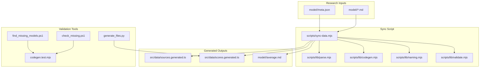
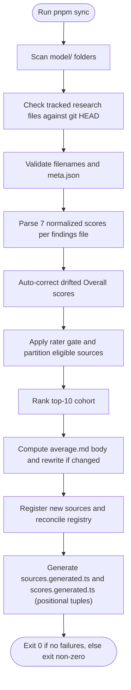
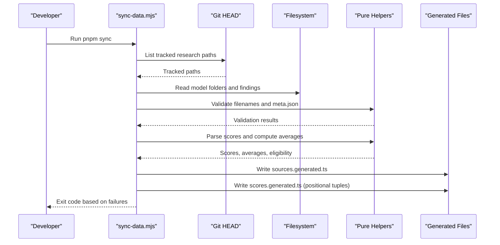
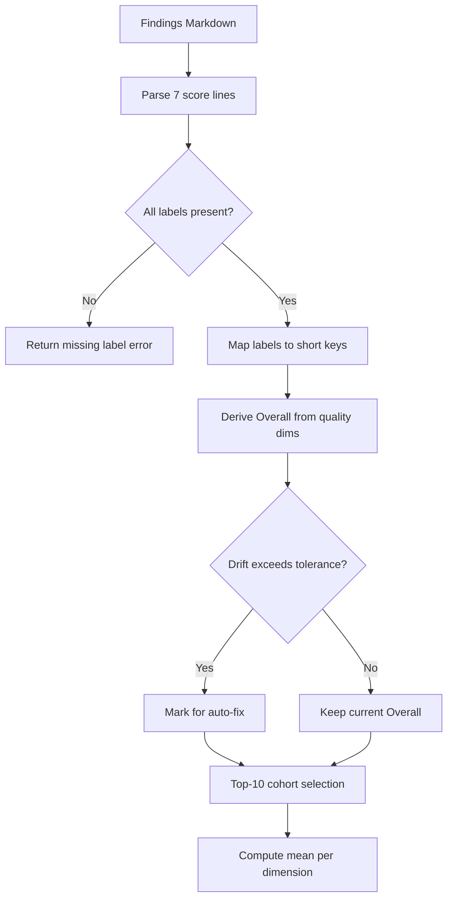
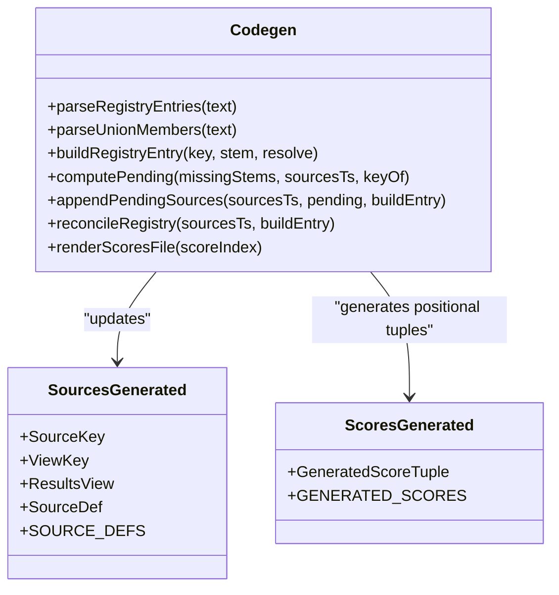
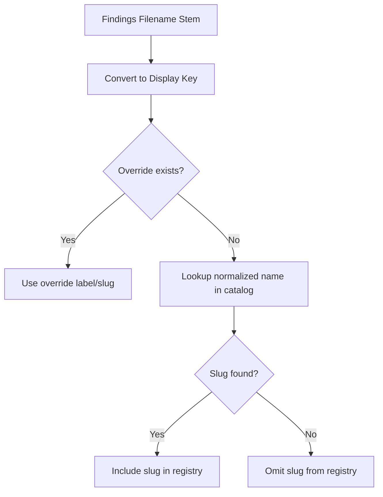
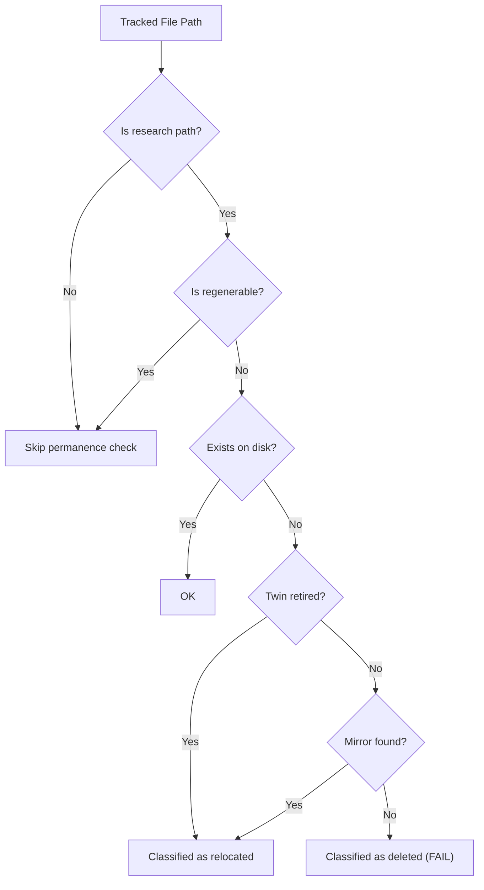
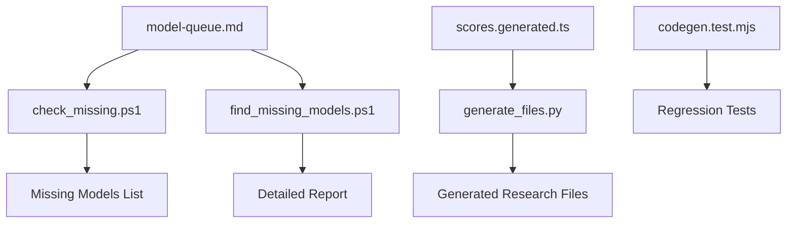
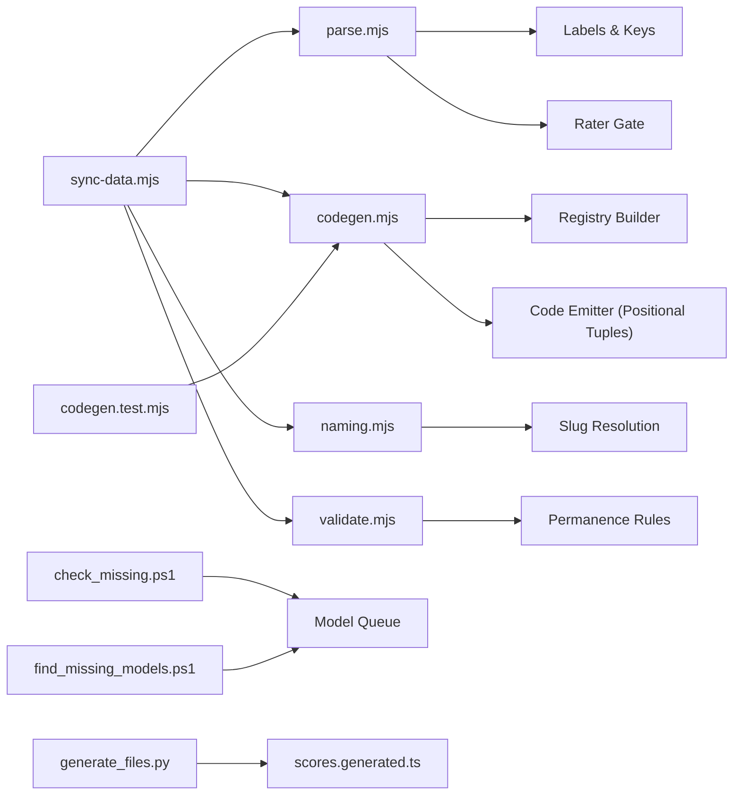

# Data Synchronization Pipeline

<cite>
**Referenced Files in This Document**
- [sync-data.mjs](file://scripts/sync-data.mjs)
- [parse.mjs](file://scripts/lib/parse.mjs)
- [codegen.mjs](file://scripts/lib/codegen.mjs)
- [naming.mjs](file://scripts/lib/naming.mjs)
- [validate.mjs](file://scripts/lib/validate.mjs)
- [sources.generated.ts](file://src/data/sources.generated.ts)
- [scores.generated.ts](file://src/data/scores.generated.ts)
- [meta.json](file://model/Inkling/meta.json)
- [package.json](file://package.json)
- [check_missing.ps1](file://check_missing.ps1)
- [find_missing_models.ps1](file://find_missing_models.ps1)
- [codegen.test.mjs](file://scripts/lib/codegen.test.mjs)
- [generate_files.py](file://generate_files.py)
</cite>

## Update Summary
**Changes Made**
- Updated score emission format from objects to positional tuples for improved performance
- Added comprehensive PowerShell validation tools for missing model components
- Enhanced test coverage with detailed codegen regression tests
- Added Python utility for generating missing research files based on expected scoring calculations
- Updated troubleshooting section with new validation tool usage

## Table of Contents
1. [Introduction](#introduction)
2. [Project Structure](#project-structure)
3. [Core Components](#core-components)
4. [Architecture Overview](#architecture-overview)
5. [Detailed Component Analysis](#detailed-component-analysis)
6. [Validation and Testing Tools](#validation-and-testing-tools)
7. [Dependency Analysis](#dependency-analysis)
8. [Performance Considerations](#performance-considerations)
9. [Troubleshooting Guide](#troubleshooting-guide)
10. [Conclusion](#conclusion)

## Introduction
This document explains the data synchronization pipeline that turns research markdown files into deterministic runtime TypeScript data. The pipeline:

- Scans model research folders under `model/<slug>/`.
- Validates filenames, metadata, and score lines.
- Auto-corrects derived Overall scores when they drift from their quality dimensions.
- Applies a rater gate so only reports from sufficiently strong models contribute to averages.
- Computes per-folder averages over the top-10 cohort.
- Registers new reporting agents automatically.
- Generates `src/data/sources.generated.ts` and `src/data/scores.generated.ts`, which are consumed by the application at build time.

The sync script is designed to be deterministic: given the same input state, it produces byte-identical generated outputs and consistent average rewrites.

**Updated** The pipeline now emits scores as positional tuples instead of objects, significantly reducing client bundle size while maintaining type safety through TypeScript tuple definitions.

## Project Structure
The pipeline lives primarily under `scripts/`, with generated artifacts under `src/data/` and research inputs under `model/`.



**Diagram sources**
- [sync-data.mjs:30-75](file://scripts/sync-data.mjs#L30-L75)
- [sources.generated.ts:1-145](file://src/data/sources.generated.ts#L1-L145)
- [scores.generated.ts:1-200](file://src/data/scores.generated.ts#L1-L200)
- [check_missing.ps1:1-3](file://check_missing.ps1#L1-L3)
- [find_missing_models.ps1:1-14](file://find_missing_models.ps1#L1-L14)
- [generate_files.py:1-113](file://generate_files.py#L1-L113)
- [codegen.test.mjs:1-180](file://scripts/lib/codegen.test.mjs#L1-L180)

**Section sources**
- [sync-data.mjs:1-30](file://scripts/sync-data.mjs#L1-L30)
- [package.json:11-24](file://package.json#L11-L24)

## Core Components
The sync process is composed of one orchestrator script and four pure helper modules:

| Component | Responsibility | Key Behaviors |
|---|---|---|
| `scripts/sync-data.mjs` | Orchestrates scanning, validation, averaging, registry updates, and code generation | Reads git tree for permanence checks, parses all findings, computes averages, writes generated files |
| `scripts/lib/parse.mjs` | Pure parsing and scoring logic | Defines labels, short keys, quality dimensions, rater gate, drift tolerance, top-10 ranking, and cohort averaging |
| `scripts/lib/codegen.mjs` | Registry and code generation text builders | Parses/appends SourceKey union entries, SOURCE_DEFS array, reconciles labels/slugs, renders `scores.generated.ts` with positional tuples |
| `scripts/lib/naming.mjs` | Naming conventions and slug resolution | Converts stems to keys, resolves display labels and slugs, detects hyphen-version violations, formats slug guesses |
| `scripts/lib/validate.mjs` | Permanence and hygiene validation | Filters research paths, classifies missing tracked files, validates filenames and meta.json fields |

**Updated** The codegen module now generates compact positional tuples `[tool, reasoning, context, multimodal, coding, cost, overall]` instead of object literals, reducing client bundle size by eliminating repeated key names.

**Section sources**
- [sync-data.mjs:30-75](file://scripts/sync-data.mjs#L30-L75)
- [parse.mjs:8-45](file://scripts/lib/parse.mjs#L8-L45)
- [codegen.mjs:1-12](file://scripts/lib/codegen.mjs#L1-L12)
- [naming.mjs:1-27](file://scripts/lib/naming.mjs#L1-L27)
- [validate.mjs:1-12](file://scripts/lib/validate.mjs#L1-L12)

## Architecture Overview
At a high level, the pipeline transforms research markdown into typed runtime data through these stages:

1. **Discovery**: Enumerate model folders and research files.
2. **Permanence Check**: Ensure tracked research files are not silently deleted.
3. **Hygiene Validation**: Enforce filename rules and required metadata.
4. **Score Parsing**: Extract seven normalized scores from each findings file.
5. **Overall Correction**: Auto-fix derived Overall values when they drift.
6. **Rater Gate**: Filter eligible sources based on the rating model's own average.
7. **Average Computation**: Compute averages over the top-10 cohort.
8. **Registry Update**: Register new reporting agents and reconcile existing entries.
9. **Code Generation**: Emit `sources.generated.ts` and `scores.generated.ts` with positional tuples.



**Diagram sources**
- [sync-data.mjs:133-178](file://scripts/sync-data.mjs#L133-L178)
- [sync-data.mjs:288-326](file://scripts/sync-data.mjs#L288-L326)
- [sync-data.mjs:328-436](file://scripts/sync-data.mjs#L328-L436)
- [sync-data.mjs:438-523](file://scripts/sync-data.mjs#L438-L523)

## Detailed Component Analysis

### Sync Orchestrator: `scripts/sync-data.mjs`
The orchestrator coordinates all pipeline phases. It imports pure helpers and performs filesystem operations, logging, failure accounting, and deterministic writes.

Key responsibilities:
- Determine root and output paths.
- Define source overrides for display labels and slugs.
- Support quiet mode for CI or large repos.
- Perform permanence tripwire using git.
- Validate slug versioning conventions.
- Auto-quarantine evidence-free findings.
- Parse and index scores.
- Apply overall drift correction.
- Partition eligible raters and compute averages.
- Reconcile and append registry entries.
- Generate compact scores for the client bundle using positional tuples.



**Diagram sources**
- [sync-data.mjs:133-178](file://scripts/sync-data.mjs#L133-L178)
- [sync-data.mjs:288-326](file://scripts/sync-data.mjs#L288-L326)
- [sync-data.mjs:328-436](file://scripts/sync-data.mjs#L328-L436)
- [sync-data.mjs:438-523](file://scripts/sync-data.mjs#L438-L523)

**Section sources**
- [sync-data.mjs:1-30](file://scripts/sync-data.mjs#L1-L30)
- [sync-data.mjs:77-118](file://scripts/sync-data.mjs#L77-L118)
- [sync-data.mjs:128-197](file://scripts/sync-data.mjs#L128-L197)
- [sync-data.mjs:259-436](file://scripts/sync-data.mjs#L259-L436)
- [sync-data.mjs:438-527](file://scripts/sync-data.mjs#L438-L527)

### Score Parsing and Averaging: `scripts/lib/parse.mjs`
This module defines the contract for score parsing and cohort averaging.

Important concepts:
- Seven canonical labels define the expected score structure.
- Short keys map long labels to compact names used in generated code.
- Quality dimensions exclude cost from the Overall derivation.
- Rater gate threshold determines which models can rate others.
- Drift tolerance allows automatic correction of Overall scores.
- Top-10 ranking selects the strongest sources for averaging.
- Label sorting follows a case-insensitive alphabetical convention.



**Diagram sources**
- [parse.mjs:8-45](file://scripts/lib/parse.mjs#L8-L45)
- [parse.mjs:52-97](file://scripts/lib/parse.mjs#L52-L97)
- [parse.mjs:105-123](file://scripts/lib/parse.mjs#L105-L123)

**Section sources**
- [parse.mjs:8-45](file://scripts/lib/parse.mjs#L8-L45)
- [parse.mjs:52-97](file://scripts/lib/parse.mjs#L52-L97)
- [parse.mjs:105-123](file://scripts/lib/parse.mjs#L105-L123)

### Registry and Code Generation: `scripts/lib/codegen.mjs`
This module manages the TypeScript registry and generated score exports.

Responsibilities:
- Parse existing registry entries and SourceKey union members.
- Build registry entries with correct labels and slugs.
- Compute pending registrations and detect key collisions.
- Append new sources to both the union type and SOURCE_DEFS array.
- Reconcile existing entries for idempotent label/slug updates.
- Render deterministic `scores.generated.ts` with sorted slugs and files using positional tuples.

**Updated** The renderScoresFile function now emits compact positional tuples instead of object literals, significantly reducing the client bundle size while maintaining type safety through GeneratedScoreTuple definitions.



**Diagram sources**
- [codegen.mjs:14-35](file://scripts/lib/codegen.mjs#L14-L35)
- [codegen.mjs:44-84](file://scripts/lib/codegen.mjs#L44-L84)
- [codegen.mjs:92-105](file://scripts/lib/codegen.mjs#L92-L105)
- [codegen.mjs:111-139](file://scripts/lib/codegen.mjs#L111-L139)
- [sources.generated.ts:5-80](file://src/data/sources.generated.ts#L5-L80)

**Section sources**
- [codegen.mjs:1-12](file://scripts/lib/codegen.mjs#L1-L12)
- [codegen.mjs:14-35](file://scripts/lib/codegen.mjs#L14-L35)
- [codegen.mjs:44-84](file://scripts/lib/codegen.mjs#L44-L84)
- [codegen.mjs:92-105](file://scripts/lib/codegen.mjs#L92-L105)
- [codegen.mjs:111-139](file://scripts/lib/codegen.mjs#L111-L139)

### Naming Conventions: `scripts/lib/naming.mjs`
Naming utilities ensure consistent mapping between filenames, display labels, and model-page slugs.

Key behaviors:
- Normalize names for catalog matching.
- Convert underscores in filenames to spaces for display keys.
- Resolve labels and slugs using overrides and catalog lookup.
- Detect invalid hyphen-version folder names.
- Format slug guesses for auto-scaffolded metadata.
- Define virtual sort-view keys that are not real agents.



**Diagram sources**
- [naming.mjs:8-27](file://scripts/lib/naming.mjs#L8-L27)
- [naming.mjs:36-44](file://scripts/lib/naming.mjs#L36-L44)
- [naming.mjs:49-62](file://scripts/lib/naming.mjs#L49-L62)

**Section sources**
- [naming.mjs:8-27](file://scripts/lib/naming.mjs#L8-L27)
- [naming.mjs:36-44](file://scripts/lib/naming.mjs#L36-L44)
- [naming.mjs:49-62](file://scripts/lib/naming.mjs#L49-L62)

### Validation and Permanence: `scripts/lib/validate.mjs`
Validation ensures research files remain permanent and well-formed.

Responsibilities:
- Identify sanctioned mirror trees for relocated files.
- Filter research paths to markdown files.
- Exclude regenerable files like averages and READMEs from permanence checks.
- Classify missing tracked files as twin-retired, relocated, or deleted.
- Find mirror locations for relocated files.
- Provide exact failure messages for forbidden deletions.
- Validate filenames against allowed character sets.
- Validate required metadata fields and display-name constraints.



**Diagram sources**
- [validate.mjs:11-25](file://scripts/lib/validate.mjs#L11-L25)
- [validate.mjs:34-52](file://scripts/lib/validate.mjs#L34-L52)
- [validate.mjs:54-80](file://scripts/lib/validate.mjs#L54-L80)

**Section sources**
- [validate.mjs:11-25](file://scripts/lib/validate.mjs#L11-L25)
- [validate.mjs:34-52](file://scripts/lib/validate.mjs#L34-L52)
- [validate.mjs:54-80](file://scripts/lib/validate.mjs#L54-L80)

## Validation and Testing Tools

### PowerShell Validation Scripts
Two PowerShell scripts provide enhanced validation capabilities for identifying missing model components:

#### `check_missing.ps1`
A simple script that identifies models missing the Laguna_XS_2.1 benchmark file by comparing the model queue against actual model directories.

**Usage**: `.\check_missing.ps1`

#### `find_missing_models.ps1`
A more comprehensive script that generates a complete list of all models in the queue and identifies those missing specific benchmark files, providing colored output and summary statistics.

**Usage**: `.\find_missing_models.ps1`

### Python Utility for Research File Generation
The `generate_files.py` script provides automated generation of missing research files based on expected scoring calculations extracted from the generated scores file.

**Features**:
- Parses positional tuples from `scores.generated.ts`
- Identifies missing models from predefined lists
- Generates properly formatted research markdown files
- Creates necessary directory structures
- Maps model slugs to display names

**Usage**: `python generate_files.py`

### Comprehensive Test Coverage
The `codegen.test.mjs` file provides extensive regression testing for the code generation functionality, covering:

- Registry entry parsing and building
- Union member management
- Pending source computation and collision detection
- Registry reconciliation and cleanup
- Positional tuple rendering and ordering
- Rater gate line management
- Robots.txt generation

**Test Execution**: `pnpm test`



**Diagram sources**
- [check_missing.ps1:1-3](file://check_missing.ps1#L1-L3)
- [find_missing_models.ps1:1-14](file://find_missing_models.ps1#L1-L14)
- [generate_files.py:1-113](file://generate_files.py#L1-L113)
- [codegen.test.mjs:1-180](file://scripts/lib/codegen.test.mjs#L1-L180)

**Section sources**
- [check_missing.ps1:1-3](file://check_missing.ps1#L1-L3)
- [find_missing_models.ps1:1-14](file://find_missing_models.ps1#L1-L14)
- [generate_files.py:1-113](file://generate_files.py#L1-L113)
- [codegen.test.mjs:1-180](file://scripts/lib/codegen.test.mjs#L1-L180)

## Dependency Analysis
The sync script depends on pure helper modules to maintain deterministic behavior and testability.



**Diagram sources**
- [sync-data.mjs:30-75](file://scripts/sync-data.mjs#L30-L75)
- [parse.mjs:8-45](file://scripts/lib/parse.mjs#L8-L45)
- [codegen.mjs:1-12](file://scripts/lib/codegen.mjs#L1-L12)
- [naming.mjs:1-27](file://scripts/lib/naming.mjs#L1-L27)
- [validate.mjs:1-12](file://scripts/lib/validate.mjs#L1-L12)
- [codegen.test.mjs:1-180](file://scripts/lib/codegen.test.mjs#L1-L180)
- [check_missing.ps1:1-3](file://check_missing.ps1#L1-L3)
- [find_missing_models.ps1:1-14](file://find_missing_models.ps1#L1-L14)
- [generate_files.py:1-113](file://generate_files.py#L1-L113)

**Section sources**
- [sync-data.mjs:30-75](file://scripts/sync-data.mjs#L30-L75)

## Performance Considerations
The pipeline is optimized for deterministic builds and efficient client bundles:

- **Positional tuples**: Only numeric scores are emitted to `scores.generated.ts` as compact arrays, keeping full markdown prose out of the client bundle and eliminating repeated key names.
- **Sorted outputs**: Generated files use sorted keys to ensure byte-identical outputs across runs.
- **Avoid eager imports**: The old approach of eagerly importing raw markdown was replaced with pre-parsed numeric indexes.
- **Quiet mode**: Large repositories can run with reduced logging while maintaining identical behavior.
- **Incremental validation**: Metadata scaffolding prevents build failures while requiring human review.
- **Type-safe tuples**: Generated TypeScript uses named tuple types for better developer experience while maintaining compact wire format.

**Updated** The shift to positional tuples significantly reduces client bundle size by eliminating repeated key names, which previously accounted for ~60% of the emit size.

[No sources needed since this section provides general guidance]

## Troubleshooting Guide

### Common Sync Failures

| Symptom | Likely Cause | Resolution |
|---|---|---|
| FAIL about missing tracked research file | A git-tracked findings file was deleted without following retirement procedures | Restore the file using git restore or follow the twin retirement process |
| FAIL about filename hygiene | Findings filename contains disallowed characters | Rename to match allowed pattern: letters, digits, underscore, dots |
| FAIL about missing meta.json field | Model metadata is incomplete or has placeholder values | Fill in required fields with verified vendor information |
| WARN about auto-scaffolded meta.json | New model folder lacks proper metadata | Replace slug guess with official vendor name and facts |
| SKIP about self-excluded file | Findings file has no verified benchmarks | Review the report; if valid, remove `.excluded` suffix after adding scores |
| QUAR about evidence-free file | Report has many "no verified public score found" rows but no measured values | Investigate benchmark data; consider removing or fixing the report |
| COLLISION about duplicate key | Two different filenames map to the same source key | Choose unique filenames or consolidate reports |
| SKIP scores.generated.ts not rewritten | Sync had failures during processing | Fix reported failures and re-run sync |

### Using Validation Tools

#### PowerShell Scripts
- **Check missing benchmarks**: `.\check_missing.ps1` - Lists models missing Laguna_XS_2.1.md
- **Find missing models**: `.\find_missing_models.ps1` - Comprehensive report with colored output and counts

#### Python Utilities
- **Generate missing research files**: `python generate_files.py` - Creates research files based on expected scoring calculations

#### Test Suite
- **Run all tests**: `pnpm test` - Executes comprehensive regression tests for codegen functionality

### How to Add a New Reporting Agent
1. Create a new findings markdown file in the appropriate model folder.
2. Include all seven normalized score lines.
3. Run `pnpm sync`.
4. The sync script will automatically register the new agent in `sources.generated.ts`.
5. If metadata is missing, update the scaffolded `meta.json` with verified information.

### How to Add a New Model Folder
1. Create a new folder under `model/` using dotted version notation (e.g., `gpt-5.5`).
2. Add a `meta.json` file with required fields.
3. Add findings markdown files with normalized scores.
4. Run `pnpm sync` to validate and generate outputs.

### Understanding Positional Tuples
The generated scores now use positional tuples instead of objects:

**Old format (object)**:
```typescript
{ tool: 70, reasoning: 75, context: 95, multimodal: 92, coding: 76, cost: 89, overall: 82 }
```

**New format (positional tuple)**:
```typescript
[70, 75, 95, 92, 76, 89, 82]
```

The tuple order is fixed: `[tool, reasoning, context, multimodal, coding, cost, overall]` and is enforced by the `GeneratedScoreTuple` TypeScript definition.

**Section sources**
- [sync-data.mjs:133-178](file://scripts/sync-data.mjs#L133-L178)
- [sync-data.mjs:288-326](file://scripts/sync-data.mjs#L288-L326)
- [sync-data.mjs:438-523](file://scripts/sync-data.mjs#L438-L523)
- [check_missing.ps1:1-3](file://check_missing.ps1#L1-L3)
- [find_missing_models.ps1:1-14](file://find_missing_models.ps1#L1-L14)
- [generate_files.py:1-113](file://generate_files.py#L1-L113)
- [codegen.test.mjs:1-180](file://scripts/lib/codegen.test.mjs#L1-L180)

## Conclusion
The data synchronization pipeline provides a robust, deterministic workflow for transforming research markdown into runtime TypeScript data. It enforces data consistency through strict validation, automatic corrections, and controlled averaging. The generated files serve as the single source of truth for the application, ensuring that model comparisons remain accurate and up-to-date. By automating registration and code generation, the pipeline reduces manual overhead while maintaining high standards for data quality and consistency across builds.

**Updated** Recent enhancements include the adoption of positional tuples for improved performance, comprehensive PowerShell validation tools for missing model components, and extensive test coverage ensuring reliability. These improvements make the pipeline more efficient, easier to maintain, and better equipped to handle the growing complexity of the model comparison dataset.

[No sources needed since this section summarizes without analyzing specific files]