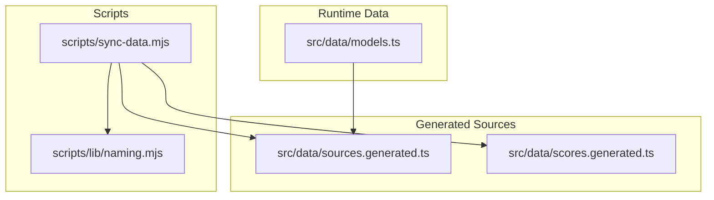
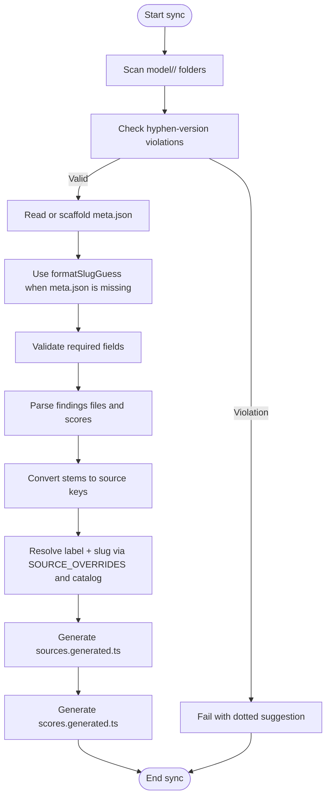
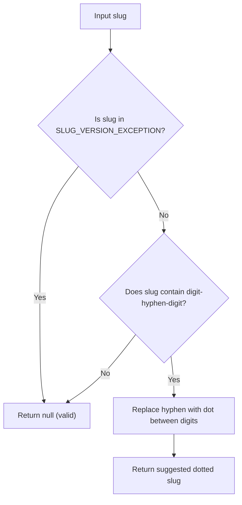
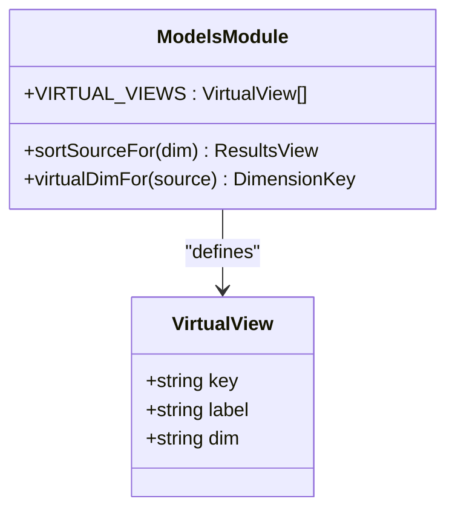
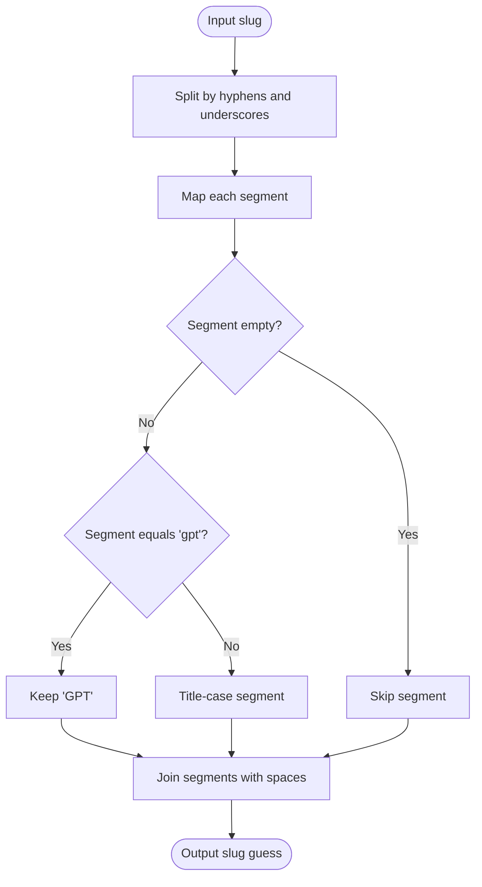
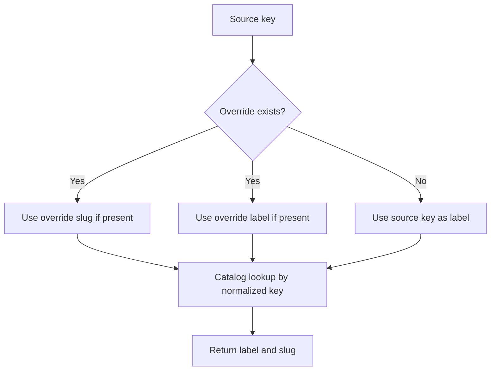
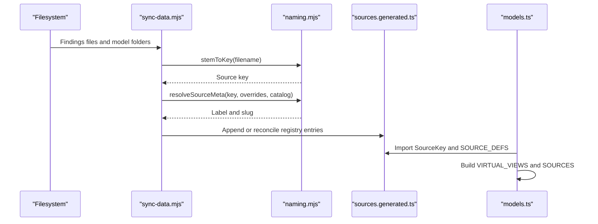
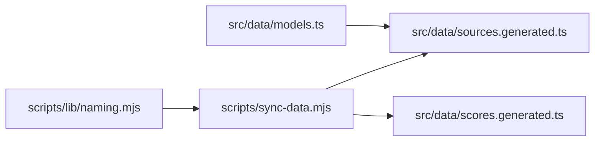

# Naming Conventions & Utilities

<cite>
**Referenced Files in This Document**
- [naming.mjs](file://scripts/lib/naming.mjs)
- [sync-data.mjs](file://scripts/sync-data.mjs)
- [models.ts](file://src/data/models.ts)
- [naming.test.mjs](file://scripts/lib/naming.test.mjs)
</cite>

## Table of Contents
1. [Introduction](#introduction)
2. [Project Structure](#project-structure)
3. [Core Components](#core-components)
4. [Architecture Overview](#architecture-overview)
5. [Detailed Component Analysis](#detailed-component-analysis)
6. [Dependency Analysis](#dependency-analysis)
7. [Performance Considerations](#performance-considerations)
8. [Troubleshooting Guide](#troubleshooting-guide)
9. [Conclusion](#conclusion)

## Introduction
This document explains the naming conventions and utility functions that standardize model and source identification across the data pipeline. It focuses on:

- Display name normalization with `normName`.
- Conversion between filesystem filenames and internal source keys with `stemToKey` and `labelOf`.
- Hyphen-version violation detection to prevent duplicate model folders such as `gpt-5-5` versus `gpt-5.5`.
- The virtual key system used for special sort views.
- The slug guessing algorithm used when auto-scaffolding missing `meta.json` files.
- The `SOURCE_OVERRIDES` mapping for cases where default naming does not match expected behavior.

These utilities keep the pipeline deterministic, readable, and consistent from raw markdown findings through generated TypeScript sources to the runtime model registry.

## Project Structure
The naming and identification logic is split into two layers:

- Pure helpers in `scripts/lib/naming.mjs`: zero-dependency functions that define the contract for names, slugs, labels, and validation rules.
- Orchestration in `scripts/sync-data.mjs`: reads the filesystem, applies the pure helpers, enforces conventions, and writes generated artifacts.
- Runtime consumption in `src/data/models.ts`: uses generated sources and defines virtual views for UI sorting.

**Diagram sources**
- [sync-data.mjs:36-75](file://scripts/sync-data.mjs#L36-L75)
- [sync-data.mjs:438-480](file://scripts/sync-data.mjs#L438-L480)
- [sync-data.mjs:490-523](file://scripts/sync-data.mjs#L490-L523)
- [models.ts:18-20](file://src/data/models.ts#L18-L20)
- [models.ts:318-329](file://src/data/models.ts#L318-L329)

**Section sources**
- [naming.mjs:1-7](file://scripts/lib/naming.mjs#L1-L7)
- [sync-data.mjs:1-30](file://scripts/sync-data.mjs#L1-L30)
- [models.ts:6-16](file://src/data/models.ts#L6-L16)

## Core Components
The core naming utilities are small, pure functions designed to be stable across builds and easy to test.

| Function | Purpose | Input | Output | Notes |
|---|---|---|---|---|
| `normName` | Case- and punctuation-folded comparison for deep-links and catalog matching | String display or filename text | Lowercase string without non-alphanumeric characters | Used to map a human-readable name to a normalized form for catalog lookup. |
| `stemToKey` | Convert a findings-file stem to an internal source key | Filename stem without `.md` | Source key with spaces replacing underscores | Example: `Gemini_3.6_Flash` becomes `Gemini 3.6 Flash`. |
| `labelOf` | Extract the Agreement-notes label from a full filename | Full `.md` filename | Label with underscores replaced by spaces and extension removed | Used for deterministic A-Z sorting of sources. |
| `resolveSourceMeta` | Resolve display label and model-page slug for a source key | Source key, overrides map, catalog lookup function | Object containing `label` and optional `slug` | Overrides take precedence; otherwise the normalized key is matched against the catalog. |
| `hyphenVersionViolation` | Detect invalid hyphen-separated version segments in slugs | Slug string | Suggested dotted slug or `null` if valid | Prevents duplicates like `gpt-5-5` when `gpt-5.5` already exists. |
| `VIRTUAL_KEYS` | Set of virtual sort-view keys | None | Set of six view keys | These keys represent sort dimensions, not real reporting agents. |
| `formatSlugGuess` | Auto-scaffold a human-readable display name from a slug | Folder slug | Title-cased, space-separated guess | Must be reviewed before being trusted as an official vendor name. |
| `missingMetaFields` | Validate required fields in `meta.json` | Metadata object and required field list | Array of missing fields | Used during sync validation. |
| `metaNameHasUnderscore` | Reject slug-like artifacts in display names | Name string | Boolean | Underscores indicate a slug artifact, not a valid display name. |

**Section sources**
- [naming.mjs:8-27](file://scripts/lib/naming.mjs#L8-L27)
- [naming.mjs:29-72](file://scripts/lib/naming.mjs#L29-L72)

## Architecture Overview
The naming utilities participate in three main flows:

1. **Sync-time identification**: `sync-data.mjs` scans model folders, converts filenames to keys, resolves labels and slugs, validates metadata, and generates source registries and score indexes.
2. **Convention enforcement**: Hyphen-version violations are rejected early so duplicate model folders cannot be created. Missing or malformed `meta.json` files are scaffolded with a slug guess and flagged for manual review.
3. **Runtime presentation**: `src/data/models.ts` consumes generated sources and defines virtual views for sorting results by dimension.

**Diagram sources**
- [sync-data.mjs:180-197](file://scripts/sync-data.mjs#L180-L197)
- [sync-data.mjs:297-326](file://scripts/sync-data.mjs#L297-L326)
- [sync-data.mjs:438-480](file://scripts/sync-data.mjs#L438-L480)
- [sync-data.mjs:490-523](file://scripts/sync-data.mjs#L490-L523)

## Detailed Component Analysis

### Display Name Normalization: `normName`
`normName` normalizes display names by converting them to lowercase and removing all characters except letters and digits. This makes it safe to compare names that may differ in case, punctuation, or separators.

Key behaviors:
- Converts uppercase to lowercase.
- Removes spaces, hyphens, dots, slashes, and other punctuation.
- Produces a compact identifier suitable for catalog matching.

Example transformations:
- `"DeepSeek v4.1 Flash"` → normalized form without spaces, dots, or punctuation.
- `"deepseek-v4.1-flash"` → same normalized form.
- `"MiMo v2.6 Flash"` → normalized form without spaces or punctuation.

Rationale:
- Deep links and catalog lookups must tolerate different human-written forms.
- Normalization avoids accidental mismatches caused by casing or punctuation.

**Section sources**
- [naming.mjs:8-9](file://scripts/lib/naming.mjs#L8-L9)
- [naming.test.mjs:31-37](file://scripts/lib/naming.test.mjs#L31-L37)

### Filename-to-Key Conversion: `stemToKey` and `labelOf`
`stemToKey` converts a findings-file stem into an internal source key by replacing underscores with spaces. This is the bridge between filesystem naming and the application’s internal representation.

`labelOf` extracts a user-facing label from a full `.md` filename by removing the extension and replacing underscores with spaces. It is used for deterministic alphabetical sorting of sources.

Example transformations:
- `Gemini_3.6_Flash` → `Gemini 3.6 Flash`
- `GLM_5.3_Flash.md` → `GLM 5.3 Flash`

Rationale:
- Filenames use underscores for filesystem safety.
- Display keys and labels use spaces for readability.
- Sorting uses the same transformation so file order matches expected agreement-note ordering.

**Section sources**
- [naming.mjs:11-15](file://scripts/lib/naming.mjs#L11-L15)
- [naming.test.mjs:39-44](file://scripts/lib/naming.test.mjs#L39-L44)
- [sync-data.mjs:387-393](file://scripts/sync-data.mjs#L387-L393)

### Hyphen-Version Violation Detection
The hyphen-version rule prevents duplicate model folders by rejecting folder slugs that contain a digit-hyphen-digit pattern. Version numbers should use dots, not hyphens.

Behavior:
- If a slug contains a digit followed by a hyphen followed by another digit, it is considered a violation.
- Exceptions exist for known slugs where the hyphen separates meaningful parts, such as parameter sizes.
- The function returns the suggested dotted slug when a violation is detected.
- `sync-data.mjs` fails the run with a clear message pointing to the correct folder name.

Examples:
- `gpt-5-5` → violation; suggested destination is `gpt-5.5`.
- `gemma-4-31b` → exception; treated as a param-size slug, not a version violation.
- `qwen-3.8-27b` → exception; treated as version plus parameter size.

**Diagram sources**
- [naming.mjs:29-44](file://scripts/lib/naming.mjs#L29-L44)
- [sync-data.mjs:180-197](file://scripts/sync-data.mjs#L180-L197)

**Section sources**
- [naming.mjs:29-44](file://scripts/lib/naming.mjs#L29-L44)
- [sync-data.mjs:180-197](file://scripts/sync-data.mjs#L180-L197)

### Virtual Key System for Special Views
The virtual key system provides special sort views that are not real reporting agents. These views reuse the average scores but change the ranking dimension.

Virtual keys:
- `tool`
- `reason`
- `context`
- `cost`
- `code`
- `multi`

At runtime, `src/data/models.ts` defines `VIRTUAL_VIEWS` and derives dropdown entries from them. The virtual views are never registered as real sources in the generated registry; they are synthesized at build time.

**Diagram sources**
- [naming.mjs:46-47](file://scripts/lib/naming.mjs#L46-L47)
- [models.ts:251-274](file://src/data/models.ts#L251-L274)

**Section sources**
- [naming.mjs:46-47](file://scripts/lib/naming.mjs#L46-L47)
- [models.ts:243-274](file://src/data/models.ts#L243-L274)

### Slug Guessing Algorithm for Auto-Scaffolded `meta.json`
When a model folder lacks `meta.json`, `sync-data.mjs` scaffolds one automatically. The scaffolded `name` is generated by `formatSlugGuess`, which title-cases slug segments and treats `gpt` specially.

Algorithm steps:
1. Split the slug by hyphens and underscores.
2. For each segment:
   - Skip empty segments.
   - Capitalize `GPT` exactly.
   - Otherwise, capitalize the first letter and lowercase the rest.
3. Join segments with spaces.

Important constraint:
- The scaffolded name is only a guess. It must be replaced with the official vendor display name and verified facts before the entry is trustworthy.
- The underscore check rejects slug-like artifacts in the final display name.

Example transformations:
- `gpt-5.6-sol` → `GPT 5.6 Sol`
- `longcat_2.5_preview` → `Longcat 2.5 Preview`
- `gemini-3.8-flash` → `Gemini 3.8 Flash`

**Diagram sources**
- [naming.mjs:49-62](file://scripts/lib/naming.mjs#L49-L62)
- [sync-data.mjs:302-319](file://scripts/sync-data.mjs#L302-L319)

**Section sources**
- [naming.mjs:49-72](file://scripts/lib/naming.mjs#L49-L72)
- [sync-data.mjs:302-326](file://scripts/sync-data.mjs#L302-L326)

### `SOURCE_OVERRIDES` Mapping
`SOURCE_OVERRIDES` handles special cases where the default naming convention does not produce the expected display label or model-page slug.

Overrides include:
- Custom display labels, such as capitalization or vendor-preferred wording.
- Explicit slugs when the normalized key would not match the actual model folder.
- Cases where the agent filename differs from the tracked model page slug.

Resolution order:
1. Use the override’s explicit label if present.
2. Use the override’s explicit slug if present.
3. Otherwise, fall back to the source key as the label.
4. Fall back to catalog lookup using the normalized key.

**Diagram sources**
- [sync-data.mjs:85-100](file://scripts/sync-data.mjs#L85-L100)
- [naming.mjs:17-27](file://scripts/lib/naming.mjs#L17-L27)

**Section sources**
- [sync-data.mjs:85-100](file://scripts/sync-data.mjs#L85-L100)
- [naming.mjs:17-27](file://scripts/lib/naming.mjs#L17-L27)

### Pipeline Integration: From Filename to Model Page
The complete flow connects filenames, keys, labels, slugs, and generated sources.

**Diagram sources**
- [sync-data.mjs:242-257](file://scripts/sync-data.mjs#L242-L257)
- [sync-data.mjs:438-480](file://scripts/sync-data.mjs#L438-L480)
- [models.ts:318-329](file://src/data/models.ts#L318-L329)

**Section sources**
- [sync-data.mjs:242-257](file://scripts/sync-data.mjs#L242-L257)
- [sync-data.mjs:438-480](file://scripts/sync-data.mjs#L438-L480)
- [models.ts:318-329](file://src/data/models.ts#L318-L329)

## Dependency Analysis
The naming utilities have minimal external dependencies and are intentionally isolated:

- `scripts/lib/naming.mjs` has no imports and exports pure functions.
- `scripts/sync-data.mjs` imports the naming helpers and combines them with filesystem I/O, parsing, validation, and code generation.
- `src/data/models.ts` imports generated sources and defines runtime virtual views.

**Diagram sources**
- [naming.mjs:1-7](file://scripts/lib/naming.mjs#L1-L7)
- [sync-data.mjs:36-75](file://scripts/sync-data.mjs#L36-L75)
- [sync-data.mjs:490-523](file://scripts/sync-data.mjs#L490-L523)
- [models.ts:18-20](file://src/data/models.ts#L18-L20)

**Section sources**
- [naming.mjs:1-7](file://scripts/lib/naming.mjs#L1-L7)
- [sync-data.mjs:36-75](file://scripts/sync-data.mjs#L36-L75)
- [models.ts:18-20](file://src/data/models.ts#L18-L20)

## Performance Considerations
The naming utilities are designed for performance and determinism:

- `normName`, `stemToKey`, and `labelOf` are simple string operations with linear complexity relative to input length.
- `resolveSourceMeta` performs constant-time override lookup and one normalized catalog lookup.
- `hyphenVersionViolation` uses a single regular expression and replacement pass.
- `formatSlugGuess` splits and maps short slug segments, which is negligible compared to filesystem scanning.

Because these functions are pure and side-effect-free, they can be reused across sync passes and tests without state concerns.

[No sources needed since this section provides general guidance]

## Troubleshooting Guide
Common issues and how the utilities help diagnose them:

| Issue | Symptom | Utility or Rule Involved | Resolution |
|---|---|---|---|
| Duplicate model folder due to hyphenated version | Sync fails with a suggestion to use a dotted version | `hyphenVersionViolation` | Rename the folder to use dots, such as `gpt-5.5`, and merge content into the existing folder. |
| Wrong display label for a source | Dropdown shows unexpected casing or wording | `SOURCE_OVERRIDES` | Add or update the override for the source key with the correct label. |
| Source key not linked to a model page | Source has no slug after sync | `resolveSourceMeta` and catalog lookup | Ensure the normalized display name exists in a `meta.json`, or add an explicit slug override. |
| Scaffolded `meta.json` name looks wrong | Generated name contains slug artifacts | `formatSlugGuess` and underscore gate | Replace the scaffolded name with the official vendor display name and remove underscores. |
| Sorting order differs from expectations | Labels appear out of order | `labelOf` and A-Z sorting | Ensure filenames follow the underscore-to-space convention used by `labelOf`. |

**Section sources**
- [sync-data.mjs:180-197](file://scripts/sync-data.mjs#L180-L197)
- [sync-data.mjs:302-326](file://scripts/sync-data.mjs#L302-L326)
- [naming.mjs:17-27](file://scripts/lib/naming.mjs#L17-L27)
- [naming.mjs:49-72](file://scripts/lib/naming.mjs#L49-L72)

## Conclusion
The naming conventions and utilities in this project provide a stable contract between filesystem artifacts, generated sources, and runtime presentation. `normName` ensures robust comparison, `stemToKey` and `labelOf` bridge filenames and display keys, `hyphenVersionViolation` prevents duplicate model folders, the virtual key system enables consistent sort views, and `SOURCE_OVERRIDES` handles edge cases. Together, they keep the pipeline predictable, auditable, and maintainable as new models and sources are added.

[No sources needed since this section summarizes without analyzing specific files]