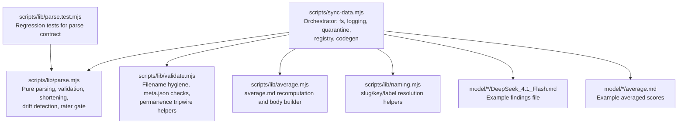
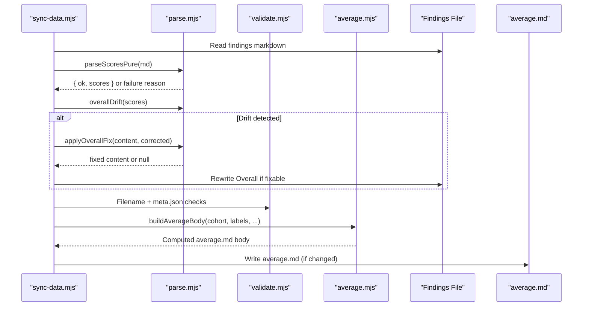
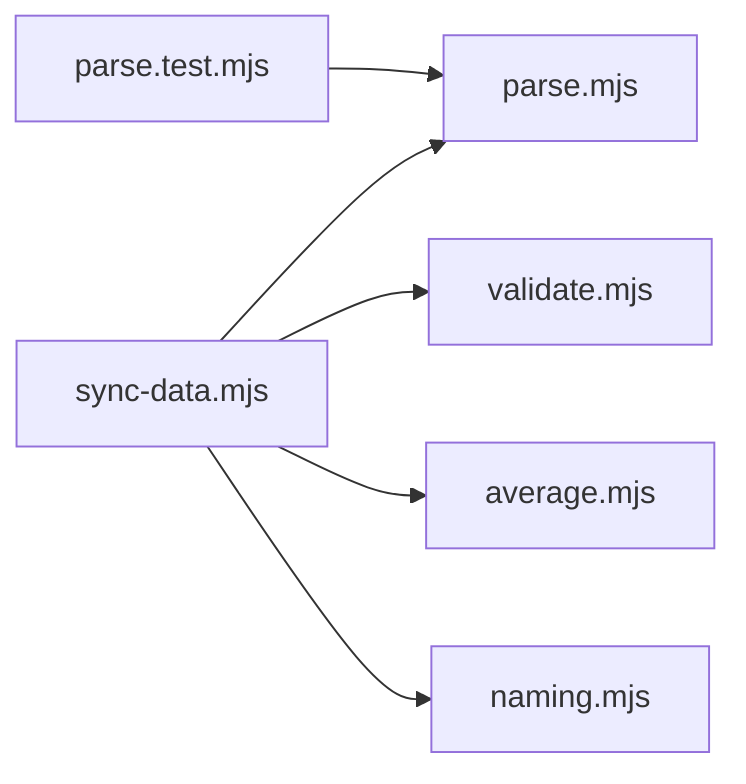

# Parsing Engine

<cite>
**Referenced Files in This Document**
- [parse.mjs](file://scripts/lib/parse.mjs)
- [parse.test.mjs](file://scripts/lib/parse.test.mjs)
- [sync-data.mjs](file://scripts/sync-data.mjs)
- [validate.mjs](file://scripts/lib/validate.mjs)
- [average.mjs](file://scripts/lib/average.mjs)
- [naming.mjs](file://scripts/lib/naming.mjs)
- [DeepSeek_4.1_Flash.md](file://model/claude-opus-4.5/DeepSeek_4.1_Flash.md)
- [average.md](file://model/claude-opus-4.5/average.md)
</cite>

## Table of Contents
1. [Introduction](#introduction)
2. [Project Structure](#project-structure)
3. [Core Components](#core-components)
4. [Architecture Overview](#architecture-overview)
5. [Detailed Component Analysis](#detailed-component-analysis)
6. [Dependency Analysis](#dependency-analysis)
7. [Performance Considerations](#performance-considerations)
8. [Troubleshooting Guide](#troubleshooting-guide)
9. [Conclusion](#conclusion)

## Introduction
This document explains the parsing engine that extracts and validates scoring data from standardized markdown research files, and how it integrates into the broader sync pipeline. The core contract is implemented as side-effect-free helpers in `scripts/lib/parse.mjs`, with deterministic behavior locked by tests in `scripts/lib/parse.test.mjs`. The orchestrator `scripts/sync-data.mjs` adds filesystem I/O, logging, quarantine, registry updates, and generated code emission around these pure functions.

The parser targets a canonical seven-score format:
- Tool use
- Reasoning
- Context window
- Multimodal
- Coding
- Cost efficiency
- Overall Score

Each score is a normalized 1–100 value written as `**Label: N/100.**`. The Overall Score is derived from the five non-cost quality dimensions using half-up rounding to one decimal place. The system also shortens labels for compact client-side representation, detects drift between committed Overall values and their expected derivation, and gates which reports qualify as raters based on the rater’s own average performance.

## Project Structure
The parsing engine lives under `scripts/lib/parse.mjs`. It is consumed by the sync runner and other helpers:

**Diagram sources**
- [parse.mjs:1-124](file://scripts/lib/parse.mjs#L1-L124)
- [sync-data.mjs:34-75](file://scripts/sync-data.mjs#L34-L75)
- [validate.mjs:1-81](file://scripts/lib/validate.mjs#L1-L81)
- [average.mjs:1-101](file://scripts/lib/average.mjs#L1-L101)
- [naming.mjs:1-73](file://scripts/lib/naming.mjs#L1-L73)
- [parse.test.mjs:1-218](file://scripts/lib/parse.test.mjs#L1-L218)
- [DeepSeek_4.1_Flash.md:49-57](file://model/claude-opus-4.5/DeepSeek_4.1_Flash.md#L49-L57)
- [average.md:6-22](file://model/claude-opus-4.5/average.md#L6-L22)

**Section sources**
- [parse.mjs:1-124](file://scripts/lib/parse.mjs#L1-L124)
- [sync-data.mjs:1-75](file://scripts/sync-data.mjs#L1-L75)

## Core Components
- Canonical label order and short keys:
  - `LABELS`: ordered list of seven score labels.
  - `SHORT`: mapping from long labels to short keys used in generated client data.
  - `QUALITY_DIMS`: the five non-cost dimensions that contribute to Overall.
- Constants:
  - `RATER_GATE`: minimum average Overall required to be a reliable rater.
  - `OVERALL_TOLERANCE`: allowed deviation before auto-correct triggers.
  - `halfUp1`: half-up rounding to one decimal place.
- Parsers and validators:
  - `parseScoresPure(md)`: extracts seven normalized scores from markdown.
  - `shortenScores(scores)`: maps long labels to short keys.
  - `overallDrift(scores, tolerance)`: computes mean, corrected value, and drift flag.
  - `applyOverallFix(content, corrected)`: rewrites only the Overall line when possible.
- Cohort utilities:
  - `meanOf(cohort, label)`: half-up mean over a cohort.
  - `rankTop10(eligible)`: top ten by Overall Score.
  - `partitionEligible(perFile, resolveSlug, raterOwn, gate)`: rater-gate filtering.
  - `sortLabelsAZ(labels)`: case-insensitive A-Z sort for agreement notes.

**Section sources**
- [parse.mjs:8-45](file://scripts/lib/parse.mjs#L8-L45)
- [parse.mjs:47-124](file://scripts/lib/parse.mjs#L47-L124)
- [parse.test.mjs:23-37](file://scripts/lib/parse.test.mjs#L23-L37)

## Architecture Overview
The sync pipeline uses the parsing engine as its pure core:

**Diagram sources**
- [sync-data.mjs:119-126](file://scripts/sync-data.mjs#L119-L126)
- [sync-data.mjs:347-370](file://scripts/sync-data.mjs#L347-L370)
- [sync-data.mjs:406-435](file://scripts/sync-data.mjs#L406-L435)
- [parse.mjs:52-87](file://scripts/lib/parse.mjs#L52-L87)
- [average.mjs:58-81](file://scripts/lib/average.mjs#L58-L81)

## Detailed Component Analysis

### parseScoresPure: Extracting Seven Normalized Scores
`parseScoresPure` scans the markdown for exactly seven labeled lines in canonical order. Each line must match the pattern:
- `**Label: <number>/100.**`

It returns:
- Success: `{ ok: true, scores }` where `scores` contains all seven labels mapped to numeric values.
- Failure: `{ ok: false, missingLabel }` indicating the first missing label.

Validation rules enforced by the function and tests:
- All seven labels must be present; otherwise, parsing fails immediately at the first missing label.
- Floats with up to one decimal are accepted.
- Lookalike lines elsewhere in the document (e.g., Agreement notes) are ignored; only exact label matches count.

Valid example structure (from a real findings file):
- Lines such as `- **Tool use: 93/100.** ...` through `- **Overall Score: 82.2/100.** ...` appear under the “Normalized scores” section.

Invalid examples include:
- Missing any of the seven labels.
- Non-standard label text or missing `/100` suffix.
- Extra decimals beyond one decimal place (the regex accepts digits and a single dot; tests assert float handling).

Error handling strategy:
- The pure function does not log or mutate state; it returns a structured result.
- The sync layer wraps this with FAIL logging and aborts further processing for that file when parsing fails.

**Section sources**
- [parse.mjs:47-60](file://scripts/lib/parse.mjs#L47-L60)
- [parse.test.mjs:39-63](file://scripts/lib/parse.test.mjs#L39-L63)
- [DeepSeek_4.1_Flash.md:49-57](file://model/claude-opus-4.5/DeepSeek_4.1_Flash.md#L49-L57)

### Shortening Functions for Compact Representation
`shortenScores` maps each long label to a short key used in generated client data:
- Tool use → tool
- Reasoning → reasoning
- Context window → context
- Multimodal → multimodal
- Coding → coding
- Cost efficiency → cost
- Overall Score → overall

This ensures the client bundle receives compact numeric-only objects rather than full markdown prose.

**Section sources**
- [parse.mjs:19-28](file://scripts/lib/parse.mjs#L19-L28)
- [parse.mjs:62-67](file://scripts/lib/parse.mjs#L62-L67)
- [parse.test.mjs:119-137](file://scripts/lib/parse.test.mjs#L119-L137)

### Overall Score Calculation and Drift Detection
The Overall Score is derived as the half-up mean of the five non-cost quality dimensions:
- Tool use
- Reasoning
- Context window
- Multimodal
- Coding

Cost efficiency is scored but excluded from the Overall calculation.

`overallDrift` computes:
- `mean5`: arithmetic mean of the five quality dimensions.
- `corrected`: half-up rounded mean to one decimal.
- `drifted`: boolean indicating whether the committed Overall differs from the expected mean beyond `OVERALL_TOLERANCE`.

Auto-correction:
- If drifted and the Overall line is auto-fixable, `applyOverallFix` rewrites only the Overall number.
- If not auto-fixable, the sync layer logs a FAIL and skips rewriting the folder’s average.

Tolerance:
- `OVERALL_TOLERANCE = 0.51` allows small rounding differences without triggering correction.

Examples:
- No drift when Overall equals the 5-dim mean.
- No drift within tolerance (e.g., 80 vs 80.5).
- Drift flagged when difference exceeds tolerance (e.g., 80 vs 90).

**Section sources**
- [parse.mjs:30-45](file://scripts/lib/parse.mjs#L30-L45)
- [parse.mjs:69-87](file://scripts/lib/parse.mjs#L69-L87)
- [parse.test.mjs:65-117](file://scripts/lib/parse.test.mjs#L65-L117)
- [sync-data.mjs:347-370](file://scripts/sync-data.mjs#L347-L370)

### Rater Gate Functionality
Only reports authored by models whose own committed average Overall exceeds `RATER_GATE` count toward another model’s average. Qualification is strict greater-than (`>`), so exactly 84.9 does not qualify.

Mechanism:
- The sync runner reads each model’s `average.md` to determine the rater’s own Overall.
- For each findings file, the runner resolves the author slug via the source registry and naming helpers.
- `partitionEligible` filters eligible files and records ignored labels for reporting.

Fallback rule:
- If no raters clear the gate, the folder still gets an average computed from all available reports (top-10 cap applies within the eligible set).

**Section sources**
- [parse.mjs:38-42](file://scripts/lib/parse.mjs#L38-L42)
- [parse.mjs:99-117](file://scripts/lib/parse.mjs#L99-L117)
- [parse.test.mjs:173-200](file://scripts/lib/parse.test.mjs#L173-L200)
- [sync-data.mjs:211-226](file://scripts/sync-data.mjs#L211-L226)
- [sync-data.mjs:372-398](file://scripts/sync-data.mjs#L372-L398)

### Relationship Between Parsed Scores and the Broader Sync Pipeline
The sync runner performs these steps:
1. Scans model folders for findings files, excluding averages and READMEs.
2. Parses scores using `parseScoresPure`; failures are logged and block average computation for that folder.
3. Validates filenames and meta.json fields.
4. Applies Overall drift correction when possible.
5. Partitions eligible reports using the rater gate.
6. Computes top-10 cohort and recomputes `average.md`.
7. Updates the source registry and emits compact scores to `src/data/scores.generated.ts`.

Generated outputs:
- `src/data/sources.generated.ts`: SourceKey union and SOURCE_DEFS entries.
- `src/data/scores.generated.ts`: Compact numeric-only scores per slug/file.

**Section sources**
- [sync-data.mjs:1-30](file://scripts/sync-data.mjs#L1-L30)
- [sync-data.mjs:119-126](file://scripts/sync-data.mjs#L119-L126)
- [sync-data.mjs:288-338](file://scripts/sync-data.mjs#L288-L338)
- [sync-data.mjs:438-523](file://scripts/sync-data.mjs#L438-L523)

## Dependency Analysis
The parsing engine has minimal dependencies and is designed to be side-effect free:

**Diagram sources**
- [parse.mjs:1-6](file://scripts/lib/parse.mjs#L1-L6)
- [sync-data.mjs:34-75](file://scripts/sync-data.mjs#L34-L75)

Coupling and cohesion:
- `parse.mjs` is cohesive around parsing, shortening, drift detection, and cohort utilities.
- `sync-data.mjs` coordinates filesystem operations, quarantine, registry management, and code generation around the pure helpers.
- `validate.mjs` provides filename and metadata validation logic imported by both sync and parse modules.
- `average.mjs` depends on `parse.mjs` for label constants and mean computation.
- `naming.mjs` provides slug/key/label resolution used by sync and rater gating.

External integration points:
- Git tree inspection for permanence tripwire.
- Filesystem reads/writes for findings files, averages, and generated TypeScript.
- Registry reconciliation in `sources.generated.ts`.

**Section sources**
- [parse.mjs:1-124](file://scripts/lib/parse.mjs#L1-L124)
- [sync-data.mjs:34-75](file://scripts/sync-data.mjs#L34-L75)
- [validate.mjs:1-81](file://scripts/lib/validate.mjs#L1-L81)
- [average.mjs:1-101](file://scripts/lib/average.mjs#L1-L101)
- [naming.mjs:1-73](file://scripts/lib/naming.mjs#L1-L73)

## Performance Considerations
- Pure functions avoid I/O and side effects, enabling fast unit testing and deterministic behavior.
- The sync runner processes files sequentially per folder; large repositories may benefit from parallelization at the folder level, though current design prioritizes determinism and simplicity.
- Generated output avoids bundling full markdown into the client by emitting compact numeric scores, reducing bundle size significantly.

[No sources needed since this section provides general guidance]

## Troubleshooting Guide
Common issues and resolutions:
- Missing score line:
  - Symptom: `FAIL model/<slug>/<file>: missing "- **<Label>: <N>/100" score line`.
  - Cause: One of the seven canonical labels is absent.
  - Resolution: Add the missing line in the correct format.

- Overall drift not auto-fixable:
  - Symptom: `FAIL model/<slug>/<file>: Overall drifted but score line not auto-fixable — hand-fix it`.
  - Cause: The Overall line exists but cannot be matched by the rewrite regex.
  - Resolution: Ensure the Overall line follows the canonical format.

- Hygiene violations:
  - Symptom: Filename errors or missing required meta.json fields.
  - Cause: Filenames contain disallowed characters or meta.json lacks required fields.
  - Resolution: Rename files to match allowed patterns and fill in required meta.json fields.

- Rater gate exclusions:
  - Symptom: Reports ignored due to below-gate raters.
  - Cause: Author model’s average Overall is not strictly above `RATER_GATE`.
  - Resolution: Improve the rater’s own average or rely on fallback averaging.

**Section sources**
- [sync-data.mjs:119-126](file://scripts/sync-data.mjs#L119-L126)
- [sync-data.mjs:354-370](file://scripts/sync-data.mjs#L354-L370)
- [validate.mjs:54-80](file://scripts/lib/validate.mjs#L54-L80)

## Conclusion
The parsing engine provides a robust, test-locked contract for extracting and validating normalized scores from markdown research files. Its pure functions ensure predictable behavior, while the sync pipeline adds necessary orchestration for filesystem operations, quarantine, registry updates, and generated code emission. The Overall Score derivation, drift detection, shortening utilities, and rater gate collectively maintain data integrity and support reliable cross-model comparisons.

[No sources needed since this section summarizes without analyzing specific files]