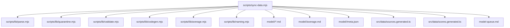
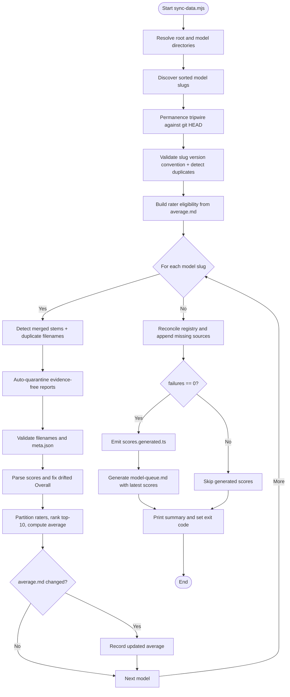
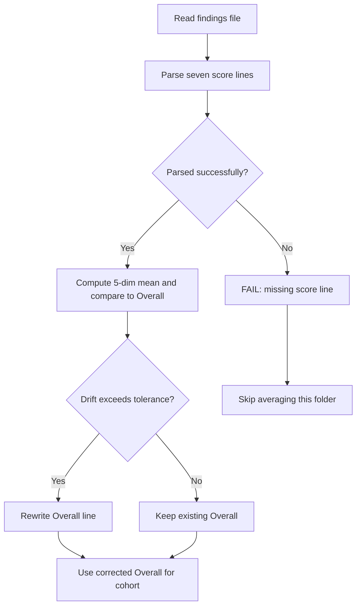
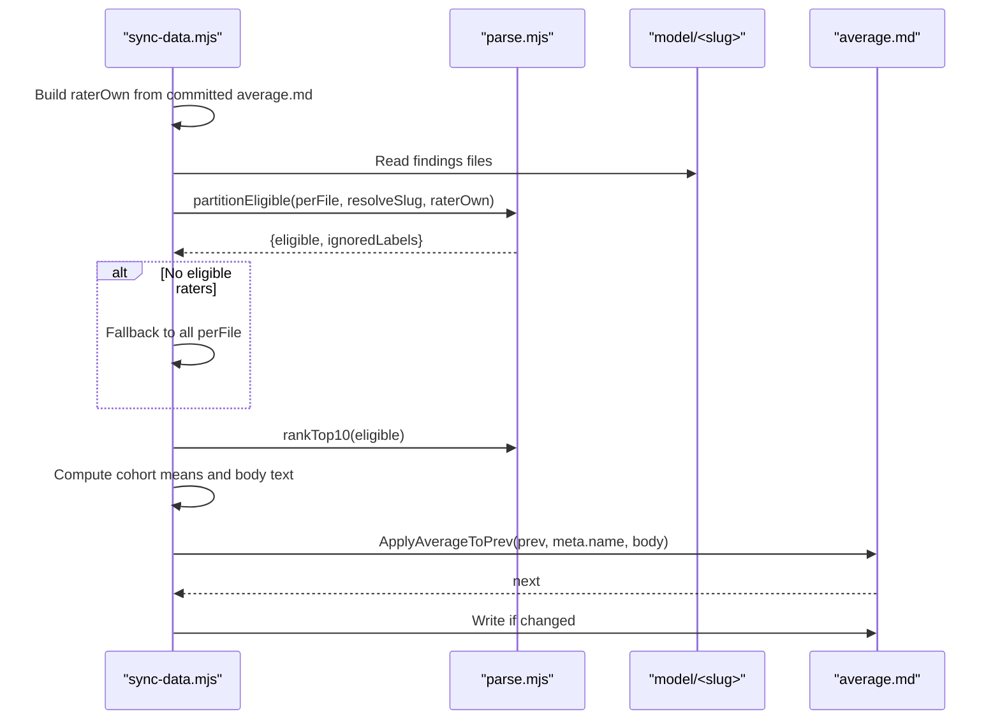
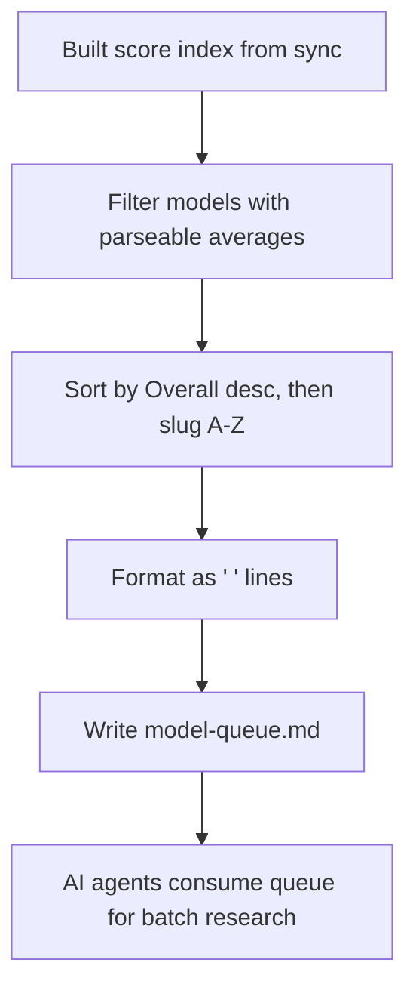
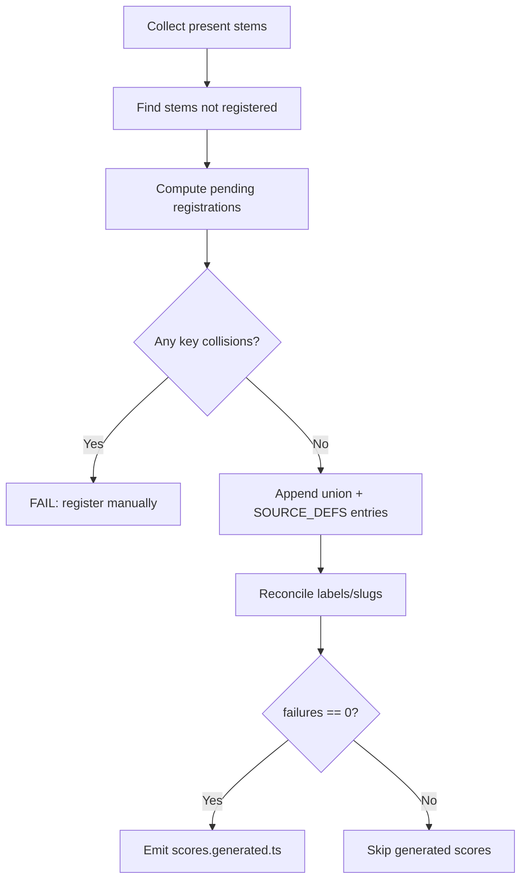
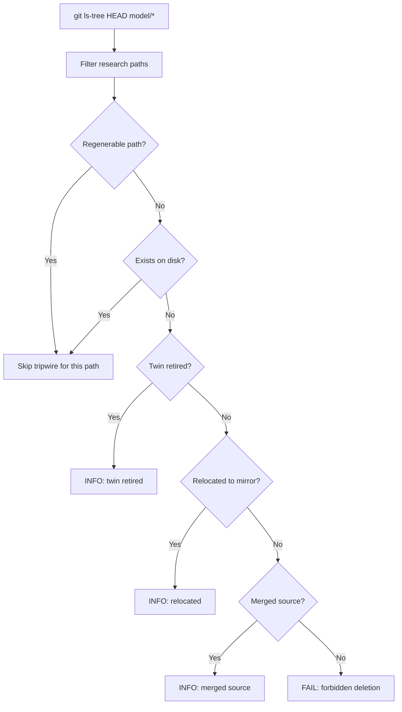
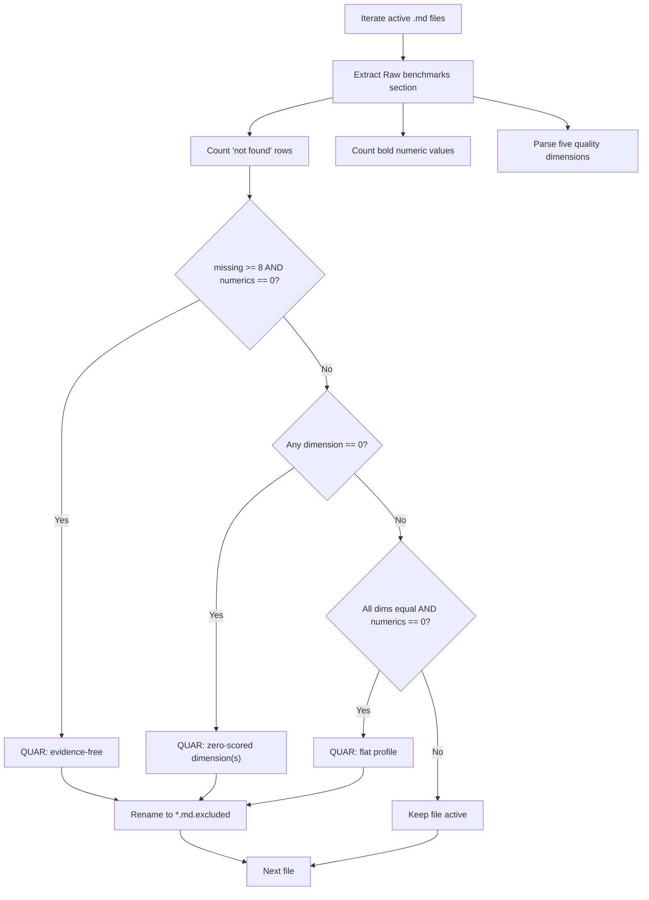
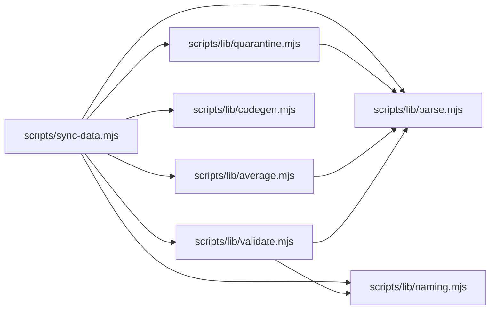

# Sync Script Overview

<cite>
**Referenced Files in This Document**
- [sync-data.mjs](file://scripts/sync-data.mjs)
- [parse.mjs](file://scripts/lib/parse.mjs)
- [quarantine.mjs](file://scripts/lib/quarantine.mjs)
- [validate.mjs](file://scripts/lib/validate.mjs)
- [codegen.mjs](file://scripts/lib/codegen.mjs)
- [average.mjs](file://scripts/lib/average.mjs)
- [naming.mjs](file://scripts/lib/naming.mjs)
- [debug-sync.mjs](file://scripts/debug-sync.mjs)
- [model-queue.md](file://model-queue.md)
</cite>

## Update Summary
**Changes Made**
- Updated architecture overview to reflect enhanced validation rules and merged source stem handling
- Added detailed documentation for the new model queue generation system
- Enhanced quarantine mechanism explanation with improved evidence-free detection
- Updated file scanning process to include new validation rules for duplicate slugs and stems
- Added comprehensive troubleshooting guidance for merged source conflicts and validation failures
- Updated dependency analysis to include the new naming.mjs module

## Table of Contents
1. [Introduction](#introduction)
2. [Project Structure](#project-structure)
3. [Core Components](#core-components)
4. [Architecture Overview](#architecture-overview)
5. [Detailed Component Analysis](#detailed-component-analysis)
6. [Dependency Analysis](#dependency-analysis)
7. [Performance Considerations](#performance-considerations)
8. [Troubleshooting Guide](#troubleshooting-guide)
9. [Conclusion](#conclusion)

## Introduction
The main sync script is the deterministic entry point for the modelcomp data synchronization pipeline. It scans research markdown files under `model/<slug>/`, validates and normalizes scores, recomputes per-model averages, registers new reporting sources, and emits TypeScript artifacts consumed by the application. Its purpose is to keep generated code consistent with human-authored research while preventing accidental deletion or corruption of evidence.

Key responsibilities:
- Scan every model directory and findings file with enhanced validation rules.
- Parse seven normalized 1–100 scores from each report with improved drift detection.
- Auto-correct drifted Overall values derived from quality dimensions.
- Quarantine evidence-free reports before they can affect averages using enhanced criteria.
- Recompute and rewrite `average.md` using a top-10 cohort and rater gate.
- Maintain the source registry and emit compact score indexes.
- Generate a pre-sorted research queue (`model-queue.md`) for AI agents with latest benchmark scores.
- Handle merged source stems and duplicate slug detection with sophisticated conflict resolution.
- Exit non-zero when human action is required.

## Project Structure
The sync script lives at `scripts/sync-data.mjs` and delegates pure logic to helper modules under `scripts/lib/`. The repository's research data is organized as:
- `model/<slug>/`: one folder per model slug, containing findings `.md` files, an `average.md`, and a `meta.json`.
- `models_voice/` and `models_finance/`: sanctioned mirror trees where research may be relocated without breaking the permanence tripwire.
- `src/data/sources.generated.ts`: the source registry used by the app.
- `src/data/scores.generated.ts`: compact numeric scores emitted by sync.
- `model-queue.md`: pre-sorted research queue for AI agents with latest benchmark scores.

**Diagram sources**
- [sync-data.mjs:30-90](file://scripts/sync-data.mjs#L30-L90)
- [sync-data.mjs:166-170](file://scripts/sync-data.mjs#L166-L170)
- [sync-data.mjs:667-714](file://scripts/sync-data.mjs#L667-L714)

**Section sources**
- [sync-data.mjs:1-31](file://scripts/sync-data.mjs#L1-L31)
- [sync-data.mjs:166-170](file://scripts/sync-data.mjs#L166-L170)

## Core Components
The sync script composes several focused helpers:

- Parsing and scoring (`scripts/lib/parse.mjs`)
  - Defines canonical labels, short keys, quality dimensions, rater gate threshold, drift tolerance, and rounding behavior.
  - Parses seven score lines, computes Overall drift, applies auto-fixes, ranks top-10 cohorts, partitions eligible raters, and sorts labels deterministically.

- Quarantine policy (`scripts/lib/quarantine.mjs`)
  - Detects evidence-free reports by counting "no verified public score found" rows and measured numbers in the raw benchmarks section.
  - Also flags zero-scored or flat dimension profiles that indicate invented uniformity.

- Validation and hygiene (`scripts/lib/validate.mjs`)
  - Enforces filename hygiene, required `meta.json` fields, display-name rules, and git-tracked file permanence.
  - Classifies missing tracked files as twin-retired, relocated, or deleted.
  - Handles merged source stems and duplicate slug detection with sophisticated conflict resolution.

- Code generation and registry surgery (`scripts/lib/codegen.mjs`)
  - Parses and rebuilds the SourceKey union and SOURCE_DEFS array.
  - Appends pending registrations, reconciles labels/slugs, prunes virtual-view entries, and renders deterministic `scores.generated.ts`.

- Average computation and queue building (`scripts/lib/average.mjs`)
  - Builds average entries, generates average body text, and creates the research queue file.
  - Implements the `buildQueueFile` function that generates `model-queue.md` with models sorted by latest Overall scores.

- Naming conventions (`scripts/lib/naming.mjs`)
  - Provides slug normalization, stem validation, vendor prefix detection, and display label formatting.
  - Handles hyphen-version violations, underscore-version violations, and vendor-prefix conflicts.

- Debugging helper (`scripts/debug-sync.mjs`)
  - Runs the sync script and prints FAIL lines for quick triage.

**Section sources**
- [parse.mjs:8-45](file://scripts/lib/parse.mjs#L8-L45)
- [parse.mjs:52-97](file://scripts/lib/parse.mjs#L52-L97)
- [parse.mjs:105-123](file://scripts/lib/parse.mjs#L105-L123)
- [quarantine.mjs:11-55](file://scripts/lib/quarantine.mjs#L11-L55)
- [validate.mjs:11-52](file://scripts/lib/validate.mjs#L11-L52)
- [validate.mjs:54-80](file://scripts/lib/validate.mjs#L54-L80)
- [codegen.mjs:14-83](file://scripts/lib/codegen.mjs#L14-L83)
- [codegen.mjs:92-139](file://scripts/lib/codegen.mjs#L92-L139)
- [average.mjs:102-121](file://scripts/lib/average.mjs#L102-L121)
- [naming.mjs:42-101](file://scripts/lib/naming.mjs#L42-L101)
- [debug-sync.mjs:1-7](file://scripts/debug-sync.mjs#L1-L7)

## Architecture Overview
At runtime, the sync script performs these phases in order:

1. Resolve root paths and import helpers.
2. Discover model slugs and log counts.
3. Run the permanence tripwire against git HEAD (unless bypassed).
4. Validate slug version conventions and detect duplicate slugs.
5. Build rater eligibility from committed average Overalls.
6. For each model folder:
   - Detect and handle merged source stems and duplicate filenames.
   - Auto-quarantine evidence-free reports with enhanced criteria.
   - Skip self-excluded files.
   - Validate filenames and meta.json with improved validation rules.
   - Parse scores, fix drifted Overalls, and build a compact score index.
   - Partition eligible raters, rank top-10, compute averages, and rewrite `average.md` if needed.
7. Reconcile the source registry and append missing sources.
8. Emit deterministic `scores.generated.ts` only when there are no failures.
9. Generate `model-queue.md` with pre-sorted models by latest Overall scores.
10. Print summary and set exit code.

**Diagram sources**
- [sync-data.mjs:77-131](file://scripts/sync-data.mjs#L77-L131)
- [sync-data.mjs:145-178](file://scripts/sync-data.mjs#L145-L178)
- [sync-data.mjs:190-226](file://scripts/sync-data.mjs#L190-L226)
- [sync-data.mjs:259-436](file://scripts/sync-data.mjs#L259-L436)
- [sync-data.mjs:442-526](file://scripts/sync-data.mjs#L442-L526)
- [sync-data.mjs:623-639](file://scripts/sync-data.mjs#L623-L639)

## Detailed Component Analysis

### Command-Line Options and Environment Variables
- Quiet mode: `--quiet` or `-q` suppresses per-folder informational logs while preserving all checks, file writes, and exit codes.
- Deletion bypass: `ALLOW_MODEL_DELETE=1` or `true` disables the permanence tripwire that would otherwise fail on missing git-tracked research files.

Behavioral notes:
- Quiet mode does not relax validation; it only reduces console noise.
- The deletion bypass is explicit and must be set by the user; it does not make deletions safe — it only skips the tripwire check.

**Section sources**
- [sync-data.mjs:144-150](file://scripts/sync-data.mjs#L144-L150)
- [sync-data.mjs:195-200](file://scripts/sync-data.mjs#L195-L200)

### Exit Codes
- Exit code `0`: pipeline completed successfully; averages may have been rewritten, but no failures were recorded.
- Non-zero exit code: one or more failures occurred; generated scores are intentionally skipped until issues are resolved.

The script accumulates failure messages and sets `process.exitCode` based on the final count.

**Section sources**
- [sync-data.mjs:29-30](file://scripts/sync-data.mjs#L29-L30)
- [sync-data.mjs:152-156](file://scripts/sync-data.mjs#L152-L156)
- [sync-data.mjs:722-724](file://scripts/sync-data.mjs#L722-L724)

### Determinism and Data Consistency
Determinism is enforced through:
- Sorted discovery of model slugs and filenames.
- Stable label sorting for cohort lists.
- Top-10 ranking by Overall Score.
- Half-up rounding to one decimal place for averages and corrected Overalls.
- Deterministic serialization of `sources.generated.ts` and `scores.generated.ts`.
- Avoiding client-side bundle bloat by emitting only numeric scores into generated TypeScript.
- Pre-sorted research queue generation with consistent ordering.
- Enhanced validation rules that prevent duplicate slugs and merged source stems.

These guarantees ensure that repeated runs over the same inputs produce identical outputs and that builds remain reproducible.

**Section sources**
- [sync-data.mjs:166-170](file://scripts/sync-data.mjs#L166-L170)
- [sync-data.mjs:387-394](file://scripts/sync-data.mjs#L387-L394)
- [sync-data.mjs:490-509](file://scripts/sync-data.mjs#L490-L509)
- [parse.mjs:44-45](file://scripts/lib/parse.mjs#L44-L45)
- [parse.mjs:90-97](file://scripts/lib/parse.mjs#L90-L97)
- [codegen.mjs:107-139](file://scripts/lib/codegen.mjs#L107-L139)

### File Scanning and Directory Requirements
Enhanced scanning process:
- Reads `model/` and filters subdirectories.
- Ignores `average.md` and `README.md`.
- Treats any filename containing `.excluded` as self-excluded evidence-free reports.
- Validates filenames against allowed characters.
- Requires `meta.json` per model folder; missing files are scaffolded with placeholder metadata and warnings.
- Detects and handles merged source stems (e.g., `Laguna_XS_2_1` → `Laguna_XS_2.1`).
- Identifies duplicate slugs and vendor-prefixed variants that should be merged.

Directory structure requirements:
- Each model folder should contain:
  - One or more findings `.md` files with seven normalized score lines.
  - An `average.md` computed from eligible sources.
  - A `meta.json` with required fields and a valid vendor display name.

Mirror trees:
- `models_voice/` and `models_finance/` are sanctioned relocation targets. If a tracked file is missing from `model/` but exists under a mirror tree, the run logs relocation instead of failing.

**Section sources**
- [sync-data.mjs:166-170](file://scripts/sync-data.mjs#L166-L170)
- [sync-data.mjs:358-435](file://scripts/sync-data.mjs#L358-L435)
- [sync-data.mjs:446-486](file://scripts/sync-data.mjs#L446-L486)
- [validate.mjs:11-20](file://scripts/lib/validate.mjs#L11-L20)
- [validate.mjs:40-44](file://scripts/lib/validate.mjs#L40-L44)
- [validate.mjs:54-80](file://scripts/lib/validate.mjs#L54-L80)

### Score Parsing and Overall Correction
Each findings file must include seven normalized 1–100 scores:
- Tool use
- Reasoning
- Context window
- Multimodal
- Coding
- Cost efficiency
- Overall Score

Overall is derived from the five quality dimensions (Cost excluded). If the stored Overall differs from the half-up mean beyond tolerance, sync rewrites just the Overall line and continues. Unparsable score lines cause a failure and prevent averaging that folder.

**Diagram sources**
- [sync-data.mjs:507-530](file://scripts/sync-data.mjs#L507-L530)
- [parse.mjs:52-87](file://scripts/lib/parse.mjs#L52-L87)

**Section sources**
- [parse.mjs:8-17](file://scripts/lib/parse.mjs#L8-L17)
- [parse.mjs:30-45](file://scripts/lib/parse.mjs#L30-L45)
- [parse.mjs:52-87](file://scripts/lib/parse.mjs#L52-L87)
- [sync-data.mjs:507-530](file://scripts/sync-data.mjs#L507-L530)

### Rater Gate and Average Computation
Averaging uses a two-stage selection:
1. Eligibility: only reports authored by models whose own committed average Overall exceeds the rater gate are included.
2. Top-10 cohort: among eligible reports, the ten highest Overall scores are selected (or all if fewer than ten).

If no raters qualify, sync falls back to averaging all available reports and logs a fallback message. The resulting average is written to `average.md` only when content changes.

**Diagram sources**
- [sync-data.mjs:532-596](file://scripts/sync-data.mjs#L532-L596)
- [parse.mjs:94-117](file://scripts/lib/parse.mjs#L94-L117)

**Section sources**
- [sync-data.mjs:532-596](file://scripts/sync-data.mjs#L532-L596)
- [parse.mjs:38-39](file://scripts/lib/parse.mjs#L38-L39)
- [parse.mjs:94-117](file://scripts/lib/parse.mjs#L94-L117)

### Batch Processing Workflow and Model Queue Organization
**Updated** The sync script now generates a pre-sorted research queue (`model-queue.md`) that serves as the authoritative priority list for AI agents conducting batch research across models.

The queue generation process:
1. Extracts latest Overall scores from the score index (built during sync processing).
2. Filters out models without parseable average entries.
3. Sorts models by Overall Score (highest first) with alphabetical tie-breaking.
4. Generates a clean format: `<Overall> <slug>` per line.
5. Writes the queue file only when there are no failures (same freshness contract as other generated files).

This eliminates the need for AI agents to scan every `average.md` file themselves, providing them with a ready-to-use priority queue for efficient batch processing.

**Diagram sources**
- [sync-data.mjs:683-699](file://scripts/sync-data.mjs#L683-L699)
- [average.mjs:102-121](file://scripts/lib/average.mjs#L102-L121)

**Section sources**
- [sync-data.mjs:683-699](file://scripts/sync-data.mjs#L683-L699)
- [average.mjs:102-121](file://scripts/lib/average.mjs#L102-L121)
- [model-queue.md:1-166](file://model-queue.md#L1-L166)

### Registry and Generated Artifacts
During sync:
- New reporting-source stems are appended to `SourceKey` and `SOURCE_DEFS` in `src/data/sources.generated.ts`.
- Existing entries are reconciled so labels and inline slugs match catalog metadata.
- Virtual-view entries are pruned because they belong in UI code, not the registry.
- `src/data/scores.generated.ts` is emitted only when there are no failures, containing compact numeric scores keyed by slug and filename.

**Diagram sources**
- [sync-data.mjs:598-660](file://scripts/sync-data.mjs#L598-L660)
- [sync-data.mjs:667-682](file://scripts/sync-data.mjs#L667-L682)
- [codegen.mjs:14-83](file://scripts/lib/codegen.mjs#L14-L83)
- [codegen.mjs:92-139](file://scripts/lib/codegen.mjs#L92-L139)

**Section sources**
- [sync-data.mjs:598-660](file://scripts/sync-data.mjs#L598-L660)
- [sync-data.mjs:667-682](file://scripts/sync-data.mjs#L667-L682)
- [codegen.mjs:14-83](file://scripts/lib/codegen.mjs#L14-L83)
- [codegen.mjs:92-139](file://scripts/lib/codegen.mjs#L92-L139)

### Permanence Tripwire and Deletion Safety
The script compares git HEAD against disk to detect missing tracked research files. Exceptions:
- Twin retirement: `.md.excluded` is gone but its fresh `.md` sibling exists.
- Relocation: the file exists under a sanctioned mirror tree.
- Regenerable files like `average.md` and `README.md` are exempt.
- Merged source stems: canonical siblings exist after user-ordered merges.

Without `ALLOW_MODEL_DELETE`, missing tracked files trigger a loud failure with instructions to restore them. With the environment variable set, the tripwire is skipped.

**Diagram sources**
- [sync-data.mjs:195-240](file://scripts/sync-data.mjs#L195-L240)
- [validate.mjs:18-52](file://scripts/lib/validate.mjs#L18-L52)

**Section sources**
- [sync-data.mjs:195-240](file://scripts/sync-data.mjs#L195-L240)
- [validate.mjs:18-52](file://scripts/lib/validate.mjs#L18-L52)

### Enhanced Quarantine Mechanism for Evidence-Free Reports
Before parsing, sync inspects each active findings file and renames it to `.md.excluded` when it meets enhanced quarantine criteria:
- Evidence-free: eight or more "no verified public score found" rows and zero measured numbers.
- Zero-scored: any quality dimension parsed as zero.
- Flat profile: all five quality dimensions identical and zero measured numbers.

The enhanced validation includes improved detection of invented uniformity patterns and better handling of edge cases in benchmark sections.

**Diagram sources**
- [sync-data.mjs:399-419](file://scripts/sync-data.mjs#L399-L419)
- [quarantine.mjs:11-55](file://scripts/lib/quarantine.mjs#L11-L55)

**Section sources**
- [sync-data.mjs:399-419](file://scripts/sync-data.mjs#L399-L419)
- [quarantine.mjs:11-55](file://scripts/lib/quarantine.mjs#L11-L55)

### Enhanced Validation Rules for Duplicate Detection
**Updated** The sync script now includes sophisticated validation rules for detecting and handling duplicate model structures:

- **Merged Source Stems**: Detects when findings-file stems have been merged (e.g., `Laguna_XS_2_1` → `Laguna_XS_2.1`) and prevents resurrection of deleted duplicates.
- **Duplicate Slugs**: Identifies slug variants that should be merged into canonical folders (e.g., `google-gemini-2.5-flash-lite` → `gemini-2.5-flash-lite`).
- **Vendor Prefix Detection**: Prevents creation of vendor-prefixed duplicates (e.g., `openai-gpt-5` when `gpt-5` already exists).
- **Hyphen-Version Validation**: Ensures slug versions use dots instead of hyphens between digits.
- **Stem Version Validation**: Ensures findings-file stems use dots instead of underscores between version digits.

These rules prevent silent double-counting of raters and maintain data integrity across the research pipeline.

**Section sources**
- [sync-data.mjs:259-293](file://scripts/sync-data.mjs#L259-L293)
- [sync-data.mjs:370-398](file://scripts/sync-data.mjs#L370-L398)
- [validate.mjs:23-60](file://scripts/lib/validate.mjs#L23-L60)
- [naming.mjs:42-101](file://scripts/lib/naming.mjs#L42-L101)

## Dependency Analysis
The sync script depends on five pure helper modules:

Coupling characteristics:
- `sync-data.mjs` is the orchestrator and owns filesystem and child-process interactions.
- Helper modules are side-effect free and testable in isolation.
- `quarantine.mjs` depends on `parse.mjs` for quality dimension definitions.
- `validate.mjs` imports filename and metadata constants from `parse.mjs` and naming utilities from `naming.mjs`.
- `average.mjs` depends on `parse.mjs` for scoring constants and functions.
- `codegen.mjs` is independent of other helpers and focuses on text surgery and serialization.
- `naming.mjs` provides core naming and validation utilities used by multiple components.

Potential risks:
- Circular dependencies are avoided by keeping helpers pure and importing only constants or small functions.
- External coupling is limited to Node.js built-ins and `git` for the tripwire.

**Diagram sources**
- [sync-data.mjs:30-90](file://scripts/sync-data.mjs#L30-L90)
- [quarantine.mjs:9](file://scripts/lib/quarantine.mjs#L9)
- [validate.mjs:9-10](file://scripts/lib/validate.mjs#L9-L10)
- [average.mjs:10](file://scripts/lib/average.mjs#L10)

**Section sources**
- [sync-data.mjs:30-90](file://scripts/sync-data.mjs#L30-L90)
- [quarantine.mjs:9](file://scripts/lib/quarantine.mjs#L9)
- [validate.mjs:9-10](file://scripts/lib/validate.mjs#L9-L10)
- [average.mjs:10](file://scripts/lib/average.mjs#L10)

## Performance Considerations
- The script avoids bundling full markdown reports into the client by emitting only numeric scores.
- Sorting and deterministic serialization reduce diff noise and improve reproducibility.
- The rater gate and top-10 cohort limit the number of reports contributing to averages.
- Quiet mode reduces console overhead during large runs without changing behavior.
- Pre-sorted model queue eliminates redundant scanning of average.md files by AI agents.
- Batch processing workflow enables efficient parallel research across multiple models.
- Enhanced validation rules add computational overhead but prevent data corruption and double-counting.
- Merged source stem detection prevents expensive re-processing of duplicate files.

## Troubleshooting Guide
Common sync failures and resolutions:

- Missing tracked research file
  - Symptom: FAIL about a file tracked in git HEAD but missing from disk.
  - Resolution: Restore the file from HEAD or relocate it to a sanctioned mirror tree; do not delete research files. Use the provided restore command in the error message.

- Hygiene-violating filename
  - Symptom: FAIL indicating a filename contains disallowed characters.
  - Resolution: Rename the file to match allowed characters (letters, digits, underscore, dots).

- Missing or invalid `meta.json`
  - Symptom: FAIL for missing required fields or underscores in the display name.
  - Resolution: Fill in required fields and replace underscores in `name` with spaces; verify official vendor facts.

- Drifted Overall not auto-fixable
  - Symptom: FAIL stating the Overall drifted but could not be auto-fixed.
  - Resolution: Manually correct the Overall line to match the half-up mean of the five quality dimensions.

- Key collision in registry
  - Symptom: FAIL indicating a stem maps to a label already registered for another file.
  - Resolution: Disambiguate the source names or adjust the registry manually.

- Generated scores skipped
  - Symptom: Log indicates `scores.generated.ts` was not rewritten due to failures.
  - Resolution: Fix reported failures and rerun sync; generated output is withheld until the run succeeds.

- Model queue generation issues
  - Symptom: `model-queue.md` not updated or missing latest scores.
  - Resolution: Check that all models have parseable average entries; ensure sync completes with zero failures; verify the queue file has proper formatting.

- Git HEAD unreadable
  - Symptom: Warning that the tripwire was skipped because git HEAD is unreadable.
  - Resolution: Ensure the repository is initialized and accessible; treat the run as untrusted.

- **New: Merged source stem conflict**
  - Symptom: FAIL indicating a findings-file stem is a duplicate spelling that was merged into another file.
  - Resolution: Merge the newer content into the canonical file (e.g., rename `Laguna_XS_2_1.md` to `Laguna_XS_2.1.md`) and remove the variant.

- **New: Duplicate slug detected**
  - Symptom: FAIL indicating a slug is a duplicate that was merged into another folder.
  - Resolution: Move research files into the canonical folder (e.g., move from `google-gemini-2.5-flash-lite/` to `gemini-2.5-flash-lite/`) and remove the duplicate folder.

- **New: Vendor-prefixed duplicate**
  - Symptom: FAIL indicating a vendor-prefixed slug should use the canonical form without the vendor prefix.
  - Resolution: Remove the leading vendor name from the slug (e.g., rename `openai-gpt-5/` to `gpt-5/`).

- **New: Hyphen-version violation**
  - Symptom: FAIL indicating version numbers should use "." not "-" between digits.
  - Resolution: Rename the folder to use dots (e.g., rename `gpt-5-5/` to `gpt-5.5/`).

- **New: Underscore-version violation**
  - Symptom: FAIL indicating findings-file stems should use "." not "_" between version digits.
  - Resolution: Rename the file to use dots (e.g., rename `Laguna_XS_2_1.md` to `Laguna_XS_2.1.md`).

Debugging tip:
- Use the debug helper to run sync and filter FAIL lines quickly.

**Section sources**
- [sync-data.mjs:195-240](file://scripts/sync-data.mjs#L195-L240)
- [sync-data.mjs:259-293](file://scripts/sync-data.mjs#L259-L293)
- [sync-data.mjs:370-398](file://scripts/sync-data.mjs#L370-L398)
- [sync-data.mjs:446-486](file://scripts/sync-data.mjs#L446-L486)
- [sync-data.mjs:507-530](file://scripts/sync-data.mjs#L507-L530)
- [sync-data.mjs:598-660](file://scripts/sync-data.mjs#L598-L660)
- [sync-data.mjs:667-682](file://scripts/sync-data.mjs#L667-L682)
- [sync-data.mjs:683-699](file://scripts/sync-data.mjs#L683-L699)
- [debug-sync.mjs:1-7](file://scripts/debug-sync.mjs#L1-L7)

## Conclusion
The sync script is the authoritative coordinator for modelcomp's data pipeline. It enforces deterministic processing, protects research evidence, quarantines unreliable reports, and generates stable TypeScript artifacts. The enhanced validation rules provide sophisticated detection of duplicate model structures, merged source stems, and naming convention violations, ensuring data integrity across the research pipeline. The addition of the pre-sorted model queue system provides AI agents with an efficient batch processing workflow, eliminating redundant scanning and enabling systematic research across all models. By combining strict validation, clear failure messaging, controlled automation, intelligent queue management, and enhanced duplicate detection, it keeps the generated application data aligned with human-authored research while minimizing manual maintenance and maximizing agent productivity.