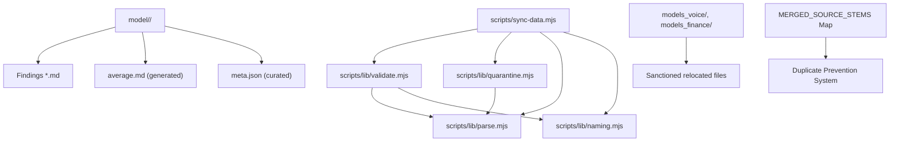
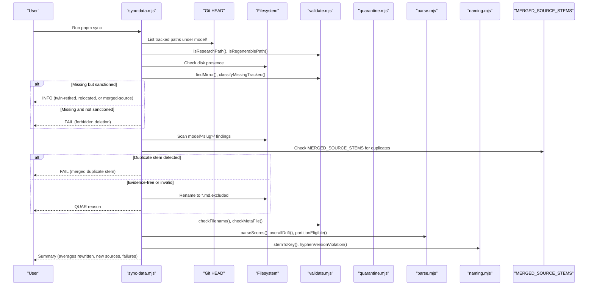
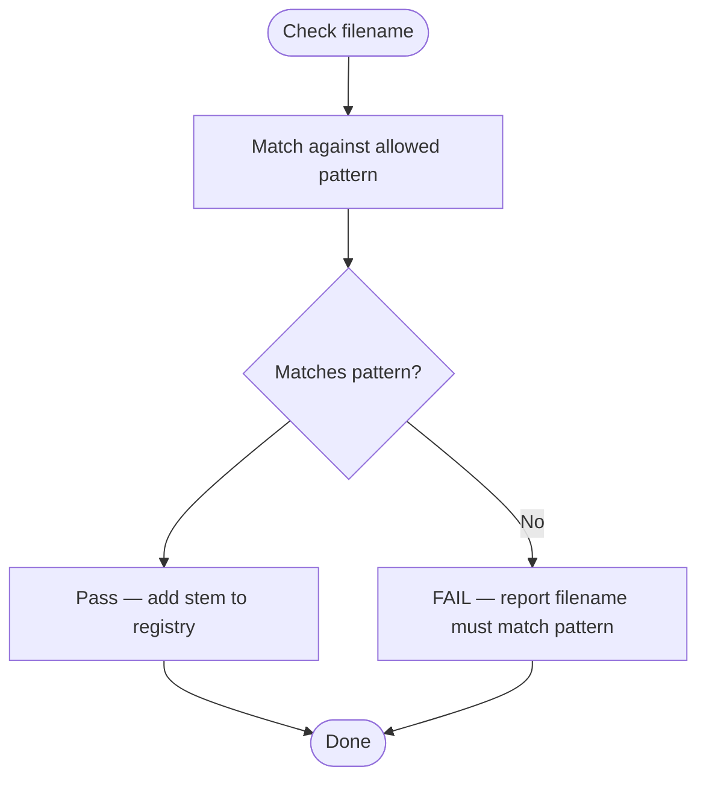
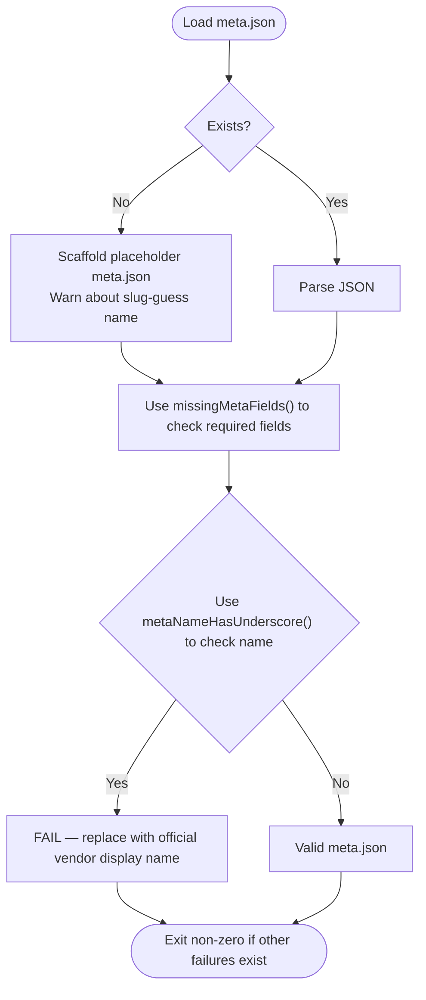
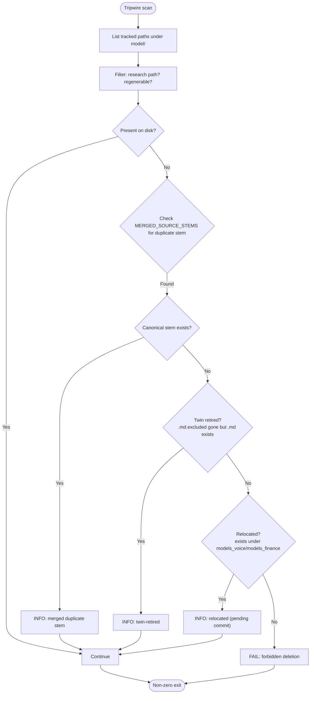
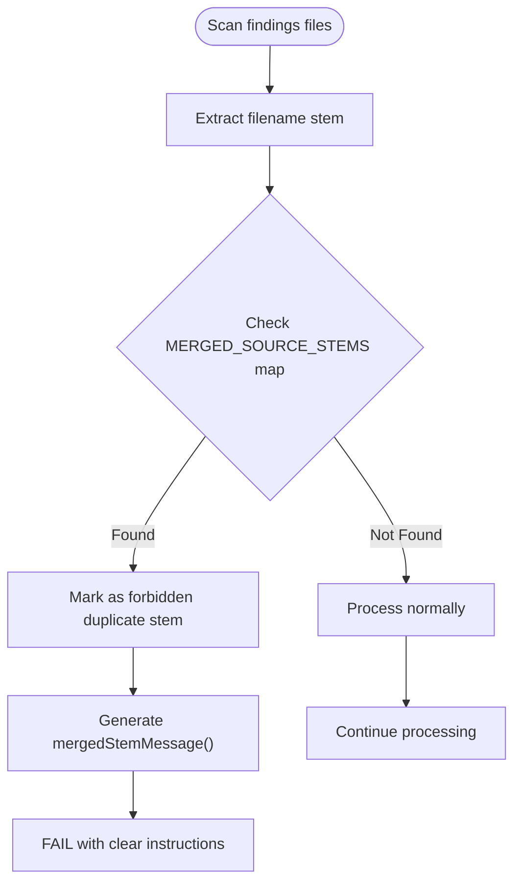
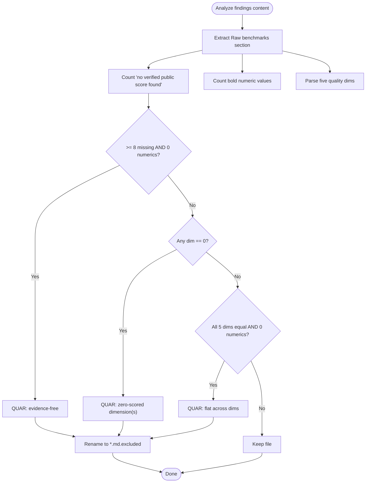
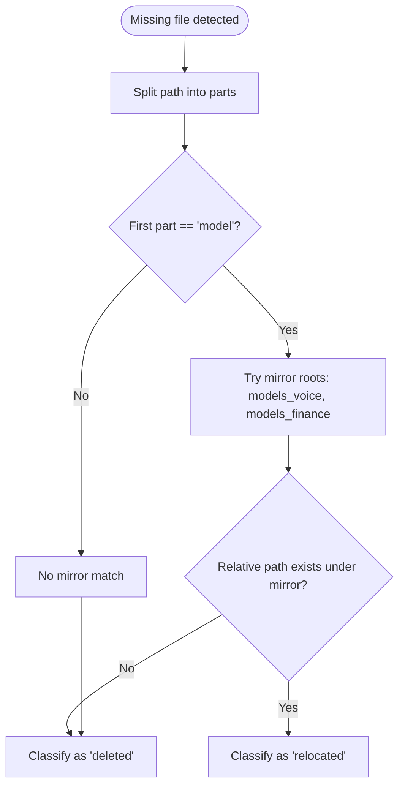
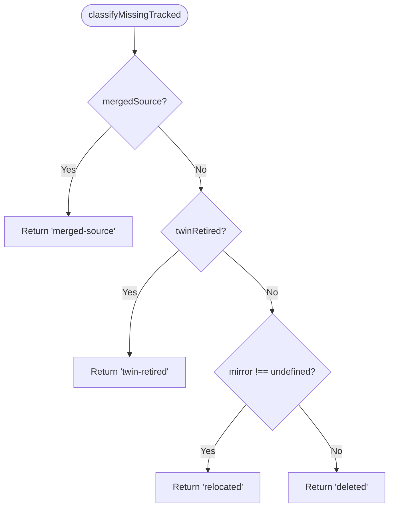
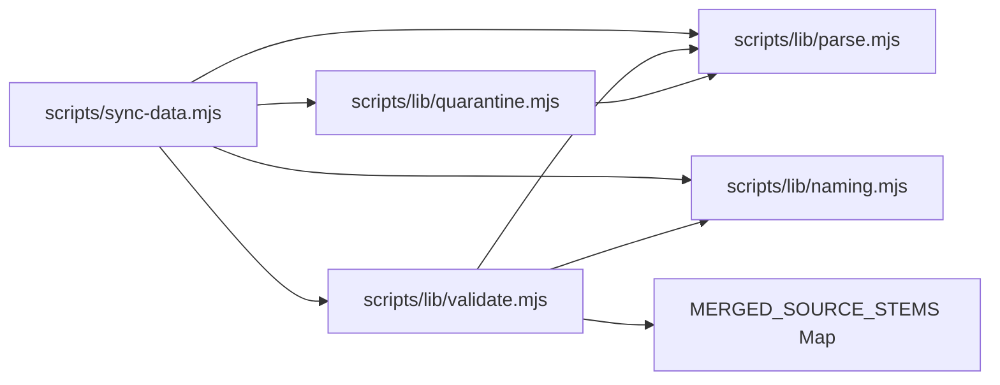

# Validation Framework

<cite>
**Referenced Files in This Document**
- [README.md](file://README.md)
- [model/README.md](file://model/README.md)
- [scripts/sync-data.mjs](file://scripts/sync-data.mjs)
- [scripts/lib/validate.mjs](file://scripts/lib/validate.mjs)
- [scripts/lib/quarantine.mjs](file://scripts/lib/quarantine.mjs)
- [scripts/lib/parse.mjs](file://scripts/lib/parse.mjs)
- [scripts/lib/naming.mjs](file://scripts/lib/naming.mjs)
- [scripts/lib/validate.test.mjs](file://scripts/lib/validate.test.mjs)
- [scripts/lib/naming.test.mjs](file://scripts/lib/naming.test.mjs)
</cite>

## Update Summary
**Changes Made**
- Added comprehensive documentation for merged source stem tracking system with MERGED_SOURCE_STEMS map and mergedStemMessage function
- Updated permanence tripwire section to include merged-source classification
- Enhanced duplicate filename variant prevention documentation
- Added examples of underscore-separated vs dotted version handling
- Updated architecture diagrams to reflect merged stem detection flow

## Table of Contents
1. [Introduction](#introduction)
2. [Project Structure](#project-structure)
3. [Core Components](#core-components)
4. [Architecture Overview](#architecture-overview)
5. [Detailed Component Analysis](#detailed-component-analysis)
6. [Dependency Analysis](#dependency-analysis)
7. [Performance Considerations](#performance-considerations)
8. [Troubleshooting Guide](#troubleshooting-guide)
9. [Conclusion](#conclusion)

## Introduction
This document explains the validation framework that protects data integrity across the model comparison sync pipeline. It covers:

- Filename hygiene checks for research files.
- `meta.json` validation with centralized naming utilities, including required fields and display-name rules.
- The permanence tripwire that prevents accidental deletion of tracked research files.
- **New**: Merged source stem tracking that prevents recreation of deleted duplicate filename variants, addressing cases where underscore-separated versions were permanently deleted in favor of dotted versions.
- The quarantine mechanism that automatically isolates evidence-free reports based on benchmark analysis.
- The mirror root system used for sanctioned file relocations.
- Classification of missing tracked files.
- Sanitization of suspicious filenames.
- Examples of validation failures.
- How the framework maintains consistency while allowing legitimate operations such as twin retirement and relocation.

The sync process is deterministic: it scans model folders, validates inputs, quarantines bad evidence, recomputes averages, registers new sources, and emits generated data only when no failures are present.

## Project Structure
At a high level, the validation framework lives under `scripts/`, with the orchestrator in `scripts/sync-data.mjs` and pure helpers under `scripts/lib/`. Research data lives under `model/<slug>/`, with per-agent findings files, an auto-generated average, and curated metadata.

**Diagram sources**
- [scripts/sync-data.mjs:133-178](file://scripts/sync-data.mjs#L133-L178)
- [scripts/lib/validate.mjs:1-154](file://scripts/lib/validate.mjs#L1-L154)
- [scripts/lib/quarantine.mjs:1-57](file://scripts/lib/quarantine.mjs#L1-L57)
- [scripts/lib/parse.mjs:1-124](file://scripts/lib/parse.mjs#L1-L124)
- [scripts/lib/naming.mjs:1-188](file://scripts/lib/naming.mjs#L1-L188)

**Section sources**
- [README.md:31-44](file://README.md#L31-L44)
- [model/README.md:1-30](file://model/README.md#L1-L30)

## Core Components
The validation framework is composed of focused, side-effect-free helpers invoked by the sync orchestrator:

- **Filename hygiene**: Ensures findings filenames match the allowed pattern.
- **Meta validation**: Enforces required fields and display-name rules using centralized naming utilities.
- **Permanence tripwire**: Prevents silent deletion of git-tracked research files unless they survive in a sanctioned location.
- **Merged source stem tracking**: Prevents recreation of deleted duplicate filename variants through MERGED_SOURCE_STEMS mapping.
- **Quarantine decision**: Automatically renames evidence-free or invalid reports to `.md.excluded`.
- **Mirror roots**: Recognizes relocated files under sanctioned directories.
- **Missing-file classification**: Distinguishes between twin retirement, relocation, merged-source, and forbidden deletion.

These components are imported and orchestrated by `scripts/sync-data.mjs`, which performs filesystem and Git operations and logs outcomes.

**Section sources**
- [scripts/lib/validate.mjs:1-154](file://scripts/lib/validate.mjs#L1-L154)
- [scripts/lib/quarantine.mjs:1-57](file://scripts/lib/quarantine.mjs#L1-L57)
- [scripts/lib/parse.mjs:30-45](file://scripts/lib/parse.mjs#L30-L45)
- [scripts/lib/naming.mjs:36-62](file://scripts/lib/naming.mjs#L36-L62)
- [scripts/sync-data.mjs:133-178](file://scripts/sync-data.mjs#L133-L178)

## Architecture Overview
The sync pipeline applies validation gates before any data generation or registry updates. The flow below maps directly to the source code, including the new merged stem detection.

**Diagram sources**
- [scripts/sync-data.mjs:133-178](file://scripts/sync-data.mjs#L133-L178)
- [scripts/sync-data.mjs:259-286](file://scripts/sync-data.mjs#L259-L286)
- [scripts/sync-data.mjs:288-326](file://scripts/sync-data.mjs#L288-L326)
- [scripts/sync-data.mjs:347-436](file://scripts/sync-data.mjs#L347-L436)
- [scripts/sync-data.mjs:369-398](file://scripts/sync-data.mjs#L369-L398)
- [scripts/lib/validate.mjs:18-52](file://scripts/lib/validate.mjs#L18-L52)
- [scripts/lib/validate.mjs:50-60](file://scripts/lib/validate.mjs#L50-L60)
- [scripts/lib/quarantine.mjs:42-56](file://scripts/lib/quarantine.mjs#L42-L56)
- [scripts/lib/parse.mjs:52-97](file://scripts/lib/parse.mjs#L52-L97)
- [scripts/lib/naming.mjs:11-44](file://scripts/lib/naming.mjs#L11-L44)

## Detailed Component Analysis

### Filename Hygiene Checks
Filename hygiene ensures that findings files use safe, predictable names. The rule allows letters, digits, underscores, and dots, ending in `.md`. Violations fail loudly during sync.

- Allowed pattern: letters, digits, underscore, dot, then `.md`.
- Version dots are permitted inside stems (e.g., `DeepSeek_4.1_Flash.md`).
- Display label is derived from the stem by replacing underscores with spaces.

**Diagram sources**
- [scripts/lib/validate.mjs:124-130](file://scripts/lib/validate.mjs#L124-L130)
- [scripts/lib/parse.mjs:35-36](file://scripts/lib/parse.mjs#L35-L36)
- [scripts/lib/naming.mjs:14-15](file://scripts/lib/naming.mjs#L14-L15)

**Section sources**
- [scripts/lib/validate.mjs:124-130](file://scripts/lib/validate.mjs#L124-L130)
- [scripts/lib/parse.mjs:35-36](file://scripts/lib/parse.mjs#L35-L36)
- [scripts/lib/naming.mjs:14-15](file://scripts/lib/naming.mjs#L14-L15)
- [scripts/sync-data.mjs:437-444](file://scripts/sync-data.mjs#L437-L444)

### Meta.json Validation
Each model folder must include a `meta.json` with required fields. If missing, sync scaffolds a placeholder entry and warns that the name is a slug guess requiring human correction. Required fields are enforced first; then the display-name gate rejects underscores in `name`.

**Updated** The validation now uses centralized naming utilities from `scripts/lib/naming.mjs` for improved code organization and maintainability.

Required fields:
- `id`
- `name`
- `short`
- `contextWindow`
- `modalities`
- `pricingNote`

Display-name rule:
- `name` must be the official vendor display name with spaces, never underscores.
- Underscores in `name` trigger a FAIL message directing the user to set the correct vendor casing.

The validation leverages two centralized functions:
- `missingMetaFields()`: Identifies empty or missing required fields
- `metaNameHasUnderscore()`: Validates that display names don't contain slug artifacts

**Diagram sources**
- [scripts/sync-data.mjs:446-486](file://scripts/sync-data.mjs#L446-L486)
- [scripts/lib/validate.mjs:137-153](file://scripts/lib/validate.mjs#L137-L153)
- [scripts/lib/naming.mjs:180-187](file://scripts/lib/naming.mjs#L180-L187)
- [scripts/lib/parse.mjs:33](file://scripts/lib/parse.mjs#L33)

**Section sources**
- [scripts/sync-data.mjs:446-486](file://scripts/sync-data.mjs#L446-L486)
- [scripts/lib/validate.mjs:137-153](file://scripts/lib/validate.mjs#L137-L153)
- [scripts/lib/naming.mjs:180-187](file://scripts/lib/naming.mjs#L180-L187)
- [scripts/lib/parse.mjs:33](file://scripts/lib/parse.mjs#L33)
- [model/README.md:32-43](file://model/README.md#L32-L43)

### Permanence Tripwire
The permanence tripwire treats any git-tracked research file missing from disk as a forbidden deletion unless it survives in a sanctioned way. It consults Git HEAD, filters research paths, skips regenerable files, and classifies missing files.

**Updated** The tripwire now includes merged-source detection to handle cases where duplicate filename variants were intentionally merged into canonical versions.

Sanctioned survivals:
- Twin retirement: the `.md.excluded` version is gone but its fresh `.md` sibling exists.
- Relocation: the same relative path exists under a sanctioned mirror tree.
- **New**: Merged source: the duplicate stem was folded into a canonical version and deleted on user order.

Forbidden deletions:
- Any tracked research file missing from disk without a sanctioned survival triggers a FAIL with instructions to restore via Git.

**Diagram sources**
- [scripts/sync-data.mjs:133-178](file://scripts/sync-data.mjs#L133-L178)
- [scripts/sync-data.mjs:215-236](file://scripts/sync-data.mjs#L215-L236)
- [scripts/lib/validate.mjs:18-52](file://scripts/lib/validate.mjs#L18-L52)
- [scripts/lib/validate.mjs:93-98](file://scripts/lib/validate.mjs#L93-L98)

**Section sources**
- [scripts/sync-data.mjs:133-178](file://scripts/sync-data.mjs#L133-L178)
- [scripts/sync-data.mjs:215-236](file://scripts/sync-data.mjs#L215-L236)
- [scripts/lib/validate.mjs:18-52](file://scripts/lib/validate.mjs#L18-L52)
- [scripts/lib/validate.mjs:93-98](file://scripts/lib/validate.mjs#L93-L98)
- [scripts/lib/validate.test.mjs:16-29](file://scripts/lib/validate.test.mjs#L16-L29)

### Merged Source Stem Tracking
**New Section** The merged source stem tracking system prevents recreation of deleted duplicate filename variants. This addresses specific cases where underscore-separated versions were permanently deleted in favor of dotted versions.

The system uses a `MERGED_SOURCE_STEMS` map that tracks which duplicate stems should never be recreated:

- **Example**: `Laguna_XS_2_1` (underscore-separated) was merged into `Laguna_XS_2.1` (dotted version)
- **Detection**: When a duplicate stem appears on disk, the system checks if it's in the MERGED_SOURCE_STEMS map
- **Action**: If found, sync FAILs with a clear message directing users to use the canonical stem instead
- **Prevention**: No quarantine rename, parsing, averaging, or registry input occurs for these files

Key components:
- `MERGED_SOURCE_STEMS`: Map of duplicate stems to their canonical versions
- `mergedStemMessage()`: Generates exact FAIL text for resurrected merged stems
- Integration with both tripwire and per-folder scanning phases

**Diagram sources**
- [scripts/lib/validate.mjs:50-60](file://scripts/lib/validate.mjs#L50-L60)
- [scripts/sync-data.mjs:369-398](file://scripts/sync-data.mjs#L369-L398)

**Section sources**
- [scripts/lib/validate.mjs:42-60](file://scripts/lib/validate.mjs#L42-L60)
- [scripts/sync-data.mjs:369-398](file://scripts/sync-data.mjs#L369-L398)
- [scripts/lib/validate.test.mjs:123-134](file://scripts/lib/validate.test.mjs#L123-L134)

### Quarantine Mechanism
The quarantine mechanism enforces the template's self-exclusion rule even if the reporting agent forgets it. A findings file is renamed to `.md.excluded` when it is evidence-free or otherwise invalid. Quarantined files are skipped during parsing and averaging.

Decision criteria:
- Evidence-free: eight or more "no verified public score found" rows and zero measured bold numeric values.
- Zero-scored: any quality dimension parsed as zero ("no data" filed as 0).
- Flat: all five quality dimensions identical and zero cited numbers (invented uniformity).

Real low scores with varied dimensions and cited numbers are preserved.

**Diagram sources**
- [scripts/lib/quarantine.mjs:11-56](file://scripts/lib/quarantine.mjs#L11-L56)
- [scripts/sync-data.mjs:399-419](file://scripts/sync-data.mjs#L399-L419)

**Section sources**
- [scripts/lib/quarantine.mjs:11-56](file://scripts/lib/quarantine.mjs#L11-L56)
- [scripts/sync-data.mjs:399-419](file://scripts/sync-data.mjs#L399-L419)

### Mirror Root System for Relocated Files
The mirror root system recognizes sanctioned relocation targets for research files. By default, `models_voice` and `models_finance` are treated as mirror roots. When a tracked file is missing from `model/<slug>/` but exists under one of these mirrors at the same relative path, the tripwire classifies it as relocated rather than deleted.

- Mirror roots: `models_voice`, `models_finance`.
- Matching logic: strip the leading `model` segment and check existence under each mirror root.
- Outcome: INFO log indicating relocation, pending commit.

**Diagram sources**
- [scripts/lib/validate.mjs:100-104](file://scripts/lib/validate.mjs#L100-L104)
- [scripts/sync-data.mjs:160-173](file://scripts/sync-data.mjs#L160-L173)

**Section sources**
- [scripts/lib/validate.mjs:12-13](file://scripts/lib/validate.mjs#L12-L13)
- [scripts/lib/validate.mjs:100-104](file://scripts/lib/validate.mjs#L100-L104)
- [scripts/sync-data.mjs:160-173](file://scripts/sync-data.mjs#L160-L173)

### Classification of Missing Tracked Files
Missing tracked files are classified deterministically:

- `twin-retired`: The `.md.excluded` version is absent but its fresh `.md` sibling exists.
- `relocated`: The file exists under a sanctioned mirror root at the same relative path.
- `merged-source`: The duplicate stem was intentionally merged into a canonical version (new classification).
- `deleted`: Not sanctioned; this is a forbidden deletion and fails loudly.

**Updated** The classification now prioritizes merged-source detection over other classifications.

**Diagram sources**
- [scripts/lib/validate.mjs:93-98](file://scripts/lib/validate.mjs#L93-L98)
- [scripts/lib/validate.test.mjs:52-59](file://scripts/lib/validate.test.mjs#L52-L59)

**Section sources**
- [scripts/lib/validate.mjs:93-98](file://scripts/lib/validate.mjs#L93-L98)
- [scripts/lib/validate.test.mjs:52-59](file://scripts/lib/validate.test.mjs#L52-L59)

### Sanitization of Suspicious Filenames
Suspicious filenames are rejected early in the per-folder loop. The sanitizer uses the filename regex from the parsing layer and returns a descriptive FAIL message when a filename does not match the allowed pattern.

- Regex: letters, digits, underscore, dot, ending in `.md`.
- Error message includes the full path and the expected pattern.

**Section sources**
- [scripts/lib/validate.mjs:124-130](file://scripts/lib/validate.mjs#L124-L130)
- [scripts/lib/parse.mjs:35-36](file://scripts/lib/parse.mjs#L35-L36)
- [scripts/sync-data.mjs:437-444](file://scripts/sync-data.mjs#L437-L444)

### Examples of Validation Failures
Below are representative failure scenarios produced by the framework:

- Forbidden deletion:
  - A tracked research file is missing from disk and is not a twin retirement, relocation, or merged-source case.
  - Output: FAIL with restoration instructions using Git.

- **New**: Merged duplicate stem:
  - A duplicate filename variant (e.g., `Laguna_XS_2_1.md`) that was intentionally merged into a canonical version (`Laguna_XS_2.1.md`) reappears.
  - Output: FAIL with message directing users to use the canonical stem instead.

- Hygiene violation:
  - A findings filename contains characters outside the allowed set.
  - Output: FAIL describing the allowed pattern.

- Meta validation failure:
  - A required field is missing or empty.
  - Output: FAIL listing the missing required field.

- Display-name gate:
  - `meta.json.name` contains underscores.
  - Output: FAIL instructing to set the official vendor display name with spaces.

- Quarantine:
  - A findings file has many "not found" rows and no measured numbers.
  - Output: QUAR with reason explaining evidence-free status.

- Rater gate fallback:
  - No qualifying raters clear the threshold.
  - Output: FALLBACK noting that all available sources are averaged instead.

These examples correspond to the logging and error paths in the sync orchestrator and helper modules.

**Section sources**
- [scripts/sync-data.mjs:114-118](file://scripts/sync-data.mjs#L114-L118)
- [scripts/sync-data.mjs:223-225](file://scripts/sync-data.mjs#L223-L225)
- [scripts/sync-data.mjs:386-388](file://scripts/sync-data.mjs#L386-L388)
- [scripts/sync-data.mjs:169-173](file://scripts/sync-data.mjs#L169-L173)
- [scripts/sync-data.mjs:437-444](file://scripts/sync-data.mjs#L437-L444)
- [scripts/sync-data.mjs:484-486](file://scripts/sync-data.mjs#L484-L486)
- [scripts/sync-data.mjs:545-546](file://scripts/sync-data.mjs#L545-L546)
- [scripts/lib/validate.mjs:117-122](file://scripts/lib/validate.mjs#L117-L122)
- [scripts/lib/quarantine.mjs:42-56](file://scripts/lib/quarantine.mjs#L42-L56)

### Legitimate Operations: Twin Retirement, Relocation, and Merges
The framework explicitly supports three legitimate changes to tracked research files:

- Twin retirement:
  - When a fresh `.md` sibling exists and the `.md.excluded` version disappears, the tripwire logs INFO and continues.
  - This reflects re-research where the old excluded report is retired.

- Relocation:
  - When a tracked file moves to a sanctioned mirror root (`models_voice` or `models_finance`) at the same relative path, the tripwire logs INFO and continues.
  - Content remains preserved; the move is pending commit.

- **New**: Merged duplicates:
  - When a duplicate filename variant (like `Laguna_XS_2_1.md`) was intentionally merged into a canonical version (`Laguna_XS_2.1.md`), the system recognizes this as a sanctioned merge.
  - The duplicate stem is marked as forbidden and cannot be recreated.
  - Users must write content to the canonical stem instead.

These operations maintain data consistency while allowing real workflow changes.

**Section sources**
- [scripts/sync-data.mjs:160-173](file://scripts/sync-data.mjs#L160-L173)
- [scripts/sync-data.mjs:223-225](file://scripts/sync-data.mjs#L223-L225)
- [scripts/sync-data.mjs:386-388](file://scripts/sync-data.mjs#L386-L388)
- [scripts/lib/validate.mjs:27-38](file://scripts/lib/validate.mjs#L27-L38)
- [scripts/lib/validate.mjs:42-60](file://scripts/lib/validate.mjs#L42-L60)

## Dependency Analysis
The sync orchestrator depends on several pure helper modules. The diagram shows import relationships and responsibilities.

**Updated** The dependency structure now reflects the merged stem tracking integration.

**Diagram sources**
- [scripts/sync-data.mjs:36-75](file://scripts/sync-data.mjs#L36-L75)
- [scripts/lib/validate.mjs:9-10](file://scripts/lib/validate.mjs#L9-L10)
- [scripts/lib/quarantine.mjs:9](file://scripts/lib/quarantine.mjs#L9)
- [scripts/lib/validate.mjs:30-60](file://scripts/lib/validate.mjs#L30-L60)

Coupling and cohesion:
- `sync-data.mjs` is the integration point; it performs I/O and logging.
- Helper modules are side-effect free and testable in isolation.
- `parse.mjs` is shared by both `validate.mjs` and `quarantine.mjs`, centralizing scoring and naming contracts.
- `naming.mjs` provides slug conventions and display-name utilities consumed by sync and codegen.
- `validate.mjs` imports `missingMetaFields()` and `metaNameHasUnderscore()` from `naming.mjs`, reducing code duplication and improving maintainability.
- **New**: `validate.mjs` defines `MERGED_SOURCE_STEMS` map and `mergedStemMessage()` function for duplicate prevention.

Potential circular dependencies:
- None observed; imports are unidirectional from sync to helpers, and helpers depend only on `parse.mjs` and `naming.mjs`.

External dependencies:
- Node built-ins for filesystem and child process.
- Git CLI for HEAD traversal during the tripwire.

**Section sources**
- [scripts/sync-data.mjs:30-75](file://scripts/sync-data.mjs#L30-L75)
- [scripts/lib/validate.mjs:9-10](file://scripts/lib/validate.mjs#L9-L10)
- [scripts/lib/quarantine.mjs:9](file://scripts/lib/quarantine.mjs#L9)
- [scripts/lib/naming.mjs:1-7](file://scripts/lib/naming.mjs#L1-L7)
- [scripts/lib/validate.mjs:30-60](file://scripts/lib/validate.mjs#L30-L60)

## Performance Considerations
- Generated client data avoids shipping raw markdown prose: scores are pre-parsed into compact generated files, reducing bundle size.
- Validation and quarantine run before heavy computation, failing fast on invalid inputs.
- Top-10 cohort selection and rater gating limit averaging work to eligible, high-quality sources.
- Quiescent runs can suppress verbose logs with the quiet flag, though all validations still execute.
- Centralized naming utilities reduce code duplication and improve maintainability without impacting runtime performance.
- **New**: Merged stem checking uses efficient Map lookups for O(1) duplicate detection.

[No sources needed since this section provides general guidance]

## Troubleshooting Guide
Common issues and resolutions:

- Forbidden deletion:
  - Symptom: FAIL message stating a tracked file is missing from disk.
  - Resolution: Restore the file using Git as instructed in the error message. Do not delete tracked research files.

- **New**: Merged duplicate stem:
  - Symptom: FAIL message indicating a duplicate stem like `Laguna_XS_2_1.md` was merged into `Laguna_XS_2.1.md`.
  - Resolution: Move content to the canonical stem (`Laguna_XS_2.1.md`) and remove the duplicate variant. Never recreate the underscore-separated version.

- Hygiene violation:
  - Symptom: FAIL message indicating the filename does not match the allowed pattern.
  - Resolution: Rename the file to use only letters, digits, underscores, and dots, ending in `.md`.

- Meta validation failure:
  - Symptom: FAIL message listing missing required fields in `meta.json`.
  - Resolution: Add or populate the required fields: `id`, `name`, `short`, `contextWindow`, `modalities`, `pricingNote`.

- Display-name gate:
  - Symptom: FAIL message indicating `name` contains underscores.
  - Resolution: Replace underscores with spaces and set the official vendor display name with correct casing.

- Quarantine:
  - Symptom: QUAR log renaming a findings file to `.md.excluded`.
  - Resolution: Investigate whether the report truly lacks evidence. If valid, add measured benchmark values and ensure normalized scores are not zero or uniformly flat.

- Rater gate fallback:
  - Symptom: FALLBACK log indicating no qualifying raters.
  - Resolution: Ensure the rating model's own average Overall exceeds the gate threshold, or accept that all available sources are averaged.

**Section sources**
- [scripts/sync-data.mjs:114-118](file://scripts/sync-data.mjs#L114-L118)
- [scripts/sync-data.mjs:223-225](file://scripts/sync-data.mjs#L223-L225)
- [scripts/sync-data.mjs:386-388](file://scripts/sync-data.mjs#L386-L388)
- [scripts/sync-data.mjs:169-173](file://scripts/sync-data.mjs#L169-L173)
- [scripts/sync-data.mjs:437-444](file://scripts/sync-data.mjs#L437-L444)
- [scripts/sync-data.mjs:484-486](file://scripts/sync-data.mjs#L484-L486)
- [scripts/sync-data.mjs:545-546](file://scripts/sync-data.mjs#L545-L546)
- [scripts/lib/validate.mjs:117-122](file://scripts/lib/validate.mjs#L117-L122)
- [scripts/lib/quarantine.mjs:42-56](file://scripts/lib/quarantine.mjs#L42-L56)

## Conclusion
The validation framework safeguards the integrity of the model comparison dataset through layered checks:

- Filename hygiene prevents unsafe or ambiguous filenames.
- `meta.json` validation ensures curated metadata is complete and display-safe, leveraging centralized naming utilities for improved code organization.
- The permanence tripwire blocks accidental deletion of tracked research files, while permitting twin retirement, sanctioned relocation, and recognizing intentional merges.
- **New**: Merged source stem tracking prevents recreation of deleted duplicate filename variants, ensuring consistent stem identity across the dataset.
- Quarantine isolates evidence-free or invalid reports automatically.
- Mirror roots provide a controlled relocation path for specialized model categories.
- Missing-file classification distinguishes legitimate changes from forbidden deletions, including the new merged-source category.

Together, these mechanisms keep the sync pipeline deterministic, auditable, and resilient to common mistakes, while still supporting legitimate workflows like re-research, file relocation, and intentional duplicate consolidation. The recent addition of merged stem tracking further strengthens data integrity by preventing accidental recreation of intentionally consolidated duplicate filenames.

[No sources needed since this section summarizes without analyzing specific files]