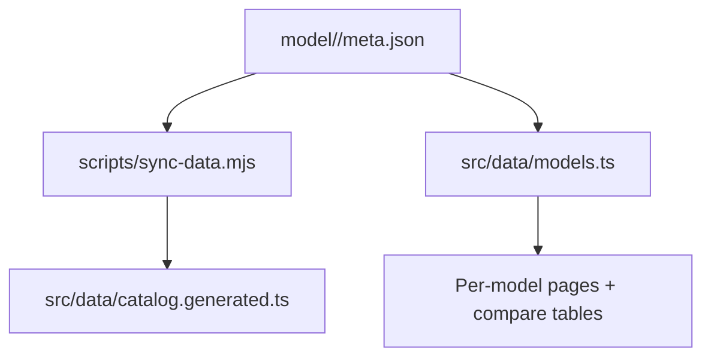
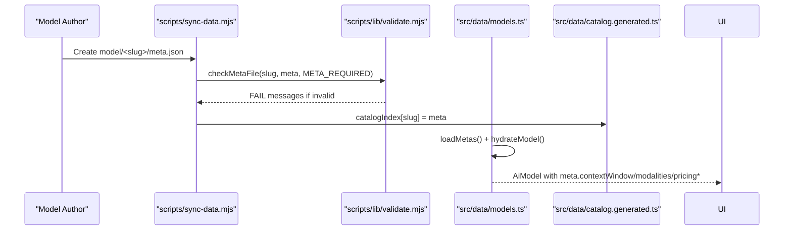
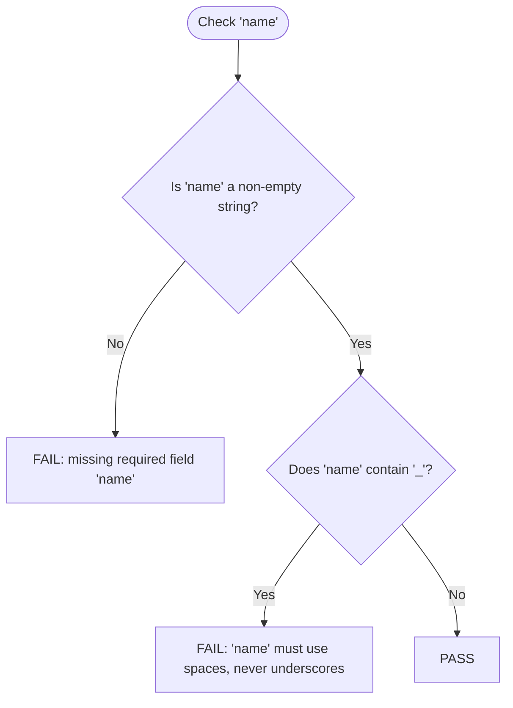
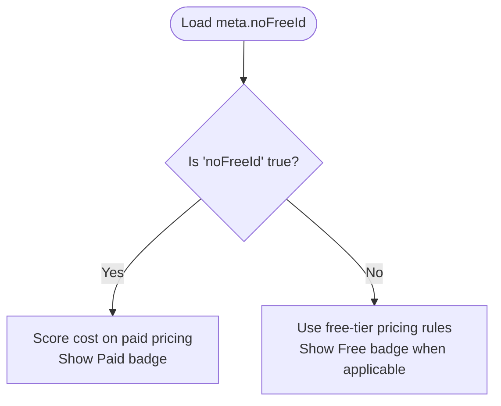
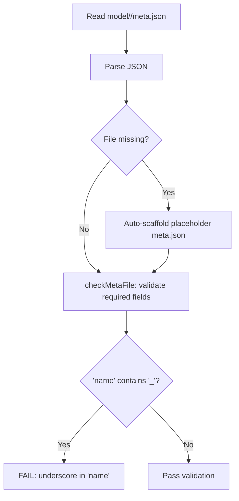
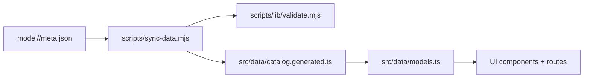
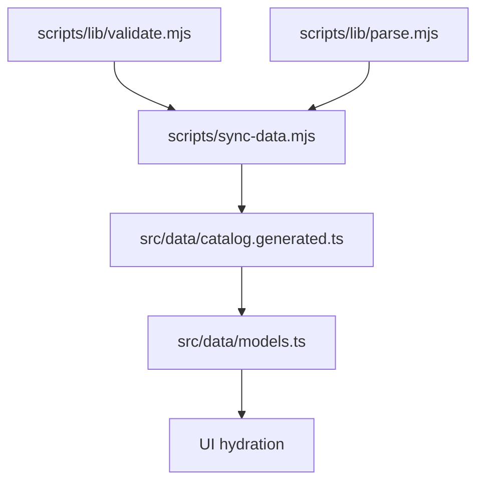

# Model Metadata Schema

<cite>
**Referenced Files in This Document**
- [README.md](file://model/README.md)
- [validate.mjs](file://scripts/lib/validate.mjs)
- [parse.mjs](file://scripts/lib/parse.mjs)
- [sync-data.mjs](file://scripts/sync-data.mjs)
- [models.ts](file://src/data/models.ts)
- [catalog.generated.ts](file://src/data/catalog.generated.ts)
</cite>

## Update Summary
**Changes Made**
- Updated to reflect the complete implementation of standardized meta.json schema across all model folders
- Added detailed examples from actual meta.json files showing real-world usage patterns
- Enhanced validation rules documentation based on the implemented checkMetaFile function
- Updated architecture diagrams to reflect the complete data flow from authoring to UI consumption
- Added comprehensive troubleshooting guide based on actual validation error messages

## Table of Contents
1. [Introduction](#introduction)
2. [Project Structure](#project-structure)
3. [Core Components](#core-components)
4. [Architecture Overview](#architecture-overview)
5. [Detailed Component Analysis](#detailed-component-analysis)
6. [Dependency Analysis](#dependency-analysis)
7. [Performance Considerations](#performance-considerations)
8. [Troubleshooting Guide](#troubleshooting-guide)
9. [Conclusion](#conclusion)

## Introduction
This document defines the model metadata schema used by `meta.json` files under each model folder. The schema describes display and pricing information for a model, including its unique identifier, human-readable names, context window specification, supported input/output modalities, and cost-related notes. It also documents optional fields that control free-tier behavior and multi-tier pricing.

The schema is enforced during the deterministic data sync process and consumed at build time to hydrate model pages, comparison tables, and per-model detail views. Each tracked model lives under `model/<slug>/` with one or more findings files, an `average.md` file generated by the sync script, and a `meta.json` file containing curated display and pricing metadata.

## Project Structure
Each tracked model lives under `model/<slug>/`. A well-formed entry includes:
- One or more findings files (one per reporting agent).
- An `average.md` file generated by the sync script.
- A `meta.json` file containing curated display and pricing metadata.



**Diagram sources**
- [sync-data.mjs:297-326](file://scripts/sync-data.mjs#L297-L326)
- [models.ts:169-240](file://src/data/models.ts#L169-L240)
- [catalog.generated.ts:1-15](file://src/data/catalog.generated.ts#L1-L15)

**Section sources**
- [README.md:32-63](file://model/README.md#L32-L63)

## Core Components
The `meta.json` schema has six required fields and three optional fields.

### Required Fields
| Field | Type | Purpose | Validation / Behavior |
|---|---|---|---|
| `id` | string | Stable provider-facing identifier for the model. | Must be present and non-empty. Used as the stable model identity; never displayed directly. |
| `name` | string | Official vendor display name shown across cards, lists, and detail pages. | Must be present and non-empty. Underscores are rejected because they indicate slug artifacts rather than official casing. |
| `short` | string | Short description summarizing what the model is, who makes it, and its top use case. | Must be present and non-empty. |
| `contextWindow` | string | Human-readable context length specification. | Must be present and non-empty. |
| `modalities` | string | Supported input/output types (for example, text-only or multimodal). | Must be present and non-empty. |
| `pricingNote` | string | High-level cost information. | Must be present and non-empty. |

### Optional Fields
| Field | Type | Purpose | Validation / Behavior |
|---|---|---|---|
| `pricingTiers` | string[] | Multiple pricing levels, one line per tier. | Optional. When present, tiers are stacked in the compare table. |
| `freeTierNote` | string | Free-tier description explaining how the free tier is obtained. | Optional. Shown as a tooltip on the Free badge when available. |
| `noFreeId` | boolean | Indicates that no Zen Free ID exists for this model. | Optional. When true, cost is scored using paid pricing and the UI shows a Paid badge instead of Free. |

### Example of a Well-Formed `meta.json`
A valid file should include all required fields and may include any combination of the optional fields. Here are real examples from the repository:

#### Basic Meta.json (Inkling)
```json
{
  "id": "opencode/Inkling",
  "name": "Inkling",
  "short": "Inkling model evaluation entry.",
  "contextWindow": "128K total",
  "modalities": "Text in/out",
  "pricingNote": "Standard pricing"
}
```

#### Multi-Tier Pricing (Big Pickle)
```json
{
  "id": "opencode/big-pickle",
  "name": "Big Pickle (GLM 4.6)",
  "short": "Free stealth reasoning model on OpenCode Zen (community consensus: GLM-4.6). Roughly Sonnet-class coding at zero token cost during the free period.",
  "contextWindow": "200K total (160K in / 32K out)",
  "modalities": "Text in/out only",
  "pricingNote": "Free Zen tier; paid equiv. GLM-4.6 ~$0.60/$2.20",
  "freeTierNote": "Free stealth promotional tier on OpenCode Zen offering zero-cost inference during active community trial",
  "pricingTiers": [
    "Free Zen tier",
    "Paid equiv. GLM-4.6 ~$0.60/$2.20"
  ]
}
```

#### Paid-Only Model (Claude Opus 4.6)
```json
{
  "id": "anthropic/claude-opus-4.6",
  "name": "Claude Opus 4.6",
  "short": "Anthropic's flagship reasoning-capable model, enhanced with thinking capabilities for complex, multi-step tasks.",
  "contextWindow": "200K",
  "modalities": "Text, image in; text out",
  "pricingNote": "Paid-tier pricing",
  "noFreeId": true
}
```

**Section sources**
- [README.md:32-57](file://model/README.md#L32-L57)
- [model/Inkling/meta.json:1-8](file://model/Inkling/meta.json#L1-L8)
- [model/big-pickle/meta.json:1-14](file://model/big-pickle/meta.json#L1-L14)
- [model/claude-opus-4.6/meta.json:1-10](file://model/claude-opus-4.6/meta.json#L1-L10)

## Architecture Overview
The metadata lifecycle spans three stages: authoring, validation, and consumption.



**Diagram sources**
- [sync-data.mjs:297-326](file://scripts/sync-data.mjs#L297-L326)
- [validate.mjs:62-80](file://scripts/lib/validate.mjs#L62-L80)
- [models.ts:169-240](file://src/data/models.ts#L169-L240)
- [catalog.generated.ts:1-15](file://src/data/catalog.generated.ts#L1-L15)

## Detailed Component Analysis

### Required Field Semantics

#### `id`
- Represents the stable identifier for the model.
- Should remain consistent across updates and must not be displayed directly to users.
- Duplicate IDs are warned against at runtime to preserve determinism.

**Section sources**
- [models.ts:190-217](file://src/data/models.ts#L190-L217)

#### `name`
- Must be the official vendor display name.
- Must use spaces, not underscores.
- Must match exact vendor casing.
- The sync process fails loudly when underscores are detected.



**Diagram sources**
- [validate.mjs:67-79](file://scripts/lib/validate.mjs#L67-L79)

**Section sources**
- [README.md:39-43](file://model/README.md#L39-L43)
- [validate.mjs:67-79](file://scripts/lib/validate.mjs#L67-L79)

#### `short`
- Provides a concise summary of the model.
- Should describe what the model is, who produces it, and its primary use case.

**Section sources**
- [README.md:45-56](file://model/README.md#L45-L56)

#### `contextWindow`
- Describes the model's context length in human-readable form.
- Examples in the repository documentation show formats such as total tokens and split input/output windows.

**Section sources**
- [README.md:45-56](file://model/README.md#L45-L56)

#### `modalities`
- Declares supported input and output types.
- Common values include text-only or multimodal combinations.

**Section sources**
- [README.md:45-56](file://model/README.md#L45-L56)

#### `pricingNote`
- Summarizes cost behavior, including free availability and paid equivalents.
- Works together with optional fields to explain pricing tiers and free-tier access.

**Section sources**
- [README.md:45-56](file://model/README.md#L45-L56)

### Optional Field Semantics

#### `pricingTiers`
- An array of strings where each element represents one pricing tier.
- Tiers are rendered stacked in the compare table.
- Useful when a model offers multiple pricing options beyond a simple free/paid distinction.

**Section sources**
- [README.md:32-56](file://model/README.md#L32-L56)
- [models.ts:66-77](file://src/data/models.ts#L66-L77)

#### `freeTierNote`
- Explains how the free tier is obtained.
- Displayed as a tooltip next to the Free badge when present.

**Section sources**
- [README.md:32-56](file://model/README.md#L32-L56)
- [models.ts:66-77](file://src/data/models.ts#L66-L77)

#### `noFreeId`
- Boolean flag indicating that no Zen Free ID exists for the model.
- When true:
  - Cost scoring uses paid pricing.
  - The UI displays a Paid badge instead of Free.



**Diagram sources**
- [README.md:32-37](file://model/README.md#L32-L37)
- [models.ts:66-77](file://src/data/models.ts#L66-L77)

**Section sources**
- [README.md:32-37](file://model/README.md#L32-L37)
- [models.ts:66-77](file://src/data/models.ts#L66-L77)

### Validation Rules

The validation pipeline enforces both structural correctness and display-name hygiene.

| Rule | Description | Enforcement Point |
|---|---|---|
| Required fields exist | All six required fields must be present and non-empty strings. | `checkMetaFile` returns failure messages for missing or empty required fields. |
| No underscores in `name` | `name` must be the official vendor display name and cannot contain underscores. | `checkMetaFile` rejects names containing `_`. |
| Auto-scaffold fallback | If `meta.json` is missing, sync creates a scaffold with placeholder values and warns that the name is derived from the slug. | `sync-data.mjs` scaffolds and logs warnings. |
| Runtime safety | At build time, missing required fields cause models to be skipped with warnings; the strict gate remains `pnpm sync`. | `loadMetas` warns and skips incomplete entries. |



**Diagram sources**
- [sync-data.mjs:297-324](file://scripts/sync-data.mjs#L297-L324)
- [validate.mjs:62-80](file://scripts/lib/validate.mjs#L62-L80)

**Section sources**
- [validate.mjs:62-80](file://scripts/lib/validate.mjs#L62-L80)
- [sync-data.mjs:297-324](file://scripts/sync-data.mjs#L297-L324)
- [models.ts:190-217](file://src/data/models.ts#L190-L217)

### Relationship Between `meta.json` and the Broader Ecosystem

#### Data Flow
1. **Authoring**: Each model folder contains a `meta.json` file describing display and pricing metadata.
2. **Sync Validation**: `scripts/sync-data.mjs` reads every `meta.json`, auto-scaffolds missing files, and validates required fields through `scripts/lib/validate.mjs`.
3. **Catalog Generation**: Validated metadata is collected into a catalog index and emitted into `src/data/catalog.generated.ts`.
4. **Runtime Hydration**: `src/data/models.ts` imports pre-parsed scores and hydrates each model with its metadata, producing the final `AiModel` shape used by the UI.



**Diagram sources**
- [sync-data.mjs:297-326](file://scripts/sync-data.mjs#L297-L326)
- [models.ts:169-240](file://src/data/models.ts#L169-L240)
- [catalog.generated.ts:1-15](file://src/data/catalog.generated.ts#L1-L15)

#### UI Consumption
The hydrated `AiModel.meta` object exposes:
- `contextWindow`: Context length description.
- `modalities`: Supported input/output types.
- `pricingNote`: High-level cost note.
- `pricingTiers`: Stacked pricing tiers.
- `freeTierNote`: Free-tier tooltip content.
- `noFreeId`: Controls Free vs Paid badge behavior.

**Section sources**
- [models.ts:66-77](file://src/data/models.ts#L66-L77)
- [models.ts:103-118](file://src/data/models.ts#L103-L118)

## Dependency Analysis
The metadata schema depends on several modules:

- `scripts/lib/validate.mjs`: Defines `checkMetaFile`, which validates required fields and rejects underscores in `name`.
- `scripts/lib/parse.mjs`: Defines `META_REQUIRED` constant and other parsing utilities.
- `scripts/sync-data.mjs`: Orchestrates reading, validating, and cataloging `meta.json` files.
- `src/data/models.ts`: Defines the runtime `MetaFile` interface and hydrates models with validated metadata.
- `src/data/catalog.generated.ts`: Exposes the generated catalog type and placeholder map for pre-baked summary metadata.



**Diagram sources**
- [validate.mjs:62-80](file://scripts/lib/validate.mjs#L62-L80)
- [parse.mjs:33](file://scripts/lib/parse.mjs#L33)
- [sync-data.mjs:297-326](file://scripts/sync-data.mjs#L297-L326)
- [models.ts:169-240](file://src/data/models.ts#L169-L240)
- [catalog.generated.ts:1-15](file://src/data/catalog.generated.ts#L1-L15)

**Section sources**
- [validate.mjs:62-80](file://scripts/lib/validate.mjs#L62-L80)
- [parse.mjs:33](file://scripts/lib/parse.mjs#L33)
- [sync-data.mjs:297-326](file://scripts/sync-data.mjs#L297-L326)
- [models.ts:169-240](file://src/data/models.ts#L169-L240)
- [catalog.generated.ts:1-15](file://src/data/catalog.generated.ts#L1-L15)

## Performance Considerations
- Metadata is read once during sync and then consumed through generated artifacts, avoiding repeated filesystem access at runtime.
- The generated catalog reduces runtime overhead by providing a pre-baked summary of model metadata.
- Missing or invalid metadata causes sync failures early, preventing expensive downstream processing with incomplete data.
- Auto-scaffolding prevents build failures while maintaining data integrity requirements.

## Troubleshooting Guide

### Common Validation Errors
| Symptom | Likely Cause | Resolution |
|---|---|---|
| `missing required field "name"` | `name` is absent or empty. | Add a non-empty official vendor display name. |
| `missing required field "short"` | `short` is absent or empty. | Add a concise model description. |
| `missing required field "contextWindow"` | `contextWindow` is absent or empty. | Add a human-readable context window description. |
| `missing required field "modalities"` | `modalities` is absent or empty. | Add supported input/output modalities. |
| `missing required field "pricingNote"` | `pricingNote` is absent or empty. | Add high-level cost information. |
| `name must use spaces, never underscores` | `name` contains `_`. | Replace underscores with spaces and use official vendor casing. |
| Auto-scaffold warning about slug guess | `meta.json` was missing and created automatically. | Replace the placeholder name and facts with verified vendor information. |

### Recommended Workflow
1. Create `model/<slug>/meta.json` with all required fields.
2. Run `pnpm sync` to validate and generate averages.
3. Fix any FAIL lines reported by sync.
4. Run `pnpm build.types && pnpm build` to verify the application consumes the metadata correctly.

### Real-World Examples
Here are common patterns observed in the repository:

#### Multimodal Models
```json
{
  "contextWindow": "1,048,576 (1M)",
  "modalities": "Text, image, audio, PDF in; text out"
}
```

#### Free Tier Models
```json
{
  "pricingNote": "Free tier available; Paid-tier pricing",
  "freeTierNote": "Free tier available on Google AI Studio and OpenCode Zen with standard rate limits"
}
```

#### Multi-Tier Pricing
```json
{
  "pricingTiers": [
    "Free Zen tier",
    "Contributor $0.10/$0.20",
    "Standard $1.25/$4.25"
  ]
}
```

**Section sources**
- [README.md:32-63](file://model/README.md#L32-L63)
- [validate.mjs:62-80](file://scripts/lib/validate.mjs#L62-L80)
- [sync-data.mjs:297-324](file://scripts/sync-data.mjs#L297-L324)

## Conclusion
The `meta.json` schema is the authoritative source of display and pricing metadata for each model. It requires six core fields and supports optional fields for tiered pricing, free-tier explanations, and paid-only behavior. Validation is enforced during sync, while runtime hydration ensures that the UI consistently presents accurate model information. The standardized approach enables automated processing and validation across the entire model ecosystem, ensuring consistency and reliability in model comparisons and presentations. Maintaining correct `meta.json` files is essential for reliable builds, trustworthy comparisons, and clear user-facing pricing signals.