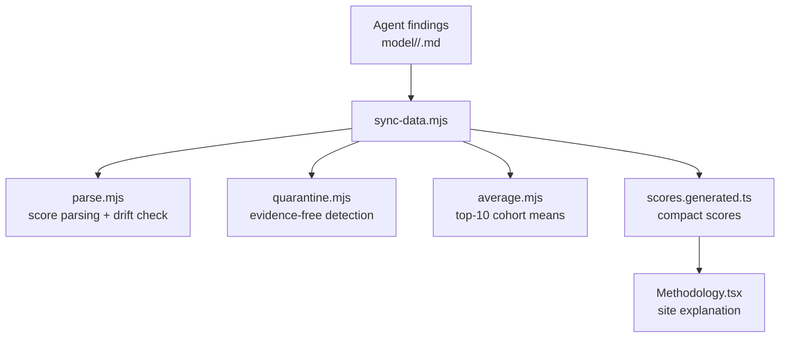
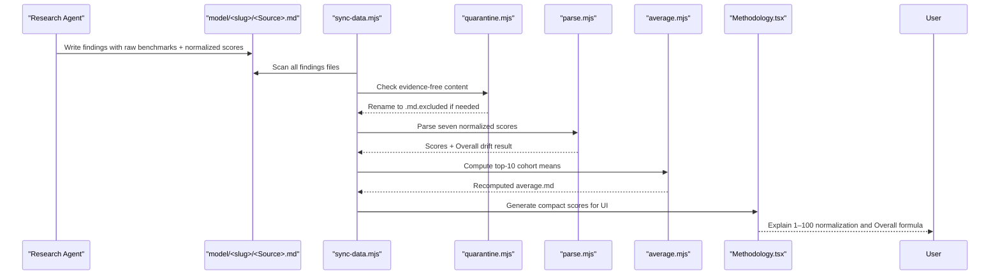
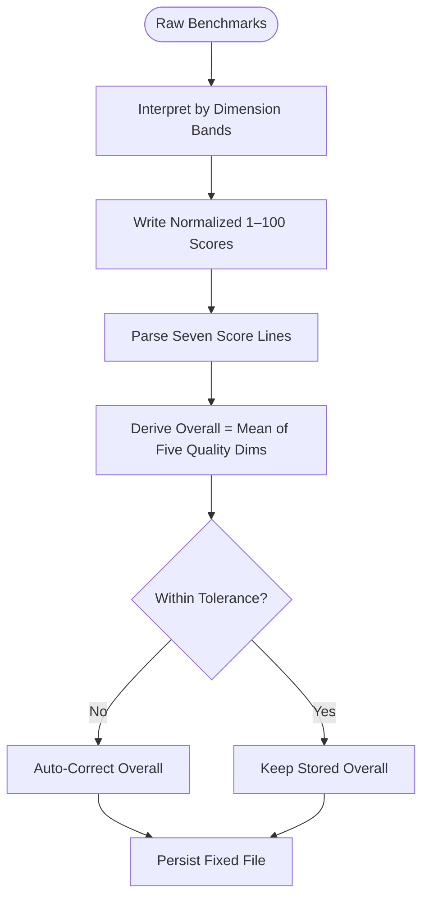
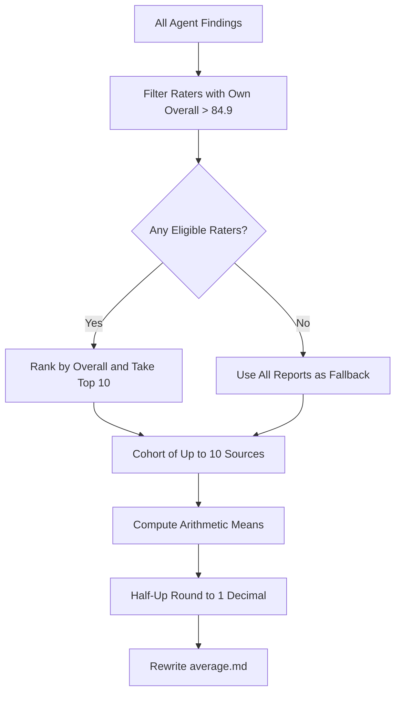
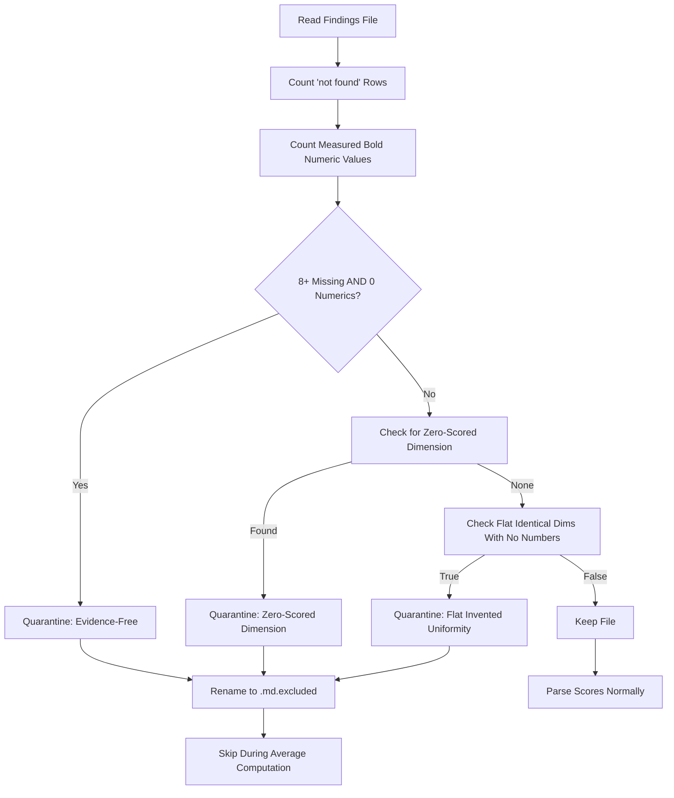
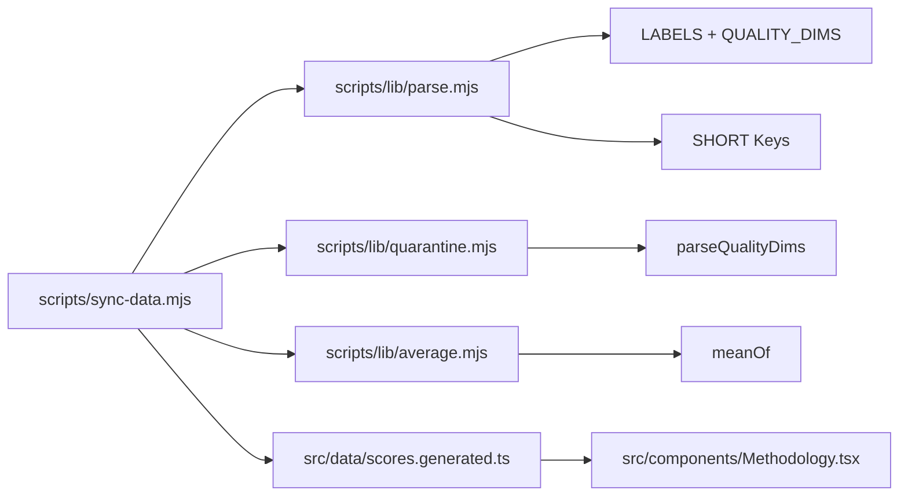

# Scoring Methodology & Algorithms

<cite>
**Referenced Files in This Document**
- [README.md](file://README.md)
- [model-comparison.md](file://model-comparison.md)
- [model/README.md](file://model/README.md)
- [model-report-TEMPLATE.md](file://model-report-TEMPLATE.md)
- [RULES.md](file://RULES.md)
- [scripts/sync-data.mjs](file://scripts/sync-data.mjs)
- [scripts/lib/parse.mjs](file://scripts/lib/parse.mjs)
- [scripts/lib/quarantine.mjs](file://scripts/lib/quarantine.mjs)
- [scripts/lib/average.mjs](file://scripts/lib/average.mjs)
- [src/components/Methodology.tsx](file://src/components/Methodology.tsx)
</cite>

## Table of Contents
1. [Introduction](#introduction)
2. [Project Structure](#project-structure)
3. [Core Components](#core-components)
4. [Architecture Overview](#architecture-overview)
5. [Detailed Component Analysis](#detailed-component-analysis)
6. [Dependency Analysis](#dependency-analysis)
7. [Performance Considerations](#performance-considerations)
8. [Troubleshooting Guide](#troubleshooting-guide)
9. [Conclusion](#conclusion)

## Introduction
ModelComp evaluates AI models across six normalized dimensions and produces a per-model Overall Score plus per-agent grades. The six evaluation dimensions are:

- Tool use (agent benchmarks)
- Reasoning (complex problem solving)
- Context window (input processing capacity)
- Multimodal (non-text support)
- Coding (software engineering performance)
- Cost efficiency (pricing analysis)

Scores are normalized interpretations from 1 to 100, based on public benchmarks. The Overall Score is the rounded mean of the five quality dimensions — Tool use, Reasoning, Context window, Multimodal, and Coding. Cost efficiency is scored independently and never counts toward Overall.

The repository stores one findings file per reporting agent under `model/<slug>/`, plus an auto-generated average for each model. A deterministic sync process parses, validates, quarantines evidence-free reports, computes averages, and generates compact score data for the site.

**Section sources**
- [README.md:3-16](file://README.md#L3-L16)
- [README.md:46-59](file://README.md#L46-L59)
- [model-comparison.md:11-14](file://model-comparison.md#L11-L14)
- [model-comparison.md:46-59](file://model-comparison.md#L46-L59)

## Project Structure
The scoring pipeline is centered around research files and a deterministic sync script:

**Diagram sources**
- [scripts/sync-data.mjs:1-29](file://scripts/sync-data.mjs#L1-L29)
- [scripts/lib/parse.mjs:1-10](file://scripts/lib/parse.mjs#L1-L10)
- [scripts/lib/quarantine.mjs:1-8](file://scripts/lib/quarantine.mjs#L1-L8)
- [scripts/lib/average.mjs:1-8](file://scripts/lib/average.mjs#L1-L8)
- [src/components/Methodology.tsx:1-18](file://src/components/Methodology.tsx#L1-L18)

**Section sources**
- [model/README.md:1-30](file://model/README.md#L1-L30)
- [README.md:31-44](file://README.md#L31-L44)

## Core Components
The core components responsible for scoring methodology and algorithms are:

| Component | Responsibility | Key Behavior |
|---|---|---|
| Research template | Defines required fields, raw benchmark section, and normalized score lines | Enforces independent research and zero-invented values |
| Rules | Defines Overall formula, rater gate, and crown rule | Overall = half-up mean of five quality dims; Cost excluded |
| Parser | Parses seven normalized scores and checks Overall drift | Uses canonical labels and short keys |
| Quarantine | Detects evidence-free or invalid reports | Auto-renames to `.md.excluded` |
| Average builder | Computes top-10 cohort means | Half-up rounding to 1 decimal |
| Sync orchestrator | Coordinates scanning, validation, quarantine, averaging, and codegen | Deterministic, side-effect logging |

**Section sources**
- [model-report-TEMPLATE.md:1-40](file://model-report-TEMPLATE.md#L1-L40)
- [RULES.md:46-64](file://RULES.md#L46-L64)
- [scripts/lib/parse.mjs:8-45](file://scripts/lib/parse.mjs#L8-L45)
- [scripts/lib/quarantine.mjs:33-56](file://scripts/lib/quarantine.mjs#L33-L56)
- [scripts/lib/average.mjs:1-8](file://scripts/lib/average.mjs#L1-L8)
- [scripts/sync-data.mjs:1-29](file://scripts/sync-data.mjs#L1-L29)

## Architecture Overview
The end-to-end flow from agent findings to published averages is:

**Diagram sources**
- [scripts/sync-data.mjs:259-286](file://scripts/sync-data.mjs#L259-L286)
- [scripts/lib/quarantine.mjs:42-56](file://scripts/lib/quarantine.mjs#L42-L56)
- [scripts/lib/parse.mjs:52-78](file://scripts/lib/parse.mjs#L52-L78)
- [scripts/lib/average.mjs:54-81](file://scripts/lib/average.mjs#L54-L81)
- [src/components/Methodology.tsx:14-26](file://src/components/Methodology.tsx#L14-L26)

## Detailed Component Analysis

### Six Evaluation Dimensions
The six dimensions are explicitly defined in the project rules and methodology documentation:

| Dimension | Meaning | Normalization Guidance |
|---|---|---|
| Tool use | Agent benchmarks such as Terminal-Bench, Tau3-Banking, GDPval-AA, OSWorld/AutomationBench, tool-call efficiency | Higher is better; frontier references guide 90–100 band |
| Reasoning | Complex problem solving via GPQA Diamond, HLE, MRCR/LCR, CritPt, Intelligence Index | Higher is better; frontier references guide 90–100 band |
| Context window | Input processing capacity measured by context length and retrieval performance | Tiered mapping: ≥1M → 95–100; lower windows scale down |
| Multimodal | Non-text support including image, video, audio, PDF input/output | Text-only typically low; multimodal coverage increases score |
| Coding | Software engineering performance via SWE-bench, DeepSWE, LiveCodeBench, SciCode, SWE-Atlas | Higher is better; coding-focused models score higher |
| Cost efficiency | Pricing analysis on evaluated tier | $0 → 100; paid pricing mapped inversely to cost |

Cost efficiency is scored but excluded from Overall.

**Section sources**
- [model-comparison.md:140-150](file://model-comparison.md#L140-L150)
- [model-report-TEMPLATE.md:71-87](file://model-report-TEMPLATE.md#L71-L87)
- [RULES.md:46-51](file://RULES.md#L46-L51)

### Normalization Process
Normalization converts raw benchmark numbers into 1–100 scores. The process is documented in the comparison methodology and enforced by the template and parser:

1. Raw benchmarks are collected with sources.
2. Each dimension is interpreted using documented bands and references.
3. Scores are written as `- **Label: N/100.**`.
4. The parser extracts these seven normalized scores.
5. Overall is derived as the half-up mean of the five quality dimensions.
6. If the stored Overall differs beyond tolerance, sync auto-corrects it.

**Diagram sources**
- [model-comparison.md:140-150](file://model-comparison.md#L140-L150)
- [model-report-TEMPLATE.md:71-87](file://model-report-TEMPLATE.md#L71-L87)
- [scripts/lib/parse.mjs:74-87](file://scripts/lib/parse.mjs#L74-L87)
- [scripts/sync-data.mjs:347-370](file://scripts/sync-data.mjs#L347-L370)

**Section sources**
- [model-comparison.md:140-150](file://model-comparison.md#L140-L150)
- [model-report-TEMPLATE.md:71-87](file://model-report-TEMPLATE.md#L71-L87)
- [scripts/lib/parse.mjs:47-87](file://scripts/lib/parse.mjs#L47-L87)

### Averaging Mechanisms for Multiple Agents
Averages are computed deterministically:

- Each model folder can have multiple agent findings files.
- Only raters whose own committed average Overall exceeds 84.9 qualify.
- From eligible raters, the top-10 highest Overall scores form the cohort.
- The average.md Overall is the mean of that cohort’s Overall scores.
- Other averaged dimensions are arithmetic means over the same cohort.
- If no rater clears the gate, a fallback average uses all available reports, still capped at top-10.

**Diagram sources**
- [scripts/sync-data.mjs:372-435](file://scripts/sync-data.mjs#L372-L435)
- [scripts/lib/parse.mjs:89-117](file://scripts/lib/parse.mjs#L89-L117)
- [scripts/lib/average.mjs:12-30](file://scripts/lib/average.mjs#L12-L30)

**Section sources**
- [RULES.md:52-59](file://RULES.md#L52-L59)
- [scripts/sync-data.mjs:372-435](file://scripts/sync-data.mjs#L372-L435)
- [scripts/lib/parse.mjs:89-117](file://scripts/lib/parse.mjs#L89-L117)
- [scripts/lib/average.mjs:12-30](file://scripts/lib/average.mjs#L12-L30)

### Evidence-Free Report Filtering
Evidence-free reports are automatically quarantined so they cannot poison averages:

- A report is evidence-free if it has eight or more “no verified public score found” rows and zero measured bold numeric values.
- Zero-scored dimensions (any quality dim equals 0) are also quarantined.
- Flat identical dimensions across all five quality dims with zero cited numbers are quarantined.
- Quarantined files are renamed to `<Source>.md.excluded`.
- Excluded files are skipped during parsing and averaging.

**Diagram sources**
- [scripts/lib/quarantine.mjs:11-56](file://scripts/lib/quarantine.mjs#L11-L56)
- [scripts/sync-data.mjs:259-286](file://scripts/sync-data.mjs#L259-L286)

**Section sources**
- [model-report-TEMPLATE.md:26-40](file://model-report-TEMPLATE.md#L26-L40)
- [scripts/lib/quarantine.mjs:33-56](file://scripts/lib/quarantine.mjs#L33-L56)
- [scripts/sync-data.mjs:259-286](file://scripts/sync-data.mjs#L259-L286)

### Quality Gates That Validate Score Consistency
Quality gates ensure consistency between raw scores, derived Overall, and rater eligibility:

| Gate | Rule | Enforcement |
|---|---|---|
| Score-line format | Seven normalized score lines must exist with exact labels | Parser throws on missing label |
| Overall derivation | Overall must equal half-up mean of five quality dims | Sync auto-corrects drifted Overall |
| Drift tolerance | Correction only when difference exceeds tolerance | Prevents noisy rewrites |
| Rater gate | Only raters with own average Overall > 84.9 count toward other averages | Partition filters eligible cohort |
| Crown rule | Every model folder gets an average even if no rater qualifies | Fallback uses all reports |
| Evidence-free quarantine | Reports without verified benchmarks are excluded | Auto-rename to `.md.excluded` |

**Section sources**
- [scripts/lib/parse.mjs:38-45](file://scripts/lib/parse.mjs#L38-L45)
- [scripts/lib/parse.mjs:74-87](file://scripts/lib/parse.mjs#L74-L87)
- [scripts/lib/parse.mjs:99-117](file://scripts/lib/parse.mjs#L99-L117)
- [RULES.md:46-64](file://RULES.md#L46-L64)
- [scripts/lib/quarantine.mjs:33-56](file://scripts/lib/quarantine.mjs#L33-L56)

### Mathematical Formulas Used for Calculations
The following formulas are implemented in the sync and parsing logic:

| Formula | Definition | Implementation Reference |
|---|---|---|
| Half-up rounding to 1 decimal | `halfUp1(x) = Math.round(x * 10) / 10` | `scripts/lib/parse.mjs` |
| Source-file Overall | `Overall = round(mean(Tool, Reasoning, Context, Multimodal, Coding))` | `scripts/lib/parse.mjs` |
| Average dimension mean | `mean(cohort, label) = round(sum(scores[label]) / cohort.length)` | `scripts/lib/parse.mjs` |
| Top-10 cohort selection | Sort by Overall descending, take first 10 | `scripts/lib/parse.mjs` |
| Rater eligibility | Include source only if rating model’s own average Overall > 84.9 | `scripts/lib/parse.mjs` |
| Quarantine evidence-free | Quarantine if missing ≥ 8 and numerics = 0 | `scripts/lib/quarantine.mjs` |
| Quarantine zero-scored | Quarantine if any quality dim = 0 | `scripts/lib/quarantine.mjs` |
| Quarantine flat uniformity | Quarantine if all five dims identical and zero cited numbers | `scripts/lib/quarantine.mjs` |

**Section sources**
- [scripts/lib/parse.mjs:44-45](file://scripts/lib/parse.mjs#L44-L45)
- [scripts/lib/parse.mjs:74-97](file://scripts/lib/parse.mjs#L74-L97)
- [scripts/lib/parse.mjs:99-117](file://scripts/lib/parse.mjs#L99-L117)
- [scripts/lib/quarantine.mjs:42-56](file://scripts/lib/quarantine.mjs#L42-L56)

### Examples of How Different Models Receive Scores Across Dimensions
The repository contains example model entries showing how different models receive scores across the six dimensions. These examples illustrate the normalization approach rather than prescribing fixed benchmark thresholds:

| Model | Tool use | Reasoning | Context window | Multimodal | Coding | Cost efficiency | Overall Score |
|---|---:|---:|---:|---:|---:|---:|---:|
| Big Pickle | 55 | 60 | 70 | 15 | 70 | 100 | 62 |
| Muse Spark 1.3 Contributor | 95 | 92 | 100 | 85 | 95 | 100 | 95 |
| Ling 3.0 Flash Fin Free | 68 | 70 | 72 | 15 | 72 | 100 | 66 |
| MiMo V2.5 Free | 78 | 72 | 70 | 95 | 78 | 100 | 82 |
| Muse Spark 1.2 Free | 90 | 88 | 100 | 90 | 88 | 100 | 93 |
| Nemotron 3 Ultra Free | 78 | 75 | 97 | 20 | 80 | 100 | 75 |
| Nemotron 3.5 Lightning Free | 50 | 62 | 72 | 15 | 58 | 100 | 60 |
| GLM 5.1 Coding | 85 | 80 | 70 | 15 | 88 | 75 | 69 |
| MiniMax M2.7 | 80 | 75 | 70 | 15 | 82 | 90 | 69 |
| Xiaomi MiMo-V2.5-Pro | 82 | 78 | 100 | 15 | 82 | 85 | 74 |

These scores demonstrate:

- High-cost-efficiency models often score 100 on Cost efficiency because they are free-tier evaluations.
- Strong multimodal models score higher on Multimodal than text-only models.
- Long-context models score higher on Context window.
- Coding-focused models score higher on Coding.
- Overall excludes Cost efficiency, so high cost efficiency does not inflate Overall.

**Section sources**
- [model-comparison.md:11-47](file://model-comparison.md#L11-L47)
- [model-comparison.md:52-137](file://model-comparison.md#L52-L137)

## Dependency Analysis
The scoring system has clear dependencies between orchestration, parsing, quarantine, averaging, and presentation:

**Diagram sources**
- [scripts/sync-data.mjs:36-75](file://scripts/sync-data.mjs#L36-L75)
- [scripts/lib/parse.mjs:8-31](file://scripts/lib/parse.mjs#L8-L31)
- [scripts/lib/quarantine.mjs:9-31](file://scripts/lib/quarantine.mjs#L9-L31)
- [scripts/lib/average.mjs:10-10](file://scripts/lib/average.mjs#L10-L10)
- [src/components/Methodology.tsx:1-18](file://src/components/Methodology.tsx#L1-L18)

**Section sources**
- [scripts/sync-data.mjs:36-75](file://scripts/sync-data.mjs#L36-L75)
- [scripts/lib/parse.mjs:8-31](file://scripts/lib/parse.mjs#L8-L31)
- [scripts/lib/quarantine.mjs:9-31](file://scripts/lib/quarantine.mjs#L9-L31)
- [scripts/lib/average.mjs:10-10](file://scripts/lib/average.mjs#L10-L10)

## Performance Considerations
The scoring pipeline is designed for deterministic, build-time computation rather than runtime calculation:

- Findings prose is kept out of the client bundle by generating compact scores.
- Parsing and averaging run during `pnpm sync`, not at page load.
- The generated scores file contains only numbers, reducing frontend payload size.
- Validation failures prevent cementing partial or inconsistent data.
- Quarantine prevents low-quality reports from affecting averages.

[No sources needed since this section provides general guidance]

## Troubleshooting Guide
Common issues and their resolution paths:

| Issue | Symptom | Resolution |
|---|---|---|
| Missing score line | Parser fails with missing label | Add the required normalized score line with exact label |
| Overall drift | Sync auto-corrects Overall | Allow automatic correction or fix the five quality dims |
| Evidence-free report | File renamed to `.md.excluded` | Add verified benchmark numbers or keep as excluded |
| Below-gate rater | Ignored in average computation | Improve model’s own average to exceed 84.9 |
| No qualifying raters | Fallback average used | Accept fallback or add stronger raters |
| Hygiene violation | Filename or meta.json validation fails | Follow naming conventions and required fields |

**Section sources**
- [scripts/lib/parse.mjs:52-60](file://scripts/lib/parse.mjs#L52-L60)
- [scripts/lib/parse.mjs:74-87](file://scripts/lib/parse.mjs#L74-L87)
- [scripts/lib/quarantine.mjs:42-56](file://scripts/lib/quarantine.mjs#L42-L56)
- [scripts/sync-data.mjs:347-370](file://scripts/sync-data.mjs#L347-L370)
- [scripts/sync-data.mjs:372-435](file://scripts/sync-data.mjs#L372-L435)

## Conclusion
ModelComp’s scoring methodology combines transparent normalization, strict validation, and deterministic averaging. The six dimensions capture agent capability, reasoning depth, context capacity, multimodal support, coding performance, and cost efficiency. The Overall Score focuses exclusively on the five quality dimensions, while Cost efficiency remains visible and separately scored.

The system enforces quality through:

- Required normalized score lines
- Derived and auto-corrected Overall
- Rater gate filtering
- Top-10 cohort averaging
- Automatic quarantine of evidence-free reports
- Deterministic sync that regenerates averages and compact scores

This design ensures that published scores are interpretable, auditable, and resistant to fabricated or low-evidence inputs.

[No sources needed since this section summarizes without analyzing specific files]