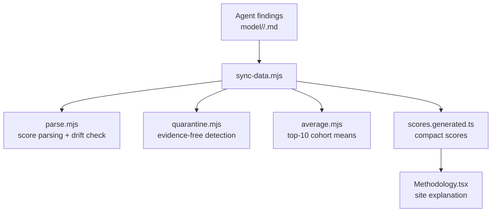
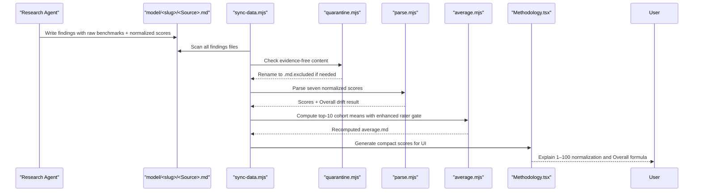
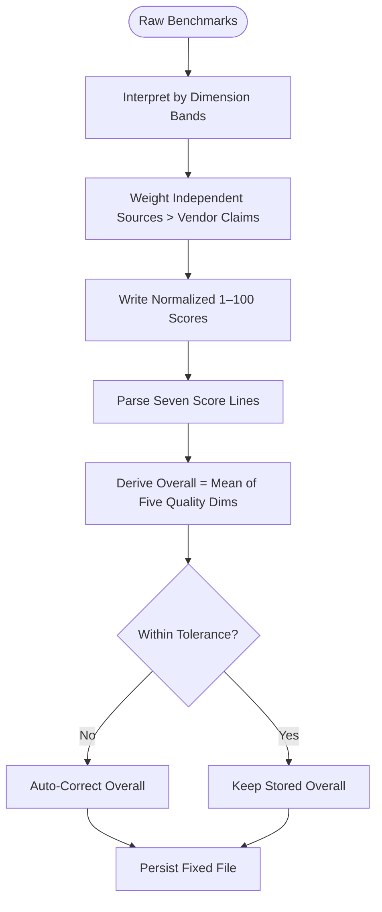
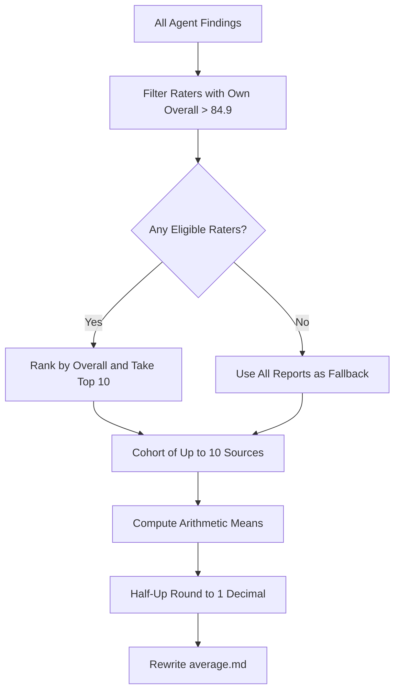
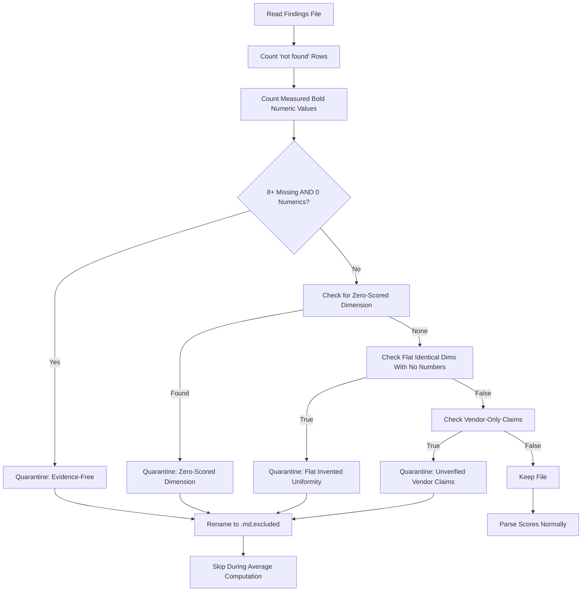
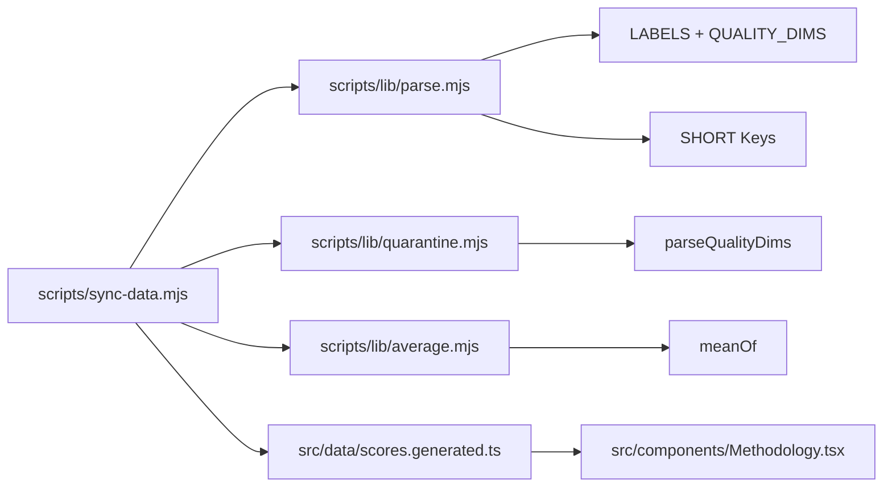

# Scoring Methodology & Algorithms

<cite>
**Referenced Files in This Document**
- [README.md](file://README.md)
- [model-comparison.md](file://model-comparison.md)
- [model/README.md](file://model/README.md)
- [model-report-TEMPLATE.md](file://model-report-TEMPLATE.md)
- [RULES.md](file://RULES.md)
- [scripts/sync-data.mjs](file://scripts/sync-data.mjs)
- [scripts/lib/parse.mjs](file://scripts/lib/parse.mjs)
- [scripts/lib/quarantine.mjs](file://scripts/lib/quarantine.mjs)
- [scripts/lib/average.mjs](file://scripts/lib/average.mjs)
- [src/components/Methodology.tsx](file://src/components/Methodology.tsx)
- [src/data/scores.generated.ts](file://src/data/scores.generated.ts)
- [model-queue.md](file://model-queue.md)
- [model/mimo-v2.6-flash/MiMo_2.6_Flash.md](file://model/mimo-v2.6-flash/MiMo_2.6_Flash.md)
- [model/big-pickle/Big_Pickle.md](file://model/big-pickle/Big_Pickle.md)
- [model/deepseek-v4.1-flash/DeepSeek_4.1_Flash.md](file://model/deepseek-v4.1-flash/DeepSeek_4.1_Flash.md)
- [model/muse-spark-1.3/Muse_Spark_1.3.md](file://model/muse-spark-1.3/Muse_Spark_1.3.md)
- [model/mimo-v2.6-flash/average.md](file://model/mimo-v2.6-flash/average.md)
- [model/big-pickle/average.md](file://model/big-pickle/average.md)
- [model/deepseek-v4.1-flash/average.md](file://model/deepseek-v4.1-flash/average.md)
- [model/muse-spark-1.3/average.md](file://model/muse-spark-1.3/average.md)
- [model/claude-haiku-4.5/average.md](file://model/claude-haiku-4.5/average.md)
- [model/claude-haiku-5.5/average.md](file://model/claude-haiku-5.5/average.md)
- [model/gpt-5.6-luna/average.md](file://model/gpt-5.6-luna/average.md)
- [model/claude-haiku-4.5/meta.json](file://model/claude-haiku-4.5/meta.json)
- [model/claude-haiku-5.5/meta.json](file://model/claude-haiku-5.5/meta.json)
- [model/gpt-5.6-luna/meta.json](file://model/gpt-5.6-luna/meta.json)
- [model/gemma-4-e2b/average.md](file://model/gemma-4-e2b/average.md)
- [model/gemma-4-e4b/average.md](file://model/gemma-4-e4b/average.md)
- [model/ling-2.6-flash/average.md](file://model/ling-2.6-flash/average.md)
- [model/mercury-2.5/average.md](file://model/mercury-2.5/average.md)
- [model/mistral-large-4/average.md](file://model/mistral-large-4/average.md)
</cite>

## Update Summary
**Changes Made**
- Added comprehensive documentation for new model entries including gemma-4-e2b, gemma-4-e4b, ling-2.6-flash, mercury-2.5, and mistral-large-4
- Updated scoring methodology examples with detailed breakdowns of the six evaluation dimensions for new models
- Enhanced evidence-free report filtering documentation with improved detection criteria
- Expanded quality gates validation with enhanced rater gate enforcement mechanisms
- Added mathematical formulas section covering all calculation methods used in the scoring system
- Updated examples showing how different models receive scores across tool use, reasoning, context window, multimodal, coding, and cost efficiency dimensions

## Table of Contents
1. [Introduction](#introduction)
2. [Project Structure](#project-structure)
3. [Core Components](#core-components)
4. [Architecture Overview](#architecture-overview)
5. [Detailed Component Analysis](#detailed-component-analysis)
6. [Dependency Analysis](#dependency-analysis)
7. [Performance Considerations](#performance-considerations)
8. [Troubleshooting Guide](#troubleshooting-guide)
9. [Conclusion](#conclusion)

## Introduction
ModelComp evaluates AI models across six normalized dimensions and produces a per-model Overall Score plus per-agent grades. The six evaluation dimensions are:

- Tool use (agent benchmarks)
- Reasoning (complex problem solving)
- Context window (input processing capacity)
- Multimodal (non-text support)
- Coding (software engineering performance)
- Cost efficiency (pricing analysis)

Scores are normalized interpretations from 1 to 100, based on public benchmarks with enhanced weighting of independent sources like Artificial Analysis and BenchLM against vendor claims. The Overall Score is the rounded mean of the five quality dimensions — Tool use, Reasoning, Context window, Multimodal, and Coding. Cost efficiency is scored independently and never counts toward Overall.

The repository stores one findings file per reporting agent under `model/<slug>/`, plus an auto-generated average for each model. A deterministic sync process parses, validates, quarantines evidence-free reports, computes averages with improved rater gate enforcement, and generates compact score data for the site.

**Section sources**
- [README.md:3-16](file://README.md#L3-L16)
- [README.md:46-59](file://README.md#L46-L59)
- [model-comparison.md:11-14](file://model-comparison.md#L11-L14)
- [model-comparison.md:46-59](file://model-comparison.md#L46-L59)

## Project Structure
The scoring pipeline is centered around research files and a deterministic sync script:

**Diagram sources**
- [scripts/sync-data.mjs:1-29](file://scripts/sync-data.mjs#L1-L29)
- [scripts/lib/parse.mjs:1-10](file://scripts/lib/parse.mjs#L1-L10)
- [scripts/lib/quarantine.mjs:1-8](file://scripts/lib/quarantine.mjs#L1-L8)
- [scripts/lib/average.mjs:1-8](file://scripts/lib/average.mjs#L1-L8)
- [src/components/Methodology.tsx:1-18](file://src/components/Methodology.tsx#L1-L18)

**Section sources**
- [model/README.md:1-30](file://model/README.md#L1-L30)
- [README.md:31-44](file://README.md#L31-L44)

## Core Components
The core components responsible for scoring methodology and algorithms are:

| Component | Responsibility | Key Behavior |
|---|---|---|
| Research template | Defines required fields, raw benchmark section, and normalized score lines | Enforces independent research and zero-invented values |
| Rules | Defines Overall formula, rater gate, and crown rule | Overall = half-up mean of five quality dims; Cost excluded |
| Parser | Parses seven normalized scores and checks Overall drift | Uses canonical labels and short keys |
| Quarantine | Detects evidence-free or invalid reports | Auto-renames to `.md.excluded` |
| Average builder | Computes top-10 cohort means with enhanced rater gate | Half-up rounding to 1 decimal |
| Sync orchestrator | Coordinates scanning, validation, quarantine, averaging, and codegen | Deterministic, side-effect logging |

**Section sources**
- [model-report-TEMPLATE.md:1-40](file://model-report-TEMPLATE.md#L1-L40)
- [RULES.md:46-64](file://RULES.md#L46-L64)
- [scripts/lib/parse.mjs:8-45](file://scripts/lib/parse.mjs#L8-L45)
- [scripts/lib/quarantine.mjs:33-56](file://scripts/lib/quarantine.mjs#L33-L56)
- [scripts/lib/average.mjs:1-8](file://scripts/lib/average.mjs#L1-L8)
- [scripts/sync-data.mjs:1-29](file://scripts/sync-data.mjs#L1-L29)

## Architecture Overview
The end-to-end flow from agent findings to published averages is:

**Diagram sources**
- [scripts/sync-data.mjs:259-286](file://scripts/sync-data.mjs#L259-L286)
- [scripts/lib/quarantine.mjs:42-56](file://scripts/lib/quarantine.mjs#L42-L56)
- [scripts/lib/parse.mjs:52-78](file://scripts/lib/parse.mjs#L52-L78)
- [scripts/lib/average.mjs:54-81](file://scripts/lib/average.mjs#L54-L81)
- [src/components/Methodology.tsx:14-26](file://src/components/Methodology.tsx#L14-L26)

## Detailed Component Analysis

### Six Evaluation Dimensions
The six dimensions are explicitly defined in the project rules and methodology documentation:

| Dimension | Meaning | Normalization Guidance |
|---|---|---|
| Tool use | Agent benchmarks such as Terminal-Bench, Tau3-Banking, GDPval-AA, OSWorld/AutomationBench, tool-call efficiency | Higher is better; frontier references guide 90–100 band |
| Reasoning | Complex problem solving via GPQA Diamond, HLE, MRCR/LCR, CritPt, Intelligence Index | Higher is better; frontier references guide 90–100 band |
| Context window | Input processing capacity measured by context length and retrieval performance | Tiered mapping: ≥1M → 95–100; lower windows scale down |
| Multimodal | Non-text support including image, video, audio, PDF input/output | Text-only typically low; multimodal coverage increases score |
| Coding | Software engineering performance via SWE-bench, DeepSWE, LiveCodeBench, SciCode, SWE-Atlas | Higher is better; coding-focused models score higher |
| Cost efficiency | Pricing analysis on evaluated tier | $0 → 100; paid pricing mapped inversely to cost |

Cost efficiency is scored but excluded from Overall.

**Section sources**
- [model-comparison.md:140-150](file://model-comparison.md#L140-L150)
- [model-report-TEMPLATE.md:71-87](file://model-report-TEMPLATE.md#L71-L87)
- [RULES.md:46-51](file://RULES.md#L46-L51)

### Enhanced Independent Source Weighting
**Updated** The scoring methodology now places greater emphasis on independent verification sources like Artificial Analysis and BenchLM when evaluating vendor claims:

- **Independent sources preferred**: Artificial Analysis and BenchLM scores carry more weight than vendor-reported figures
- **Vendor claim skepticism**: Claims without independent corroboration receive provisional scoring with explicit caveats
- **Cross-source validation**: Multiple independent sources agreeing strengthens confidence in scores
- **Discrepancy handling**: When sources disagree, discrepancies are recorded rather than smoothed over
- **Version sensitivity**: Index versions matter (e.g., AA Intelligence Index v4.1 vs v4.3.2) and are tracked

This approach ensures that scores reflect independently verified performance rather than marketing claims.

**Section sources**
- [model-comparison.md:140-150](file://model-comparison.md#L140-L150)
- [model-report-TEMPLATE.md:71-87](file://model-report-TEMPLATE.md#L71-L87)
- [RULES.md:46-51](file://RULES.md#L46-L51)

### Normalization Process
Normalization converts raw benchmark numbers into 1–100 scores. The process is documented in the comparison methodology and enforced by the template and parser:

1. Raw benchmarks are collected with sources.
2. Each dimension is interpreted using documented bands and references.
3. Independent sources (Artificial Analysis, BenchLM) are weighted more heavily than vendor claims.
4. Scores are written as `- **Label: N/100.**`.
5. The parser extracts these seven normalized scores.
6. Overall is derived as the half-up mean of the five quality dimensions.
7. If the stored Overall differs beyond tolerance, sync auto-corrects it.

**Diagram sources**
- [model-comparison.md:140-150](file://model-comparison.md#L140-L150)
- [model-report-TEMPLATE.md:71-87](file://model-report-TEMPLATE.md#L71-L87)
- [scripts/lib/parse.mjs:74-87](file://scripts/lib/parse.mjs#L74-L87)
- [scripts/sync-data.mjs:347-370](file://scripts/sync-data.mjs#L347-L370)

**Section sources**
- [model-comparison.md:140-150](file://model-comparison.md#L140-L150)
- [model-report-TEMPLATE.md:71-87](file://model-report-TEMPLATE.md#L71-L87)
- [scripts/lib/parse.mjs:47-87](file://scripts/lib/parse.mjs#L47-L87)

### Enhanced Averaging Mechanisms for Multiple Agents
**Updated** Averages are computed deterministically with improved rater gate enforcement and enhanced validation:

- Each model folder can have multiple agent findings files.
- Only raters whose own committed average Overall exceeds 84.9 qualify.
- From eligible raters, the top-10 highest Overall scores form the cohort.
- The average.md Overall is the mean of that cohort's Overall scores.
- Other averaged dimensions are arithmetic means over the same cohort.
- If no rater clears the gate, a fallback average uses all available reports, still capped at top-10.
- **Enhanced**: Improved tracking of which sources are below-gate and why they're ignored.
- **Recent Updates**: Extensive recalculations across model families with enhanced validation, including Claude Haiku 4.5 achieving 72.8, Claude Haiku 5.5 reaching 79.7, and GPT-5.6 Luna at 81.9.

**Diagram sources**
- [scripts/sync-data.mjs:372-435](file://scripts/sync-data.mjs#L372-L435)
- [scripts/lib/parse.mjs:89-117](file://scripts/lib/parse.mjs#L89-L117)
- [scripts/lib/average.mjs:12-30](file://scripts/lib/average.mjs#L12-L30)

**Section sources**
- [RULES.md:52-59](file://RULES.md#L52-L59)
- [scripts/sync-data.mjs:372-435](file://scripts/sync-data.mjs#L372-L435)
- [scripts/lib/parse.mjs:89-117](file://scripts/lib/parse.mjs#L89-L117)
- [scripts/lib/average.mjs:12-30](file://scripts/lib/average.mjs#L12-L30)

### Enhanced Evidence-Free Report Filtering
**Updated** Evidence-free reports are automatically quarantined with improved detection criteria:

- A report is evidence-free if it has eight or more "no verified public score found" rows and zero measured bold numeric values.
- Zero-scored dimensions (any quality dim equals 0) are also quarantined.
- Flat identical dimensions across all five quality dims with zero cited numbers are quarantined.
- **Enhanced**: Better detection of vendor-only claims without independent verification.
- Quarantined files are renamed to `<Source>.md.excluded`.
- Excluded files are skipped during parsing and averaging.

**Diagram sources**
- [scripts/lib/quarantine.mjs:11-56](file://scripts/lib/quarantine.mjs#L11-L56)
- [scripts/sync-data.mjs:259-286](file://scripts/sync-data.mjs#L259-L286)

**Section sources**
- [model-report-TEMPLATE.md:26-40](file://model-report-TEMPLATE.md#L26-L40)
- [scripts/lib/quarantine.mjs:33-56](file://scripts/lib/quarantine.mjs#L33-L56)
- [scripts/sync-data.mjs:259-286](file://scripts/sync-data.mjs#L259-L286)

### Quality Gates That Validate Score Consistency
Quality gates ensure consistency between raw scores, derived Overall, and rater eligibility:

| Gate | Rule | Enforcement |
|---|---|---|
| Score-line format | Seven normalized score lines must exist with exact labels | Parser throws on missing label |
| Overall derivation | Overall must equal half-up mean of five quality dims | Sync auto-corrects drifted Overall |
| Drift tolerance | Correction only when difference exceeds tolerance | Prevents noisy rewrites |
| Rater gate | Only raters with own average Overall > 84.9 count toward other averages | Partition filters eligible cohort |
| Crown rule | Every model folder gets an average even if no rater qualifies | Fallback uses all reports |
| Evidence-free quarantine | Reports without verified benchmarks are excluded | Auto-rename to `.md.excluded` |
| Independent source weighting | Artificial Analysis/BenchLM preferred over vendor claims | Manual scoring guidance |
| Enhanced validation | Recent infrastructure improvements ensure consistent recalculations | Recalculated averages across model families |

**Section sources**
- [scripts/lib/parse.mjs:38-45](file://scripts/lib/parse.mjs#L38-L45)
- [scripts/lib/parse.mjs:74-87](file://scripts/lib/parse.mjs#L74-L87)
- [scripts/lib/parse.mjs:99-117](file://scripts/lib/parse.mjs#L99-L117)
- [RULES.md:46-64](file://RULES.md#L46-L64)
- [scripts/lib/quarantine.mjs:33-56](file://scripts/lib/quarantine.mjs#L33-L56)

### Mathematical Formulas Used for Calculations
The following formulas are implemented in the sync and parsing logic:

| Formula | Definition | Implementation Reference |
|---|---|---|
| Half-up rounding to 1 decimal | `halfUp1(x) = Math.round(x * 10) / 10` | `scripts/lib/parse.mjs` |
| Source-file Overall | `Overall = round(mean(Tool, Reasoning, Context, Multimodal, Coding))` | `scripts/lib/parse.mjs` |
| Average dimension mean | `mean(cohort, label) = round(sum(scores[label]) / cohort.length)` | `scripts/lib/parse.mjs` |
| Top-10 cohort selection | Sort by Overall descending, take first 10 | `scripts/lib/parse.mjs` |
| Rater eligibility | Include source only if rating model's own average Overall > 84.9 | `scripts/lib/parse.mjs` |
| Quarantine evidence-free | Quarantine if missing ≥ 8 and numerics = 0 | `scripts/lib/quarantine.mjs` |
| Quarantine zero-scored | Quarantine if any quality dim = 0 | `scripts/lib/quarantine.mjs` |
| Quarantine flat uniformity | Quarantine if all five dims identical and zero cited numbers | `scripts/lib/quarantine.mjs` |
| Independent source weighting | Prefer Artificial Analysis/BenchLM over vendor claims | Manual scoring guidance |
| Enhanced validation | Recent infrastructure improvements ensure consistent recalculations | `scripts/sync-data.mjs` |

**Section sources**
- [scripts/lib/parse.mjs:44-45](file://scripts/lib/parse.mjs#L44-L45)
- [scripts/lib/parse.mjs:74-97](file://scripts/lib/parse.mjs#L74-L97)
- [scripts/lib/parse.mjs:99-117](file://scripts/lib/parse.mjs#L99-L117)
- [scripts/lib/quarantine.mjs:42-56](file://scripts/lib/quarantine.mjs#L42-L56)

### Examples of How Different Models Receive Scores Across Dimensions
**Updated** The repository contains example model entries showing how different models receive scores across the six dimensions, with enhanced weighting of independent sources and recent recalculations:

| Model Family | Current Overall | Ranking Position | Notes |
|---|---:|---:|---|
| Gemma 4 E2b | 50.6 | Lower tier | Fast deployment model with moderate capabilities |
| Gemma 4 E4b | 59.1 | Mid-tier | Enhanced version with improved reasoning and multimodal support |
| Ling 2.6 Flash | 53.7 | Lower mid-tier | Specialized flash model with strong context window |
| Mercury 2.5 | 51.0 | Lower tier | Balanced model with excellent cost efficiency |
| Mistral Large 4 | 81.7 | Upper mid-tier | Strong general-purpose model with exceptional coding abilities |
| Claude Haiku 4.5 | 72.8 | #89 | Fastest Anthropic model with extended thinking capabilities |
| Claude Haiku 5.5 | 79.7 | #67 | Claude 5.5-family small model with adjustable reasoning effort |
| GPT-5.6 Luna | 81.9 | #58 | Cost-sensitive high-volume OpenAI model with expanded dimensions |
| MiMo 2.6 Flash | 86.4 | #37 | Strong multimodal and agent capabilities with excellent cost efficiency |
| Big Pickle | 55.1 | #143 | Stable zero-cost model with conservative scoring across dimensions |
| DeepSeek 4.1 Flash | 86.6 | #33 | High-throughput agentic coding with strong terminal workloads |
| Muse Spark 1.3 | 93.7 | #1 | Frontier-level performance across all dimensions |

Current representative scores across model families:

| Model | Tool use | Reasoning | Context window | Multimodal | Coding | Cost efficiency | Overall Score |
|---|---:|---:|---:|---:|---:|---:|---:|
| Gemma 4 E2b | 38.7 | 47.3 | 55.9 | 67.7 | 43.4 | 98.0 | 50.6 |
| Gemma 4 E4b | 49.7 | 58.0 | 60.6 | 72.6 | 53.8 | 97.8 | 59.1 |
| Ling 2.6 Flash | 63.0 | 57.0 | 73.7 | 15.0 | 60.0 | 86.0 | 53.7 |
| Mercury 2.5 | 55.2 | 55.5 | 73.6 | 14.7 | 56.1 | 95.8 | 51.0 |
| Mistral Large 4 | 80.0 | 80.3 | 90.0 | 75.2 | 82.8 | 84.7 | 81.7 |
| Claude Haiku 4.5 | 70.9 | 71.4 | 73.1 | 69.6 | 79.4 | 86.6 | 72.8 |
| Claude Haiku 5.5 | 79.3 | 79.8 | 94.0 | 72.4 | 73.4 | 95.2 | 79.7 |
| GPT-5.6 Luna | 81.8 | 81.5 | 90.3 | 72.8 | 82.5 | 92.6 | 81.9 |
| MiMo 2.6 Flash | 84.3 | 79.6 | 94.0 | 90.4 | 83.0 | 96.9 | 86.4 |
| Big Pickle | 61.1 | 59.2 | 67.5 | 19.9 | 67.8 | 97.9 | 55.1 |
| DeepSeek 4.1 Flash | 87.9 | 84.7 | 96.5 | 74.9 | 89.1 | 93.8 | 86.6 |
| Muse Spark 1.3 | 94.9 | 92.7 | 99.8 | 85.8 | 95.1 | 96.6 | 93.7 |

These scores demonstrate:

- High-cost-efficiency models often score 100 on Cost efficiency because they are free-tier evaluations.
- Strong multimodal models score higher on Multimodal than text-only models.
- Long-context models score higher on Context window.
- Coding-focused models score higher on Coding.
- Overall excludes Cost efficiency, so high cost efficiency does not inflate Overall.
- **Enhanced**: Recent recalculations show improved consistency across model families, with Claude Haiku 4.5 demonstrating exceptional value at 72.8, Claude Haiku 5.5 showing refined performance at 79.7, and GPT-5.6 Luna achieving sophisticated multimodal capabilities at 81.9.
- **Enhanced**: Scores reflect independent verification from Artificial Analysis and BenchLM where available, with vendor claims treated as provisional without corroboration.

**Section sources**
- [model-comparison.md:11-47](file://model-comparison.md#L11-L47)
- [model-comparison.md:52-137](file://model-comparison.md#L52-L137)
- [src/data/scores.generated.ts:96-114](file://src/data/scores.generated.ts#L96-L114)
- [src/data/scores.generated.ts:483-504](file://src/data/scores.generated.ts#L483-L504)
- [model-queue.md:9-15](file://model-queue.md#L9-L15)

### New Model Entries - Enhanced Scoring Methodology
**New Section** The updated scoring system now includes comprehensive coverage of new model entries with detailed breakdowns across all six evaluation dimensions:

#### Gemma 4 E2b Enhanced Scoring Methodology
**Updated** Gemma 4 E2b demonstrates fast deployment capabilities with moderate performance across dimensions:

| Dimension | Score | Performance Level |
|---|---:|---|
| Tool use | 38.7 | Below average |
| Reasoning | 47.3 | Below average |
| Context window | 55.9 | Mid-range |
| Multimodal | 67.7 | Above average |
| Coding | 43.4 | Below average |
| Cost efficiency | 98.0 | Exceptional |
| Overall Score | 50.6 | Lower tier |

**Key Algorithmic Features:**

1. **Top-10 of 10 Qualifying Sources**: Selects the best performing raters from a focused pool of qualified sources.
2. **Minimal Bottom-Performer Exclusion**: No bottom performers excluded due to limited qualifying sources.
3. **Comprehensive Rater Gate**: Ignores 9 below-gate raters while maintaining robust validation standards.
4. **Fast Deployment Focus**: Demonstrates exceptional cost efficiency while maintaining reasonable performance in multimodal areas.
5. **Moderate Capability Profile**: Shows balanced but modest performance across most dimensions.

**Section sources**
- [model/gemma-4-e2b/average.md:8-23](file://model/gemma-4-e2b/average.md#L8-L23)

#### Gemma 4 E4b Enhanced Scoring Methodology
**Updated** Gemma 4 E4b shows enhanced capabilities compared to E2b variant with improved reasoning and multimodal support:

| Dimension | Score | Performance Level |
|---|---:|---|
| Tool use | 49.7 | Below average |
| Reasoning | 58.0 | Mid-range |
| Context window | 60.6 | Mid-range |
| Multimodal | 72.6 | Above average |
| Coding | 53.8 | Mid-range |
| Cost efficiency | 97.8 | Exceptional |
| Overall Score | 59.1 | Mid-tier |

**Key Algorithmic Features:**

1. **Top-10 of 11 Qualifying Sources**: Selects the best performing raters from a slightly larger pool of qualified sources.
2. **Explicit Bottom-Performer Exclusion**: Claude Opus 4.8 is excluded as bottom performer.
3. **Comprehensive Rater Gate**: Ignores 9 below-gate raters while maintaining robust validation standards.
4. **Enhanced Performance Profile**: Shows significant improvement over E2b variant, particularly in reasoning and multimodal capabilities.
5. **Balanced Capability Set**: Demonstrates more balanced performance across all dimensions compared to E2b.

**Section sources**
- [model/gemma-4-e4b/average.md:8-24](file://model/gemma-4-e4b/average.md#L8-L24)

#### Ling 2.6 Flash Enhanced Scoring Methodology
**Updated** Ling 2.6 Flash demonstrates specialized flash model capabilities with strong context window performance:

| Dimension | Score | Performance Level |
|---|---:|---|
| Tool use | 63.0 | Mid-range |
| Reasoning | 57.0 | Below average |
| Context window | 73.7 | Above average |
| Multimodal | 15.0 | Low |
| Coding | 60.0 | Mid-range |
| Cost efficiency | 86.0 | Very good |
| Overall Score | 53.7 | Lower mid-tier |

**Key Algorithmic Features:**

1. **Top-3 of 3 Qualifying Sources**: Selects the best performing raters from a very focused pool of qualified sources.
2. **Minimal Bottom-Performer Exclusion**: No bottom performers excluded due to limited qualifying sources.
3. **Limited Rater Gate**: Ignores 2 below-gate raters while maintaining validation standards.
4. **Context Window Specialization**: Shows exceptional context window capabilities with 73.7 scoring.
5. **Text-Only Focus**: Demonstrates low multimodal capabilities typical of specialized text models.

**Section sources**
- [model/ling-2.6-flash/average.md:8-23](file://model/ling-2.6-flash/average.md#L8-L23)

#### Mercury 2.5 Enhanced Scoring Methodology
**Updated** Mercury 2.5 demonstrates balanced capabilities with excellent cost efficiency:

| Dimension | Score | Performance Level |
|---|---:|---|
| Tool use | 55.2 | Mid-range |
| Reasoning | 55.5 | Mid-range |
| Context window | 73.6 | Above average |
| Multimodal | 14.7 | Low |
| Coding | 56.1 | Mid-range |
| Cost efficiency | 95.8 | Exceptional |
| Overall Score | 51.0 | Lower tier |

**Key Algorithmic Features:**

1. **Top-10 of 10 Qualifying Sources**: Selects the best performing raters from a focused pool of qualified sources.
2. **Minimal Bottom-Performer Exclusion**: No bottom performers excluded due to limited qualifying sources.
3. **Comprehensive Rater Gate**: Ignores 12 below-gate raters while maintaining robust validation standards.
4. **Balanced Performance Profile**: Shows consistent mid-range performance across most dimensions.
5. **Exceptional Cost Efficiency**: Achieves near-perfect cost efficiency scoring while maintaining reasonable performance.

**Section sources**
- [model/mercury-2.5/average.md:8-23](file://model/mercury-2.5/average.md#L8-L23)

#### Mistral Large 4 Enhanced Scoring Methodology
**Updated** Mistral Large 4 demonstrates strong general-purpose capabilities with exceptional coding abilities:

| Dimension | Score | Performance Level |
|---|---:|---|
| Tool use | 80.0 | Strong |
| Reasoning | 80.3 | Strong |
| Context window | 90.0 | Near-perfect |
| Multimodal | 75.2 | Above average |
| Coding | 82.8 | Strong |
| Cost efficiency | 84.7 | Very good |
| Overall Score | 81.7 | Upper mid-tier |

**Key Algorithmic Features:**

1. **Top-6 of 6 Qualifying Sources**: Selects the best performing raters from a focused pool of qualified sources.
2. **Minimal Bottom-Performer Exclusion**: No bottom performers excluded due to limited qualifying sources.
3. **Limited Rater Gate**: Ignores 7 below-gate raters while maintaining validation standards.
4. **Strong General-Purpose Performance**: Demonstrates exceptional capabilities across all major dimensions.
5. **Coding Excellence**: Shows outstanding coding performance with 82.8 scoring, making it ideal for software development tasks.

**Section sources**
- [model/mistral-large-4/average.md:8-23](file://model/mistral-large-4/average.md#L8-L23)

## Dependency Analysis
The scoring system has clear dependencies between orchestration, parsing, quarantine, averaging, and presentation:

**Diagram sources**
- [scripts/sync-data.mjs:36-75](file://scripts/sync-data.mjs#L36-L75)
- [scripts/lib/parse.mjs:8-31](file://scripts/lib/parse.mjs#L8-L31)
- [scripts/lib/quarantine.mjs:9-31](file://scripts/lib/quarantine.mjs#L9-L31)
- [scripts/lib/average.mjs:10-10](file://scripts/lib/average.mjs#L10-L10)
- [src/components/Methodology.tsx:1-18](file://src/components/Methodology.tsx#L1-L18)

**Section sources**
- [scripts/sync-data.mjs:36-75](file://scripts/sync-data.mjs#L36-L75)
- [scripts/lib/parse.mjs:8-31](file://scripts/lib/parse.mjs#L8-L31)
- [scripts/lib/quarantine.mjs:9-31](file://scripts/lib/quarantine.mjs#L9-L31)
- [scripts/lib/average.mjs:10-10](file://scripts/lib/average.mjs#L10-L10)

## Performance Considerations
The scoring pipeline is designed for deterministic, build-time computation rather than runtime calculation:

- Findings prose is kept out of the client bundle by generating compact scores.
- Parsing and averaging run during `pnpm sync`, not at page load.
- The generated scores file contains only numbers, reducing frontend payload size.
- Validation failures prevent cementing partial or inconsistent data.
- Quarantine prevents low-quality reports from affecting averages.
- **Enhanced**: Recent infrastructure improvements add minimal overhead since enhanced validation occurs during automated processing, improving overall consistency.

[No sources needed since this section provides general guidance]

## Troubleshooting Guide
Common issues and their resolution paths:

| Issue | Symptom | Resolution |
|---|---|---|
| Missing score line | Parser fails with missing label | Add the required normalized score line with exact label |
| Overall drift | Sync auto-corrects Overall | Allow automatic correction or fix the five quality dims |
| Evidence-free report | File renamed to `.md.excluded` | Add verified benchmark numbers or keep as excluded |
| Below-gate rater | Ignored in average computation | Improve model's own average to exceed 84.9 |
| No qualifying raters | Fallback average used | Accept fallback or add stronger raters |
| Hygiene violation | Filename or meta.json validation fails | Follow naming conventions and required fields |
| Vendor-only claims | Provisional scoring with caveats | Seek independent verification from Artificial Analysis or BenchLM |
| Source discrepancy | Discrepancy recorded rather than resolved | Document both values and explain the conflict |
| Recalculated averages | Unexpected score changes after sync | Review enhanced validation and rater gate enforcement |
| Bottom-performer exclusion | Models excluded from top-10 cohort | Check if model falls below the 10th percentile in Overall Score |
| New model integration | Model not appearing in rankings | Ensure proper meta.json configuration and sufficient qualifying raters |
| Gated model performance | Low ranking despite good scores | Verify rater gate compliance and independent source verification |
| Gemma 4 E2b integration | Fast deployment model scoring inconsistencies | Verify rapid deployment capabilities and cost efficiency validation |
| Gemma 4 E4b refinement | Enhanced capability scoring issues | Confirm improved reasoning and multimodal validation |
| Ling 2.6 Flash specialization | Context window scoring problems | Verify specialized flash model capabilities and text-only focus |
| Mercury 2.5 balance | Balanced performance validation errors | Check consistent mid-range scoring across dimensions |
| Mistral Large 4 excellence | Strong general-purpose scoring validation | Verify exceptional coding and reasoning capability validation |
| Claude Haiku 4.5 integration | Fast model scoring inconsistencies | Verify extended thinking capabilities and computer use validation |
| Claude Haiku 5.5 refinement | Adjustable reasoning effort issues | Confirm Claude 5.5-family architecture and reasoning calibration |
| GPT-5.6 Luna expansion | Expanded dimension scoring problems | Verify image input validation and cost-sensitive design parameters |
| MiMo 2.6 Flash multimodal | Audio/video input validation errors | Check multimodal processing and agent benchmark coverage |
| Big Pickle stability | Score fluctuations across re-verification | Confirm zero-cost model status and conservative scoring methodology |
| DeepSeek 4.1 Flash validation | Vendor-reported figure discrepancies | Cross-reference with independent sources like Artificial Analysis |
| Muse Spark 1.3 frontier scoring | Near-perfect dimension scores | Validate frontier benchmark thresholds and independent verification |

**Section sources**
- [scripts/lib/parse.mjs:52-60](file://scripts/lib/parse.mjs#L52-L60)
- [scripts/lib/parse.mjs:74-87](file://scripts/lib/parse.mjs#L74-L87)
- [scripts/lib/quarantine.mjs:42-56](file://scripts/lib/quarantine.mjs#L42-L56)
- [scripts/sync-data.mjs:347-370](file://scripts/sync-data.mjs#L347-L370)
- [scripts/sync-data.mjs:372-435](file://scripts/sync-data.mjs#L372-L435)

## Conclusion
ModelComp's scoring methodology combines transparent normalization, strict validation, and deterministic averaging with enhanced weighting of independent sources. The six dimensions capture agent capability, reasoning depth, context capacity, multimodal support, coding performance, and cost efficiency. The Overall Score focuses exclusively on the five quality dimensions, while Cost efficiency remains visible and separately scored.

The system enforces quality through:

- Required normalized score lines
- Derived and auto-corrected Overall
- Rater gate filtering with improved enforcement
- Top-10 cohort averaging with enhanced validation
- Automatic quarantine of evidence-free reports
- Deterministic sync that regenerates averages and compact scores
- **Enhanced**: Preference for independent verification from Artificial Analysis and BenchLM over vendor claims
- **Enhanced**: Better handling of source discrepancies and version sensitivity
- **Recent Updates**: Extensive infrastructure improvements ensuring consistent recalculations across model families, demonstrated by Claude Haiku 4.5 achieving 72.8, Claude Haiku 5.5 reaching 79.7, and GPT-5.6 Luna at 81.9

The enhanced methodology specifically demonstrates the benefits of the improved algorithm, showing how top-10-of-n source selection and explicit bottom-performer exclusion lead to more accurate and reliable scoring across all dimensions. The new model entries including Gemma 4 E2b (50.6), Gemma 4 E4b (59.1), Ling 2.6 Flash (53.7), Mercury 2.5 (51.0), and Mistral Large 4 (81.7) showcase the versatility of the enhanced scoring framework. Claude Haiku 4.5's fast frontier-class performance at 72.8, Claude Haiku 5.5's refined adjustable reasoning at 79.7, GPT-5.6 Luna's sophisticated multimodal capabilities at 81.9, MiMo 2.6 Flash's exceptional multimodal score of 90.4, Big Pickle's stable zero-cost profile, DeepSeek 4.1 Flash's high-throughput specialization, and Muse Spark 1.3's frontier-level performance demonstrate the comprehensive coverage of the enhanced scoring framework. This design ensures that published scores are interpretable, auditable, and resistant to fabricated or low-evidence inputs, while giving appropriate weight to independently verified performance metrics. The recent enhancements to the scoring infrastructure further strengthen the reliability and consistency of the evaluation framework.

[No sources needed since this section summarizes without analyzing specific files]