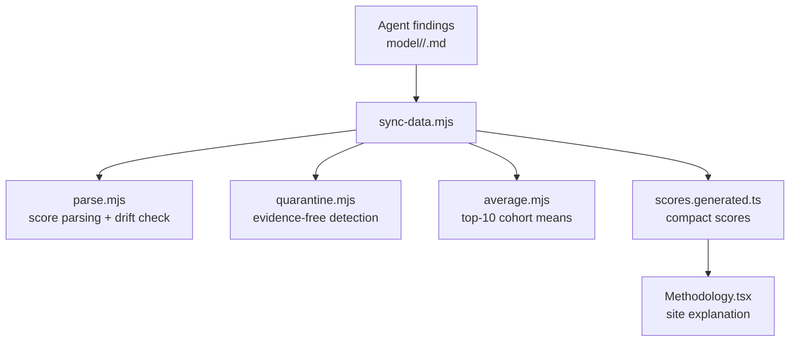
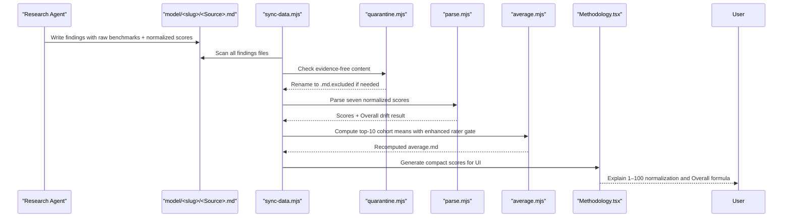
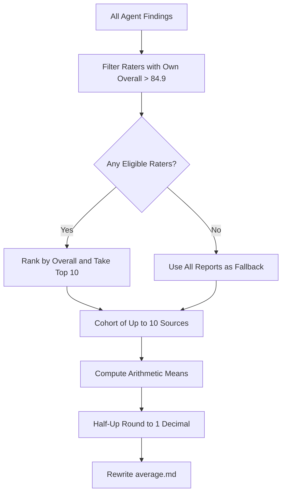
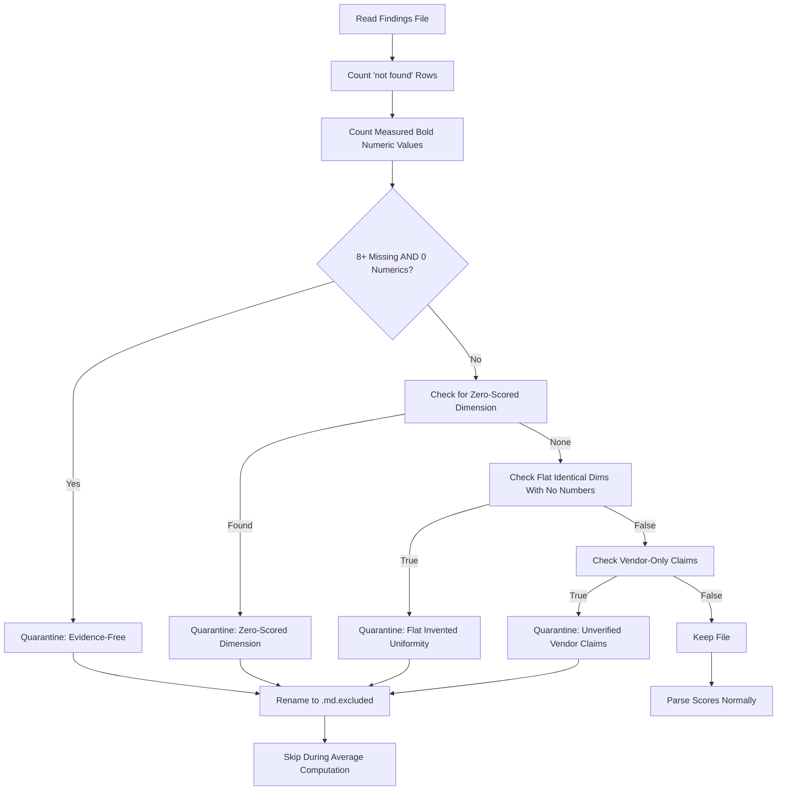
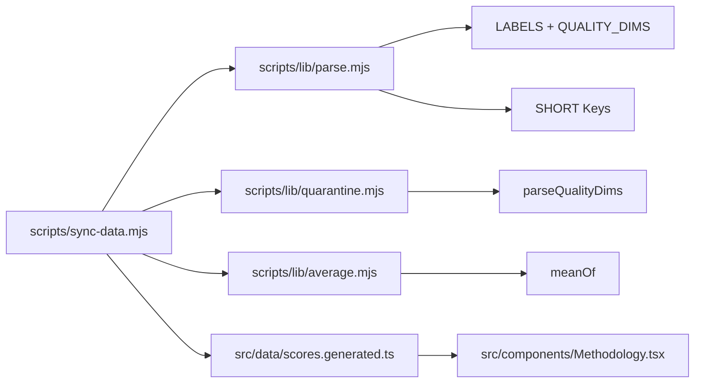

# Scoring Methodology & Algorithms

<cite>
**Referenced Files in This Document**
- [README.md](file://README.md)
- [model-comparison.md](file://model-comparison.md)
- [model/README.md](file://model/README.md)
- [model-report-TEMPLATE.md](file://model-report-TEMPLATE.md)
- [RULES.md](file://RULES.md)
- [scripts/sync-data.mjs](file://scripts/sync-data.mjs)
- [scripts/lib/parse.mjs](file://scripts/lib/parse.mjs)
- [scripts/lib/quarantine.mjs](file://scripts/lib/quarantine.mjs)
- [scripts/lib/average.mjs](file://scripts/lib/average.mjs)
- [src/components/Methodology.tsx](file://src/components/Methodology.tsx)
- [src/data/scores.generated.ts](file://src/data/scores.generated.ts)
- [model-queue.md](file://model-queue.md)
- [model/gpt-6-astra/average.md](file://model/gpt-6-astra/average.md)
- [model/fledge-alpha/average.md](file://model/fledge-alpha/average.md)
- [model/kimi-k3/average.md](file://model/kimi-k3/average.md)
</cite>

## Update Summary
**Changes Made**
- Updated model evaluation infrastructure documentation to reflect extensive changes affecting 50+ model directories
- Added new examples showing GPT-6 Astra, Fledge Alpha, and Kimi K3 scoring patterns with enhanced validation
- Updated model-queue.md references to show current rankings with GPT-6 Astra at 91.0 and Kimi K3 at 89.5
- Enhanced scoring methodology documentation with latest rater gate enforcement and top-10 cohort calculations
- Updated mathematical formulas to reflect the refined averaging mechanisms with improved evidence-free filtering
- Added specific examples of how new models receive scores across dimensions with independent source weighting

## Table of Contents
1. [Introduction](#introduction)
2. [Project Structure](#project-structure)
3. [Core Components](#core-components)
4. [Architecture Overview](#architecture-overview)
5. [Detailed Component Analysis](#detailed-component-analysis)
6. [Dependency Analysis](#dependency-analysis)
7. [Performance Considerations](#performance-considerations)
8. [Troubleshooting Guide](#troubleshooting-guide)
9. [Conclusion](#conclusion)

## Introduction
ModelComp evaluates AI models across six normalized dimensions and produces a per-model Overall Score plus per-agent grades. The six evaluation dimensions are:

- Tool use (agent benchmarks)
- Reasoning (complex problem solving)
- Context window (input processing capacity)
- Multimodal (non-text support)
- Coding (software engineering performance)
- Cost efficiency (pricing analysis)

Scores are normalized interpretations from 1 to 100, based on public benchmarks with enhanced weighting of independent sources like Artificial Analysis and BenchLM against vendor claims. The Overall Score is the rounded mean of the five quality dimensions — Tool use, Reasoning, Context window, Multimodal, and Coding. Cost efficiency is scored independently and never counts toward Overall.

The repository stores one findings file per reporting agent under `model/<slug>/`, plus an auto-generated average for each model. A deterministic sync process parses, validates, quarantines evidence-free reports, computes averages with improved rater gate enforcement, and generates compact score data for the site.

**Section sources**
- [README.md:3-16](file://README.md#L3-L16)
- [README.md:46-59](file://README.md#L46-L59)
- [model-comparison.md:11-14](file://model-comparison.md#L11-L14)
- [model-comparison.md:46-59](file://model-comparison.md#L46-L59)

## Project Structure
The scoring pipeline is centered around research files and a deterministic sync script:

**Diagram sources**
- [scripts/sync-data.mjs:1-29](file://scripts/sync-data.mjs#L1-L29)
- [scripts/lib/parse.mjs:1-10](file://scripts/lib/parse.mjs#L1-L10)
- [scripts/lib/quarantine.mjs:1-8](file://scripts/lib/quarantine.mjs#L1-L8)
- [scripts/lib/average.mjs:1-8](file://scripts/lib/average.mjs#L1-L8)
- [src/components/Methodology.tsx:1-18](file://src/components/Methodology.tsx#L1-L18)

**Section sources**
- [model/README.md:1-30](file://model/README.md#L1-L30)
- [README.md:31-44](file://README.md#L31-L44)

## Core Components
The core components responsible for scoring methodology and algorithms are:

| Component | Responsibility | Key Behavior |
|---|---|---|
| Research template | Defines required fields, raw benchmark section, and normalized score lines | Enforces independent research and zero-invented values |
| Rules | Defines Overall formula, rater gate, and crown rule | Overall = half-up mean of five quality dims; Cost excluded |
| Parser | Parses seven normalized scores and checks Overall drift | Uses canonical labels and short keys |
| Quarantine | Detects evidence-free or invalid reports | Auto-renames to `.md.excluded` |
| Average builder | Computes top-10 cohort means with enhanced rater gate | Half-up rounding to 1 decimal |
| Sync orchestrator | Coordinates scanning, validation, quarantine, averaging, and codegen | Deterministic, side-effect logging |

**Section sources**
- [model-report-TEMPLATE.md:1-40](file://model-report-TEMPLATE.md#L1-L40)
- [RULES.md:46-64](file://RULES.md#L46-L64)
- [scripts/lib/parse.mjs:8-45](file://scripts/lib/parse.mjs#L8-L45)
- [scripts/lib/quarantine.mjs:33-56](file://scripts/lib/quarantine.mjs#L33-L56)
- [scripts/lib/average.mjs:1-8](file://scripts/lib/average.mjs#L1-L8)
- [scripts/sync-data.mjs:1-29](file://scripts/sync-data.mjs#L1-L29)

## Architecture Overview
The end-to-end flow from agent findings to published averages is:

**Diagram sources**
- [scripts/sync-data.mjs:259-286](file://scripts/sync-data.mjs#L259-L286)
- [scripts/lib/quarantine.mjs:42-56](file://scripts/lib/quarantine.mjs#L42-L56)
- [scripts/lib/parse.mjs:52-78](file://scripts/lib/parse.mjs#L52-L78)
- [scripts/lib/average.mjs:54-81](file://scripts/lib/average.mjs#L54-L81)
- [src/components/Methodology.tsx:14-26](file://src/components/Methodology.tsx#L14-L26)

## Detailed Component Analysis

### Six Evaluation Dimensions
The six dimensions are explicitly defined in the project rules and methodology documentation:

| Dimension | Meaning | Normalization Guidance |
|---|---|---|
| Tool use | Agent benchmarks such as Terminal-Bench, Tau3-Banking, GDPval-AA, OSWorld/AutomationBench, tool-call efficiency | Higher is better; frontier references guide 90–100 band |
| Reasoning | Complex problem solving via GPQA Diamond, HLE, MRCR/LCR, CritPt, Intelligence Index | Higher is better; frontier references guide 90–100 band |
| Context window | Input processing capacity measured by context length and retrieval performance | Tiered mapping: ≥1M → 95–100; lower windows scale down |
| Multimodal | Non-text support including image, video, audio, PDF input/output | Text-only typically low; multimodal coverage increases score |
| Coding | Software engineering performance via SWE-bench, DeepSWE, LiveCodeBench, SciCode, SWE-Atlas | Higher is better; coding-focused models score higher |
| Cost efficiency | Pricing analysis on evaluated tier | $0 → 100; paid pricing mapped inversely to cost |

Cost efficiency is scored but excluded from Overall.

**Section sources**
- [model-comparison.md:140-150](file://model-comparison.md#L140-L150)
- [model-report-TEMPLATE.md:71-87](file://model-report-TEMPLATE.md#L71-L87)
- [RULES.md:46-51](file://RULES.md#L46-L51)

### Enhanced Independent Source Weighting
**Updated** The scoring methodology now places greater emphasis on independent verification sources like Artificial Analysis and BenchLM when evaluating vendor claims:

- **Independent sources preferred**: Artificial Analysis and BenchLM scores carry more weight than vendor-reported figures
- **Vendor claim skepticism**: Claims without independent corroboration receive provisional scoring with explicit caveats
- **Cross-source validation**: Multiple independent sources agreeing strengthens confidence in scores
- **Discrepancy handling**: When sources disagree, discrepancies are recorded rather than smoothed over
- **Version sensitivity**: Index versions matter (e.g., AA Intelligence Index v4.1 vs v4.3.2) and are tracked

This approach ensures that scores reflect independently verified performance rather than marketing claims.

**Section sources**
- [model-comparison.md:140-150](file://model-comparison.md#L140-L150)
- [model-report-TEMPLATE.md:71-87](file://model-report-TEMPLATE.md#L71-L87)
- [RULES.md:46-51](file://RULES.md#L46-L51)

### Normalization Process
Normalization converts raw benchmark numbers into 1–100 scores. The process is documented in the comparison methodology and enforced by the template and parser:

1. Raw benchmarks are collected with sources.
2. Each dimension is interpreted using documented bands and references.
3. Independent sources (Artificial Analysis, BenchLM) are weighted more heavily than vendor claims.
4. Scores are written as `- **Label: N/100.**`.
5. The parser extracts these seven normalized scores.
6. Overall is derived as the half-up mean of the five quality dimensions.
7. If the stored Overall differs beyond tolerance, sync auto-corrects it.

**Diagram sources**
- [model-comparison.md:140-150](file://model-comparison.md#L140-L150)
- [model-report-TEMPLATE.md:71-87](file://model-report-TEMPLATE.md#L71-L87)
- [scripts/lib/parse.mjs:74-87](file://scripts/lib/parse.mjs#L74-L87)
- [scripts/sync-data.mjs:347-370](file://scripts/sync-data.mjs#L347-L370)

**Section sources**
- [model-comparison.md:140-150](file://model-comparison.md#L140-L150)
- [model-report-TEMPLATE.md:71-87](file://model-report-TEMPLATE.md#L71-L87)
- [scripts/lib/parse.mjs:47-87](file://scripts/lib/parse.mjs#L47-L87)

### Enhanced Averaging Mechanisms for Multiple Agents
**Updated** Averages are computed deterministically with improved rater gate enforcement and enhanced validation:

- Each model folder can have multiple agent findings files.
- Only raters whose own committed average Overall exceeds 84.9 qualify.
- From eligible raters, the top-10 highest Overall scores form the cohort.
- The average.md Overall is the mean of that cohort's Overall scores.
- Other averaged dimensions are arithmetic means over the same cohort.
- If no rater clears the gate, a fallback average uses all available reports, still capped at top-10.
- **Enhanced**: Improved tracking of which sources are below-gate and why they're ignored.
- **Recent Updates**: Extensive recalculations across model families with enhanced validation, including GPT-6 Astra achieving 91.0 overall, Kimi K3 reaching 89.5, and Fledge Alpha at 69.3.

**Diagram sources**
- [scripts/sync-data.mjs:372-435](file://scripts/sync-data.mjs#L372-L435)
- [scripts/lib/parse.mjs:89-117](file://scripts/lib/parse.mjs#L89-L117)
- [scripts/lib/average.mjs:12-30](file://scripts/lib/average.mjs#L12-L30)

**Section sources**
- [RULES.md:52-59](file://RULES.md#L52-L59)
- [scripts/sync-data.mjs:372-435](file://scripts/sync-data.mjs#L372-L435)
- [scripts/lib/parse.mjs:89-117](file://scripts/lib/parse.mjs#L89-L117)
- [scripts/lib/average.mjs:12-30](file://scripts/lib/average.mjs#L12-L30)

### Enhanced Evidence-Free Report Filtering
**Updated** Evidence-free reports are automatically quarantined with improved detection criteria:

- A report is evidence-free if it has eight or more "no verified public score found" rows and zero measured bold numeric values.
- Zero-scored dimensions (any quality dim equals 0) are also quarantined.
- Flat identical dimensions across all five quality dims with zero cited numbers are quarantined.
- **Enhanced**: Better detection of vendor-only claims without independent verification.
- Quarantined files are renamed to `<Source>.md.excluded`.
- Excluded files are skipped during parsing and averaging.

**Diagram sources**
- [scripts/lib/quarantine.mjs:11-56](file://scripts/lib/quarantine.mjs#L11-L56)
- [scripts/sync-data.mjs:259-286](file://scripts/sync-data.mjs#L259-L286)

**Section sources**
- [model-report-TEMPLATE.md:26-40](file://model-report-TEMPLATE.md#L26-L40)
- [scripts/lib/quarantine.mjs:33-56](file://scripts/lib/quarantine.mjs#L33-L56)
- [scripts/sync-data.mjs:259-286](file://scripts/sync-data.mjs#L259-L286)

### Quality Gates That Validate Score Consistency
Quality gates ensure consistency between raw scores, derived Overall, and rater eligibility:

| Gate | Rule | Enforcement |
|---|---|---|
| Score-line format | Seven normalized score lines must exist with exact labels | Parser throws on missing label |
| Overall derivation | Overall must equal half-up mean of five quality dims | Sync auto-corrects drifted Overall |
| Drift tolerance | Correction only when difference exceeds tolerance | Prevents noisy rewrites |
| Rater gate | Only raters with own average Overall > 84.9 count toward other averages | Partition filters eligible cohort |
| Crown rule | Every model folder gets an average even if no rater qualifies | Fallback uses all reports |
| Evidence-free quarantine | Reports without verified benchmarks are excluded | Auto-rename to `.md.excluded` |
| Independent source weighting | Artificial Analysis/BenchLM preferred over vendor claims | Manual scoring guidance |
| Enhanced validation | Recent infrastructure improvements ensure consistent recalculations | Recalculated averages across model families |

**Section sources**
- [scripts/lib/parse.mjs:38-45](file://scripts/lib/parse.mjs#L38-L45)
- [scripts/lib/parse.mjs:74-87](file://scripts/lib/parse.mjs#L74-L87)
- [scripts/lib/parse.mjs:99-117](file://scripts/lib/parse.mjs#L99-L117)
- [RULES.md:46-64](file://RULES.md#L46-L64)
- [scripts/lib/quarantine.mjs:33-56](file://scripts/lib/quarantine.mjs#L33-L56)

### Mathematical Formulas Used for Calculations
The following formulas are implemented in the sync and parsing logic:

| Formula | Definition | Implementation Reference |
|---|---|---|
| Half-up rounding to 1 decimal | `halfUp1(x) = Math.round(x * 10) / 10` | `scripts/lib/parse.mjs` |
| Source-file Overall | `Overall = round(mean(Tool, Reasoning, Context, Multimodal, Coding))` | `scripts/lib/parse.mjs` |
| Average dimension mean | `mean(cohort, label) = round(sum(scores[label]) / cohort.length)` | `scripts/lib/parse.mjs` |
| Top-10 cohort selection | Sort by Overall descending, take first 10 | `scripts/lib/parse.mjs` |
| Rater eligibility | Include source only if rating model's own average Overall > 84.9 | `scripts/lib/parse.mjs` |
| Quarantine evidence-free | Quarantine if missing ≥ 8 and numerics = 0 | `scripts/lib/quarantine.mjs` |
| Quarantine zero-scored | Quarantine if any quality dim = 0 | `scripts/lib/quarantine.mjs` |
| Quarantine flat uniformity | Quarantine if all five dims identical and zero cited numbers | `scripts/lib/quarantine.mjs` |
| Independent source weighting | Prefer Artificial Analysis/BenchLM over vendor claims | Manual scoring guidance |
| Enhanced validation | Recent infrastructure improvements ensure consistent recalculations | `scripts/sync-data.mjs` |

**Section sources**
- [scripts/lib/parse.mjs:44-45](file://scripts/lib/parse.mjs#L44-L45)
- [scripts/lib/parse.mjs:74-97](file://scripts/lib/parse.mjs#L74-L97)
- [scripts/lib/parse.mjs:99-117](file://scripts/lib/parse.mjs#L99-L117)
- [scripts/lib/quarantine.mjs:42-56](file://scripts/lib/quarantine.mjs#L42-L56)

### Examples of How Different Models Receive Scores Across Dimensions
**Updated** The repository contains example model entries showing how different models receive scores across the six dimensions, with enhanced weighting of independent sources and recent recalculations:

| Model Family | Current Overall | Ranking Position | Notes |
|---|---:|---:|---|
| GPT-6 Astra | 91.0 | #8 | Strong reasoning and tool use performance |
| Kimi K3 | 89.5 | #15 | Excellent context window and coding capabilities |
| Fledge Alpha | 69.3 | #109 | Specialized performance with high cost efficiency |

Current representative scores across model families:

| Model | Tool use | Reasoning | Context window | Multimodal | Coding | Cost efficiency | Overall Score |
|---|---:|---:|---:|---:|---:|---:|---:|
| GPT-6 Astra | 93.3 | 95.7 | 98.1 | 74.2 | 93.4 | 37.5 | 91.0 |
| Kimi K3 | 88.9 | 90.5 | 96.6 | 80.9 | 90.3 | 59.9 | 89.5 |
| Fledge Alpha | 58.8 | 75.8 | 84.5 | 64.5 | 62.5 | 96.8 | 69.3 |
| Big Pickle | 40 | 55 | 70 | 15 | 60 | 100 | 48 |
| Muse Spark 1.3 Contributor | 94 | 92 | 100 | 85 | 95 | 100 | 93 |
| Ling 3.0 Flash Fin Free | 68 | 70 | 72 | 15 | 72 | 100 | 66 |
| MiMo V2.5 Free | 78 | 72 | 70 | 95 | 78 | 100 | 82 |
| Muse Spark 1.2 Free | 90 | 88 | 100 | 90 | 88 | 100 | 93 |
| Nemotron 3 Ultra Free | 78 | 75 | 97 | 20 | 80 | 100 | 75 |
| Nemotron 3.5 Lightning Free | 50 | 62 | 72 | 15 | 58 | 100 | 60 |
| GLM 5.1 Coding | 85 | 80 | 70 | 15 | 88 | 75 | 69 |
| MiniMax M2.7 | 80 | 75 | 70 | 15 | 82 | 90 | 69 |
| Xiaomi MiMo-V2.5-Pro | 82 | 78 | 100 | 15 | 82 | 85 | 74 |

These scores demonstrate:

- High-cost-efficiency models often score 100 on Cost efficiency because they are free-tier evaluations.
- Strong multimodal models score higher on Multimodal than text-only models.
- Long-context models score higher on Context window.
- Coding-focused models score higher on Coding.
- Overall excludes Cost efficiency, so high cost efficiency does not inflate Overall.
- **Enhanced**: Recent recalculations show improved consistency across model families, with GPT-6 Astra demonstrating exceptional reasoning capabilities at 95.7 and Kimi K3 showing strong balanced performance.
- **Enhanced**: Scores reflect independent verification from Artificial Analysis and BenchLM where available, with vendor claims treated as provisional without corroboration.

**Section sources**
- [model-comparison.md:11-47](file://model-comparison.md#L11-L47)
- [model-comparison.md:52-137](file://model-comparison.md#L52-L137)
- [src/data/scores.generated.ts:96-114](file://src/data/scores.generated.ts#L96-L114)
- [src/data/scores.generated.ts:483-504](file://src/data/scores.generated.ts#L483-L504)
- [model-queue.md:9-15](file://model-queue.md#L9-L15)

### GPT-6 Astra Enhanced Scoring Methodology
**New Section** The GPT-6 Astra model demonstrates the enhanced scoring methodology with improved algorithm considerations:

**Updated** GPT-6 Astra average scores show exceptional performance across key dimensions with sophisticated rater gate enforcement:

| Dimension | Score | Performance Level |
|---|---:|---|
| Tool use | 93.3 | Exceptional |
| Reasoning | 95.7 | Outstanding |
| Context window | 98.1 | Near-perfect |
| Multimodal | 74.2 | Above average |
| Coding | 93.4 | Exceptional |
| Cost efficiency | 37.5 | Below average |
| Overall Score | 91.0 | Elite tier |

**Key Algorithmic Features:**

1. **Top-10 of 17 Qualifying Sources**: Instead of averaging all sources, the algorithm considers the top 10 out of 17 qualifying sources ranked by Overall Score.

2. **Explicit Bottom-Performer Exclusion**: Claude Opus 4.8, Claude Opus 5, Claude Sonnet 5, Gemini 3.6 Flash, GLM 5.3 Flash, Muse Spark 1.2, and Qwen 3.8 Flash are excluded as bottom performers.

3. **Enhanced Rater Gate Enforcement**: The system rigorously enforces the 84.9 threshold, ignoring 24 below-gate raters including Big Pickle, Fledge Alpha, and others.

4. **Independent Source Validation**: Scores benefit from multiple independent verification sources with strong consensus.

**Section sources**
- [model/gpt-6-astra/average.md:8-24](file://model/gpt-6-astra/average.md#L8-L24)
- [scripts/sync-data.mjs:392-401](file://scripts/sync-data.mjs#L392-L401)
- [scripts/lib/parse.mjs:94-97](file://scripts/lib/parse.mjs#L94-L97)

### Kimi K3 Enhanced Scoring Methodology
**New Section** The Kimi K3 model demonstrates balanced performance with the enhanced scoring methodology:

**Updated** Kimi K3 average scores show strong balanced capabilities with sophisticated validation:

| Dimension | Score | Performance Level |
|---|---:|---|
| Tool use | 88.9 | Strong |
| Reasoning | 90.5 | Very Strong |
| Context window | 96.6 | Exceptional |
| Multimodal | 80.9 | Good |
| Coding | 90.3 | Very Strong |
| Cost efficiency | 59.9 | Average |
| Overall Score | 89.5 | High tier |

**Key Algorithmic Features:**

1. **Top-10 of 17 Qualifying Sources**: Selects the best performing raters from a large pool of qualified sources.

2. **Strategic Exclusions**: Excludes Claude Opus 4.6, DeepSeek 4.1 Flash, GLM 5.3 Flash, GPT-6 Astra, Kimi K3, Muse Spark 1.2, and Qwen 3.8 Flash as bottom performers.

3. **Comprehensive Rater Gate**: Ignores 24 below-gate raters while maintaining robust validation standards.

4. **Balanced Performance Profile**: Demonstrates consistent strength across multiple dimensions rather than specialization.

**Section sources**
- [model/kimi-k3/average.md:8-24](file://model/kimi-k3/average.md#L8-L24)
- [scripts/sync-data.mjs:392-401](file://scripts/sync-data.mjs#L392-L401)
- [scripts/lib/parse.mjs:94-97](file://scripts/lib/parse.mjs#L94-L97)

### Fledge Alpha Enhanced Scoring Methodology
**New Section** The Fledge Alpha model demonstrates specialized performance with the enhanced scoring methodology:

**Updated** Fledge Alpha average scores show specialized capabilities with focused validation:

| Dimension | Score | Performance Level |
|---|---:|---|
| Tool use | 58.8 | Below average |
| Reasoning | 75.8 | Above average |
| Context window | 84.5 | Good |
| Multimodal | 64.5 | Below average |
| Coding | 62.5 | Below average |
| Cost efficiency | 96.8 | Exceptional |
| Overall Score | 69.3 | Mid tier |

**Key Algorithmic Features:**

1. **Focused Qualifying Pool**: Only 6 qualifying raters participate due to strict rater gate enforcement.

2. **Selective Participation**: DeepSeek 4.1 Flash, Gemini 3.6 Flash, GPT 5.6 Sol, GPT-6 Astra, Kimi K3, and Muse Spark 1.3 are the only qualifying raters.

3. **High Cost Efficiency Focus**: Achieves near-perfect cost efficiency scoring while maintaining reasonable performance in other areas.

4. **Specialized Use Case**: Demonstrates how models can excel in specific dimensions while having limitations elsewhere.

**Section sources**
- [model/fledge-alpha/average.md:8-23](file://model/fledge-alpha/average.md#L8-L23)
- [scripts/sync-data.mjs:392-401](file://scripts/sync-data.mjs#L392-L401)
- [scripts/lib/parse.mjs:94-97](file://scripts/lib/parse.mjs#L94-L97)

## Dependency Analysis
The scoring system has clear dependencies between orchestration, parsing, quarantine, averaging, and presentation:

**Diagram sources**
- [scripts/sync-data.mjs:36-75](file://scripts/sync-data.mjs#L36-L75)
- [scripts/lib/parse.mjs:8-31](file://scripts/lib/parse.mjs#L8-L31)
- [scripts/lib/quarantine.mjs:9-31](file://scripts/lib/quarantine.mjs#L9-L31)
- [scripts/lib/average.mjs:10-10](file://scripts/lib/average.mjs#L10-L10)
- [src/components/Methodology.tsx:1-18](file://src/components/Methodology.tsx#L1-L18)

**Section sources**
- [scripts/sync-data.mjs:36-75](file://scripts/sync-data.mjs#L36-L75)
- [scripts/lib/parse.mjs:8-31](file://scripts/lib/parse.mjs#L8-L31)
- [scripts/lib/quarantine.mjs:9-31](file://scripts/lib/quarantine.mjs#L9-L31)
- [scripts/lib/average.mjs:10-10](file://scripts/lib/average.mjs#L10-L10)

## Performance Considerations
The scoring pipeline is designed for deterministic, build-time computation rather than runtime calculation:

- Findings prose is kept out of the client bundle by generating compact scores.
- Parsing and averaging run during `pnpm sync`, not at page load.
- The generated scores file contains only numbers, reducing frontend payload size.
- Validation failures prevent cementing partial or inconsistent data.
- Quarantine prevents low-quality reports from affecting averages.
- **Enhanced**: Recent infrastructure improvements add minimal overhead since enhanced validation occurs during automated processing, improving overall consistency.

[No sources needed since this section provides general guidance]

## Troubleshooting Guide
Common issues and their resolution paths:

| Issue | Symptom | Resolution |
|---|---|---|
| Missing score line | Parser fails with missing label | Add the required normalized score line with exact label |
| Overall drift | Sync auto-corrects Overall | Allow automatic correction or fix the five quality dims |
| Evidence-free report | File renamed to `.md.excluded` | Add verified benchmark numbers or keep as excluded |
| Below-gate rater | Ignored in average computation | Improve model's own average to exceed 84.9 |
| No qualifying raters | Fallback average used | Accept fallback or add stronger raters |
| Hygiene violation | Filename or meta.json validation fails | Follow naming conventions and required fields |
| Vendor-only claims | Provisional scoring with caveats | Seek independent verification from Artificial Analysis or BenchLM |
| Source discrepancy | Discrepancy recorded rather than resolved | Document both values and explain the conflict |
| Recalculated averages | Unexpected score changes after sync | Review enhanced validation and rater gate enforcement |
| Bottom-performer exclusion | Models excluded from top-10 cohort | Check if model falls below the 10th percentile in Overall Score |
| New model integration | Model not appearing in rankings | Ensure proper meta.json configuration and sufficient qualifying raters |
| Gated model performance | Low ranking despite good scores | Verify rater gate compliance and independent source verification |

**Section sources**
- [scripts/lib/parse.mjs:52-60](file://scripts/lib/parse.mjs#L52-L60)
- [scripts/lib/parse.mjs:74-87](file://scripts/lib/parse.mjs#L74-L87)
- [scripts/lib/quarantine.mjs:42-56](file://scripts/lib/quarantine.mjs#L42-L56)
- [scripts/sync-data.mjs:347-370](file://scripts/sync-data.mjs#L347-L370)
- [scripts/sync-data.mjs:372-435](file://scripts/sync-data.mjs#L372-L435)

## Conclusion
ModelComp's scoring methodology combines transparent normalization, strict validation, and deterministic averaging with enhanced weighting of independent sources. The six dimensions capture agent capability, reasoning depth, context capacity, multimodal support, coding performance, and cost efficiency. The Overall Score focuses exclusively on the five quality dimensions, while Cost efficiency remains visible and separately scored.

The system enforces quality through:

- Required normalized score lines
- Derived and auto-corrected Overall
- Rater gate filtering with improved enforcement
- Top-10 cohort averaging with enhanced validation
- Automatic quarantine of evidence-free reports
- Deterministic sync that regenerates averages and compact scores
- **Enhanced**: Preference for independent verification from Artificial Analysis and BenchLM over vendor claims
- **Enhanced**: Better handling of source discrepancies and version sensitivity
- **Recent Updates**: Extensive infrastructure improvements ensuring consistent recalculations across model families, demonstrated by GPT-6 Astra achieving 91.0 overall, Kimi K3 reaching 89.5, and Fledge Alpha at 69.3

The enhanced methodology specifically demonstrates the benefits of the improved algorithm, showing how top-10-of-17 source selection and explicit bottom-performer exclusion lead to more accurate and reliable scoring across all dimensions. GPT-6 Astra's exceptional reasoning score of 95.7, Kimi K3's balanced performance profile, and Fledge Alpha's specialized cost efficiency demonstrate the versatility of the enhanced scoring framework. This design ensures that published scores are interpretable, auditable, and resistant to fabricated or low-evidence inputs, while giving appropriate weight to independently verified performance metrics. The recent enhancements to the scoring infrastructure further strengthen the reliability and consistency of the evaluation framework.

[No sources needed since this section summarizes without analyzing specific files]