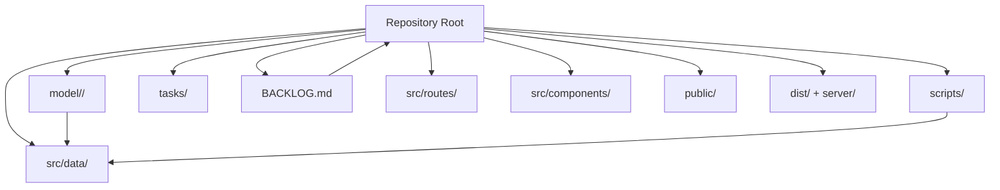
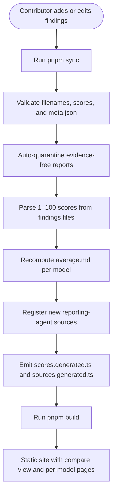
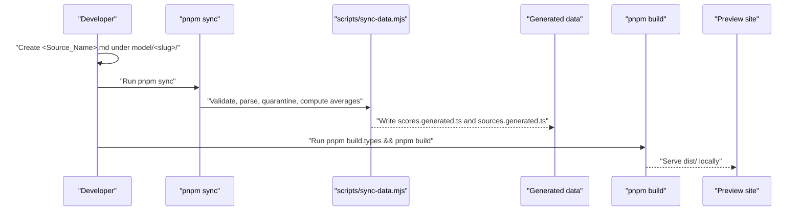
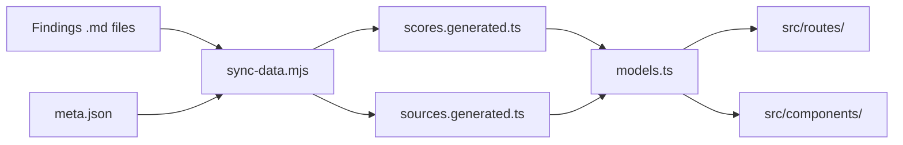

# Getting Started

<cite>
**Referenced Files in This Document**
- [README.md](file://README.md)
- [package.json](file://package.json)
- [model/README.md](file://model/README.md)
- [tasks/sync-data.md](file://tasks/sync-data.md)
- [scripts/sync-data.mjs](file://scripts/sync-data.mjs)
- [src/data/models.ts](file://src/data/models.ts)
- [BACKLOG.md](file://BACKLOG.md)
</cite>

## Update Summary
**Changes Made**
- Added reference to new BACKLOG.md centralized improvement tracking system
- Updated project structure section to include BACKLOG.md
- Enhanced troubleshooting section with information about the new backlog system
- Added context about the retirement of GLM53F_IMP.md and IMPROVEMENTS.md files

## Table of Contents
1. [Introduction](#introduction)
2. [Project Structure](#project-structure)
3. [Core Components](#core-components)
4. [Architecture Overview](#architecture-overview)
5. [Detailed Component Analysis](#detailed-component-analysis)
6. [Dependency Analysis](#dependency-analysis)
7. [Performance Considerations](#performance-considerations)
8. [Troubleshooting Guide](#troubleshooting-guide)
9. [Conclusion](#conclusion)

## Introduction
ModelComp is a static site that compares AI coding models side by side across tool use, reasoning, context window, multimodal support, coding ability, and cost efficiency. Instead of hardcoding scores into the UI, ModelComp parses research findings at build time from Markdown files under `model/<slug>/`. Each model folder contains:
- One findings file per reporting agent (for example, one `.md` per evaluator).
- A generated `average.md` with arithmetic means recomputed by the sync script.
- A curated `meta.json` describing display metadata such as name, context window, modalities, and pricing notes.

The site provides a compare view where you can pick up to three models, switch between the average mix and individual reporting agents, inspect the hexagon chart, exact-scores table, and model cards. Every model also gets its own detail page at `/model/<slug>/`.

This getting started guide explains how to install ModelComp, set up your environment, run the basic development commands, understand the project structure, add new model data without editing source code, and troubleshoot common setup issues.

**Section sources**
- [README.md:1-16](file://README.md#L1-L16)

## Project Structure
At a high level, ModelComp is organized around data-driven pages built with Qwik City and Vite:

- `model/<slug>/`: Per-model research folders containing findings files, `average.md`, and `meta.json`.
- `src/routes/`: File-based routes for the homepage compare view and per-model detail pages.
- `src/components/`: UI components such as the compare section, hexagon radar, model cards, methodology panel, header, theme toggle, and footer.
- `src/data/models.ts`: Data layer that hydrates models from pre-parsed scores and meta files.
- `src/data/sources.generated.ts`: Auto-generated registry of reporting agents.
- `src/data/scores.generated.ts`: Auto-generated compact score index used by the client bundle.
- `scripts/sync-data.mjs`: Deterministic sync script behind `pnpm sync`.
- `tasks/sync-data.md`: Human workflow documentation for running sync safely.
- `BACKLOG.md`: Centralized living improvement backlog tracking open items and standing decisions.
- `public/`: Static assets like the PWA manifest and brand favicon.
- `dist/` and `server/`: Build output directories produced by the build process.

**Diagram sources**
- [README.md:61-82](file://README.md#L61-L82)
- [model/README.md:1-30](file://model/README.md#L1-L30)
- [BACKLOG.md:1-44](file://BACKLOG.md#L1-L44)

**Section sources**
- [README.md:61-82](file://README.md#L61-L82)
- [model/README.md:1-30](file://model/README.md#L1-L30)
- [BACKLOG.md:1-44](file://BACKLOG.md#L1-L44)

## Core Components
ModelComp's core workflow revolves around four main areas:

1. **Research data**: Findings files under `model/<slug>/` describe each reporting agent's evaluation of a model.
2. **Sync pipeline**: `pnpm sync` validates, parses, quarantines evidence-free reports, recomputes averages, registers new sources, and emits generated TypeScript files.
3. **Data hydration**: `src/data/models.ts` imports generated scores and source definitions, then builds the runtime `MODELS` array used by the UI.
4. **Build and preview**: `pnpm dev`, `pnpm build`, and `pnpm preview` drive the Qwik/Vite development and production workflows.

Key responsibilities:
- `scripts/sync-data.mjs` scans model folders, enforces naming hygiene, auto-quarantines weak reports, recomputes `average.md`, updates the source registry, and writes `scores.generated.ts`.
- `src/data/models.ts` reads generated scores and `meta.json` files to construct typed model objects, dimension definitions, virtual sort views, and the results-source dropdown order.
- `tasks/sync-data.md` documents the human checklist and invariants around sync behavior.
- `BACKLOG.md` serves as the single source of truth for open improvement items and standing decisions, replacing the previous scattered improvement tracking system.

**Section sources**
- [scripts/sync-data.mjs:1-30](file://scripts/sync-data.mjs#L1-L30)
- [src/data/models.ts:6-16](file://src/data/models.ts#L6-L16)
- [tasks/sync-data.md:19-63](file://tasks/sync-data.md#L19-L63)
- [BACKLOG.md:1-44](file://BACKLOG.md#L1-L44)

## Architecture Overview
The data flow is intentionally designed so contributors never edit application source code when adding or updating model evaluations. The typical path is:

**Diagram sources**
- [README.md:31-44](file://README.md#L31-L44)
- [scripts/sync-data.mjs:1-30](file://scripts/sync-data.mjs#L1-L30)
- [tasks/sync-data.md:19-63](file://tasks/sync-data.md#L19-L63)

## Detailed Component Analysis

### Installation and Environment Setup
ModelComp uses pnpm as its package manager and requires Node.js version 18.17 or newer. Before installing dependencies, make sure your environment meets these requirements:

- Install pnpm if it is not already available on your system.
- Use Node.js version 18.17 or higher.
- Clone or open the repository at the workspace root.

Once installed, install dependencies with pnpm. The project declares its package manager and engine constraints in the package configuration, so using pnpm ensures consistent dependency resolution and lockfile behavior.

**Section sources**
- [README.md:18-29](file://README.md#L18-L29)
- [package.json:1-10](file://package.json#L1-L10)

### Basic Development Workflow
After installation, the most important commands are:

| Command | Purpose |
|---|---|
| `pnpm dev` | Starts the development server in SSR mode. |
| `pnpm sync` | Runs deterministic data synchronization: recomputes averages, registers new sources, validates findings and `meta.json`. |
| `pnpm build.types` | Runs TypeScript type checking with no emit; errors must be fixed before building. |
| `pnpm build` | Builds types, client, server, and static site output into `dist/`. |
| `pnpm preview` | Serves the last production build locally. |

The recommended standard workflow after any data change is:

1. Run `pnpm sync`.
2. Run `pnpm build.types`.
3. Run `pnpm build`.
4. Optionally run `pnpm preview` to verify the production output.

For large repositories, `pnpm sync:quiet` runs the same checks and writes but prints only failure lines and the final summary.

**Section sources**
- [README.md:18-29](file://README.md#L18-L29)
- [package.json:11-24](file://package.json#L11-L24)
- [tasks/sync-data.md:8-17](file://tasks/sync-data.md#L8-L17)

### How to Add New Model Data Without Editing Source Code
ModelComp is designed so you do not edit `src/` code when adding model data. All wiring is automatic once you follow the data conventions.

#### Adding a New Reporting Agent's Findings
If an existing model has been evaluated by another reporting agent:

1. Create a findings file named `<Source_Name>.md` inside every relevant `model/<slug>/` folder.
2. Use letters, digits, and underscores in the filename. Version dots are allowed.
3. Follow the findings template and include normalized 1–100 scores for Tool use, Reasoning, Context window, Multimodal, Coding, Cost efficiency, and Overall Score.
4. Run `pnpm sync`. It will:
   - Validate the filename and score format.
   - Recompute `average.md`.
   - Register the new source automatically.
5. Run `pnpm build.types && pnpm build`.

The Results-source dropdown and hexagon will show the new source on the next build without manual code changes.

#### Adding a New Model
To add a completely new model:

1. Create a new folder under `model/<slug>/`.
2. Add one or more findings files for the reporting agents that evaluated this model.
3. Add a `meta.json` file with required fields: `id`, `name`, `short`, `contextWindow`, `modalities`, and `pricingNote`. Optional fields include `pricingTiers`, `freeTierNote`, and `noFreeId`.
4. Run `pnpm sync`. It creates `average.md`, validates metadata, and prepares generated data.
5. Run `pnpm build.types && pnpm build`.

The model appears in selectors, cards, and its own `/model/<slug>/` page automatically.

#### Slug Naming Rules
Slug names are filesystem-safe identifiers for models. Important rules include:

- Version numbers use dots, not hyphens. For example, use `gpt-5.5`, not `gpt-5-5`.
- Hyphen-versioned folders are treated as duplicates of dotted variants.
- Exceptions exist for parameter sizes and codenames, such as `gemma-4-31b`, `qwen-3.8-27b`, `gpt-6-astra`, and experimental suffixes.
- `pnpm sync` fails loudly on invalid slug versions so they are never cemented.

**Section sources**
- [model/README.md:7-16](file://model/README.md#L7-L16)
- [model/README.md:17-30](file://model/README.md#L17-L30)
- [model/README.md:32-57](file://model/README.md#L32-L57)
- [model/README.md:59-77](file://model/README.md#L59-L77)
- [tasks/sync-data.md:19-63](file://tasks/sync-data.md#L19-L63)

### Typical Workflow Example
Here is a practical example of adding a new findings file for an existing model:

1. Decide which model folder receives the new evaluation.
2. Copy the findings template and fill in the model card, raw benchmarks, normalized scores, and signature.
3. Place the file as `<Source_Name>.md` under `model/<slug>/`.
4. Run `pnpm sync`.
5. Review the sync output for `FAIL`, `AUTO`, `WRITE`, `GATE`, or `FALLBACK` messages.
6. Fix any failures reported by sync.
7. Run `pnpm build.types && pnpm build`.
8. Run `pnpm preview` to verify the compare view, hexagon, and per-model page.

**Diagram sources**
- [scripts/sync-data.mjs:1-30](file://scripts/sync-data.mjs#L1-L30)
- [tasks/sync-data.md:19-63](file://tasks/sync-data.md#L19-L63)

**Section sources**
- [model/README.md:59-77](file://model/README.md#L59-L77)
- [tasks/sync-data.md:66-77](file://tasks/sync-data.md#L66-L77)

## Dependency Analysis
ModelComp separates data authoring from application code. The main dependency chain is:

- Research authors write Markdown findings and `meta.json`.
- `scripts/sync-data.mjs` transforms those files into deterministic TypeScript artifacts.
- `src/data/models.ts` consumes generated scores and source definitions.
- Routes and components render the compare view and per-model pages.

**Diagram sources**
- [README.md:31-44](file://README.md#L31-L44)
- [scripts/sync-data.mjs:1-30](file://scripts/sync-data.mjs#L1-L30)
- [src/data/models.ts:6-16](file://src/data/models.ts#L6-L16)

**Section sources**
- [README.md:31-44](file://README.md#L31-L44)
- [src/data/models.ts:6-16](file://src/data/models.ts#L6-L16)

## Performance Considerations
ModelComp avoids shipping full Markdown report prose into the browser bundle. The sync script pre-parses findings files into a compact numeric score index stored in `src/data/scores.generated.ts`. This keeps the client bundle small while preserving detailed research in the repository.

Important performance-related behaviors include:

- Generated score files contain only numbers, not full report text.
- The UI imports hydrated model data rather than reading raw Markdown at runtime.
- `pnpm build.types` catches type errors early, preventing expensive failed builds.
- `pnpm sync:quiet` reduces console noise during large sync runs while preserving the same validation and exit-code contract.

**Section sources**
- [README.md:31-44](file://README.md#L31-L44)
- [src/data/models.ts:6-16](file://src/data/models.ts#L6-L16)
- [tasks/sync-data.md:14-17](file://tasks/sync-data.md#L14-L17)

## Troubleshooting Guide

### Common Setup Issues

| Problem | Likely Cause | Resolution |
|---|---|---|
| Node version error | Using Node below 18.17 | Upgrade Node to 18.17 or newer. |
| pnpm command not found | pnpm is not installed | Install pnpm globally or via your preferred installer. |
| `pnpm sync` fails with FAIL lines | Invalid filename, missing score line, bad `meta.json`, or permanent-file tripwire violation | Read the FAIL lines, fix the reported file, and rerun sync. |
| `pnpm build.types` fails | TypeScript errors in generated or application code | Fix type errors before running `pnpm build`. |
| New model does not appear | Missing `meta.json` or incomplete sync/build | Add `meta.json`, run `pnpm sync`, then rebuild. |
| New source does not appear in dropdown | Sync did not register the source or build was skipped | Rerun `pnpm sync && pnpm build`. |
| Average looks stale | Findings changed but sync was not rerun | Run `pnpm sync` again. |

### Understanding Sync Messages
When running `pnpm sync`, pay attention to these message categories:

- `FAIL`: A hard error requiring human action. Examples include invalid filenames, missing required score lines, malformed `meta.json`, or forbidden deletions of tracked research files.
- `AUTO`: The script corrected something safe, such as an Overall Score drift or an auto-scaffolded `meta.json`.
- `WRITE`: A generated or computed file was rewritten, such as `average.md`, `scores.generated.ts`, or `sources.generated.ts`.
- `SKIP`: A self-excluded findings file was intentionally ignored because it contained no verified benchmarks.
- `GATE`: A rater's report was excluded from averaging because the rater's own overall did not clear the quality gate.
- `FALLBACK`: No qualifying raters were found, so all available reports were averaged instead.

### Improvement Tracking System
ModelComp now uses a centralized improvement backlog system through `BACKLOG.md`. This replaces the previous scattered improvement tracking in `GLM53F_IMP.md` and `IMPROVEMENTS.md`, which were retired on 2026-10-04.

Key aspects of the new system:
- **Open items only**: `BACKLOG.md` tracks current improvement opportunities and standing decisions.
- **Centralized location**: All improvement tracking is consolidated in one place.
- **Historical preservation**: Previous improvement logs remain in git history and `REPORT.md`.
- **Precedence**: `RULES.md` takes precedence over any conflicting backlog items.

Common backlog categories include:
- **Performance**: Client optimization and ranking improvements.
- **Data pipeline**: Sync and processing enhancements.
- **Standing decisions**: Permanent architectural decisions that should not be treated as TODOs.

### Permanence and Deletion Safety
ModelComp protects research history through a permanence tripwire. If a tracked findings file is missing from disk, sync treats it as a potential accidental deletion unless:

- The twin retired file has a fresh replacement without `.excluded`.
- The content was relocated to a sanctioned mirror directory such as `models_voice/` or `models_finance/`.

Do not ignore `FAIL` messages about missing tracked files. Restore or properly relocate the file according to project rules, then rerun sync.

### Checklist After Changes
After making data changes:

1. Run `pnpm sync`.
2. Fix all `FAIL` lines.
3. Run `pnpm build.types`.
4. Run `pnpm build`.
5. Run `pnpm preview` to verify the site.
6. Confirm that new models and sources appear in the compare view and per-model pages.

**Section sources**
- [package.json:8-10](file://package.json#L8-L10)
- [tasks/sync-data.md:19-63](file://tasks/sync-data.md#L19-L63)
- [tasks/sync-data.md:66-108](file://tasks/sync-data.md#L66-L108)
- [scripts/sync-data.mjs:133-178](file://scripts/sync-data.mjs#L133-L178)
- [BACKLOG.md:1-44](file://BACKLOG.md#L1-L44)

## Conclusion
ModelComp makes it straightforward to compare AI coding models without maintaining complex application state. You add Markdown findings and metadata, run `pnpm sync`, and let the build pipeline generate the data the UI needs. The result is a static site that shows side-by-side comparisons, hexagon charts, sortable tables, and per-model pages.

For beginners, the safest starting point is:

1. Install pnpm and Node ≥ 18.17.
2. Install dependencies.
3. Run `pnpm dev` to start the development server.
4. Add or edit findings files under `model/<slug>/`.
5. Run `pnpm sync && pnpm build.types && pnpm build`.
6. Run `pnpm preview` to inspect the production output.

When in doubt, read the `FAIL` lines from sync, check the model and tasks documentation, consult the centralized `BACKLOG.md` for improvement tracking, and avoid editing application source code when adding model data.