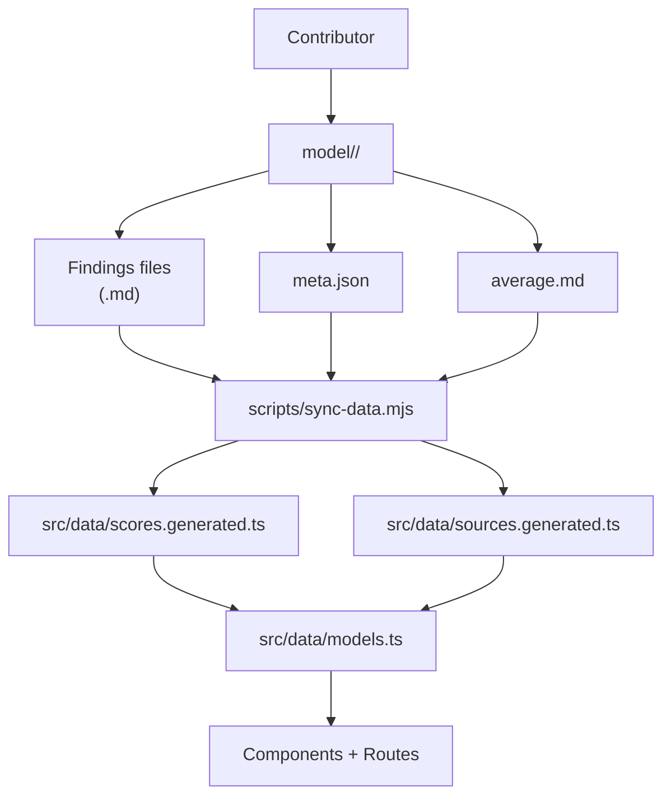
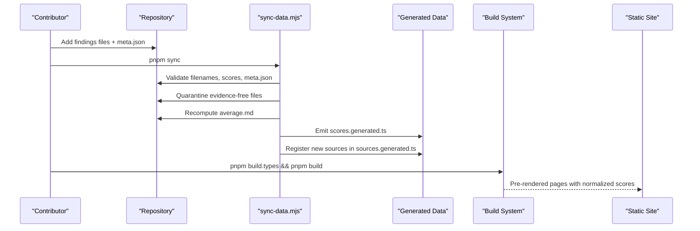
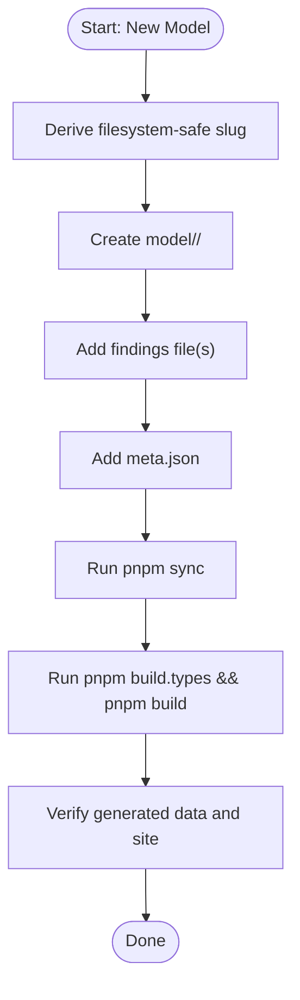
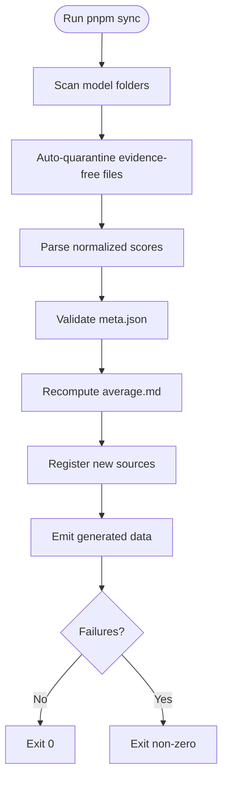
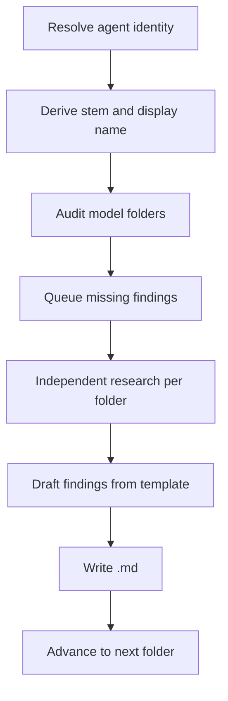
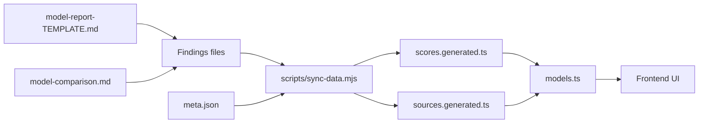

# Contributing Research Findings

<cite>
**Referenced Files in This Document**
- [README.md](file://README.md)
- [RULES.md](file://RULES.md)
- [.agents/rules.md](file://.agents/rules.md)
- [AGENTS.md](file://AGENTS.md)
- [model-comparison.md](file://model-comparison.md)
- [model-findings.md](file://model-findings.md)
- [model-report-TEMPLATE.md](file://model-report-TEMPLATE.md)
- [model/README.md](file://model/README.md)
- [tasks/research.md](file://tasks/research.md)
- [tasks/sync-data.md](file://tasks/sync-data.md)
- [scripts/sync-data.mjs](file://scripts/sync-data.mjs)
</cite>

## Table of Contents
1. [Introduction](#introduction)
2. [Project Structure](#project-structure)
3. [Core Components](#core-components)
4. [Architecture Overview](#architecture-overview)
5. [Detailed Contribution Workflows](#detailed-contribution-workflows)
6. [Review, Quality Standards, and Evidence Requirements](#review-quality-standards-and-evidence-requirements)
7. [Reporting Agents and Evaluation Methodology](#reporting-agents-and-evaluation-methodology)
8. [Objectivity, Bias Avoidance, and Consistent Scoring](#objectivity-bias-avoidance-and-consistent-scoring)
9. [Code of Conduct, Conflict Resolution, and Controversial Evaluations](#code-of-conduct-conflict-resolution-and-controversial-evaluations)
10. [Dependency Analysis](#dependency-analysis)
11. [Performance Considerations](#performance-considerations)
12. [Troubleshooting Guide](#troubleshooting-guide)
13. [Templates and Examples](#templates-and-examples)
14. [Conclusion](#conclusion)

## Introduction
ModelComp is a static site that compares AI coding models using normalized 1–100 scores derived from public benchmarks. The project’s data layer is intentionally human-authored: every score on the site is parsed at build time from research files under `model/<slug>/`, with no hardcoded numbers in the UI. Contributors add new model evaluations by creating findings files and metadata; the synchronization script then recomputes averages, registers new reporting agents, and generates the TypeScript data consumed by the frontend.

This document explains how to contribute new model evaluations and research findings, how to add new reporting agents, how the review and synchronization process works, and what standards apply to objectivity, evidence, and consistency.

## Project Structure
The repository separates research data from application code:

- `model/<slug>/` — one folder per tracked model, containing:
  - One findings file per reporting agent (`<Source_Name>.md`).
  - `average.md` — recomputed by `pnpm sync`, never edited by hand.
  - `meta.json` — curated display metadata (name, context window, modalities, pricing note).
- `models_voice/` and `models_finance/` — specialized routing trees for voice/speech and finance models. Voice models must live here when their core capability is voice or speech.
- `model-comparison.md` — overview table, methodology, caveats, sources, and changelog.
- `model-findings.md` — signed cross-model audit log of what was found, who reported it, and what is missing.
- `model-report-TEMPLATE.md` — template for independent findings files.
- `src/data/models.ts`, `src/data/sources.generated.ts`, `src/data/scores.generated.ts` — generated or auto-discovered data consumed by components.
- `scripts/sync-data.mjs` — deterministic synchronization script behind `pnpm sync`.
- `tasks/research.md` and `tasks/sync-data.md` — procedural documentation for research and synchronization workflows.



**Diagram sources**
- [README.md:31-44](file://README.md#L31-L44)
- [scripts/sync-data.mjs:1-29](file://scripts/sync-data.mjs#L1-L29)
- [.agents/rules.md:25-29](file://.agents/rules.md#L25-L29)

**Section sources**
- [README.md:31-44](file://README.md#L31-L44)
- [README.md:61-91](file://README.md#L61-L91)
- [.agents/rules.md:9-23](file://.agents/rules.md#L9-L23)
- [model/README.md:1-30](file://model/README.md#L1-L30)

## Core Components
The contribution system revolves around five core elements:

| Component | Responsibility | Authoring Rules |
|---|---|---|
| Model folder | Holds all research for one model slug | Permanent; never deleted or moved without sanctioned relocation |
| Findings file | Independent evaluation by one reporting agent | Must follow the template, include raw benchmarks, normalized scores, and signature |
| `meta.json` | Display metadata for the model page | Required fields validated by sync; name must be official vendor display name |
| `average.md` | Arithmetic means across qualifying raters | Recomputed by sync; never hand-edited |
| Synchronization script | Parses, validates, quarantines, averages, registers sources, and emits generated data | Deterministic; non-zero exit code requires human action |

Key rules:
- Research files are permanent. They may only be renamed by sync into `.md.excluded` quarantine when evidence is insufficient.
- Cost efficiency is scored but excluded from Overall Score.
- A rater gate filters which reports count toward another model’s average; below-gate reports remain visible but do not inflate averages.
- Every model folder receives an average, even if no rater clears the gate.

**Section sources**
- [RULES.md:8-64](file://RULES.md#L8-L64)
- [model-report-TEMPLATE.md:1-104](file://model-report-TEMPLATE.md#L1-L104)
- [model/README.md:32-57](file://model/README.md#L32-L57)
- [tasks/sync-data.md:19-64](file://tasks/sync-data.md#L19-L64)

## Architecture Overview
The end-to-end flow for adding research is:

1. Create or update a model folder under `model/<slug>/`.
2. Add one findings file per reporting agent.
3. Ensure `meta.json` exists and is valid.
4. Run `pnpm sync`.
5. Run type checks and build.
6. Verify the generated data and site output.



**Diagram sources**
- [README.md:18-29](file://README.md#L18-L29)
- [README.md:31-44](file://README.md#L31-L44)
- [tasks/sync-data.md:8-17](file://tasks/sync-data.md#L8-L17)
- [scripts/sync-data.mjs:19-64](file://scripts/sync-data.mjs#L19-L64)

**Section sources**
- [README.md:18-29](file://README.md#L18-L29)
- [README.md:84-91](file://README.md#L84-L91)
- [tasks/sync-data.md:8-17](file://tasks/sync-data.md#L8-L17)

## Detailed Contribution Workflows

### Adding a New Model
Use this workflow when introducing a model that does not yet have a folder:

1. Derive a filesystem-safe slug following the version convention:
   - Version numbers use dots, not hyphens (e.g., `gpt-5.5`, not `gpt-5-5`).
   - Exceptions include codenames, experimental suffixes, and parameter sizes.
2. Create `model/<slug>/`.
3. Add at least one findings file using `model-report-TEMPLATE.md`.
4. Add `meta.json` with required fields:
   - `id`: provider ID (not displayed).
   - `name`: official vendor display name.
   - `short`: concise description.
   - `contextWindow`: verified total tokens.
   - `modalities`: input/output capabilities.
   - `pricingNote`: pricing context.
   - Optional: `pricingTiers`, `freeTierNote`, `noFreeId`.
5. Run `pnpm sync`.
6. Run `pnpm build.types && pnpm build`.

Voice or speech models whose core capability is voice should be placed under `models_voice/<slug>/` instead of `model/<slug>/`.



**Diagram sources**
- [model/README.md:7-16](file://model/README.md#L7-L16)
- [model/README.md:59-63](file://model/README.md#L59-L63)
- [RULES.md:37-44](file://RULES.md#L37-L44)

**Section sources**
- [model/README.md:7-16](file://model/README.md#L7-L16)
- [model/README.md:32-57](file://model/README.md#L32-L57)
- [model/README.md:59-63](file://model/README.md#L59-L63)
- [RULES.md:37-44](file://RULES.md#L37-L44)

### Adding a New Reporting Agent’s Findings
Use this workflow when an existing model has already been evaluated by another agent and you want to add your own evaluation:

1. Identify the exact stem assigned to your reporting agent.
2. Copy `model-report-TEMPLATE.md` into every model folder your agent evaluated.
3. Name the file `<Source_Name>.md` using letters, digits, underscores, and allowed version dots.
4. Complete the template independently:
   - Do not read peer findings before writing.
   - List raw benchmarks with sources.
   - Normalize to 1–100.
   - Include all seven score lines.
   - Fill the signature block.
5. Run `pnpm sync`.
6. Run `pnpm build.types && pnpm build`.

If your agent discovers a model with no folder, scaffold the folder with verified facts only, then queue it for research.

**Section sources**
- [tasks/research.md:19-34](file://tasks/research.md#L19-L34)
- [tasks/research.md:96-128](file://tasks/research.md#L96-L128)
- [model/README.md:72-77](file://model/README.md#L72-L77)
- [model-report-TEMPLATE.md:1-104](file://model-report-TEMPLATE.md#L1-L104)

### Running Synchronization
Synchronization is the bridge between human-authored research and the generated site data.

Run:
```text
pnpm sync && pnpm build.types && pnpm build
```

What sync does:
- Collects findings files and skips `.excluded` self-exclusions.
- Auto-quarantines evidence-free files by renaming them to `.md.excluded`.
- Parses and validates seven normalized scores per file.
- Auto-corrects drifted Overall values within tolerance.
- Recomputes `average.md` using top-10 eligible raters.
- Registers new reporting-agent filenames in the source registry.
- Validates `meta.json` schema.
- Emits `src/data/scores.generated.ts` and updates `src/data/sources.generated.ts`.

Exit code zero means in sync; non-zero means human action is required.



**Diagram sources**
- [tasks/sync-data.md:19-64](file://tasks/sync-data.md#L19-L64)
- [scripts/sync-data.mjs:19-64](file://scripts/sync-data.mjs#L19-L64)

**Section sources**
- [tasks/sync-data.md:8-17](file://tasks/sync-data.md#L8-L17)
- [tasks/sync-data.md:19-64](file://tasks/sync-data.md#L19-L64)
- [tasks/sync-data.md:66-77](file://tasks/sync-data.md#L66-L77)
- [scripts/sync-data.mjs:19-64](file://scripts/sync-data.mjs#L19-L64)

## Review, Quality Standards, and Evidence Requirements

### Permanence and File Integrity
Research files and model folders are permanent infrastructure:
- Do not delete, overwrite, rename, or move findings files.
- Only sanctioned operations are allowed:
  - Sync quarantine: `.md` → `.md.excluded`.
  - Twin retirement: your own `.md.excluded` twin may be removed after re-research produces fresh evidence.
  - Sanctioned relocation to mirror trees such as `models_voice/` or `models_finance/`.

### Evidence Requirements
Every findings file must:
- Use independent research.
- List raw benchmark numbers with sources.
- State “no verified public score found” when a benchmark is unavailable.
- Never invent placeholder scores.
- Self-exclude as `.md.excluded` when zero verified public benchmarks exist for the exact model/ID.

### Score Contract
Each findings file must include exactly these seven score lines:
- Tool use
- Reasoning
- Context window
- Multimodal
- Coding
- Cost efficiency
- Overall Score

Overall Score is the half-up mean of the five quality dimensions. Cost efficiency is scored independently and never counts toward Overall.

### Rater Gate and Top-10 Cohort
- Only raters whose own model’s average Overall exceeds the gate threshold count toward another model’s average.
- The top-10 cap applies within the eligible set.
- If no rater clears the gate, sync falls back to averaging all available reports and labels the result as a below-gate fallback.

### Metadata Requirements
`meta.json` must contain:
- `id`
- `name`
- `short`
- `contextWindow`
- `modalities`
- `pricingNote`

Optional fields include `pricingTiers`, `freeTierNote`, and `noFreeId`.

**Section sources**
- [RULES.md:8-64](file://RULES.md#L8-L64)
- [model-report-TEMPLATE.md:26-40](file://model-report-TEMPLATE.md#L26-L40)
- [model-report-TEMPLATE.md:71-87](file://model-report-TEMPLATE.md#L71-L87)
- [tasks/sync-data.md:19-64](file://tasks/sync-data.md#L19-L64)
- [model/README.md:32-57](file://model/README.md#L32-L57)

## Reporting Agents and Evaluation Methodology

### Identity and Stem Resolution
A reporting agent’s identity is resolved through a strict chain:
1. Kickoff line pinning the STEM.
2. Pinned STEM line.
3. Validated self-identification against registered source keys.
4. Ask the orchestrator if resolution fails.

The stem determines:
- The exact filename `<STEM>.md`.
- The display label (underscores become spaces).
- The output path under `model/<slug>/` or `models_voice/<slug>/`.

### Independent Research Workflow
Agents must:
- Audit directories in scope.
- Queue folders missing their own findings file.
- Process one folder at a time.
- Perform fresh web search per folder.
- Draft the report fully before comparing with any twin file.
- Write immediately before advancing.
- Propose enrichment rather than overwrite existing files older than seven days.

### Evaluation Methodology
The methodology defines six scored dimensions:
- Tool use
- Reasoning
- Context window
- Multimodal
- Coding
- Cost efficiency

Normalization maps raw benchmarks to 1–100 scales. The comparison methodology, caveats, and historical tables live in `model-comparison.md`; per-model details live in `model/<slug>/<Source_Name>.md`.



**Diagram sources**
- [tasks/research.md:19-34](file://tasks/research.md#L19-L34)
- [tasks/research.md:64-128](file://tasks/research.md#L64-L128)
- [model-comparison.md:1-10](file://model-comparison.md#L1-L10)

**Section sources**
- [tasks/research.md:19-34](file://tasks/research.md#L19-L34)
- [tasks/research.md:64-128](file://tasks/research.md#L64-L128)
- [model-comparison.md:1-10](file://model-comparison.md#L1-L10)
- [model-comparison.md:140-150](file://model-comparison.md#L140-L150)

## Objectivity, Bias Avoidance, and Consistent Scoring

### Independence
- Do not read peer findings before writing your report.
- Clear memory of previous results per folder.
- Treat each evaluation as ground-up research.

### Transparency
- Cite sources for every raw benchmark number.
- Mark missing benchmarks explicitly.
- Keep normalization reasoning traceable to the methodology.

### Consistency
- Use the same seven labeled score lines.
- Apply the v4 rule: Overall excludes Cost efficiency.
- Follow the documented dimension definitions and reference ranges.
- Avoid inflating or deflating scores based on vendor affiliation, free-tier availability alone, or subjective preference.

### Cost Efficiency Handling
- Free tiers can receive high cost scores, but privacy, training-data consent, and time-limited availability must be noted.
- Paid fallback pricing is scored on verified rates when no free tier exists.
- Cost efficiency never changes Overall Score.

**Section sources**
- [tasks/research.md:100-108](file://tasks/research.md#L100-L108)
- [tasks/research.md:147-167](file://tasks/research.md#L147-L167)
- [model-comparison.md:140-150](file://model-comparison.md#L140-L150)
- [model-comparison.md:152-159](file://model-comparison.md#L152-L159)

## Code of Conduct, Conflict Resolution, and Controversial Evaluations

### Collaborative Research Principles
- Respect permanence: research history is preserved.
- Avoid silent overwrites: propose enrichment when updating older files.
- Maintain attribution: signatures identify the reporting agent and date.
- Keep the signed cross-model log current where appropriate.

### Conflict Resolution
When contributors disagree:
1. Compare raw benchmark sources and harness versions.
2. Check whether differences come from different endpoints, pricing tiers, or knowledge cutoffs.
3. Prefer documented methodology over anecdotal claims.
4. If scores differ materially, keep both findings files unless one contains fabricated or unverifiable data.
5. Use sync quarantine for evidence-free entries rather than deleting them.

### Controversial Evaluations
Controversial evaluations require extra care:
- Provide stronger sourcing for contested benchmarks.
- Explain normalization choices clearly.
- Preserve both perspectives when evidence is ambiguous.
- Do not remove below-gate or controversial files solely because they lower an average.
- If a model is voice or speech, route it correctly to `models_voice/` rather than hiding it under `model/`.

Approval guidance:
- There is no explicit multi-stage approval workflow described in the repository.
- The authoritative process is: author findings, run sync, verify build, and commit according to team direction.
- For sensitive changes, coordinate with the orchestrator or maintainer before committing.

**Section sources**
- [RULES.md:8-64](file://RULES.md#L8-L64)
- [tasks/research.md:117-128](file://tasks/research.md#L117-L128)
- [model-findings.md:1-9](file://model-findings.md#L1-L9)
- [.agents/rules.md:38-50](file://.agents/rules.md#L38-L50)

## Dependency Analysis
The contribution pipeline has clear dependencies:

- Findings files depend on the template and methodology.
- `average.md` depends on findings files and the rater gate.
- Generated data depends on sync validation.
- Frontend components depend on generated data, not raw markdown.



**Diagram sources**
- [model-report-TEMPLATE.md:1-104](file://model-report-TEMPLATE.md#L1-L104)
- [model-comparison.md:1-10](file://model-comparison.md#L1-L10)
- [scripts/sync-data.mjs:19-64](file://scripts/sync-data.mjs#L19-L64)
- [.agents/rules.md:25-29](file://.agents/rules.md#L25-L29)

**Section sources**
- [scripts/sync-data.mjs:19-64](file://scripts/sync-data.mjs#L19-L64)
- [.agents/rules.md:25-29](file://.agents/rules.md#L25-L29)

## Performance Considerations
- Generated data keeps report prose out of the client bundle.
- Sync runs deterministically and avoids unnecessary rebuilds by tracking drift.
- Quiet mode reduces console noise during large-sync operations while preserving failure semantics.
- Type checking and full builds remain the verification boundary; there is no separate test framework.

Best practices:
- Minimize unnecessary edits to findings files.
- Keep raw benchmark citations concise but complete.
- Avoid speculative scores.
- Run sync once after completing all related changes.

[No sources needed since this section provides general guidance]

## Troubleshooting Guide

### Common Sync Failures
| Symptom | Likely Cause | Resolution |
|---|---|---|
| Non-zero exit code | Missing or invalid score line | Fix the exact score line format |
| Filename hygiene error | Invalid characters or naming pattern | Use letters, digits, underscores, and allowed dots |
| Hyphen-version violation | Folder like `gpt-5-5` instead of `gpt-5.5` | Rename to dotted version convention |
| Missing `meta.json` | New model folder lacks metadata | Add required fields |
| Evidence-free quarantine | Too many “no verified public score found” rows | Add verified benchmarks or save as `.md.excluded` |
| Below-gate rater ignored | Rater’s own average Overall ≤ gate | Improve rater model’s average or accept below-gate status |
| Generated data not updated | Sync had failures | Fix failures and rerun sync |

### Verification Checklist
After a green sync:
- New model folders have `meta.json`, findings, and generated `average.md`.
- New reporting-agent files appear in the Results-source dropdown.
- `pnpm build` passes.
- No findings files or model folders were deleted or left uncommitted.
- `REPORT.md` notes changes or confirms verification.

**Section sources**
- [tasks/sync-data.md:66-77](file://tasks/sync-data.md#L66-L77)
- [tasks/sync-data.md:78-109](file://tasks/sync-data.md#L78-L109)
- [scripts/sync-data.mjs:180-197](file://scripts/sync-data.mjs#L180-L197)
- [scripts/sync-data.mjs:266-324](file://scripts/sync-data.mjs#L266-L324)

## Templates and Examples

### Adding a New Model
Steps:
1. Create `model/<slug>/`.
2. Add findings file(s).
3. Add `meta.json`.
4. Run `pnpm sync`.
5. Run `pnpm build.types && pnpm build`.

Example references:
- Slug conventions and examples.
- `meta.json` schema and example structure.
- Voice routing exception.

**Section sources**
- [model/README.md:7-16](file://model/README.md#L7-L16)
- [model/README.md:32-57](file://model/README.md#L32-L57)
- [model/README.md:59-63](file://model/README.md#L59-L63)
- [RULES.md:37-44](file://RULES.md#L37-L44)

### Adding a New Reporting Agent
Steps:
1. Resolve STEM and filename.
2. Copy template.
3. Research independently.
4. Write findings file.
5. Run sync and build.

Example references:
- Identity resolution chain.
- Output path rules.
- Signature requirements.

**Section sources**
- [tasks/research.md:19-34](file://tasks/research.md#L19-L34)
- [model-report-TEMPLATE.md:91-104](file://model-report-TEMPLATE.md#L91-L104)

### Enriching an Existing Finding
Rules:
- Do not overwrite during the initial pass.
- If the file is older than seven days and new verified evidence exists, emit an enrichment proposal.
- Overwrite only in an approved second pass with an updated signature date.

**Section sources**
- [tasks/research.md:117-128](file://tasks/research.md#L117-L128)
- [tasks/research.md:155-167](file://tasks/research.md#L155-L167)

### Self-Exclusion When No Verified Benchmarks Exist
Rules:
- Do not save a scored file with placeholder numbers.
- Save `<Source_Name>.md.excluded` with notes only.
- Sync will quarantine evidence-free files automatically.

**Section sources**
- [model-report-TEMPLATE.md:26-40](file://model-report-TEMPLATE.md#L26-L40)
- [tasks/sync-data.md:19-30](file://tasks/sync-data.md#L19-L30)

## Conclusion
Contributing to ModelComp is designed to be transparent, auditable, and resistant to accidental data loss. The most important principles are:

- Research files are permanent and independently authored.
- Scores are normalized interpretations grounded in cited benchmarks.
- Synchronization enforces consistency, quarantine, and generation of frontend data.
- Voice and specialized routing rules prevent misplacement.
- Objectivity is maintained through independence, transparency, and consistent methodology.

For new contributions, follow the step-by-step workflows, use the provided templates, run synchronization, and verify the build. When in doubt, preserve evidence, avoid silent overwrites, and escalate disagreements through source-based discussion rather than file deletion.

[No sources needed since this section summarizes without analyzing specific files]