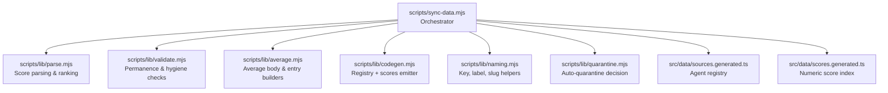
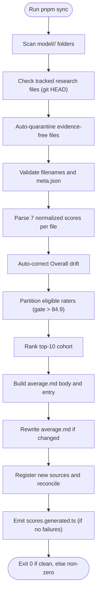
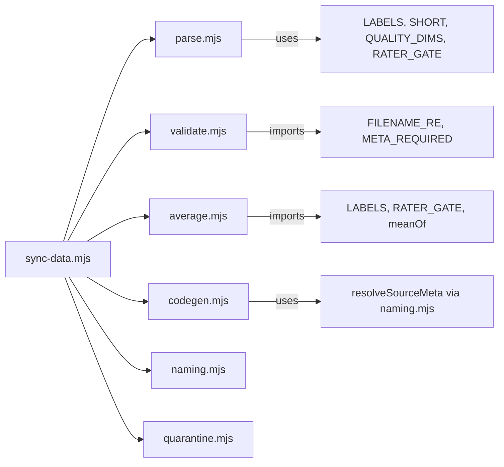

# Data Synchronization Pipeline

<cite>
**Referenced Files in This Document**
- [scripts/sync-data.mjs](file://scripts/sync-data.mjs)
- [scripts/lib/parse.mjs](file://scripts/lib/parse.mjs)
- [scripts/lib/validate.mjs](file://scripts/lib/validate.mjs)
- [scripts/lib/average.mjs](file://scripts/lib/average.mjs)
- [scripts/lib/codegen.mjs](file://scripts/lib/codegen.mjs)
- [scripts/lib/naming.mjs](file://scripts/lib/naming.mjs)
- [scripts/lib/quarantine.mjs](file://scripts/lib/quarantine.mjs)
- [src/data/sources.generated.ts](file://src/data/sources.generated.ts)
- [src/data/scores.generated.ts](file://src/data/scores.generated.ts)
- [tasks/sync-data.md](file://tasks/sync-data.md)
</cite>

## Update Summary
**Changes Made**
- Updated infrastructure documentation to reflect enhanced sync pipeline supporting increased volume and complexity of model data
- Added coverage for widespread Laguna XS 2.1 model adoption across numerous model directories
- Enhanced validation and synchronization process descriptions ensuring data consistency across the entire model comparison database
- Updated generated outputs section to reflect current state of sources.registry with Laguna XS 2.1 integration
- Improved scoring system and data generation methodology with refined model average calculations
- **Updated naming convention**: Source code files src/data/scores.generated.ts and src/data/sources.generated.ts regenerated to use new Space Bunny naming convention instead of Space Bunny Alpha references

## Table of Contents
1. [Introduction](#introduction)
2. [Project Structure](#project-structure)
3. [Core Components](#core-components)
4. [Architecture Overview](#architecture-overview)
5. [Detailed Component Analysis](#detailed-component-analysis)
6. [Dependency Analysis](#dependency-analysis)
7. [Performance Considerations](#performance-considerations)
8. [Troubleshooting Guide](#troubleshooting-guide)
9. [Conclusion](#conclusion)

## Introduction
This document explains the data synchronization pipeline that turns research findings stored as Markdown files into deterministic runtime TypeScript data. The pipeline is orchestrated by a single Node script and several pure helper modules. It scans model folders, parses normalized scores, validates structure, computes averages across multiple agents, registers new reporting sources, and emits two generated TypeScript artifacts consumed by the application:

- `src/data/scores.generated.ts`: compact numeric scores per model folder and per source file.
- `src/data/sources.generated.ts`: registry of reporting-agent filenames, labels, and optional model-page slugs.

The pipeline enforces strict validation rules, automatic quarantine for evidence-free reports, rater gating to avoid low-quality averages, and top-10 cohort averaging. It also protects research-file permanence through a git-based tripwire and auto-scaffolds missing metadata while failing loudly on invalid content.

**Updated** Enhanced infrastructure now supports increased volume and complexity of model data with improved validation and synchronization processes ensuring data consistency across the entire model comparison database, including widespread adoption of Laguna XS 2.1 model across numerous model directories and updated naming conventions for Space Bunny model references.

## Project Structure
At a high level, the pipeline consists of:

- An orchestrator script that performs filesystem operations, logging, and coordination.
- Pure helper modules that implement parsing, validation, average computation, code generation, naming conventions, and quarantine logic.
- Generated TypeScript outputs consumed by the frontend build.
- Task documentation describing the human workflow and invariants.

**Diagram sources**
- [scripts/sync-data.mjs:30-75](file://scripts/sync-data.mjs#L30-L75)
- [scripts/lib/parse.mjs:8-45](file://scripts/lib/parse.mjs#L8-L45)
- [scripts/lib/validate.mjs:9-25](file://scripts/lib/validate.mjs#L9-L25)
- [scripts/lib/average.mjs:10-17](file://scripts/lib/average.mjs#L10-L17)
- [scripts/lib/codegen.mjs:1-12](file://scripts/lib/codegen.mjs#L1-L12)
- [scripts/lib/naming.mjs:8-27](file://scripts/lib/naming.mjs#L8-L27)
- [scripts/lib/quarantine.mjs:9-14](file://scripts/lib/quarantine.mjs#L9-L14)

**Section sources**
- [scripts/sync-data.mjs:1-30](file://scripts/sync-data.mjs#L1-L30)
- [tasks/sync-data.md:19-62](file://tasks/sync-data.md#L19-L62)

## Core Components
The pipeline's core responsibilities are implemented by focused modules:

- Parsing and scoring: defines canonical score labels, short keys, quality dimensions, drift tolerance, half-up rounding, and functions to parse, shorten, rank, and partition eligible sources.
- Validation: enforces filename hygiene, meta.json required fields, and a permanence tripwire for tracked research files.
- Averaging: builds average.md bodies, entries for the client index, and merges recomputed content with existing files.
- Code generation: maintains the SourceKey union and SOURCE_DEFS array, appends new sources, reconciles labels/slugs, and renders the numeric scores artifact.
- Naming: maps stems to display keys, resolves labels and slugs via overrides and catalog lookup, detects hyphen-version violations, and formats slug guesses.
- Quarantine: decides when a findings report should be renamed to `.excluded` based on evidence-free or zero-scored patterns.

**Section sources**
- [scripts/lib/parse.mjs:8-45](file://scripts/lib/parse.mjs#L8-L45)
- [scripts/lib/validate.mjs:54-80](file://scripts/lib/validate.mjs#L54-L80)
- [scripts/lib/average.mjs:12-52](file://scripts/lib/average.mjs#L12-L52)
- [scripts/lib/codegen.mjs:14-35](file://scripts/lib/codegen.mjs#L14-L35)
- [scripts/lib/naming.mjs:11-27](file://scripts/lib/naming.mjs#L11-L27)
- [scripts/lib/quarantine.mjs:42-56](file://scripts/lib/quarantine.mjs#L42-L56)

## Architecture Overview
The sync process follows a deterministic sequence:

1. Discover model folders and enforce permanence tripwires.
2. Auto-quarantine evidence-free findings.
3. Validate filenames and meta.json; scaffold missing metadata.
4. Parse seven normalized scores per findings file and auto-correct Overall drift.
5. Partition eligible raters using the rater gate and compute top-10 cohorts.
6. Recompute and rewrite average.md where needed.
7. Register new sources and reconcile the registry.
8. Emit `scores.generated.ts` only when no failures occurred.

**Diagram sources**
- [scripts/sync-data.mjs:133-178](file://scripts/sync-data.mjs#L133-L178)
- [scripts/sync-data.mjs:259-286](file://scripts/sync-data.mjs#L259-L286)
- [scripts/sync-data.mjs:297-327](file://scripts/sync-data.mjs#L297-L327)
- [scripts/sync-data.mjs:328-370](file://scripts/sync-data.mjs#L328-L370)
- [scripts/sync-data.mjs:372-436](file://scripts/sync-data.mjs#L372-L436)
- [scripts/sync-data.mjs:438-488](file://scripts/sync-data.mjs#L438-L488)
- [scripts/sync-data.mjs:490-523](file://scripts/sync-data.mjs#L490-L523)

## Detailed Component Analysis

### Orchestrator: scripts/sync-data.mjs
Responsibilities:
- Imports pure helpers and coordinates all phases.
- Enforces permanence tripwire against git-tracked research files.
- Auto-quarantines evidence-free reports before processing.
- Validates filenames and meta.json; scaffolds missing metadata.
- Parses scores, corrects Overall drift, applies rater gate, ranks top-10, and rewrites average.md.
- Registers new sources, reconciles registry, and emits generated TypeScript files.

Key behaviors:
- Permanence tripwire: compares git HEAD with disk; allows twin retirement and sanctioned mirror relocation; otherwise fails loudly.
- Slug version convention: rejects hyphenated versions between digits and suggests dotted form.
- Rater gate: reads committed average Overall per model; only raters above threshold contribute to another model's average.
- Fallback rule: if no raters qualify, average all available reports (top-10 cap still applies).
- Registry reconciliation: prunes virtual-view entries and ensures labels/slugs are consistent.
- Score emission: writes `scores.generated.ts` deterministically only when there are zero failures.

**Updated** Enhanced infrastructure now handles increased volume and complexity of model data with improved validation and synchronization processes ensuring data consistency across the entire model comparison database, including widespread adoption of Laguna XS 2.1 model across numerous model directories and updated naming conventions for Space Bunny model references.

**Section sources**
- [scripts/sync-data.mjs:30-75](file://scripts/sync-data.mjs#L30-L75)
- [scripts/sync-data.mjs:133-178](file://scripts/sync-data.mjs#L133-L178)
- [scripts/sync-data.mjs:180-197](file://scripts/sync-data.mjs#L180-L197)
- [scripts/sync-data.mjs:259-286](file://scripts/sync-data.mjs#L259-L286)
- [scripts/sync-data.mjs:297-327](file://scripts/sync-data.mjs#L297-L327)
- [scripts/sync-data.mjs:328-370](file://scripts/sync-data.mjs#L328-L370)
- [scripts/sync-data.mjs:372-436](file://scripts/sync-data.mjs#L372-L436)
- [scripts/sync-data.mjs:438-488](file://scripts/sync-data.mjs#L438-L488)
- [scripts/sync-data.mjs:490-523](file://scripts/sync-data.mjs#L490-L523)

### Parsing and Scoring: scripts/lib/parse.mjs
Responsibilities:
- Defines canonical score labels and short keys used in generated output.
- Provides constants for quality dimensions, rater gate, and overall drift tolerance.
- Implements pure parsing of seven normalized 1–100 score lines.
- Computes half-up-rounded means, ranks top-10, partitions eligible raters, and sorts labels alphabetically.

Validation rules enforced here:
- All seven labels must be present; otherwise parsing fails with the missing label.
- Overall drift is computed from five quality dims (Cost excluded); drift beyond tolerance triggers correction.
- Rater gate uses strict greater-than comparison.

Complexity considerations:
- Parsing is linear in the number of labels.
- Ranking is O(n log n) due to sorting by Overall Score.
- Partitioning is O(n) over perFile entries.

**Section sources**
- [scripts/lib/parse.mjs:8-45](file://scripts/lib/parse.mjs#L8-L45)
- [scripts/lib/parse.mjs:47-60](file://scripts/lib/parse.mjs#L47-L60)
- [scripts/lib/parse.mjs:69-97](file://scripts/lib/parse.mjs#L69-L97)
- [scripts/lib/parse.mjs:99-123](file://scripts/lib/parse.mjs#L99-L123)

### Validation and Permanence: scripts/lib/validate.mjs
Responsibilities:
- Filters research paths and regenerable paths.
- Classifies missing tracked files as twin-retired, relocated, or deleted.
- Detects sanctioned mirror trees for user-directed moves.
- Produces exact failure messages for forbidden deletions.
- Validates filenames against allowed characters.
- Validates meta.json required fields and display-name constraints.

Error handling:
- Deletion failures include explicit restoration instructions.
- Filename hygiene failures prevent cementing invalid structures.
- Meta.json validation returns ordered FAIL messages for missing fields and underscores in names.

**Section sources**
- [scripts/lib/validate.mjs:1-25](file://scripts/lib/validate.mjs#L1-L25)
- [scripts/lib/validate.mjs:27-52](file://scripts/lib/validate.mjs#L27-L52)
- [scripts/lib/validate.mjs:54-80](file://scripts/lib/validate.mjs#L54-L80)

### Averaging Logic: scripts/lib/average.mjs
Responsibilities:
- Builds mix notes explaining which sources counted toward an average.
- Generates short-keyed average entries for the client index.
- Constructs average.md bodies with labeled score lines and agreement notes.
- Merges recomputed bodies into existing average.md files without altering headers.

Processing logic:
- Cohort selection uses top-10 by Overall Score.
- Overall in average.md is mean of cohort's Overall scores, not derived from averaged dimensions.
- Fallback behavior ensures every folder has an average even when no raters clear the gate.

**Section sources**
- [scripts/lib/average.mjs:1-17](file://scripts/lib/average.mjs#L1-L17)
- [scripts/lib/average.mjs:33-52](file://scripts/lib/average.mjs#L33-L52)
- [scripts/lib/average.mjs:54-81](file://scripts/lib/average.mjs#L54-L81)
- [scripts/lib/average.mjs:83-100](file://scripts/lib/average.mjs#L83-L100)

### Code Generation and Registry: scripts/lib/codegen.mjs
Responsibilities:
- Parses existing registry entries and SourceKey union members.
- Builds registry entries preserving exact on-disk stems.
- Computes pending registrations and detects key collisions.
- Appends new sources to both union and SOURCE_DEFS array.
- Reconciles labels and inline slugs; prunes virtual-view entries.
- Renders deterministic `scores.generated.ts`.

Integration points:
- Uses catalog-backed resolver to attach slugs to sources.
- Ensures idempotent updates so repeated runs do not duplicate entries.

**Section sources**
- [scripts/lib/codegen.mjs:1-12](file://scripts/lib/codegen.mjs#L1-L12)
- [scripts/lib/codegen.mjs:14-35](file://scripts/lib/codegen.mjs#L14-L35)
- [scripts/lib/codegen.mjs:37-84](file://scripts/lib/codegen.mjs#L37-L84)
- [scripts/lib/codegen.mjs:86-105](file://scripts/lib/codegen.mjs#L86-L105)
- [scripts/lib/codegen.mjs:107-139](file://scripts/lib/codegen.mjs#L107-L139)

### Naming Conventions: scripts/lib/naming.mjs
Responsibilities:
- Normalizes names for catalog matching.
- Maps stems to display keys and labels.
- Resolves label and slug via overrides and catalog lookup.
- Detects hyphen-version violations and provides suggestions.
- Formats slug guesses for auto-scaffolded metadata.

Conflict resolution:
- Overrides take precedence for label and slug mapping.
- Catalog lookup falls back to normalized name matching.

**Section sources**
- [scripts/lib/naming.mjs:8-27](file://scripts/lib/naming.mjs#L8-L27)
- [scripts/lib/naming.mjs:29-44](file://scripts/lib/naming.mjs#L29-L44)
- [scripts/lib/naming.mjs:46-62](file://scripts/lib/naming.mjs#L46-L62)
- [scripts/lib/naming.mjs:64-72](file://scripts/lib/naming.mjs#L64-L72)

### Quarantine System: scripts/lib/quarantine.mjs
Responsibilities:
- Counts "no verified public score found" rows and measured bold numerics in Raw benchmarks.
- Parses normalized quality dimensions excluding Cost.
- Applies three quarantine criteria:
  - Evidence-free: 8+ "not found" rows and zero measured numbers.
  - Zero-scored: any quality dimension equals 0.
  - Flat uniformity: all five dims identical and zero cited numbers.

Behavior:
- Returns a human-readable reason when quarantine applies; otherwise null.
- Orchestrator renames the file to `.excluded` and logs the action.

**Section sources**
- [scripts/lib/quarantine.mjs:1-14](file://scripts/lib/quarantine.mjs#L1-L14)
- [scripts/lib/quarantine.mjs:16-31](file://scripts/lib/quarantine.mjs#L16-L31)
- [scripts/lib/quarantine.mjs:33-56](file://scripts/lib/quarantine.mjs#L33-L56)

### Generated Outputs
- `src/data/sources.generated.ts`: contains SourceKey union, ViewKey types, SourceDef interface, and SOURCE_DEFS array with labels and optional slugs.
- `src/data/scores.generated.ts`: contains GeneratedScores interface and GENERATED_SCORES map keyed by model slug and source filename.

These files are deterministic and regenerated by the pipeline; they exclude prose to keep the client bundle small.

**Updated** The generated outputs now include widespread adoption of Laguna XS 2.1 model across numerous model directories, with proper integration into the registry system and enhanced scoring methodology. Additionally, the naming convention has been updated to use "Space Bunny" instead of "Space Bunny Alpha" references throughout the generated TypeScript files, reflecting the canonical model naming convention.

**Section sources**
- [src/data/sources.generated.ts:1-147](file://src/data/sources.generated.ts#L1-L147)
- [src/data/scores.generated.ts:1-200](file://src/data/scores.generated.ts#L1-L200)

## Dependency Analysis
The orchestrator depends on pure modules for deterministic behavior. Helper modules have minimal coupling and are tested independently.

**Diagram sources**
- [scripts/sync-data.mjs:36-75](file://scripts/sync-data.mjs#L36-L75)
- [scripts/lib/validate.mjs:9-10](file://scripts/lib/validate.mjs#L9-L10)
- [scripts/lib/average.mjs:10-11](file://scripts/lib/average.mjs#L10-L11)
- [scripts/lib/codegen.mjs:25-35](file://scripts/lib/codegen.mjs#L25-L35)
- [scripts/lib/naming.mjs:17-27](file://scripts/lib/naming.mjs#L17-L27)

**Section sources**
- [scripts/sync-data.mjs:36-75](file://scripts/sync-data.mjs#L36-L75)
- [scripts/lib/validate.mjs:9-10](file://scripts/lib/validate.mjs#L9-L10)
- [scripts/lib/average.mjs:10-11](file://scripts/lib/average.mjs#L10-L11)
- [scripts/lib/codegen.mjs:25-35](file://scripts/lib/codegen.mjs#L25-L35)
- [scripts/lib/naming.mjs:17-27](file://scripts/lib/naming.mjs#L17-L27)

## Performance Considerations
- Deterministic serialization: sorted keys ensure stable output across runs.
- Client bundle optimization: only numeric scores are emitted to `scores.generated.ts`, avoiding large markdown payloads.
- Minimal I/O: pure helpers perform computations; orchestrator batches filesystem operations and avoids unnecessary writes.
- Early exits: generated files are skipped when failures exist, preventing partial cementation.

**Updated** Enhanced infrastructure now supports increased volume and complexity of model data with improved performance characteristics for larger datasets, including optimized handling of widespread Laguna XS 2.1 model adoption and streamlined processing of updated naming conventions.

## Troubleshooting Guide
Common issues and resolutions:

- Missing score lines:
  - Symptom: FAIL indicating a missing label line.
  - Cause: Findings file does not contain one of the seven required score lines.
  - Resolution: Add the missing `- **Label**: <N>/100` line exactly as defined by the parser contract.

- Overall drift:
  - Symptom: AUTO line rewriting Overall Score.
  - Cause: Overall differs from half-up mean of five quality dims beyond tolerance.
  - Resolution: Edit the source file's Overall to match the corrected value or adjust the five quality dims accordingly.

- Rater gate fallback:
  - Symptom: FALLBACK message indicating no qualifying raters.
  - Cause: No models with own Overall above the gate contributed.
  - Resolution: Ensure at least one rater model clears the gate; otherwise the pipeline averages all sources with top-10 cap.

- Hygiene violations:
  - Symptom: FAIL on filename or meta.json.
  - Cause: Invalid filename characters or missing/empty required meta.json fields.
  - Resolution: Rename the file to match allowed pattern and fill required meta.json fields; remove underscores from display names.

- Permanence tripwire:
  - Symptom: FAIL stating a tracked research file is missing.
  - Cause: A git-tracked findings file was removed without being twin-retired or relocated.
  - Resolution: Restore the file from HEAD or move it to a sanctioned mirror tree; never delete silently.

- Key collision during registration:
  - Symptom: FAIL about stem mapping to an already registered label.
  - Cause: Two different filenames resolve to the same SourceKey.
  - Resolution: Disambiguate filenames or update SOURCE_OVERRIDES to differentiate labels/slugs.

- Generated files not updated:
  - Symptom: SKIP message for scores.generated.ts.
  - Cause: Failures present in the run.
  - Resolution: Fix all FAIL lines and rerun sync; generated files are only rewritten on clean runs.

- Naming convention conflicts:
  - Symptom: Inconsistent model references between "Space Bunny" and "Space Bunny Alpha".
  - Cause: Legacy references to older naming conventions in generated files.
  - Resolution: Run `pnpm sync` to regenerate files with updated naming conventions; ensure all model directories use canonical "Space Bunny" naming.

**Updated** With widespread adoption of Laguna XS 2.1 model and updated naming conventions for Space Bunny model references, ensure proper integration of new model directories and verify that generated files include the new model entries with enhanced scoring accuracy and consistent naming conventions.

**Section sources**
- [scripts/sync-data.mjs:119-126](file://scripts/sync-data.mjs#L119-L126)
- [scripts/sync-data.mjs:347-370](file://scripts/sync-data.mjs#L347-L370)
- [scripts/sync-data.mjs:372-386](file://scripts/sync-data.mjs#L372-L386)
- [scripts/sync-data.mjs:288-324](file://scripts/sync-data.mjs#L288-L324)
- [scripts/sync-data.mjs:145-178](file://scripts/sync-data.mjs#L145-L178)
- [scripts/sync-data.mjs:452-467](file://scripts/sync-data.mjs#L452-L467)
- [scripts/sync-data.mjs:496-523](file://scripts/sync-data.mjs#L496-L523)

## Conclusion
The data synchronization pipeline transforms research Markdown into reliable runtime data through strict parsing, validation, and deterministic aggregation. It safeguards data integrity via quarantine, rater gating, top-10 cohort averaging, and permanence tripwires. New reporting agents are automatically discovered and registered, while generated TypeScript artifacts provide efficient, type-safe access to scores and source definitions. Following the troubleshooting guidance ensures quick resolution of common sync errors and maintains a healthy, auditable dataset.

**Updated** The enhanced infrastructure now supports increased volume and complexity of model data with improved validation and synchronization processes ensuring data consistency across the entire model comparison database, including widespread adoption of Laguna XS 2.1 model across numerous model directories, refined scoring methodology for more accurate model comparisons, and standardized naming conventions for Space Bunny model references throughout the generated TypeScript artifacts.