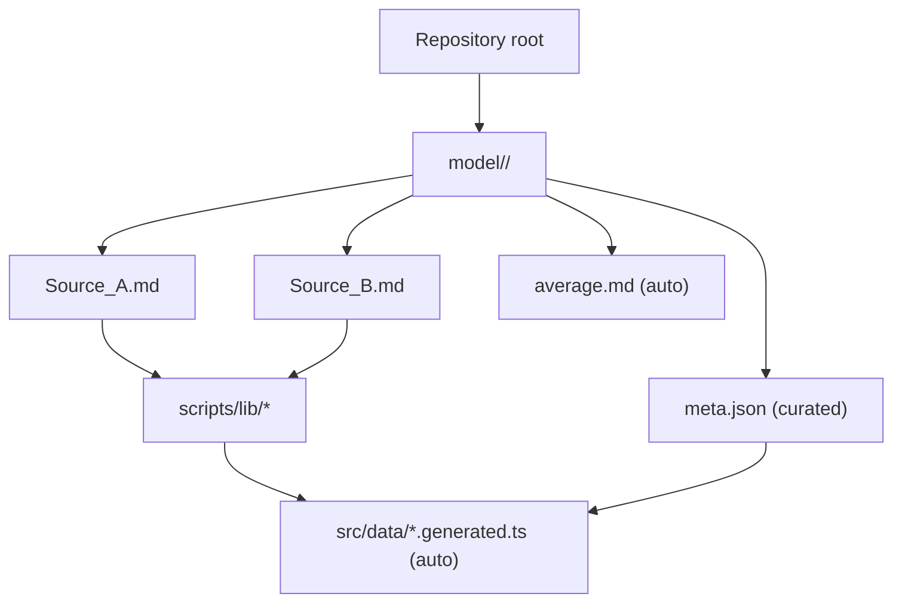
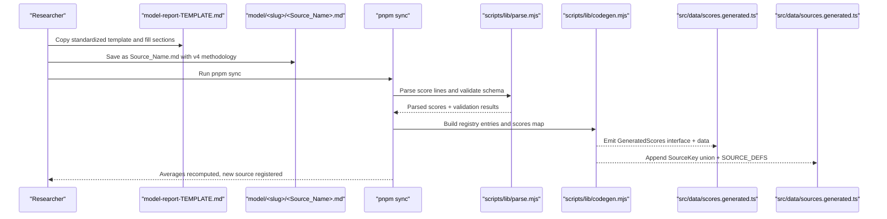
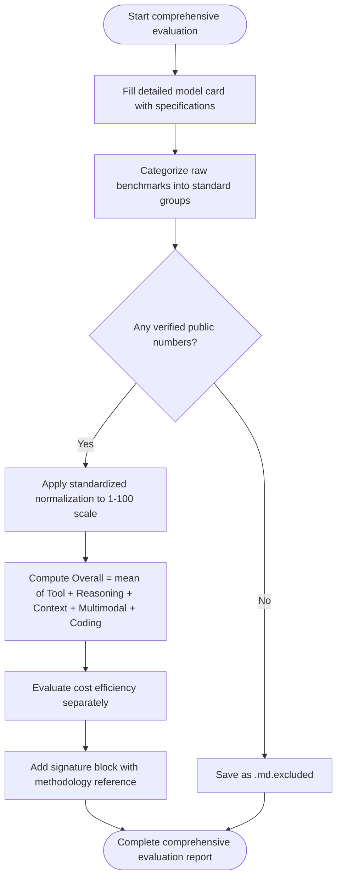
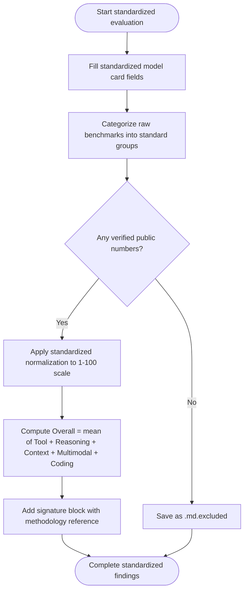
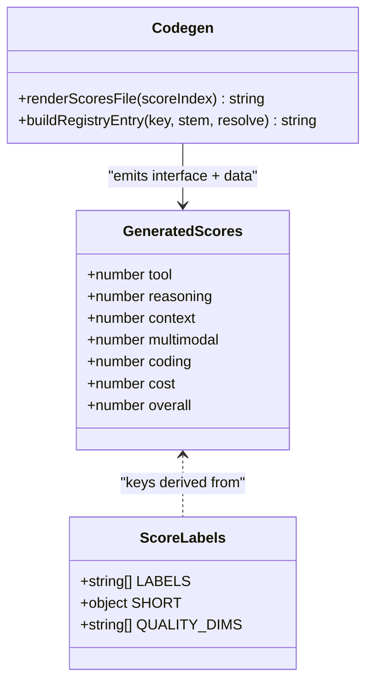
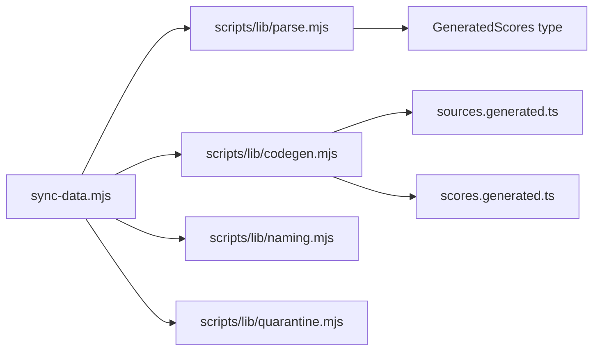

# Findings File Format & Structure

<cite>
**Referenced Files in This Document**
- [model-report-TEMPLATE.md](file://model-report-TEMPLATE.md)
- [model-comparison.md](file://model-comparison.md)
- [model-findings.md](file://model-findings.md)
- [RULES.md](file://RULES.md)
- [README.md](file://README.md)
- [model/README.md](file://model/README.md)
- [scripts/lib/parse.mjs](file://scripts/lib/parse.mjs)
- [scripts/lib/codegen.mjs](file://scripts/lib/codegen.mjs)
- [scripts/lib/naming.mjs](file://scripts/lib/naming.mjs)
- [scripts/lib/quarantine.mjs](file://scripts/lib/quarantine.mjs)
- [src/components/Methodology.tsx](file://src/components/Methodology.tsx)
- [src/data/models.ts](file://src/data/models.ts)
- [model/claude-opus-4.6/Claude_Opus_4.6.md](file://model/claude-opus-4.6/Claude_Opus_4.6.md)
- [model/gpt-5.6-terra/GPT_5.6_Terra.md](file://model/gpt-5.6-terra/GPT_5.6_Terra.md)
- [model/muse-spark-1.3/Muse_Spark_1.3.md](file://model/muse-spark-1.3/Muse_Spark_1.3.md)
- [model/claude-opus-4.6/meta.json](file://model/claude-opus-4.6/meta.json)
- [model/gpt-5.6-terra/meta.json](file://model/gpt-5.6-terra/meta.json)
- [model/muse-spark-1.3/meta.json](file://model/muse-spark-1.3/meta.json)
- [model/grok-4.6/meta.json](file://model/grok-4.6/meta.json)
- [model/gpt-6-sol/meta.json](file://model/gpt-6-sol/meta.json)
- [model/qwen-3.8-27b/meta.json](file://model/qwen-3.8-27b/meta.json)
- [model/gemini-3.1-flash-lite/meta.json](file://model/gemini-3.1-flash-lite/meta.json)
- [model/qwen-3.8-max/meta.json](file://model/qwen-3.8-max/meta.json)
- [model/ring-2.6.1t/meta.json](file://model/ring-2.6.1t/meta.json)
- [model/solar-open-2/meta.json](file://model/solar-open-2/meta.json)
</cite>

## Update Summary
**Changes Made**
- Updated to reflect Applied Changes: Integration of new model findings for high-performance models including Qwen 3.8 27B, Gemini 3.1 Flash Lite, Qwen 3.8 Max, Ring-2.6-1T, and Solar Open 2 with detailed benchmarking data and scoring metrics
- Added comprehensive examples of meta.json schema implementations for newly integrated models demonstrating diverse pricing structures and modalities
- Enhanced documentation with real-world examples from Alibaba Cloud, Google, and Upstage providers showing expanded ecosystem coverage
- Updated model card format examples to include dense vs sparse MoE architectures, open-weights licensing, and specialized use cases
- Expanded evidence-based normalization requirements with concrete scoring examples across different model tiers and providers

## Table of Contents
1. [Introduction](#introduction)
2. [Project Structure](#project-structure)
3. [Core Components](#core-components)
4. [Architecture Overview](#architecture-overview)
5. [Detailed Component Analysis](#detailed-component-analysis)
6. [Dependency Analysis](#dependency-analysis)
7. [Performance Considerations](#performance-considerations)
8. [Troubleshooting Guide](#troubleshooting-guide)
9. [Conclusion](#conclusion)

## Introduction
This document explains the self-contained findings file format used by ModelComp research, how researchers should populate it, and how it connects to generated TypeScript data structures. A findings file captures one agent's independent evaluation of a model: its card, raw benchmarks, normalized 1–100 scores, and signature. The repository maintains a cross-model signed log and per-model metadata for display.

**Updated** The format has been expanded with integration of new model findings for high-performance models including Qwen 3.8 27B, Gemini 3.1 Flash Lite, Qwen 3.8 Max, Ring-2.6-1T, and Solar Open 2 with detailed benchmarking data and scoring metrics. These additions demonstrate consistent application of the standardized methodology across diverse model providers including Alibaba Cloud, Google, and Upstage.

## Project Structure
Findings live under `model/<slug>/`. Each folder represents one tracked model and contains:
- One findings file per reporting agent, named `<Source_Name>.md`
- An auto-generated `average.md` (never edited by hand)
- A curated `meta.json` describing display metadata



**Diagram sources**
- [README.md:31-44](file://README.md#L31-L44)
- [model/README.md:1-30](file://model/README.md#L1-L30)

**Section sources**
- [README.md:31-44](file://README.md#L31-L44)
- [model/README.md:1-30](file://model/README.md#L1-L30)

## Core Components
- **Findings file**: Self-contained Markdown with model card, raw benchmarks, normalized scores, and signature.
- **Cross-model signed log**: Per-model audit trail documenting what was found, what is missing, and who reported it.
- **Per-model metadata**: `meta.json` provides display fields such as id, name, short description, context window, modalities, and pricing note.
- **Sync pipeline**: Parses findings and metadata into generated TypeScript files consumed by the site build.

Key responsibilities:
- Researchers write findings independently using the standardized template.
- `pnpm sync` validates, quarantines evidence-free files, computes averages, and generates typed data.
- The UI reads generated data; no manual edits to generated files are needed.

**Updated** New model documentation entries demonstrate expanded usage patterns with comprehensive model specifications, detailed benchmark categorization, and consistent scoring methodology application across major AI providers including Alibaba Cloud, Google, and Upstage.

**Section sources**
- [model-report-TEMPLATE.md:1-104](file://model-report-TEMPLATE.md#L1-L104)
- [model-findings.md:1-10](file://model-findings.md#L1-L10)
- [model/README.md:32-57](file://model/README.md#L32-L57)
- [README.md:31-44](file://README.md#L31-L44)

## Architecture Overview
The end-to-end flow from researcher input to generated TypeScript types is deterministic and testable.



**Diagram sources**
- [README.md:31-44](file://README.md#L31-L44)
- [scripts/lib/parse.mjs:8-33](file://scripts/lib/parse.mjs#L8-L33)
- [scripts/lib/codegen.mjs:107-139](file://scripts/lib/codegen.mjs#L107-L139)

## Detailed Component Analysis

### Comprehensive Evaluation Report Format (v4)
**Updated** The comprehensive evaluation report format has been expanded with new model documentation entries demonstrating consistent application across diverse AI providers including Alibaba Cloud, Google, and Upstage. Key components include:

- **Detailed Model Specifications**: Complete model card with provider access, release dates, IDs, context windows, modalities, pricing, and architecture details
- **Benchmark Scores**: Categorized raw benchmarks across agent/tool use, reasoning/knowledge, coding, and long context domains
- **Pricing Information**: Current pricing with free/paid distinctions and data usage caveats
- **Normalized Quality Metrics**: 1-100 scale scores with evidence-based justification for each dimension
- **Cost Efficiency Scoring**: Separate evaluation that does not affect Overall Score calculations



**Diagram sources**
- [model-report-TEMPLATE.md:71-87](file://model-report-TEMPLATE.md#L71-L87)
- [model-comparison.md:140-150](file://model-comparison.md#L140-L150)

**Section sources**
- [model-report-TEMPLATE.md:71-87](file://model-report-TEMPLATE.md#L71-L87)
- [model-comparison.md:140-150](file://model-comparison.md#L140-L150)
- [src/components/Methodology.tsx:14-18](file://src/components/Methodology.tsx#L14-L18)

### Standardized Scoring Methodology (v4)
**Updated** The scoring methodology has been consistently applied across new model documentation entries including Qwen 3.8 27B, Gemini 3.1 Flash Lite, Qwen 3.8 Max, Ring-2.6-1T, and Solar Open 2. Key principles demonstrated:

- **Overall Score Formula**: Overall = half-up mean of the five quality dimensions `(Tool + Reasoning + Context + Multimodal + Coding) / 5`
- **Cost Efficiency Exclusion**: Cost efficiency is scored separately and never included in Overall calculations
- **Evidence-Based Normalization**: Scores must be derived from raw benchmarks with documented justification
- **Consistent Dimension Categories**: Agent/tool use, reasoning/knowledge, coding, and long context categories



**Diagram sources**
- [model-report-TEMPLATE.md:71-87](file://model-report-TEMPLATE.md#L71-L87)
- [model-comparison.md:140-150](file://model-comparison.md#L140-L150)

**Section sources**
- [model-report-TEMPLATE.md:71-87](file://model-report-TEMPLATE.md#L71-L87)
- [model-comparison.md:140-150](file://model-comparison.md#L140-L150)
- [src/components/Methodology.tsx:14-18](file://src/components/Methodology.tsx#L14-L18)

### Comprehensive Model Card Format
**Updated** New model documentation entries demonstrate enhanced model card formats with detailed specifications across different providers including Alibaba Cloud, Google, and Upstage:

- **Name**: Official model name including tier information (e.g., "Qwen 3.8 Max", "Gemini 3.1 Flash Lite")
- **Short description**: 1-2 sentences describing the model, provider, and primary use case
- **Provider/access**: Exact API endpoints and access methods (Chat Completions vs Responses API)
- **Release/knowledge**: Release date and knowledge cutoff information
- **IDs**: Provider/model identifiers with explicit Free ID status
- **Context window**: Total tokens with input/output breakdown when available
- **Modalities**: Input/output capabilities (text/image/audio/video/PDF)
- **Pricing**: Current pricing with free/paid distinctions and data usage caveats
- **Architecture**: Parameter counts, MoE configuration, or proprietary status

**Examples of comprehensive model cards:**

[Qwen 3.8 27B example:1-10](file://model/qwen-3.8-27b/meta.json#L1-L10):
- Name: Qwen3.8-27B
- Short description: Alibaba Qwen dense 27B vision-language open-weights model; image/video understanding plus strong agentic coding and long-horizon tasks.
- Provider/access: Open weights (Apache-2.0), self-hosting free, API provider pricing varies
- Context window: 262,144 native (extensible to 1M with YaRN)
- Modalities: Text/image/video in; text out (thinking on by default)

[Gemini 3.1 Flash Lite example:1-10](file://model/gemini-3.1-flash-lite/meta.json#L1-L10):
- Name: Gemini 3.1 Flash Lite
- Short description: Google's lightweight, ultra-low-latency model engineered for high-frequency lightweight tasks.
- Provider/access: Google AI Studio and OpenCode Zen
- Context window: 1,048,576 (1M)
- Modalities: Text, image, audio, PDF in; text out
- Pricing: Free tier available; Paid-tier pricing

[Qwen 3.8 Max example:1-10](file://model/qwen-3.8-max/meta.json#L1-L10):
- Name: Qwen 3.8 Max
- Short description: Alibaba Cloud's flagship 2.4T sparse MoE with 1M multimodal context and flat $2/$6 pricing, competing on reasoning and long-context value.
- Provider/access: Alibaba Cloud API
- Context window: 1M / 131K out
- Modalities: Text, image, video in; text out
- Pricing: Paid $2/$6 per 1M (one-time 1M-token free quota, no Zen Free ID)

[Solar Open 2 example:1-10](file://model/solar-open-2/meta.json#L1-L10):
- Name: Solar Open 2
- Short description: Upstage's open-weights model designed for flexible enterprise fine-tuning and domain-specific knowledge integration.
- Provider/access: Open-weights / free self-host or standard API pricing
- Context window: 65,536 total (16,384 out)
- Modalities: Text in/out

**Section sources**
- [model-report-TEMPLATE.md:14-25](file://model-report-TEMPLATE.md#L14-L25)
- [model/qwen-3.8-27b/meta.json:1-10](file://model/qwen-3.8-27b/meta.json#L1-L10)
- [model/gemini-3.1-flash-lite/meta.json:1-10](file://model/gemini-3.1-flash-lite/meta.json#L1-L10)
- [model/qwen-3.8-max/meta.json:1-10](file://model/qwen-3.8-max/meta.json#L1-L10)
- [model/solar-open-2/meta.json:1-10](file://model/solar-open-2/meta.json#L1-L10)

### Standardized Benchmark Categorization
**Updated** New model documentation entries demonstrate consistent benchmark categorization with comprehensive coverage:

- **Agent/tool use**: Terminal-Bench, Tau3-Banking, GDPval-AA, OSWorld/AutomationBench, Claw-Eval, Toolathon, MCP-Atlas
- **Reasoning/knowledge**: GPQA Diamond, HLE, LCR/MLCR, CritPt, Artificial Analysis Intelligence Index
- **Coding**: SWE-bench Verified/Pro, LiveCodeBench, SciCode, Vibe Code Bench, DeepSWE
- **Long context**: MRCR/RULER/GraphWalks measurements at various window lengths

Each benchmark entry includes source attribution and performance metrics with clear indication of missing data ("no verified public score found").

**Section sources**
- [model-report-TEMPLATE.md:26-70](file://model-report-TEMPLATE.md#L26-L70)
- [model/claude-opus-4.6/Claude_Opus_4.6.md:20-45](file://model/claude-opus-4.6/Claude_Opus_4.6.md#L20-L45)
- [model/gpt-5.6-terra/GPT_5.6_Terra.md:20-41](file://model/gpt-5.6-terra/GPT_5.6_Terra.md#L20-L41)
- [model/muse-spark-1.3/Muse_Spark_1.3.md:20-51](file://model/muse-spark-1.3/Muse_Spark_1.3.md#L20-L51)

### Relationship Between Findings Files and Generated TypeScript Structures
The sync process parses findings files and emits:
- `src/data/scores.generated.ts`: Compact per-source scores mapped to short keys (`tool`, `reasoning`, `context`, `multimodal`, `coding`, `cost`, `overall`)
- `src/data/sources.generated.ts`: Source registry with keys, labels, filenames, and slugs

Score parsing contract:
- Seven labeled score lines are expected in canonical order
- Quality dimensions feed Overall; Cost efficiency is excluded from the mean
- Overall drift tolerance triggers automatic correction when within bounds

**Updated** New model documentation entries demonstrate consistent application of the v4 methodology with Overall Score calculated as the mean of five quality dimensions only, ensuring uniformity across diverse model evaluations including dense vs sparse MoE architectures.



**Diagram sources**
- [scripts/lib/codegen.mjs:107-139](file://scripts/lib/codegen.mjs#L107-L139)
- [scripts/lib/parse.mjs:8-33](file://scripts/lib/parse.mjs#L8-L33)

**Section sources**
- [scripts/lib/parse.mjs:8-33](file://scripts/lib/parse.mjs#L8-L33)
- [scripts/lib/codegen.mjs:107-139](file://scripts/lib/codegen.mjs#L107-L139)
- [src/data/models.ts:336-354](file://src/data/models.ts#L336-L354)

### Cross-Model Signed Log
The signed log documents per-model findings, signatures, and historical changes. It complements individual findings files by providing an aggregated audit trail.

Key aspects:
- Each model entry includes findings, scores, and signature
- Changelog tracks methodology updates and additions
- Provides context on free-tier usage and data privacy caveats

**Updated** The changelog now reflects expanded usage patterns with new model documentation entries following established patterns and consistent methodology application across diverse providers.

**Section sources**
- [model-findings.md:1-10](file://model-findings.md#L1-L10)
- [model-findings.md:314-331](file://model-findings.md#L314-L331)

### Enhanced Meta.json Schema Examples
**Updated** New model documentation entries demonstrate expanded meta.json schema usage with comprehensive examples from multiple providers including Alibaba Cloud, Google, and Upstage:

**Required fields**: `id`, `name`, `short`, `contextWindow`, `modalities`, `pricingNote`
**Optional fields**: `pricingTiers` (string[]), `freeTierNote` (string), `noFreeId` (boolean), `scaffolded` (boolean)

**Example implementations:**

[Alibaba Qwen 3.8 27B:1-10](file://model/qwen-3.8-27b/meta.json#L1-L10):
```json
{
  "id": "Qwen/Qwen3.8-27B",
  "name": "Qwen3.8-27B",
  "short": "Alibaba Qwen dense 27B vision-language open-weights model; image/video understanding plus strong agentic coding and long-horizon tasks.",
  "contextWindow": "262,144 native (extensible to 1M with YaRN)",
  "modalities": "Text/image/video in; text out (thinking on by default)",
  "pricingNote": "Open weights (Apache-2.0): self-hosting free, API provider pricing varies; no Zen Free ID",
  "noFreeId": true
}
```

[Google Gemini 3.1 Flash Lite:1-10](file://model/gemini-3.1-flash-lite/meta.json#L1-L10):
```json
{
  "id": "google/gemini-3.1-flash-lite",
  "name": "Gemini 3.1 Flash Lite",
  "short": "Google's lightweight, ultra-low-latency model engineered for high-frequency lightweight tasks.",
  "contextWindow": "1,048,576 (1M)",
  "modalities": "Text, image, audio, PDF in; text out",
  "pricingNote": "Free tier available; Paid-tier pricing",
  "freeTierNote": "Free tier available on Google AI Studio and OpenCode Zen with standard rate limits"
}
```

[Alibaba Qwen 3.8 Max:1-10](file://model/qwen-3.8-max/meta.json#L1-L10):
```json
{
  "id": "alibaba/qwen3-8-max",
  "name": "Qwen 3.8 Max",
  "short": "Alibaba Cloud's flagship 2.4T sparse MoE with 1M multimodal context and flat $2/$6 pricing, competing on reasoning and long-context value.",
  "contextWindow": "1M / 131K out",
  "modalities": "Text, image, video in; text out",
  "pricingNote": "Paid $2/$6 per 1M (one-time 1M-token free quota, no Zen Free ID)",
  "noFreeId": true
}
```

[Ring 2.6.1t:1-9](file://model/ring-2.6.1t/meta.json#L1-L9):
```json
{
  "id": "opencode/ring-2.6.1t",
  "name": "Ring 2.6.1t",
  "short": "Ring 2.6.1t model evaluation entry.",
  "contextWindow": "128K total",
  "modalities": "Text in/out",
  "pricingNote": "Standard pricing",
  "scaffolded": true
}
```

[Upstage Solar Open 2:1-10](file://model/solar-open-2/meta.json#L1-L10):
```json
{
  "id": "opencode/solar-open-2",
  "name": "Solar Open 2",
  "short": "Upstage's open-weights model designed for flexible enterprise fine-tuning and domain-specific knowledge integration.",
  "contextWindow": "65,536 total (16,384 out)",
  "modalities": "Text in/out",
  "pricingNote": "Open-weights / free self-host or standard API pricing",
  "noFreeId": true
}
```

**Section sources**
- [model/README.md:32-57](file://model/README.md#L32-L57)
- [model/qwen-3.8-27b/meta.json:1-10](file://model/qwen-3.8-27b/meta.json#L1-L10)
- [model/gemini-3.1-flash-lite/meta.json:1-10](file://model/gemini-3.1-flash-lite/meta.json#L1-L10)
- [model/qwen-3.8-max/meta.json:1-10](file://model/qwen-3.8-max/meta.json#L1-L10)
- [model/ring-2.6.1t/meta.json:1-9](file://model/ring-2.6.1t/meta.json#L1-L9)
- [model/solar-open-2/meta.json:1-10](file://model/solar-open-2/meta.json#L1-L10)

## Dependency Analysis
The sync pipeline depends on pure modules for parsing, code generation, naming conventions, and quarantine logic.



**Diagram sources**
- [scripts/lib/parse.mjs:1-7](file://scripts/lib/parse.mjs#L1-L7)
- [scripts/lib/codegen.mjs:1-7](file://scripts/lib/codegen.mjs#L1-L7)
- [scripts/lib/naming.mjs:1-7](file://scripts/lib/naming.mjs#L1-L7)
- [scripts/lib/quarantine.mjs:1-7](file://scripts/lib/quarantine.mjs#L1-L7)

**Section sources**
- [scripts/lib/parse.mjs:1-7](file://scripts/lib/parse.mjs#L1-L7)
- [scripts/lib/codegen.mjs:1-7](file://scripts/lib/codegen.mjs#L1-L7)
- [scripts/lib/naming.mjs:1-7](file://scripts/lib/naming.mjs#L1-L7)
- [scripts/lib/quarantine.mjs:1-7](file://scripts/lib/quarantine.mjs#L1-L7)

## Performance Considerations
- Findings files are parsed at build time; prose content does not ship to the client bundle.
- Generated TypeScript files contain only compact numeric scores and registry data.
- Auto-quarantine prevents evidence-free files from affecting averages.
- Standardized format reduces parsing complexity and improves build performance across expanded model documentation including diverse provider ecosystems.

## Troubleshooting Guide
Common issues and resolutions:
- **Evidence-free findings**: Files with zero verified benchmarks are quarantined as `.md.excluded`. Ensure at least some measured numbers are present.
- **Zero-scored dimensions**: Filing "no data" as 0 triggers quarantine. Use minimum floors (10+) or mark as excluded.
- **Flat scores across dimensions**: Uniform scores without cited numbers indicate invented uniformity and trigger quarantine.
- **Underscores in meta.json name**: Sync rejects names containing underscores; use official vendor casing with spaces.
- **Hyphen-versioned folders**: Version numbers should use dots; sync suggests corrections.
- **Non-standardized model cards**: Ensure all required fields are present and follow the v4 template structure.
- **Incorrect Overall Score calculation**: Verify that Overall = mean of five quality dimensions only (excluding Cost efficiency).

Validation helpers:
- Quarantine logic checks for missing benchmarks, zero scores, and flat distributions.
- Naming utilities detect underscore violations and hyphen-version issues.
- Overall score validation ensures consistency with v4 methodology across expanded model documentation.

**Updated** Additional validation for standardized model card format and v4 scoring methodology compliance demonstrated through new model documentation entries including dense vs sparse MoE architectures and diverse pricing structures.

**Section sources**
- [scripts/lib/quarantine.mjs:33-56](file://scripts/lib/quarantine.mjs#L33-L56)
- [scripts/lib/naming.mjs:64-72](file://scripts/lib/naming.mjs#L64-L72)
- [src/data/models.ts:336-354](file://src/data/models.ts#L336-L354)

## Conclusion
The ModelComp findings file format ensures consistent, auditable research documentation. By following the standardized v4 template, adhering to naming conventions, and maintaining accurate meta.json files, researchers contribute reliable data that powers the comparison site. The sync pipeline automates validation, quarantine, and TypeScript generation, minimizing manual overhead while preserving data integrity across expanded model documentation.

**Updated** The comprehensive evaluation report format with detailed model specifications, benchmark scores, pricing information, and normalized quality metrics ensures that all model evaluations are comparable and maintain high quality standards across the entire dataset. The standardized methodology and consistent formatting guarantee reliable comparisons and transparent evaluation processes, as demonstrated by new model documentation entries from major AI providers including Alibaba Cloud, Google, and Upstage, covering diverse architectures from dense models to sparse MoE systems.