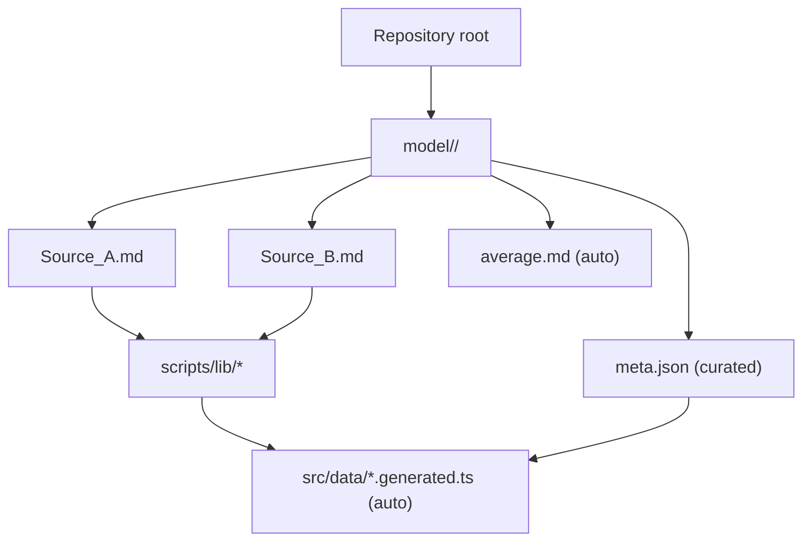
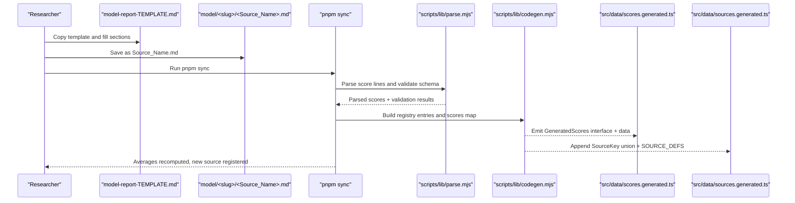
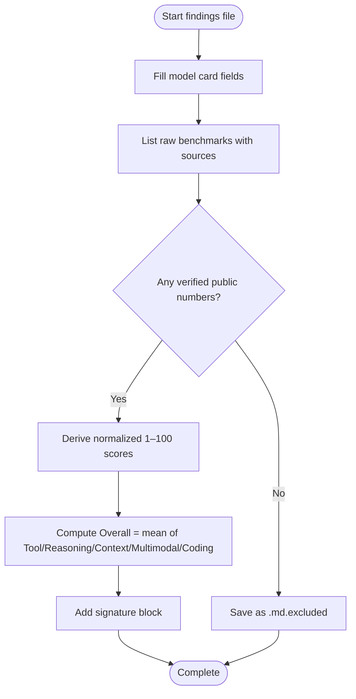
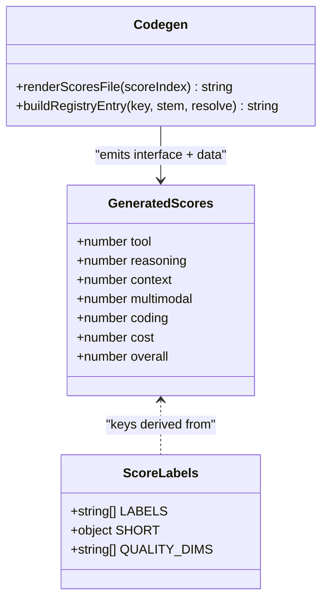
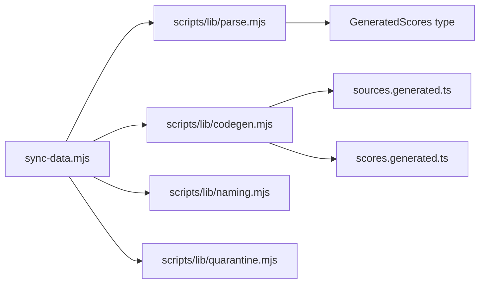

# Findings File Format & Structure

<cite>
**Referenced Files in This Document**
- [model-report-TEMPLATE.md](file://model-report-TEMPLATE.md)
- [model-findings.md](file://model-findings.md)
- [README.md](file://README.md)
- [model/README.md](file://model/README.md)
- [scripts/lib/parse.mjs](file://scripts/lib/parse.mjs)
- [scripts/lib/codegen.mjs](file://scripts/lib/codegen.mjs)
- [scripts/lib/naming.mjs](file://scripts/lib/naming.mjs)
- [scripts/lib/quarantine.mjs](file://scripts/lib/quarantine.mjs)
- [model/Inkling/meta.json](file://model/Inkling/meta.json)
- [model/big-pickle/meta.json](file://model/big-pickle/meta.json)
- [model/claude-opus-4.6/meta.json](file://model/claude-opus-4.6/meta.json)
</cite>

## Table of Contents
1. [Introduction](#introduction)
2. [Project Structure](#project-structure)
3. [Core Components](#core-components)
4. [Architecture Overview](#architecture-overview)
5. [Detailed Component Analysis](#detailed-component-analysis)
6. [Dependency Analysis](#dependency-analysis)
7. [Performance Considerations](#performance-considerations)
8. [Troubleshooting Guide](#troubleshooting-guide)
9. [Conclusion](#conclusion)

## Introduction
This document explains the self-contained findings file format used by ModelComp research, how researchers should populate it, and how it connects to generated TypeScript data structures. A findings file captures one agent’s independent evaluation of a model: its card, raw benchmarks, normalized 1–100 scores, and signature. The repository also maintains a cross-model signed log and per-model metadata for display.

## Project Structure
Findings live under `model/<slug>/`. Each folder represents one tracked model and contains:
- One findings file per reporting agent, named `<Source_Name>.md`
- An auto-generated `average.md` (never edited by hand)
- A curated `meta.json` describing display metadata

**Diagram sources**
- [README.md:31-44](file://README.md#L31-L44)
- [model/README.md:1-30](file://model/README.md#L1-L30)

**Section sources**
- [README.md:31-44](file://README.md#L31-L44)
- [model/README.md:1-30](file://model/README.md#L1-L30)

## Core Components
- **Findings file**: Self-contained Markdown with model card, raw benchmarks, normalized scores, and signature.
- **Cross-model signed log**: Per-model audit trail documenting what was found, what is missing, and who reported it.
- **Per-model metadata**: `meta.json` provides display fields such as id, name, short description, context window, modalities, and pricing note.
- **Sync pipeline**: Parses findings and metadata into generated TypeScript files consumed by the site build.

Key responsibilities:
- Researchers write findings independently using the template.
- `pnpm sync` validates, quarantines evidence-free files, computes averages, and generates typed data.
- The UI reads generated data; no manual edits to generated files are needed.

**Section sources**
- [model-report-TEMPLATE.md:1-104](file://model-report-TEMPLATE.md#L1-L104)
- [model-findings.md:1-10](file://model-findings.md#L1-L10)
- [model/README.md:32-57](file://model/README.md#L32-L57)
- [README.md:31-44](file://README.md#L31-L44)

## Architecture Overview
The end-to-end flow from researcher input to generated TypeScript types is deterministic and testable.

**Diagram sources**
- [README.md:31-44](file://README.md#L31-L44)
- [scripts/lib/parse.mjs:8-33](file://scripts/lib/parse.mjs#L8-L33)
- [scripts/lib/codegen.mjs:107-139](file://scripts/lib/codegen.mjs#L107-L139)

## Detailed Component Analysis

### Findings File Format
A findings file must be self-contained and follow the template structure:
- Header with source, date, and links to methodology and signed log
- Model card section with required fields
- Raw benchmarks section listing measured numbers with traceability
- Normalized scores section with 1–100 values and justifications
- Signature block identifying the provider and method

Important rules:
- Do not invent benchmark values; if none exist, save as `.md.excluded`.
- Scores are normalized interpretations, not official vendor scores.
- Overall Score is the half-up mean of five quality dimensions; Cost efficiency is scored separately and never included in Overall.

**Diagram sources**
- [model-report-TEMPLATE.md:14-104](file://model-report-TEMPLATE.md#L14-L104)
- [scripts/lib/parse.mjs:8-33](file://scripts/lib/parse.mjs#L8-L33)

**Section sources**
- [model-report-TEMPLATE.md:1-104](file://model-report-TEMPLATE.md#L1-L104)
- [scripts/lib/parse.mjs:8-33](file://scripts/lib/parse.mjs#L8-L33)

### Naming Conventions and Folder Organization
- Folder naming: filesystem-safe slug representing the model, typically the Zen ID suffix. Version numbers use dots, not hyphens (e.g., `gpt-5.5`, not `gpt-5-5`). Exceptions exist for parameter sizes or codenames.
- Findings filename: `<Source_Name>.md` using letters, digits, underscores, and optional version dots. Display label derives from the stem by replacing underscores with spaces.
- Slug version violations are detected and corrected during sync.

Examples:
- Valid: `muse-spark-1.3-contributor-free/DeepSeek_4.1_Flash.md`
- Invalid: `gpt-5-5/...` (should be `gpt-5.5/...`)

**Section sources**
- [model/README.md:7-30](file://model/README.md#L7-L30)
- [scripts/lib/naming.mjs:11-44](file://scripts/lib/naming.mjs#L11-L44)

### meta.json Schema
Required fields:
- `id`: Provider/model identifier (e.g., `opencode/big-pickle`)
- `name`: Official vendor display name (spaces allowed, underscores forbidden)
- `short`: One or two sentences describing the model and top use case
- `contextWindow`: Total tokens, optionally split into input/output
- `modalities`: Input/output capabilities (text/image/audio/video/PDF)
- `pricingNote`: Pricing summary including free/paid notes

Optional fields:
- `pricingTiers`: Array of tier descriptions
- `freeTierNote`: Tooltip text explaining how to obtain the free tier
- `noFreeId`: Boolean indicating absence of a Zen Free ID

Validation rules:
- Underscores in `name` are rejected.
- Missing required fields cause sync failures.

Examples:
- Basic entry: see [model/Inkling/meta.json:1-8](file://model/Inkling/meta.json#L1-L8)
- With tiers and free-tier note: see [model/big-pickle/meta.json:1-14](file://model/big-pickle/meta.json#L1-L14)
- Paid-only entry: see [model/claude-opus-4.6/meta.json:1-10](file://model/claude-opus-4.6/meta.json#L1-L10)

**Section sources**
- [model/README.md:32-57](file://model/README.md#L32-L57)
- [model/Inkling/meta.json:1-8](file://model/Inkling/meta.json#L1-L8)
- [model/big-pickle/meta.json:1-14](file://model/big-pickle/meta.json#L1-L14)
- [model/claude-opus-4.6/meta.json:1-10](file://model/claude-opus-4.6/meta.json#L1-L10)
- [scripts/lib/naming.mjs:64-72](file://scripts/lib/naming.mjs#L64-L72)

### Relationship Between Findings Files and Generated TypeScript Structures
The sync process parses findings files and emits:
- `src/data/scores.generated.ts`: Compact per-source scores mapped to short keys (`tool`, `reasoning`, `context`, `multimodal`, `coding`, `cost`, `overall`)
- `src/data/sources.generated.ts`: Source registry with keys, labels, filenames, and slugs

Score parsing contract:
- Seven labeled score lines are expected in canonical order
- Quality dimensions feed Overall; Cost efficiency is excluded from the mean
- Overall drift tolerance triggers automatic correction when within bounds

**Diagram sources**
- [scripts/lib/codegen.mjs:107-139](file://scripts/lib/codegen.mjs#L107-L139)
- [scripts/lib/parse.mjs:8-33](file://scripts/lib/parse.mjs#L8-L33)

**Section sources**
- [scripts/lib/parse.mjs:8-33](file://scripts/lib/parse.mjs#L8-L33)
- [scripts/lib/codegen.mjs:107-139](file://scripts/lib/codegen.mjs#L107-L139)

### Cross-Model Signed Log
The signed log documents per-model findings, signatures, and historical changes. It complements individual findings files by providing an aggregated audit trail.

Key aspects:
- Each model entry includes findings, scores, and signature
- Changelog tracks methodology updates and additions
- Provides context on free-tier usage and data privacy caveats

**Section sources**
- [model-findings.md:1-10](file://model-findings.md#L1-L10)
- [model-findings.md:198-202](file://model-findings.md#L198-L202)

## Dependency Analysis
The sync pipeline depends on pure modules for parsing, code generation, naming conventions, and quarantine logic.

**Diagram sources**
- [scripts/lib/parse.mjs:1-7](file://scripts/lib/parse.mjs#L1-L7)
- [scripts/lib/codegen.mjs:1-7](file://scripts/lib/codegen.mjs#L1-L7)
- [scripts/lib/naming.mjs:1-7](file://scripts/lib/naming.mjs#L1-L7)
- [scripts/lib/quarantine.mjs:1-7](file://scripts/lib/quarantine.mjs#L1-L7)

**Section sources**
- [scripts/lib/parse.mjs:1-7](file://scripts/lib/parse.mjs#L1-L7)
- [scripts/lib/codegen.mjs:1-7](file://scripts/lib/codegen.mjs#L1-L7)
- [scripts/lib/naming.mjs:1-7](file://scripts/lib/naming.mjs#L1-L7)
- [scripts/lib/quarantine.mjs:1-7](file://scripts/lib/quarantine.mjs#L1-L7)

## Performance Considerations
- Findings files are parsed at build time; prose content does not ship to the client bundle.
- Generated TypeScript files contain only compact numeric scores and registry data.
- Auto-quarantine prevents evidence-free files from affecting averages.

[No sources needed since this section provides general guidance]

## Troubleshooting Guide
Common issues and resolutions:
- **Evidence-free findings**: Files with zero verified benchmarks are quarantined as `.md.excluded`. Ensure at least some measured numbers are present.
- **Zero-scored dimensions**: Filing "no data" as 0 triggers quarantine. Use minimum floors (10+) or mark as excluded.
- **Flat scores across dimensions**: Uniform scores without cited numbers indicate invented uniformity and trigger quarantine.
- **Underscores in meta.json name**: Sync rejects names containing underscores; use official vendor casing with spaces.
- **Hyphen-versioned folders**: Version numbers should use dots; sync suggests corrections.

Validation helpers:
- Quarantine logic checks for missing benchmarks, zero scores, and flat distributions.
- Naming utilities detect underscore violations and hyphen-version issues.

**Section sources**
- [scripts/lib/quarantine.mjs:33-56](file://scripts/lib/quarantine.mjs#L33-L56)
- [scripts/lib/naming.mjs:64-72](file://scripts/lib/naming.mjs#L64-L72)

## Conclusion
The ModelComp findings file format ensures consistent, auditable research documentation. By following the template, adhering to naming conventions, and maintaining accurate meta.json files, researchers contribute reliable data that powers the comparison site. The sync pipeline automates validation, quarantine, and TypeScript generation, minimizing manual overhead while preserving data integrity.

[No sources needed since this section summarizes without analyzing specific files]