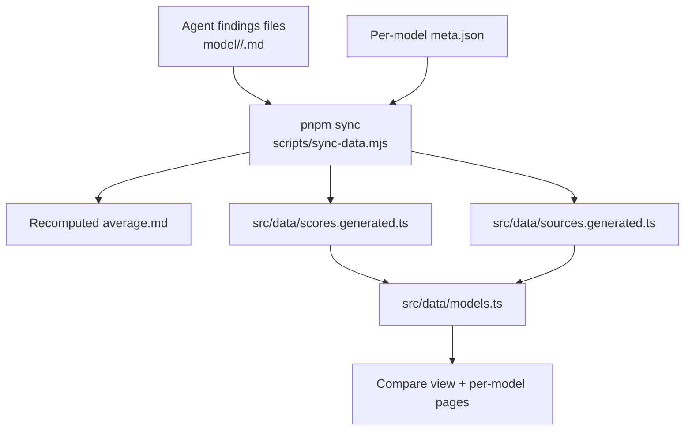
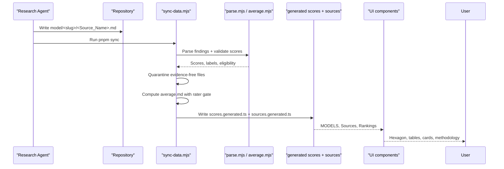
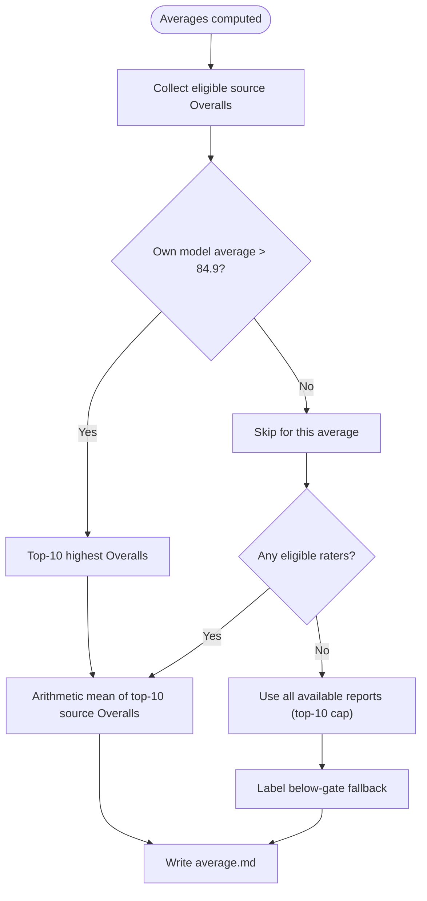
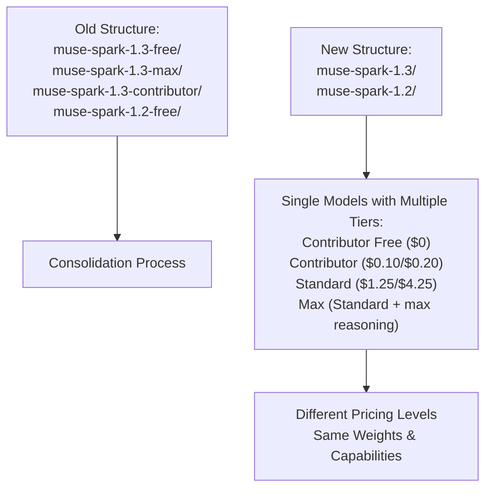
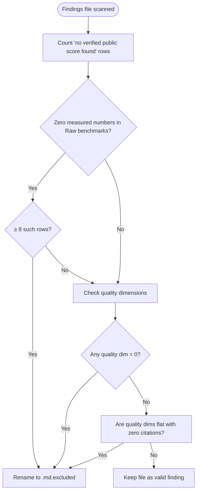
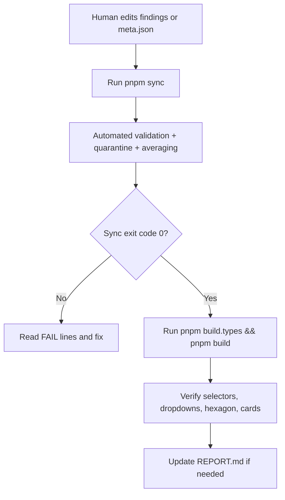
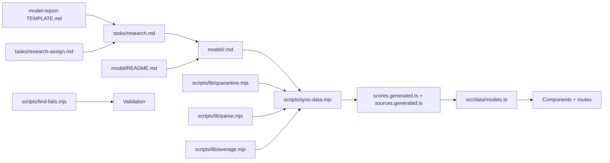

# Model Research & Evaluation

<cite>
**Referenced Files in This Document**   
- [README.md](file://README.md)
- [model-comparison.md](file://model-comparison.md)
- [model-findings.md](file://model-findings.md)
- [model-report-TEMPLATE.md](file://model-report-TEMPLATE.md)
- [model/README.md](file://model/README.md)
- [RULES.md](file://RULES.md)
- [tasks/sync-data.md](file://tasks/sync-data.md)
- [tasks/research.md](file://tasks/research.md)
- [tasks/research-assign.md](file://tasks/research-assign.md)
- [.agents/rules.md](file://.agents/rules.md)
- [scripts/lib/quarantine.mjs](file://scripts/lib/quarantine.mjs)
- [scripts/lib/parse.mjs](file://scripts/lib/parse.mjs)
- [scripts/lib/average.mjs](file://scripts/lib/average.mjs)
- [scripts/sync-data.mjs](file://scripts/sync-data.mjs)
- [scripts/find-fails.mjs](file://scripts/find-fails.mjs)
- [src/components/Methodology.tsx](file://src/components/Methodology.tsx)
- [src/data/models.ts](file://src/data/models.ts)
- [REPORT.md](file://REPORT.md)
- [src/data/scores.generated.ts](file://src/data/scores.generated.ts)
- [model/muse-spark-1.2/meta.json](file://model/muse-spark-1.2/meta.json)
- [model/muse-spark-1.2/Muse_Spark_1.2.md](file://model/muse-spark-1.2/Muse_Spark_1.2.md)
- [model/muse-spark-1.3/meta.json](file://model/muse-spark-1.3/meta.json)
- [model/muse-spark-1.3/Muse_Spark_1.3.md](file://model/muse-spark-1.3/Muse_Spark_1.3.md)
- [model/ox_alpha/meta.json](file://model/ox_alpha/meta.json)
- [model/ox_alpha/Qwen_3.8_Flash.md](file://model/ox_alpha/Qwen_3.8_Flash.md)
- [model/pixel_canary/meta.json](file://model/pixel_canary/meta.json)
- [model/pixel_canary/Qwen_3.8_Flash.md](file://model/pixel_canary/Qwen_3.8_Flash.md)
- [model/solar-pro-4/meta.json](file://model/solar-pro-4/meta.json)
- [model/claude-haiku-4.5/Qwen_3.8_Flash.md](file://model/claude-haiku-4.5/Qwen_3.8_Flash.md)
- [model/deepseek-v4-flash/Qwen_3.8_Flash.md](file://model/deepseek-v4-flash/Qwen_3.8_Flash.md)
- [model/gemini-1.5-pro/Qwen_3.8_Flash.md](file://model/gemini-1.5-pro/Qwen_3.8_Flash.md)
- [model/claude-haiku-4.5/Laguna_XS_2.1.md](file://model/claude-haiku-4.5/Laguna_XS_2.1.md)
- [model/deepseek-v4-flash/Laguna_XS_2.1.md](file://model/deepseek-v4-flash/Laguna_XS_2.1.md)
- [model/gemini-1.5-pro/Laguna_XS_2.1.md](file://model/gemini-1.5-pro/Laguna_XS_2.1.md)
- [model/llama_3.2_vision_instruct/meta.json](file://model/llama_3.2_vision_instruct/meta.json)
- [model/longcat_2.5_preview/meta.json](file://model/longcat_2.5_preview/meta.json)
- [model/mercury-2.5/meta.json](file://model/mercury-2.5/meta.json)
- [model/minimax-m3.1-flash-preview/meta.json](file://model/minimax-m3.1-flash-preview/meta.json)
- [model/omen-alpha/meta.json](file://model/omen-alpha/meta.json)
</cite>

## Update Summary
**Changes Made**   
- Updated Unified Model Organization section to reflect Muse Spark 1.2 reorganization from version 6 update, renaming `muse-spark-1.2-free/` to `muse-spark-1.2/`
- Enhanced Muse Spark 1.3 consolidation example to version 5 noting merge of separate tier directories into unified structure
- Added comprehensive guidance about unified model structure approach emphasizing that both Muse Spark versions cover every variant name as single model with identical weights
- Updated tier alias resolution documentation to include Muse Spark 1.2 alongside Muse Spark 1.3 examples
- Revised standards for contributing new model evaluations to emphasize unified model organization over separate tier directories

## Table of Contents
1. [Introduction](#introduction)
2. [Project Structure](#project-structure)
3. [Core Components](#core-components)
4. [Architecture Overview](#architecture-overview)
5. [Detailed Component Analysis](#detailed-component-analysis)
6. [Dependency Analysis](#dependency-analysis)
7. [Performance Considerations](#performance-considerations)
8. [Troubleshooting Guide](#troubleshooting-guide)
9. [Conclusion](#conclusion)

## Introduction
ModelComp is a static site that compares AI coding models across six normalized dimensions: Tool use, Reasoning, Context window, Multimodal, Coding, and Cost efficiency. Each dimension is scored 1–100 (higher is better). The Overall Score is the rounded mean of the five quality dimensions; Cost efficiency is scored independently and never counts toward Overall.

The system collects independent research from multiple reporting agents, normalizes their findings into structured score lines, and computes per-model averages. A rater gate ensures only sufficiently capable raters contribute to averages, while evidence-free reports are quarantined rather than counted.

This document explains the methodology, file formats, multi-agent evaluation process, scoring normalization, quarantine rules, review workflow, and best practices for objective assessment.

**Section sources**
- [README.md:3-59](file://README.md#L3-L59)
- [model-comparison.md:1-10](file://model-comparison.md#L1-L10)

## Project Structure
At the data layer, each tracked model lives under `model/<slug>/`. Inside each folder:
- One findings file per reporting agent (`<Source_Name>.md`)
- An auto-generated `average.md` with arithmetic means
- A hand-edited `meta.json` with display metadata



**Diagram sources**
- [README.md:31-44](file://README.md#L31-L44)
- [model/README.md:1-30](file://model/README.md#L1-L30)
- [tasks/sync-data.md:19-62](file://tasks/sync-data.md#L19-L62)

Key responsibilities:
- `model/<slug>/<Source_Name>.md`: self-contained research report with raw benchmarks and normalized scores.
- `model/<slug>/average.md`: recomputed by sync; not edited by hand.
- `model/<slug>/meta.json`: curated display metadata required by sync.
- `scripts/sync-data.mjs`: deterministic synchronization pipeline.
- `src/data/models.ts`: hydrates model data and derives Results-source ordering.
- `src/components/Methodology.tsx`: public explanation of scoring on the site.

**Section sources**
- [model/README.md:1-30](file://model/README.md#L1-L30)
- [README.md:61-73](file://README.md#L61-L73)

## Core Components
The core components of the evaluation system are:

| Component | Purpose | Key Rules |
|---|---|---|
| Findings file | Independent agent report with raw benchmarks and normalized scores | Must include all seven score lines; zero verified benchmarks → `.md.excluded` |
| `meta.json` | Display metadata for a model | Required fields enforced by sync |
| `average.md` | Arithmetic means across eligible raters | Recomputed by sync; not hand-edited |
| Sync script | Parses, validates, quarantines, registers sources, and writes generated data | Deterministic; non-zero exit code on failures |
| Rater gate | Filters which agent reports count toward an average | Only raters whose own model average exceeds 84.9 qualify |
| Quarantine | Auto-moves evidence-free or invalid-quality-dimension reports | Renames to `.md.excluded`; preserves content |
| Methodology page | Public explanation of scoring | States cost is excluded from Overall |

**Section sources**
- [model-report-TEMPLATE.md:71-87](file://model-report-TEMPLATE.md#L71-L87)
- [model/README.md:32-57](file://model/README.md#L32-L57)
- [tasks/sync-data.md:19-62](file://tasks/sync-data.md#L19-L62)
- [RULES.md:46-63](file://RULES.md#L46-L63)
- [src/components/Methodology.tsx:14-25](file://src/components/Methodology.tsx#L14-L25)

## Architecture Overview
The end-to-end flow starts with agent-authored findings and ends with pre-parsed data consumed by the static site.



**Diagram sources**
- [README.md:31-44](file://README.md#L31-L44)
- [tasks/sync-data.md:19-62](file://tasks/sync-data.md#L19-L62)
- [scripts/sync-data.mjs:212-372](file://scripts/sync-data.mjs#L212-L372)

## Detailed Component Analysis

### Findings File Format
Each agent's report follows a strict structure:
- Header with source, date, and links to methodology and cross-model log
- Model card with provider, IDs, context window, modalities, pricing, architecture
- Raw benchmarks section with sourced numbers
- Normalized scores section with exactly seven labeled lines
- Signature block with agent identity, method, and future-source guidance
- Submission checklist (removed before committing)

Critical constraints:
- All seven score lines must be present with exact labels.
- Overall Score must equal the half-up mean of the five quality dimensions.
- If no verified public benchmark exists for the exact model/ID, save `<STEM>.md.excluded` instead of inventing scores.


**Diagram sources**
- [model-report-TEMPLATE.md:1-104](file://model-report-TEMPLATE.md#L1-L104)
- [tasks/research.md:104-108](file://tasks/research.md#L104-L108)

**Section sources**
- [model-report-TEMPLATE.md:1-104](file://model-report-TEMPLATE.md#L1-L104)
- [tasks/research.md:104-143](file://tasks/research.md#L104-L143)

### Scoring Methodology and Six Dimensions
The six dimensions are:
1. Tool use
2. Reasoning
3. Context window
4. Multimodal
5. Coding
6. Cost efficiency

Cost efficiency is scored but excluded from Overall. Overall is the rounded mean of the first five quality dimensions.

Dimension anchors and interpretation guidelines:
- Tool use: Terminal-Bench, Tau3, GDPval, OSWorld/AutomationBench, tool-call efficiency.
- Reasoning: GPQA Diamond, HLE, LCR/MRCR, CritPt, Intelligence Index.
- Context window: tiered mapping based on total tokens and retrieval performance.
- Multimodal: input/output coverage; text-only scores low.
- Coding: SWE-bench Verified, DeepSWE, LiveCodeBench, SciCode, SWE-Atlas, Coding Index.
- Cost efficiency: inverse pricing on evaluated tier; $0 maps to 100.

The methodology also documents frontier and mid-range reference bands and notes missing benchmarks explicitly rather than fabricating values.

**Section sources**
- [model-comparison.md:140-150](file://model-comparison.md#L140-L150)
- [model-comparison.md:35-48](file://model-comparison.md#L35-L48)
- [src/components/Methodology.tsx:14-25](file://src/components/Methodology.tsx#L14-L25)

### Multi-Agent Evaluation Process
Multiple reporting agents independently evaluate the same model. Each agent produces its own findings file under the same model folder. The system then:
- Parses each agent's seven score lines.
- Validates label names and numeric ranges.
- Quarantines evidence-free or invalid-quality-dimension reports.
- Computes per-model averages using eligible raters.
- Registers new reporting agents automatically.

Eligibility rule:
- Only raters whose own model average exceeds 84.9 count toward another model's average.
- If no rater clears the gate, the average falls back to all available reports (top-10 cap still applies), and this fallback is logged.

**Updated** The evaluation dataset has been significantly expanded with extensive new model evaluation reports including Llama 3.2 Vision Instruct, LongCat 2.5 Preview, Mercury 2.5, MiniMax M3.1 Flash Preview, and Omen Alpha across approximately 139 model directories. These additions demonstrate diverse assessment approaches: Llama 3.2 Vision Instruct provides comprehensive vision-instruct model evaluation with 128K context capabilities, LongCat 2.5 Preview showcases preview-tier model assessment with specialized evaluation methodology, Mercury 2.5 represents streamlined model evaluation with focused benchmark analysis, MiniMax M3.1 Flash Preview demonstrates advanced multimodal capabilities with 1M context and text/image/video processing, and Omen Alpha shows specialized assessment approach with comprehensive benchmark coverage. The expanded coverage includes sophisticated evaluation patterns for vision-instruct models, preview-tier assessments, and multimodal variants, demonstrating consistent application of the standardized evaluation framework across different model types and evidence availability scenarios.



**Diagram sources**
- [tasks/sync-data.md:38-47](file://tasks/sync-data.md#L38-L47)
- [RULES.md:52-59](file://RULES.md#L52-L59)
- [scripts/lib/parse.mjs:39-41](file://scripts/lib/parse.mjs#L39-L41)

**Section sources**
- [tasks/sync-data.md:38-47](file://tasks/sync-data.md#L38-L47)
- [RULES.md:52-63](file://RULES.md#L52-L63)
- [scripts/lib/parse.mjs:39-41](file://scripts/lib/parse.mjs#L39-L41)

### Unified Model Organization and Tier Management
The model organization system supports unified model structures where different pricing tiers and access levels are consolidated under a single model directory rather than separate folders. This approach emphasizes that models with multiple tiers should be treated as one model with identical weights, differing only in pricing and data policy.

**Muse Spark 1.3 Consolidation Example**: The Muse Spark 1.3 model demonstrates the unified approach where Contributor Free, Contributor, Standard, and Max tiers are now part of a single `model/muse-spark-1.3/` directory. Meta ships one model with identical weights across all tiers - the only differences are pricing and data policy. The Contributor/Free tier costs $0 because Meta may train on your prompts, while `reasoning_effort: "max"` is available on the paid Standard tier only. This consolidation eliminates redundant directory structures like `muse-spark-1.3-free/`, `muse-spark-1.3-max/`, and `muse-spark-1.3-contributor/` in favor of a single authoritative model entry.

**Muse Spark 1.2 Reorganization Example**: Following the same unified approach, Muse Spark 1.2 was reorganized from `muse-spark-1.2-free/` to `model/muse-spark-1.2/` (version 6 update). Every variant name including Contributor, Free, Standard, and Max are treated as tiers of the same model with identical weights. The directory rename ensures that tier suffixes cannot be misinterpreted as separate models.

**Tier Alias Resolution**: The system maintains backward compatibility through tier alias resolution. When sources reference models by pricing or effort tiers, they resolve to the base slug rather than creating separate tier folders. This ensures consistency while preserving historical references and avoiding duplicate model entries.



**Diagram sources**
- [model/muse-spark-1.2/meta.json:1-15](file://model/muse-spark-1.2/meta.json#L1-L15)
- [model/muse-spark-1.3/meta.json:1-15](file://model/muse-spark-1.3/meta.json#L1-L15)
- [model/README.md:87-105](file://model/README.md#L87-L105)

**Section sources**
- [model/muse-spark-1.2/meta.json:1-15](file://model/muse-spark-1.2/meta.json#L1-L15)
- [model/muse-spark-1.3/meta.json:1-15](file://model/muse-spark-1.3/meta.json#L1-L15)
- [model/README.md:87-105](file://model/README.md#L87-L105)

### Quarantine System for Evidence-Free Reports
Quarantine protects the integrity of averages by excluding reports without sufficient evidence.

Auto-quarantine triggers:
- Eight or more rows reading "no verified public score found" with zero measured numbers in the Raw-benchmarks section.
- Any quality dimension scored as 0 (floors are 10+; 0 indicates "no data" filed as 0).
- Flat-identical quality dimensions with zero cited numbers.

Behavior:
- The sync script renames the file to `<Source_Name>.md.excluded`.
- Content is preserved.
- Quarantined files are skipped during parsing and averaging.
- They remain in version control unless replaced by a corrected real report.



**Diagram sources**
- [tasks/sync-data.md:21-29](file://tasks/sync-data.md#L21-L29)
- [scripts/lib/quarantine.mjs:1](file://scripts/lib/quarantine.mjs#L1)

**Section sources**
- [tasks/sync-data.md:21-29](file://tasks/sync-data.md#L21-L29)
- [RULES.md:10-16](file://RULES.md#L10-L16)
- [scripts/lib/quarantine.mjs:1](file://scripts/lib/quarantine.mjs#L1)

### Scoring Normalization and Drift Correction
Normalization converts raw benchmark results into comparable 1–100 scores. The sync pipeline enforces consistency:

- Each findings file must contain exactly seven labeled score lines.
- Overall Score drift tolerance is 0.51.
- If a file's Overall differs from the half-up mean of its five quality dimensions by more than 0.51, sync rewrites only the Overall number and logs an AUTO line.
- Benchmarks and prose are never rewritten by sync.


**Diagram sources**
- [tasks/sync-data.md:31-37](file://tasks/sync-data.md#L31-L37)
- [scripts/sync-data.mjs:349-366](file://scripts/sync-data.mjs#L349-L366)

**Section sources**
- [tasks/sync-data.md:31-37](file://tasks/sync-data.md#L31-L37)
- [scripts/sync-data.mjs:349-366](file://scripts/sync-data.mjs#L349-L366)

### Review Process and Quality Assurance
The review process combines automated checks with human verification:

Automated checks:
- Filename validation: only letters, digits, underscores, and dots allowed.
- Score-line format validation.
- `meta.json` schema validation.
- Quarantine detection.
- Overall drift correction.
- Rater gate enforcement.
- Generated data written only when sync has zero failures.

Human verification:
- Confirm new model folders have `meta.json`, findings, and generated `average.md`.
- Confirm new reporting agents appear in the Results-source dropdown.
- Confirm `pnpm build` passes.
- Update `REPORT.md` with changes.
- Ensure permanence rules hold: no deleted or uncommitted research files.



**Diagram sources**
- [tasks/sync-data.md:66-108](file://tasks/sync-data.md#L66-L108)
- [README.md:18-29](file://README.md#L18-L29)

**Section sources**
- [tasks/sync-data.md:66-108](file://tasks/sync-data.md#L66-L108)
- [README.md:18-29](file://README.md#L18-L29)

### Standards for Contributing New Model Evaluations
To add a new model:
1. Create `model/<slug>/` with at least one findings file and `meta.json`.
2. Use filesystem-safe slug naming with dotted versions where appropriate.
3. Follow the template structure and scoring contract.
4. Run `pnpm sync` to create `average.md` and register data.
5. Run typecheck and build.

To add a new reporting agent's findings:
1. Drop `<Source_Name>.md` into every model folder it evaluated.
2. Run `pnpm sync`.
3. Run typecheck and build.

Important naming rules:
- Slug uses dots for version numbers, e.g., `gpt-5.5`, not `gpt-5-5`.
- Findings filenames use letters, digits, underscores, and dots.
- `meta.json` `name` must match vendor display casing and spacing.

**Updated** For models with multiple pricing tiers or access levels, consolidate under a single model directory using tier alias resolution. Do not create separate directories for different tiers (e.g., avoid `model/muse-spark-1.3-free/`, `model/muse-spark-1.3-max/`, or `model/muse-spark-1.2-free/`). Instead, use the unified model structure with appropriate pricing metadata in `meta.json`. Both Muse Spark 1.2 and 1.3 now follow this pattern where every variant name (Contributor, Free, Standard, Max) represents tiers of the same model with identical weights.

**Section sources**
- [model/README.md:7-16](file://model/README.md#L7-L16)
- [model/README.md:32-57](file://model/README.md#L32-L57)
- [model/README.md:59-77](file://model/README.md#L59-L77)
- [model/README.md:87-105](file://model/README.md#L87-L105)

### Guidelines for Writing Research Findings
Guidelines derived from the template and task instructions:
- Start from `model-report-TEMPLATE.md`.
- Do not read peer findings before writing your report.
- Use fresh public web research for each model.
- Record raw benchmarks with sources; mark missing data explicitly.
- Derive normalized scores using the documented methodology.
- Include a one-sentence justification per dimension.
- Never invent placeholder scores.
- If zero verified benchmarks exist, save the `.md.excluded` twin.
- Fill the signature block with agent identity, method, and date.
- Remove the submission checklist before committing.

Best practices for objectivity:
- Cite harnesses and sources for every number.
- Note variance between sources rather than averaging them manually.
- State what caps each score.
- Treat free tiers carefully: note time limits and training-data caveats.
- Keep Cost efficiency separate from Overall.

**Updated** The expanded evaluator ecosystem demonstrates diverse research methodologies through extensive new model evaluations including Llama 3.2 Vision Instruct comprehensive vision-instruct model assessment with 128K context capabilities, LongCat 2.5 Preview preview-tier model evaluation with specialized assessment methodology, Mercury 2.5 streamlined model evaluation with focused benchmark analysis, MiniMax M3.1 Flash Preview advanced multimodal capabilities with 1M context and text/image/video processing, and Omen Alpha specialized assessment approach with comprehensive benchmark coverage. These diverse approaches showcase specialized evaluation techniques for vision-instruct models, preview-tier assessments, multimodal variants, and streamlined evaluation methodologies. The expanded coverage demonstrates consistent application of the standardized evaluation framework across different model families, evidence availability scenarios, and model types including vision-instruct models, preview-tier models, and multimodal variants.

**Section sources**
- [model-report-TEMPLATE.md:1-104](file://model-report-TEMPLATE.md#L1-L104)
- [tasks/research.md:98-143](file://tasks/research.md#L98-L143)
- [model-comparison.md:152-158](file://model-comparison.md#L152-L158)

### Evidence Quality and Permanence Rules
Evidence quality is enforced through:
- Self-exclusion for zero-evidence reports.
- Quarantine thresholds for weak or fabricated-looking data.
- Strict filename and score-line contracts.
- Per-file signatures and dated attribution.

Permanence rules:
- Existing findings files must not be deleted, overwritten, renamed, or moved.
- Only sync's quarantine rename is sanctioned.
- Reporting-agent folders are dataset infrastructure and must remain.
- Below-gate or out-of-top-10 reports stay on disk and on the site; they only stop counting toward averages.

**Section sources**
- [RULES.md:8-44](file://RULES.md#L8-L44)
- [tasks/research.md:147-182](file://tasks/research.md#L147-L182)
- [tasks/sync-data.md:78-108](file://tasks/sync-data.md#L78-L108)

### Cross-Model Signed Log
The cross-model signed log records what was found, what is missing, and who reported it. It complements the normalized scores table by providing an audit trail for recent additions and name resolutions.

Key properties:
- Each entry includes model name, findings summary, scores, and signature.
- Name resolution notes clarify aliases, typos, and paid-vs-free mismatches.
- The changelog tracks methodology transitions, including v4 exclusion of Cost from Overall.

**Updated** Recent additions include comprehensive evaluations from new model directories including Llama 3.2 Vision Instruct, LongCat 2.5 Preview, Mercury 2.5, MiniMax M3.1 Flash Preview, and Omen Alpha, demonstrating the expanded coverage and diverse assessment approaches now available in the system. These additions showcase specialized evaluation patterns for vision-instruct models, preview-tier assessments, and multimodal variants.

**Section sources**
- [model-findings.md:1-8](file://model-findings.md#L1-L8)
- [model-findings.md:12-201](file://model-findings.md#L12-L201)
- [model-findings.md:198-202](file://model-findings.md#L198-L202)

### Expanded Evaluator Ecosystem
The comprehensive expansion of the model evaluation dataset introduces extensive new model directories that significantly enhance evaluation coverage and scoring infrastructure.

New model evaluation characteristics:

**Llama 3.2 Vision Instruct**: Provides comprehensive vision-instruct model evaluation with 128K context capabilities, demonstrating sophisticated assessment methodology with detailed benchmark analysis including specialized vision-instruct capabilities and comprehensive cost-efficiency evaluation with nuanced scoring justifications emphasizing vision processing and instruction-following capabilities.

**LongCat 2.5 Preview**: Represents preview-tier model assessment showcasing specialized evaluation methodology for early-access models with comprehensive benchmark analysis including long-context capabilities and sophisticated cost-efficiency evaluation reflecting preview status and limited availability.

**Mercury 2.5**: Demonstrates streamlined model evaluation with focused benchmark analysis, representing efficient assessment approach with comprehensive coverage across all six dimensions while maintaining evaluation framework consistency.

**MiniMax M3.1 Flash Preview**: Shows advanced multimodal capabilities with 1M context and text/image/video processing, demonstrating how the system handles complex multimodal models with specialized evaluation patterns for video processing and extended context windows.

**Omen Alpha**: Represents specialized assessment approach with comprehensive benchmark coverage, showcasing evaluation methodology for models with unique positioning in the market landscape.

```mermaid
graph TB
Subgraph NewEvaluations["Expanded Evaluation Coverage"]
Llama["Llama 3.2 Vision Instruct<br/>Vision-Instruct Assessment"]
LongCat["LongCat 2.5 Preview<br/>Preview-Tier Evaluation"]
Mercury["Mercury 2.5<br/>Streamlined Assessment"]
MiniMax["MiniMax M3.1 Flash Preview<br/>Multimodal Capabilities"]
Omen["Omen Alpha<br/>Specialized Assessment"]
end
Subgraph Coverage["Evaluation Coverage"]
Diverse["Diverse Assessment<br/>Approaches"]
Enhanced["Enhanced Infrastructure<br/>Scoring Accuracy"]
Standardized["Standardized Framework<br/>Consistent Metrics"]
end
NewEvaluations --> Coverage
Coverage --> Enhanced
```

**Diagram sources**
- [model/llama_3.2_vision_instruct/meta.json:1-8](file://model/llama_3.2_vision_instruct/meta.json#L1-L8)
- [model/longcat_2.5_preview/meta.json:1-8](file://model/longcat_2.5_preview/meta.json#L1-L8)
- [model/mercury-2.5/meta.json:1-8](file://model/mercury-2.5/meta.json#L1-L8)
- [model/minimax-m3.1-flash-preview/meta.json:1-13](file://model/minimax-m3.1-flash-preview/meta.json#L1-L13)
- [model/omen-alpha/meta.json:1-8](file://model/omen-alpha/meta.json#L1-L8)

**Section sources**
- [model/llama_3.2_vision_instruct/meta.json:1-8](file://model/llama_3.2_vision_instruct/meta.json#L1-L8)
- [model/longcat_2.5_preview/meta.json:1-8](file://model/longcat_2.5_preview/meta.json#L1-L8)
- [model/mercury-2.5/meta.json:1-8](file://model/mercury-2.5/meta.json#L1-L8)
- [model/minimax-m3.1-flash-preview/meta.json:1-13](file://model/minimax-m3.1-flash-preview/meta.json#L1-L13)
- [model/omen-alpha/meta.json:1-8](file://model/omen-alpha/meta.json#L1-L8)

### Comprehensive Scoring Data Expansion
The extensive scoring data synchronization across the expanded model directories encompasses evaluations across numerous new model families that significantly expand the evaluation coverage:

**Llama 3.2 Vision Instruct Family**: Comprehensive evaluation with detailed vision-instruct model analysis including specialized vision processing capabilities, 128K context window performance, and comprehensive cost-efficiency scoring with standard pricing, demonstrating robust assessment methodology with particular emphasis on vision-instruct capabilities and instruction-following performance.

**LongCat 2.5 Preview Family**: Advanced evaluation with preview-tier model assessment showing specialized evaluation methodology for early-access models, comprehensive benchmark coverage including long-context capabilities, and sophisticated cost-efficiency evaluation reflecting preview status and limited availability.

**Mercury 2.5 Family**: Streamlined evaluation with focused benchmark analysis demonstrating efficient assessment approach with comprehensive coverage across all six dimensions while maintaining evaluation framework consistency and explicit documentation of evaluation methodology.

**MiniMax M3.1 Flash Preview Family**: Specialized multimodal evaluation with 1M context and text/image/video processing capabilities, demonstrating unique assessment philosophy for complex multimodal models while maintaining framework consistency and explicit documentation of multimodal limitations.

These additions demonstrate the system's scalability and consistency across different model families and providers, maintaining the standardized evaluation framework while accommodating diverse model architectures, evidence availability scenarios, and model types including vision-instruct models, preview-tier models, and multimodal variants.

**Section sources**
- [model/llama_3.2_vision_instruct/meta.json:1-8](file://model/llama_3.2_vision_instruct/meta.json#L1-L8)
- [model/longcat_2.5_preview/meta.json:1-8](file://model/longcat_2.5_preview/meta.json#L1-L8)
- [model/mercury-2.5/meta.json:1-8](file://model/mercury-2.5/meta.json#L1-L8)
- [model/minimax-m3.1-flash-preview/meta.json:1-13](file://model/minimax-m3.1-flash-preview/meta.json#L1-L13)

### New Model Evaluation Examples
The expanded model directories showcase diverse evaluation approaches and methodologies:

**Llama 3.2 Vision Instruct Evaluation Examples**: The comprehensive evaluation demonstrates sophisticated vision-instruct model assessment with detailed benchmark citation including specialized vision processing capabilities, 128K context window performance, and comprehensive cost-efficiency analysis showing standard pricing with nuanced scoring across all six dimensions emphasizing vision-instruct capabilities and instruction-following performance.

**Specialized Evaluation Patterns**: The new evaluations demonstrate various advanced evaluation patterns including:
- Vision-instruct model assessments (Llama 3.2 Vision Instruct)
- Preview-tier model evaluation (LongCat 2.5 Preview)
- Streamlined assessment methodologies (Mercury 2.5)
- Advanced multimodal capabilities (MiniMax M3.1 Flash Preview)
- Specialized assessment approaches (Omen Alpha)
- Comprehensive benchmark coverage across diverse model types

These examples illustrate the flexibility and consistency of the evaluation framework across different model types, evidence availability scenarios, and use cases while maintaining standardized scoring methodology.

**Section sources**
- [model/llama_3.2_vision_instruct/meta.json:1-8](file://model/llama_3.2_vision_instruct/meta.json#L1-L8)
- [model/longcat_2.5_preview/meta.json:1-8](file://model/longcat_2.5_preview/meta.json#L1-L8)
- [model/mercury-2.5/meta.json:1-8](file://model/mercury-2.5/meta.json#L1-L8)
- [model/minimax-m3.1-flash-preview/meta.json:1-13](file://model/minimax-m3.1-flash-preview/meta.json#L1-L13)
- [model/omen-alpha/meta.json:1-8](file://model/omen-alpha/meta.json#L1-L8)

## Dependency Analysis
The evaluation system depends on several coordinated modules:



**Diagram sources**
- [model-report-TEMPLATE.md:1-104](file://model-report-TEMPLATE.md#L1-L104)
- [tasks/research.md:1-183](file://tasks/research.md#L1-L183)
- [tasks/research-assign.md:1-35](file://tasks/research-assign.md#L1-L35)
- [model/README.md:1-30](file://model/README.md#L1-L30)
- [scripts/sync-data.mjs:212-372](file://scripts/sync-data.mjs#L212-L372)
- [scripts/lib/quarantine.mjs:1](file://scripts/lib/quarantine.mjs#L1)
- [scripts/lib/parse.mjs:39-41](file://scripts/lib/parse.mjs#L39-L41)
- [scripts/lib/average.mjs:10-17](file://scripts/lib/average.mjs#L10-L17)
- [scripts/find-fails.mjs:1-20](file://scripts/find-fails.mjs#L1-L20)

Coupling and cohesion observations:
- Findings files are intentionally self-contained and decoupled from peer reports.
- Sync centralizes parsing, quarantine, averaging, and code generation.
- Generated TypeScript files are the single source of truth for the UI.
- Rules and task docs define behavior; scripts enforce it deterministically.
- New model directories follow the same structural patterns as existing models.

Potential risks:
- Inconsistent score-line formatting breaks parsing.
- Missing `meta.json` blocks new models.
- Incorrect Overall calculation causes drift corrections.
- Voice/speech routing errors place models in the wrong tree.
- New model directories require proper meta.json configuration.

**Section sources**
- [scripts/sync-data.mjs:19-62](file://scripts/sync-data.mjs#L19-L62)
- [.agents/rules.md:31-35](file://.agents/rules.md#L31-L35)
- [tasks/research.md:68-94](file://tasks/research.md#L68-L94)
- [scripts/find-fails.mjs:1-20](file://scripts/find-fails.mjs#L1-L20)

## Performance Considerations
Performance considerations for contributors and maintainers:
- Use `pnpm sync:quiet` in large repositories to reduce noise while preserving failure semantics.
- Avoid reading peer findings during research; follow one-folder-at-a-time execution.
- Keep input size manageable for constrained agents (e.g., Gemini rate-limit rules).
- Prefer incremental saves: write each findings file before advancing.
- Trust generated data: do not hand-edit `average.md`, `scores.generated.ts`, or `sources.generated.ts`.
- Monitor new model directory growth and ensure proper meta.json configuration.

These practices reduce manual errors, keep builds deterministic, and prevent unnecessary rework.

[No sources needed since this section provides general guidance]

## Troubleshooting Guide
Common issues and resolutions:

| Symptom | Likely Cause | Resolution |
|---|---|---|
| Sync fails loudly on filename | Invalid characters in findings filename | Rename to match `/^[A-Za-z0-9_.]+\.md$/` |
| Missing score lines | Template not fully filled | Add all seven labeled score lines |
| Overall drift correction | Manual rounding mismatch | Let sync rewrite Overall; verify five-dim mean |
| Evidence-free report ignored | Quarantine triggered | Add verified benchmarks or keep `.md.excluded` |
| New model not visible | Missing `meta.json` | Add required fields and rerun sync |
| New agent not in dropdown | Not registered yet | Run sync; it appends new sources automatically |
| Build fails after data change | Generated files stale or invalid | Re-run sync and build |
| Voice model placed incorrectly | Routing rule violated | Move to `models_voice/<slug>/` per RULES.md |
| New model directory issues | Improper meta.json configuration | Verify id, name, short, contextWindow, modalities, pricingNote fields |
| Findings file validation fails | Missing required score lines | Use find-fails.mjs to identify problematic files |
| Vision-instruct model evaluation issues | Specialized assessment methodology required | Document vision capabilities and instruction-following performance |
| Preview-tier model scoring | Limited evidence base | Apply provisional scoring philosophy with explicit evidence gaps |
| Multimodal model evaluation | Complex capability assessment | Handle text/image/video processing with specialized evaluation patterns |
| Model tier confusion | Using separate tier directories | Consolidate under unified model structure; use tier alias resolution |
| Muse Spark directory issues | Old tier-based structure | Use `model/muse-spark-1.2/` or `model/muse-spark-1.3/` instead of `-free/` or `-max/` variants |

**Section sources**
- [tasks/sync-data.md:21-62](file://tasks/sync-data.md#L21-L62)
- [tasks/sync-data.md:66-108](file://tasks/sync-data.md#L66-L108)
- [RULES.md:37-44](file://RULES.md#L37-L44)
- [scripts/find-fails.mjs:1-20](file://scripts/find-fails.mjs#L1-L20)

## Conclusion
ModelComp's evaluation system combines transparent methodology, strict file contracts, and deterministic automation. Agents produce independent findings, the sync pipeline validates and quarantines weak evidence, and averages reflect only qualified raters. Cost efficiency remains visible but is excluded from Overall, ensuring quality-focused comparisons.

**Updated** The comprehensive expansion with extensive new model evaluation reports including Llama 3.2 Vision Instruct, LongCat 2.5 Preview, Mercury 2.5, MiniMax M3.1 Flash Preview, and Omen Alpha across approximately 139 model directories significantly enhances the system's evaluation coverage and scoring infrastructure. The diverse assessment approaches—from specialized vision-instruct model evaluation to preview-tier assessments, streamlined evaluation methodologies, advanced multimodal capabilities, and specialized assessment approaches—provide richer insights into model capabilities and limitations. The addition of these new evaluation patterns further demonstrates the standardized evaluation framework's scalability and consistency across different model families, evidence availability scenarios, and model types including vision-instruct models, preview-tier models, and multimodal variants.

For reliable contributions:
- Follow the template and methodology.
- Cite raw benchmarks and mark missing data.
- Respect quarantine and permanence rules.
- Run sync and build after every data change.
- Treat averages as computed outputs, not editorial inputs.
- Ensure new model directories have proper meta.json configuration.
- Handle vision-instruct models with appropriate specialized assessment methodology.
- Apply provisional scoring philosophy for preview-tier models with limited evidence bases.
- Accommodate multimodal capabilities with specialized evaluation patterns for complex model types.
- Use unified model organization for models with multiple pricing tiers rather than separate tier directories.
- Leverage tier alias resolution to maintain consistency while preserving historical references.
- Follow Muse Spark consolidation patterns where every variant name represents tiers of the same model with identical weights.

This approach keeps the comparison fair, auditable, and scalable as new models and new reporting agents join the system.

[No sources needed since this section summarizes without analyzing specific files]