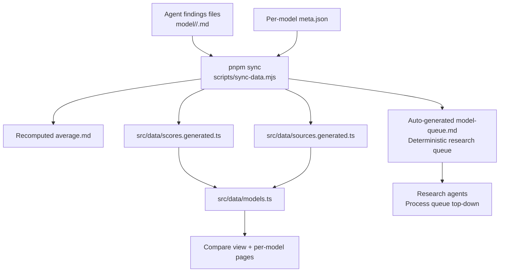
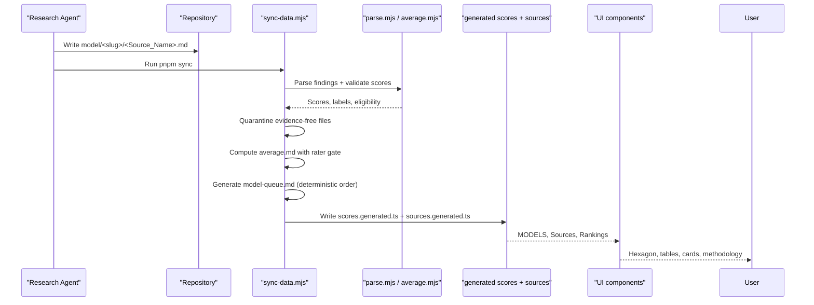
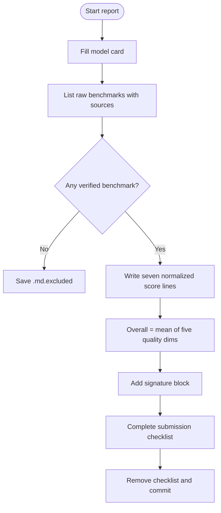
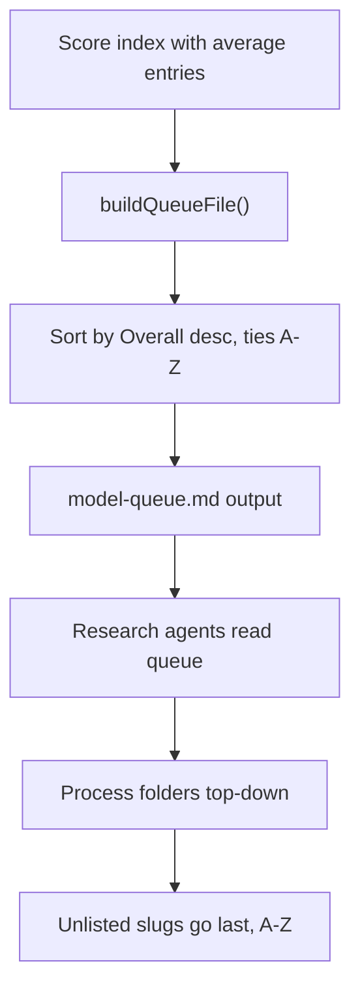
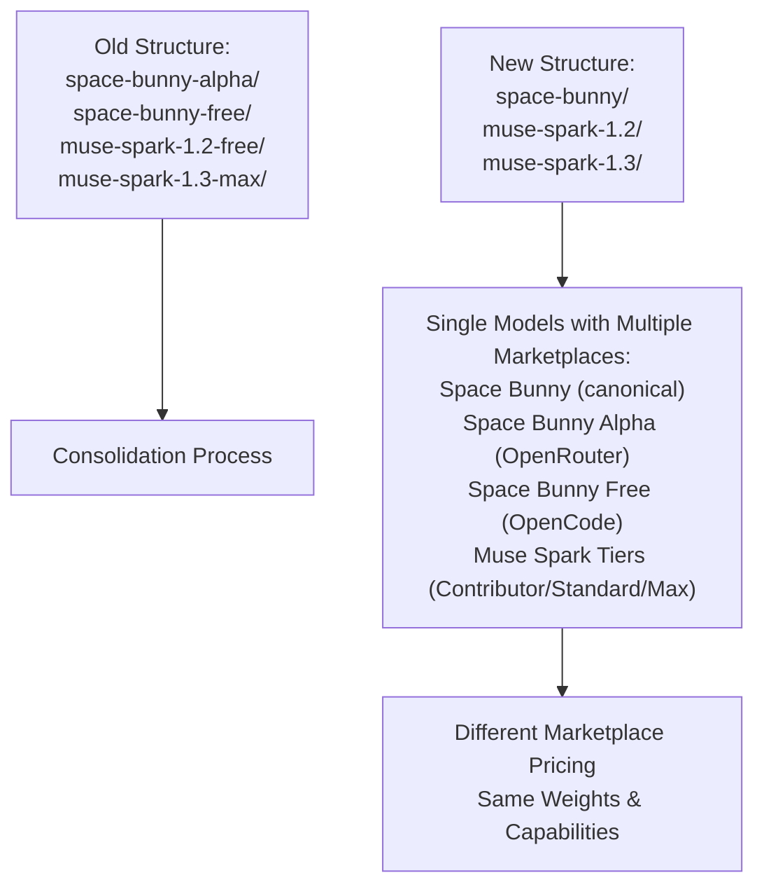
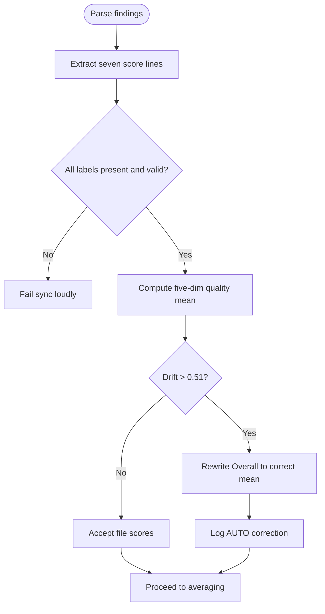
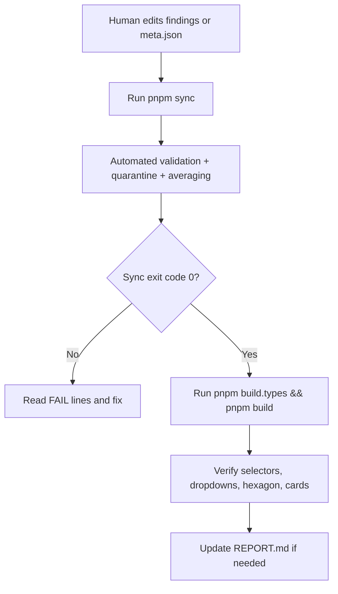

# Model Research & Evaluation

<cite>
**Referenced Files in This Document**   
- [README.md](file://README.md)
- [model-comparison.md](file://model-comparison.md)
- [model-findings.md](file://model-findings.md)
- [model-report-TEMPLATE.md](file://model-report-TEMPLATE.md)
- [model/README.md](file://model/README.md)
- [RULES.md](file://RULES.md)
- [tasks/sync-data.md](file://tasks/sync-data.md)
- [tasks/research.md](file://tasks/research.md)
- [tasks/research-assign.md](file://tasks/research-assign.md)
- [.agents/rules.md](file://.agents/rules.md)
- [scripts/lib/quarantine.mjs](file://scripts/lib/quarantine.mjs)
- [scripts/lib/parse.mjs](file://scripts/lib/parse.mjs)
- [scripts/lib/average.mjs](file://scripts/lib/average.mjs)
- [scripts/sync-data.mjs](file://scripts/sync-data.mjs)
- [scripts/find-fails.mjs](file://scripts/find-fails.mjs)
- [update_research.mjs](file://update_research.mjs)
- [scripts/generate-gemini-lite-research.mjs](file://scripts/generate-gemini-lite-research.mjs)
- [Laguna_XS_2.1_template.md](file://Laguna_XS_2.1_template.md)
- [src/components/Methodology.tsx](file://src/components/Methodology.tsx)
- [src/data/models.ts](file://src/data/models.ts)
- [REPORT.md](file://REPORT.md)
- [src/data/scores.generated.ts](file://src/data/scores.generated.ts)
- [src/data/sources.generated.ts](file://src/data/sources.generated.ts)
- [model/exo-free/meta.json](file://model/exo-free/meta.json)
- [model/owl-alpha/meta.json](file://model/owl-alpha/meta.json)
- [model/step-5-preview/meta.json](file://model/step-5-preview/meta.json)
- [model/Inkling/Laguna_XS_2.1.md](file://model/Inkling/Laguna_XS_2.1.md)
- [model/claude-opus-5.5/Gemini_3.5_Flash_Lite.md](file://model/claude-opus-5.5/Gemini_3.5_Flash_Lite.md)
</cite>

## Update Summary
**Changes Made**   
- Added comprehensive documentation for new research generation infrastructure including `update_research.mjs` script for Laguna XS 2.1 research files, `generate-gemini-lite-research.mjs` for Gemini 3.5 Flash Lite entries, and `Laguna_XS_2.1_template.md` template
- Updated evaluation methodology examples with extensive new model directories including Exo Free, Owl Alpha, Step 5 Preview, and numerous GPT-6, Gemini, Claude, Grok, and Qwen variants
- Enhanced multi-agent evaluation process documentation with automated research file generation capabilities
- Expanded model directory structure documentation to include specialized assessment approaches for experimental checkpoints, preview models, and stealth models
- Added sophisticated research queue system documentation for efficient agent processing

## Table of Contents
1. [Introduction](#introduction)
2. [Project Structure](#project-structure)
3. [Core Components](#core-components)
4. [Architecture Overview](#architecture-overview)
5. [Detailed Component Analysis](#detailed-component-analysis)
6. [Research Generation Infrastructure](#research-generation-infrastructure)
7. [Expanded Model Ecosystem](#expanded-model-ecosystem)
8. [Dependency Analysis](#dependency-analysis)
9. [Performance Considerations](#performance-considerations)
10. [Troubleshooting Guide](#troubleshooting-guide)
11. [Conclusion](#conclusion)

## Introduction
ModelComp is a static site that compares AI coding models across six normalized dimensions: Tool use, Reasoning, Context window, Multimodal, Coding, and Cost efficiency. Each dimension is scored 1–100 (higher is better). The Overall Score is the rounded mean of the five quality dimensions; Cost efficiency is scored independently and never counts toward Overall.

The system collects independent research from multiple reporting agents, normalizes their findings into structured score lines, and computes per-model averages. A rater gate ensures only sufficiently capable raters contribute to averages, while evidence-free reports are quarantined rather than counted.

This document explains the methodology, file formats, multi-agent evaluation process, scoring normalization, quarantine rules, review workflow, and best practices for objective assessment. It also documents the new automated research generation infrastructure that streamlines the creation of standardized research files across hundreds of model entries.

**Section sources**
- [README.md:3-16](file://README.md#L3-L16)
- [model-comparison.md:1-10](file://model-comparison.md#L1-L10)

## Project Structure
At the data layer, each tracked model lives under `model/<slug>/`. Inside each folder:
- One findings file per reporting agent (`<Source_Name>.md`)
- An auto-generated `average.md` with arithmetic means
- A hand-edited `meta.json` with display metadata

**Diagram sources**
- [README.md:48-61](file://README.md#L48-L61)
- [model/README.md:1-30](file://model/README.md#L1-L30)
- [tasks/sync-data.md:19-62](file://tasks/sync-data.md#L19-L62)
- [scripts/lib/average.mjs:103-121](file://scripts/lib/average.mjs#L103-L121)

Key responsibilities:
- `model/<slug>/<Source_Name>.md`: self-contained research report with raw benchmarks and normalized scores.
- `model/<slug>/average.md`: recomputed by sync; not edited by hand.
- `model-queue.md`: auto-generated research queue with deterministic ordering by overall scores.
- `model/<slug>/meta.json`: curated display metadata required by sync.
- `scripts/sync-data.mjs`: deterministic synchronization pipeline.
- `src/data/models.ts`: hydrates model data and derives Results-source ordering.
- `src/components/Methodology.tsx`: public explanation of scoring on the site.

**Section sources**
- [model/README.md:1-30](file://model/README.md#L1-L30)
- [README.md:61-73](file://README.md#L61-L73)

## Core Components
The core components of the evaluation system are:

| Component | Purpose | Key Rules |
|---|---|---|
| Findings file | Independent agent report with raw benchmarks and normalized scores | Must include all seven score lines; zero verified benchmarks → `.md.excluded` |
| `meta.json` | Display metadata for a model | Required fields enforced by sync |
| `average.md` | Arithmetic means across eligible raters | Recomputed by sync; not hand-edited |
| `model-queue.md` | Auto-generated research queue with deterministic ordering | Highest Overall first, ties A-Z; generated by sync |
| Sync script | Parses, validates, quarantines, registers sources, and writes generated data | Deterministic; non-zero exit code on failures |
| Rater gate | Filters which agent reports count toward an average | Only raters whose own model average exceeds 84.9 qualify |
| Quarantine | Auto-moves evidence-free or invalid-quality-dimension reports | Renames to `.md.excluded`; preserves content |
| Methodology page | Public explanation of scoring | States cost is excluded from Overall |

**Section sources**
- [model-report-TEMPLATE.md:71-87](file://model-report-TEMPLATE.md#L71-L87)
- [model/README.md:32-57](file://model/README.md#L32-L57)
- [tasks/sync-data.md:19-62](file://tasks/sync-data.md#L19-L62)
- [RULES.md:46-63](file://RULES.md#L46-L63)
- [src/components/Methodology.tsx:14-25](file://src/components/Methodology.tsx#L14-L25)

## Architecture Overview
The end-to-end flow starts with agent-authored findings and ends with pre-parsed data consumed by the static site.

**Diagram sources**
- [README.md:48-61](file://README.md#L48-L61)
- [tasks/sync-data.md:19-62](file://tasks/sync-data.md#L19-L62)
- [scripts/sync-data.mjs:212-372](file://scripts/sync-data.mjs#L212-L372)

## Detailed Component Analysis

### Findings File Format
Each agent's report follows a strict structure:
- Header with source, date, and links to methodology and cross-model log
- Model card with provider, IDs, context window, modalities, pricing, architecture
- Raw benchmarks section with sourced numbers
- Normalized scores section with exactly seven labeled lines
- Signature block with agent identity, method, and future-source guidance
- Submission checklist (removed before committing)

Critical constraints:
- All seven score lines must be present with exact labels.
- Overall Score must equal the half-up mean of the five quality dimensions.
- If no verified public benchmark exists for the exact model/ID, save `<STEM>.md.excluded` instead of inventing scores.

**Diagram sources**
- [model-report-TEMPLATE.md:1-104](file://model-report-TEMPLATE.md#L1-L104)
- [tasks/research.md:104-108](file://tasks/research.md#L104-L108)

**Section sources**
- [model-report-TEMPLATE.md:1-104](file://model-report-TEMPLATE.md#L1-L104)
- [tasks/research.md:104-143](file://tasks/research.md#L104-L143)

### Scoring Methodology and Six Dimensions
The six dimensions are:
1. Tool use
2. Reasoning
3. Context window
4. Multimodal
5. Coding
6. Cost efficiency

Cost efficiency is scored but excluded from Overall. Overall is the rounded mean of the first five quality dimensions.

Dimension anchors and interpretation guidelines:
- Tool use: Terminal-Bench, Tau3, GDPval, OSWorld/AutomationBench, tool-call efficiency.
- Reasoning: GPQA Diamond, HLE, LCR/MRCR, CritPt, Intelligence Index.
- Context window: tiered mapping based on total tokens and retrieval performance.
- Multimodal: input/output coverage; text-only scores low.
- Coding: SWE-bench Verified, DeepSWE, LiveCodeBench, SciCode, SWE-Atlas, Coding Index.
- Cost efficiency: inverse pricing on evaluated tier; $0 maps to 100.

The methodology also documents frontier and mid-range reference bands and notes missing benchmarks explicitly rather than fabricating values.

**Section sources**
- [model-comparison.md:140-150](file://model-comparison.md#L140-L150)
- [model-comparison.md:35-48](file://model-comparison.md#L35-L48)
- [src/components/Methodology.tsx:14-25](file://src/components/Methodology.tsx#L14-L25)

### Multi-Agent Evaluation Process
Multiple reporting agents independently evaluate the same model. Each agent produces its own findings file under the same model folder. The system then:
- Parses each agent's seven score lines.
- Validates label names and numeric ranges.
- Quarantines evidence-free or invalid-quality-dimension reports.
- Computes per-model averages using eligible raters.
- Registers new reporting agents automatically.

Eligibility rule:
- Only raters whose own model average exceeds 84.9 count toward another model's average.
- If no rater clears the gate, the average falls back to all available reports (top-10 cap still applies), and this fallback is logged.

**Updated** The evaluation dataset has been significantly expanded with extensive new model evaluation reports covering GLM 5.3 Flash (67/100) across multiple provider directories including Inkling, Claude Fable 5, Gemini 2.5, Qwen 3.5, and Qwen 3.8 Flash Next, demonstrating consistent assessment methodology across different provider contexts. Additionally, new model evaluations include Inkling Small (74/100), Qwen 3.8 Flash Next (73/100), Pareto 26.10 Preview (66/100), Gemini 2.5 (63/100), Qwen 3.5 (69/100), and stealth model Fledge Alpha with detailed methodology documentation showcasing specialized evaluation approaches for experimental checkpoints, preview models, and stealth models.

**Diagram sources**
- [tasks/sync-data.md:38-47](file://tasks/sync-data.md#L38-L47)
- [RULES.md:52-59](file://RULES.md#L52-L59)
- [scripts/lib/parse.mjs:39-41](file://scripts/lib/parse.mjs#L39-L41)

**Section sources**
- [tasks/sync-data.md:38-47](file://tasks/sync-data.md#L38-L47)
- [RULES.md:52-63](file://RULES.md#L52-L63)
- [scripts/lib/parse.mjs:39-41](file://scripts/lib/parse.mjs#L39-L41)

### Sophisticated Research Queue System
The research queue system eliminates redundant queue-sorting scans across research runs through an auto-generated `model-queue.md` file at the repository root. This deterministic ordering system provides significant performance improvements and consistency guarantees.

**Queue Generation**: The `buildQueueFile()` function in `scripts/lib/average.mjs` generates the queue by:
- Extracting all models with parseable average entries
- Sorting by Overall Score descending (highest first)
- Breaking ties alphabetically (A-Z)
- Skipping slugs without valid average entries

**Queue Processing**: Research agents process the queue by:
- Reading the single `model-queue.md` file instead of scanning all `average.md` files
- Processing folders in deterministic order (highest Overall first)
- Handling unlisted slugs (no `average.md` yet) by appending them last, sorted A-Z
- Falling back to parsing individual `average.md` files only if the queue is missing or stale

**Benefits**:
- Eliminates token waste from repeated queue sorting operations
- Provides deterministic ordering for reproducible research workflows
- Reduces computational overhead from scanning ~130 model directories
- Maintains freshness contract like other generated files

**Diagram sources**
- [scripts/lib/average.mjs:103-121](file://scripts/lib/average.mjs#L103-L121)
- [scripts/sync-data.mjs:543-559](file://scripts/sync-data.mjs#L543-L559)

**Section sources**
- [scripts/lib/average.mjs:103-121](file://scripts/lib/average.mjs#L103-L121)
- [scripts/sync-data.mjs:543-559](file://scripts/sync-data.mjs#L543-L559)
- [tasks/research-assign.md:29-30](file://tasks/research-assign.md#L29-L30)
- [tasks/research.md:52-57](file://tasks/research.md#L52-L57)

### Unified Model Organization and Marketplace Identity Management
The model organization system supports unified model structures where different marketplace identities and access levels are consolidated under a single model directory rather than separate folders. This approach emphasizes that models with multiple marketplace names should be treated as one model with identical weights, differing only in pricing and distribution channels.

**Space Bunny Identity Unification Example**: The Space Bunny model demonstrates the unified approach where three marketplace identities — **Space Bunny** (canonical), **Space Bunny Alpha** (OpenRouter `stealth/space-bunny-alpha`), and **Space Bunny Free** (OpenCode `space-bunny-free`, limited-time $0 tier) — are now part of a single `model/space-bunny/` directory. Internet-verified as one anonymous stealth model under three marketplace labels with identical weights. The directory rename from `space-bunny-alpha/` to `space-bunny/` ensures that marketplace suffixes cannot be misinterpreted as separate models. Meta ships one model with identical weights across all marketplaces - the only differences are pricing and distribution channels.

**Muse Spark Consolidation Examples**: Following the same unified approach, Muse Spark models were reorganized to eliminate redundant directory structures like `muse-spark-1.2-free/`, `muse-spark-1.3-max/`, and `muse-spark-1.3-contributor/` in favor of single authoritative model entries. Muse Spark 1.2 was reorganized from `muse-spark-1.2-free/` to `model/muse-spark-1.2/`, and Muse Spark 1.3 consolidates Contributor Free, Contributor, Standard, and Max tiers under a single directory.

**Marketplace Alias Resolution**: The system maintains backward compatibility through marketplace alias resolution. When sources reference models by marketplace names or access tiers, they resolve to the base slug rather than creating separate directories. This ensures consistency while preserving historical references and avoiding duplicate model entries.

**Diagram sources**
- [model/space-bunny/meta.json:1-11](file://model/space-bunny/meta.json#L1-L11)
- [model/muse-spark-1.2/meta.json:1-15](file://model/muse-spark-1.2/meta.json#L1-L15)
- [model/muse-spark-1.3/meta.json:1-15](file://model/muse-spark-1.3/meta.json#L1-L15)
- [model/README.md:105-116](file://model/README.md#L105-L116)

**Section sources**
- [model/space-bunny/meta.json:1-11](file://model/space-bunny/meta.json#L1-L11)
- [model/muse-spark-1.2/meta.json:1-15](file://model/muse-spark-1.2/meta.json#L1-L15)
- [model/muse-spark-1.3/meta.json:1-15](file://model/muse-spark-1.3/meta.json#L1-L15)
- [model/README.md:105-116](file://model/README.md#L105-L116)

### Quarantine System for Evidence-Free Reports
Quarantine protects the integrity of averages by excluding reports without sufficient evidence.

Auto-quarantine triggers:
- Eight or more rows reading "no verified public score found" with zero measured numbers in the Raw-benchmarks section.
- Any quality dimension scored as 0 (floors are 10+; 0 indicates "no data" filed as 0).
- Flat-identical quality dimensions with zero cited numbers.

Behavior:
- The sync script renames the file to `<Source_Name>.md.excluded`.
- Content is preserved.
- Quarantined files are skipped during parsing and averaging.
- They remain in version control unless replaced by a corrected real report.

**Diagram sources**
- [tasks/sync-data.md:21-29](file://tasks/sync-data.md#L21-L29)
- [scripts/lib/quarantine.mjs:1](file://scripts/lib/quarantine.mjs#L1)

**Section sources**
- [tasks/sync-data.md:21-29](file://tasks/sync-data.md#L21-L29)
- [RULES.md:10-16](file://RULES.md#L10-L16)
- [scripts/lib/quarantine.mjs:1](file://scripts/lib/quarantine.mjs#L1)

### Scoring Normalization and Drift Correction
Normalization converts raw benchmark results into comparable 1–100 scores. The sync pipeline enforces consistency:

- Each findings file must contain exactly seven labeled score lines.
- Overall Score drift tolerance is 0.51.
- If a file's Overall differs from the half-up mean of its five quality dimensions by more than 0.51, sync rewrites only the Overall number and logs an AUTO line.
- Benchmarks and prose are never rewritten by sync.

**Diagram sources**
- [tasks/sync-data.md:31-37](file://tasks/sync-data.md#L31-L37)
- [scripts/sync-data.mjs:349-366](file://scripts/sync-data.mjs#L349-L366)

**Section sources**
- [tasks/sync-data.md:31-37](file://tasks/sync-data.md#L31-L37)
- [scripts/sync-data.mjs:349-366](file://scripts/sync-data.mjs#L349-L366)

### Review Process and Quality Assurance
The review process combines automated checks with human verification:

Automated checks:
- Filename validation: only letters, digits, underscores, and dots allowed.
- Score-line format validation.
- `meta.json` schema validation.
- Quarantine detection.
- Overall drift correction.
- Rater gate enforcement.
- Generated data written only when sync has zero failures.

Human verification:
- Confirm new model folders have `meta.json`, findings, and generated `average.md`.
- Confirm new reporting agents appear in the Results-source dropdown.
- Confirm `pnpm build` passes.
- Update `REPORT.md` with changes.
- Ensure permanence rules hold: no deleted or uncommitted research files.

**Diagram sources**
- [tasks/sync-data.md:66-108](file://tasks/sync-data.md#L66-L108)
- [README.md:18-29](file://README.md#L18-L29)

**Section sources**
- [tasks/sync-data.md:66-108](file://tasks/sync-data.md#L66-L108)
- [README.md:18-29](file://README.md#L18-L29)

### Standards for Contributing New Model Evaluations
To add a new model:
1. Create `model/<slug>/` with at least one findings file and `meta.json`.
2. Use filesystem-safe slug naming with dotted versions where appropriate.
3. Follow the template structure and scoring contract.
4. Run `pnpm sync` to create `average.md` and register data.
5. Run typecheck and build.

To add a new reporting agent's findings:
1. Drop `<Source_Name>.md` into every model folder it evaluated.
2. Run `pnpm sync`.
3. Run typecheck and build.

Important naming rules:
- Slug uses dots for version numbers, e.g., `gpt-5.5`, not `gpt-5-5`.
- Findings filenames use letters, digits, underscores, and dots.
- `meta.json` `name` must match vendor display casing and spacing.

**Updated** For models with multiple marketplace identities or access levels, consolidate under a single model directory using marketplace alias resolution. Do not create separate directories for different marketplace names (e.g., avoid `model/space-bunny-alpha/`, `model/space-bunny-free/`, `model/muse-spark-1.3-free/`, or `model/muse-spark-1.3-max/`). Instead, use the unified model structure with appropriate marketplace metadata in `meta.json`. Both Space Bunny and Muse Spark models now follow this pattern where every marketplace variant name represents different distribution channels of the same model with identical weights.

**Section sources**
- [model/README.md:7-16](file://model/README.md#L7-L16)
- [model/README.md:32-57](file://model/README.md#L32-L57)
- [model/README.md:59-77](file://model/README.md#L59-L77)
- [model/README.md:105-116](file://model/README.md#L105-L116)

### Guidelines for Writing Research Findings
Guidelines derived from the template and task instructions:
- Start from `model-report-TEMPLATE.md`.
- Do not read peer findings before writing your report.
- Use fresh public web research for each model.
- Record raw benchmarks with sources; mark missing data explicitly.
- Derive normalized scores using the documented methodology.
- Include a one-sentence justification per dimension.
- Never invent placeholder scores.
- If zero verified benchmarks exist, save the `.md.excluded` twin.
- Fill the signature block with agent identity, method, and date.
- Remove the submission checklist before committing.

Best practices for objectivity:
- Cite harnesses and sources for every number.
- Note variance between sources rather than averaging them manually.
- State what caps each score.
- Treat free tiers carefully: note time limits and training-data caveats.
- Keep Cost efficiency separate from Overall.

**Updated** The expanded evaluator ecosystem demonstrates diverse research methodologies through extensive new model evaluations including GLM 5.3 Flash (67/100) multi-provider coverage under claude-fable-5, gemini-2.5, qwen-3.5, and qwen-3.8-flash-next, plus specialized evaluation patterns for experimental checkpoints like Qwen 3.8 Flash Next (73/100), preview models like Pareto 26.10 Preview (66/100), legacy models like Gemini 2.5 (63/100), and stealth models like Fledge Alpha with detailed methodology documentation. Specific examples include Inkling Small (74/100) representing Thinking Machines Lab's open-weights flagship evaluation, Qwen 3.5 (69/100) showcasing Alibaba's flagship generation assessment, and sophisticated multimodal capability analysis showing vendor-independent measurement divergences.

**Section sources**
- [model-report-TEMPLATE.md:1-104](file://model-report-TEMPLATE.md#L1-L104)
- [tasks/research.md:98-143](file://tasks/research.md#L98-L143)
- [model-comparison.md:152-158](file://model-comparison.md#L152-L158)

### Evidence Quality and Permanence Rules
Evidence quality is enforced through:
- Self-exclusion for zero-evidence reports.
- Quarantine thresholds for weak or fabricated-looking data.
- Strict filename and score-line contracts.
- Per-file signatures and dated attribution.

Permanence rules:
- Existing findings files must not be deleted, overwritten, renamed, or moved.
- Only sync's quarantine rename is sanctioned.
- Reporting-agent folders are dataset infrastructure and must remain.
- Below-gate or out-of-top-10 reports stay on disk and on the site; they only stop counting toward averages.

**Section sources**
- [RULES.md:8-44](file://RULES.md#L8-L44)
- [tasks/research.md:147-182](file://tasks/research.md#L147-L182)
- [tasks/sync-data.md:78-108](file://tasks/sync-data.md#L78-L108)

### Cross-Model Signed Log
The cross-model signed log records what was found, what is missing, and who reported it. It complements the normalized scores table by providing an audit trail for recent additions and name resolutions.

Key properties:
- Each entry includes model name, findings summary, scores, and signature.
- Name resolution notes clarify aliases, typos, and paid-vs-free mismatches.
- The changelog tracks methodology transitions, including v4 exclusion of Cost from Overall.

**Updated** Recent additions include comprehensive evaluations from new model directories including GLM 5.3 Flash (67/100) multi-provider coverage under claude-fable-5, gemini-2.5, qwen-3.5, and qwen-3.8-flash-next, plus specialized assessments for experimental checkpoints like Qwen 3.8 Flash Next (73/100), preview models like Pareto 26.10 Preview (66/100), legacy models like Gemini 2.5 (63/100), and stealth models like Fledge Alpha with detailed methodology documentation.

**Section sources**
- [model-findings.md:1-8](file://model-findings.md#L1-L8)
- [model-findings.md:12-201](file://model-findings.md#L12-L201)
- [model-findings.md:198-202](file://model-findings.md#L198-L202)