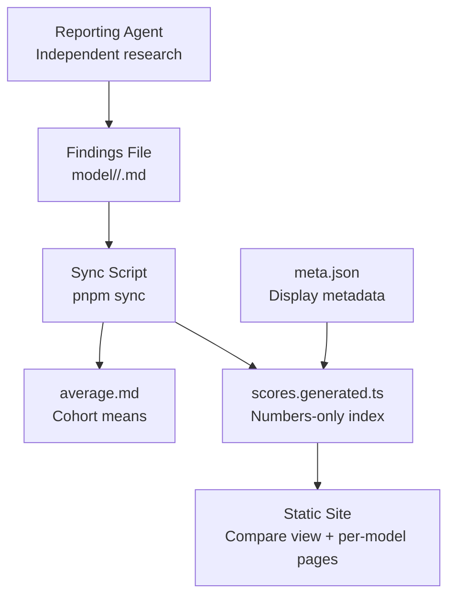
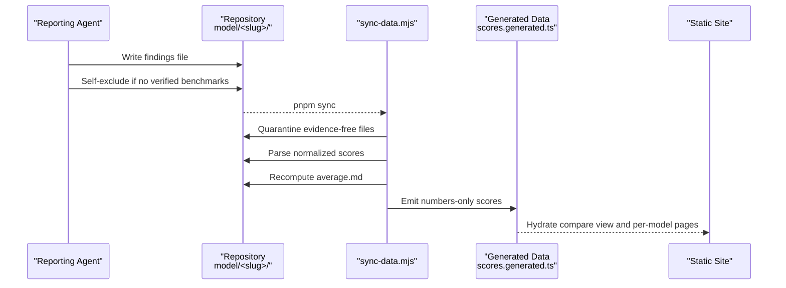
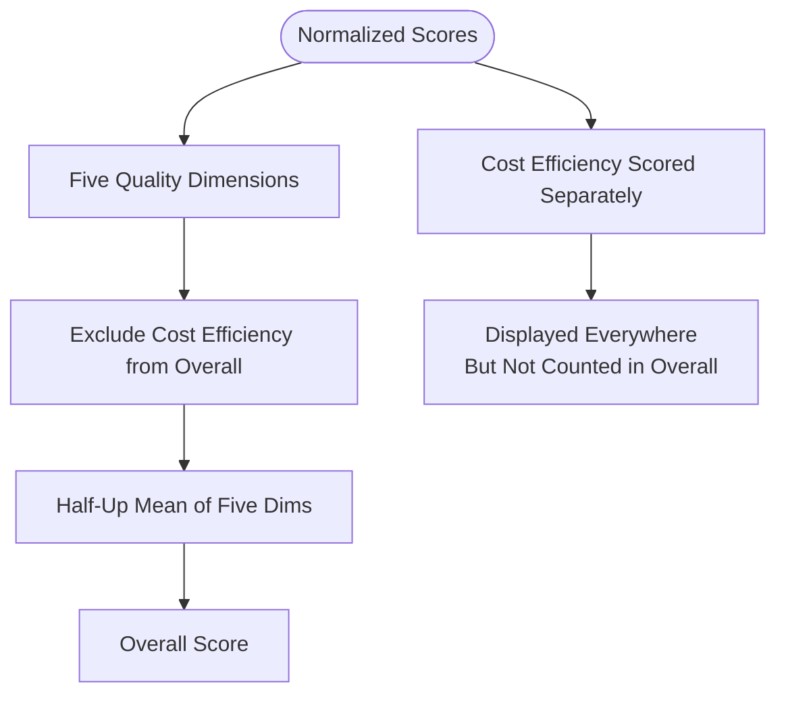
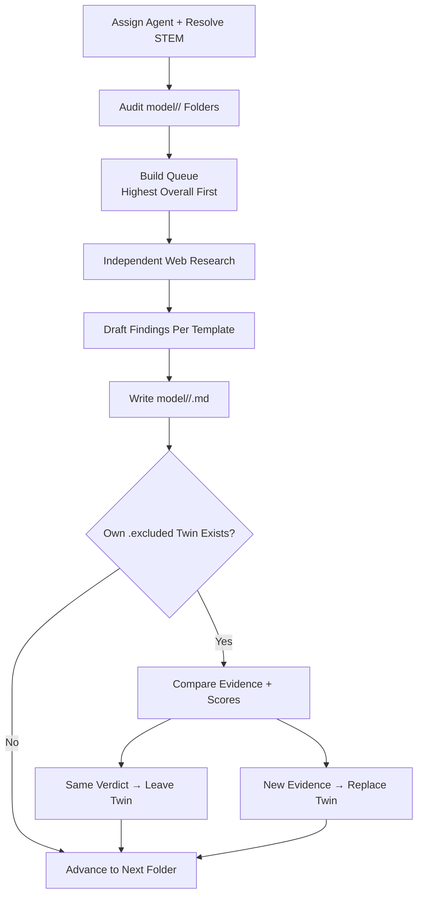
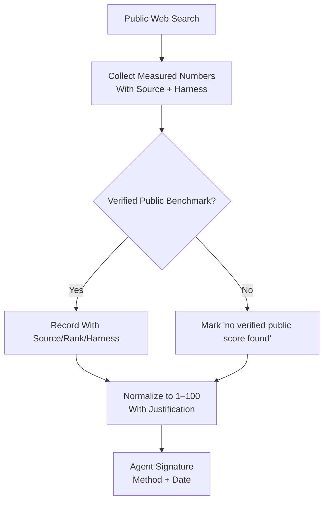
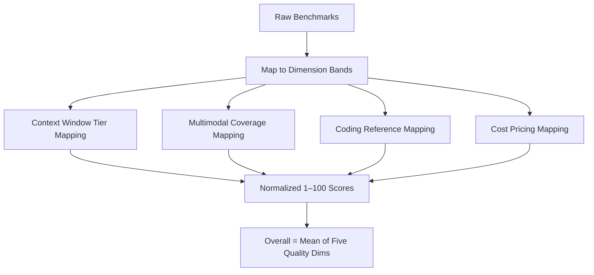
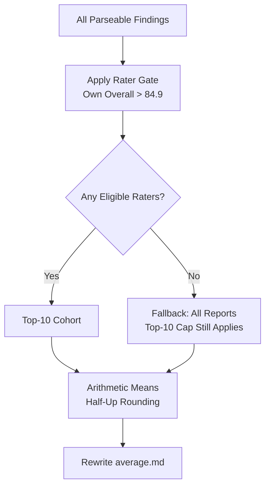
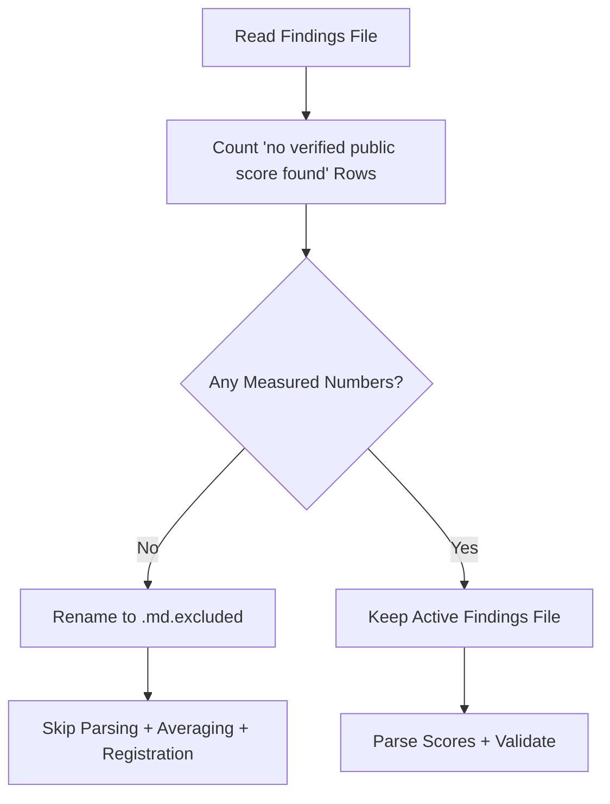
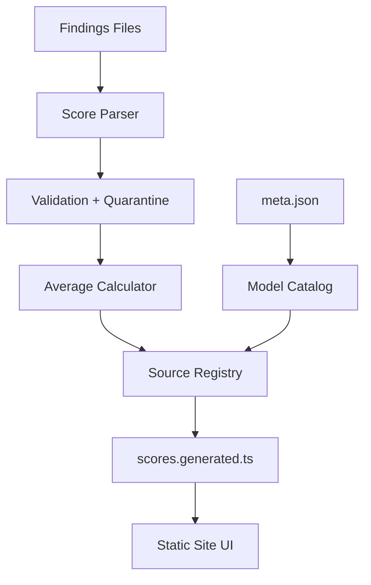

# Research Methodology & Evaluation Criteria

<cite>
**Referenced Files in This Document**
- [README.md](file://README.md)
- [RULES.md](file://RULES.md)
- [model-comparison.md](file://model-comparison.md)
- [model-report-TEMPLATE.md](file://model-report-TEMPLATE.md)
- [model/README.md](file://model/README.md)
- [tasks/research.md](file://tasks/research.md)
- [tasks/sync-data.md](file://tasks/sync-data.md)
- [scripts/sync-data.mjs](file://scripts/sync-data.mjs)
</cite>

## Table of Contents
1. [Introduction](#introduction)
2. [Project Structure](#project-structure)
3. [Core Components](#core-components)
4. [Architecture Overview](#architecture-overview)
5. [Detailed Component Analysis](#detailed-component-analysis)
6. [Dependency Analysis](#dependency-analysis)
7. [Performance Considerations](#performance-considerations)
8. [Troubleshooting Guide](#troubleshooting-guide)
9. [Conclusion](#conclusion)

## Introduction
ModelComp is a static site that compares AI coding models across six normalized dimensions and displays both an Overall score and per-agent grades. The project’s methodology centers on:

- Six 1–100 scoring dimensions: Tool use, Reasoning, Context window, Multimodal, Coding, and Cost efficiency.
- An Overall Score computed from the five quality dimensions only; Cost efficiency is scored independently and never contributes to Overall.
- A multi-agent evaluation process where different reporting agents independently research and score models.
- Deterministic synchronization that converts raw benchmark evidence into normalized scores, recomputes averages, and enforces data hygiene.
- A quarantine system for reports lacking sufficient verified evidence.
- Strict rules for unbiased research, permanence of findings, and consistent scoring contracts.

This document explains the methodology, evaluation criteria, normalization approach, multi-agent workflow, evidence requirements, and best practices for maintaining objective, reproducible model comparisons.

## Project Structure
The research dataset lives under `model/<slug>/`, where each slug represents one tracked model. Each model folder contains:

- One findings file per reporting agent (e.g., `Muse_Spark_1.3.md`).
- A recomputed `average.md` containing cohort means.
- A curated `meta.json` describing display metadata such as name, context window, modalities, and pricing notes.

The website reads pre-parsed scores at build time rather than parsing markdown at runtime, keeping report prose out of the client bundle.

**Diagram sources**
- [README.md:31-44](file://README.md#L31-L44)
- [model/README.md:25-30](file://model/README.md#L25-L30)
- [scripts/sync-data.mjs:490-523](file://scripts/sync-data.mjs#L490-L523)

**Section sources**
- [README.md:31-44](file://README.md#L31-L44)
- [model/README.md:1-30](file://model/README.md#L1-L30)

## Core Components
The core components of the ModelComp research methodology are:

| Component | Responsibility | Key Rules |
|---|---|---|
| Reporting agent | Independently researches a model and writes a findings file using the template. | No reading peer findings before research; zero-influence rule; strict filename and signature contract. |
| Findings file | Holds model card, raw benchmarks, normalized 1–100 scores, and signature. | Must include all seven score lines; Evidence-free files are quarantined or self-excluded. |
| Average computation | Recomputes cohort means per model folder. | Top-10 eligible cohort; rater gate based on own Overall > 84.9; fallback averaging when no raters qualify. |
| Sync script | Parses, validates, quarantines, registers sources, and generates client-side score indexes. | Deterministic; fails loudly on invalid data; preserves permanence. |
| Metadata registry | Provides display names, IDs, context windows, modalities, and pricing notes. | Required fields validated by sync; official vendor casing enforced. |

**Section sources**
- [model-report-TEMPLATE.md:1-104](file://model-report-TEMPLATE.md#L1-L104)
- [tasks/research.md:19-34](file://tasks/research.md#L19-L34)
- [tasks/sync-data.md:19-64](file://tasks/sync-data.md#L19-L64)
- [model/README.md:32-44](file://model/README.md#L32-L44)

## Architecture Overview
The end-to-end flow transforms independent agent research into comparable, normalized scores displayed on the site.

**Diagram sources**
- [README.md:31-44](file://README.md#L31-L44)
- [tasks/research.md:96-128](file://tasks/research.md#L96-L128)
- [scripts/sync-data.mjs:259-286](file://scripts/sync-data.mjs#L259-L286)
- [scripts/sync-data.mjs:328-435](file://scripts/sync-data.mjs#L328-L435)
- [scripts/sync-data.mjs:490-523](file://scripts/sync-data.mjs#L490-L523)

## Detailed Component Analysis

### Six-Dimensional Scoring System
Each model is evaluated on six dimensions, each normalized to a 1–100 scale:

| Dimension | Assessment Focus | Normalization Guidance |
|---|---|---|
| Tool use | Terminal-Bench, Tau3/Tau2, GDPval-AA, OSWorld/AutomationBench, tool-call efficiency, Claw-Eval/MCP-Atlas/SWE Atlas Codebase QnA where available. | Frontier references map to 90–100; mid-range values map to 50–70; missing benchmarks are noted but not invented. |
| Reasoning | GPQA Diamond, HLE, MRCR/LCR, CritPt, Intelligence Index/BenchLM overall. | Frontier references map to 90–100; mid-range values map to 55–65; harness/version differences must be cited. |
| Context window | Total tokens and retrieval performance at long windows. | Tiered mapping: ≥1M → 95–100; 500K–1M → 85–94; 200K–500K → 65–84; 100K–200K → 50–64; <100K scales down. |
| Multimodal | Input/output coverage across text, image, video, audio, PDF, reasoning, tool calls, JSON mode. | Text-only → 10–20; image in → 60–70; video/PDF in → 75–90; audio in or non-text out → 90–100. |
| Coding | SWE-bench Verified, DeepSWE, LiveCodeBench, SciCode, Vibe Code Bench, SWE-Atlas, Terminal-Bench. | Frontier references map to 90–100; mixed results require conservative interpretation without inventing missing scores. |
| Cost efficiency | Evaluated tier pricing, free-tier caveats, paid fallback pricing. | $0 → 100; lower cost maps higher; free tiers flagged as time-limited with training-data caveats. |

The Overall Score is the half-up mean of the five quality dimensions: Tool use, Reasoning, Context window, Multimodal, and Coding. Cost efficiency is scored independently and excluded from Overall.

**Diagram sources**
- [model-comparison.md:140-150](file://model-comparison.md#L140-L150)
- [model-report-TEMPLATE.md:71-87](file://model-report-TEMPLATE.md#L71-L87)
- [RULES.md:46-51](file://RULES.md#L46-L51)

**Section sources**
- [model-comparison.md:140-150](file://model-comparison.md#L140-L150)
- [model-report-TEMPLATE.md:71-87](file://model-report-TEMPLATE.md#L71-L87)
- [RULES.md:46-51](file://RULES.md#L46-L51)

### Multi-Agent Evaluation Process
Different reporting agents independently assess models to ensure objectivity. The process enforces:

- Independent research: Agents do not read peer findings before writing their own report.
- Identity resolution: Each agent resolves its assigned STEM and output path deterministically.
- Zero influence: Only the single Overall line of `average.md` may be read for ordering; no other peer content is consulted.
- Twin handling: If an agent’s own `.md.excluded` twin exists, it drafts fully first, then compares evidence and scores; same verdict leaves the twin untouched, new evidence replaces it.
- Enrichment policy: Existing findings older than seven days with genuinely new verified evidence trigger an enrichment proposal rather than in-pass overwrites.

**Diagram sources**
- [tasks/research.md:19-34](file://tasks/research.md#L19-L34)
- [tasks/research.md:66-78](file://tasks/research.md#L66-L78)
- [tasks/research.md:96-128](file://tasks/research.md#L96-L128)
- [tasks/research.md:147-182](file://tasks/research.md#L147-L182)

**Section sources**
- [tasks/research.md:19-34](file://tasks/research.md#L19-L34)
- [tasks/research.md:66-78](file://tasks/research.md#L66-L78)
- [tasks/research.md:96-128](file://tasks/research.md#L96-L128)
- [tasks/research.md:147-182](file://tasks/research.md#L147-L182)

### Evidence Requirements and Source Verification
Evidence quality is central to ModelComp’s credibility:

- Raw benchmarks must list measured numbers with source, rank/percentile, and harness.
- Missing benchmarks must be explicitly marked as “no verified public score found.”
- Placeholder scores, zeros, or fabricated values are forbidden.
- Every normalized score must cite key evidence and state what caps the score.
- Signature blocks identify the agent, method, and date, clarifying that scores are normalized interpretations, not official vendor scores.

**Diagram sources**
- [model-report-TEMPLATE.md:26-40](file://model-report-TEMPLATE.md#L26-L40)
- [model-report-TEMPLATE.md:71-95](file://model-report-TEMPLATE.md#L71-L95)
- [tasks/research.md:100-108](file://tasks/research.md#L100-L108)

**Section sources**
- [model-report-TEMPLATE.md:26-40](file://model-report-TEMPLATE.md#L26-L40)
- [model-report-TEMPLATE.md:71-95](file://model-report-TEMPLATE.md#L71-L95)
- [tasks/research.md:100-108](file://tasks/research.md#L100-L108)

### Scoring Normalization Algorithm
Normalization converts heterogeneous raw benchmarks into comparable 1–100 scores:

1. Identify relevant benchmarks per dimension.
2. Map frontier and mid-range reference ranges to score bands.
3. Apply tiered mappings for context window and multimodal coverage.
4. Score cost efficiency inversely to evaluated-tier pricing, flagging free-tier limitations.
5. Compute Overall as the half-up mean of the five quality dimensions.
6. Preserve raw benchmarks alongside normalized scores for traceability.

The sync script enforces this contract by parsing exactly seven score lines, validating format, correcting drifted Overall values within tolerance, and refusing to cement invalid data.

**Diagram sources**
- [model-comparison.md:140-150](file://model-comparison.md#L140-L150)
- [model-report-TEMPLATE.md:71-87](file://model-report-TEMPLATE.md#L71-L87)
- [tasks/sync-data.md:31-37](file://tasks/sync-data.md#L31-L37)

**Section sources**
- [model-comparison.md:140-150](file://model-comparison.md#L140-L150)
- [model-report-TEMPLATE.md:71-87](file://model-report-TEMPLATE.md#L71-L87)
- [tasks/sync-data.md:31-37](file://tasks/sync-data.md#L31-L37)

### Average Computation and Rater Gate
Averages are recomputed deterministically by the sync script:

- Cohort selection: top-10 eligible sources per model folder.
- Rater gate: only sources written by models whose own committed average Overall exceeds 84.9 count toward another model’s average.
- Fallback: if no raters clear the gate, all available reports are averaged (top-10 cap still applies), labeled as below-gate fallback.
- Overall averaging: average.md Overall equals the mean of source Overalls, not re-derived from averaged dimensions.

**Diagram sources**
- [tasks/sync-data.md:38-47](file://tasks/sync-data.md#L38-L47)
- [scripts/sync-data.mjs:372-435](file://scripts/sync-data.mjs#L372-L435)
- [RULES.md:52-59](file://RULES.md#L52-L59)

**Section sources**
- [tasks/sync-data.md:38-47](file://tasks/sync-data.md#L38-L47)
- [scripts/sync-data.mjs:372-435](file://scripts/sync-data.mjs#L372-L435)
- [RULES.md:52-59](file://RULES.md#L52-L59)

### Quarantine System for Insufficient Evidence
Reports lacking sufficient verified evidence are quarantined automatically:

- Criteria: eight or more “no verified public score found” rows with zero measured numbers in the Raw-benchmarks section; zero in any quality dimension; or flat-identical quality dimensions with zero cited numbers.
- Action: rename findings file to `<STEM>.md.excluded`; content preserved; file skipped from parsing, averaging, and registration.
- Self-exclusion: agents must also save `.md.excluded` when they find zero verified public benchmarks for the exact model/ID.

**Diagram sources**
- [tasks/sync-data.md:21-30](file://tasks/sync-data.md#L21-L30)
- [model-report-TEMPLATE.md:26-40](file://model-report-TEMPLATE.md#L26-L40)
- [scripts/sync-data.mjs:259-286](file://scripts/sync-data.mjs#L259-L286)

**Section sources**
- [tasks/sync-data.md:21-30](file://tasks/sync-data.md#L21-L30)
- [model-report-TEMPLATE.md:26-40](file://model-report-TEMPLATE.md#L26-L40)
- [scripts/sync-data.mjs:259-286](file://scripts/sync-data.mjs#L259-L286)

### Best Practices for Consistent Scoring Across Agents
To maintain consistency:

- Use the exact template structure and label contract for score lines.
- Cite raw benchmarks with source, rank/percentile, and harness.
- Avoid copying values from peer files; research independently.
- Do not invent placeholder scores; mark missing benchmarks explicitly.
- Follow filename conventions: filesystem-safe slugs, version dots, underscore-separated stems.
- Respect permanence: never delete, overwrite, or move another agent’s findings; only sanctioned quarantine and twin retirement are allowed.
- Run `pnpm sync` after adding or editing findings; verify builds pass.

**Section sources**
- [model-report-TEMPLATE.md:99-104](file://model-report-TEMPLATE.md#L99-L104)
- [model/README.md:7-22](file://model/README.md#L7-L22)
- [tasks/research.md:147-182](file://tasks/research.md#L147-L182)
- [tasks/sync-data.md:78-108](file://tasks/sync-data.md#L78-L108)

## Dependency Analysis
The evaluation pipeline depends on several coordinated components:

- Findings files provide raw evidence and normalized scores.
- The sync script parses, validates, quarantines, and computes averages.
- Generated TypeScript files deliver compact score indexes to the static site.
- Metadata ensures correct display names, IDs, and pricing context.
- Rules enforce precedence, permanence, and scoring contracts.

**Diagram sources**
- [scripts/sync-data.mjs:30-75](file://scripts/sync-data.mjs#L30-L75)
- [scripts/sync-data.mjs:259-435](file://scripts/sync-data.mjs#L259-L435)
- [scripts/sync-data.mjs:438-523](file://scripts/sync-data.mjs#L438-L523)

**Section sources**
- [scripts/sync-data.mjs:30-75](file://scripts/sync-data.mjs#L30-L75)
- [scripts/sync-data.mjs:259-435](file://scripts/sync-data.mjs#L259-L435)
- [scripts/sync-data.mjs:438-523](file://scripts/sync-data.mjs#L438-L523)

## Performance Considerations
- Pre-parsing scores into `scores.generated.ts` removes ~1.7 MB of markdown prose from the client bundle.
- Deterministic sync avoids manual edits and reduces drift risk.
- Top-10 cohort limiting keeps average computation bounded even as more agents evaluate a model.
- Quiet mode (`pnpm sync:quiet`) reduces log noise during large repository scans while preserving validation behavior.

[No sources needed since this section provides general guidance]

## Troubleshooting Guide
Common issues and resolutions:

| Issue | Symptom | Resolution |
|---|---|---|
| Invalid score-line format | Sync fails loudly on missing or malformed score lines. | Ensure exactly seven score lines with labels `Tool use`, `Reasoning`, `Context window`, `Multimodal`, `Coding`, `Cost efficiency`, `Overall Score`. |
| Drifted Overall | Overall does not match half-up mean of five quality dims. | Sync auto-corrects within tolerance; hand-fix if score line is not auto-fixable. |
| Evidence-free report | Report quarantined to `.md.excluded`. | Add verified measured benchmarks or keep as self-excluded negative findings. |
| Missing meta.json | Build or sync fails due to incomplete model metadata. | Add required fields: `id`, `name`, `short`, `contextWindow`, `modalities`, `pricingNote`. |
| Hyphen-versioned slug | Sync fails on folders like `gpt-5-5`. | Rename to dotted version convention, e.g., `gpt-5.5`. |
| Below-gate rater | Source ignored in another model’s average. | Rater must have own committed average Overall > 84.9 to count toward others. |

**Section sources**
- [tasks/sync-data.md:31-37](file://tasks/sync-data.md#L31-L37)
- [tasks/sync-data.md:53-56](file://tasks/sync-data.md#L53-L56)
- [tasks/sync-data.md:78-108](file://tasks/sync-data.md#L78-L108)
- [scripts/sync-data.mjs:180-197](file://scripts/sync-data.mjs#L180-L197)
- [scripts/sync-data.mjs:354-369](file://scripts/sync-data.mjs#L354-L369)
- [scripts/sync-data.mjs:372-398](file://scripts/sync-data.mjs#L372-L398)

## Conclusion
ModelComp’s research methodology combines independent multi-agent evaluation, strict evidence requirements, normalized 1–100 scoring, deterministic synchronization, and a quarantine system to produce objective, comparable model rankings. The six-dimensional framework separates quality from cost, ensuring transparency about pricing while keeping Overall focused on capability. By enforcing permanence, template compliance, and automated validation, the project maintains high evidence quality and reproducibility across evolving model landscapes.

[No sources needed since this section summarizes without analyzing specific files]