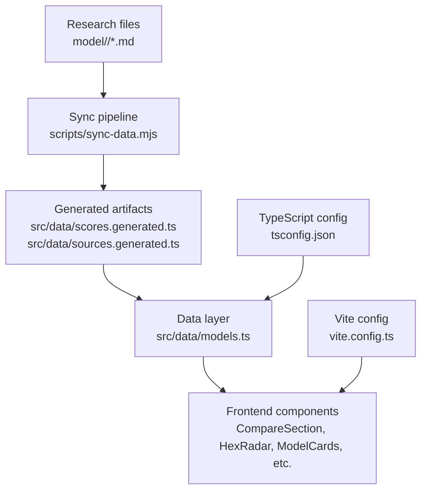
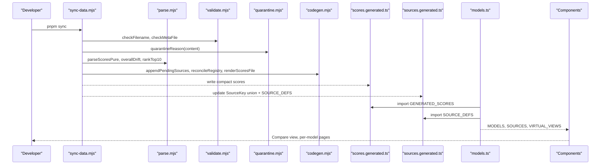
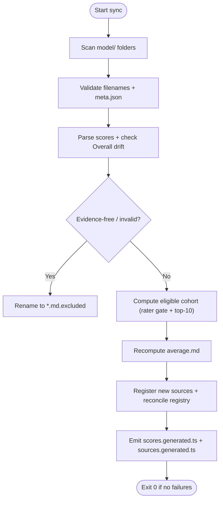
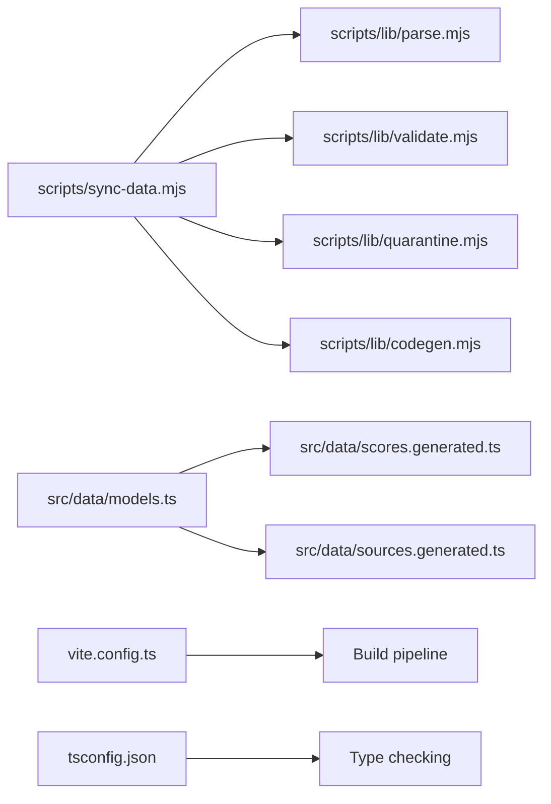

# Troubleshooting & FAQ

<cite>
**Referenced Files in This Document**
- [README.md](file://README.md)
- [package.json](file://package.json)
- [vite.config.ts](file://vite.config.ts)
- [tsconfig.json](file://tsconfig.json)
- [sync-data.mjs](file://scripts/sync-data.mjs)
- [debug-sync.mjs](file://scripts/debug-sync.mjs)
- [find-fails.mjs](file://scripts/find-fails.mjs)
- [parse.mjs](file://scripts/lib/parse.mjs)
- [validate.mjs](file://scripts/lib/validate.mjs)
- [quarantine.mjs](file://scripts/lib/quarantine.mjs)
- [codegen.mjs](file://scripts/lib/codegen.mjs)
- [models.ts](file://src/data/models.ts)
</cite>

## Table of Contents
1. [Introduction](#introduction)
2. [Project Structure](#project-structure)
3. [Core Components](#core-components)
4. [Architecture Overview](#architecture-overview)
5. [Detailed Component Analysis](#detailed-component-analysis)
6. [Dependency Analysis](#dependency-analysis)
7. [Performance Considerations](#performance-considerations)
8. [Troubleshooting Guide](#troubleshooting-guide)
9. [Conclusion](#conclusion)
10. [Appendices](#appendices)

## Introduction
This document is a practical troubleshooting and FAQ guide for the ModelComp platform. It focuses on common development issues such as build failures, data synchronization problems, component rendering anomalies, performance bottlenecks, deployment configuration errors, and browser compatibility concerns. It also covers known limitations, workarounds, migration notes, and diagnostic techniques to help you identify and resolve issues quickly.

The platform builds a static site that compares AI coding models using normalized 1–100 scores parsed at build time from research files under `model/<slug>/`. A deterministic sync pipeline recomputes averages, validates metadata, registers new sources, and emits compact score artifacts consumed by the frontend.

## Project Structure
ModelComp uses Qwik + Vite with TypeScript strict mode. The main workflow is:
- Run `pnpm sync` to validate and regenerate derived data.
- Run `pnpm build.types` to typecheck.
- Run `pnpm build` to produce a static site.

**Diagram sources**
- [README.md:31-44](file://README.md#L31-L44)
- [vite.config.ts:1-16](file://vite.config.ts#L1-L16)
- [tsconfig.json:1-26](file://tsconfig.json#L1-L26)
- [sync-data.mjs:1-30](file://scripts/sync-data.mjs#L1-L30)
- [models.ts:6-16](file://src/data/models.ts#L6-L16)

**Section sources**
- [README.md:18-29](file://README.md#L18-L29)
- [README.md:31-44](file://README.md#L31-L44)
- [package.json:11-24](file://package.json#L11-L24)
- [vite.config.ts:1-16](file://vite.config.ts#L1-L16)
- [tsconfig.json:1-26](file://tsconfig.json#L1-L26)

## Core Components
- Sync pipeline (`scripts/sync-data.mjs`) scans model folders, parses findings, auto-corrects Overall drift, quarantines evidence-free reports, recomputes averages, registers new sources, and emits generated artifacts.
- Pure helpers (`scripts/lib/parse.mjs`, `scripts/lib/validate.mjs`, `scripts/lib/quarantine.mjs`, `scripts/lib/codegen.mjs`) implement parsing, validation, quarantine logic, registry codegen, and average computation.
- Frontend data layer (`src/data/models.ts`) hydrates models from generated scores and curated metadata, derives results-source ordering, and provides virtual sort views.

Key responsibilities:
- Data integrity: parse, validate, quarantine, gate raters, compute averages.
- Code generation: emit stable, deterministic TypeScript artifacts.
- UI hydration: map generated scores to typed model objects and render hexagons, tables, and cards.

**Section sources**
- [sync-data.mjs:1-30](file://scripts/sync-data.mjs#L1-L30)
- [parse.mjs:8-45](file://scripts/lib/parse.mjs#L8-L45)
- [validate.mjs:1-10](file://scripts/lib/validate.mjs#L1-L10)
- [quarantine.mjs:1-10](file://scripts/lib/quarantine.mjs#L1-L10)
- [codegen.mjs:1-8](file://scripts/lib/codegen.mjs#L1-L8)
- [models.ts:6-16](file://src/data/models.ts#L6-L16)

## Architecture Overview
The end-to-end flow from research files to rendered pages:

**Diagram sources**
- [sync-data.mjs:30-75](file://scripts/sync-data.mjs#L30-L75)
- [parse.mjs:47-97](file://scripts/lib/parse.mjs#L47-L97)
- [validate.mjs:54-80](file://scripts/lib/validate.mjs#L54-L80)
- [quarantine.mjs:42-56](file://scripts/lib/quarantine.mjs#L42-L56)
- [codegen.mjs:60-139](file://scripts/lib/codegen.mjs#L60-L139)
- [models.ts:18-28](file://src/data/models.ts#L18-L28)

## Detailed Component Analysis

### Sync Pipeline (scripts/sync-data.mjs)
Responsibilities:
- Scan model folders and findings files.
- Parse seven normalized scores and validate Overall derivation.
- Auto-correct Overall drift within tolerance.
- Quarantine evidence-free or invalid reports.
- Recompute average.md using top-10 cohort and rater gate.
- Register new reporting agents into the source registry.
- Emit deterministic generated artifacts.

Common failure points:
- Missing or malformed score lines.
- Overall drift beyond tolerance without auto-fixable format.
- Filename hygiene violations.
- Missing or incomplete meta.json fields.
- Key collisions in source registry.
- Forbidden deletion tripwire when tracked files are missing.

**Diagram sources**
- [sync-data.mjs:114-126](file://scripts/sync-data.mjs#L114-L126)
- [sync-data.mjs:259-286](file://scripts/sync-data.mjs#L259-L286)
- [sync-data.mjs:347-370](file://scripts/sync-data.mjs#L347-L370)
- [sync-data.mjs:372-436](file://scripts/sync-data.mjs#L372-L436)
- [sync-data.mjs:438-488](file://scripts/sync-data.mjs#L438-L488)
- [sync-data.mjs:490-523](file://scripts/sync-data.mjs#L490-L523)

**Section sources**
- [sync-data.mjs:1-30](file://scripts/sync-data.mjs#L1-L30)
- [sync-data.mjs:114-126](file://scripts/sync-data.mjs#L114-L126)
- [sync-data.mjs:259-286](file://scripts/sync-data.mjs#L259-L286)
- [sync-data.mjs:347-370](file://scripts/sync-data.mjs#L347-L370)
- [sync-data.mjs:372-436](file://scripts/sync-data.mjs#L372-L436)
- [sync-data.mjs:438-488](file://scripts/sync-data.mjs#L438-L488)
- [sync-data.mjs:490-523](file://scripts/sync-data.mjs#L490-L523)

### Parsing and Scoring (scripts/lib/parse.mjs)
- Defines canonical labels, short keys, quality dimensions, required meta fields, filename regex, rater gate, and drift tolerance.
- Parses seven normalized scores; returns structured result with missing label on failure.
- Shortens long labels to compact keys for generated artifacts.
- Computes Overall drift and applies auto-fix only when the line format matches expectations.
- Ranks top-10 cohort and partitions eligible raters based on their own average Overall.

Typical issues:
- Missing score lines cause parse failures.
- Overall drift beyond tolerance requires manual fix if not auto-fixable.
- Rater gate excludes low-quality raters from averaging unless fallback is used.

**Section sources**
- [parse.mjs:8-45](file://scripts/lib/parse.mjs#L8-L45)
- [parse.mjs:47-67](file://scripts/lib/parse.mjs#L47-L67)
- [parse.mjs:69-97](file://scripts/lib/parse.mjs#L69-L97)
- [parse.mjs:99-123](file://scripts/lib/parse.mjs#L99-L123)

### Validation and Hygiene (scripts/lib/validate.mjs)
- Enforces permanence tripwire semantics for tracked research files.
- Filters research paths and regenerable files.
- Classifies missing tracked files as twin-retired, relocated, or deleted.
- Validates filenames and meta.json required fields and display-name rules.

Common issues:
- Tracked file missing triggers forbidden deletion FAIL.
- Filename contains illegal characters.
- meta.json missing required fields or uses underscores in name.

**Section sources**
- [validate.mjs:1-10](file://scripts/lib/validate.mjs#L1-L10)
- [validate.mjs:14-38](file://scripts/lib/validate.mjs#L14-L38)
- [validate.mjs:40-52](file://scripts/lib/validate.mjs#L40-L52)
- [validate.mjs:54-80](file://scripts/lib/validate.mjs#L54-L80)

### Quarantine Logic (scripts/lib/quarantine.mjs)
- Counts “no verified public score found” rows and measured numeric values.
- Parses five quality dims (Cost excluded).
- Quarantines evidence-free, zero-scored, or flat uniform reports.

Common issues:
- Evidence-free reports automatically renamed to `.md.excluded`.
- Zero-scored dimensions flagged as “no data” filed as 0.
- Flat uniform scores without cited numbers treated as invented.

**Section sources**
- [quarantine.mjs:11-31](file://scripts/lib/quarantine.mjs#L11-L31)
- [quarantine.mjs:33-56](file://scripts/lib/quarantine.mjs#L33-L56)

### Code Generation and Registry (scripts/lib/codegen.mjs)
- Parses and updates SourceKey union and SOURCE_DEFS array.
- Builds registry entries with exact stems and resolved slugs.
- Computes pending registrations and detects key collisions.
- Reconciles labels/slugs and prunes virtual-view entries.
- Renders deterministic `scores.generated.ts`.

Common issues:
- New source fails to register due to unlocatable anchors.
- Key collision indicates duplicate label mapping across files.
- Stale virtual-view entries must be pruned.

**Section sources**
- [codegen.mjs:9-17](file://scripts/lib/codegen.mjs#L9-L17)
- [codegen.mjs:25-35](file://scripts/lib/codegen.mjs#L25-L35)
- [codegen.mjs:37-58](file://scripts/lib/codegen.mjs#L37-L58)
- [codegen.mjs:60-84](file://scripts/lib/codegen.mjs#L60-L84)
- [codegen.mjs:86-105](file://scripts/lib/codegen.mjs#L86-L105)
- [codegen.mjs:107-139](file://scripts/lib/codegen.mjs#L107-L139)

### Frontend Data Layer (src/data/models.ts)
- Imports generated scores and source definitions.
- Hydrates AiModel objects from meta.json and generated scores.
- Derives results-source order and virtual sort views.
- Provides dev-time checks for Overall consistency.

Common issues:
- Missing average.md causes model skip with warning.
- Duplicate model ids cause first occurrence kept.
- Overall mismatch warnings indicate drift beyond tolerance.

**Section sources**
- [models.ts:18-28](file://src/data/models.ts#L18-L28)
- [models.ts:46-77](file://src/data/models.ts#L46-L77)
- [models.ts:79-119](file://src/data/models.ts#L79-L119)
- [models.ts:121-163](file://src/data/models.ts#L121-L163)
- [models.ts:169-188](file://src/data/models.ts#L169-L188)
- [models.ts:190-241](file://src/data/models.ts#L190-L241)
- [models.ts:243-329](file://src/data/models.ts#L243-L329)
- [models.ts:331-354](file://src/data/models.ts#L331-L354)

## Dependency Analysis
High-level dependencies between core modules:

**Diagram sources**
- [sync-data.mjs:30-75](file://scripts/sync-data.mjs#L30-L75)
- [models.ts:18-28](file://src/data/models.ts#L18-L28)
- [vite.config.ts:1-16](file://vite.config.ts#L1-L16)
- [tsconfig.json:1-26](file://tsconfig.json#L1-L26)

**Section sources**
- [sync-data.mjs:30-75](file://scripts/sync-data.mjs#L30-L75)
- [models.ts:18-28](file://src/data/models.ts#L18-L28)
- [vite.config.ts:1-16](file://vite.config.ts#L1-L16)
- [tsconfig.json:1-26](file://tsconfig.json#L1-L26)

## Performance Considerations
- Avoid eager inlining of full markdown into client bundles. The sync pipeline emits compact scores to keep the client bundle small.
- Use `pnpm sync:quiet` to reduce log noise during large runs while preserving FAIL behavior.
- Ensure generated artifacts are up to date before building to prevent redundant work.
- Keep meta.json minimal and avoid unnecessary dynamic loading of raw metadata at runtime.

[No sources needed since this section provides general guidance]

## Troubleshooting Guide

### Build Failures

**Symptoms:**
- Typecheck fails with unused locals/parameters or strict mode errors.
- Build fails because generated artifacts are missing or stale.
- Warnings about missing average.md or duplicate model ids.

**Steps:**
1. Run `pnpm build.types` to identify TypeScript errors.
2. Run `pnpm sync` to regenerate generated artifacts and validate data.
3. If average.md is missing or stale, re-run sync and rebuild.
4. Fix any reported meta.json field issues or filename hygiene violations.
5. Rebuild with `pnpm build`.

**Section sources**
- [package.json:11-24](file://package.json#L11-L24)
- [README.md:18-29](file://README.md#L18-L29)
- [models.ts:98-119](file://src/data/models.ts#L98-L119)
- [models.ts:208-217](file://src/data/models.ts#L208-L217)

### Data Synchronization Issues

**Symptoms:**
- Average.md not updated or shows unexpected values.
- New source not appearing in dropdown or table.
- QUAR lines indicating evidence-free reports.
- FAIL lines about missing score lines or Overall drift.

**Steps:**
1. Inspect sync output for QUAR, GATE, FALLBACK, WRITE, AUTO, REG lines.
2. Check findings files for missing or malformed score lines.
3. Verify Overall drift tolerance and auto-fixability.
4. Confirm rater gate eligibility and top-10 cohort selection.
5. Re-run sync and rebuild.

**Section sources**
- [sync-data.mjs:259-286](file://scripts/sync-data.mjs#L259-L286)
- [sync-data.mjs:347-370](file://scripts/sync-data.mjs#L347-L370)
- [sync-data.mjs:372-436](file://scripts/sync-data.mjs#L372-L436)
- [parse.mjs:69-97](file://scripts/lib/parse.mjs#L69-L97)
- [quarantine.mjs:33-56](file://scripts/lib/quarantine.mjs#L33-L56)

### Corrupted Data Files

**Symptoms:**
- Files quarantined to `.md.excluded`.
- Zero-scored or flat uniform reports.
- Missing “Raw benchmarks found” section.

**Steps:**
1. Review quarantine reasons for evidence-free, zero-scored, or flat patterns.
2. Restore or rewrite findings files with verified benchmark citations.
3. Remove `.excluded` suffix after fixing content.
4. Re-run sync to reprocess.

**Section sources**
- [quarantine.mjs:33-56](file://scripts/lib/quarantine.mjs#L33-L56)
- [sync-data.mjs:259-286](file://scripts/sync-data.mjs#L259-L286)

### Type Errors

**Symptoms:**
- Strict mode errors for unused variables or parameters.
- Mismatched types in generated artifacts.

**Steps:**
1. Run `pnpm build.types` to pinpoint errors.
2. Fix source code to satisfy strict mode rules.
3. Regenerate artifacts with `pnpm sync` if types depend on generated data.
4. Rebuild.

**Section sources**
- [tsconfig.json:1-26](file://tsconfig.json#L1-L26)
- [package.json:11-24](file://package.json#L11-L24)

### Debugging the Sync Pipeline

**Tools:**
- `scripts/debug-sync.mjs`: prints FAIL lines from sync output.
- `scripts/find-fails.mjs`: scans model folder for missing required score headers.

**Usage:**
- Run `node scripts/debug-sync.mjs` to filter FAIL lines.
- Run `node scripts/find-fails.mjs` to locate findings files missing required sections.

**Section sources**
- [debug-sync.mjs:1-8](file://scripts/debug-sync.mjs#L1-L8)
- [find-fails.mjs:1-21](file://scripts/find-fails.mjs#L1-L21)

### Performance Troubleshooting

**Symptoms:**
- Slow builds or large client bundles.
- Memory pressure during sync with many models.

**Recommendations:**
- Use `pnpm sync:quiet` to reduce log overhead.
- Ensure generated artifacts are up to date.
- Avoid dynamic loading of raw metadata; rely on pre-parsed scores.
- Monitor Node memory usage and consider increasing heap size if necessary.

**Section sources**
- [sync-data.mjs:106-112](file://scripts/sync-data.mjs#L106-L112)
- [models.ts:6-16](file://src/data/models.ts#L6-L16)

### Deployment Problems

**Symptoms:**
- Preview server caches HTML and shows stale content.
- SSR entry misconfiguration.
- Static adapter build issues.

**Steps:**
1. Ensure preview headers disable caching.
2. Verify SSR entry point configuration.
3. Use static adapter build command for production.

**Section sources**
- [vite.config.ts:5-15](file://vite.config.ts#L5-L15)
- [package.json:11-24](file://package.json#L11-L24)
- [entry.ssr.tsx:1-11](file://src/entry.ssr.tsx#L1-L11)

### Environment Configuration Errors

**Symptoms:**
- Node version incompatibility.
- pnpm lockfile mismatches.
- TypeScript module resolution issues.

**Steps:**
1. Ensure Node version meets minimum requirement.
2. Use pnpm as package manager.
3. Align TypeScript module resolution with bundler settings.

**Section sources**
- [package.json:6-10](file://package.json#L6-L10)
- [tsconfig.json:1-26](file://tsconfig.json#L1-L26)

### Browser Compatibility Issues

**Symptoms:**
- Polyfill or feature support issues in older browsers.
- PWA manifest or favicon references failing.

**Steps:**
1. Target appropriate ES version via TypeScript config.
2. Validate PWA manifest and favicon references.
3. Test in target browsers and adjust polyfills if needed.

**Section sources**
- [tsconfig.json:1-26](file://tsconfig.json#L1-L26)
- [README.md:14-16](file://README.md#L14-L16)

### Known Limitations and Workarounds

- Overall drift tolerance allows minor rounding differences; beyond tolerance requires manual fix if not auto-fixable.
- Rater gate excludes low-quality raters; fallback averages all available reports when none qualify.
- Virtual sort views are derived, not registered in source registry.

**Section sources**
- [parse.mjs:69-97](file://scripts/lib/parse.mjs#L69-L97)
- [sync-data.mjs:372-436](file://scripts/sync-data.mjs#L372-L436)
- [models.ts:243-329](file://src/data/models.ts#L243-L329)

### Migration Guides

- Upgrading versions: ensure Node and pnpm versions match project requirements.
- Migrating research workflows: follow tasks documentation for adding models and agents.
- Cleaning legacy artifacts: remove deprecated generated files if present.

**Section sources**
- [README.md:93-98](file://README.md#L93-L98)
- [sync-data.mjs:511-520](file://scripts/sync-data.mjs#L511-L520)

### Frequently Asked Questions

**Scoring methodology:**
- Overall Score is the rounded mean of five quality dimensions; Cost efficiency is scored independently and does not count toward Overall.
- Averages are computed over the top-10 cohort of eligible raters.

**Section sources**
- [README.md:46-59](file://README.md#L46-L59)
- [parse.mjs:30-45](file://scripts/lib/parse.mjs#L30-L45)

**Data format requirements:**
- Findings files must include seven normalized score lines.
- Meta.json must include required fields and valid display names.

**Section sources**
- [parse.mjs:8-45](file://scripts/lib/parse.mjs#L8-L45)
- [validate.mjs:54-80](file://scripts/lib/validate.mjs#L54-L80)

**Contribution guidelines:**
- Add findings files under model folders and run sync.
- Follow template and checklist conventions for research.

**Section sources**
- [README.md:84-91](file://README.md#L84-L91)

## Conclusion
Use the sync pipeline as the single source of truth for data integrity. When encountering build or rendering issues, start by running sync and typechecks, then inspect generated artifacts and logs. For persistent problems, consult the pure helper modules for parsing, validation, quarantine, and code generation logic. The diagnostic tools provided can help isolate failures quickly.

[No sources needed since this section summarizes without analyzing specific files]

## Appendices

### Diagnostic Tools Summary
- `scripts/debug-sync.mjs`: Filter FAIL lines from sync output.
- `scripts/find-fails.mjs`: Locate findings files missing required score headers.

**Section sources**
- [debug-sync.mjs:1-8](file://scripts/debug-sync.mjs#L1-L8)
- [find-fails.mjs:1-21](file://scripts/find-fails.mjs#L1-L21)