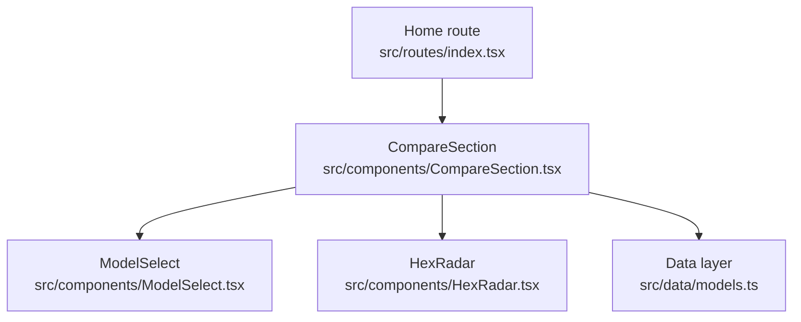
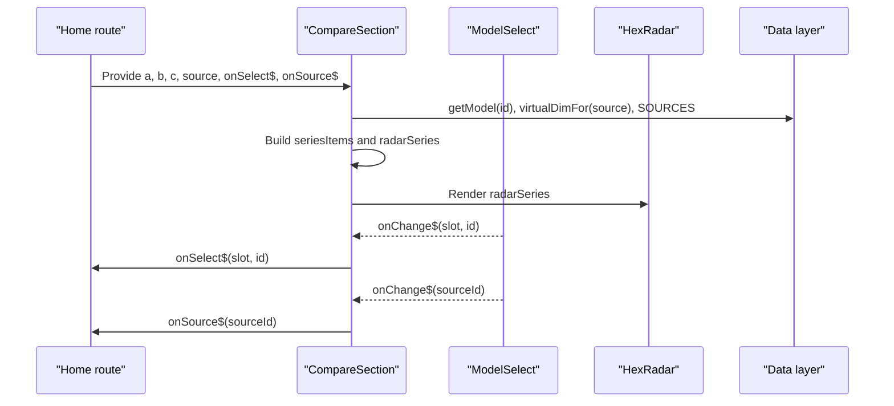
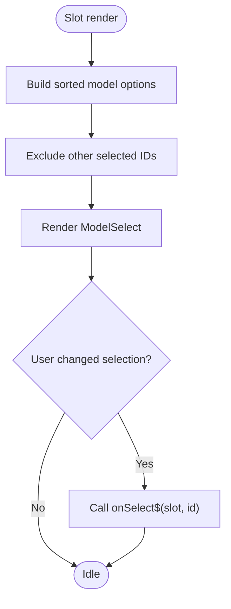
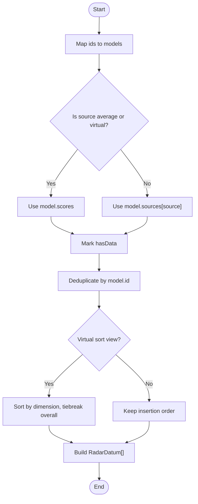
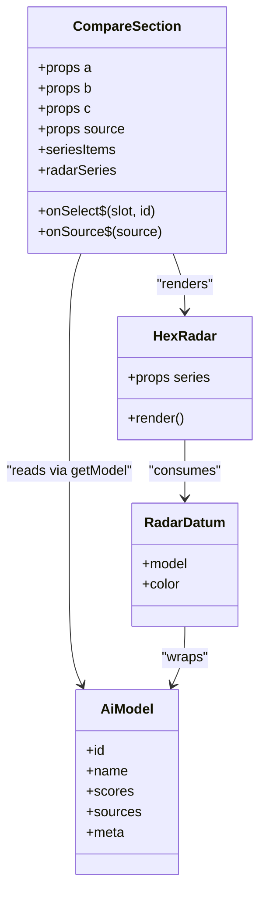
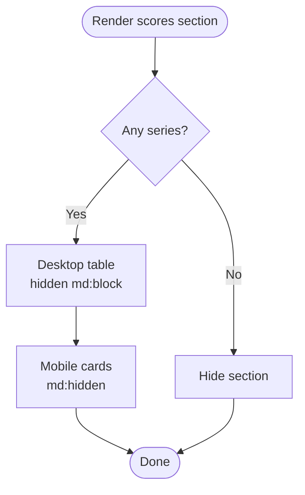
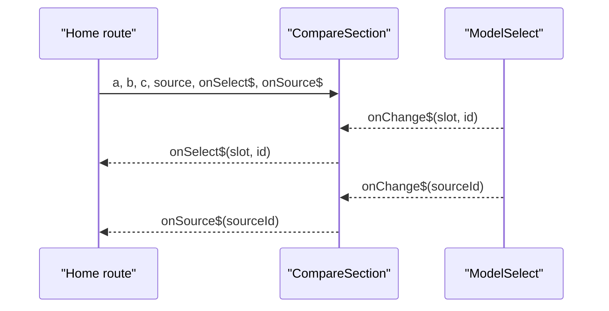
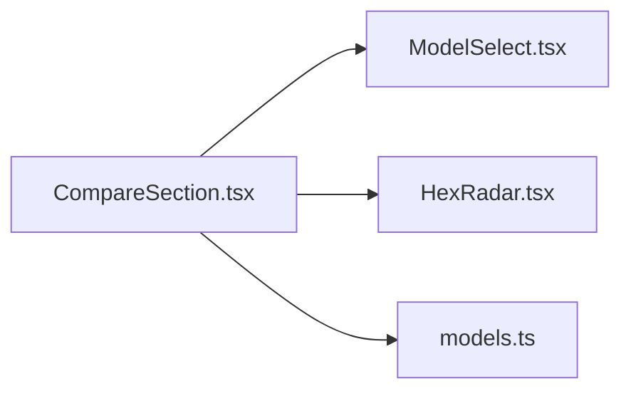

# CompareSection Component

<cite>
**Referenced Files in This Document**
- [CompareSection.tsx](file://src/components/CompareSection.tsx)
- [ModelSelect.tsx](file://src/components/ModelSelect.tsx)
- [HexRadar.tsx](file://src/components/HexRadar.tsx)
- [models.ts](file://src/data/models.ts)
- [index.tsx](file://src/routes/index.tsx)
</cite>

## Table of Contents
1. [Introduction](#introduction)
2. [Project Structure](#project-structure)
3. [Core Components](#core-components)
4. [Architecture Overview](#architecture-overview)
5. [Detailed Component Analysis](#detailed-component-analysis)
6. [Dependency Analysis](#dependency-analysis)
7. [Performance Considerations](#performance-considerations)
8. [Troubleshooting Guide](#troubleshooting-guide)
9. [Conclusion](#conclusion)

## Introduction
CompareSection is the main orchestrator for comparing up to three AI models. It exposes three model slots (A, B, C), a results-source selector, and two callback props that lift selection state upward. Internally it:
- Builds series data from selected model IDs.
- Handles average scores, per-reporting-agent scores, and virtual dimension-based sorting views.
- Renders a HexRadar visualization and a responsive table/card layout with exact scores.
- Coordinates with ModelSelect for accessible dropdowns and with the data layer for model metadata, dimensions, colors, and source definitions.

This component is used on the application’s home route, where parent state controls the selected model IDs and results source.

## Project Structure
CompareSection lives under `src/components` and depends on:
- `ModelSelect`: reusable select UI for choosing models or sources.
- `HexRadar`: SVG radar chart rendering the six scored dimensions.
- `../data/models`: model registry, dimensions, colors, source definitions, and helpers such as `getModel`, `virtualDimFor`, and `SOURCES`.

**Diagram sources**
- [index.tsx:172-179](file://src/routes/index.tsx#L172-L179)
- [CompareSection.tsx:1-7](file://src/components/CompareSection.tsx#L1-L7)
- [ModelSelect.tsx:1-18](file://src/components/ModelSelect.tsx#L1-L18)
- [HexRadar.tsx:1-12](file://src/components/HexRadar.tsx#L1-L12)
- [models.ts:18-30](file://src/data/models.ts#L18-L30)

**Section sources**
- [CompareSection.tsx:1-7](file://src/components/CompareSection.tsx#L1-L7)
- [index.tsx:172-179](file://src/routes/index.tsx#L172-L179)

## Core Components
- CompareSection: owns the A/B/C slot values, builds series data, renders selectors, radar, legend, and responsive score display.
- ModelSelect: accessible `<select>` wrapper with label, duplicate detection, and optional empty option.
- HexRadar: SVG radar chart with non-linear radial scaling, axis labels, tooltips, and ring gridlines.
- Data layer (`models.ts`): provides `MODELS`, `DIMENSIONS`, `MODEL_COLORS`, `SOURCES`, `getModel`, `virtualDimFor`, and related types.

Key responsibilities:
- Series construction from selected IDs.
- Handling missing or unavailable scores gracefully.
- Virtual dimension sorting for ranking views.
- Responsive layout switching between desktop table and mobile cards.

**Section sources**
- [CompareSection.tsx:9-16](file://src/components/CompareSection.tsx#L9-L16)
- [ModelSelect.tsx:4-18](file://src/components/ModelSelect.tsx#L4-L18)
- [HexRadar.tsx:5-12](file://src/components/HexRadar.tsx#L5-L12)
- [models.ts:46-77](file://src/data/models.ts#L46-L77)

## Architecture Overview
The component follows a unidirectional data flow:
- Parent route holds selected model IDs and source key.
- CompareSection receives them via props and emits changes through callbacks.
- Data layer supplies static model metadata and computed view ordering.
- HexRadar consumes derived series data for visualization.

**Diagram sources**
- [index.tsx:172-179](file://src/routes/index.tsx#L172-L179)
- [CompareSection.tsx:20-70](file://src/components/CompareSection.tsx#L20-L70)
- [CompareSection.tsx:88-121](file://src/components/CompareSection.tsx#L88-L121)
- [HexRadar.tsx:62-167](file://src/components/HexRadar.tsx#L62-L167)
- [models.ts:331-333](file://src/data/models.ts#L331-L333)

## Detailed Component Analysis

### Props Interface
CompareSection accepts:
- `a`, `b`, `c`: string model IDs for the three comparison slots.
- `source`: current results view key (average, virtual dimension keys, or reporting agent keys).
- `onSelect$`: callback invoked when a model slot changes; receives slot identifier and new model ID.
- `onSource$`: callback invoked when the results source changes; receives the new source key.

These props are typed using Qwik’s `QRL` for lazy event handlers and the domain types exported by the data layer.

**Section sources**
- [CompareSection.tsx:9-16](file://src/components/CompareSection.tsx#L9-L16)
- [models.ts:18-30](file://src/data/models.ts#L18-L30)

### Three Model Slots and Selection Flow
CompareSection maps the three slots to labels “Model A”, “Model B”, “Model C”. For each slot:
- It creates a `ModelSelect` with an exclusive list of options, excluding the other two selected IDs.
- When a user selects a model, `onChange$` calls `onSelect$(slot, id)` to update parent state.
- The component deduplicates identical selections so the same model appears only once in charts and tables.

**Diagram sources**
- [CompareSection.tsx:20-26](file://src/components/CompareSection.tsx#L20-L26)
- [CompareSection.tsx:88-105](file://src/components/CompareSection.tsx#L88-L105)
- [ModelSelect.tsx:20-47](file://src/components/ModelSelect.tsx#L20-L47)

**Section sources**
- [CompareSection.tsx:18-26](file://src/components/CompareSection.tsx#L18-L26)
- [CompareSection.tsx:88-105](file://src/components/CompareSection.tsx#L88-L105)
- [ModelSelect.tsx:20-47](file://src/components/ModelSelect.tsx#L20-L47)

### Series Data Processing Logic
Series construction performs several steps:
1. Map selected IDs to model objects using `getModel`.
2. Determine whether the active source is average, a virtual dimension view, or a real reporting agent.
3. Select the appropriate score set:
   - Average or virtual view uses `model.scores`.
   - Real source uses `model.sources[source]`.
4. Mark whether data exists for the selected source.
5. Deduplicate entries by model ID, preferring entries with available data.
6. Sort series for virtual dimension views by the chosen dimension and then by overall score.
7. Convert to `RadarDatum[]` for HexRadar.

**Diagram sources**
- [CompareSection.tsx:32-70](file://src/components/CompareSection.tsx#L32-L70)
- [models.ts:260-274](file://src/data/models.ts#L260-L274)

**Section sources**
- [CompareSection.tsx:32-70](file://src/components/CompareSection.tsx#L32-L70)
- [models.ts:331-333](file://src/data/models.ts#L331-L333)

### Virtual Dimension Sorting and Score Calculation
Virtual dimension views mirror the average scores but change the ranking metric. The component:
- Detects virtual views via `virtualDimFor(source)`.
- Uses the same numeric scores as Overall while reordering the selected models by the target dimension.
- Applies a secondary sort by overall score to stabilize ties.

This ensures the hexagon, legend, and table columns follow the same order as the global “All models” list when a virtual view is active.

**Section sources**
- [CompareSection.tsx:60-67](file://src/components/CompareSection.tsx#L60-L67)
- [models.ts:251-263](file://src/data/models.ts#L251-L263)

### Integration with HexRadar Visualization
CompareSection passes `radarSeries` to HexRadar. Each series item contains:
- The hydrated model object with the active score set.
- A deterministic color assigned by slot index using `MODEL_COLORS`.

HexRadar renders:
- Concentric rings at 25, 50, 75, 100.
- Six axes corresponding to `DIMENSIONS`.
- Filled polygons per model with point markers.
- Tooltips with normalized scores and contextual notes for cost, context window, and multimodal fields.

**Diagram sources**
- [CompareSection.tsx:32-70](file://src/components/CompareSection.tsx#L32-L70)
- [HexRadar.tsx:5-12](file://src/components/HexRadar.tsx#L5-L12)
- [HexRadar.tsx:62-167](file://src/components/HexRadar.tsx#L62-L167)
- [models.ts:46-77](file://src/data/models.ts#L46-L77)

**Section sources**
- [CompareSection.tsx:68-70](file://src/components/CompareSection.tsx#L68-L70)
- [HexRadar.tsx:62-167](file://src/components/HexRadar.tsx#L62-L167)

### Responsive Table Layout: Desktop Table vs Mobile Cards
CompareSection renders two alternative layouts for exact scores:
- Desktop: a fixed-width table with columns per selected model, rows for each dimension, overall score, context window, and pricing tiers. Hidden on small screens.
- Mobile: a card-per-model layout with a definition list showing the same fields. Hidden on medium and larger screens.

Both layouts:
- Show “N/A” when a model lacks data for the active source.
- Display free/paid badges based on model metadata.
- Include an accessible legend above the visualization.

**Diagram sources**
- [CompareSection.tsx:177-315](file://src/components/CompareSection.tsx#L177-L315)

**Section sources**
- [CompareSection.tsx:177-315](file://src/components/CompareSection.tsx#L177-L315)

### Accessibility Features
CompareSection and its children implement accessibility considerations:
- Section heading and `aria-labelledby` link the compare section to its heading.
- Legend list uses `aria-label="Legend"` for screen readers.
- HexRadar includes `role="img"`, title, and description elements.
- Table headers use `scope="col"` and `scope="row"` for proper association.
- Color indicators use `aria-hidden="true"` since meaning is conveyed by text and structure.
- Keyboard navigation relies on native `<select>` behavior provided by ModelSelect.

**Section sources**
- [CompareSection.tsx:78-86](file://src/components/CompareSection.tsx#L78-L86)
- [CompareSection.tsx:137-173](file://src/components/CompareSection.tsx#L137-L173)
- [CompareSection.tsx:190-227](file://src/components/CompareSection.tsx#L190-L227)
- [HexRadar.tsx:67-73](file://src/components/HexRadar.tsx#L67-L73)
- [ModelSelect.tsx:20-47](file://src/components/ModelSelect.tsx#L20-L47)

### Usage Example and State Management Pattern
At the route level, the home page composes CompareSection with:
- Selected model IDs `a`, `b`, `c`.
- Selected source key `source`.
- Callbacks `handleSelect` and `handleSource` that update URL query parameters and local state.

**Diagram sources**
- [index.tsx:172-179](file://src/routes/index.tsx#L172-L179)
- [CompareSection.tsx:88-121](file://src/components/CompareSection.tsx#L88-L121)

**Section sources**
- [index.tsx:154-179](file://src/routes/index.tsx#L154-L179)

### Data Layer Integration
CompareSection integrates with the data layer for:
- Model lookup via `getModel`.
- Dimensions and their labels via `DIMENSIONS`.
- Colors via `MODEL_COLORS`.
- Results source definitions and labels via `SOURCES`.
- Virtual view detection via `virtualDimFor`.

The data layer also documents how scores are generated and how adding new findings files updates the client automatically after running the sync script.

**Section sources**
- [CompareSection.tsx:3-7](file://src/components/CompareSection.tsx#L3-L7)
- [models.ts:6-16](file://src/data/models.ts#L6-L16)
- [models.ts:121-166](file://src/data/models.ts#L121-L166)
- [models.ts:318-333](file://src/data/models.ts#L318-L333)

## Dependency Analysis
CompareSection depends on:
- `ModelSelect` for selection UX.
- `HexRadar` for visualization.
- `models.ts` for domain data and helpers.

**Diagram sources**
- [CompareSection.tsx:1-7](file://src/components/CompareSection.tsx#L1-L7)
- [ModelSelect.tsx:1-18](file://src/components/ModelSelect.tsx#L1-L18)
- [HexRadar.tsx:1-12](file://src/components/HexRadar.tsx#L1-L12)
- [models.ts:18-30](file://src/data/models.ts#L18-L30)

**Section sources**
- [CompareSection.tsx:1-7](file://src/components/CompareSection.tsx#L1-L7)

## Performance Considerations
- Series computation is lightweight: it maps over three IDs, performs constant-time lookups, and sorts at most three items.
- Deduplication uses a `Map` keyed by model ID for O(n) behavior.
- HexRadar renders SVG elements proportional to the number of selected models and dimensions; with three models and six axes, this remains small.
- Avoid unnecessary re-renders by keeping selection state in the parent route and passing stable callbacks.

[No sources needed since this section provides general guidance]

## Troubleshooting Guide
Common issues and resolutions:
- Missing scores for a selected model:
  - If the active source does not include a model, the component marks `hasData` false and displays “N/A” in both legend and table.
  - Ensure the model has a valid entry in the generated scores and that the selected source corresponds to a supported key.
- Duplicate model selection:
  - ModelSelect warns when the same model is selected in multiple slots.
  - CompareSection deduplicates series so the model appears only once in visualizations.
- Virtual view confusion:
  - Virtual views show the same numbers as Overall but reorder selected models by the chosen dimension.
  - Use the results source selector to switch between average, virtual views, and reporting agents.

**Section sources**
- [CompareSection.tsx:32-70](file://src/components/CompareSection.tsx#L32-L70)
- [CompareSection.tsx:137-173](file://src/components/CompareSection.tsx#L137-L173)
- [CompareSection.tsx:177-315](file://src/components/CompareSection.tsx#L177-L315)
- [ModelSelect.tsx:20-47](file://src/components/ModelSelect.tsx#L20-L47)

## Conclusion
CompareSection centralizes model comparison by managing three selection slots, coordinating with the data layer for scores and metadata, and rendering both a radar visualization and a responsive score table. Its design emphasizes clarity, accessibility, and predictable state flow through parent-controlled props and callbacks. Virtual dimension views provide flexible ranking without altering underlying scores, and graceful handling of missing data ensures robustness across different sources.

[No sources needed since this section summarizes without analyzing specific files]