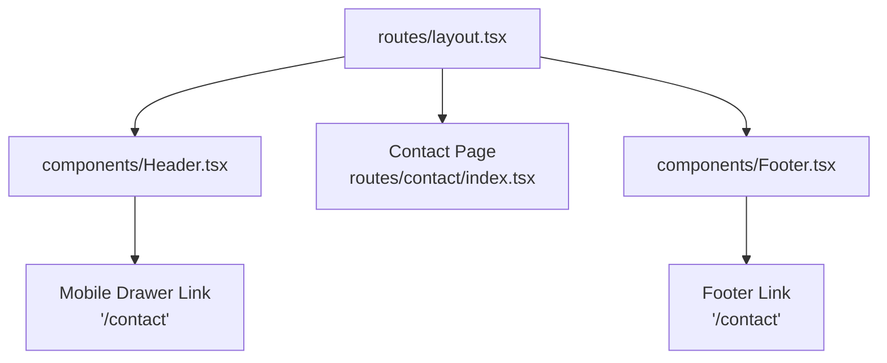
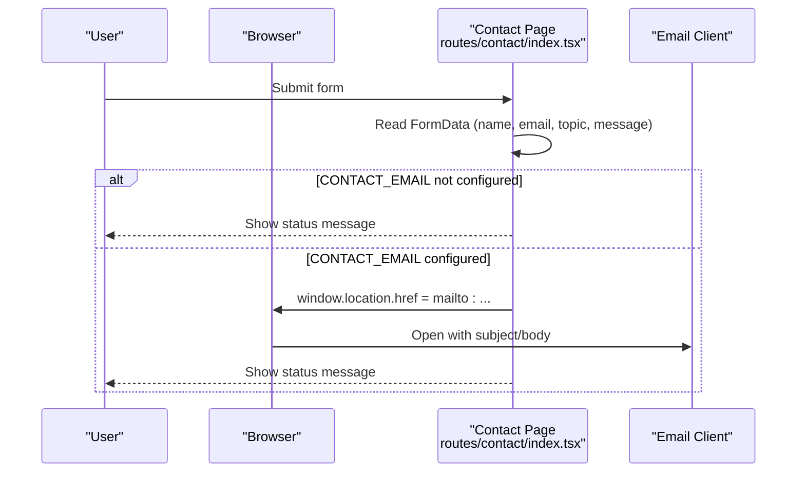
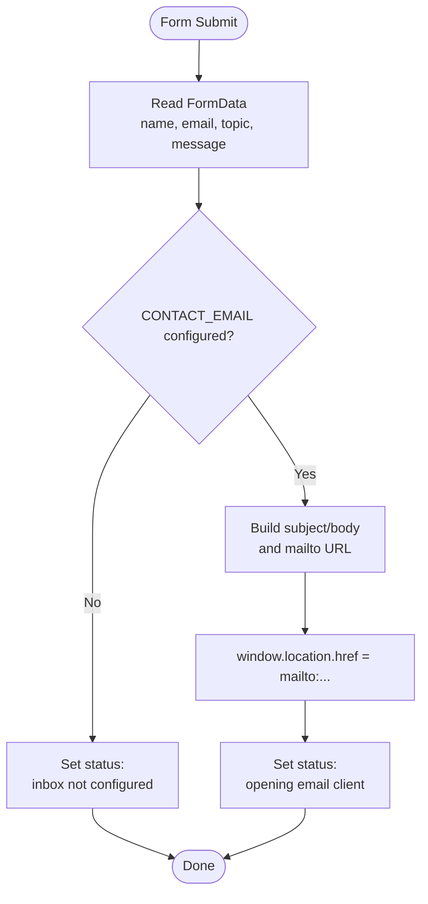
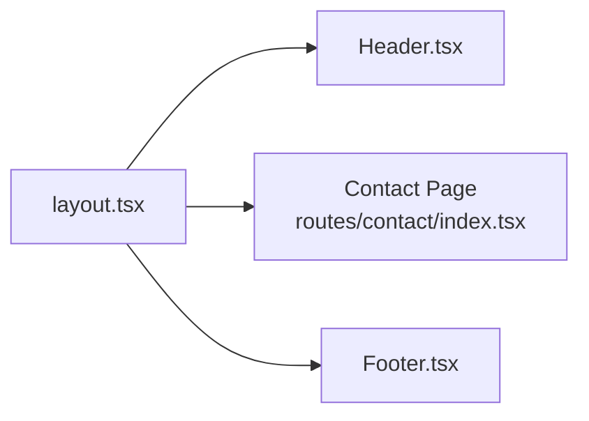
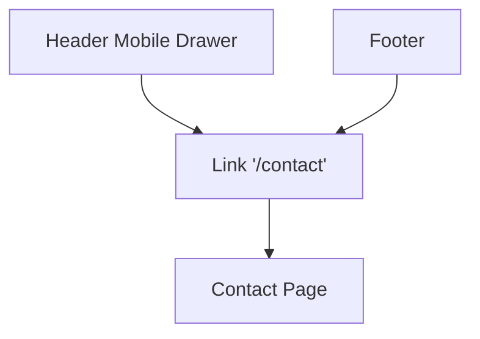
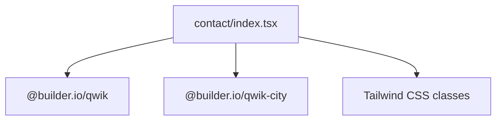

# Contact Page & Form Interface

<cite>
**Referenced Files in This Document**
- [contact/index.tsx](file://src/routes/contact/index.tsx)
- [layout.tsx](file://src/routes/layout.tsx)
- [Header.tsx](file://src/components/Header.tsx)
- [Footer.tsx](file://src/components/Footer.tsx)
</cite>

## Table of Contents
1. [Introduction](#introduction)
2. [Project Structure](#project-structure)
3. [Core Components](#core-components)
4. [Architecture Overview](#architecture-overview)
5. [Detailed Component Analysis](#detailed-component-analysis)
6. [Dependency Analysis](#dependency-analysis)
7. [Performance Considerations](#performance-considerations)
8. [Troubleshooting Guide](#troubleshooting-guide)
9. [Conclusion](#conclusion)

## Introduction
This document explains the Contact page and its form interface in the project. The contact route is a fully static Qwik component that collects user input and opens the visitor’s email client with a pre-filled message using a mailto link. There is no server-side form backend; the site remains static.

## Project Structure
The contact feature lives under the routes directory as a Qwik City route, and it is rendered inside the application layout which includes the global Header and Footer. Navigation to the contact page is available from both the desktop navigation and the mobile drawer.

**Diagram sources**
- [layout.tsx:5-15](file://src/routes/layout.tsx#L5-L15)
- [Header.tsx:153-160](file://src/components/Header.tsx#L153-L160)
- [Footer.tsx:148-153](file://src/components/Footer.tsx#L148-L153)
- [contact/index.tsx:20-124](file://src/routes/contact/index.tsx#L20-L124)

**Section sources**
- [layout.tsx:5-15](file://src/routes/layout.tsx#L5-L15)
- [Header.tsx:153-160](file://src/components/Header.tsx#L153-L160)
- [Footer.tsx:148-153](file://src/components/Footer.tsx#L148-L153)

## Core Components
- Contact Page (route): Renders the contact heading, description, form fields, submit behavior, status messages, and optional direct mailto link. It also sets the page title and meta description for SEO.
- Layout: Wraps all pages with Header and Footer and renders the current route content via Slot.
- Header: Provides top-level navigation including a link to /contact in the mobile drawer.
- Footer: Includes a footer-level link to /contact.

Key responsibilities:
- Collecting user input (name, email, topic, message).
- Validating required fields through native HTML validation.
- Constructing a mailto URL with subject and body when a contact inbox is configured.
- Providing user feedback via an aria-live status region.

**Section sources**
- [contact/index.tsx:20-124](file://src/routes/contact/index.tsx#L20-L124)
- [contact/index.tsx:126-134](file://src/routes/contact/index.tsx#L126-L134)
- [layout.tsx:5-15](file://src/routes/layout.tsx#L5-L15)
- [Header.tsx:153-160](file://src/components/Header.tsx#L153-L160)
- [Footer.tsx:148-153](file://src/components/Footer.tsx#L148-L153)

## Architecture Overview
The contact page is a client-rendered Qwik component within a Qwik City route. On form submission, it prevents default navigation, reads form data, validates presence of a configured contact email, builds a mailto link, and redirects the browser to open the user’s email client.

**Diagram sources**
- [contact/index.tsx:31-49](file://src/routes/contact/index.tsx#L31-L49)
- [contact/index.tsx:113-121](file://src/routes/contact/index.tsx#L113-L121)

## Detailed Component Analysis

### Contact Page Component
The contact page implements a simple, accessible form with:
- Fields: Name, Email, Topic (select), Message (textarea).
- Validation: Native HTML required attributes ensure inputs are filled before submission.
- Submission handler: Prevents default, extracts values, checks if a contact email is configured, constructs a mailto URL, and updates a status signal.
- Status feedback: An aria-live region announces success or configuration issues.
- Direct email option: When a contact email is configured, a plain mailto link is shown below the form.

**Diagram sources**
- [contact/index.tsx:31-49](file://src/routes/contact/index.tsx#L31-L49)

Accessibility and UX highlights:
- Labels are associated with inputs via id-for attributes.
- Required fields use native validation.
- Status text uses aria-live="polite" for screen readers.
- Dark mode styles are applied consistently across inputs and containers.

SEO metadata:
- Title and meta description are set via Qwik City’s DocumentHead export.

**Section sources**
- [contact/index.tsx:9-15](file://src/routes/contact/index.tsx#L9-L15)
- [contact/index.tsx:17-18](file://src/routes/contact/index.tsx#L17-L18)
- [contact/index.tsx:20-124](file://src/routes/contact/index.tsx#L20-L124)
- [contact/index.tsx:126-134](file://src/routes/contact/index.tsx#L126-L134)

### Layout Integration
The layout wraps every page with Header and Footer and renders the active route content. The contact page is thus automatically included in the global header/footer structure.

**Diagram sources**
- [layout.tsx:5-15](file://src/routes/layout.tsx#L5-L15)

**Section sources**
- [layout.tsx:5-15](file://src/routes/layout.tsx#L5-L15)

### Navigation to Contact
Users can navigate to the contact page from:
- Mobile drawer in Header: a link to /contact closes the drawer on click.
- Footer: a link to /contact.

**Diagram sources**
- [Header.tsx:153-160](file://src/components/Header.tsx#L153-L160)
- [Footer.tsx:148-153](file://src/components/Footer.tsx#L148-L153)

**Section sources**
- [Header.tsx:153-160](file://src/components/Header.tsx#L153-L160)
- [Footer.tsx:148-153](file://src/components/Footer.tsx#L148-L153)

## Dependency Analysis
- The contact page depends on Qwik primitives (component$, useSignal) and Qwik City types (DocumentHead).
- It does not import other components; it is self-contained.
- Routing is handled by Qwik City; the file path maps directly to /contact.
- Styling relies on Tailwind utility classes defined elsewhere in the project.

**Diagram sources**
- [contact/index.tsx:1-2](file://src/routes/contact/index.tsx#L1-L2)

**Section sources**
- [contact/index.tsx:1-2](file://src/routes/contact/index.tsx#L1-L2)

## Performance Considerations
- Fully static: No server calls; the form only manipulates the DOM and triggers a mailto redirect.
- Minimal state: Only a single status signal is used to display feedback.
- Lightweight UI: Uses Tailwind utilities without heavy third-party libraries.

[No sources needed since this section provides general guidance]

## Troubleshooting Guide
Common issues and resolutions:
- Email client does not open:
  - Ensure a valid CONTACT_EMAIL is configured in the contact page. If empty, the form shows a status message instructing users to reach out via GitHub.
- Subject/body missing in email client:
  - Verify that the mailto URL construction includes both subject and body parameters.
- Form submits but nothing happens:
  - Confirm that the submit handler prevents default and sets window.location.href to the constructed mailto link.
- Accessibility concerns:
  - Ensure labels are properly associated with inputs and that the status region uses aria-live for announcements.

**Section sources**
- [contact/index.tsx:40-48](file://src/routes/contact/index.tsx#L40-L48)
- [contact/index.tsx:104-108](file://src/routes/contact/index.tsx#L104-L108)
- [contact/index.tsx:113-121](file://src/routes/contact/index.tsx#L113-L121)

## Conclusion
The Contact page provides a simple, accessible, and fully static form interface that leverages the user’s email client via mailto links. It integrates cleanly into the app layout and offers clear navigation from both the header and footer. With proper configuration of the contact email, users receive immediate feedback and a pre-filled email draft, keeping the site lightweight and maintainable.