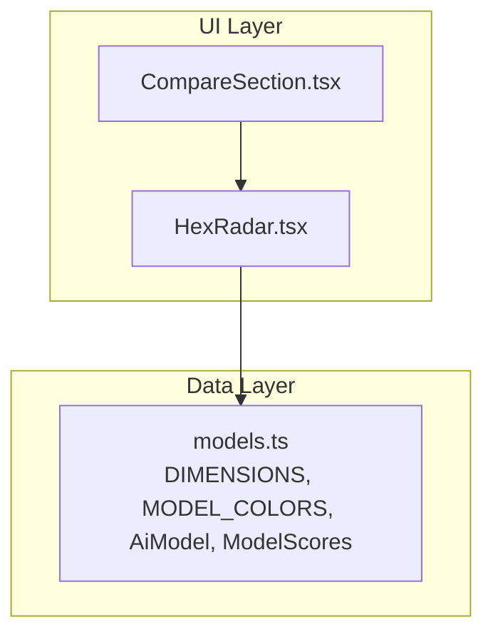
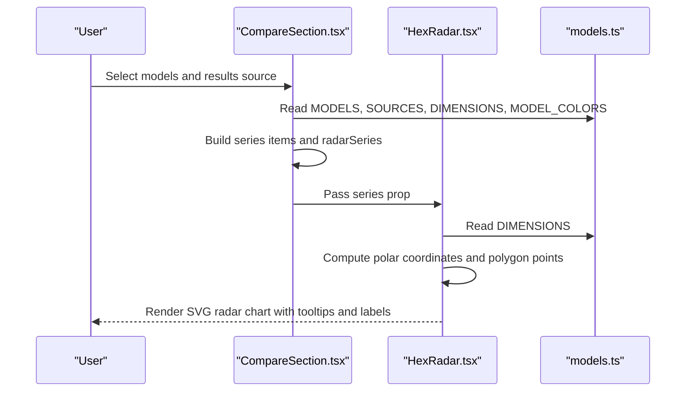
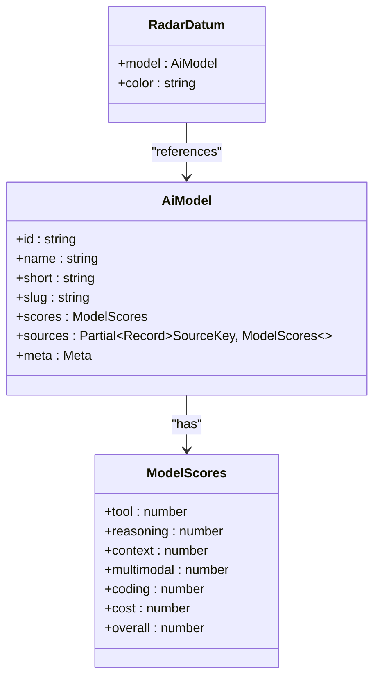
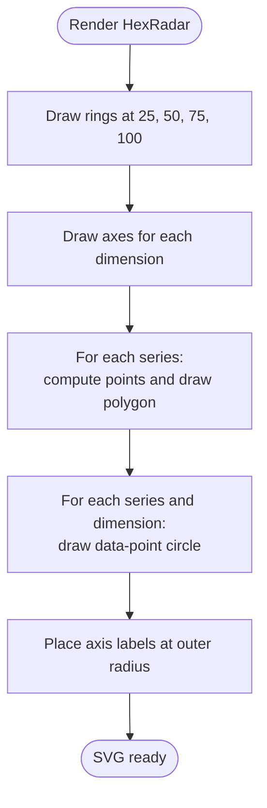
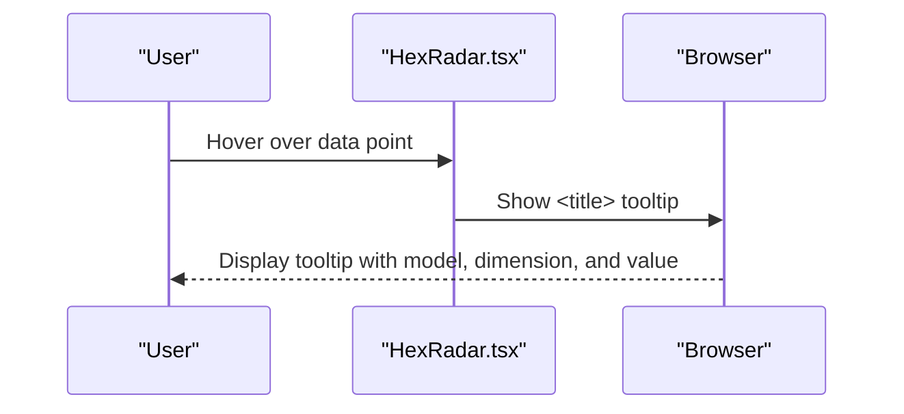
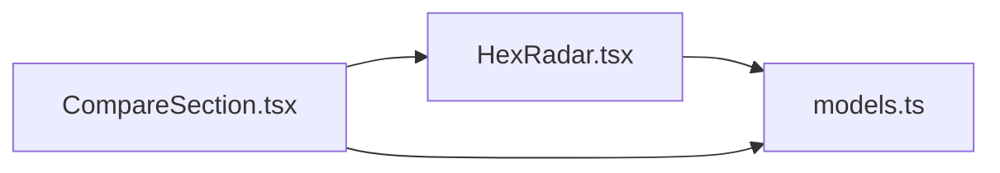

# HexRadar Visualization Component

<cite>
**Referenced Files in This Document**
- [HexRadar.tsx](file://src/components/HexRadar.tsx)
- [models.ts](file://src/data/models.ts)
- [CompareSection.tsx](file://src/components/CompareSection.tsx)
</cite>

## Table of Contents
1. [Introduction](#introduction)
2. [Project Structure](#project-structure)
3. [Core Components](#core-components)
4. [Architecture Overview](#architecture-overview)
5. [Detailed Component Analysis](#detailed-component-analysis)
6. [Dependency Analysis](#dependency-analysis)
7. [Performance Considerations](#performance-considerations)
8. [Troubleshooting Guide](#troubleshooting-guide)
9. [Conclusion](#conclusion)

## Introduction
The HexRadar component renders a hexagonal radar chart for comparing up to three AI models across six dimensions: Tool use, Reasoning, Context window, Multimodal, Coding, and Cost efficiency. It is an SVG-based visualization that emphasizes higher scores through a non-linear radial scale, provides tooltips per data point, and integrates with the rest of the application’s model selection, legend, and table UI.

This document explains the RadarDatum interface, series data structure, coordinate calculations, polygon rendering, color management, interactivity, accessibility, responsiveness, customization options, performance considerations, and integration patterns.

## Project Structure
HexRadar lives under the Qwik components directory and consumes shared model metadata and dimension definitions from the data module. The CompareSection orchestrates user input, builds the series array, and passes it into HexRadar.

**Diagram sources**
- [CompareSection.tsx:1-10](file://src/components/CompareSection.tsx#L1-L10)
- [HexRadar.tsx:1-12](file://src/components/HexRadar.tsx#L1-L12)
- [models.ts:46-166](file://src/data/models.ts#L46-L166)

**Section sources**
- [HexRadar.tsx:1-12](file://src/components/HexRadar.tsx#L1-L12)
- [CompareSection.tsx:1-10](file://src/components/CompareSection.tsx#L1-L10)
- [models.ts:46-166](file://src/data/models.ts#L46-L166)

## Core Components
- HexRadar: Renders the SVG hexagonal radar chart, including grid rings, axes, polygons per series, data-point circles, axis labels, and accessible titles/descriptions.
- RadarDatum: The per-series data contract used by HexRadar.
- CompareSection: Builds the series array from selected models and results source, then renders HexRadar alongside a legend and score table.

Key responsibilities:
- HexRadar focuses on geometry, styling, and accessibility.
- CompareSection focuses on data binding, sorting, and UI composition.
- models.ts defines the dimension layout, model types, and default colors.

**Section sources**
- [HexRadar.tsx:5-12](file://src/components/HexRadar.tsx#L5-L12)
- [CompareSection.tsx:32-70](file://src/components/CompareSection.tsx#L32-L70)
- [models.ts:46-166](file://src/data/models.ts#L46-L166)

## Architecture Overview
HexRadar is a presentational component. It receives preprocessed series data and renders static SVG elements. Interactivity is limited to native browser behaviors such as hover tooltips via `<title>` elements. Styling uses Tailwind utility classes and CSS variables are not required.

**Diagram sources**
- [CompareSection.tsx:32-70](file://src/components/CompareSection.tsx#L32-L70)
- [HexRadar.tsx:62-163](file://src/components/HexRadar.tsx#L62-L163)
- [models.ts:121-166](file://src/data/models.ts#L121-L166)

## Detailed Component Analysis

### RadarDatum Interface and Series Data Structure
RadarDatum represents one visual series in the radar chart:
- model: An AiModel instance containing id, name, short, slug, scores, sources, and meta.
- color: A string color assigned to the series (from MODEL_COLORS).

HexRadar expects a prop named series of type RadarDatum[].

Series construction in CompareSection:
- Maps selected model IDs to model objects.
- Applies virtual sort views or specific reporting-agent sources.
- Assigns colors using MODEL_COLORS by slot index.
- Deduplicates by model id while preferring entries with available data.
- Sorts by the active dimension when using virtual views.
- Filters out series without data before passing to HexRadar.

**Diagram sources**
- [HexRadar.tsx:5-8](file://src/components/HexRadar.tsx#L5-L8)
- [models.ts:46-77](file://src/data/models.ts#L46-L77)

**Section sources**
- [HexRadar.tsx:5-12](file://src/components/HexRadar.tsx#L5-L12)
- [CompareSection.tsx:32-70](file://src/components/CompareSection.tsx#L32-L70)
- [models.ts:46-77](file://src/data/models.ts#L46-L77)

### SVG-Based Hexagonal Chart Implementation

#### Coordinate Calculations
- Center: fixed at CX=200, CY=200 within a 400x400 viewBox.
- Maximum radius: MAX_R=130 for data points; LABEL_R=168 for axis labels.
- Non-linear scaling: values are clamped to [0,100] and mapped to radius using r = (v/100)^GAMMA, where GAMMA ≈ 2.41 so that 75 maps to half the maximum radius. This visually emphasizes the top end of the scale.
- Polar conversion: angle starts at -90 degrees (top) and increments by 60 degrees per dimension index. Coordinates are computed as x = CX + r*cos(angle), y = CY + r*sin(angle).

These functions ensure consistent placement of rings, axes, polygons, and labels.

#### Polygon Rendering
- Grid rings: Four concentric hexagons at 25, 50, 75, 100. Each ring is a polygon built from the same polar function.
- Axes: Six lines from center to the outermost point for each dimension.
- Series polygons: One polygon per series, connecting the six dimension points. Fill opacity is set to 0.35, stroke width is 2, and line join is round.
- Data points: Circles at each dimension point with a white stroke for contrast against dark backgrounds.

#### Color Management
- Series colors come from MODEL_COLORS in models.ts, applied by slot index.
- Dark mode support is provided via Tailwind utilities on strokes, fills, and text.
- Legend and table headers reflect the same color for consistency.

#### Accessibility
- The SVG has role="img", aria-labelledby referencing title and description elements.
- Title summarizes the compared models.
- Description explains the axes, scale emphasis, and exact values location.
- Each data point circle includes a tooltip via <title>.
- Axis labels include descriptions via <title>.

#### Responsiveness
- The SVG uses viewBox="0 0 400 400" and is wrapped in a container with responsive width utilities.
- Labels and dots remain readable across sizes due to fixed coordinate math and relative sizing.

**Diagram sources**
- [HexRadar.tsx:14-42](file://src/components/HexRadar.tsx#L14-L42)
- [HexRadar.tsx:62-163](file://src/components/HexRadar.tsx#L62-L163)

**Section sources**
- [HexRadar.tsx:14-42](file://src/components/HexRadar.tsx#L14-L42)
- [HexRadar.tsx:62-163](file://src/components/HexRadar.tsx#L62-L163)
- [models.ts:121-166](file://src/data/models.ts#L121-L166)

### Interactive Features

#### Hover States and Tooltips
- Native SVG tooltips are implemented using <title> inside polygons and circles.
- Tooltip content includes model name, dimension label, and value or contextual metadata (e.g., cost pricing note, context window size, multimodal capabilities).
- No custom hover state logic is present; styling transitions rely on Tailwind classes.

#### Legend Generation
- CompareSection generates a legend list showing model name, overall score, and free/paid indicator.
- Colors in the legend match the series colors.
- Legend items link to model detail pages.

#### Responsive Scaling
- The SVG scales fluidly via viewBox and responsive container classes.
- On small screens, CompareSection switches from a table to card-style summaries for exact scores.

**Diagram sources**
- [HexRadar.tsx:126-144](file://src/components/HexRadar.tsx#L126-L144)

**Section sources**
- [HexRadar.tsx:46-60](file://src/components/HexRadar.tsx#L46-L60)
- [HexRadar.tsx:126-144](file://src/components/HexRadar.tsx#L126-L144)
- [CompareSection.tsx:137-173](file://src/components/CompareSection.tsx#L137-L173)

### Chart Customization Options and Styling Approaches
- Dimensions: Controlled by DIMENSIONS in models.ts. Adding or reordering dimensions requires changes there and will affect all charts and tables.
- Colors: Controlled by MODEL_COLORS in models.ts. Extend this array if more than three series are needed.
- Scale emphasis: Adjust GAMMA to change how much the outer half of the axis emphasizes high scores.
- Visual style: Tailwind utility classes control stroke, fill, font size, and dark-mode variants.
- Accessibility: Titles, descriptions, and aria attributes are embedded directly in the SVG.

To customize:
- Change MODEL_COLORS to introduce new palettes.
- Modify GAMMA to alter the non-linear emphasis curve.
- Update DIMENSIONS to add or rename axes.
- Adjust Tailwind classes for stroke widths, font sizes, and colors.

**Section sources**
- [HexRadar.tsx:19-27](file://src/components/HexRadar.tsx#L19-L27)
- [HexRadar.tsx:67-163](file://src/components/HexRadar.tsx#L67-L163)
- [models.ts:121-166](file://src/data/models.ts#L121-L166)

### Data Binding Examples
- Single series: Pass [{ model: someModel, color: "#4f46e5" }] to HexRadar.
- Multiple series: Pass up to three series with distinct colors from MODEL_COLORS.
- Virtual sort view: CompareSection computes scores based on a dimension and sorts the series accordingly before rendering.

Example flow:
- Select two models and choose “Reason” as the results source.
- CompareSection sets scores to the average scores but sorts by reasoning.
- HexRadar renders both models’ polygons and points using those scores.

**Section sources**
- [CompareSection.tsx:32-70](file://src/components/CompareSection.tsx#L32-L70)
- [HexRadar.tsx:107-125](file://src/components/HexRadar.tsx#L107-L125)

### Animation Handling
- There is no explicit animation logic in HexRadar.
- Transitions are limited to CSS classes for color changes (e.g., dark mode).
- If animations are desired, consider adding CSS transitions or Qwik animations around polygon points and circles.

[No sources needed since this section provides general guidance]

### Accessibility Implementations
- Semantic roles: SVG has role="img".
- Accessible names: aria-labelledby references title and description.
- Descriptive text: Description explains axes and scale emphasis.
- Tooltips: <title> elements provide concise information on hover.
- Keyboard navigation: Not applicable to SVG shapes; focus is managed by surrounding controls in CompareSection.

**Section sources**
- [HexRadar.tsx:67-73](file://src/components/HexRadar.tsx#L67-L73)
- [HexRadar.tsx:122-144](file://src/components/HexRadar.tsx#L122-L144)

### Cross-Browser Compatibility and Touch Interaction Support
- SVG standards: Uses standard SVG elements (polygon, circle, line, text, title, desc) supported across modern browsers.
- ViewBox scaling: Ensures consistent rendering across devices.
- Touch interactions: Tooltips appear via native <title> behavior; no custom touch handlers are required.
- Dark mode: Relies on Tailwind’s dark: variants; ensure the project’s dark mode configuration is enabled.

**Section sources**
- [HexRadar.tsx:67-163](file://src/components/HexRadar.tsx#L67-L163)

## Dependency Analysis
HexRadar depends on:
- DIMENSIONS: Defines axis order, labels, and descriptions.
- AiModel and ModelScores: Provide the data shape for model comparisons.
- MODEL_COLORS: Provides default series colors.

CompareSection depends on:
- MODELS, SOURCES, MODEL_COLORS, DIMENSIONS: For building options, series, and colors.
- getModel: To resolve selected model IDs.
- virtualDimFor: To determine whether a virtual sort view is active.

**Diagram sources**
- [HexRadar.tsx:1-3](file://src/components/HexRadar.tsx#L1-L3)
- [CompareSection.tsx:1-7](file://src/components/CompareSection.tsx#L1-L7)
- [models.ts:46-166](file://src/data/models.ts#L46-L166)

**Section sources**
- [HexRadar.tsx:1-3](file://src/components/HexRadar.tsx#L1-L3)
- [CompareSection.tsx:1-7](file://src/components/CompareSection.tsx#L1-L7)
- [models.ts:46-166](file://src/data/models.ts#L46-L166)

## Performance Considerations
- Static SVG rendering: HexRadar does not compute heavy layouts; it performs simple trigonometric calculations per dimension and series.
- Series count: Designed for up to three series; additional series increase polygon and circle counts linearly.
- Re-renders: In Qwik, only changed parts re-render; Ensure series arrays are stable or memoized to avoid unnecessary updates.
- Tooltip overhead: Using <title> is lightweight; avoid attaching expensive event listeners.
- Dark mode toggles: CSS transitions are GPU-accelerated and inexpensive.

Optimization tips:
- Memoize series computation in CompareSection if parent props change frequently.
- Avoid recalculating polar coordinates by caching results if many series are added later.
- Keep dimension count fixed at six to maintain predictable performance.

[No sources needed since this section provides general guidance]

## Troubleshooting Guide
Common issues and resolutions:
- Missing scores for a selected model:
  - Symptom: Series shows N/A in legend/table and no polygon.
  - Cause: Selected source lacks scores for that model.
  - Resolution: Choose “Overall” or another source with available data.
- Incorrect axis order:
  - Symptom: Dimensions appear misaligned.
  - Cause: Changes to DIMENSIONS not reflected everywhere.
  - Resolution: Update DIMENSIONS in models.ts consistently.
- Colors not applying:
  - Symptom: Series colors do not match expectations.
  - Cause: MODEL_COLORS array length mismatch or incorrect slot assignment.
  - Resolution: Extend MODEL_COLORS or adjust CompareSection’s color assignment.
- Tooltips not visible:
  - Symptom: Hovering does not show tooltip.
  - Cause: Browser-specific behavior or overlaying elements.
  - Resolution: Ensure no overlays block pointer events; verify <title> presence.

**Section sources**
- [CompareSection.tsx:32-70](file://src/components/CompareSection.tsx#L32-L70)
- [HexRadar.tsx:126-144](file://src/components/HexRadar.tsx#L126-L144)

## Conclusion
HexRadar provides a clear, accessible, and responsive hexagonal radar chart for comparing AI models across six dimensions. Its implementation relies on straightforward SVG geometry, a non-linear scale to emphasize high scores, and Tailwind-based styling. Integration with CompareSection ensures robust data binding, legend generation, and responsive presentation. For further customization, extend MODEL_COLORS, adjust GAMMA, or modify DIMENSIONS. Performance remains strong for the intended use case of up to three series, and accessibility is handled through semantic SVG attributes and tooltips.