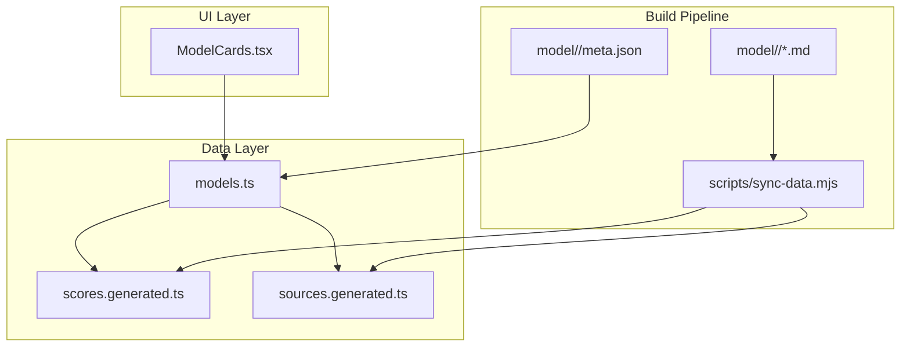
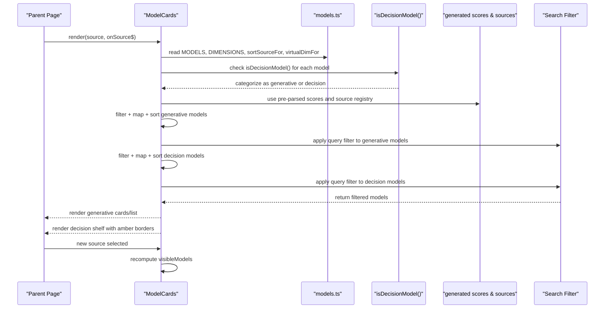
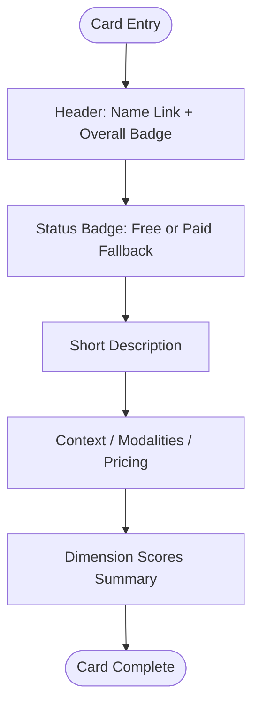
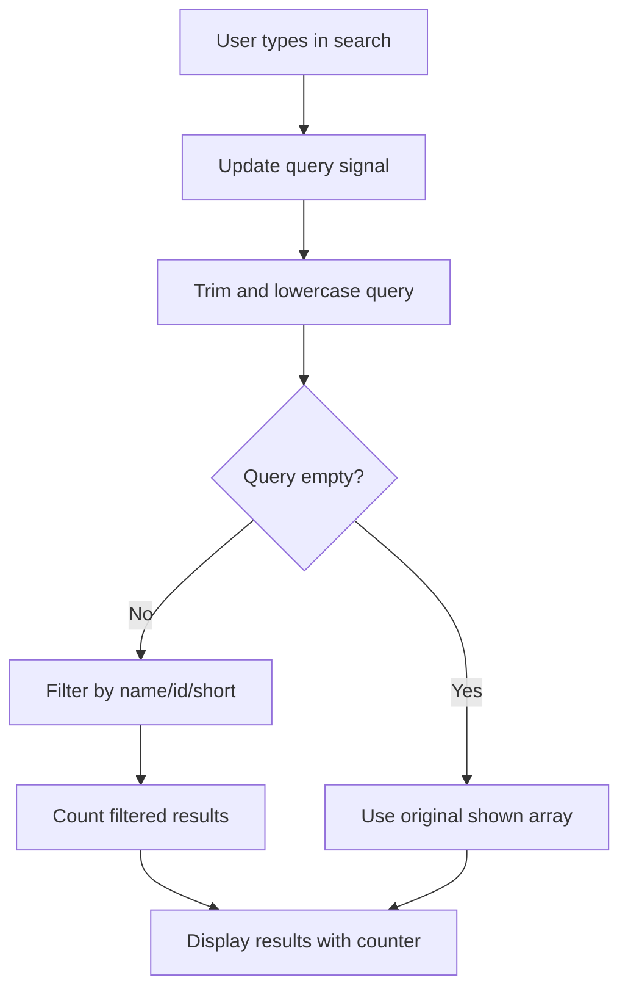
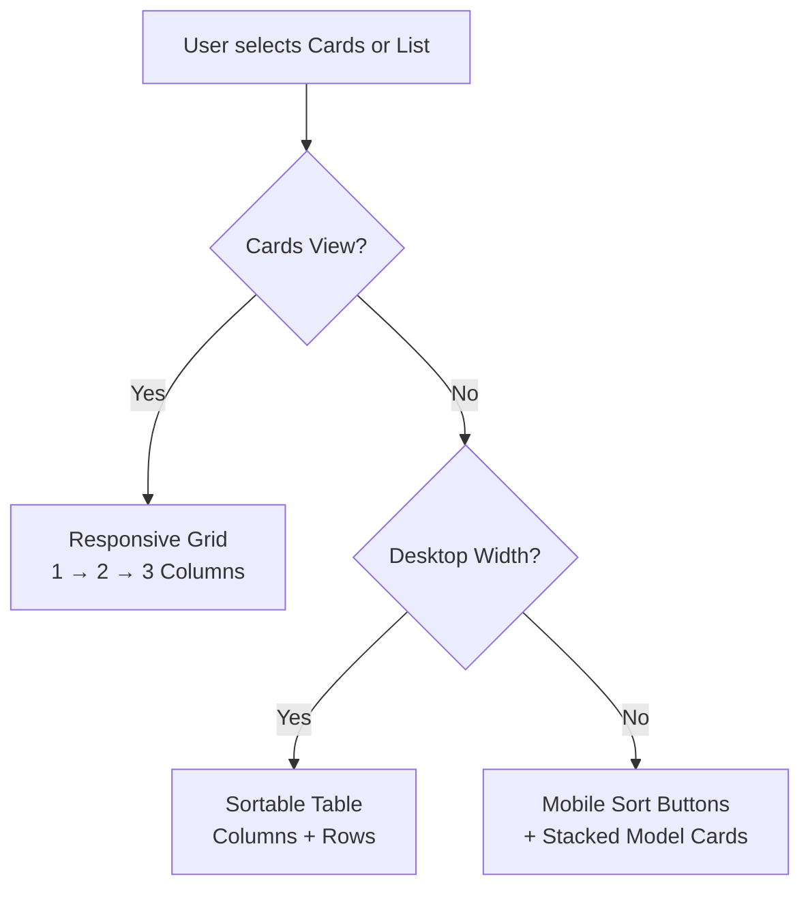
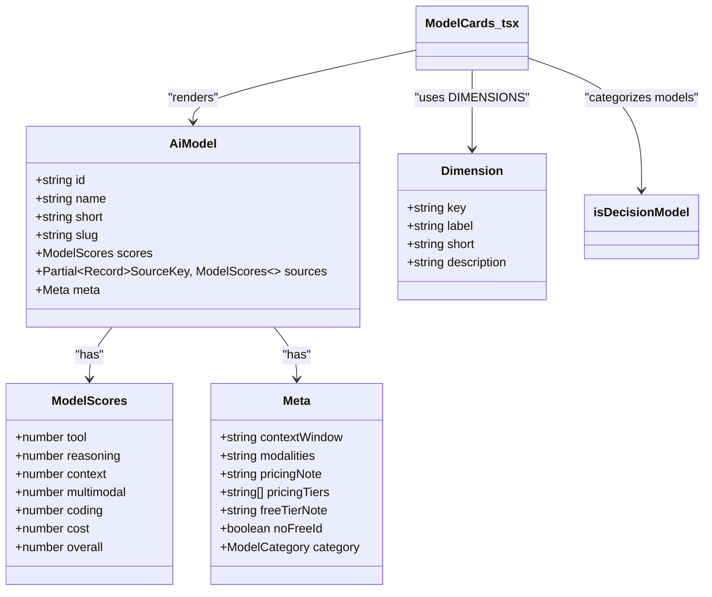
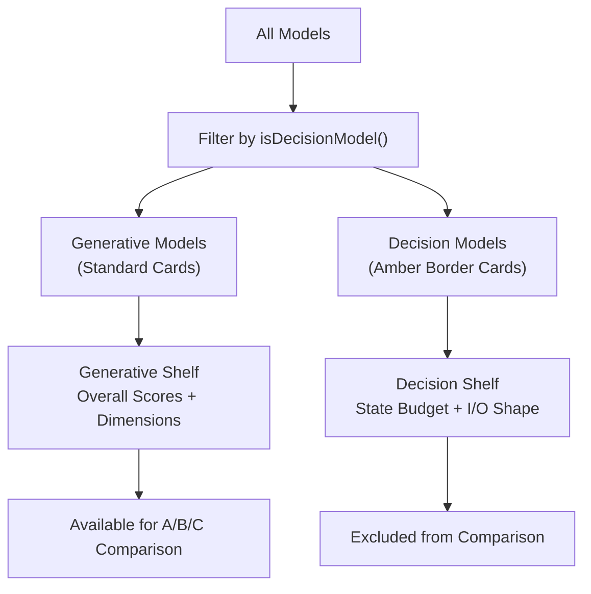
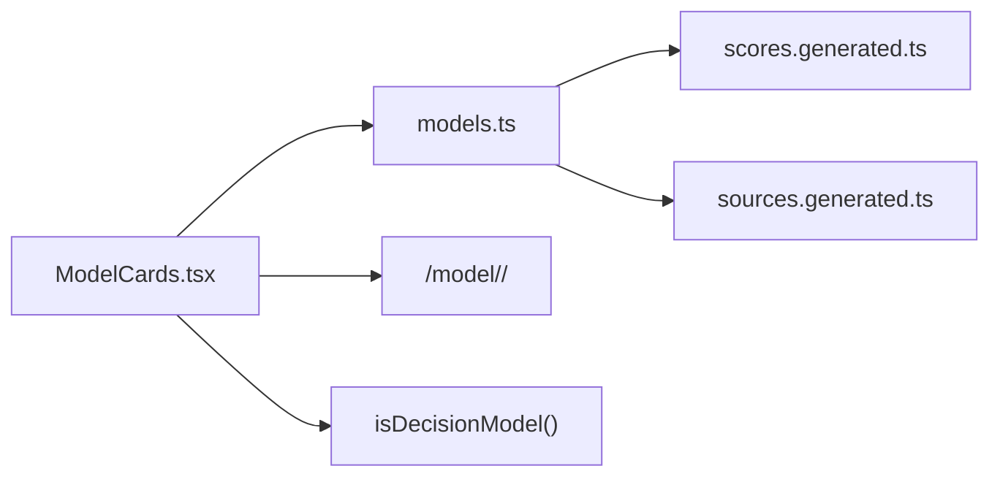

# ModelCards Display Component

<cite>
**Referenced Files in This Document**
- [ModelCards.tsx](file://src/components/ModelCards.tsx)
- [models.ts](file://src/data/models.ts)
- [meta.json](file://model/jev-1.13/meta.json)
- [README.md](file://model/README.md)
- [rules.md](file://.agents/rules.md)
</cite>

## Update Summary
**Changes Made**
- Added comprehensive documentation for the decision model architecture separation feature
- Updated component architecture section to include generative vs decision model filtering
- Enhanced card layout structure section with separate rendering shelves and amber borders
- Added new section explaining decision model categorization and scoring differences
- Updated interactive elements section with decision model specific UI patterns
- Added accessibility considerations for decision model separation
- Updated performance considerations to address dual-shelf rendering

## Table of Contents
1. [Introduction](#introduction)
2. [Project Structure](#project-structure)
3. [Core Components](#core-components)
4. [Architecture Overview](#architecture-overview)
5. [Detailed Component Analysis](#detailed-component-analysis)
6. [Decision Model Architecture Separation](#decision-model-architecture-separation)
7. [Dependency Analysis](#dependency-analysis)
8. [Performance Considerations](#performance-considerations)
9. [Troubleshooting Guide](#troubleshooting-guide)
10. [Conclusion](#conclusion)

## Introduction
The ModelCards component is the primary UI surface for browsing and comparing AI models. It renders a responsive grid of model cards, an exact-scores table, and mobile-friendly list summaries. The component displays model metadata (name, short description, context window, modalities, pricing), scores across six dimensions, and contextual badges such as Free or Paid. It supports two display modes:

- Cards view: a responsive card grid with summary information per model.
- List view: a sortable table on desktop and a stacked list on mobile.

The component integrates with the project's data pipeline so that every displayed number comes from pre-parsed benchmark results rather than hardcoded values. **Updated**: The component now implements a sophisticated decision model architecture separation that filters models into generative vs decision categories with separate rendering shelves, amber borders for decision models, and explanatory text about score comparability.

## Project Structure
ModelCards lives under `src/components` and consumes typed model data from `src/data/models.ts`. The data layer imports auto-generated score and source registries produced by the build-time sync script.

**Diagram sources**
- [ModelCards.tsx:1-4](file://src/components/ModelCards.tsx#L1-L4)
- [models.ts:6-16](file://src/data/models.ts#L6-L16)
- [models.ts:18-19](file://src/data/models.ts#L18-L19)
- [README.md:31-44](file://README.md#L31-L44)

**Section sources**
- [README.md:31-44](file://README.md#L31-L44)
- [README.md:61-72](file://README.md#L61-L72)

## Core Components
ModelCards is a Qwik component that receives:

- `source`: the active results view (average, virtual dimension views, or a reporting agent).
- `onSource$`: a QRL callback to update the global results view.

Internally, it manages:

- `displayCount`: how many models are initially rendered before "Show more".
- `view`: whether the user is in cards or list mode.
- `query`: the current search query string for live filtering.
- `sortDim` and `isVirtualView`: derived state indicating whether the current view ranks by a specific dimension.

It computes a filtered and sorted list of models based on the selected source and search query, then renders either cards or a list/table depending on the view mode.

Key responsibilities:

- Present model identity and navigation links.
- Show Overall score prominently.
- Render Free/Paid status using curated metadata.
- Display short description and contextual details.
- Render six dimension scores.
- Provide sorting controls for both table headers and mobile filter chips.
- Paginate large datasets through incremental loading.
- Handle live search filtering by name, ID, or short description.
- Manage search state and reset pagination when search is applied.
- **New**: Filter models into generative vs decision categories with separate rendering shelves.
- **New**: Apply amber borders and distinct styling for decision model cards.
- **New**: Display explanatory text about score comparability between model types.

**Section sources**
- [ModelCards.tsx:6-28](file://src/components/ModelCards.tsx#L6-L28)

## Architecture Overview
The component follows a unidirectional data flow with enhanced search capabilities and decision model separation:

1. The parent route or page supplies the active `source`.
2. ModelCards filters and sorts `MODELS` according to that source.
3. For non-average sources, it temporarily swaps each model's `scores` with the selected source's scores.
4. **New**: Apply decision model architecture separation using `isDecisionModel()` function.
5. **New**: Split models into `generativeShown` and `decisionShown` arrays.
6. **New**: Apply live search filtering separately to each category.
7. It renders the selected view (cards or list) for generative models.
8. **New**: Renders a separate shelf below for decision models with amber borders.
9. Sorting changes call back into the parent via `onSource$`.

**Diagram sources**
- [ModelCards.tsx:1-28](file://src/components/ModelCards.tsx#L1-L28)
- [models.ts:243-274](file://src/data/models.ts#L243-L274)
- [models.ts:220-241](file://src/data/models.ts#L220-L241)
- [models.ts:118-121](file://src/data/models.ts#L118-L121)

## Detailed Component Analysis

### Card Layout Structure
Each generative model card is an `<article>` element containing:

- A header row with the model name link and Overall badge.
- A Free or Paid fallback badge derived from `meta.noFreeId`.
- A short description paragraph.
- A definition list showing Context, Modalities, and Pricing.
- A compact line listing all six dimension scores.

This structure keeps the most important information visible while allowing users to scan quickly.

**Diagram sources**
- [ModelCards.tsx:74-125](file://src/components/ModelCards.tsx#L74-L125)

**Section sources**
- [ModelCards.tsx:74-125](file://src/components/ModelCards.tsx#L74-L125)

### Content Organization
The component organizes content into three layers:

1. **Identity and ranking:** name, slug-based navigation, and Overall score.
2. **Contextual metadata:** context window, modalities, and pricing notes or tiers.
3. **Scores:** six normalized dimensions plus Overall.

Pricing can be a single note or multiple tiers. When `pricingTiers` exists, the list view shows each tier; otherwise, it falls back to `pricingNote`.

**Section sources**
- [ModelCards.tsx:88-122](file://src/components/ModelCards.tsx#L88-L122)
- [ModelCards.tsx:232-239](file://src/components/ModelCards.tsx#L232-L239)
- [ModelCards.tsx:325-334](file://src/components/ModelCards.tsx#L325-L334)

### Live Search Filtering System
The component implements a comprehensive search system that allows users to filter models in real-time.

#### Search State Management
- Uses a `query` signal to store the current search input
- Automatically resets pagination (`displayCount`) when search is applied
- Trims and lowercases the query for case-insensitive matching

#### Search Criteria
The search filters models based on three fields:
- **Name**: Full model name matching
- **ID**: Provider identifier matching  
- **Short**: Short description matching

#### User Interface Elements
- **Search Input Field**: Dedicated search box with placeholder text "Search models…"
- **Clear Button**: Appears when search is active, allows quick reset
- **Result Counter**: Shows "X of Y models" when search is active
- **Empty State**: Displays helpful message when no matches are found

**Diagram sources**
- [ModelCards.tsx:17-39](file://src/components/ModelCards.tsx#L17-L39)
- [ModelCards.tsx:85-124](file://src/components/ModelCards.tsx#L85-L124)

**Section sources**
- [ModelCards.tsx:17-39](file://src/components/ModelCards.tsx#L17-L39)
- [ModelCards.tsx:85-124](file://src/components/ModelCards.tsx#L85-L124)

### Responsive Design Patterns
ModelCards uses Tailwind utility classes to adapt between screens:

- Cards grid: one column on small screens, two columns on medium screens, three columns on large screens.
- List view:
  - Desktop: a full table with fixed column widths and horizontal scrolling if needed.
  - Mobile: a set of sort buttons and stacked list cards per model.
- Typography scales up on larger screens for headings.
- Dark mode colors are applied consistently across light and dark themes.

**Diagram sources**
- [ModelCards.tsx:74-76](file://src/components/ModelCards.tsx#L74-L76)
- [ModelCards.tsx:128-138](file://src/components/ModelCards.tsx#L128-L138)
- [ModelCards.tsx:245-279](file://src/components/ModelCards.tsx#L245-L279)
- [ModelCards.tsx:280-338](file://src/components/ModelCards.tsx#L280-L338)

**Section sources**
- [ModelCards.tsx:74-76](file://src/components/ModelCards.tsx#L74-L76)
- [ModelCards.tsx:128-138](file://src/components/ModelCards.tsx#L128-L138)
- [ModelCards.tsx:245-279](file://src/components/ModelCards.tsx#L245-L279)
- [ModelCards.tsx:280-338](file://src/components/ModelCards.tsx#L280-L338)

### Styling System, Hover Effects, and Interactive Elements
Styling is primarily handled through Tailwind utilities:

- Borders, shadows, rounded corners, and spacing define card boundaries.
- Hover effects apply color transitions on links and inactive buttons.
- Focus rings ensure keyboard accessibility.
- Active states highlight the selected view toggle and active sort controls.
- Dark mode variants are included for backgrounds, text, borders, and badges.

Interactive elements include:

- Cards/List toggle buttons with `aria-pressed`.
- Model name links navigating to `/model/<slug>/`.
- Table header buttons that trigger sorting by dimension or Overall.
- Mobile sort chips that also trigger sorting.
- "Show more" button to incrementally load additional models.
- "Show all" button in list view to expand the dataset.
- Search input field with real-time filtering.
- Clear search button that appears when search is active.
- **New**: Amber-bordered decision model cards with distinct visual treatment.
- **New**: Decision model badges and explanatory text sections.

**Section sources**
- [ModelCards.tsx:36-65](file://src/components/ModelCards.tsx#L36-L65)
- [ModelCards.tsx:77-87](file://src/components/ModelCards.tsx#L77-L87)
- [ModelCards.tsx:147-195](file://src/components/ModelCards.tsx#L147-L195)
- [ModelCards.tsx:245-279](file://src/components/ModelCards.tsx#L245-L279)
- [ModelCards.tsx:341-364](file://src/components/ModelCards.tsx#L341-L364)
- [ModelCards.tsx:85-114](file://src/components/ModelCards.tsx#L85-L114)

### Integration with Model Data Structures
ModelCards depends on:

- `MODELS`: hydrated model objects including scores, sources, and metadata.
- `DIMENSIONS`: ordered axis definitions used for rendering tables and lists.
- `sortSourceFor`: maps a dimension key to a results view key.
- `virtualDimFor`: detects whether the current view is a virtual dimension sort.
- **New**: `isDecisionModel`: function to categorize models as generative or decision type.

The data layer hydrates models from:

- Pre-parsed scores from `scores.generated.ts`.
- Source registry from `sources.generated.ts`.
- Curated metadata from `model/<slug>/meta.json`.

**Diagram sources**
- [models.ts:46-77](file://src/data/models.ts#L46-L77)
- [models.ts:121-161](file://src/data/models.ts#L121-L161)
- [ModelCards.tsx:1-4](file://src/components/ModelCards.tsx#L1-L4)
- [models.ts:118-121](file://src/data/models.ts#L118-L121)

**Section sources**
- [ModelCards.tsx:1-4](file://src/components/ModelCards.tsx#L1-L4)
- [models.ts:46-77](file://src/data/models.ts#L46-L77)
- [models.ts:121-161](file://src/data/models.ts#L121-L161)
- [models.ts:220-241](file://src/data/models.ts#L220-L241)

### Formatting Utilities and Metadata Rendering
Formatting behavior is driven by metadata and dimension definitions:

- `meta.contextWindow` and `meta.modalities` are rendered directly.
- `meta.pricingNote` is the default pricing string.
- `meta.pricingTiers` overrides pricing when present.
- `meta.freeTierNote` provides tooltip text for Free badges.
- `meta.noFreeId` switches the badge to a paid fallback.
- `meta.category` determines model paradigm (generative vs decision).
- Dimension labels come from `DIMENSIONS`, ensuring consistent ordering and descriptions.

**Section sources**
- [ModelCards.tsx:105-122](file://src/components/ModelCards.tsx#L105-L122)
- [ModelCards.tsx:232-239](file://src/components/ModelCards.tsx#L232-L239)
- [ModelCards.tsx:308-334](file://src/components/ModelCards.tsx#L308-L334)
- [models.ts:121-161](file://src/data/models.ts#L121-L161)

### Accessibility Considerations
ModelCards includes several accessibility features:

- Semantic section and heading structure with `aria-labelledby`.
- Grouped toggle buttons with `role="group"` and `aria-pressed`.
- Table headers with `scope="col"` and `aria-sort`.
- Sort buttons expose descriptive `aria-label` and `title` attributes.
- Keyboard focus styles are provided through focus rings.
- Links to model detail pages use meaningful hrefs.
- Search input has proper `label` and `aria-label` attributes.
- Search results counter uses `aria-live="polite"` for screen reader announcements.
- Clear search button has descriptive `aria-label`.
- **New**: Decision model section uses semantic heading hierarchy with `h3` tags.
- **New**: Decision model cards maintain proper accessibility attributes and contrast ratios.

Potential improvements could include:

- Adding `aria-live` regions around dynamic "Show more" updates.
- Providing skip links if this section appears deep in a page.
- Ensuring screen reader announcements for pagination changes.
- Considering debouncing for search input to improve performance.

**Section sources**
- [ModelCards.tsx:31-36](file://src/components/ModelCards.tsx#L31-L36)
- [ModelCards.tsx:36-65](file://src/components/ModelCards.tsx#L36-L65)
- [ModelCards.tsx:147-195](file://src/components/ModelCards.tsx#L147-L195)
- [ModelCards.tsx:245-279](file://src/components/ModelCards.tsx#L245-L279)
- [ModelCards.tsx:85-119](file://src/components/ModelCards.tsx#L85-L119)

### Example Customization Patterns
Customizing ModelCards typically involves adjusting its props or surrounding state:

- Change the initial view by updating the parent's `source` value.
- Adjust pagination by modifying the initial `displayCount` signal or adding a prop.
- Extend metadata display by reading additional fields from `AiModel.meta`.
- Add new dimension badges by extending `DIMENSIONS` and corresponding score fields.
- Customize styling by overriding Tailwind classes or introducing theme tokens.
- Modify search criteria by extending the filter logic in the query processing.
- Customize search UI by modifying the search input and clear button components.
- **New**: Modify decision model categorization by extending the `isDecisionModel` function.
- **New**: Customize decision model styling by adjusting amber border classes and decision-specific UI elements.

Because the component reads from generated data structures, adding a new model requires only:

1. Create `model/<slug>/meta.json`.
2. Add findings files.
3. Run the sync script.
4. Rebuild.

**Section sources**
- [ModelCards.tsx:13-28](file://src/components/ModelCards.tsx#L13-L28)
- [README.md:84-91](file://README.md#L84-L91)

## Decision Model Architecture Separation

### Overview
The ModelCards component now implements a sophisticated decision model architecture separation that distinguishes between generative models (which produce text outputs) and decision models (System-One models that return typed judgments). This separation ensures that scores from different model paradigms are not compared inappropriately.

### Model Categorization
Models are categorized using the `category` field in their metadata:

- **Generative models** (default): Text-generating models like GPT, Claude, Gemini, etc.
- **Decision models**: System-One models like Jev that return typed judgments (Choice, Score, yes/no probability).

The categorization is handled by the `isDecisionModel()` function which checks `m.meta.category === "decision"`.

### Separate Rendering Shelves
The component splits models into two distinct rendering areas:

1. **Generative Models Shelf**: Contains standard model cards with Overall scores, dimension scores, and comparison capabilities.
2. **Decision Models Shelf**: A separate section below with amber borders, displaying decision models with their native specifications.

**Diagram sources**
- [ModelCards.tsx:31-41](file://src/components/ModelCards.tsx#L31-L41)
- [ModelCards.tsx:423-467](file://src/components/ModelCards.tsx#L423-L467)

### Visual Distinction
Decision models receive distinct visual treatment:

- **Amber borders**: `border-amber-200` and `dark:border-amber-900` for clear visual separation.
- **Decision badges**: Amber-colored badges labeled "Decision" instead of Overall scores.
- **Native specifications**: Different metadata fields displayed (state budget, I/O shape) instead of traditional metrics.
- **Explanatory text**: Clear messaging about why decision models are separated and not comparable to generative Overall scores.

### Scoring Philosophy
The separation addresses fundamental differences in how models are evaluated:

- **Generative models**: Scored on traditional dimensions (tool use, reasoning, context, cost, coding, multimodal) with an Overall composite score.
- **Decision models**: Scored on different axes appropriate for typed judgment systems, making them incomparable to generative Overall scores.

### Implementation Details
The decision model separation is implemented through:

1. **Categorization**: `const generativeShown = shown.filter((m) => !isDecisionModel(m))`
2. **Separation**: `const decisionShown = shown.filter((m) => isDecisionModel(m))`
3. **Independent filtering**: Both categories support separate search filtering
4. **Conditional rendering**: Decision shelf only appears when decision models exist

**Section sources**
- [ModelCards.tsx:31-41](file://src/components/ModelCards.tsx#L31-L41)
- [ModelCards.tsx:423-467](file://src/components/ModelCards.tsx#L423-L467)
- [models.ts:118-121](file://src/data/models.ts#L118-L121)
- [meta.json:1-10](file://model/jev-1.13/meta.json#L1-L10)

## Dependency Analysis
ModelCards has clear dependencies:

- Direct imports from `../data/models.ts`.
- Indirect reliance on generated score and source registries.
- Routing assumptions for model detail pages.
- **New**: Reliance on `isDecisionModel()` function for model categorization.

**Diagram sources**
- [ModelCards.tsx:1-4](file://src/components/ModelCards.tsx#L1-L4)
- [models.ts:18-19](file://src/data/models.ts#L18-L19)
- [models.ts:118-121](file://src/data/models.ts#L118-L121)

**Section sources**
- [ModelCards.tsx:1-4](file://src/components/ModelCards.tsx#L1-L4)
- [models.ts:18-19](file://src/data/models.ts#L18-L19)

## Performance Considerations
ModelCards implements several performance-oriented patterns:

- **Incremental rendering:** Only the first nine models are rendered initially. Additional models are loaded by clicking "Show more."
- **List-only expansion:** In list view, a "Show all" button allows expanding to the full dataset without forcing immediate rendering of every model.
- **Filtered and sorted data:** Filtering and sorting happen once per source change, not per rendered item.
- **Generated data:** Scores and sources are pre-parsed at build time, avoiding heavy markdown parsing in the client bundle.
- **Responsive layout:** CSS-driven responsive grids and hidden desktop tables reduce unnecessary DOM complexity on mobile.
- **Real-time search optimization:** Search filtering operates on already filtered and sorted data, minimizing redundant computations.
- **Pagination reset:** Search automatically resets pagination to show initial results, preventing performance issues with large filtered datasets.
- **New**: **Dual-shelf rendering optimization**: Decision models are filtered and rendered separately, reducing unnecessary DOM operations for generative models.
- **New**: **Conditional rendering**: Decision shelf only renders when decision models exist, avoiding empty container overhead.

Recommendations for very large datasets:

- Consider virtualized lists if the number of models grows significantly beyond current expectations.
- Debounce or throttle expensive sorting operations if additional client-side filtering is added.
- Keep generated data minimal by ensuring the sync script excludes unnecessary fields.
- Use lazy loading for images or heavy assets if future card designs include media.
- Consider implementing search debouncing for extremely large datasets to reduce frequent re-renders.
- **New**: Consider optimizing decision model filtering if the number of decision models grows significantly.

**Section sources**
- [ModelCards.tsx:14-28](file://src/components/ModelCards.tsx#L14-L28)
- [ModelCards.tsx:341-364](file://src/components/ModelCards.tsx#L341-L364)
- [ModelCards.tsx:85-124](file://src/components/ModelCards.tsx#L85-L124)
- [models.ts:6-16](file://src/data/models.ts#L6-L16)

## Troubleshooting Guide
Common issues and resolutions:

| Symptom | Likely Cause | Resolution |
|---|---|---|
| Models do not appear | Missing or invalid `meta.json` or missing average scores | Run `pnpm sync` and rebuild; check required metadata fields |
| Wrong scores shown | Incorrect `source` value passed to ModelCards | Verify parent page state and `onSource$` callback |
| Sorting does not work | `sortSourceFor` mapping mismatch or missing dimension | Confirm `DIMENSIONS` and `VIRTUAL_VIEWS` alignment |
| Free/Paid badge incorrect | `noFreeId` or missing `freeTierNote` | Update `meta.json` with correct pricing metadata |
| Large dataset feels slow | Too many models rendered at once | Rely on "Show more" or add virtualization |
| Build warns about missing data | Sync script was not run after adding findings | Run `pnpm sync` before building |
| Search not working | Invalid search query or empty model fields | Check model data integrity and search field availability |
| Search results not updating | Signal not properly reactive | Verify Qwik signal usage and event handlers |
| Clear button not appearing | Query state not properly managed | Check query signal initialization and conditional rendering |
| **New**: Decision models not appearing | Missing `category: "decision"` in meta.json | Add `"category": "decision"` to model's meta.json |
| **New**: Decision models in wrong shelf | `isDecisionModel()` function not working correctly | Verify model category field and function implementation |
| **New**: Amber borders not showing | Tailwind configuration issue or class name error | Check amber border classes and Tailwind setup |
| **New**: Decision shelf not separating models | `isDecisionModel()` import or usage error | Verify function import and proper usage in filtering logic |

**Section sources**
- [models.ts:79-119](file://src/data/models.ts#L79-L119)
- [models.ts:190-218](file://src/data/models.ts#L190-L218)
- [models.ts:220-241](file://src/data/models.ts#L220-L241)
- [README.md:84-91](file://README.md#L84-L91)
- [ModelCards.tsx:85-124](file://src/components/ModelCards.tsx#L85-L124)

## Conclusion
ModelCards provides a clear, accessible, and responsive interface for exploring AI models. It separates concerns cleanly:

- The component handles presentation, interaction, and pagination.
- The data layer hydrates models from generated scores and curated metadata.
- The build pipeline ensures numbers remain synchronized with research files.

**Updated**: The addition of live search filtering and decision model architecture separation significantly enhances the user experience. Users can now quickly find specific models through real-time filtering while benefiting from clear visual distinction between generative and decision models. The decision model separation ensures that scores from different model paradigms are not compared inappropriately, providing more accurate and meaningful comparisons within each model category.

Its design supports customization, accessibility, and scalability. For future growth, the component is well positioned to adopt virtualization, richer metadata, and additional interactive features while maintaining its current separation of data and presentation. The search implementation and decision model separation provide solid foundations for potential enhancements like advanced filtering options, search history, saved searches, and expanded model paradigm support.